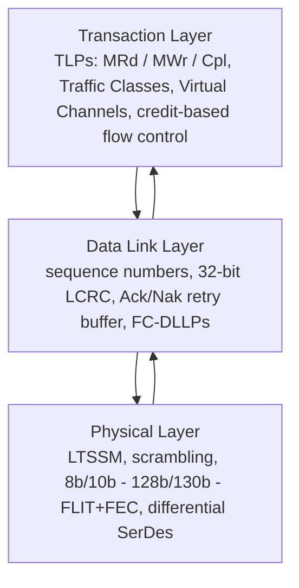
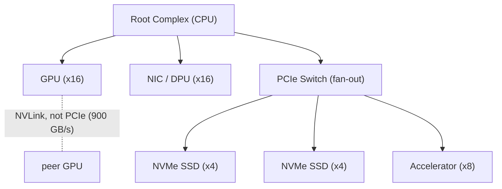

# PCIe — Architecture, Generations, Protocol Deep Dive, and Roadmap

## Introduction: Why PCIe Is the Spine of the Server

Peripheral Component Interconnect Express (PCIe) is the most important interconnect inside a server that most people never think about. It is the bus that connects the CPU to the GPU, to the network interface card, to NVMe storage, to accelerators, and — through its cache-coherent superset CXL — to disaggregated memory. Every byte that a GPU stages from host memory before a training run, every NVMe read that feeds a data pipeline, every packet a NIC delivers to a host buffer, traverses PCIe. In an AI server, PCIe is not the headline interconnect — that distinction belongs to NVLink and InfiniBand — but it is the indispensable substrate that connects the accelerators to the rest of the system and that, increasingly, defines the boundary between what stays electrical and what must go optical.

This chapter develops PCIe from its origins through its layered protocol architecture, its generational roadmap from 2.5 GT/s to a projected 128 GT/s, its power-management machinery, its specific roles and bottlenecks in the AI datacenter, and the competitive ecosystem of silicon vendors, IP providers, and rival interconnects that surround it. PCIe is also the foundation on which CXL is built (File 04) and a candidate for optical extension (Files 13, 24), so a thorough understanding of PCIe is prerequisite to much of the rest of this database.

## PCIe Fundamentals and History

### From Parallel Buses to Serial Point-to-Point

PCIe was conceived around 2001–2003 as the successor to two aging parallel-bus technologies: the **PCI bus** (a shared, parallel, multi-drop bus running at 33 or 66 MHz) and the **AGP (Accelerated Graphics Port)** (a point-to-point enhancement of PCI dedicated to graphics). The parallel, shared-bus architecture had reached fundamental limits. A parallel bus sends many bits simultaneously across many wires, and as clock speeds rise, **skew** — the difference in arrival time among the parallel bits caused by tiny differences in trace length and loading — becomes unmanageable. A shared bus also forces all devices to arbitrate for a single set of wires, so aggregate bandwidth does not scale with the number of devices; adding devices makes contention worse, not better.

The PCI-SIG (PCI Special Interest Group), the industry consortium stewarding the standard, chose a fundamentally different architecture for PCIe: **serial, differential, point-to-point links**. Instead of a shared parallel bus, each device gets a dedicated link to a switch or root complex; instead of many single-ended parallel wires clocked together, data is sent serially over a small number of differential pairs, each carrying an embedded clock recovered by the receiver, eliminating skew. This is the same architectural shift that every high-speed interconnect made in the same era (the move from parallel ATA to Serial ATA, from parallel SCSI to SAS, from the front-side bus to point-to-point processor interconnects), and for the same reasons.

The first **PCIe 1.0 specification (2003)** defined a 2.5 GT/s (gigatransfers per second) per-lane signaling rate. The genius of the design was its scalability through **lane aggregation**: a PCIe link is built from one or more **lanes**, each lane being one differential pair in each direction (transmit and receive), and a device can use x1, x2, x4, x8, x16, or x32 lanes to trade bandwidth for pin count and cost. A graphics card uses x16; an NVMe SSD typically uses x4; a low-bandwidth peripheral uses x1. The same protocol runs over all widths.

### The Physical Layer: Lanes, Pairs, and Connectors

Each PCIe lane consists of two differential pairs: **TX+/TX−** for transmit and **RX+/RX−** for receive, enabling full-duplex communication. Differential signaling — transmitting the signal and its inverse on two closely coupled wires and taking the difference at the receiver — rejects common-mode noise picked up equally by both wires, which is essential at the multi-gigahertz frequencies PCIe operates at. The pairs are AC-coupled (capacitors block DC), allowing the transmitter and receiver to operate at different common-mode voltages.

PCIe manifests in many physical connector forms:
- **CEM (Card ElectroMechanical)** — the familiar gold-finger slot connector on motherboards, available in x1, x4, x8, and x16 lengths, with mechanical keying that allows a shorter card to plug into a longer slot.
- **M.2** — the small edge connector ubiquitous for NVMe SSDs in laptops and servers, carrying up to x4 PCIe.
- **U.2 (SFF-8639)** — a 2.5-inch drive connector carrying x4 PCIe, used for hot-swappable datacenter NVMe drives.
- **OCuLink** — a cabled PCIe connector for internal and short external connections.
- **EDSFF (Enterprise and Datacenter SSD Form Factor)** — the modern family (E1.S, E1.L, E3.S, E3.L) designed specifically for datacenter NVMe density, thermals, and serviceability, now the dominant form factor for new datacenter flash.

A crucial property is **mechanical and electrical backward compatibility**: a PCIe 5.0 card works in a PCIe 3.0 slot (at PCIe 3.0 speed), and a x4 card works in a x16 slot. The link negotiates the highest common speed and the available width during link training.

## PCIe Generations: The Speed Roadmap

The defining rhythm of PCIe is the roughly-every-three-years doubling of per-lane bandwidth. Each generation has either doubled the signaling rate or changed the modulation/encoding to extract more bits per transfer. The following table and discussion give the full detail.

| Gen | Year | Rate/lane (GT/s) | Encoding | x16 bandwidth (per direction) | Key adoption |
|---|---|---|---|---|---|
| 1.0 | 2003 | 2.5 | 8b/10b | ~4 GB/s | Early graphics, first PCIe systems |
| 2.0 | 2007 | 5.0 | 8b/10b | ~8 GB/s | Mainstream graphics, RAID |
| 3.0 | 2010 | 8.0 | 128b/130b | ~15.75 GB/s | NVMe era begins, GPGPU |
| 4.0 | 2017 | 16 | 128b/130b | ~31.5 GB/s | AMD Ryzen/EPYC, Gen4 NVMe |
| 5.0 | 2019 | 32 | 128b/130b | ~63 GB/s | Sapphire Rapids, Genoa, CXL 1.1/2.0 |
| 6.0 | 2022 | 64 | PAM4 + FLIT, FEC | ~126 GB/s | CXL 3.0, AI servers (emerging) |
| 7.0 | ~2025 spec | 128 | PAM4 + FLIT | ~256–512 GB/s | Optical PCIe, next-gen AI/CXL |

### Generation-by-Generation Detail

**PCIe 1.0 (2003): 2.5 GT/s, 8b/10b encoding.** The original used **8b/10b encoding**, in which every 8 bits of data are transmitted as a 10-bit symbol. This encoding guarantees enough transitions for clock recovery and maintains DC balance (equal ones and zeros over time, required for AC coupling), but it imposes a brutal **20% overhead**: only 8 of every 10 transmitted bits carry data. Thus a 2.5 GT/s lane delivers 2.0 Gbps of usable data (250 MB/s), and a x16 link delivers roughly 4 GB/s per direction.

**PCIe 2.0 (2007): 5.0 GT/s, 8b/10b.** A straightforward doubling of the signaling rate to 5.0 GT/s, retaining 8b/10b encoding, doubling usable bandwidth to ~8 GB/s for a x16 link.

**PCIe 3.0 (2010): 8.0 GT/s, 128b/130b.** Rather than doubling the rate to 10 GT/s (which would have strained the channel), PCIe 3.0 raised the rate to 8.0 GT/s but switched to **128b/130b encoding**, which adds only a 2-bit sync header to every 128 bits of payload — overhead of about 1.5% instead of 20%. The combination of a 1.6× rate increase and the encoding-efficiency gain produced an effective doubling of usable bandwidth to ~15.75 GB/s for x16. PCIe 3.0 became the workhorse generation of the early NVMe and GPGPU era and remained common for the better part of a decade.

**PCIe 4.0 (2017): 16 GT/s, 128b/130b.** A doubling to 16 GT/s, retaining 128b/130b. PCIe 4.0 is notable for being the generation where **AMD seized the initiative**: the Ryzen 3000 desktop platform (2019) was the first mainstream consumer platform to ship PCIe 4.0, ahead of Intel, and EPYC "Rome" brought it to servers. PCIe 4.0 x16 delivers ~31.5 GB/s per direction.

**PCIe 5.0 (2019): 32 GT/s, 128b/130b.** Another doubling to 32 GT/s. PCIe 5.0 is the generation of the current AI-server mainstream: Intel **Sapphire Rapids** and AMD **Genoa** server CPUs provide PCIe 5.0, and it is the host interface for NVIDIA's H100-class GPUs and ConnectX-7 NICs. A x16 PCIe 5.0 link delivers ~63 GB/s per direction (~126 GB/s aggregate bidirectional). PCIe 5.0 is also the physical layer for CXL 1.1 and CXL 2.0. At 32 GT/s, signal integrity becomes severe enough that **retimers** are frequently required for traces longer than roughly 8–10 inches.

**PCIe 6.0 (2022): 64 GT/s, PAM4 + FLIT, mandatory FEC.** PCIe 6.0 is the most architecturally significant jump since the original. Doubling the signaling rate again would have been impossible on standard FR4 PCB channels, so PCIe 6.0 changed the modulation from NRZ to **PAM4** (four levels, two bits per symbol), keeping the baud rate at 32 Gbaud while doubling the data rate to 64 GT/s. As established in File 02, PAM4 costs roughly 9.5 dB of SNR, raising the raw error rate to a level that NRZ-era PCIe never tolerated. To cope, PCIe 6.0 introduced two fundamental changes:

- **FLIT (Flow Control Unit) encoding**: instead of the old variable-length TLP/DLLP framing with 128b/130b encoding, PCIe 6.0 packages traffic into fixed-size **242-byte FLITs**. Each FLIT contains a fixed structure: 236 bytes of TLP payload, a 6-byte CRC, and forward-error-correction parity. Fixed-size FLITs simplify the data path, enable inline FEC, and make flow control more efficient.
- **Mandatory Forward Error Correction**: because PAM4's raw BER is too high, PCIe 6.0 mandates a lightweight FEC inside each FLIT. The FEC is deliberately weak and low-latency (correcting a small number of symbol errors), paired with the CRC and the existing link-layer retry mechanism for the rare errors the FEC cannot correct. The design target is to add only about 1–2 nanoseconds of latency for FEC decode while keeping the effective error rate acceptable. PCIe 6.0 defines **L-FEC (lightweight)** as the standard inline mode, with the retry mechanism handling residual errors.

PCIe 6.0 also introduced the **L0p** low-power active state (discussed below), which allows dynamic lane-width reduction without bringing the link down. A x16 PCIe 6.0 link delivers ~126 GB/s per direction.

**PCIe 7.0 (specification targeted ~2025, products later): 128 GT/s.** PCIe 7.0 doubles the rate again to 128 GT/s, retaining PAM4 (so the baud rate rises to 64 Gbaud) and the FLIT/FEC architecture. At 128 GT/s, the channel-loss budget on conventional PCB becomes extreme; PCIe 7.0 will require aggressive equalization, will almost certainly require retimers at very short distances, and is the first generation where **optical PCIe** — running PCIe over fiber using pluggable optical modules — becomes a mainstream consideration rather than a research curiosity. The OIF's **CEI-224G** electrical interface work provides the SerDes basis, and PCI-SIG has an active optical workstream. A x16 PCIe 7.0 link targets on the order of 256 GB/s per direction (512 GB/s aggregate), bandwidth that begins to approach what AI accelerators demand for host-attached memory and coherent fabrics.

## The PCIe Protocol Stack: Three Layers

*Figure 3.1 — The three-layer PCIe protocol stack. Transactions flow down at the sender and up at the receiver; the data-link layer provides reliable delivery (retry) and lossless flow control (credits) that CXL and InfiniBand echo at larger scales.*

PCIe's protocol is organized into three layers, conceptually analogous to (but distinct from) the OSI layers: the **Transaction Layer**, the **Data Link Layer**, and the **Physical Layer**. Data flows down the stack at the transmitter (transaction → data link → physical) and up the stack at the receiver. Understanding these layers is essential because CXL (File 04) reuses the PCIe physical and (for CXL.io) transaction layers while adding its own coherence protocols, and because the layering explains where latency, reliability, and flow control come from.

### The Transaction Layer

The transaction layer is where requests originate. It packages operations into **TLPs (Transaction Layer Packets)**, the fundamental unit of PCIe communication. TLP types include:

- **Memory Read (MRd) and Memory Write (MWr)** — the workhorses, reading and writing system or device memory. Memory writes are **posted** (no completion expected — fire and forget at the transaction layer, with reliability provided below), while memory reads are **non-posted** (a completion carrying the data is required).
- **Configuration Read/Write (CfgRd/CfgWr)** — access to a device's configuration space, used during enumeration to discover and set up devices.
- **I/O Read/Write** — legacy access to the x86 I/O port space, largely vestigial in modern systems.
- **Message (Msg/MsgD)** — in-band signaling for interrupts (MSI/MSI-X are actually memory writes, but legacy INTx and various events use messages), power management, and error reporting.
- **Completion (Cpl/CplD)** — responses to non-posted requests; CplD carries data (for reads), Cpl carries only status (for writes that require acknowledgment).

A TLP header is either **3 double-words (12 bytes)** or **4 double-words (16 bytes)**, the longer form carrying a 64-bit address (versus 32-bit). Key header fields include:

- **Address** — 32-bit or 64-bit, identifying the target memory or I/O location.
- **Requester ID** — the **BDF (Bus number, Device number, Function number)** that uniquely identifies the originating function in the PCIe hierarchy, used to route completions back to the requester.
- **Tag** — an identifier that lets a requester have multiple outstanding non-posted requests in flight simultaneously; completions carry the matching tag so the requester can correlate responses. The tag field width (8, 10, or 14 bits in later specs) bounds the number of outstanding requests, which directly affects achievable bandwidth on high-latency links (bandwidth = outstanding data ÷ round-trip latency).
- **Attributes** — flags that modify ordering and caching behavior: **Relaxed Ordering (RO)** permits the fabric to reorder this transaction relative to others for performance; **No Snoop (NS)** tells the system the transaction need not be checked against CPU caches (used for data the CPU is known not to be caching); **ID-based Ordering (IDO)** relaxes ordering between transactions from different requesters.
- **Byte Enables** — fine-grained indication of which bytes within a double-word are valid.
- **TLP Digest** — an optional end-to-end CRC (ECRC) over the TLP, providing data-integrity coverage beyond the link-level CRC.

### The Data Link Layer

The data link layer turns the transaction layer's best-effort TLP stream into a **reliable, in-order** delivery service across a single link. It does this with two mechanisms: an acknowledgment/retry protocol and credit-based flow control, both carried by **DLLPs (Data Link Layer Packets)**.

**Reliable delivery (Ack/Nak):** Every TLP transmitted is assigned a **sequence number** and protected by a **32-bit LCRC (Link CRC)**. The transmitter keeps a copy of every TLP in a **retry buffer** until the receiver acknowledges it. The receiver checks the LCRC and sequence number of each arriving TLP; if correct and in order, it periodically sends an **Ack DLLP** carrying the highest sequence number successfully received, allowing the transmitter to free all TLPs up to that number from its retry buffer. If a TLP arrives with a bad LCRC or out of sequence, the receiver sends a **Nak DLLP**, and the transmitter **replays** all TLPs from the retry buffer starting after the last acknowledged sequence number. The sequence-number space is 12 bits (4,096 values), bounding the number of unacknowledged TLPs in flight. This retry mechanism is what makes PCIe reliable despite the occasional bit error — and in PCIe 6.0/7.0, it backstops the inline FEC for the rare errors FEC cannot correct.

**Flow control (credits):** PCIe never drops a TLP due to a full receiver buffer, because it uses **credit-based flow control**. Before sending a TLP, the transmitter must have sufficient credits, and the receiver advertises available buffer space as credits via **Flow Control (FC) DLLPs**. Credits are tracked separately for six categories, the cross product of three TLP classes and two resource types:
- **Posted Header / Posted Data** (for posted writes and messages),
- **Non-Posted Header / Non-Posted Data** (for reads and non-posted writes),
- **Completion Header / Completion Data** (for completions).

This separation prevents one class of traffic from starving another and is essential for deadlock avoidance: completions must be able to make progress even when posted and non-posted queues are full, which is why completions are flow-controlled separately. Each **Virtual Channel (VC)** has its own independent set of these six credit pools.

The data link layer also carries **power-management DLLPs** for transitioning the link between power states.

### The Physical Layer

The physical layer is divided into a **logical sub-block** and an **electrical sub-block**.

The **logical sub-block** handles encoding (8b/10b for Gen1/2, 128b/130b for Gen3–5, FLIT-based for Gen6+), scrambling, and the **ordered sets** that manage the link: **TS1 and TS2** training sequences (used to establish and configure the link), **EIEOS (Electrical Idle Exit Ordered Set)**, **SOS/SKP (Skip Ordered Set)** for clock-tolerance compensation between transmitter and receiver clocks, **EIOS (Electrical Idle Ordered Set)**, and **FTS (Fast Training Sequences)** used to re-synchronize when exiting low-power states. **Scrambling** applies a known pseudo-random sequence (generated by a linear-feedback shift register, classically the polynomial x¹⁶ + x⁵ + x⁴ + x³ + 1 for early generations, with different polynomials in later generations) to spread the signal's spectral energy and avoid repetitive patterns that would create EMI and degrade clock recovery.

The **electrical sub-block** handles the actual differential signaling: the transmitter's drive levels and de-emphasis/pre-emphasis equalization, the receiver's equalization (CTLE and DFE), AC coupling, and the analog details of meeting the signal-integrity budget.

The physical layer's behavior is governed by the **LTSSM (Link Training and Status State Machine)**, the heart of PCIe link management. Its principal states are:
- **Detect** — sensing whether a receiver is present on the other end.
- **Polling** — exchanging training sequences to establish bit and symbol lock and to agree on data rate.
- **Configuration** — negotiating link width (which lanes are usable), lane reversal, and lane-to-lane deskew.
- **Recovery** — re-establishing the link after errors or when changing speed; equalization for Gen3+ happens here.
- **L0** — the fully active, operational state.
- **L0s, L1, L2, L3** — progressively deeper power-saving states (detailed below).

When a link encounters errors or needs to change speed (for example, training up from Gen1 to Gen5 during initialization), it transitions through Recovery. The equalization process in Recovery — where transmitter and receiver iteratively tune their equalizer coefficients using known test patterns (such as PRBS sequences) — is what allows high-generation PCIe to function over lossy channels, and its convergence is a major focus of signal-integrity engineering.

**PCIe 6.0 FLIT mode** fundamentally restructures the physical-layer framing: rather than the variable-length, individually-framed TLPs of earlier generations, traffic is carried in fixed **242-byte FLITs**, each carrying potentially multiple small TLPs (or a portion of a large one), a CRC, and FEC. This restructuring is what enables the inline FEC required for PAM4 and is a prerequisite for the bandwidth efficiency of Gen6 and Gen7. The FEC decode adds a small, fixed latency (on the order of 1–2 ns) to every FLIT.

### Virtual Channels and Traffic Classes

PCIe supports up to **8 Virtual Channels (VC0–VC7)**, with VC0 mandatory and the rest optional. Each VC has its own flow-control credit pools and buffering, providing isolation between traffic classes. Traffic is tagged with one of **8 Traffic Classes (TC0–TC7)** in the TLP header, and a configurable **TC-to-VC mapping** assigns each traffic class to a virtual channel. This machinery provides quality of service: latency-sensitive traffic can be isolated in its own VC, immune to head-of-line blocking from bulk traffic in another VC. VC arbitration (round-robin or weighted round-robin among VCs, and strict-priority or round-robin among ports feeding a switch) determines how bandwidth is shared. In practice, most consumer and many server systems use only VC0, but multi-VC configurations appear in systems with strict QoS requirements.

### Address Translation, Virtualization, and Security

PCIe includes an extensive set of features for virtualization, isolation, and security that are essential in the multi-tenant datacenter:

- **SR-IOV (Single Root I/O Virtualization)** allows a single physical PCIe device to present itself as multiple virtual devices. A device exposes one **Physical Function (PF)** and many lightweight **Virtual Functions (VFs)**, each of which can be assigned directly to a virtual machine. This lets a VM drive a NIC or accelerator at near-native performance without the hypervisor mediating every transaction — critical for high-performance networking and GPU virtualization. A single ConnectX NIC, for instance, can expose dozens or hundreds of VFs to different VMs or containers.
- **ARI (Alternative Routing-ID Interpretation)** reinterprets the BDF to allow a single device to expose more than 8 functions (the legacy limit), enabling the large VF counts SR-IOV requires.
- **ACS (Access Control Services)** controls peer-to-peer traffic between PCIe endpoints, allowing or forcing peer-to-peer transactions to be routed up to the root complex (and thus through the IOMMU) for isolation. ACS is central to securely allowing or restricting direct GPU-to-GPU or GPU-to-NIC DMA.
- **PASID (Process Address Space Identifier)** tags transactions with the identity of the process whose address space they target, allowing the IOMMU to maintain per-process address translations. PASID enables **shared virtual memory** between a device and an application — a GPU or accelerator can operate directly on application virtual addresses, with the IOMMU translating them, rather than requiring pinned, physically-addressed buffers.
- **PCIe IDE (Integrity and Data Encryption)** encrypts and integrity-protects TLP payloads on the wire, providing confidentiality for data in transit across the PCIe link. IDE is a building block for confidential computing and trusted-execution environments, ensuring that data moving between a CPU and an accelerator (or a CXL memory device) cannot be observed or tampered with by a compromised intermediary.

The **IOMMU (Input/Output Memory Management Unit)** — Intel's VT-d, AMD's IOMMU, Arm's SMMU — sits between PCIe devices and system memory, translating device-visible (I/O virtual) addresses to physical addresses and enforcing access permissions. Together with PASID and ACS, the IOMMU is what makes it safe to give a VM direct control of a PCIe device: the device can only DMA to memory the IOMMU permits.

## PCIe Power Management Deep Dive

Power management is increasingly central to datacenter PCIe, where thousands of links each consuming a few watts add up to meaningful power and where idle links waste energy. PCIe defines a hierarchy of power states managed through the LTSSM and ASPM.

**ASPM (Active State Power Management)** automatically transitions a link to low-power states during idle periods, transparently to software:
- **L0s** is a fast, shallow low-power state entered when the link is briefly idle in one direction; exit latency is on the order of 100 nanoseconds. L0s saves modest power with minimal performance impact.
- **L1** is a deeper state with the transmitter and receiver electrical idle and PLLs potentially off; exit latency is microseconds (typically 1–4 µs). L1 saves more power but at a real latency cost on the next transaction.
- **L1 sub-states (L1.1 and L1.2)** push further, gating the common-mode keeper and, in L1.2, allowing the reference clock and PLL to be turned off entirely, with the link signaling its readiness via the **CLKREQ#** sideband. These sub-states are heavily used in mobile and in idle datacenter NVMe drives to minimize standby power.

Deeper still, **L2** is a near-off state with main power removed (only auxiliary power maintained for wake events), and **L3** is fully off.

**L0p**, introduced in PCIe 6.0, is a qualitatively different and important addition: it allows the link to **dynamically reduce its active lane width** without a full retraining cycle. A x16 link experiencing light traffic can power down 8 or 12 of its lanes, operating as a x8 or x4, and bring them back when traffic increases — all while remaining in the active L0 family of states. This is enormously valuable for **bursty traffic** (such as an AI accelerator that alternates between intense data-staging bursts and compute-bound idle periods), letting the link track its power consumption to its actual utilization rather than paying full x16 power continuously.

Storage devices add their own states: **DevSleep** (a low-power state for SATA/NVMe drives) and various NVMe-defined power states integrate with PCIe power management to minimize the standby power of the vast NVMe fleets in hyperscale storage.

## PCIe in the Datacenter Context

*Figure 3.2 — PCIe is a strict tree rooted at the CPU's root complex. Note that GPU-to-GPU traffic uses NVLink (dashed), not PCIe — PCIe is the CPU-to-GPU staging and GPU-to-NIC path, not the GPU-to-GPU training path (File 07).*

### GPU Connectivity and the PCIe Bandwidth Question

A common misconception is that PCIe is the bottleneck for GPU-to-GPU communication in AI training. It is not — and understanding why illuminates the whole architecture of the AI server. Consider an NVIDIA H100: its HBM3 memory delivers about **3.35 TB/s** of bandwidth, while a PCIe 5.0 x16 link delivers only about **63 GB/s** per direction — roughly **53× less**. If GPU-to-GPU communication had to traverse PCIe, training would be hopelessly bottlenecked.

The resolution is that GPU-to-GPU communication does **not** use PCIe; it uses **NVLink** (File 07, File 15), which provides 900 GB/s of bidirectional bandwidth per H100 GPU via NVSwitch — fourteen times the PCIe 5.0 x16 figure. PCIe's role in the AI server is different and complementary: it is the **CPU-to-GPU staging path** and the **GPU-to-NIC path**. PCIe carries the initial loading of data and parameters from host memory (and from storage and the network) into GPU memory, and it carries control and management traffic. For these roles, PCIe 5.0's 63 GB/s is adequate-but-tightening, which is precisely why CXL and faster PCIe generations matter: as models grow and data-staging demands rise, the CPU-GPU path becomes a real constraint, and the industry's answer is faster PCIe (Gen6, Gen7) and coherent CXL-attached memory.

### NVMe and NVMe-oF over PCIe

PCIe is the native transport for **NVMe (Non-Volatile Memory Express)**, the protocol that revolutionized flash storage by replacing the legacy AHCI/SATA command model with a design built for the parallelism of NAND flash and the low latency of PCIe. NVMe exposes up to **65,535 I/O queues**, each with up to **65,536 entries**, allowing massive parallelism — every CPU core can have its own queue pair to the drive, eliminating lock contention. End-to-end NVMe latency over PCIe is well under 100 microseconds, often in the low tens of microseconds for cached or SLC-buffered operations. NVMe's queue model is so well-suited to networking that **NVMe-oF (NVMe over Fabrics)** carries the same submission/completion queue semantics over RDMA, TCP, or Fibre Channel to access remote storage with latencies approaching local NVMe (File 18).

### PCIe Switches and Non-Transparent Bridging

When a system needs more PCIe endpoints than the CPU's root complex provides — for example, a server packing many NVMe drives or many accelerators — it uses **PCIe switches**. The dominant vendors are **Broadcom (the PLX/PEX series, acquired from PLX Technology)** and **Microchip (Switchtec, from the Microsemi acquisition)**. A PCIe switch fans out a single upstream port into multiple downstream ports, multiplexing many devices onto the CPU's lanes (and providing peer-to-peer paths between downstream devices, subject to ACS). **Non-Transparent Bridging (NTB)** is a switch feature that allows two independent PCIe hierarchies — for instance, two CPUs/hosts — to communicate across the switch while keeping their address spaces isolated, used in high-availability storage controllers and some multi-host systems.

### Retimers and Redrivers

As signaling rates climb, the passive PCB channel cannot carry the signal far enough, and **signal-conditioning chips** become mandatory. A **redriver** is an analog device that boosts and equalizes the signal but does not recover the clock; a **retimer** is a more sophisticated digital device that fully recovers the clock and data and retransmits a clean signal, effectively resetting the channel budget. Retimers are protocol-aware (they participate in LTSSM training) and can cascade to extend reach. The retimer market — **Texas Instruments, Parade Technologies, Astera Labs, Kandou, Montage**, and others — grew rapidly with PCIe 5.0, where channels longer than roughly 8–10 inches typically require a retimer, and is even more critical for PCIe 6.0/7.0, where retimers may be needed at much shorter distances. **Astera Labs** in particular built a substantial business and a high-profile IPO largely on PCIe/CXL retimers and "smart fabric" connectivity for AI servers, illustrating how the signal-integrity challenge at high PCIe speeds has spawned an entire silicon category.

### CXL: PCIe's Coherent Superset

CXL (Compute Express Link) is built directly on the PCIe physical layer — same electrical signaling, same connectors, same lanes — and reuses the PCIe transaction layer for its CXL.io sub-protocol while adding cache-coherence (CXL.cache) and memory-semantic (CXL.mem) protocols. CXL 1.1/2.0 run over PCIe 5.0; CXL 3.0 runs over PCIe 6.0. Because CXL devices appear to a legacy OS as PCIe devices, the standards are deeply intertwined. File 04 covers CXL in full depth; the key point here is that PCIe's physical and protocol foundations make it the natural substrate for the memory-disaggregation revolution.

### The PCIe 7.0 / Optical PCIe Challenge

At **128 GT/s (PCIe 7.0)**, the channel-loss budget on copper becomes nearly untenable for any meaningful reach. This is the inflection point at which **optical PCIe** moves from research to roadmap. Running PCIe over optical fiber — using pluggable optical modules or co-packaged optical engines, with the OIF **CEI-224G** electrical interface as the SerDes basis — would let PCIe (and CXL) extend beyond the few-inch reach of copper to meters, enabling rack-scale coherent fabrics and disaggregated memory pools connected optically. PCI-SIG has an active optical workgroup, and the convergence of optical PCIe with optical CXL and the broader co-packaged-optics movement (File 13) is one of the defining technology threads of the late-2020s.

## PCIe Competitive and Ecosystem Landscape

### The Silicon and IP Ecosystem

PCIe is implemented by a layered ecosystem:
- **Switch and retimer silicon**: Broadcom (PEX switches), Microchip (Switchtec switches), Astera Labs, Texas Instruments, Parade, Montage, and Kandou (signal conditioning and retimers).
- **Controller silicon**: Marvell, Microchip, and others build PCIe-based NVMe SSD controllers; NIC and accelerator vendors integrate PCIe controllers into their devices.
- **PCIe IP cores**: most chip designers do not build PCIe controllers from scratch; they license **PCIe controller and PHY IP** from **Synopsys (DesignWare)** and **Cadence**, the two dominant IP vendors. A modern SoC's PCIe interface is typically a Synopsys or Cadence controller plus a hardened PHY, integrated and verified against the PCI-SIG compliance program. This IP-licensing model is why PCIe interoperability is so robust: most of the industry's PCIe interfaces descend from a small number of well-verified IP cores.

### PCIe Versus Competing Interconnects

PCIe does not stand alone; it exists in a competitive landscape of interconnects, each optimized for a different niche:
- **NVLink (NVIDIA, proprietary)** provides far higher bandwidth (900 GB/s bidirectional per H100, 1.8 TB/s for Blackwell) for GPU-to-GPU scale-up, where PCIe's bandwidth is insufficient. NVLink is proprietary to NVIDIA.
- **UALink (Ultra Accelerator Link)** is an open standard backed by AMD, Intel, Broadcom, Cisco, Google, HPE, Meta, and Microsoft, explicitly created to provide an open alternative to NVLink for accelerator-to-accelerator scale-up. UALink targets ~200 GB/s-class bidirectional links and large scale-up domains, and it can use the PCIe physical layer as a transport option (File 24).
- **Gen-Z** was an earlier memory-semantic fabric effort that, along with **CCIX** (an Arm-led cache-coherent interconnect) and **OpenCAPI** (an IBM-led coherent interconnect), was ultimately folded into **CXL**. The consolidation of all these efforts into CXL — itself built on PCIe — is a striking illustration of PCIe's gravitational pull: rather than a proliferation of competing coherent interconnects, the industry converged on a single standard layered atop the universal PCIe substrate.

### PCIe Roadmap Summary

| Gen | Rate/lane | Encoding | x16 BW/dir | Signaling | Notable |
|---|---|---|---|---|---|
| 1.0 | 2.5 GT/s | 8b/10b | ~4 GB/s | NRZ | First PCIe |
| 2.0 | 5.0 GT/s | 8b/10b | ~8 GB/s | NRZ | — |
| 3.0 | 8.0 GT/s | 128b/130b | ~15.75 GB/s | NRZ | Efficient encoding |
| 4.0 | 16 GT/s | 128b/130b | ~31.5 GB/s | NRZ | AMD-led adoption |
| 5.0 | 32 GT/s | 128b/130b | ~63 GB/s | NRZ | AI mainstream, CXL 1.1/2.0, retimers common |
| 6.0 | 64 GT/s | FLIT + FEC | ~126 GB/s | PAM4 | FLIT, mandatory FEC, L0p, CXL 3.0 |
| 7.0 | 128 GT/s | FLIT + FEC | ~256 GB/s | PAM4 | Optical PCIe, extreme SI, CEI-224G |

## Extended Deep Dive: Bandwidth Efficiency, Outstanding Requests, and Real Throughput

The headline PCIe bandwidth figures (e.g., ~63 GB/s for a Gen5 x16) are raw link rates; the **achievable throughput** is lower and depends on subtle protocol factors that are worth understanding because they determine real device performance. First, there is **encoding and framing overhead**: the 128b/130b encoding of Gen3–5 costs ~1.5%, and the per-TLP overhead (header, sequence number, LCRC, framing) means that small transfers are far less efficient than large ones — a TLP carrying a 64-byte payload spends a substantial fraction of its bytes on the ~20+ bytes of header and framing, so the **effective efficiency rises with payload size** (the Maximum Payload Size, MPS, a negotiated parameter typically 256 or 512 bytes, caps this). Second, and more subtly, throughput on read operations is bounded by the **number of outstanding requests**: because a memory read is non-posted (a request goes out, a completion comes back later), the achievable read bandwidth equals the amount of data that can be in flight divided by the round-trip latency, and the amount in flight is limited by the **tag** field (which identifies outstanding requests) and the receiver's completion-credit availability. If the tag space or credits are too small relative to the link's latency-bandwidth product, reads cannot saturate the link regardless of its raw rate — which is why later PCIe generations expanded the tag field (to 10 and 14 bits) and why high-performance devices carefully manage outstanding-request depth. The practical lesson: PCIe's real throughput is a function of payload size, MPS, flow-control credits, and outstanding-request depth, not merely the link rate, and extracting full bandwidth (especially for reads over a high-latency path) requires attention to all of these.

## Extended Deep Dive: Signal Integrity, Equalization, and the Retimer Economy

The reason PCIe needed retimers at Gen5 and needs them even more at Gen6/7 is worth developing, because it illuminates the same electrical-channel-loss wall that drives co-packaged optics (File 13) in the switching world. As the signaling rate rises (2.5 → 32 → 64 → 128 GT/s), the high-frequency content of the signal increases, and the printed-circuit-board channel — with its dielectric loss, skin-effect conductor loss, impedance discontinuities at connectors and vias, and crosstalk — attenuates and distorts the signal ever more severely. Beyond a certain insertion loss (measured in dB at the Nyquist frequency), no amount of receiver equalization (CTLE + DFE) can recover an acceptable bit-error rate. Gen5 (32 GT/s) reaches this wall at roughly 8–10 inches of typical PCB plus a connector; Gen6/7 (PAM4, with its 9.5 dB SNR penalty) reaches it at even shorter distances. The remedy is the **retimer** — a protocol-aware chip that fully recovers the clock and data and retransmits a clean signal, resetting the channel budget — and at Gen5/6 a server with any meaningful trace length between the CPU and a distant slot or backplane needs one or more retimers in the path.

This created an entire silicon category and several notable businesses (Astera Labs, Parade, Texas Instruments, Montage, Kandou), and the "retimer economy" is a direct analog of the optics world's signal-integrity challenges. For long reaches or harsh channels, even retimers eventually become insufficient or uneconomical, which is exactly the threshold at which **optical PCIe** (running PCIe over fiber via the OIF CEI-224G electrical interface and pluggable/co-packaged optical modules) becomes attractive — and PCI-SIG's active optical workstream reflects the recognition that, as with switch-to-front-panel links, the electrical channel for PCIe is hitting a wall that only optics can ultimately overcome. The PCIe signal-integrity story and the co-packaged-optics story are, at root, the same story told at different points in the interconnect hierarchy.

## Extended Deep Dive: PCIe, CXL, and the Coexistence on a Single Link

A point of frequent confusion is exactly how PCIe and CXL coexist, given that CXL runs on the PCIe physical layer (File 04). At link training, a port capable of both performs an **alternate-protocol negotiation**: it determines whether the link partner is a plain PCIe device or a CXL device, and if CXL, it establishes the CXL "flex bus" that dynamically multiplexes the three CXL sub-protocols (CXL.io, CXL.cache, CXL.mem) over the same physical lanes. Crucially, **CXL.io is essentially PCIe** — it uses PCIe's TLP/DLLP transaction and data-link layers — so a CXL device is always enumerable and controllable as a PCIe device (guaranteeing backward compatibility and OS fallback), while CXL.cache and CXL.mem add the cache-coherence and memory-semantic traffic that PCIe lacks, interleaved with CXL.io by the flex-bus logic on a fixed, low-latency framing. The physical layer (the SerDes, the equalization, the retimers, the connectors) is shared, which is why CXL inherited PCIe's entire physical infrastructure and why a CXL 2.0 device runs over PCIe 5.0 lanes and a CXL 3.0 device over PCIe 6.0 lanes. This layered reuse — CXL adding coherence and memory semantics atop the PCIe physical and (for CXL.io) transaction layers — is the architectural reason the industry consolidated its coherent-interconnect efforts onto CXL rather than inventing a separate physical layer, and it is why a thorough understanding of PCIe (this chapter) is prerequisite to understanding CXL (File 04) and the memory-disaggregation future (File 24).

## Extended Deep Dive: Enumeration, the Topology Tree, and Address Space

A foundational aspect of PCIe that shapes how systems are built is its **enumeration** model and the strict tree topology it imposes. A PCIe hierarchy is a tree rooted at the **Root Complex** (in the CPU), branching through **switches** (each with one upstream port and multiple downstream ports) to **endpoints** (devices). At boot, system firmware performs **enumeration**: a depth-first walk of the tree, reading each device's configuration space to discover its identity (vendor/device ID) and its resource requirements (how much memory-mapped I/O and how many bus numbers it needs), then assigning each device a **Bus:Device:Function (BDF)** identifier and carving out regions of the physical address space for its **BARs (Base Address Registers)**, which map the device's registers and memory into the CPU's address space so that CPU loads/stores reach the device. This enumeration produces the **PCIe topology tree** the OS sees, and the BDF and BAR assignments are how every subsequent transaction is routed and addressed.

The tree topology has consequences. Because PCIe is strictly hierarchical (not a mesh), traffic between two endpoints under different switches must traverse up to a common ancestor and back down — and peer-to-peer traffic (e.g., GPU-to-GPU DMA over PCIe, or NIC-to-GPU GPUDirect) is subject to the ACS (Access Control Services) policy at each switch, which may force it up to the Root Complex (through the IOMMU) for isolation, adding latency. This is one reason GPU-to-GPU communication uses NVLink rather than PCIe (File 07): PCIe's tree topology and ACS-mediated peer-to-peer are not optimized for the dense all-to-all GPU communication that AI demands. The enumeration model also underlies hot-plug and SR-IOV: adding a hot-plugged device triggers re-enumeration of its subtree, and SR-IOV's virtual functions appear as additional BDFs (enabled by ARI to exceed the 8-function limit), each independently assignable to a VM. Understanding the enumeration and the address-space mapping is essential to understanding how the CPU actually reaches and controls the GPUs, NICs, and storage that PCIe connects.

## Extended Deep Dive: Hot-Plug, Serviceability, and the EDSFF Form Factors

The datacenter's operational reality — thousands of NVMe drives that fail and must be replaced without downtime — drives PCIe features and form factors that the consumer world rarely sees. **Hot-plug** (inserting or removing a device while the system runs) and **surprise removal** (a device removed without prior software notification) require careful coordination: the PCIe specification, the platform firmware, and the OS must quiesce traffic to the affected device, handle the link going down, re-enumerate on insertion, and recover gracefully from unexpected removal without crashing. This is non-trivial — surprise removal of an actively-used device must not corrupt the system — and robust hot-plug support is a key datacenter requirement that the **EDSFF (Enterprise and Datacenter SSD Form Factor)** family was designed around.

EDSFF (the E1.S, E1.L, E3.S, E3.L form factors) replaced the repurposed-from-laptops M.2 and the legacy 2.5-inch U.2 with form factors purpose-built for datacenter NVMe: optimized for **density** (packing many drives in a chassis), **thermals** (adequate airflow and heat dissipation for high-power flash), **serviceability** (front-accessible, hot-swappable, tool-less), and **capacity scaling** (the E1.L "long" ruler form factor maximizes flash per drive). EDSFF is now the dominant form factor for new datacenter flash, and it exemplifies how PCIe's physical and operational details are shaped by the datacenter's specific needs — density, serviceability, thermals, and reliable hot-plug — rather than by the desktop heritage from which PCIe emerged. The humble drive form factor is, in fact, a carefully engineered response to the operational economics of flash at hyperscale, where drives are a continuously serviced, hot-swapped, density- and thermally-constrained resource.

## Extended Deep Dive: The Tag, Credit, and Ordering Rules That Govern Correctness

Beneath PCIe's performance lies a set of **ordering and flow-control rules** that govern correctness, and they are subtle enough to merit explicit treatment because violating them causes deadlocks and data corruption. PCIe enforces **producer-consumer ordering**: posted writes (memory writes) must not pass each other, ensuring that if a device writes data and then writes a "done" flag, a reader seeing the flag is guaranteed to see the data — the foundation of correct device-driver communication. Reads do not push writes in all cases, and the **Relaxed Ordering** and **ID-based Ordering** attributes deliberately loosen these rules for performance where the software knows reordering is safe. The flow-control credit categories (posted, non-posted, completion, each split into header and data — covered above) exist precisely to prevent **deadlock**: completions must always be able to make forward progress even when posted and non-posted queues are full, because a device blocked waiting for a completion that cannot be delivered (because its queue is full of posted writes that cannot drain) would deadlock — so completions are flow-controlled on a separate credit pool that posted/non-posted traffic cannot exhaust.

These rules — the ordering guarantees and the separated credit pools — are invisible when everything works but are the bedrock of PCIe's correctness, and they recur, in different forms, in every reliable interconnect (InfiniBand's virtual lanes and credit pools, File 07, embody the same deadlock-avoidance principle). They also illustrate a general truth about interconnects: the hard part is not moving bits fast but doing so while guaranteeing ordering, preventing deadlock, and maintaining reliability — the same challenges that, at the rack scale, produce PFC deadlock (File 06) and the RDMA loss catastrophe (File 08). PCIe's three-layer protocol, with its ordering rules and separated credits, is a masterclass in interconnect correctness that the rest of the database's fabrics echo at larger scales.

## Extended Deep Dive: The PCIe Cadence as the Heartbeat of the Platform

A final observation worth making is that the **PCIe generational cadence** — roughly a doubling of per-lane bandwidth every three years — functions as a kind of heartbeat for the entire server platform, synchronizing the evolution of CPUs, accelerators, NICs, storage, and (through CXL) memory. Because so much attaches via PCIe, each new generation gates the bandwidth available to the whole ecosystem: a new GPU's host-staging bandwidth, a new NIC's host interface, a new NVMe drive's throughput, and a new CXL device's link all advance with the PCIe generation. This makes the PCI-SIG's roadmap one of the most consequential in the industry, and it means that the timing of CPU support for a new PCIe generation (Intel and AMD's server roadmaps) effectively paces the bandwidth available to the accelerators and devices around them.

The AI era has put unusual pressure on this cadence. The tightening of the CPU-to-GPU staging bottleneck, the bandwidth demands of CXL memory, and the appetite of high-speed NICs all push for faster PCIe sooner — which is part of why PCIe 6.0 and 7.0 are arriving on an accelerated schedule relative to the more leisurely pace of earlier generations, and why optical PCIe (File 03 above) is being explored to break past the copper wall. The PCIe cadence, long a steady background rhythm, has become a more urgent driver, and its acceleration is one of the many ways the AI buildout is reshaping the timelines of foundational technologies. As the substrate that everything else attaches to, PCIe's pace sets the tempo for the platform, and keeping that tempo up — through faster generations, CXL, and eventually optics — is essential to keeping the rest of the system fed. The humble expansion bus, two decades on, remains the metronome of the server.

## Conclusion: PCIe as the Enduring Substrate

PCIe's two-decade history is a case study in how a well-architected standard endures: by choosing the right fundamental architecture (serial, differential, point-to-point, lane-scalable), by maintaining strict backward compatibility, by doubling bandwidth on a predictable cadence, and by absorbing adjacent functions (virtualization, security, and — through CXL — memory coherence) rather than being displaced by them. In the AI datacenter, PCIe is not the glamorous interconnect, but it is the one that everything else depends on: the CPU-to-accelerator path, the host-to-NIC path, the foundation of NVMe storage, the physical layer of CXL, and a candidate for optical extension at Gen7. As the interconnect hierarchy flattens and memory disaggregates, PCIe — through CXL and through optical extension — is positioned to remain the connective tissue of the server for the foreseeable future. The next chapter takes up CXL, the coherence and memory-semantic superset that turns PCIe from an I/O bus into the foundation of disaggregated, composable memory.
