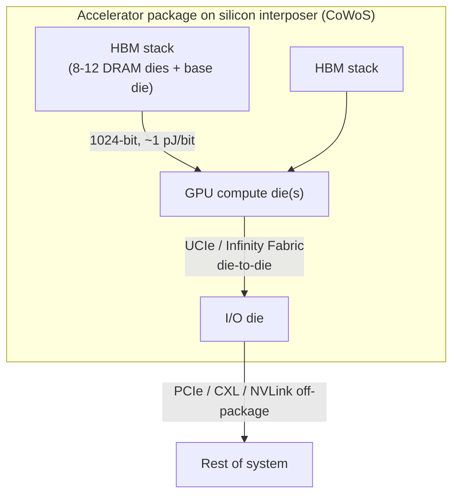

# UCIe, Die-to-Die Interconnects, and the Chiplet Ecosystem

## Introduction: When the Network Moves Inside the Package

The innermost layer of the datacenter interconnect hierarchy lives inside a single chip package, where data moves between **chiplets** — separate pieces of silicon co-packaged on a common substrate — across distances measured in micrometers. This is the realm of die-to-die interconnect, and it has become one of the most strategically important and rapidly evolving areas in all of computing. The reason is simple: the monolithic system-on-chip, which integrated everything onto one large die, has hit economic and physical limits, and the industry's escape route is to disaggregate the chip itself into chiplets and reconnect them with high-bandwidth, ultra-low-energy die-to-die links. The "network" has moved inside the package.

This chapter covers the chiplet revolution and its interconnects: the rationale for chiplets, the **UCIe (Universal Chiplet Interconnect Express)** open standard that aims to make chiplets interoperable across vendors, the proprietary die-to-die technologies of Intel (EMIB, Foveros), AMD (Infinity Fabric, 3D V-Cache), NVIDIA (NVLink-C2C), and TSMC (CoWoS, SoIC), the other die-to-die standards (BoW, AIB, HBI), and **HBM (High Bandwidth Memory)** as the canonical die-to-die interconnect that feeds every AI accelerator. These technologies operate at sub-nanosecond latency and sub-picojoule-per-bit energy, and they are the foundation on which the GPUs, CPUs, and accelerators discussed throughout this database are physically built.

## Chiplet Architecture and the Need for Die-to-Die Interconnects

*Figure 5.1 — A modern accelerator is itself a small network of chiplets: compute die(s), I/O die, and HBM stacks co-packaged on an interposer and joined by die-to-die links (UCIe, proprietary fabrics, the 1024-bit HBM interface) at sub-nanosecond latency and sub-picojoule energy.*

### Why Chiplets: The End of Monolithic Scaling

For decades, the economically optimal way to build a complex chip was to integrate everything onto a single monolithic die at the most advanced process node available. Several converging pressures broke this model:

- **The reticle limit.** Photolithography can pattern only a limited area in a single exposure — the reticle limit, around 800 mm². As designs (especially AI accelerators) grew, they bumped against this hard ceiling; you cannot make a monolithic die larger than the reticle. Chiplets break a large logical design into multiple dies, each within the reticle limit, then reconnect them.

- **Yield economics.** Defects occur randomly across a wafer at some density. The probability that a die is defect-free falls exponentially with die area, so very large monolithic dies have terrible yields — a single defect ruins an enormous, expensive die. Splitting the design into smaller chiplets dramatically improves yield (a defect ruins only one small chiplet, not the whole system) and allows defective chiplets to be discarded cheaply before assembly. This yield advantage is one of the strongest economic drivers of chiplet adoption.

- **Heterogeneous integration.** Different functions have different optimal process nodes. High-performance logic benefits from the most advanced node (e.g., TSMC N3); large SRAM caches scale poorly on the newest nodes and may be cheaper on a slightly older node; analog and I/O circuits (SerDes, PHYs) often work best on mature, well-characterized nodes (7 nm, 28 nm); and the newest nodes are extraordinarily expensive per transistor. Chiplets let a designer build each function on its optimal node and combine them — putting the compute on N3, the cache on N5, and the I/O on an older node — rather than forcing everything onto one compromise process.

- **Time-to-market and IP reuse.** Chiplets can be designed once and reused across multiple products, and a product can be assembled from a mix of new and existing chiplets, accelerating development.

The result is that essentially every leading-edge datacenter processor — AMD's EPYC and Instinct, Intel's Xeon and Ponte Vecchio/Falcon Shores, NVIDIA's Grace and Blackwell, and the hyperscalers' custom accelerators — is now a multi-chiplet design.

### The Interoperability Problem and UCIe as "the USB-C of Chiplets"

The chiplet revolution created a new problem: **interoperability**. Each vendor developed its own proprietary die-to-die interface — Intel's EMIB and Foveros, AMD's Infinity Fabric, TSMC's packaging interconnects — and chiplets from different vendors simply could not be combined, because their die-to-die interfaces were incompatible. This locked each vendor into its own chiplets and foreclosed the vision of a true **chiplet marketplace**, where a designer could buy a best-in-class compute chiplet from one vendor, an I/O chiplet from another, and a memory chiplet from a third, and assemble them into a custom product.

**UCIe (Universal Chiplet Interconnect Express)** is the industry's answer: an open, standardized die-to-die interface that any vendor can implement, so chiplets from different sources can interoperate — analogous to how USB-C standardized a previously fragmented mess of connectors. The ambition is a chiplet ecosystem where dies are mix-and-match components, dramatically expanding design flexibility and competition.

### Industry and Government Chiplet Initiatives

The push for chiplet standardization is reinforced by broader initiatives. The **US CHIPS Act** includes provisions encouraging advanced packaging and chiplet standards as part of rebuilding domestic semiconductor capability. **DARPA's CHIPS program (Common Heterogeneous Integration and IP Reuse Strategies)** pioneered chiplet interoperability research, including the AIB interface that influenced UCIe. The **Open Compute Project's ODSA (Open Domain-Specific Architecture)** produced the **Bunch of Wires (BoW)** die-to-die standard. And **JEDEC** standardizes the packaging and memory interfaces (including HBM) that chiplet systems depend on. Together these efforts reflect a recognition that chiplets and advanced packaging are now strategic national and industrial priorities, not merely engineering conveniences.

## UCIe — Deep Technical Coverage

### Founding and Versions

The **UCIe Consortium** was founded in **March 2022** by an unusually complete roster of the semiconductor industry: **Intel, AMD, Arm, ASE (a leading packaging/assembly house), Google, Meta, Microsoft, Qualcomm, Samsung, and TSMC**, among others. This breadth — spanning logic vendors, packaging houses, hyperscalers, and foundries — gave UCIe immediate credibility. **UCIe 1.0** defined the foundational specification; **UCIe 1.1 (2023)** added clarifications, particularly around the die-to-die adapter and automotive/reliability use cases; and **UCIe 2.0** extends toward more advanced capabilities including 3D packaging and manageability. The standard is explicitly designed to ride atop the established protocol ecosystems — mapping PCIe and CXL onto die-to-die links — so that an SoC built from UCIe-connected chiplets can speak PCIe/CXL across chiplet boundaries transparently.

### Physical Layer: Advanced and Standard Packaging

UCIe defines two physical-layer variants matched to two classes of packaging:

- **Advanced packaging** targets the highest bandwidth density, using fine-pitch advanced packaging technologies (silicon interposers, silicon bridges, or hybrid bonding) with **bump pitches of roughly 25–55 µm**. Signaling runs at **4–32 Gbps per pin**, and because the bumps are so dense, the bandwidth per unit of interface edge is enormous — UCIe targets on the order of tens of terabytes per second of aggregate bandwidth across a 2 mm-wide interface at maximum density. Advanced packaging is for chiplets that must communicate at near-on-die bandwidth, such as compute-to-compute or compute-to-cache links.

- **Standard packaging** targets cost-sensitive designs using conventional flip-chip organic packaging, with **bump pitches of roughly 100–130 µm** and signaling up to **16 Gbps per pin**. The bandwidth density is lower (the bumps are far coarser), but the packaging is much cheaper and does not require interposers or bridges. Standard packaging suits chiplets that need to be connected but do not demand the absolute maximum bandwidth — for example, an I/O chiplet attached to a compute chiplet where the link can be a bit narrower.

A defining characteristic of UCIe's physical layer is that it is **SerDes-free and source-synchronous**: rather than the complex clock-recovery SerDes used for long-reach links, UCIe forwards a clock alongside the data (clock forwarding) and uses simple strobe-based sampling, because the physical distance is so short that the channel is benign. This keeps energy per bit extremely low (well under 1 pJ/bit) and latency sub-nanosecond. The physical layer includes lightweight FEC or CRC for error protection and a training sequence to center the sampling eye and deskew the lanes; lanes are organized into modules (e.g., 16, 32, or 64 data lanes plus clock lanes per module), and modules can be ganged for more bandwidth.

### Protocol Stack: Physical, Adapter, Protocol

UCIe's stack has three layers:

- **Physical Layer** — the differential (or single-ended) signaling, clock forwarding, training, and lane management described above.
- **Die-to-Die Adapter (D2D Adapter)** — the layer that bridges between the protocol traffic and the physical lanes. It provides retiming FIFOs, formats traffic into flits, handles flow-control credits, and manages link state. It supports two modes: **Raw Mode**, in which the link is a transparent bit pipe carrying whatever the protocol layer sends (used for proprietary protocols that bring their own framing), and a framed/streaming mode with UCIe's own flit formatting and reliability.
- **Protocol Layer** — the layer that maps a higher-level protocol onto the link. UCIe defines standard mappings for **PCIe (TLP/DLLP)** and **CXL (CXL.io, CXL.cache, CXL.mem)**, so chiplets can speak PCIe or CXL across the die boundary as if they were on the same die. It also supports **raw/streaming mode** for arbitrary custom protocols — NVLink, Infinity Fabric, or a vendor's proprietary AI interconnect can ride over a UCIe physical layer using raw mode, getting the benefit of a standard PHY while retaining a custom protocol.

This layering is what makes UCIe simultaneously a **standard** (for those who want PCIe/CXL interoperability) and a **substrate** (for those who want a standard PHY under a proprietary protocol).

### Bandwidth, Latency, and the Value Proposition

The bandwidth numbers are striking. In **advanced packaging**, with 32 Gbps per lane and dense lane counts, a UCIe interface can deliver on the order of **hundreds of gigabytes per second per millimeter of interface width** — and since a chip edge can host many millimeters of UCIe interface, total die-to-die bandwidth reaches the multi-terabyte-per-second range. **Standard packaging** delivers more modest figures (tens of GB/s per link) but at far lower cost.

The **latency** advantage is equally important: UCIe die-to-die latency targets **under 1 nanosecond** in advanced packaging, because the physical distance is sub-millimeter and there is no SerDes. Compare this to a PCIe link with a retimer (~10 ns), or off-package connectivity (tens to hundreds of nanoseconds), and the value of keeping communication on-package is obvious. The entire thrust of chiplet design is to exploit this latency and energy advantage — to disaggregate a chip into chiplets without paying the latency and energy penalty that would come from connecting them off-package.

## Intel Die-to-Die Technologies

Intel pioneered much of modern advanced packaging and offers a portfolio of die-to-die technologies.

**EMIB (Embedded Multi-die Interconnect Bridge)** is a small silicon bridge embedded *within the package substrate* that connects two adjacent chiplets with fine-pitch wiring. Unlike a full silicon interposer (which spans the entire chip area and is expensive), EMIB is a localized bridge placed only where two chiplets need to connect, at roughly **55 µm bump pitch**, delivering high bandwidth (on the order of terabytes per second per bridge) with the cost advantage of not requiring a large interposer or through-silicon vias. EMIB is used in products including Intel's Agilex FPGAs, the Ponte Vecchio data-center GPU, and others. Its advantage is cost and the avoidance of TSVs; its constraint is that the bridge must be pre-placed in the substrate, limiting flexibility.

**Foveros** is Intel's **3D die-stacking** technology, placing one die face-to-face atop another with micro-bumps and through-silicon vias (TSVs) through the base die to bring power and signals up to the stacked die. Foveros enables active-on-active stacking — for example, stacking compute tiles on a base die that provides I/O and interconnect. **Intel Lakefield** stacked compute tiles on a base die as an early demonstration; **Meteor Lake** uses Foveros to combine separate Compute, Graphics, SoC, and I/O tiles on a base die. Foveros micro-bump pitch is around **36 µm**, with TSVs on the order of 10 µm diameter.

**Foveros Direct** advances to **copper-to-copper hybrid bonding**, eliminating the micro-bumps in favor of direct Cu-Cu bonds at roughly **10 µm pitch** — an order-of-magnitude density increase over micro-bump Foveros, enabling far higher interconnect density between stacked dies. Hybrid bonding is the frontier of 3D integration, and Foveros Direct targets future products. **ODI (Omni-Directional Interconnect)** combines EMIB-style lateral bridges with Foveros-style vertical stacking, enabling complex hybrid 2.5D-plus-3D integration.

## AMD Die-to-Die Technologies

AMD was the commercial pioneer of chiplet-based CPUs, and its die-to-die fabric is central to its success.

**Infinity Fabric** is AMD's proprietary die-to-die and chip-to-chip interconnect, with heritage tracing to HyperTransport. It has on-die and off-die components — connecting cores within a die, chiplets within a package, and sockets within a system — providing both data transport and the coherence scalability fabric. On AMD's EPYC server CPUs, Infinity Fabric connects multiple **CCDs (Core Compute Dies)** to a central **I/O Die (IOD)**: a Genoa EPYC packs up to 12 CCDs (built on 5 nm) around an IOD (built on 6 nm), with each CCD-to-IOD Infinity Fabric link delivering substantial bandwidth (on the order of tens of gigabytes per second each way per link). This disaggregated topology — small compute chiplets around a central I/O hub — is the architecture that let AMD scale core counts aggressively while maintaining yield.

**3D V-Cache** is AMD's application of hybrid bonding to stack additional SRAM cache directly atop a CCD. A 64 MB SRAM cache chiplet is bonded onto the CCD's existing L3 cache using **copper-to-copper hybrid bonding at roughly 9 µm pitch**, delivering very high bandwidth (on the order of terabytes per second) between the cache chiplet and the underlying die with minimal latency. 3D V-Cache debuted in the Ryzen 7 5800X3D and appears in EPYC "Genoa-X" server parts, where the enormous cache dramatically benefits cache-sensitive workloads (technical computing, EDA, certain databases). It is a showcase of how 3D die-to-die integration can add capability (here, cache) that would not fit economically on the base die.

## NVIDIA Die-to-Die and Multi-Die

NVIDIA's principal on-package die-to-die technology is **NVLink-C2C (Chip-to-Chip)**, the interconnect that binds the **Grace CPU and Hopper (or Blackwell) GPU** into a single coherent superchip. NVLink-C2C delivers **900 GB/s of bidirectional bandwidth** between the CPU and GPU within the package — roughly 7× the bandwidth of a PCIe 5.0 x16 link — at far lower energy (on the order of 1.3 pJ/bit, versus several pJ/bit for PCIe). Critically, NVLink-C2C provides **coherent** CPU-GPU memory: the Grace CPU's LPDDR memory and the Hopper GPU's HBM are unified into a coherent address space, so the GPU can access CPU memory and vice versa with hardware coherence, over the high-bandwidth C2C link.

The contrast with CXL is instructive: **NVLink-C2C offers higher bandwidth than CXL but is proprietary to NVIDIA**, whereas CXL is an open standard. NVIDIA's bet is that for its tightly integrated CPU-GPU superchips, a proprietary, maximally optimized coherent link is worth more than open interoperability — the same vertical-integration philosophy that runs through NVIDIA's entire AI stack. The Blackwell generation extends this with even higher C2C bandwidth and uses die-to-die links to connect the two large GPU dies that make up a single Blackwell GPU into one logical device.

## TSMC Packaging-Based Die-to-Die

As the dominant foundry, **TSMC** provides the packaging technologies that physically realize most of the industry's chiplet designs.

**CoWoS (Chip-on-Wafer-on-Substrate)** is TSMC's **2.5D** integration technology: chiplets (including GPU dies and HBM stacks) are placed side by side on a **silicon interposer**, which provides fine-pitch redistribution-layer wiring (around 40 µm pitch) between them, and the interposer sits on a package substrate. CoWoS is the workhorse of AI accelerator packaging — it is how NVIDIA's H100/H200/A100 and AMD's MI300X integrate their GPU compute dies with multiple HBM stacks. CoWoS capacity has become a critical bottleneck in AI accelerator production, with TSMC racing to expand it. There are variants (CoWoS-S with a silicon interposer, CoWoS-R with an RDL interposer, CoWoS-L with a local silicon bridge in an RDL interposer) that trade cost, size, and bandwidth.

**SoIC (System on Integrated Chips)** is TSMC's **3D** stacking technology using **copper-to-copper hybrid bonding**, with bump pitch around **9 µm** (SoIC-T, chip-on-wafer) — roughly a 10× density improvement over conventional micro-bumps — and a roadmap toward even finer pitches (heading toward 3 µm later in the decade). SoIC enables true 3D integration (logic on logic, or cache on logic, as in AMD's 3D V-Cache, which uses TSMC's hybrid bonding). The combination of CoWoS (2.5D) and SoIC (3D) gives TSMC a comprehensive advanced-packaging portfolio that underpins much of the AI hardware industry.

## Other Die-to-Die Standards

Beyond UCIe and the proprietary fabrics, several other die-to-die standards exist:

- **BoW (Bunch of Wires)** is the OCP ODSA's open die-to-die standard: a simple, low-latency, low-power parallel bus (around 8 Gbps per wire) for connecting adjacent chiplets, with no protocol definition (it carries raw data, leaving protocol to the system). BoW competes conceptually with UCIe's simpler use cases.
- **AIB (Advanced Interface Bus)** is Intel's open, parallel CMOS die-to-die bus (around 2 Gbps per signal), contributed to DARPA's CHIPS program and used in Intel's Stratix 10 FPGAs. AIB is a direct ancestor of UCIe's thinking.
- **HBI (High Bandwidth Interface)** is a JEDEC effort aimed at memory-like 2.5D/3D interfaces — wide buses (e.g., 512-bit) for connecting SRAM or DRAM chiplets to logic dies, conceptually a competitor to HBM for on-package cache.
- **MIPI A-PHY / D-PHY and similar** are die-to-die and short-reach standards from the mobile and automotive worlds, noted here only for completeness — they are not datacenter interconnects, but they illustrate how pervasive die-to-die signaling has become across the industry.

## HBM as a Die-to-Die Interconnect

No discussion of die-to-die interconnect is complete without **HBM (High Bandwidth Memory)**, because HBM *is* a die-to-die interconnect — and the single most important one for AI. HBM stacks multiple DRAM dies vertically using through-silicon vias (TSVs), places them on a base logic die, and connects the stack to the processor (GPU or accelerator) through a silicon interposer (CoWoS) with an extraordinarily wide interface: **1,024 bits per stack**. By trading per-pin speed for sheer width, HBM achieves enormous bandwidth at relatively modest per-pin signaling rates, with excellent energy efficiency because the interposer connection is short.

### HBM Generations

| Generation | ~Year | Data rate/pin | BW per stack | Notes |
|---|---|---|---|---|
| HBM1 | 2015 | 1 GT/s | ~128 GB/s | 4–8 DRAM dies + base die |
| HBM2 | 2016 | 2 GT/s | ~256 GB/s | Broader adoption |
| HBM2E | 2020 | ~3.6 GT/s | ~460 GB/s | SK Hynix Aquabolt-XL, Samsung Flashbolt |
| HBM3 | 2022 | ~6.4 GT/s | ~819 GB/s | 12-high stacks; NVIDIA H100 uses 5 stacks ≈ 3.35 TB/s |
| HBM3E | 2024 | ~9.6 GT/s | ~1.2 TB/s | H200 uses 6 stacks ≈ 4.8 TB/s; MI300X uses 8 HBM3 ≈ 5.3 TB/s |
| HBM4 | ~2026 target | 16+ GT/s | ~2 TB/s | Base-die logic integration; wider interface |

The progression is relentless: each generation roughly doubles per-stack bandwidth, and accelerator designers add more stacks per device. NVIDIA's H100 integrates five HBM3 stacks for about 3.35 TB/s of aggregate memory bandwidth; the H200 uses six HBM3E stacks for about 4.8 TB/s; AMD's MI300X uses eight HBM3 stacks for about 5.3 TB/s. **HBM4**, targeted for around 2026, widens the interface further and integrates more logic into the base die (potentially customizing the base die per customer), continuing the march toward multi-terabyte-per-second per-stack bandwidth.

### The HBM Supplier Landscape and Geopolitical Stakes

HBM is dominated by three suppliers: **SK Hynix** (the market leader, roughly half the market, and the lead supplier of HBM3/HBM3E to NVIDIA), **Samsung** (a large share, racing to qualify its HBM3E), and **Micron** (the smaller third entrant, ramping HBM3E and targeting a growing share). The concentration of HBM production — and the fact that the most advanced HBM is produced predominantly in **South Korea** — makes HBM a critical and geopolitically sensitive node in the AI supply chain.

The strategic significance cannot be overstated: **NVIDIA's H100 and H200 production has been bottlenecked by HBM supply**, not by GPU logic fabrication. HBM is the constraining resource in AI accelerator output, and securing HBM allocation has been a central concern for every AI chip maker. This makes HBM not just a die-to-die interconnect but a chokepoint in the entire AI hardware economy — a single technology whose supply gates the production of the accelerators that train the world's largest models. The dependence on a small number of Korean suppliers for the most advanced HBM is among the most important supply-chain risks in technology, and it is driving investment in additional capacity and additional suppliers, as well as the geopolitical attention that surrounds advanced memory.

## Extended Deep Dive: Advanced Packaging Technologies Compared

The die-to-die interconnects of this chapter are inseparable from the **advanced packaging** technologies that physically realize them, and a comparative treatment clarifies the landscape. Packaging approaches divide broadly into **2.5D** (chiplets placed side by side on an interposer or bridge) and **3D** (chiplets stacked vertically). In 2.5D, the options are a **full silicon interposer** (TSMC CoWoS-S) — a large silicon slab with fine-pitch wiring spanning all the chiplets, offering the highest interconnect density but at high cost and limited by the reticle size of the interposer; a **silicon bridge** (Intel EMIB, TSMC CoWoS-L) — small silicon bridges embedded only where chiplets connect, avoiding a full interposer's cost while retaining fine pitch locally; and an **RDL (redistribution layer) interposer** (CoWoS-R, fan-out approaches like InFO) — organic or polymer wiring layers, cheaper but coarser than silicon. In 3D, the options are **micro-bump stacking** (Intel Foveros at ~36 µm pitch, requiring TSVs through the base die) and **hybrid bonding** (Intel Foveros Direct, TSMC SoIC, AMD 3D V-Cache at ~9 µm pitch and heading finer), which eliminates bumps entirely via direct copper-to-copper bonds for an order-of-magnitude density increase.

The trade-offs are fundamental. Finer pitch (hybrid bonding) means more interconnections per unit area, hence more bandwidth and lower energy per bit, but demands wafer-level alignment precision, pristine surfaces, and sophisticated process control, with attendant yield and cost challenges. Coarser pitch (organic, standard packaging) is cheaper and more forgiving but limits bandwidth density. 3D stacking maximizes density and minimizes interconnect length (hence latency and energy) but creates severe thermal challenges (stacking active dies traps heat) and complicates power delivery (power must reach the top die through TSVs). 2.5D spreads chiplets laterally, easing thermals at the cost of longer interconnects. The choice among these — and UCIe's support for both "advanced" (fine-pitch, interposer/bridge/hybrid-bond) and "standard" (coarse-pitch, organic) packaging — reflects the same cost-versus-performance trade-off that recurs at every layer of the interconnect hierarchy. The AI accelerator, with its GPU dies and HBM stacks on a CoWoS interposer, sits at the high-performance, high-cost end; a cost-sensitive chiplet SoC on organic standard packaging sits at the other.

## Extended Deep Dive: Thermal and Power-Delivery Challenges of 3D Integration

The promise of 3D die stacking — putting compute, cache, and memory directly atop one another for minimum interconnect length — collides with two hard physical problems that increasingly bound the technology. The first is **heat extraction**. In a planar chip, heat flows up through the die to a heat spreader and sink; in a 3D stack, the upper die's heat must pass *through* the lower die(s) to reach the sink, and the lower die — if it is active logic dissipating its own power — adds to the heat flux while impeding its escape. Stacking a hot logic die on another hot logic die can create thermal densities that exceed what air or even direct-liquid cooling can remove, which is why early 3D stacks often placed a low-power die (cache, as in AMD's 3D V-Cache, or I/O) atop the high-power logic, and why thermal considerations strongly shape what can be stacked on what. As stacking proliferates and power densities rise, advanced cooling (microfluidic channels etched into the dies, for instance) becomes a research frontier.

The second problem is **power delivery**. Delivering hundreds of watts to a stack of dies through the package, and then up through TSVs to the upper dies, at the low voltages (sub-volt) and high currents modern logic demands, is extraordinarily difficult — the IR drop and the current density strain the TSVs and the power-delivery network. Innovations such as **backside power delivery** (routing power on the back of the die, separate from signal routing on the front) are being developed in part to address the power-delivery needs of dense 2.5D/3D integration. Together, thermal and power-delivery constraints are the principal physical limits on how aggressively the industry can stack and integrate — and they are precisely why the die-to-die interconnect, the packaging, the cooling, and the power delivery must be co-designed, exactly as every other layer of the network is co-designed across its constituent disciplines.

## Extended Deep Dive: HBM's Base Die and the Path to HBM4

The evolution of HBM toward HBM4 (~2026) is one of the most consequential trends for AI hardware, and it centers on the **base die** — the logic die at the bottom of the HBM stack that interfaces between the stacked DRAM and the host processor. Through HBM3, the base die was a relatively simple interface layer. HBM4 widens the interface (toward 2048 bits per stack, doubling the already-wide HBM3 interface) and, more importantly, opens the possibility of a **customized, logic-rich base die** — potentially fabricated on an advanced logic process by a foundry (TSMC) rather than by the DRAM maker, and customized per customer to integrate functions such as memory controllers, near-memory compute, or specialized interfaces. This blurs the line between memory and logic and between the memory vendor and the logic foundry, and it could let an AI-accelerator designer co-optimize the HBM base die with the GPU — a deepening of the chiplet/heterogeneous-integration paradigm that this chapter describes. The strategic stakes are high: control of the HBM base die is contested between the memory makers (SK Hynix, Samsung, Micron) and the logic foundries (TSMC), and the outcome will shape the economics and architecture of AI accelerators for years. HBM4 thus exemplifies the chapter's central theme — that the most advanced computing is built by integrating heterogeneous dies via die-to-die interconnects, and that the boundaries between the dies, the memory, the packaging, and the foundry are all in flux.

## Extended Deep Dive: The Chiplet Economics That Drive Everything

The chiplet revolution rests on an economic logic worth quantifying, because it explains why the entire industry — Intel, AMD, NVIDIA, the hyperscalers — moved to chiplets despite the added complexity of die-to-die interconnect. The core driver is **yield economics**. Semiconductor defects occur at some density per unit area, and the probability that a die is defect-free falls roughly exponentially with its area. A very large monolithic die (approaching the ~800 mm² reticle limit) therefore has a low yield — a single defect anywhere ruins the entire expensive die — and the cost per *good* die balloons. Splitting that design into, say, four chiplets of one-quarter the area each dramatically improves the yield of each chiplet (a defect ruins only one small chiplet), and defective chiplets are discarded cheaply before assembly, so the cost per good *system* drops substantially. For the largest chips — AI accelerators pushing the reticle limit — this yield advantage alone can be decisive.

Layered on top are the **heterogeneous-process** savings: the most advanced node (e.g., N3) is extraordinarily expensive per transistor, and not every function benefits from it — large SRAM caches scale poorly on the newest nodes, and analog/IO (SerDes) often works best on mature nodes. By building each function on its cost-optimal node and combining them via chiplets, a designer avoids paying leading-edge prices for functions that don't need it — AMD's EPYC, with compute chiplets on an advanced node and the IO die on an older, cheaper node, is the canonical example. Add the benefits of **IP reuse** (design a chiplet once, use it across many products) and **faster time-to-market** (mix new and existing chiplets), and the economic case for chiplets becomes overwhelming for complex, high-value chips. The cost — the die-to-die interconnect (UCIe, HBM interfaces, proprietary fabrics) and the advanced packaging (CoWoS, EMIB, Foveros, SoIC) — is what this chapter is about, and it is a cost the industry gladly pays because the yield, process-optimization, reuse, and time-to-market benefits of disaggregating the chip far outweigh it. The chiplet is to the chip what disaggregation is to the datacenter: breaking a monolith into composable, independently optimized, independently sourced pieces, reconnected by a high-performance interconnect.

## Extended Deep Dive: Known-Good-Die and the Chiplet Supply Chain

A practical challenge that the chiplet model creates — and that connects to the broader supply-chain themes of this database — is the **Known-Good-Die (KGD)** problem and the nascent chiplet supply chain. When a system is assembled from multiple chiplets on an expensive interposer (CoWoS) or in a 3D stack, a single defective chiplet ruins the entire assembled module, which by then contains several good (expensive) chiplets and costly packaging. The yield benefit of chiplets is only realized if defective chiplets are caught *before* assembly — hence the need for KGD: thoroughly testing each chiplet (including its die-to-die interfaces) before committing it to the package. Testing a bare die's high-speed die-to-die interfaces before it is bonded is technically hard (there is no connector to probe), and KGD testing is an active area of test engineering, paralleling the Known-Good-Optics challenge in co-packaged optics (File 13).

The chiplet model also implies, eventually, a **chiplet marketplace** — the UCIe vision (above) of buying chiplets from different vendors and assembling them — which requires not just an interoperable interface (UCIe) but a supply chain for sourcing, testing, and integrating third-party chiplets, with the attendant questions of who guarantees the KGD, who owns the integration yield risk, and how chiplets from different vendors are qualified together. This is largely nascent today (most chiplet systems still use one vendor's chiplets), but it is the direction UCIe enables, and it would extend to the chiplet the same multi-vendor, composable dynamics that this database traces at every scale. The KGD problem and the chiplet supply chain are the practical frontier of making the chiplet vision real — the unglamorous logistics and test engineering that must mature before the elegant architecture of mix-and-match chiplets becomes routine, just as the optical physical plant (File 09) and the lossless-fabric operational craft (File 17) are the practical frontiers at their respective scales.

## Conclusion: The Package as a Network

The die-to-die layer demonstrates that the distinction between "a chip" and "a network" has eroded. A modern AI accelerator is not a chip; it is a small network of chiplets — compute dies, I/O dies, HBM stacks — interconnected by die-to-die links (UCIe, proprietary fabrics, HBM interfaces) running over advanced packaging (CoWoS, SoIC, EMIB, Foveros). These links carry terabytes per second at sub-nanosecond latency and sub-picojoule energy, performance unattainable off-package, which is precisely why disaggregating the chip into chiplets — and reconnecting them on-package — is the dominant design paradigm. UCIe's promise is to open this innermost network to multi-vendor interoperability, turning chiplets into a marketplace and extending to the package the same open-standard dynamics that Ethernet and PCIe brought to larger scales. And HBM, the most important die-to-die interconnect of all, sits at the center of the AI supply chain as both an enabler and a bottleneck. From here, the database moves outward — to the board and rack-level fabrics (Ethernet, InfiniBand) that connect these chiplet-built accelerators into the clusters that train and serve AI at scale.
