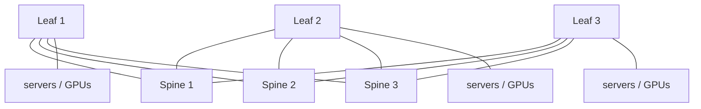
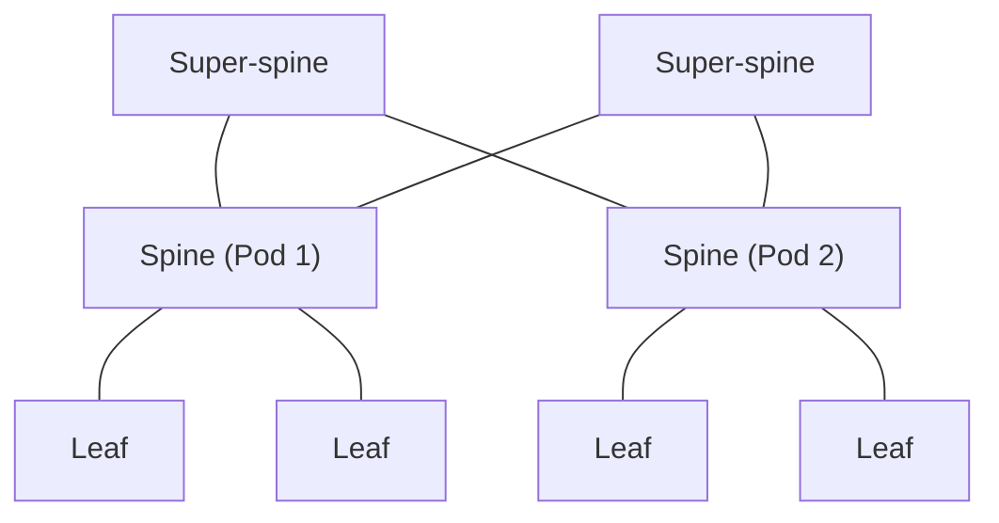
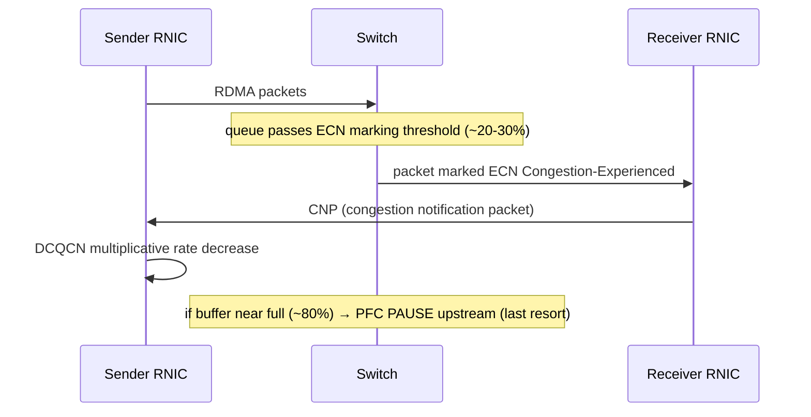

# Ethernet for Datacenter — Speeds, Standards, Architecture, and Evolution

## Introduction: The Universal Network

Ethernet is the most successful networking technology in history. Conceived in 1973, standardized in 1983, and continuously reinvented ever since, it has displaced or absorbed nearly every competing technology it has encountered — Token Ring, FDDI, ATM, and, for general computing, even Fibre Channel and (increasingly) InfiniBand. Its secret is not technical superiority at any given moment but an unmatched combination of open standardization, economies of scale, backward compatibility, and relentless speed scaling. Whatever exotic technology appears at the high end, Ethernet eventually arrives with 90% of the capability at a fraction of the cost and the entire industry's tooling behind it, and it wins.

In the datacenter, Ethernet is the default fabric for everything except the highest-end AI training clusters (where it contends with InfiniBand) and a handful of specialized HPC interconnects. This chapter covers Ethernet comprehensively for the datacenter: its history and the evolution from 10 Mbps to 1.6 Terabit, the complete family of IEEE 802.3 speed standards, the physical-layer technologies (NRZ, PAM4, FEC, equalization), the datacenter topologies built from Ethernet switches (Clos, dragonfly, torus, rail-optimized, optical circuit switching), and the congestion-management technologies (PFC, DCQCN, HPCC, Swift, Timely) that make Ethernet viable as a lossless AI fabric. It is the longest and one of the most important chapters in this database, because Ethernet touches every layer of the datacenter.

## Ethernet History and Datacenter Evolution

### Origins and the Death of CSMA/CD

Ethernet was invented by **Robert Metcalfe and David Boggs at Xerox PARC in 1973**, as a way to connect the Alto workstations over a shared coaxial cable. Its original media-access method was **CSMA/CD (Carrier Sense Multiple Access with Collision Detection)**: stations listened before transmitting, transmitted if the medium was idle, detected collisions when two stations transmitted simultaneously, and backed off for a random interval before retrying. CSMA/CD was ingenious for a shared medium, and it defined Ethernet for its first two decades.

It is also entirely obsolete in the datacenter. The transition to **switched, full-duplex Ethernet** in the late 1990s eliminated the shared medium: each station connects to a switch port over a dedicated link, transmit and receive on separate pairs, with no possibility of collision. CSMA/CD became vestigial — present in the standard for backward compatibility but never invoked. Modern datacenter Ethernet is point-to-point, full-duplex, and switched from end to end; the "multiple access" in the name is a historical artifact. Understanding this is important because it means that, at the link layer, modern Ethernet is far simpler and more deterministic than its origins suggest — there are no collisions, no backoff, just framing and flow control over a clean point-to-point link.

### The Datacenter Speed Progression

Datacenter Ethernet has marched through speed generations on a roughly halving cadence of cost-per-bit:

- **10 Mbps → 100 Mbps (Fast Ethernet) → 1 GbE**: the LAN era; 1 GbE became the server-connection standard around the turn of the millennium.
- **10 GbE (ratified 2002)**: the first speed designed for the datacenter, enabling server-to-switch and switch-to-switch links well beyond gigabit. 10 GbE drove the first wave of east-west datacenter buildout.
- **40 GbE**: built as 4 lanes of 10G (4×10G), used for switch uplinks. It was something of a transitional speed.
- **25 GbE (2016)**: a pivotal innovation. Rather than continuing with 10G lanes, the industry developed a 25G-per-lane SerDes, enabling **25 GbE** for server connections (one lane), **50 GbE** (two lanes), and **100 GbE** (four lanes, 4×25G). The 25G lane displaced both 10G (for servers) and 40G (4×25G = 100G beat 4×10G = 40G on cost-per-bit). This "25G/100G transition" reshaped the datacenter, and the economics of a single fast lane scaling to multiple speeds became the template for all subsequent generations.
- **100 GbE → 400 GbE**: 400 GbE, built initially as 8×50G PAM4 and then 4×100G PAM4, is the current high-volume datacenter leading edge, used for spine links and increasingly for high-end server and AI connections.
- **800 GbE (emerging 2024–2025)**: 8×100G PAM4, driven primarily by AI cluster deployments, where each GPU demands hundreds of gigabits per second.
- **1.6 TbE (roadmap 2026+)**: 8×200G PAM4, the next frontier, requiring 200G-per-lane electrical signaling that pushes the limits of copper and DSP and accelerates the move to linear-drive and co-packaged optics.

### Reading the IEEE Naming Convention

IEEE 802.3 standard names encode the technology compactly. Consider **100GBASE-SR4**:
- **100G** — the data rate (100 Gigabit per second).
- **BASE** — baseband signaling (the signal occupies the full medium, as opposed to broadband/passband).
- **SR** — the media/reach type (here, Short Reach over multimode fiber).
- **4** — the number of lanes (here, 4 parallel lanes/fibers).

The reach/media codes recur across speeds: **SR** (short reach, multimode, VCSEL), **DR** (500 m single-mode, one wavelength per lane), **FR** (2 km single-mode), **LR** (10 km single-mode), **ER** (40 km), **ZR** (80 km coherent), **CR** (copper, direct-attach), **KR** (backplane). The lane count suffix tells you the parallelism. Thus **400GBASE-DR4** is 400G over four 500m single-mode lanes (4×100G), and **800GBASE-SR8** is 800G over eight short-reach multimode lanes (8×100G). This naming, once internalized, lets an engineer decode the physical implementation of any Ethernet variant at a glance.

## IEEE 802.3 Speed Standards — Complete Coverage

This section catalogs the principal datacenter Ethernet variants by speed family, with their lane structure, signaling, media, and reach. Each variant represents a specific point in the trade-off space of cost, reach, and bandwidth.

### 100 Gigabit Ethernet Family

100 GbE remains enormously deployed, in several flavors:
- **100GBASE-SR4** — 4 lanes of 25G NRZ over multimode fiber with 850 nm VCSELs, reaching ~70 m (OM3) to ~100 m (OM4), using an MPO connector. The rack-scale and intra-row workhorse of the 100G generation; no FEC required at 25G NRZ over short reaches in early variants (later short-reach FEC added for margin).
- **100GBASE-DR** — a single lane of 100G PAM4 over single-mode fiber with a 1310 nm laser, reaching 500 m, using RS(544,514) FEC. This single-wavelength 100G is the building block for 400G-DR4 (four of them).
- **100GBASE-FR1 / FR** — single-lane 100G PAM4, 1310 nm, 2 km single-mode.
- **100GBASE-LR4** — 4 lanes of 25G NRZ multiplexed by CWDM (1271/1291/1311/1331 nm) onto a single fiber pair, 10 km single-mode. The 10 km reach for campus/DCI.
- **100GBASE-CR4** — 4 lanes of 25G NRZ over direct-attach copper, ~5 m, for top-of-rack to server.
- **100GBASE-KR4** — 4 lanes of 25G NRZ over a backplane, for chassis and blade systems.

### 200 Gigabit Ethernet

200 GbE, built on 50G PAM4 lanes:
- **200GBASE-DR4** — 4×50G PAM4, 1310 nm, 500 m single-mode.
- **200GBASE-FR4** — 4×50G PAM4 multiplexed by CWDM4, 2 km single-mode.
- **200GBASE-SR4** — 4×50G PAM4, 850 nm, ~100 m multimode.

200 GbE saw limited standalone deployment, often skipped in favor of jumping from 100G straight to 400G, but its 50G PAM4 lane technology was the bridge to 400G.

### 400 Gigabit Ethernet — The Current Leading Edge

400 GbE is the high-volume frontier of datacenter Ethernet as of the mid-2020s:
- **400GBASE-SR8** — 8 lanes of 50G PAM4 over multimode (850 nm VCSEL), ~100 m, with an MPO-16 connector. Intra-rack and intra-row for the 400G generation.
- **400GBASE-DR4** — 4 lanes of 100G PAM4, 1310 nm EML, 500 m single-mode. Inter-rack within a pod; a key AI-fabric reach.
- **400GBASE-FR4** — 4×100G PAM4 multiplexed by CWDM4, 2 km single-mode. Cross-pod within a campus.
- **400GBASE-LR4** — 4×100G PAM4 over LAN-WDM, 10 km. Short DCI.
- **400GBASE-ZR** — a single coherent wavelength (dual-polarization 16QAM) carrying 400G over 80+ km of amplified DWDM. This is the pluggable coherent variant that revolutionized DCI (File 10), letting a 400G coherent link fit in a QSFP-DD or OSFP module.
- **400GBASE-ZR+** — an MSA extension of ZR with stronger FEC and longer reach (120+ km, or longer amplified spans).

### 800 Gigabit Ethernet — Emerging

800 GbE, driven by AI, arrived in volume in 2024–2025:
- **800GBASE-SR8** — 8×100G PAM4, 850 nm, ~50 m multimode.
- **800GBASE-DR8** — 8×100G PAM4, 1310 nm, 500 m single-mode.
- **800GBASE-VR8** — a very-short-reach variant (8×100G PAM4) aimed at co-packaged-optics and board-to-board links under a couple of meters.
- **800G client aggregation** — two 400G client streams aggregated for coherent ZR+ transport.

The 800G generation is tightly coupled to AI: the NVIDIA GB200 NVL72 and similar systems drive 800G NIC-to-switch links, and the 800G transceiver market exploded with AI cluster buildout (File 21).

### 1.6 Terabit Ethernet — Roadmap

1.6 TbE is the next frontier, standardized by the **IEEE 802.3dj** task force, whose scope covers 200 Gb/s, 400 Gb/s, 800 Gb/s, and 1.6 Tb/s operation on 200G-per-lane signaling. As of mid-2026 the draft had progressed through D2.4 and later revisions with **ratification expected during 2026**, having slipped somewhat from the original schedule — while **1.6T optical modules were already shipping in volume** against the stable draft and multi-vendor plugfests. That gap between shipping product and ratified standard is now normal at each speed step, and it shifts interoperability risk onto the buyer: pre-standard modules interoperate because vendors tested them together, not because a standard guarantees it.

- **1.6TBASE-SR8 / DR8** — 8 lanes of 200G PAM4 over multimode or single-mode.
- The defining challenge is **200G-per-lane electrical signaling** (the **200GAUI** attachment-unit interface), which requires roughly 100+ GBaud PAM4 — an extreme DSP and signal-integrity challenge. Driving 200G per lane all the way to a front-panel pluggable becomes so power-hungry that **LPO (Linear-drive Pluggable Optics)** or **co-packaged optics** become near-mandatory at this speed. 1.6 TbE is thus not just a faster Ethernet; it is the speed at which the optical-integration transition (File 13) becomes unavoidable.

## Ethernet Physical Layer Deep Dive

### NRZ, PAM4, and PAM8

As introduced in File 02, **NRZ** signaling (two levels, one bit per symbol) served Ethernet through 25G per lane. Its wide level spacing gives good noise immunity, but its one-bit-per-baud efficiency means that scaling to higher data rates requires proportionally higher baud rates, which the channel bandwidth cannot sustain past ~25–28 GBaud.

**PAM4** (four levels, two bits per symbol) became the signaling of choice from 50G per lane onward. By packing two bits into each symbol, PAM4 doubles the data rate for a given baud rate — a 100G PAM4 lane runs at ~53 GBaud rather than the ~106 GBaud an NRZ lane would need. The cost is the ~9.5 dB SNR penalty from the compressed level spacing, which mandates FEC and sophisticated equalization. PAM4 is used at 50G, 100G, and 200G per lane.

**PAM8** (eight levels, three bits per symbol) has been studied for beyond-200G-per-lane signaling, but its SNR penalty is even more severe, and it demands data converters with an effective number of bits and bandwidth that are impractical at current technology — roughly 5× the power of PAM4. The industry consensus is that PAM8 will not enter production; higher per-lane rates will come from higher baud rates and from optics, not from more modulation levels.

### Equalization

At PAM4 rates, the channel severely distorts the signal, and **equalization** is what recovers it:
- **CTLE (Continuous-Time Linear Equalizer)** is an analog filter at the receiver that boosts high frequencies to compensate for the channel's frequency-dependent loss.
- **FFE (Feed-Forward Equalizer)** at the transmitter pre-distorts the signal (pre-emphasis/de-emphasis) to counteract anticipated channel loss.
- **DFE (Decision-Feedback Equalizer)** at the receiver cancels post-cursor inter-symbol interference by feeding back previous symbol decisions. A 112G-class PAM4 receiver may use on the order of 17 DFE taps, and the DSP power required for this equalization grows with baud rate — a major contributor to switch and transceiver power, and a key motivation for shortening the electrical channel via co-packaged optics.

### Forward Error Correction

FEC is mandatory at PAM4 rates. The principal Ethernet codes:
- **RS(528,514)** ("Base-R" / "Clause 74" FireCode lineage / KR4-CR4 FEC) — 2.7% overhead, used at 25G NRZ where a modest BER floor improvement suffices; latency ~80 ns.
- **RS(544,514)** ("KP4" FEC) — 5.8% overhead, the standard FEC for 50G PAM4 and faster; corrects up to 15 symbol errors per codeword; latency ~100–150 ns.
- **Low-Latency FEC (LL-FEC)** — Ethernet Technology Consortium variants that reduce FEC latency (toward ~20 ns) at the cost of correction strength, for latency-sensitive RDMA and HPC links.

FEC latency is a first-order concern for AI and storage fabrics, because it adds directly to end-to-end RTT and therefore to collective-operation completion time. The trade-off between FEC strength (which protects against errors that would trigger expensive RDMA retransmissions) and FEC latency (which slows every collective) is one operators tune deliberately, occasionally disabling FEC on very short, clean links — a calculated risk.

### Autonegotiation and Link Training

Ethernet links negotiate their configuration automatically. **Autonegotiation (AN)** and **Link Training (LT)**, defined in **IEEE 802.3ap** for backplane and extended to other media, let two link partners agree on speed, FEC mode, and pause capabilities, and then iteratively tune their equalizer tap coefficients using known test patterns (such as PRBS31) until the link converges to a low error rate. Training convergence typically completes within a fraction of a second. This automation is essential at scale — a hyperscale fabric with millions of links cannot rely on manual per-link tuning.

## Datacenter Network Topology

**Two-tier leaf-spine (Clos):**



*Figure 6.1 — Leaf-spine Clos: every leaf connects to every spine, so any-to-any traffic takes leaf-spine-leaf with as many equal-cost paths as there are spines (ECMP). A 1:1 (non-blocking) oversubscription is used for AI fabrics.*

**Three-tier Clos (super-spine) for hyperscale:**



*Figure 6.2 — A super-spine tier stitches pods of leaf-spine fabric together, scaling to hundreds of thousands of endpoints with ECMP at each tier.*

**Alternative topologies — 2D torus (HPC / TPU style):**

```
        +----+   +----+   +----+
        | N00|---| N01|---| N02|--(wrap)
        +----+   +----+   +----+
          |        |        |
        +----+   +----+   +----+
        | N10|---| N11|---| N12|--(wrap)
        +----+   +----+   +----+
          |        |        |
        +----+   +----+   +----+
        | N20|---| N21|---| N22|--(wrap)
        +----+   +----+   +----+
       (wrap)    (wrap)   (wrap)
```

*Figure 6.3 — A torus connects each node only to nearest neighbors with wraparound links — low hop count for neighbor traffic, poor for all-to-all. Google TPU pods use a 3D torus over optical links with optical circuit switching (Files 11, 15).*

The choice of topology determines a datacenter network's scalability, bisection bandwidth, latency, cost, and fault tolerance. Ethernet supports several, each suited to different workloads.

### Fat-Tree / Clos — The Dominant Topology

The **Clos topology** (named for Charles Clos, who described it for telephone switching in 1953), realized in the datacenter as a **fat-tree** or **leaf-spine** fabric, is the overwhelmingly dominant modern datacenter topology. Its principle: build a large logical switch from many small physical switches arranged in tiers, such that there are many equal-cost paths between any two endpoints, and the aggregate bandwidth between tiers ("bisection bandwidth") is high enough to be non-blocking (or nearly so).

In a **two-tier leaf-spine** fabric, every **leaf** (top-of-rack) switch connects to every **spine** switch. A packet from a server under one leaf to a server under another leaf goes leaf → spine → leaf, and because every leaf reaches every spine, there are as many paths as there are spines, across which traffic is load-balanced by **ECMP**. The **oversubscription ratio** — the ratio of downlink bandwidth (to servers) to uplink bandwidth (to spines) — is a key design knob: **1:1 (non-blocking)** is used for AI fabrics where any-to-any bandwidth is critical, while **4:1 or 8:1** oversubscription is acceptable for general compute where not all servers burst simultaneously.

For larger scale, a **three-tier Clos** adds a **super-spine** tier above pods of leaf-spine fabric, with ECMP at each tier, scaling to hundreds of thousands of endpoints. The hyperscalers' datacenter fabrics — Google's Jupiter, Meta's fabric, Microsoft's and Amazon's networks — are all elaborations of the Clos principle, with careful attention to building enormous bisection bandwidth from commodity switch silicon.

### Dragonfly — HPC's Diameter Reducer

The **dragonfly topology**, used in HPC systems such as the Cray/HPE Slingshot interconnect, groups switches into "groups" (pods) with all-to-all connectivity within a group and a sparser set of global links between groups. The dragonfly's advantage is a low network **diameter** (few hops between any two endpoints) with fewer expensive global (often optical) links than a full fat-tree would require. It is favored when global bandwidth is the costly resource. The **dragonfly+** variant refines the intra-group topology. Dragonfly is the topology of choice for many of the largest supercomputers, and its principles influence AI fabric design.

### Torus and Mesh — The TPU Approach

A **torus** topology connects nodes in a regular grid (2D, 3D, or higher-dimensional) with wraparound links, so each node connects only to its nearest neighbors. Tori have low hop counts for nearest-neighbor communication and scale without the large switch tiers a Clos requires, but they perform poorly for all-to-all traffic (which must traverse many hops). **Google's TPU pods use a 3D torus**, with each TPU chip having optical links in each of the three dimensions (six links total), interconnected through optical circuit switches. This is a radically different architecture from the Clos fabrics used for general compute, optimized for the specific communication patterns of TPU workloads and reconfigurable via optical switching (below). TPU v2/v3/v4 use torus interconnects of increasing scale.

### Rail-Optimized Topologies for AI

AI clusters use **rail-optimized** designs to minimize the hops in collective communication. In a **single-rail** design, there is one network plane; in a **dual-rail (or multi-rail)** design, there are multiple independent Clos networks (rails), with each GPU connected to each rail, providing fault tolerance and bandwidth multiplication. The mapping of GPUs to rails and the topology of each rail are carefully engineered so that the all-to-all and all-reduce collectives traverse the fewest possible hops and avoid congestion. NVIDIA's DGX SuperPOD reference architectures specify particular rail topologies for exactly this reason (File 15).

### Optical Circuit Switching — Reconfigurable Topology

The most advanced topological innovation is **optical circuit switching (OCS)**, pioneered at scale by **Google** (its Palomar and Jupiter-integrated OCS, described in the SIGCOMM 2022 "Jupiter Evolving" paper). An OCS uses MEMS mirrors (or other optical-switching technology) to physically reconfigure the optical connections between switches, changing the network topology on the fly — typically in around 10 milliseconds. This lets the fabric adapt its topology to the traffic: dedicating direct optical circuits to large "elephant" flows, or reconfiguring to provide non-blocking connectivity for a particular collective communication pattern. For AI training, where different parallelism strategies and different collective operations stress the network differently, the ability to reconfigure topology is a powerful tool, and Google has used OCS to improve the efficiency and incremental upgradability of its Jupiter fabric. OCS blurs the line between the packet-switched and circuit-switched worlds, and it is a major theme of the AI-networking future (Files 11, 15, 24).

## Datacenter Ethernet Congestion Management



*Figure 6.4 — The RoCEv2 congestion-control loop. ECN/DCQCN is the primary, graceful control that keeps queues short; PFC is the last-resort safety net whose backpressure can spread congestion and even deadlock if mis-designed (Files 02, 17).*

The hardest problem in datacenter Ethernet — and the one that determines whether Ethernet can rival InfiniBand for AI — is **congestion management for lossless RDMA**. RoCEv2 (File 08) requires a lossless fabric, because a dropped packet forces an expensive RDMA retransmission. Achieving losslessness on a best-effort technology like Ethernet requires a careful stack of mechanisms.

### PFC — The Lossless Foundation and Its Pathologies

**Priority Flow Control (PFC, IEEE 802.1Qbb)** is the foundation of lossless Ethernet. It extends the old PAUSE mechanism to operate per-priority: when a switch's buffer for a given priority class (say, the RDMA class) approaches full, it sends a PFC PAUSE frame to the upstream sender for that priority, telling it to stop transmitting that class for a specified time. This **hop-by-hop backpressure** prevents buffer overflow and packet drops, propagating congestion upstream link by link.

PFC makes losslessness possible, but it is a blunt instrument with serious pathologies:
- **Head-of-line blocking**: pausing a priority class stops *all* flows in that class on the link, including flows not contributing to the congestion.
- **Congestion spreading**: PFC propagates backpressure upstream, so congestion at one switch can stall senders many hops away, spreading the problem across the fabric.
- **PFC storms and deadlock**: if buffer dependencies form a cycle (which careless topology or routing can create), PFC backpressure can deadlock the fabric entirely — a catastrophic failure mode. Avoiding PFC deadlock requires careful topology and routing design (File 17).

Because of these pathologies, the goal of good fabric design is to use PFC only as a **last-resort safety net**, and to keep queues short enough via congestion control (below) that PFC rarely triggers.

### DCQCN — The Workhorse RoCE Congestion Control

**DCQCN (Data Center Quantized Congestion Notification)**, developed by Microsoft and Mellanox and published at SIGCOMM 2015, is the dominant congestion-control algorithm for RoCEv2. It combines **ECN marking** at switches with **rate control** at the RoCEv2 NIC. When a switch's queue exceeds a threshold, it marks packets with the ECN "Congestion Experienced" codepoint (rather than dropping them); the receiver reflects these marks to the sender via Congestion Notification Packets; and the sender, modeling its congestion state, applies multiplicative rate decrease on congestion and additive (and "hyperactive") increase on its absence — conceptually similar to DCTCP but implemented in the NIC for RDMA. DCQCN keeps queues short enough that PFC rarely fires, using PFC only as the backstop. It is deployed at scale in Azure, AWS, Alibaba, and many other RoCEv2 fabrics, and tuning its parameters (File 17) for a given cluster size and message-size distribution is a core operational skill.

### HPCC — High-Precision Congestion Control

**HPCC (High Precision Congestion Control)**, from Alibaba (SIGCOMM 2019), improves on DCQCN's coarse ECN signal by using **In-band Network Telemetry (INT)**: switches embed precise queue depth, link utilization, and timestamps directly into packet headers, so the receiver/sender know exactly how congested each hop is and can compute the precise rate adjustment needed. HPCC achieves much tighter queue control (steady-state queue occupancy around 0.5% versus DCQCN's 5–10%), reacts faster, and avoids the over- and under-shoot of ECN-based control. It requires switch support for INT and is deployed in Alibaba Cloud. HPCC exemplifies the trend toward telemetry-driven, high-precision congestion control.

### Swift and Timely — Delay-Based Control

**Swift (Google)** and **Timely (Google/Microsoft)** take a delay-based approach, using **RTT measurements** rather than ECN marks as the congestion signal. **Timely** measures RTT directly from ACK timing and adjusts the sending rate based on the RTT gradient (whether RTT is rising or falling) and its absolute value, with less dependence on PFC. **Swift**, deployed in Google's Jupiter fabric, targets keeping the end-to-end RTT close to the base (empty-queue) RTT, handling both short and long flows with a single mechanism and integrating tightly with Google's host networking stack. Delay-based control has the appeal of using a signal (RTT) that directly reflects queueing without requiring switch ECN configuration, and it is influential in the design of next-generation transports (including the Ultra Ethernet Consortium's work).

### The Ultra Ethernet Consortium

The culmination of these efforts is the **Ultra Ethernet Consortium (UEC)**, an industry effort (AMD, Broadcom, Cisco, Meta, Microsoft, and many others) to define a complete, modernized Ethernet stack purpose-built for AI and HPC — encompassing a new transport (with improved congestion control, multipathing, and out-of-order delivery tolerance), packet spraying for better load balance, and tighter integration of the layers. UEC represents the open-Ethernet ecosystem's coordinated answer to InfiniBand and to NVIDIA's Spectrum-X, aiming to deliver InfiniBand-class AI fabric performance over a fully open, multi-vendor Ethernet standard. Its progress is one of the most consequential developments in AI networking (Files 15, 24).

The UEC published **specification 1.0 in June 2025** — roughly 560 pages spanning NICs, switches, optics, and cables, with the Ultra Ethernet Transport (UET) at its center — followed by a **1.0.2** maintenance revision in 2026. Implementations are now in the field, including UEC support in commercial and open network operating systems. The market backdrop is favorable: **Ethernet passed InfiniBand in AI back-end networks during 2025** and reached roughly two-thirds of AI-cluster switch revenue by 2026. The caveat worth carrying forward (developed further in Files 23 and 24) is that a large share of that AI Ethernet is NVIDIA's own Spectrum-X, so Ethernet's victory over InfiniBand is not yet the open ecosystem's victory over NVIDIA.

### Scale-Up Ethernet: Ethernet Moves Inside the Pod

A second front opened in 2025–2026: applying Ethernet to the **scale-up** domain — the accelerator-to-accelerator mesh inside a rack or pod that has historically belonged to NVLink and, more recently, to UALink. The **OCP ESUN (Ethernet for Scale-Up Networking)** workstream, launched with AMD, Arista, Arm, Broadcom, Cisco, HPE Networking, Marvell, Meta, Microsoft, NVIDIA, OpenAI, and Oracle participating, targets L2/L3 framing and switching for lossless, error-resilient, mostly single-hop pod-internal topologies, with header optimization for the small, latency-critical transfers characteristic of tensor parallelism. Broadcom's **SUE (Scale-Up Ethernet)**, paired with **Tomahawk Ultra** silicon, is the vendor expression of the same idea. ESUN coordinates explicitly with IEEE 802.3 and the UEC rather than forking from them. See File 24 for the strategic picture and File 15 for the architectural stakes.

## Extended Deep Dive: Buffer Sizing, Incast, and the Microburst Problem

Beyond the named congestion-control algorithms, the physical **buffering** in switches and its interaction with bursty traffic is where many real datacenter networks succeed or fail, and it deserves dedicated treatment. The canonical pathology is **incast**: many senders simultaneously transmit to a single receiver (or through a single switch port), as happens when a distributed query fans out to many servers that all respond at once, or — acutely — when thousands of GPUs finish a compute phase together and burst toward an aggregation switch for an AllReduce. The synchronized arrival overwhelms the egress port's buffer, and absent sufficient buffering or fast enough flow control, packets are dropped (catastrophic for RDMA) or PFC fires (spreading congestion). The **microburst** — a burst lasting microseconds, far shorter than the granularity of most monitoring — is the insidious form: average utilization looks fine, but instantaneous bursts overflow buffers, causing drops or PFC events that conventional telemetry never sees (which is why microsecond-granularity telemetry, File 22, matters).

The buffer-sizing question — how much buffer a switch needs — has a long and contested history. The classic rule of thumb (bandwidth × delay product) suggests large buffers, but datacenter RTTs are tiny (microseconds), and excessive buffering causes "bufferbloat" (high latency from packets sitting in deep queues). The datacenter answer is generally **shallow buffers plus aggressive congestion control** (keep queues short, react fast) for latency-sensitive fabrics, versus **deep buffers** for absorbing bursts in routing/AI-spine roles (File 14) — the shallow-versus-deep-buffer debate. For an AI fabric specifically, the buffer must absorb the worst-case synchronized incast during the time it takes congestion control to react (roughly an RTT), which sets a minimum buffer per port; getting this wrong means either drops/PFC (too little buffer) or added latency and cost (too much). The interplay of buffer sizing, ECN marking thresholds, PFC thresholds, and congestion-control reaction time is the heart of lossless-fabric tuning (File 17).

## Extended Deep Dive: The Anatomy of a PFC Deadlock

Because PFC deadlock is the most feared failure mode of lossless Ethernet, understanding its mechanism is worthwhile. PFC creates backpressure: a congested switch pauses its upstream neighbor, which (if its own buffer then fills) pauses *its* upstream neighbor, and so on. A **deadlock** occurs when this backpressure forms a cycle — switch A is paused waiting on switch B, which is paused waiting on switch C, which is paused waiting on switch A — so that no switch in the cycle can ever drain its buffer, and the cycle freezes permanently, taking down a swath of the fabric. The conditions for such a cycle are subtle: a pure Clos fabric with strict up/down forwarding has no cyclic buffer dependencies and is deadlock-free, but **routing anomalies** — a link failure causing traffic to take an unexpected path, an imperfect ECMP rehash, or a topology with cyclic paths — can create the cyclic buffer dependency that PFC then locks into a deadlock. This is why fabric designers go to great lengths to ensure deadlock-free routing (often using a single lossless priority class and topology/routing rules that provably eliminate cycles), why PFC watchdogs (File 17) exist to detect and break stuck-pause conditions, and why many architects regard PFC as a necessary evil to be minimized rather than relied upon — the deeper motivation for the entire push toward better congestion control (DCQCN, HPCC) and toward congestion-control-only or scheduled-fabric approaches that reduce or eliminate the dependence on PFC.

## Extended Deep Dive: SmartNICs, Host Networking, and the Edge of the Fabric

The datacenter Ethernet fabric does not end at the switch; it extends into the **host**, and the evolution of host networking is integral to the fabric's behavior. Modern server NICs are not simple frame movers but sophisticated engines that perform TCP segmentation offload, checksum offload, receive-side scaling (distributing flows across CPU cores), RDMA, and increasingly the full suite of overlay (VXLAN), security (IPsec/TLS), and virtualization (SR-IOV, Open vSwitch) offloads — the SmartNIC and DPU functions (Files 07, 19). For the AI and lossless fabric, the NIC is where congestion control (DCQCN, the UEC transport) is actually implemented, where RDMA queue pairs live, where GPUDirect deposits data into GPU memory, and where the fabric's behavior is ultimately realized at the endpoint. The "edge" of the Ethernet fabric — the boundary between the network and the host — is thus increasingly intelligent and programmable, and the co-design of the NIC's congestion control, the switch's ECN/PFC behavior, and the topology's routing is what makes a lossless RoCE fabric work (File 17). The trend toward the DPU as a full programmable infrastructure processor (running its own OS, offloading networking/storage/security) means the host edge of the fabric is becoming a computer in its own right, blurring the boundary between the network and the server just as die-to-die interconnect blurred the boundary between the chip and the network.

## Extended Deep Dive: Why Ethernet Keeps Winning

It is worth stepping back to ask why Ethernet has repeatedly defeated technically superior competitors — Token Ring, FDDI, ATM, and, for general computing, Fibre Channel — because the pattern illuminates the current InfiniBand contest. Ethernet's victories share a common mechanism: it is an **open, multi-vendor standard** with the entire industry's scale behind it, so it benefits from the most competition, the most investment, the fastest cost reduction, and the broadest ecosystem of tools, talent, and complementary products. A competing technology may be better at its launch, but Ethernet, propelled by its scale and openness, improves faster and gets cheaper faster, and within a generation or two it arrives with most of the competitor's capability at a fraction of the cost, whereupon the competitor's niche collapses. ATM was technically sophisticated, with quality-of-service guarantees Ethernet lacked, but Ethernet's simplicity, cost, and relentless speed scaling won. Fibre Channel was the superior storage fabric, but Ethernet (via iSCSI and now NVMe/TCP and RoCE) is steadily absorbing storage networking too.

This history is the strongest argument that Ethernet will, eventually, prevail for AI fabrics as well — and the Ultra Ethernet Consortium (above) is the explicit mechanism for delivering InfiniBand-class AI performance over open, multi-vendor Ethernet. The counterargument is that NVIDIA's vertical integration (GPU + InfiniBand + NCCL) creates a tightly co-designed system that an open standard struggles to match, and that the AI era's pace may not give Ethernet time to catch up before the market structure ossifies. But the historical pattern is powerful: open standards with the industry's full weight behind them tend to win, and the hyperscalers — who control the demand — are pushing hard for Ethernet precisely because they have seen this movie before and prefer to avoid single-vendor lock-in. Whether AI is the exception that proves the rule, or another chapter in Ethernet's long history of victories, is the central open question of the field (Files 07, 15, 24).

## Extended Deep Dive: The Economics of Lane Speed Doubling

The cadence of Ethernet speed increases — 10G, 25G, 50G, 100G, 200G per lane — follows an economic logic worth making explicit, because it explains why the industry moves in the steps it does and why each step is so consequential. The fundamental driver is **cost per bit**: each new per-lane speed, once mature, delivers bandwidth at a lower cost per bit than the previous generation, because the same physical lane (one SerDes, one optical channel, one fiber) now carries more data. This is why the 25G lane displaced the 10G lane (4×25G = 100G beat 4×10G = 40G on cost per bit, killing 40G), and why each subsequent doubling (50G, 100G, 200G per lane) drives a wholesale re-architecting of the datacenter around the new lane speed.

But each doubling is harder than the last. The move to 50G required PAM4 (and thus FEC and sophisticated equalization, with their power and latency costs); the move to 100G pushed copper reach to its limits (driving AEC and optics even for short links); and the move to 200G per lane (for 1.6T Ethernet) is so demanding that it forces the optical-integration transition (LPO, CPO, File 13) — the electrical lane can barely reach the front panel, let alone across a rack. So the lane-speed cadence, driven by the relentless economic pull of lower cost per bit, runs into escalating physical difficulty, and each generation requires more heroic engineering (better SerDes, PAM4, FEC, then linear-drive and co-packaged optics) to sustain the cost-per-bit improvement. The history of Ethernet speed is the history of this tension — the economic pull toward more bits per lane versus the physical difficulty of signaling them — and understanding it explains both the industry's roadmap and why the optical-integration transition is now unavoidable. The lane is the unit of Ethernet economics, and doubling its speed is the engine that has driven the datacenter from 10G to 1.6T.

## Conclusion: Ethernet's Bid for the AI Fabric

Ethernet's history is a history of victories — over Token Ring, over ATM, over Fibre Channel for general use — won not by being the best technology at the high end but by being open, cheap, ubiquitous, and relentlessly improving. The AI era poses Ethernet its hardest test yet: can a best-effort, historically lossy technology match the native losslessness, low latency, and deterministic behavior of InfiniBand for the most demanding collective communication on Earth? The answer being assembled — through PAM4 signaling, sophisticated FEC and equalization, Clos and rail-optimized topologies, optical circuit switching, and the layered congestion-management stack from PFC through DCQCN, HPCC, Swift, and the Ultra Ethernet Consortium — is increasingly "yes." The hyperscalers, with their preference for open ecosystems and operational control, are betting heavily on Ethernet for AI, and the weight of the industry's scale and tooling is, as always, behind it. Whether Ethernet fully displaces InfiniBand for AI training, or the two coexist, is the central drama of File 07 and File 15. What is certain is that Ethernet, as it has for fifty years, will keep getting faster, cheaper, and better — and that it remains the universal network at the heart of the datacenter.
