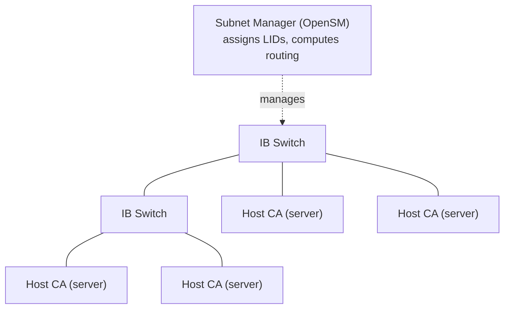
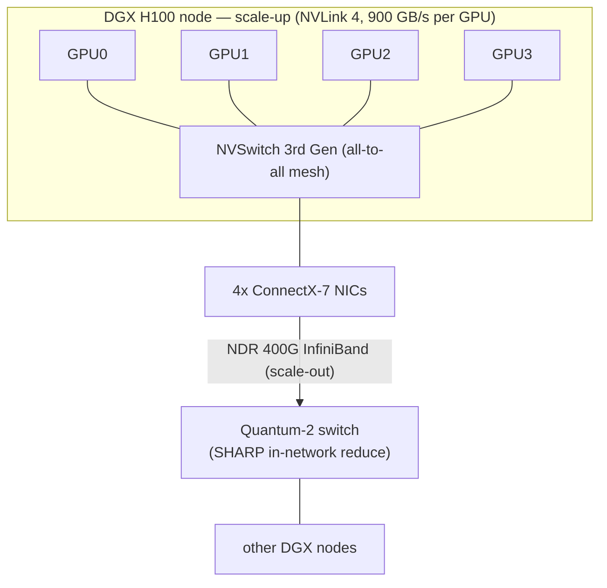

# InfiniBand — Architecture, Generations, RDMA, AI Fabric, and Roadmap

## Introduction: The Purpose-Built Fabric

InfiniBand is the fabric that was designed, from its inception, for exactly the problem that AI training poses: moving enormous amounts of data between many computers with the lowest possible latency, zero packet loss, and direct memory-to-memory transfer that bypasses the CPU entirely. For two decades it was a specialist's technology — the interconnect of supercomputers and high-end storage, invisible to the broader computing world. Then AI training exploded, and InfiniBand found itself at the center of the most important buildout in the history of computing, because the GPU clusters that train large language models demand precisely the lossless, low-latency, RDMA-native fabric that InfiniBand provides natively and that Ethernet must strain to approximate.

This chapter covers InfiniBand comprehensively: its history and the pivotal NVIDIA acquisition of Mellanox, its generational speed roadmap from SDR to XDR, its layered architecture (credit-based link layer, RDMA transport, subnet management, routing), the NVIDIA product family that dominates AI fabric (ConnectX NICs, Quantum switches, BlueField DPUs, NVLink/NVSwitch, SHARP in-network computing), and the detailed comparison between InfiniBand and Ethernet for AI that frames the central strategic question of the field. It builds on the RDMA concepts that File 08 develops further and feeds directly into the AI fabric architectures of File 15.

## InfiniBand History and Ecosystem

### Origins: A Merger of Visions

InfiniBand was born in **1999** from the merger of two competing next-generation I/O efforts: **Future I/O** (backed by Compaq, IBM, and HP) and **Next Generation I/O** (backed by Intel and others). The combined effort, governed by the **InfiniBand Trade Association (IBTA)**, aimed to replace the aging PCI bus with a switched, serial, high-speed fabric that could serve both as a system I/O interconnect and as a network between systems. The first products shipped around 2001.

The original grand ambition — to replace PCI as the universal I/O fabric inside every server — did not materialize; PCIe (File 03) won that role. But InfiniBand found a durable and growing home in **high-performance computing (HPC)** and **high-end storage**, where its low latency, high bandwidth, and native RDMA gave it decisive advantages over the Ethernet of the era. Through the 2000s and 2010s, InfiniBand became the dominant interconnect of the TOP500 supercomputers and a staple of latency-sensitive enterprise storage and database clusters. Ethernet won general computing; InfiniBand won the performance frontier.

### The NVIDIA Acquisition of Mellanox

The single most consequential event in InfiniBand's history was **NVIDIA's acquisition of Mellanox Technologies in 2020 for approximately $6.9 billion**. Mellanox was the dominant InfiniBand vendor — effectively the InfiniBand ecosystem, supplying the NICs (ConnectX), switches (Switch-IB, Quantum), and software. By acquiring Mellanox, NVIDIA gained control of both ends of the AI training system: the **GPU** that does the computation and the **interconnect** that binds GPUs into clusters.

The strategic logic, fully apparent only in hindsight, was extraordinary. As AI training scaled from single GPUs to clusters of thousands, the interconnect became as important as the GPU, and NVIDIA now owned both. The acquisition gave NVIDIA the ConnectX-7 and BlueField-3 NICs, the Quantum-2 InfiniBand switch, and — crucially — the ability to **co-design** the GPU, the NIC, the switch, and the collective-communication software (NCCL) as a single, vertically integrated AI fabric. It also gave NVIDIA a near-monopoly on InfiniBand, a position of immense pricing power and strategic control that the company has leveraged across the AI boom. NVIDIA's networking business, post-acquisition, grew into a multi-billion-dollar revenue stream and a central pillar of its AI dominance.

### Architectural Philosophy: Lossless by Design

The deepest difference between InfiniBand and Ethernet is philosophical. **InfiniBand is lossless by design**: its link layer uses **credit-based flow control**, in which a sender may transmit only if it holds credits indicating the receiver has buffer space, so the receiver's buffer never overflows and packets are never dropped due to congestion. Losslessness is intrinsic, not bolted on.

**Ethernet is best-effort by design**: it was built to drop packets under congestion and rely on upper-layer retransmission, and losslessness (for RoCEv2) must be retrofitted via PFC and congestion-control algorithms (DCQCN, etc.), with all the pathologies File 06 described. InfiniBand is also **RDMA-native** — RDMA is the fundamental transport model, not an overlay — whereas RoCE adapts InfiniBand's RDMA semantics onto Ethernet. This native, proactive, lossless, RDMA-first design is InfiniBand's core technical advantage for AI, and it is why, for the most demanding training clusters, InfiniBand long remained the default despite its cost and single-vendor ecosystem.

## InfiniBand Generations and Speeds

InfiniBand bandwidth is quoted per-lane and per-port, with ports typically aggregating 4 lanes (4×). The generational progression:

| Gen | ~Year | Per-lane | 4× port | Signaling/encoding | NVIDIA product era |
|---|---|---|---|---|---|
| SDR (Single Data Rate) | 2001 | 2.5 Gbps | 10 Gbps | 8b/10b | First IB |
| DDR (Double Data Rate) | 2005 | 5 Gbps | 20 Gbps | 8b/10b | — |
| QDR (Quad Data Rate) | 2007 | 10 Gbps | 40 Gbps | 8b/10b | — |
| FDR (Fourteen Data Rate) | 2011 | 14 Gbps | 56 Gbps | 64b/66b | ConnectX-3 |
| EDR (Enhanced Data Rate) | 2015 | 25 Gbps | 100 Gbps | 64b/66b | ConnectX-4 |
| HDR (High Data Rate) | 2018 | 50 Gbps (PAM4) | 200 Gbps | PAM4 | ConnectX-6, Quantum |
| NDR (Next Data Rate) | 2022 | 100 Gbps (PAM4) | 400 Gbps | PAM4 | ConnectX-7, Quantum-2 |
| XDR (eXtra Data Rate) | 2025 (shipping) | 200 Gbps (PAM4) | 800 Gbps | PAM4 | ConnectX-8, Quantum-X800 / Quantum-X Photonics |
| Next generation | 2026–2027 | 400 Gbps class | 1.6 Tbps | PAM4 | ConnectX-9 SuperNIC, Rubin-era switches |

A few notes on the progression. The early generations (SDR through QDR) used **8b/10b encoding** with its 20% overhead; **FDR** switched to the far more efficient **64b/66b encoding** (3% overhead) and raised the per-lane rate to 14 Gbps (hence "Fourteen Data Rate"). **EDR** at 25 Gbps per lane gave the first "100G InfiniBand" (4×25), aligning with the 25G Ethernet lane era. **HDR** introduced **PAM4** at 50 Gbps per lane for 200G ports, powering NVIDIA DGX A100 systems. **NDR** doubled again to 100 Gbps per lane (400G ports), powering DGX H100. **XDR**, shipping from 2025 with ConnectX-8 and the Quantum-X800 switch family, reaches 200 Gbps per lane (800G ports), competing directly with 800G Ethernet for the AI fabric; the 800G XDR ramp alongside NVIDIA's Blackwell Ultra platform drove a sharp rebound in absolute InfiniBand revenue during 2025–2026 even as InfiniBand's *share* of AI back-end networking fell below Ethernet's. The generation after that arrives with the **Rubin** platform: **ConnectX-9 SuperNICs** and the accompanying switch silicon, alongside **Quantum-X Photonics** switches that integrate co-packaged optics (File 13) — roughly 115 Tbps per switch across 144 ports of 800G, the first co-packaged InfiniBand generation.

There are also **half-width variants** — HDR100, NDR100 — that use 2 lanes instead of 4 (e.g., 2×50G = 100G, 2×100G = 200G) for server ports that do not need full 4× width, allowing a switch port to be split to serve more endpoints economically.

## InfiniBand Architecture Deep Dive

*Figure 7.2 — InfiniBand uses centralized control: a Subnet Manager discovers the fabric, assigns 16-bit LIDs, and computes deadlock-free forwarding tables — contrasting with Ethernet's distributed, self-configuring BGP/ECMP control plane. Credit-based flow control on every link makes the fabric lossless by design.*

### The Link Layer: Credit-Based Flow Control

InfiniBand's link layer is built around **Virtual Lanes (VLs)** and **credit-based flow control**. A physical link is divided into up to **16 virtual lanes (VL0–VL15)**, each with its own independent buffer and credit pool (VL15 is reserved for subnet management traffic). Credit-based flow control works as follows: the receiver advertises to the sender how much buffer space it has available, in credits; the sender may transmit only as much data as it has credits for; as the receiver drains its buffer and frees space, it returns credits. Because the sender never transmits more than the receiver can buffer, **packets are never dropped due to congestion** — losslessness is guaranteed at the link level, proactively.

This contrasts sharply with Ethernet's PFC, which is **reactive**: Ethernet transmits freely until the receiver's buffer nearly overflows, then sends a PAUSE to stop the sender. InfiniBand's proactive credit scheme avoids the buffer-overflow brinkmanship and the congestion-spreading pathologies that plague PFC. The virtual lanes also provide native quality-of-service isolation, since each VL has independent buffering and flow control.

### The Transport Layer: Connection Types

InfiniBand's transport layer defines several **service types** that trade reliability, ordering, and scalability:
- **Reliable Connection (RC)**: connection-oriented, guaranteed in-order delivery with acknowledgments — the workhorse for RDMA in HPC and AI, providing TCP-like reliability with RDMA semantics.
- **Unreliable Connection (UC)**: connection-oriented but without acknowledgments; lower overhead where the application tolerates loss.
- **Unreliable Datagram (UD)**: connectionless, no delivery guarantee — used for scalable multicast and for applications that manage reliability themselves; UD scales to many peers without per-connection state.
- **Reliable Datagram (RD)**: a connectionless reliable service, rarely used in practice.
- **eXtended Reliable Connection (XRC)**: an important scalability enhancement that lets multiple queue pairs share resources, mitigating the "N² queue-pair problem" — in a naive RC scheme, every process pair needs its own queue pair, so a job with N processes per node across M nodes needs an enormous number of QPs; XRC reduces this dramatically, essential for large-scale MPI jobs.

### RDMA Verbs

InfiniBand's programming model is the **verbs** API, which exposes RDMA operations directly to applications:
- **RDMA Write**: the source's NIC writes data directly into a specified region of the remote node's memory, **without involving the remote CPU**. The remote CPU is not interrupted and consumes no cycles for the transfer.
- **RDMA Read**: the source reads data directly from remote memory, again without remote CPU involvement.
- **Atomic operations**: **Compare-and-Swap (CAS)** and **Fetch-and-Add** performed atomically on remote memory, enabling distributed synchronization primitives.
- **Send/Receive**: two-sided operations where the receiver posts a receive buffer and the sender sends into it (the only operations requiring receiver participation).

The defining feature is **kernel bypass**: verbs are executed from user space, with the application posting work requests directly to the NIC via memory-mapped I/O, bypassing the operating-system kernel entirely. No system calls, no kernel network stack, no data copies — the NIC DMAs data directly between application memory and the wire. This is what gives RDMA its sub-microsecond small-message latency and near-zero CPU overhead, and it is the foundation of high-performance distributed computing.

### Queue Pairs and Memory Registration

The core RDMA objects are:
- **Queue Pair (QP)**: a Send Queue plus a Receive Queue — the endpoint of an RDMA connection. Applications post Work Requests (WRs) to these queues.
- **Completion Queue (CQ)**: where the NIC posts completion notifications; the application polls the CQ to learn that operations have finished (polling, rather than interrupts, for lowest latency).
- **Memory Region (MR)**: a region of application memory **registered** with the NIC so the NIC can DMA to/from it. Registration pins the memory (prevents it from being paged out) and produces keys (local and remote) that authorize access. Memory registration has overhead, and managing it efficiently (registration caching, on-demand paging) is an important performance consideration.
- **Protection Domain (PD)**: an isolation boundary grouping QPs and MRs, preventing one application from accessing another's memory.
- **Address Handle (AH)**: destination addressing information for unreliable datagram communication.

### Subnet Management

An InfiniBand network (a "subnet") is centrally managed by a **Subnet Manager (SM)** — either the open-source **OpenSM** or a vendor implementation — running on a management node. Unlike Ethernet's distributed, self-configuring control plane (where every switch runs BGP or learns MACs independently), InfiniBand uses **centralized management**: the SM discovers the topology, assigns each port a **16-bit LID (Local Identifier)**, computes the forwarding tables for every switch, configures QoS and partitions, and continuously monitors the subnet. The 16-bit LID space limits a single subnet to 65,536 endpoints; larger networks connect multiple subnets via InfiniBand routers.

This centralized model is both a strength and a weakness. It enables globally optimal routing and tight control, but it requires running and protecting the SM, and it is operationally unfamiliar to network engineers steeped in Ethernet/IP tooling — a real factor in the hyperscalers' preference for Ethernet.

### Routing

InfiniBand switches forward based on the destination LID using a **Linear Forwarding Table** computed by the SM. The SM runs a **routing algorithm** appropriate to the topology — **MINHOP** for general topologies, **up/down routing** for fat-trees (packets go up to a common ancestor switch, then down, guaranteeing deadlock freedom), or **DFSSSP** and others for specific structures. NVIDIA's Quantum switches support **Adaptive Routing (AR)**, in which a switch can dynamically reroute packets onto less-congested paths rather than rigidly following the precomputed table, improving load balance for irregular and bursty traffic — a significant advantage for AI workloads whose collective patterns can otherwise create hot spots. Adaptive routing must be done carefully to preserve the lossless, ordered semantics that RDMA relies on.

## NVIDIA AI Fabric Products

*Figure 7.1 — NVIDIA's two-tier AI fabric: NVLink/NVSwitch provides the ultra-high-bandwidth scale-up mesh within a node, while InfiniBand (ConnectX-7 NICs into Quantum-2 switches, with SHARP doing in-network gradient reduction) provides the scale-out fabric between nodes (File 15).*

NVIDIA's post-Mellanox networking portfolio is a vertically integrated AI fabric, co-designed with its GPUs and software.

### ConnectX-7 and the NIC Line

The **ConnectX-7** is NVIDIA's NDR-generation network adapter, supporting **400 Gbps InfiniBand (NDR) or 400 GbE**, with a PCIe 5.0 host interface. Beyond raw bandwidth, ConnectX-7 provides **hardware offload of MPI collectives** and supports **SHARP** (below), as well as extensive offloads for storage and networking. The **ConnectX-8**, the XDR-generation successor, advances to 800 Gbps. These NICs are the endpoints of the AI fabric, sitting in every GPU server and depositing data directly into GPU memory via **GPUDirect RDMA** (the NIC DMAs straight to/from GPU memory, bypassing the CPU and host memory entirely).

### Quantum-2 and Quantum-3 Switches

The **Quantum-2** is NVIDIA's NDR InfiniBand switch: **64 ports of 400 Gbps**, for **25.6 Tbps** of non-blocking switching capacity, with adaptive routing, FEC, and — critically — **in-switch SHARP computation**. Quantum-2 is the building block of the DGX SuperPOD fabric. The **Quantum-3**, the XDR-generation switch, advances to 800 Gbps per port and far higher aggregate capacity, extending NVIDIA's InfiniBand leadership into the 800G era and competing with 800G Ethernet AI fabrics.

### SHARP — In-Network Computing

**SHARP (Scalable Hierarchical Aggregation and Reduction Protocol)** is one of NVIDIA's most important fabric differentiators. In a conventional AllReduce, gradient data traverses the network multiple times as it is reduced (summed) across all participants — in a ring AllReduce, each piece of data crosses the fabric roughly twice. SHARP moves the **reduction operation into the switch ASICs**: as gradient data flows up a tree of switches, each switch sums the contributions from its children and forwards only the partial sum, so the data is reduced *in the network* rather than at the endpoints. The result is that the AllReduce completes with far less data movement — effectively roughly **doubling the effective bandwidth** for AllReduce compared to a ring algorithm, and eliminating the endpoint reduction step. Quantum-2 switches perform FP16/BF16/INT reductions in-network. SHARP is a concrete example of **in-network computing**, and it is a major reason InfiniBand fabrics deliver superior collective performance — a capability Ethernet fabrics are racing to match (File 15).

### BlueField DPUs

The **BlueField-3 DPU (Data Processing Unit)** combines a ConnectX-7 NIC with a 16-core Arm CPU complex on a single device, creating a programmable infrastructure processor. It offloads from the host CPU the entire "infrastructure" workload — storage virtualization (NVMe-oF), security (IPsec, TLS), network virtualization (Open vSwitch, VXLAN VTEP), and more — freeing host cores for application work and providing an isolation boundary between tenant workloads and infrastructure functions. The distinction between a **SmartNIC** (a NIC with some offload) and a **DPU** (a NIC with a full programmable CPU complex and an operating system) is exemplified by BlueField, which runs its own Linux and is programmable via NVIDIA's DOCA framework. DPUs are central to the security and virtualization architectures of File 19 and File 20.

### NVLink and NVSwitch — The Scale-Up Fabric

Distinct from InfiniBand (the scale-out fabric between nodes), **NVLink** is NVIDIA's **scale-up** fabric connecting GPUs within a node. **NVLink 4.0** provides **900 GB/s of bidirectional bandwidth per H100 GPU**, via 18 links per GPU, and the **NVSwitch (3rd Gen)** connects the 8 GPUs in a DGX H100 in a full all-to-all mesh at that bandwidth. **NVLink 5.0** (Blackwell generation) doubles per-link bandwidth, and the **GB200 NVL72** rack-scale system connects **72 Blackwell GPUs and 36 Grace CPUs** via 4th-generation NVLink switches into a single enormous scale-up domain, with **1.8 TB/s of bidirectional NVLink bandwidth per GPU**. The **Rubin** generation continues the doubling: **NVLink 6** delivers **3.6 TB/s per GPU**, in the **Vera Rubin NVL72** rack systems that entered full production in mid-2026 with partner availability in the second half of the year. NVLink's bandwidth — several times the per-GPU figure of even the fastest scale-out fabric — is what makes tensor parallelism (which demands frequent, latency-sensitive, high-bandwidth collectives within a transformer layer) practical.

NVLink has been NVIDIA's most jealously guarded proprietary advantage, and it is the target of the open UALink effort (File 24) — but two things have complicated that framing. First, AMD's UALink-aligned **Helios** rack quotes roughly **3.6 TB/s of scale-up bandwidth per accelerator** across 72 GPUs, claiming parity with the contemporaneous NVLink generation on an open specification. Second, NVIDIA itself opened a door: **NVLink Fusion** licenses NVLink to third-party silicon, with partners building NVLink-attached components. An incumbent that licenses its moat is usually responding to a credible alternative, and that is the most informative signal available about how NVIDIA reads the scale-up contest.

## InfiniBand versus Ethernet for AI — Detailed Comparison

The choice between InfiniBand and Ethernet for an AI training fabric is the field's defining decision, and it turns on a multidimensional trade-off:

**Latency.** InfiniBand NDR delivers MPI latencies around **600 nanoseconds**, while RoCEv2 over Ethernet typically delivers **1–2 microseconds**. InfiniBand's lower and more deterministic latency benefits the latency-sensitive synchronous collectives that dominate training. The tail of the latency distribution matters even more than the mean (because collectives are barriers), and InfiniBand's credit-based, lossless design produces tighter tails.

**Congestion control.** InfiniBand's **credit-based flow control is proactive and deterministic** — no drops, no PFC storms, predictable behavior under the synchronized bursts of AllReduce. RoCEv2's **DCQCN is reactive**, and even when well-tuned it experiences occasional microbursts and the risk of PFC pathologies. For all-to-all traffic at scale, InfiniBand's predictability is a real advantage, though Ethernet's congestion control is improving rapidly (HPCC, Ultra Ethernet).

**Management and ecosystem familiarity.** InfiniBand requires a **Subnet Manager and a proprietary management plane** unfamiliar to most network operators. Ethernet uses **standard BGP/OSPF, OpenConfig, gNMI, and the entire ecosystem of Ethernet tooling** that operators already know. For hyperscalers running vast fleets with established operational practices, this familiarity is a powerful pull toward Ethernet.

**Cost.** InfiniBand NDR switches and NICs are generally **more expensive** than comparable 400G Ethernet, reflecting both genuine engineering and NVIDIA's pricing power as the monopoly InfiniBand supplier. Ethernet benefits from ferocious multi-vendor competition (Broadcom, Marvell, Cisco, Arista, and others) that drives prices down.

**Ecosystem openness.** The InfiniBand ecosystem is **NVIDIA-only**, a single point of supply and control. The Ethernet ecosystem spans many silicon vendors and system vendors, giving customers multi-sourcing, negotiating leverage, and freedom from single-vendor lock-in. This is perhaps the single biggest factor in the hyperscalers' Ethernet preference: they are deeply reluctant to build their most strategic infrastructure on a single vendor's proprietary, monopoly-priced fabric.

### NVIDIA Spectrum-X: Ethernet on NVIDIA's Terms

NVIDIA's response to the Ethernet groundswell is **Spectrum-X**, an Ethernet-based AI fabric that bundles the **Spectrum-4** Ethernet switch ASIC (51.2 Tbps) — succeeded by **Spectrum-5** and, with the Rubin platform, **Spectrum-6** — with **ConnectX** RoCEv2 NICs and **NVIDIA-proprietary congestion-management** enhancements (extensions to DCQCN, adaptive routing, and precise telemetry), claiming to deliver InfiniBand-like performance over a standard Ethernet fabric. Spectrum-X is a shrewd strategic hedge: if the market moves to Ethernet for AI, NVIDIA intends to capture that Ethernet fabric the same way it captured InfiniBand — by selling the NIC, the switch, and the congestion-control "secret sauce" together.

**The hedge worked.** Spectrum-X passed a **$10 billion annualized revenue run rate** during NVIDIA's fiscal 2026, its demand now roughly matching NVIDIA's legacy InfiniBand base, and NVIDIA took the **number-one position in datacenter Ethernet switching by revenue** — a GPU company outselling the incumbent networking vendors in their own category. The line has extended in two directions: **Spectrum-X Photonics** switches with co-packaged optics (the SN6810 at 102.4 Tbps and SN6800 at 409.6 Tbps, File 13), and **Spectrum-XGS**, which stretches Spectrum-X congestion control across datacenter boundaries for the "scale-across" case (File 24).

The consequence for this chapter's central comparison is that the InfiniBand-versus-Ethernet question has partly dissolved into a different one. Ethernet won on protocol; the open, multi-vendor ecosystem has not yet won on supply. Spectrum-X versus the open Ultra Ethernet Consortium stack versus InfiniBand remains the three-way contest that will determine the shape of the AI fabric market (Files 15, 23, 24) — but as of 2026 two of those three contenders are NVIDIA's.

## Extended Deep Dive: How Credit-Based Flow Control Actually Works

The claim that InfiniBand is "lossless by design" rests entirely on its credit-based flow control, and the mechanism rewards close examination because it explains InfiniBand's deterministic behavior under load. On each link, for each virtual lane, the receiver maintains a buffer and continuously advertises to the sender how much space is available, expressed in **credits** (each credit corresponding to a quantum of buffer space). The sender maintains a count of available credits and **decrements it as it transmits**; when the count would go negative — meaning the receiver has no guaranteed space — the sender simply **stops**. As the receiver processes data and frees buffer space, it returns credits to the sender (via flow-control packets), replenishing the sender's count and allowing transmission to resume. Because the sender never transmits data the receiver cannot buffer, the receiver's buffer never overflows, and no packet is ever dropped due to congestion — losslessness is guaranteed proactively, as an invariant of the protocol, not achieved reactively after the fact.

Contrast this with Ethernet's PFC (File 06): Ethernet transmits freely until the receiver's buffer nearly overflows, then sends a PAUSE to halt the sender — a *reactive* scheme that must act before the buffer overflows but after it is nearly full, with the attendant brinkmanship, the coarse all-or-nothing pause, and the congestion-spreading and deadlock pathologies. InfiniBand's *proactive* credit scheme never lets the buffer approach overflow, and because credits are per-virtual-lane, different traffic classes are independently flow-controlled without head-of-line blocking across lanes. The cost is that credit-based flow control requires the receiver to commit buffer space per link per virtual lane (consuming on-chip memory) and requires the credit-return loop to be fast relative to the link's bandwidth-delay product (so credits are replenished before the sender stalls — which is why InfiniBand's losslessness is most natural at the short distances of a datacenter fabric). This proactive, deterministic, per-lane flow control is the architectural root of InfiniBand's predictable, tight-tail behavior under the synchronized bursts of AI collectives, and it is precisely the behavior that RoCE must labor to approximate with PFC plus DCQCN.

## Extended Deep Dive: The Economics and Lock-In of the InfiniBand Monopoly

InfiniBand's status as a **single-vendor (NVIDIA) technology** has profound economic and strategic consequences that shape the entire AI-fabric market. Because NVIDIA is effectively the sole supplier of InfiniBand NICs (ConnectX), switches (Quantum), and the surrounding software, it commands pricing power unavailable in the fiercely competitive Ethernet market, and InfiniBand NDR/XDR equipment carries a premium over comparable Ethernet at similar port speeds. More importantly, building an AI cluster on InfiniBand means committing the most strategic infrastructure to a single vendor's proprietary, monopoly-priced fabric — with no second source, no negotiating leverage from competing suppliers, and dependence on that vendor's roadmap and allocation decisions (which, during AI-driven shortages, become acute). This is the single largest factor in the hyperscalers' determination to move to Ethernet for AI: not that InfiniBand is technically inferior (it is, in many respects, superior), but that the hyperscalers will not build their core infrastructure on a single-vendor lock-in, however good.

NVIDIA's counter is its **vertical integration**: by co-designing the GPU, the NIC, the switch, the DPU, and the collective-communication software (NCCL) as one optimized system, NVIDIA delivers an AI fabric whose end-to-end performance exceeds what a multi-vendor assembly can achieve, and it argues that this integration justifies the premium and the lock-in. The tension between NVIDIA's integrated-performance argument and the hyperscalers' open-ecosystem-and-cost argument is the central strategic dynamic of AI networking, and it is why NVIDIA hedges with Spectrum-X (capturing the Ethernet fabric on NVIDIA's terms) and why the open camp invests so heavily in the Ultra Ethernet Consortium and UALink (Files 15, 24). The InfiniBand monopoly is, in a sense, both NVIDIA's greatest asset and the greatest motivator of the forces arrayed against it.

## Extended Deep Dive: SHARP and the Rise of In-Network Computing

SHARP (introduced above) merits deeper treatment as the leading example of **in-network computing** — the migration of computation from the endpoints into the network itself — which is among the most important architectural trends in AI fabrics. In a conventional AllReduce, the reduction (summing gradient contributions) happens at the endpoints, and the data must traverse the network multiple times as partial sums are exchanged; the bandwidth cost grows with the number of participants. SHARP instead organizes the participating endpoints into a **reduction tree** rooted in the switches: as each switch receives the contributions from its children (the endpoints or switches below it), it performs the reduction (the sum) in dedicated arithmetic hardware in the switch ASIC and forwards only the single reduced result upward; the final result is then broadcast back down the tree. The data is reduced *as it flows through the network*, so it traverses each link essentially once rather than many times, and the reduction work is offloaded from the GPUs to the switches — roughly doubling the effective AllReduce bandwidth versus a ring algorithm and eliminating the O(N) scaling of ring latency.

The implications extend beyond AllReduce. In-network computing reframes the switch from a pure packet-mover into a participant in the computation, and the trajectory (File 24) points toward richer in-network operations — more reduction data types and operators, in-network handling of Mixture-of-Experts routing, and potentially other collective primitives. The strategic significance is that in-network computing is a fabric-level capability that confers a real performance advantage, and replicating it in the open-Ethernet world (via the Ultra Ethernet Consortium and emerging in-network-compute standards) is essential for Ethernet to fully match InfiniBand for AI. SHARP is thus both a concrete NVIDIA advantage today and a template for where all AI fabrics are heading: toward networks that compute, not merely connect.

## Extended Deep Dive: Subnet Management and Routing in Practice

The centralized subnet-management model that distinguishes InfiniBand from Ethernet deserves practical elaboration, because it is both a strength and an operational characteristic that shapes how IB fabrics are run. When an InfiniBand subnet boots (or when topology changes), the **Subnet Manager (SM)** sweeps the fabric, discovering every switch and host channel adapter, assigns each port a 16-bit **LID (Local Identifier)**, and then computes the **forwarding tables** for every switch — deciding, for each destination LID, which output port each switch should use. The routing algorithm the SM runs is chosen to match the topology and to guarantee deadlock freedom: **up/down routing** or **fat-tree routing** for Clos topologies (packets ascend to a common ancestor then descend, with rules that prevent the credit-dependency cycles that would deadlock), **MINHOP** for general topologies, and specialized algorithms (DFSSSP) for particular structures. The SM also configures quality-of-service (mapping traffic to virtual lanes), partitions (PKeys, the IB equivalent of VLANs for multi-tenant isolation), and the SHARP reduction trees.

This centralized model gives InfiniBand globally optimal, deadlock-free routing computed with full topology knowledge — something Ethernet's distributed BGP/ECMP cannot match for optimality — but it imposes operational characteristics: the SM must be highly available (a failed SM with no backup is a fabric-wide risk), its routing computation must scale to the fabric size (large fabrics stress the SM), and the management model is unfamiliar to operators steeped in Ethernet's distributed, self-configuring tooling. In practice, IB fabrics run a primary and standby SM, and the SM's routing-algorithm choice and configuration are key operational decisions (File 17). The centralized SM is emblematic of InfiniBand's overall philosophy — proactive, deterministic, globally coordinated — versus Ethernet's reactive, distributed, self-organizing approach, and it is one more axis along which the two fabrics differ in operational character, contributing to the hyperscalers' preference for the operationally familiar Ethernet model despite InfiniBand's technical advantages.

## Extended Deep Dive: Adaptive Routing and Congestion in InfiniBand

While InfiniBand's credit-based flow control makes it lossless, it does not by itself solve **congestion** — the situation where too much traffic converges on a path or destination, filling buffers and stalling senders via credit exhaustion (the IB analog of the congestion that ECN/DCQCN manage in Ethernet). InfiniBand addresses this with **adaptive routing (AR)** and **congestion control**. Adaptive routing, supported by NVIDIA Quantum switches, lets a switch dynamically choose among multiple equal-cost output ports for a given destination based on current congestion, spreading traffic away from hot spots — the IB counterpart to the ECMP-plus-adaptive-routing techniques that Ethernet fabrics use to defeat the elephant-flow problem (File 17). Because IB is lossless and order-sensitive, adaptive routing must be done carefully to preserve the ordering that RC transport expects, using techniques that maintain per-flow ordering while rebalancing across paths.

InfiniBand also defines a **congestion-control** mechanism (CCA, Congestion Control Architecture): switches detect congestion and mark packets (via a Forward Explicit Congestion Notification, FECN), the receiver reflects it (BECN), and the sender reduces its injection rate — conceptually similar to ECN/DCQCN in Ethernet, but operating within IB's lossless, credit-based framework as an optimization to reduce the congestion spreading that credit backpressure alone would cause. The combination of credit-based losslessness (no drops), adaptive routing (load balancing), and congestion control (rate adjustment) gives InfiniBand a comprehensive congestion-management toolkit that is, in important respects, the model that Ethernet AI fabrics (DCQCN, HPCC, Ultra Ethernet, adaptive routing) have been working to replicate. Understanding that InfiniBand solved losslessness, load balancing, and congestion control in an integrated, co-designed way — and that RoCE/Ethernet must assemble equivalent capabilities from PFC, ECN, congestion-control algorithms, and adaptive routing — clarifies why InfiniBand long held the AI-fabric advantage and what the open-Ethernet camp must achieve to match it.

## Conclusion: The Fabric That AI Made Indispensable

InfiniBand spent two decades as a specialist's technology, excellent but niche, the interconnect of supercomputers far from the mainstream of computing. The AI revolution thrust it into the center of the industry, because the synchronous, lossless, low-latency, RDMA-native collective communication that AI training demands is precisely what InfiniBand was built to deliver — and NVIDIA's prescient acquisition of Mellanox gave it ownership of both the GPU and the fabric, a vertically integrated AI machine of unmatched performance and formidable pricing power. The open-Ethernet world, led by the hyperscalers and the Ultra Ethernet Consortium, is mounting a determined challenge, and NVIDIA is hedging with Spectrum-X. Whether InfiniBand retains its primacy, cedes ground to Ethernet, or coexists in a segmented market, its architectural ideas — credit-based losslessness, RDMA, kernel bypass, in-network reduction — have become the template that every AI fabric, InfiniBand or Ethernet, must now embody. The next chapter, on RDMA and RoCE, examines those ideas in the detail they deserve, and File 15 brings the InfiniBand-versus-Ethernet contest to its full resolution in the context of complete AI cluster architectures.
