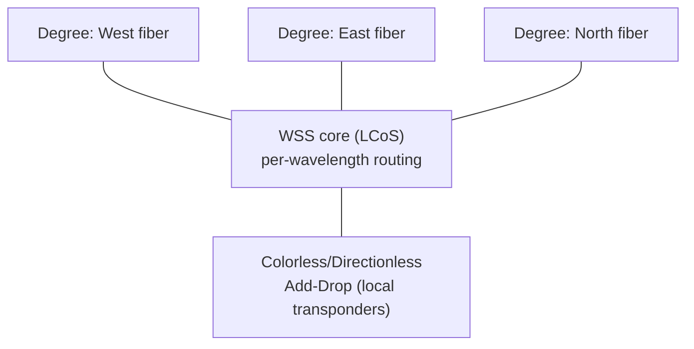
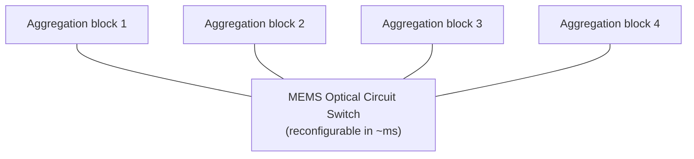

# Optical Switching, ROADM Architecture, and Reconfigurable Networks

## Introduction: Switching Light Without Touching the Bits

Once data is on a wavelength of light traveling through fiber, it is enormously advantageous to keep it optical for as long as possible. Every conversion from optical to electrical and back (an "OEO" conversion) consumes power, adds latency, and requires expensive transponders. **Optical switching** — routing wavelengths or whole fibers without converting them to electrical signals — lets the network steer light through the topology while it remains light. This chapter covers the technologies of optical switching: the **ROADM (Reconfigurable Optical Add-Drop Multiplexer)** that routes individual wavelengths through the transport network, the **WSS (Wavelength Selective Switch)** at its heart, the **OXC (Optical Cross-Connect)** for large-scale all-optical switching, the **OCS (Optical Circuit Switch)** that hyperscalers now deploy inside datacenters, and the emerging silicon-photonic switches that promise nanosecond reconfiguration. It builds on the WDM and component physics of File 09 and connects to the datacenter topology innovations of File 06 and the AI-fabric reconfigurability of File 15.

## ROADM — Reconfigurable Optical Add-Drop Multiplexer

*Figure 11.2 — A multi-degree CDC-ROADM. Each wavelength can pass through to any degree, or be dropped to/added from local transponders, all in the optical domain via wavelength-selective switches. This wavelength-granular, software-driven routing is what makes the optical transport network agile.*

The **ROADM** is the workhorse of the modern optical transport network. Its job is to take the dozens of wavelengths arriving on incoming fibers and, for each wavelength, decide whether to **pass it through** (continue toward another destination), **drop it** (deliver it to a local transponder/receiver), or **add** a locally generated wavelength to an outgoing fiber — all in the optical domain, without converting the pass-through wavelengths to electrical. This wavelength-granular, remotely reconfigurable routing is what makes a modern optical network agile: operators can provision and reroute wavelengths from a management console, without sending technicians to patch fibers.

### Evolution and Architecture

ROADMs evolved through generations of increasing flexibility. Early fixed OADMs could add/drop only predetermined wavelengths. Modern ROADMs are built around the **Wavelength Selective Switch (WSS)** and add **degrees** — a "degree" is a direction (an incoming/outgoing fiber pair toward a neighboring node). A 2-degree ROADM sits on a linear span; an 8- or 20-degree ROADM sits at a mesh junction routing wavelengths among many directions.

The most flexible modern architecture is the **CDC ROADM (Colorless, Directionless, Contentionless)**:
- **Colorless**: any add/drop port can handle any wavelength (not hardwired to a specific color), so a transponder can be tuned to any wavelength and connected to any port.
- **Directionless**: an added/dropped wavelength can be routed to or from any degree (direction), not just one.
- **Contentionless**: multiple instances of the same wavelength (from different directions) can be added/dropped simultaneously without internal blocking.

A CDC ROADM thus allows fully automated, software-defined wavelength provisioning — any wavelength, any direction, any port — the foundation of software-defined optical networking. ROADMs also incorporate **amplifier stages** (pre-amplifiers, boosters, and mid-stage EDFAs) and must manage the **OSNR budget** as wavelengths cascade through multiple ROADMs, since each ROADM and amplifier adds loss and noise. **Gridless (flex-grid) ROADMs** support variable channel widths (File 09), allocating spectrum flexibly to channels of different baud rates.

## WSS — Wavelength Selective Switch

The **WSS** is the optical component at the heart of every ROADM. It takes a fiber carrying many wavelengths, spatially disperses them (with a grating), and uses a programmable spatial light modulator to independently route each wavelength to any of several output ports. The dominant technology is **LCoS (Liquid Crystal on Silicon)** — a 2D array of liquid-crystal pixels that steer each dispersed wavelength by imposing a programmable phase pattern — which supports the full C-band, 96+ channels, flex-grid operation, and per-wavelength attenuation control (3–5 dB insertion loss per port). An alternative technology is **MEMS-based WSS** (tiny tilting mirrors). 

The WSS market is a near-duopoly: **Lumentum** holds the largest share (~45–50%), followed by **Coherent (the merged II-VI/Finisar)** (~35%), with smaller players (Santec, others). Because every ROADM port needs a WSS, this duopoly gives Lumentum and Coherent enormous leverage in the optical-systems supply chain (File 23). The WSS is one of the highest-value optical components, and the LCoS technology that powers it is a sophisticated photonic-MEMS-LC hybrid.

## OXC — Optical Cross-Connect

An **OXC (Optical Cross-Connect)** performs all-optical switching at the granularity of whole fibers or fiber-spatial-paths (rather than individual wavelengths). The dominant technology for large OXCs is **3D MEMS**: an array of microscopic mirrors that can tilt in two axes to steer a beam of light from any input fiber to any output fiber, building switch matrices as large as **1000×1000 ports** or more. OXCs are used in submarine cable landing stations (to interconnect cable systems and terrestrial backhaul) and in large optical cores. **Calient Technologies** is a leading vendor of 3D-MEMS OXCs (its S-series). OXCs are slow to reconfigure (milliseconds, limited by mirror movement) but offer massive, protocol-transparent, bit-rate-transparent all-optical switching at very low power per bit — switching light without ever looking at it.

## OCS — Optical Circuit Switching in the Datacenter

*Figure 11.1 — Optical circuit switching (Google's Apollo/Palomar) interposes a reconfigurable MEMS optical switch between aggregation blocks, so the fabric topology can be re-wired in milliseconds to match the traffic — or, for AI, the collective-communication pattern of a job (Files 06, 15). It also enables incremental, heterogeneous fabric upgrades.*

The most striking recent application of optical switching is **inside the datacenter**, where **Google** pioneered **Optical Circuit Switching (OCS)** at production scale. Google's **Apollo/Palomar** OCS systems, described in the SIGCOMM 2022 paper **"Jupiter Evolving,"** use **MEMS-based optical switches** to dynamically reconfigure the topology of the datacenter fabric. Rather than a fixed Clos with electronic spine switches, Google interposes OCS between aggregation blocks, so the logical topology can be reconfigured (in roughly milliseconds) to match traffic patterns and to allow incremental, heterogeneous upgrades of the fabric.

The motivations are several. **Topology engineering**: different traffic patterns (and, for AI, different collective-communication algorithms) are best served by different topologies, and OCS lets the fabric adapt. **Incremental upgrade**: OCS decouples the generations of equipment, letting Google upgrade parts of the fabric without forklift replacement. **Elephant flows**: large, long-lived flows can be given dedicated optical circuits, offloading them from the packet-switched fabric. **Power and cost**: eliminating a tier of electronic spine switches (replacing it with passive-ish optical switching) saves power and cost. For AI training specifically, the ability to reconfigure topology to match the communication pattern of a given job — providing non-blocking connectivity for the AllReduce or AllToAll a job needs — is a powerful optimization (File 15). Google's deployment of OCS at datacenter scale is one of the most important networking innovations of the past decade, and other operators are following.

## Silicon-Photonic Switches

A frontier technology is the **silicon-photonic switch** — optical switching integrated on a silicon-photonic chip using **microring resonators** or **Mach-Zehnder interferometers (MZIs)** as the switching elements. Unlike MEMS (millisecond reconfiguration) or LCoS (similar), silicon-photonic switches can reconfigure in **nanoseconds**, opening the possibility of fast, fine-grained optical switching that could one day switch individual packets or bursts optically. Current devices are limited in port count (on the order of 64×64) and face challenges (insertion loss, thermal tuning of rings, integration with the rest of the system). A startup ecosystem — **Lightmatter (Passage), Ayar Labs, Celestial AI, Salience Labs** — is developing silicon-photonic switching and interconnect for AI fabrics, where the combination of fast switching and optical bandwidth density could be transformative (Files 13, 24). Silicon-photonic switching is also intimately tied to co-packaged optics, where the optical engine and switching could one day be integrated with the compute.

## Optical Switching Vendors and Systems

The optical-systems vendors that build ROADMs, OXCs, and the surrounding transport platforms include:
- **Ciena** — Waveserver and GeoMesh platforms, a leader in coherent transport and ROADM systems.
- **Nokia** — the 1830 Photonic Service Switch (PSS) family and 1350 management.
- **Infinera** — the GX series and FlexILS open line system, with its distinctive InP PIC technology.
- **Fujitsu** — the 1FINITY platform, prominent in disaggregated/open optical.
- **Huawei** — OptiX OSN 9800 and related platforms, dominant in many non-Western markets but constrained by export controls in others.
- **ZTE**, **Coriant (now part of Infinera)**, and others round out the field.

Component suppliers — **Lumentum and Coherent** (WSS, amplifiers, lasers), **Calient** (OXC) — supply the building blocks that these systems vendors integrate. The competitive dynamics, including the tension between integrated systems and disaggregated open-optical architectures, are detailed in File 23.

## Extended Deep Dive: Why Optical Circuit Switching Fits AI Training

The deployment of optical circuit switching inside the datacenter — Google's most visible contribution (above) — is worth connecting explicitly to the AI workload, because the fit is not coincidental. AI training collectives (File 15) have **structured, predictable, and relatively long-lived** communication patterns: a data-parallel job performs the same AllReduce across the same set of GPUs every step, for hours or days; a pipeline-parallel job sends activations between the same adjacent stages repeatedly. These are precisely the conditions under which **circuit switching** excels: when a communication pattern is stable and high-volume, dedicating an optical circuit to it (which takes milliseconds to establish via MEMS reconfiguration) amortizes the setup cost over a long-lived, high-bandwidth flow, and the circuit then carries the traffic at full optical bandwidth with no packet-switching overhead, no buffering, and no congestion. Packet switching, by contrast, excels at bursty, short-lived, unpredictable traffic — exactly what circuit switching handles poorly.

The synthesis Google pursued is a **hybrid** fabric: packet switching for the general, bursty traffic, and optical circuit switching to provision direct, reconfigurable topology for the large, structured flows and to match the fabric topology to the job's communication pattern. Because different parallelism strategies and different collective algorithms prefer different topologies (a ring AllReduce wants a ring, a hierarchical reduction wants a tree), the ability to reconfigure the optical topology per job — or even per phase of a job — can substantially improve effective bandwidth and reduce collective completion time versus a static Clos that must serve all patterns with one topology. As AI clusters scale toward 100,000+ GPUs (File 24), where static fat-trees become enormously expensive and where collective latency scaling becomes prohibitive, reconfigurable optical fabrics are an increasingly attractive tool, and the OCS that began as a Google datacenter innovation is poised to become a central technology of the largest AI fabrics.

## Extended Deep Dive: The Reconfiguration-Time Spectrum

A useful way to organize the optical-switching technologies of this chapter is by their **reconfiguration time**, because that parameter determines what each can be used for. At the slow end, **3D-MEMS OXC and MEMS-based OCS** reconfigure in roughly **milliseconds** (limited by the physical movement and settling of micromirrors) — fast enough to reprovision topology between jobs or phases, or to reroute around failures, but far too slow to switch individual packets. **LCoS-based WSS/ROADMs** are similarly in the millisecond range for wavelength reconfiguration, appropriate for provisioning and grooming wavelengths in the transport network where changes are infrequent. At the fast end, **silicon-photonic switches** (microrings, MZIs) reconfigure in **nanoseconds**, fast enough in principle to switch bursts or even packets optically — opening the tantalizing possibility of optical packet/burst switching that has long been a research goal, though current devices are limited in port count and face loss and control challenges.

This reconfiguration-time spectrum maps onto a fundamental architectural question: at what timescale should the network's topology adapt? Millisecond switching (MEMS) suits topology engineering and provisioning; nanosecond switching (silicon photonics) could suit fine-grained, per-burst optical routing if the technology matures. The gap between them — microsecond switching — is largely unserved by mature technology, and bridging it is one of the goals of the silicon-photonic-switch startups (File 13). As AI fabrics push toward reconfigurability at finer granularity to match their structured collectives, the reconfiguration-time spectrum, and the technologies that occupy each part of it, become central to fabric design — and the convergence of fast optical switching with co-packaged optics could eventually blur the line between the switch and the optical fabric entirely.

## Extended Deep Dive: The OSNR Penalty of Cascaded ROADMs

A practical constraint that shapes optical-network design is the **OSNR penalty of cascading ROADMs**, and understanding it explains why optical networks are engineered the way they are. Each ROADM a wavelength passes through adds loss (the WSS insertion loss of 3–5 dB per pass, plus the multiplexing/demultiplexing) that must be made up by amplification, and each amplifier (EDFA) adds ASE noise (File 09) that degrades the optical signal-to-noise ratio. So a wavelength traversing many ROADMs and amplifier stages accumulates noise, and the OSNR at the far end falls — eventually below what the receiver (after FEC) needs, setting a limit on how many ROADMs a wavelength can cascade through before it must be regenerated (converted to electrical and back, an expensive OEO operation that resets the OSNR).

This OSNR budget constrains the **reach and topology** of optical networks: a wavelength can pass through only so many ROADMs before regeneration, which bounds the size of an all-optical domain and dictates where regeneration sites must be placed. Coherent technology (File 10) dramatically relaxed this constraint — coherent's superior receiver sensitivity and powerful FEC tolerate much lower OSNR, so coherent wavelengths can traverse far more ROADMs and far longer distances before regeneration, extending the reach of the all-optical domain and reducing the need for expensive regeneration. This is one of the under-appreciated benefits of coherent: it not only carries more bits per wavelength but lets those wavelengths traverse more of the optical network without OEO regeneration, simplifying and cheapening the network. The OSNR-budget-versus-cascaded-ROADMs constraint is a core consideration in optical network planning, and the way coherent technology eased it is part of why coherent reshaped not just point-to-point links but the architecture of optical networks as a whole — fewer regeneration sites, larger all-optical domains, simpler topologies.

## Extended Deep Dive: Optical Switching and the Disaggregation of the Optical Network

Optical switching technology is intertwined with the **disaggregation of the optical network** (File 10), and drawing out the connection clarifies an important industry trend. In the traditional integrated optical system, the ROADM, the amplifiers, the transponders, and the management were a single vendor's vertically integrated product. The disaggregated model (open line systems, File 10) separates these: the **optical line system (OLS)** — the ROADMs, WSS, amplifiers, and the optical supervisory channel — becomes one layer, and the transponders (or coherent pluggables in routers/switches) become another, potentially from different vendors, with open interfaces (OpenROADM) between them. In this model, the optical switching (ROADM/WSS) is the heart of the OLS, providing the wavelength routing that the disaggregated transponders plug into.

This disaggregation, enabled by standardized interfaces and pluggable coherent (File 10), is reshaping the optical-systems market (File 23): it commoditizes and opens the layers, lets operators mix vendors, and shifts value among the integrated-systems vendors (Ciena, Nokia, Infinera), the component suppliers (Lumentum, Coherent — who make the WSS at the heart of the OLS), and the router/switch vendors (whose pluggable coherent plugs into the OLS). The hyperscalers, with their preference for openness and multi-sourcing, drive this disaggregation, building or buying open line systems and plugging coherent wavelengths into them. The optical switching technology of this chapter — the ROADM, the WSS — is thus not just a technical capability but a layer in a disaggregating optical network, and its role and the competitive dynamics around it (the WSS duopoly, File 23) are shaped by the same proprietary-versus-open, integrated-versus-disaggregated tension (File 01) that runs through the entire database. Optical switching sits at the heart of the open line system, and the disaggregation of the optical network is, in large part, the story of opening the layers around it.

## Conclusion

Optical switching is the art of routing light without touching the bits — steering wavelengths and fibers through the network while they remain in the optical domain, saving the power, latency, and cost of electrical conversion. The ROADM, built on the WSS, makes the transport network agile and software-defined; the OXC provides massive all-optical switching at cable scale; and, most strikingly, optical circuit switching has migrated inside the datacenter, where Google's OCS deployment reconfigures the fabric topology dynamically to serve changing traffic and AI collective patterns. The frontier — nanosecond silicon-photonic switching — promises to push optical switching toward ever-finer granularity, blurring the line between circuit and packet switching and intertwining with the co-packaged-optics revolution. As AI fabrics demand both enormous bandwidth and topological flexibility, optical switching is moving from the periphery of the transport network to the heart of the datacenter, and the technologies surveyed here are increasingly central to how the largest AI clusters are built. The next chapter follows the wavelengths these switches route out of the datacenter entirely — into the metro, long-haul, and submarine systems that constitute datacenter interconnect.
