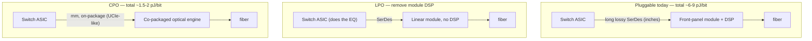

# Co-Packaged Optics (CPO), Linear Drive Optics (LPO), and the Future of Optical Integration

## Introduction: The Power Wall at the Switch Faceplate

Every technology in this database is ultimately constrained by power. Nowhere is that constraint more acute, or more imminent, than at the boundary between a switch ASIC and the optical transceivers on its faceplate. As switch silicon bandwidth has exploded — 12.8 Tbps, 25.6 Tbps, 51.2 Tbps, and soon 102.4 Tbps and beyond — the electrical interface that carries those bits from the ASIC, across the package, across the printed circuit board, and out to the front-panel pluggable optical modules has become a dominant and unsustainable consumer of power. The industry's response is to fundamentally re-architect where the optical conversion happens: pulling it closer to the ASIC (linear-drive optics), then onto the same package (co-packaged optics), and eventually inside the computing die itself. This chapter examines the bandwidth-power crisis in detail, the near-term answer of **Linear Drive Optics (LPO)**, the long-term answer of **Co-Packaged Optics (CPO)**, the optical-engine and laser-integration technologies that make CPO possible, the key products and roadmaps, and the thermal, manufacturing, and standardization challenges that will determine how fast this transition unfolds. It is one of the most consequential and rapidly moving areas in all of datacenter networking, and it ties together the optical physics of File 09, the transceiver ecosystem of File 10, and the switch-ASIC architecture of File 14.

## The Bandwidth-Power Crisis in Datacenter Optics

*Figure 13.1 — The three approaches to the faceplate power wall. CPO eliminates the long, lossy electrical SerDes channel to the front panel (the 5-10 pJ/bit term), cutting total energy ~4-5x; LPO is the near-term win that removes the module DSP. The trade-off is reach, serviceability, and thermal/laser challenges.*

Consider the trajectory of switch ASIC bandwidth. Broadcom's Tomahawk family illustrates it: **Tomahawk 4 at 12.8 Tbps**, **Tomahawk 5 at 51.2 Tbps**, with a roadmap toward **102.4 Tbps** and beyond. Each doubling of switch bandwidth must be carried off the chip and out to the network, and at the front panel that means more — and faster — optical transceivers. A 51.2 Tbps switch front-panel might host 64 ports of 800G or 128 ports of 400G; the next generation doubles that again. Two power problems compound:

First, the **transceiver power** itself. A pluggable optical module consumes on the order of 5–20 watts (a 400G QSFP-DD around 10–14 W, an 800G module more). Multiply by 256 to 512 ports on a high-end switch, and the transceivers alone can draw **one to several kilowatts** — often exceeding the power of the switch ASIC itself. The transceivers, not the switching silicon, become the dominant power term.

Second, and more insidiously, the **electrical SerDes power** required to drive the signal from the ASIC out to the front-panel module. At **112G PAM4** per lane (and soon 224G), the electrical channel from the ASIC die, through the package, across the PCB, through connectors, to the front-panel cage is long and lossy, demanding powerful SerDes with elaborate equalization (CTLE, FFE, multi-tap DFE — File 02) at both ends. This SerDes consumes on the order of **5–10 picojoules per bit** just to move the signal across the package boundary to the module. At 51.2 Tbps, the SerDes driving the front panel can consume **tens of watts** purely to traverse a few inches of electrical channel — power spent not on computation or even on optical conversion, but merely on shoving electrons down a lossy copper trace.

The faceplate also imposes a hard **physical density** limit: there is only so much room on the front of a switch for QSFP-DD/OSFP cages, and as bandwidth doubles, the faceplate cannot grow to match. The combination of transceiver power, SerDes power, and faceplate density constitutes the bandwidth-power crisis, and it becomes acute precisely at the 51.2 Tbps generation and unsustainable beyond. The industry's responses, in order of increasing radicalism, are **LPO**, **Near-Package Optics (NPO)**, and **CPO**.

## Linear Drive Optics (LPO)

**Linear Drive Optics (LPO)**, also called Linear Pluggable Optics, is the elegant near-term answer. Its insight: the most power-hungry component in a modern pluggable transceiver is the **DSP (Digital Signal Processor)** chip that performs retiming, equalization, and signal recovery inside the module. LPO **eliminates the DSP from the transceiver entirely**, replacing it with a simple linear analog driver (on the transmit side) and a linear trans-impedance amplifier (on the receive side). The signal-conditioning burden that the module DSP used to carry is instead handled by the **switch ASIC's own SerDes** — the ASIC's transmit equalization pre-conditions the signal well enough, and the ASIC's receive DSP cleans up the returning signal, so the module itself does no digital processing. The optics become a "linear" (analog) pass-through between the ASIC SerDes and the fiber.

The **power savings** are substantial: eliminating the ~2–4 W DSP per 400G transceiver, across 256 ports, saves on the order of a kilowatt per switch — a 30–40% reduction in transceiver power. LPO also reduces latency (no DSP retiming delay) and cost (no DSP chip).

The **trade-off** is reach and complexity. Without the module DSP's equalization, the link's reach is limited by the raw optical SNR — typically **≤500 meters** (within a building or campus), not suitable for inter-datacenter links. And the burden shifts to the **system**: the switch ASIC's SerDes must be good enough to handle the impairments the module DSP used to manage, requiring tighter electrical specifications between the ASIC and the module and creating an **interoperability challenge** — every combination of ASIC vendor and module vendor must be qualified together, since the module no longer "cleans up" a marginal signal. This many-to-many qualification matrix is the principal obstacle to LPO's broad adoption.

LPO is being standardized and demonstrated rapidly: there are OIF efforts and IEEE 802.3 contributions, numerous demonstrations at OFC (the Optical Fiber Communication conference), and an ecosystem of module makers (InnoLight, Coherent, HiLight, Lumentum) and ASIC vendors (Broadcom, Marvell) publishing the electrical specs that make LPO feasible. Switch vendors (Arista and others) offer "LPO-ready" platforms with ASIC-side retiming options. LPO is widely expected to capture a growing share of the 800G market through the mid-2020s as the near-term, lowest-disruption power win, bridging the gap until co-packaged optics matures.

## Co-Packaged Optics (CPO) — Full Technical Deep Dive

**Co-Packaged Optics (CPO)** is the long-term, more radical answer: physically integrate the optical engines **into the switch (or GPU) package itself**, eliminating the long electrical SerDes channel to the front panel entirely. Instead of driving 112G PAM4 across inches of PCB to a faceplate cage, the ASIC connects to an optical engine sitting on the same package substrate via a very short, low-loss electrical link — millimeters instead of inches — and the optical engine converts to light right there, with fiber carrying the signal out of the package.

### The Power Case for CPO

The power arithmetic is compelling. A **pluggable 400G** link at the package boundary costs roughly **1 pJ/bit** for the optics plus **5–8 pJ/bit** for the ASIC SerDes driving the front panel — **6–9 pJ/bit total**. A **CPO 400G** link costs under **0.5 pJ/bit** for the optical engine plus about **1 pJ/bit** for the very short ASIC-to-engine connection — **1.5–2 pJ/bit total**, a **~4–5× improvement**. At 51.2 Tbps, this difference translates to hundreds of watts saved per switch, and across a datacenter of thousands of switches, to many hundreds of kilowatts (File 25). CPO is, fundamentally, a power-efficiency play, and the power savings are what justify its enormous engineering and manufacturing difficulty.

### CPO Architecture Options

CPO is not a single architecture but a spectrum of integration approaches:
- **On-package CPO**: the optical engine is a chiplet bonded onto the same package substrate as the switch ASIC, connected via a die-to-die interface (often **UCIe-based**, File 05). This is the tightest integration and the lowest power, but the most demanding to manufacture (the optics and ASIC share a package and must be co-assembled and co-tested). Broadcom and Marvell pursue this direction.
- **Near-Package Optics (NPO)**: the optical engine sits on a small board immediately adjacent to the ASIC (a few centimeters away), connected by short traces — an intermediate step that captures much of the power saving while easing thermal management (the optics' heat is somewhat separated from the ASIC's) and manufacturing (the engine is a separate, replaceable unit). Intel's "Flyover" optics and Ayar Labs' TeraPHY in some configurations target NPO.
- **Board-integrated CPO**: the optical engine is integrated on the switch (or accelerator) board with a short electrical connection to the ASIC, as in Lightmatter's Passage interconnect co-located with compute on a board.

### Optical Engine Technologies

The heart of any CPO solution is the **optical engine** — the integrated photonic device that converts between electrical and optical. Three technology families compete:
- **Silicon Photonics (SiPh) optical engines**: silicon waveguides, germanium photodetectors, and silicon (plasma-dispersion) or SiGe modulators, with the laser typically off-chip. SiPh's CMOS compatibility enables dense integration of many channels and is the leading CPO approach. **Ayar Labs' TeraPHY** is the canonical example: a silicon-photonic chiplet that communicates with the switch (or compute) ASIC via a UCIe-like die-to-die interface, with the laser supplied externally; it targets terabits-per-second of optical I/O per chiplet with WDM channels per fiber. Cisco/Acacia, Intel, and others also build SiPh engines.
- **InP (Indium Phosphide) optical engines**: monolithically integrate laser, modulator, and detector on InP, offering superior laser and modulator performance at higher cost. Infinera and Lumentum bring InP expertise. InP engines may suit the highest-performance CPO where laser quality matters.
- **VCSEL-based engines**: 2D arrays of 850 nm VCSELs for short-reach (multimode) CPO; high density and low cost, but limited to short reaches — suitable for rack-scale CPO, not inter-rack.

### The Laser Integration Challenge

The single hardest problem in silicon-photonic CPO is the **laser**. Silicon has an **indirect bandgap** and therefore cannot efficiently emit light — there is no good silicon laser. Every SiPh optical engine must get its light from somewhere, and the approaches each have drawbacks:
- **External CW laser (off-chip)**: a separate laser module supplies continuous-wave light, coupled into the SiPh chip by fiber or lens. This sidesteps the silicon-laser problem but creates a **single point of failure** (one laser feeding many modulators) and **power-distribution** challenges (splitting one laser's light among many channels with adequate power each). Reliability and the "fiber-attach to a laser source" become critical.
- **III-V/silicon heterogeneous integration**: bonding a thin layer of III-V material (which *can* lase) onto silicon, so lasers are fabricated in the III-V layer atop the SiPh waveguides. **Intel's hybrid silicon laser** (developed with UCSB) and the IMEC/Ghent heterogeneous III-V-on-Si work pioneered this; it integrates the laser onto the chip at the cost of a more complex process (wafer bonding). This is widely seen as the most promising path to integrated lasers.
- **Direct III-V epitaxy on silicon**: growing III-V laser material directly on silicon would be ideal, but the lattice mismatch produces high threading-dislocation densities (>10⁷ cm⁻²) that wreck laser reliability; this remains a research problem.
- **Micro-transfer printing (µTP)**: printing pre-fabricated VCSEL or laser dies from their native wafer onto the SiPh wafer (companies like X-Celeprint), potentially combining good lasers with high integration density.

The laser problem is the gating reliability and yield issue for SiPh CPO, and how it is solved (external source versus integrated III-V) will shape the CPO roadmap.

## Key CPO Products and Roadmaps

- **Ayar Labs TeraPHY**: the highest-profile CPO optical-I/O chiplet, delivering multiple terabits per second of optical bandwidth per chiplet (targeting ~8 Tbps/mm² of optical I/O density), with a UCIe-compatible electrical interface, 16×100G WDM channels per fiber at 1310 nm, and an external (off-chip) laser source ("SuperNova" remote laser). Ayar partners with Intel for manufacturing and has run pilots with hyperscalers; it targets cloud-scale deployment in the mid-2020s, positioning optical I/O as a chiplet that any ASIC can integrate via UCIe.
- **Intel CPO / Optical Compute Interconnect (OCI)**: Intel demonstrated co-packaged optical I/O (e.g., 4×400G) integrated with switch silicon and has shown OCI for connecting CPUs and accelerators optically, leveraging its silicon-photonics and hybrid-laser expertise.
- **Broadcom CPO**: Broadcom's **Bailly** (51.2T) established the platform and **Tomahawk 6 – Davisson** delivered the industry's first **102.4 Tbps co-packaged** switch, now shipping, while Broadcom continues to ship pluggable and LPO solutions alongside it. Broadcom's enormous switch-silicon share made its CPO timing pivotal for the whole industry, and its decision to ship rather than pilot is what converted CPO from a roadmap item into a procurement decision.
- **NVIDIA Quantum-X and Spectrum-X Photonics**: NVIDIA's CPO switch families, built on a TSMC silicon-photonics process with micro-ring modulators and detachable fiber connectors, covering both the InfiniBand and Ethernet sides of its fabric portfolio and arriving through 2026 (see the timeline section below for specifications).
- **Marvell CPO**: Marvell integrates photonics with its Teralynx switch ASICs and demonstrated co-packaged optical I/O, drawing on its Inphi-derived optical-DSP expertise.
- **Lightmatter Passage**: a photonic interconnect (and photonic-compute) approach co-locating an optical fabric with AI accelerators on a board, claiming large bandwidth-density and power advantages for AI interconnect; backed by substantial funding and a TSMC partnership.
- **Celestial AI**: a "Photonic Fabric" for AI, targeting optical memory-to-compute and compute-to-compute interconnect with claimed large bandwidth-density advantages over electrical/HBM; in pilot stages.

## CPO Thermal, Reliability, and Manufacturing Challenges

CPO's promise is matched by formidable challenges:

- **Thermal**: silicon-photonic devices, especially **microring resonators** used for WDM modulation/filtering, are extremely temperature-sensitive — a ring's resonant wavelength shifts by roughly **0.08 nm/°C**. Co-locating temperature-sensitive optics next to a switch ASIC dissipating **500–800 W** creates severe thermal gradients, requiring per-ring **heaters** (~10 mW each) and active thermal control to keep wavelengths stable. Thermal management is arguably the central engineering challenge of on-package CPO.

- **Reliability and fiber attach**: a pluggable module is trivially field-replaceable; a co-packaged optical engine is not. Attaching optical **fiber** to a package (a mechanically delicate connection) and making the engine **field-serviceable** (so a single failed engine does not scrap an entire switch) are hard problems. The industry is converging on permanent fiber-ribbon attachment with **field-replaceable optical engine modules** and detachable optical connectors at the package edge.

- **Manufacturing yield**: the final yield is the product of the switch-ASIC yield, the optical-engine yield, and the assembly yield. With expensive ASICs and optics co-assembled, a defect discovered after assembly is enormously costly, and rework (especially after fiber attach) is difficult. This drives the need for **Known-Good Optics (KGO)** — thoroughly testing optical engines *before* they are committed to a package — analogous to the known-good-die requirement of chiplet assembly (File 05).

- **Standardization and interoperability**: for a healthy multi-vendor ecosystem (rather than vertically integrated proprietary CPO), the ASIC and the optical engine must interoperate across vendors. The **OIF's co-packaging efforts** (a co-packaging framework and electrical interface, sometimes called cPHY) aim to standardize the ASIC-to-optical-engine interface so that engines and ASICs from different vendors can be combined — essential to avoid CPO becoming a set of proprietary silos.

## CPO Adoption Timeline — and What Actually Happened

Synthesizing the industry's roadmaps, the adoption timeline reads as follows, with the first three rungs now observed rather than projected:

- **2024–2025**: LPO deployment at hyperscalers as the near-term power win at 800G, alongside continued pluggables. *(Happened as expected.)*
- **2025–2026**: Near-package optics (NPO) and early CPO at the 102.4 Tbps switch generation. *(Happened faster and more decisively than "pilot" suggested — see below.)*
- **2026–2028**: On-package CPO in production at hyperscalers for the highest-bandwidth switch platforms.
- **2028–2030**: CPO as the standard approach in high-bandwidth AI fabric deployments, with pluggables relegated to edge and lower-bandwidth ports; optical I/O increasingly integrated even with compute (GPU/accelerator) packages, not just switches.

**The correction that matters: CPO shipped.** Earlier editions of this chapter, in line with the industry consensus at the time, framed 2025–2026 as the pilot-and-proof-of-concept window. It was not. Two things landed in production instead:

- **Broadcom Tomahawk 6 "Davisson" (TH6-Davisson)** — announced as the industry's first **102.4 Tbps optically enabled** switch with co-packaged optics, and shipping, doubling the bandwidth of any prior CPO switch. Broadcom guided to significant CPO volume in the first half of 2026, with initial deployments targeted at clusters of **more than 100,000 XPUs**.
- **NVIDIA Quantum-X Photonics** (InfiniBand, ~115 Tbps per switch across 144 ports of 800G) in early 2026, followed by **Spectrum-X Photonics** Ethernet switches in the second half of 2026 — the **SN6810** at 102.4 Tbps (128×800G) and the **SN6800** at 409.6 Tbps (512×800G). NVIDIA's claimed advantages over a pluggable-based equivalent are instructive because they are not only about power: **4× fewer lasers**, ~**3.5× better power efficiency**, ~**63× better signal integrity**, ~**10× better network resiliency at scale**, and ~**1.3× faster deployment**. The supply chain assembled for it — TSMC, Coherent, Corning, Foxconn, Lumentum, SENKO — is itself evidence of how much industrial coordination CPO required.

Note the resiliency and deployment-speed claims especially. The conventional argument against CPO was serviceability: you cannot swap a co-packaged engine the way you swap a module. The counter-argument that appears to have won at these scales is that a pluggable-based 100,000-GPU fabric contains so many modules and connectors that its *aggregate* failure rate is worse than a co-packaged design with fewer, better-controlled optical interfaces and far fewer lasers. At sufficient scale, eliminating field-replaceable parts can improve availability rather than degrade it — because the parts you eliminated were the ones failing.

The timeline beyond 2026 remains contested — LPO's success continues to defend the pluggable model in the mid-range, and the thermal, laser, and yield challenges described above are real and unsolved in the general case — but the direction is now demonstrated rather than argued: optical conversion is migrating from the faceplate toward the silicon, and the 102.4 Tbps generation is where it crossed over.

## Extended Deep Dive: The Energy-per-Bit Hierarchy and Why It Drives Everything

The single most useful lens for understanding the co-packaged-optics transition — and indeed much of this database — is the **energy-per-bit hierarchy**. Every interconnect technology has a characteristic energy cost to move one bit across its span, and these costs span more than three orders of magnitude:

| Interconnect | Energy per bit | Span |
|---|---|---|
| On-die wires | ~0.01–0.1 pJ/bit | µm |
| Die-to-die (UCIe advanced) | <0.5 pJ/bit | mm |
| HBM interface | ~1 pJ/bit | mm (interposer) |
| NVLink / on-package | ~1.3 pJ/bit | cm |
| PCIe / CXL (board) | ~3–5 pJ/bit | 10s of cm |
| ASIC SerDes to front panel | ~5–10 pJ/bit | inches |
| Pluggable optics (total) | ~6–9 pJ/bit | up to km |
| CPO optical engine | ~1.5–2 pJ/bit | up to km |
| Coherent (long-haul) | ~100+ pJ/bit | 1000s of km |

The pattern is unmistakable: energy per bit rises by roughly an order of magnitude each time data crosses a boundary in the interconnect hierarchy, and the **electrical SerDes to the front panel** is a glaring inefficiency — it costs as much energy to shove a bit a few inches across the package and board to the pluggable as it costs the optics to then carry it potentially kilometers. Co-packaged optics attacks precisely this inefficiency, collapsing the 5–10 pJ/bit electrical-SerDes term to ~1 pJ/bit by shortening the electrical path to millimeters, so that the CPO total (~1.5–2 pJ/bit) is dominated by the optical engine rather than by the electrical interface. This is why CPO is fundamentally an energy-efficiency play, and why the energy-per-bit hierarchy — not raw bandwidth — is the right frame for understanding the optical-integration transition. It is also why the broader trajectory of the field (File 24) is the *flattening* of this hierarchy: pushing low-energy interconnect (UCIe, optics) outward to longer length scales so that the order-of-magnitude jumps soften and the datacenter behaves more like a single tightly coupled machine.

## Extended Deep Dive: Why the Laser Is the Hardest Problem

The laser-integration challenge in silicon-photonic CPO deserves deeper treatment, because it is the gating issue that will determine the pace and shape of CPO adoption. The root cause is quantum-mechanical: silicon has an **indirect bandgap**, meaning an electron-hole recombination must involve a phonon (a lattice vibration) to conserve momentum, making radiative recombination (light emission) extremely inefficient. III-V semiconductors (InP, GaAs) have direct bandgaps and lase efficiently, but they cannot be grown directly on silicon with acceptable quality because of lattice mismatch (the atomic spacings differ), which produces threading dislocations — crystal defects that act as non-radiative recombination centers and destroy laser reliability. The dislocation density achievable by direct epitaxy (>10⁷ cm⁻²) is orders of magnitude above what a reliable laser tolerates.

The industry's responses each embody a different trade-off. **External lasers** (off-chip, fiber- or lens-coupled) sidestep the problem entirely but introduce a coupling interface (with its loss and alignment tolerance), a single-point-of-failure concern (one laser often feeds many modulators via splitting), and a power-distribution challenge (delivering adequate optical power to each of many channels). The reliability of the external laser source and its coupling becomes the system's weak link, and approaches like Ayar Labs' remote "SuperNova" laser concentrate the laser function in a separately serviceable, redundant module. **Heterogeneous III-V-on-silicon bonding** — transferring a thin III-V layer onto the silicon-photonic wafer and fabricating lasers in it — integrates the laser onto the chip with good quality (the III-V is bonded, not grown, avoiding the dislocation problem) at the cost of a more complex, lower-yield process; Intel's hybrid silicon laser is the most mature embodiment. **Micro-transfer printing** of pre-tested III-V laser dies onto the silicon photonic wafer offers a path to combining known-good lasers with dense integration. **Quantum-dot lasers on silicon** are a research direction in which the dot structure tolerates dislocations better than quantum wells, potentially enabling direct epitaxy. Which approach wins — and whether the laser is integrated or remote — will shape CPO's reliability, yield, serviceability, and ultimately its adoption timeline. The laser is, quite literally, the part of co-packaged optics that the rest of the system is waiting on.

## Extended Deep Dive: Thermal Co-Existence of Optics and a 1000-Watt ASIC

The thermal challenge of co-packaging temperature-sensitive optics with a high-power switch ASIC merits elaboration, because it is arguably the central physical obstacle to on-package CPO. Silicon-photonic devices that rely on resonance — particularly **microring resonators**, attractive for dense WDM because each ring can add/drop or modulate one wavelength — shift their resonant wavelength by roughly **0.08 nm per degree Celsius**. A WDM channel grid with sub-nanometer spacing is therefore destroyed by even a few degrees of uncontrolled temperature change, so each ring needs a local heater (and a control loop) to lock its resonance to its assigned wavelength, consuming on the order of milliwatts per ring — which, across thousands of rings in a high-bandwidth engine, becomes a non-trivial power term in its own right, and a control-complexity burden.

Now place this temperature-sensitive engine on the same package as a switch ASIC dissipating 500–1000 W. The ASIC creates large, dynamic thermal gradients across the package, and the optics sit within that thermal field. The engine must either be thermally isolated from the ASIC (difficult on a shared substrate), actively temperature-controlled (costly in power and complexity), or designed with thermally robust devices (e.g., favoring broadband Mach-Zehnder modulators over thermally twitchy rings, at a cost in density). The thermal management of the co-packaged assembly — keeping the optics in their narrow operating window beside a furnace of a switch chip — is a problem with no clean solution, and it is a major reason why near-package optics (NPO), which separates the optics' thermal domain from the ASIC's, is an attractive intermediate step. How the industry solves the thermal co-existence problem will, alongside the laser, determine whether on-package CPO is a 2026 or a 2030 reality.

## Extended Deep Dive: The Interoperability and Business-Model Stakes of CPO

Beyond the technical challenges, co-packaged optics poses a profound **business-model and interoperability** question that will shape whether and how it is adopted, and it deserves elaboration because it echoes the proprietary-versus-open tension that runs through this entire database. A pluggable transceiver is a discrete, standardized, multi-sourced product: an operator buys modules from any of many vendors, mixes them freely, and replaces a failed one in seconds — a competitive, commoditized market with second sources and price competition. Co-packaged optics threatens this: if the optical engine is integrated into the switch ASIC's package, the optics and the switch become a single, co-assembled, possibly single-sourced product, and the operator loses the ability to mix vendors, second-source, and field-replace — potentially recreating the vertical lock-in that pluggables broke.

The industry's response is the push for **CPO standardization and interoperability** — the OIF's co-packaging framework and electrical interface (cPHY), and the effort to define standard optical-engine interfaces so that engines and ASICs from different vendors can interoperate and so that engines can be field-replaceable modules rather than permanently bonded. The stakes are large: a standardized, multi-vendor CPO ecosystem preserves the competition and sourcing flexibility that operators (especially hyperscalers) demand, while a proprietary, vertically integrated CPO would concentrate value and create lock-in. This is the same dynamic as InfiniBand-versus-Ethernet (File 07), NVLink-versus-UALink (File 24), and integrated-versus-disaggregated optical systems (File 10): a tension between the performance and integration of a proprietary solution and the flexibility and competition of an open standard. The hyperscalers, who will be the first and largest CPO adopters, are pushing hard for the open, standardized, field-serviceable model, and whether CPO arrives as an open ecosystem or a set of proprietary silos is as consequential as the technology itself — a business-model question riding on top of the thermal, laser, and yield challenges.

## Extended Deep Dive: NPO as the Pragmatic Middle Path

Near-Package Optics (NPO) deserves fuller treatment as the pragmatic compromise that may dominate the transition years, because it captures much of CPO's benefit while sidestepping its hardest problems. In NPO, the optical engine sits not on the ASIC's package but on the board immediately adjacent to it — a few centimeters away, connected by short, controlled-impedance traces — so the electrical channel is far shorter than to a front-panel pluggable (capturing most of the SerDes power saving) but the optics are not co-packaged with the furnace-hot ASIC (sidestepping the worst of the thermal-coupling problem) and the optical engine can be a separate, serviceable, possibly socketed unit (easing the manufacturing-yield and field-replaceability problems). NPO thus occupies a sweet spot: most of CPO's power benefit, much less of its thermal and serviceability difficulty.

The trade-off is that NPO's electrical channel, while far shorter than to a front panel, is longer than on-package CPO's, so it captures somewhat less of the SerDes power saving and may still need some equalization. But for the transition years (mid-to-late 2020s), as the industry works through CPO's laser, thermal, and yield challenges, NPO is an attractive bridge — and several of the early "co-packaged" demonstrations and products are, more precisely, near-package. The progression from pluggable (today) to LPO (near-term power win) to NPO (intermediate) to on-package CPO (long-term) to integrated optical I/O on the compute package (File 24) is the likely path, with NPO playing a larger and longer role than the simple pluggable-to-CPO narrative suggests. Recognizing NPO as a distinct and pragmatic option — not merely a way station — is important to understanding how the optical-integration transition will actually unfold, and it reflects the engineering reality that the cleanest long-term architecture (on-package CPO) is not always the fastest path to the benefit, and that intermediate steps that capture most of the value at less risk often dominate in practice.

## Conclusion

Co-packaged and linear-drive optics represent the optical industry's response to a power crisis of its own making: the relentless doubling of switch bandwidth has made the electrical interface to front-panel pluggables an unsustainable consumer of power, and the only way forward is to shorten or eliminate that interface by pulling the optical conversion toward — and eventually inside — the ASIC package. LPO offers a graceful near-term reprieve by removing the module DSP and leaning on the ASIC's SerDes; CPO offers the radical long-term solution of co-packaging the optical engines, at a 4–5× power advantage but with daunting thermal, reliability, and manufacturing challenges. The supporting technologies — silicon-photonic and InP optical engines, the hard problem of laser integration, UCIe-based die-to-die interfaces to optical chiplets, and OIF co-packaging standards — are advancing rapidly, with Ayar Labs, Intel, Broadcom, Marvell, Lightmatter, and Celestial AI all racing to define the future. The transition from pluggable to co-packaged optics is among the most important architectural shifts in datacenter networking, and it will determine whether the network can keep pace with the compute it serves. The next chapter turns to the silicon at the center of it all — the switch ASICs whose bandwidth growth created this crisis and whose architecture defines the datacenter network.
