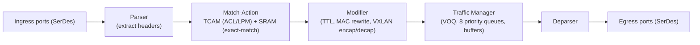

# Network Switch ASICs — Architecture, Vendors, and AI Networking

## Introduction: The Silicon That Moves the Packets

At the center of every datacenter switch is a single chip — the **switch ASIC** — that does the actual work of receiving packets on dozens or hundreds of ports, deciding where each should go, and forwarding it, all at line rate, for an aggregate of tens of terabits per second. The switch ASIC is one of the most demanding chips in all of computing: it must process billions of packets per second, perform complex lookups against enormous tables, manage congestion across hundreds of queues, and drive the high-speed SerDes that connect to optics — all within a tight power budget. The design of these chips determines the bandwidth, latency, features, and economics of the entire datacenter network, and the competition among their makers — dominated by Broadcom, contested by Marvell, NVIDIA, Cisco, and the hyperscalers' own designs — is among the most strategically important in the industry. This chapter covers switch-ASIC architecture in depth and then surveys the vendor landscape, with particular attention to the AI-networking demands reshaping switch silicon. It builds on the Ethernet and InfiniBand fabrics of Files 06 and 07 and connects to the co-packaged-optics future of File 13 and the AI fabric of File 15.

## Switch ASIC Architecture Fundamentals

*Figure 14.1 — The switch ASIC packet pipeline. TCAM provides O(1) wildcard/longest-prefix lookups (at high power cost); the traffic manager's VOQ and buffering set the queuing latency that dominates the tail under load (File 17). The SerDes (ingress/egress) consume most of the die area and power — the term co-packaged optics attacks (File 13).*

### Switching Fabric Architecture

The core of a switch ASIC is its **switching fabric** — the internal structure that moves packets from ingress ports to egress ports. Several architectures exist, distinguished by where packets are buffered:
- **Input-Queued (IQ)**: packets are buffered at the ingress. Simple, but suffers from **head-of-line (HOL) blocking** — a packet at the front of an input queue, blocked because its output is busy, prevents packets behind it (destined for free outputs) from advancing.
- **Output-Queued (OQ)**: packets are buffered at the egress, eliminating HOL blocking and giving ideal performance, but requiring the fabric to run at N times line rate (to deliver from all N inputs to one output simultaneously) — impractical at scale.
- **Combined Input-Output Queued (CIOQ)** with **Virtual Output Queuing (VOQ)**: the practical compromise. Each input maintains a **separate virtual queue per output**, so a packet blocked for one output does not block packets for other outputs — eliminating HOL blocking — while buffering primarily at ingress. A **scheduler** matches inputs to outputs each cycle, using algorithms such as **iSLIP** or **PIM (Parallel Iterative Matching)** to compute a high-throughput, fair matching across the crossbar. At scale, the internal fabric is itself often a **Clos** structure (a "fabric within the chip") with virtual internal channels.

### Traffic Management

The **traffic manager** governs buffering and scheduling on the egress side. Each port has ingress and egress queues — typically **8 priority queues per port** (mapping to the 8 classes of service / PFC priorities of File 06). Scheduling among queues uses **Strict Priority (SP)** (always serve the highest-priority non-empty queue), **Deficit Weighted Round Robin (DWRR)** (allocate bandwidth proportionally), or hybrids (SP for latency-critical classes, DWRR for the rest). A crucial architectural choice is the **buffer model**:
- **Shared buffer**: a large pool of buffer memory dynamically allocated across ports as needed. Broadcom's Trident/Tomahawk use a shared buffer, maximizing burst absorption with a given amount of memory but making per-port behavior less predictable.
- **Distributed (dedicated per-port) buffer**: each port has its own buffer, giving predictable per-port latency but limiting total burst absorption.
- **Deep buffer**: routing-focused ASICs (Broadcom Jericho) use very large buffers (hundreds of MB) to absorb large bursts and handle WAN-scale traffic, versus the shallow buffers (<50 MB) of high-bandwidth datacenter switches.

The buffer architecture is a defining trade-off for AI fabrics: deep buffers absorb the synchronized bursts of AllReduce (File 15) but add latency and cost, while shallow-buffer switches rely on congestion control to keep queues short — a central debate in AI-fabric design.

### The Packet Processing Pipeline

A switch ASIC processes each packet through a **pipeline**:
1. **Parser**: identifies the packet's headers (Ethernet, VLAN, IP, TCP/UDP, VXLAN, etc.) and extracts the relevant fields.
2. **Match-Action tables**: the heart of forwarding. The packet's fields are matched against tables — **TCAM** for wildcard/longest-prefix matches (routing, ACLs) and **SRAM-based exact-match** tables (MAC tables, exact routes) — and the matching entry specifies the action (forward to port X, drop, rewrite, etc.).
3. **Modifier/rewrite**: updates headers — decrementing TTL, rewriting MAC addresses, pushing/popping VLAN tags, performing VXLAN encapsulation/decapsulation.
4. **Traffic manager**: queues and schedules the packet for egress.
5. **Replicator**: duplicates packets for multicast/broadcast.
6. **Deparser**: reassembles the (possibly modified) headers onto the packet for transmission.

### TCAM — The Power-Hungry Workhorse of Lookups

**TCAM (Ternary Content-Addressable Memory)** is the special memory that makes wildcard matching fast. Unlike ordinary RAM (address in, data out), a CAM takes data in and returns the address where it matches — and a *ternary* CAM allows each bit to be **0, 1, or X (don't-care)**, enabling wildcard matches essential for longest-prefix-match routing and access-control lists. TCAM compares the search key against **all entries simultaneously**, giving O(1) lookup regardless of table size. The cost is **power**: every entry has comparison logic and a sense amplifier that activates on every lookup, so TCAM is extraordinarily power-hungry (on the order of 1–2 W per Mbps of lookup bandwidth) and area-expensive. A large switch might have 512K entries of 80+ bits. Because TCAM power and area scale poorly, switch designers use **algorithmic TCAM** (emulating ternary matching with clever SRAM-based data structures) to reduce power at the cost of slightly higher latency, and carefully ration true TCAM for the matches that truly need it.

### Programmable Pipelines and P4

Traditionally, switch pipelines were **fixed-function** — the parser and match-action behavior were baked into the silicon. The **programmable-pipeline** movement, embodied by **P4 (Programming Protocol-independent Packet Processors)** and the Barefoot/Intel **Tofino** ASIC, made the pipeline software-defined: a P4 program specifies the parse graph, the match-action tables, and the actions, and the ASIC executes it at line rate. P4 enables custom protocols, **In-band Network Telemetry (INT)** (File 22), RDMA offloads, and rapid experimentation. The trade-off is that fully programmable pipelines can cost area, power, and table capacity relative to fixed pipelines optimized for known protocols — a trade-off that, as we will see, the market resolved largely in favor of fixed pipelines (with selective programmability) for high-volume datacenter switching.

### SerDes — The Dominant Power and Area Term

The **SerDes (Serializer-Deserializer)** blocks that connect the ASIC to the outside world consume the majority of a modern switch ASIC's die area and power. A 51.2 Tbps switch needs **512 lanes of 100G** (or equivalent) SerDes, each with the elaborate equalization (CTLE, FFE, multi-tap DFE — File 02) that 112G PAM4 requires. At a few picojoules per bit, the SerDes alone can draw tens of watts. The SerDes term scales with baud rate × lane count, and it is precisely this term that **co-packaged optics (File 13) attacks** by shortening the electrical channel — the SerDes power crisis at the faceplate is, fundamentally, a switch-ASIC problem. SerDes quality (reach, power, bit error rate) is also a key competitive differentiator among ASIC vendors.

## Broadcom Switch ASIC Portfolio

**Broadcom** is the dominant force in merchant switch silicon, with an estimated **55–60% share** of the datacenter switch-ASIC market, and its product families define the segments:

- **Trident series** (enterprise/cloud access and leaf): feature-rich, deeply programmable switches for the leaf/access layer. **Trident 4** (25.6 Tbps) and the **Trident 5** generation power 100G/400G leaf switches with extensive features (rich ACLs, deep programmability via the BCM SDK, VXLAN/EVPN). Customers include Arista, Cisco (Nexus), and Juniper (QFX).

- **Tomahawk series** (hyperscaler spine/core): maximum bandwidth, reduced features, minimum power-per-bit — the hyperscaler trade-off. **Tomahawk 4** (12.8 Tbps), **Tomahawk 5** (51.2 Tbps, e.g., 64×800G or 128×400G), and the roadmap **Tomahawk 5 Ultra / Tomahawk 6 (102.4 Tbps)** define the high-bandwidth spine. Tomahawk sacrifices some of Trident's programmability and table depth for raw bandwidth and efficiency, exactly what a hyperscaler spine needs, and the Tomahawk roadmap effectively sets the cadence of hyperscaler fabric upgrades.

- **Jericho series** (carrier/service-provider routing): **deep-buffer**, feature-rich routing ASICs (Jericho2, Jericho2c, and the AI-focused **Jericho3-AI**) with hundreds of MB of buffer and rich QoS, used in carrier routing platforms (e.g., Cisco's ASR 9000 line). Jericho3-AI specifically targets AI traffic patterns, bringing deep-buffer, scheduled-fabric techniques to the AI fabric — an alternative philosophy to shallow-buffer Tomahawk.

- **Ramon** (fabric): switch-fabric chips that pair with Jericho line cards to build large multi-chassis Clos systems internally.

- **Qumran** (metro/aggregation): medium-bandwidth routing for metro and aggregation, used in various carrier platforms.

Broadcom's **moat** is formidable: the **BCM SDK** (software development kit) and the SAI (Switch Abstraction Interface) integration with SONiC create deep customer lock-in, the breadth of the portfolio covers every segment, and the relentless Tomahawk bandwidth cadence keeps competitors chasing. Broadcom's switch franchise, combined with its optical components and (through acquisitions) broad semiconductor portfolio, makes it the most powerful single player in datacenter networking silicon (File 23).

## Marvell Switch ASIC Portfolio

**Marvell** is Broadcom's principal merchant-silicon challenger, with a portfolio spanning switching, PHYs, and custom silicon:
- **Teralynx series**: high-bandwidth datacenter switches — **Teralynx 10** (12.8 Tbps, 400G) and the **Teralynx 10/Teralynx successor (25.6 Tbps and beyond, 800G)** — explicitly targeting AI fabric and positioned as a Tomahawk alternative, with programmable (P4-like) capability. Marvell has announced **1.6T-class** switch silicon targeting the AI fabric, competing with Tomahawk's highest tiers.
- **Prestera series**: enterprise switching ASICs (control-plane and packet-processor variants) used in white-box and enterprise switches.
- **Alaska series**: Ethernet **PHYs and retimers** (100G/400G/800G) — Marvell is strong in the PHY layer, which complements its switch silicon and feeds the LPO/optics ecosystem.

Marvell's broader strategy combines merchant switch silicon with a large **custom-silicon business** (designing chips for hyperscalers under NDA, including interconnect and accelerator components) and the coherent-DSP franchise from Inphi (File 10), making it a diversified datacenter-silicon powerhouse second to Broadcom in switching but strong across adjacent domains (File 23).

## Intel/Barefoot Tofino — The Programmable Experiment

**Intel acquired Barefoot Networks in 2019**, bringing the **Tofino** family of fully **P4-programmable** switch ASICs — **Tofino 1** (6.5 Tbps), **Tofino 2** (12.8 Tbps), and **Tofino 3** (with 400G ports). Tofino's programmable-at-line-rate pipeline was a genuine innovation, enabling INT, custom protocols, and research applications, and it found use in academic networks, Microsoft SONiC research, and custom hyperscaler experiments. But the market spoke: most datacenter operators preferred Broadcom's fixed-pipeline silicon, whose feature sets covered their needs at better bandwidth, power, and table depth, and Tofino never achieved the volume to sustain itself. **Intel announced the wind-down of the Tofino line in 2023.** The episode is instructive: full programmability, technically elegant, lost to the economics and sufficiency of optimized fixed pipelines — though P4 concepts (selective programmability, INT) have been absorbed into the broader ASIC ecosystem, including Broadcom's increasingly programmable SDKs.

## NVIDIA Spectrum and Quantum

**NVIDIA** brings both Ethernet (Spectrum) and InfiniBand (Quantum) switch silicon, co-designed with its NICs and GPUs for AI:
- **Spectrum-3** (12.8 Tbps Ethernet) and **Spectrum-4** (51.2 Tbps Ethernet) — the latter the foundation of **Spectrum-X**, NVIDIA's AI-Ethernet fabric, with integrated RoCEv2 congestion management (with ConnectX-7 NICs) and in-network capabilities. **Spectrum-X (and successors at 800G/102.4 Tbps)** is NVIDIA's bid to capture the Ethernet AI fabric (File 07, File 15).
- **Quantum-2** (64×400G NDR InfiniBand, 25.6 Tbps) and **Quantum-3** (XDR, 800G) — the InfiniBand switches with adaptive routing and **SHARP in-network reduction** (File 07), the heart of NVIDIA's DGX SuperPOD and GB200 fabrics.

NVIDIA's switch silicon is distinctive in being **vertically co-designed** with the GPU, NIC, and collective-communications software, optimized end-to-end for AI rather than sold as general-purpose merchant silicon.

## Cisco Silicon One

**Cisco's Silicon One** is its unified custom-silicon architecture, spanning routing and switching with a single programmable architecture: **Q100** (12.8 Tbps), **Q200** (25.6 Tbps), and successors for routing/switching, plus **G100/G200** coherent-DSP variants for ZR+ pluggables. Silicon One's philosophy is one architecture serving provider (P), provider-edge (PE), and customer-edge (CE) roles, deployed in the Cisco 8000 router and NCS platforms, competing directly with Broadcom Jericho in carrier routing. Cisco's long ASIC history (Cloud Scale in Nexus 9000, QuantumFlow in ASR 1000, and others) culminates in Silicon One as its strategic answer to merchant silicon — keeping high-value silicon in-house while still buying Broadcom where appropriate (File 23).

## Custom Switch ASICs at Hyperscalers

The largest operators increasingly design their own switch silicon:
- **Google — Jupiter**: Google's switching evolved from merchant silicon (early "Firehose"/"Watchtower"/"Saturn" generations) to custom designs, with the **Jupiter** fabric integrating Google-designed switching and, distinctively, **optical circuit switching (OCS)** for a hybrid packet/circuit fabric (File 06, File 11). The SIGCOMM 2022 "Jupiter Evolving" paper details Google's use of OCS and custom silicon to build an incrementally upgradable, topology-flexible fabric, with AI-specific enhancements for TPU pods (which use 3D-torus ICI rather than Clos, File 15).
- **Meta**: Meta's Open Compute switch hardware (Wedge, Minipack, built on Broadcom Tomahawk silicon) and its large RoCEv2 and InfiniBand AI fabrics (the Research SuperCluster, Grand Teton) reflect a pragmatic mix of merchant silicon and open hardware (File 15).
- **Microsoft**: Microsoft open-sourced **SONiC** and builds custom NICs (Azure Boost, the MANA network adapter ASIC) and a custom optical backbone, while using merchant and NVIDIA silicon in its fabrics.
- **Amazon AWS**: the most aggressively custom, with the Nitro system offloading networking/storage/security to custom silicon and its own accelerator interconnects.

## Open Networking and White-Box Switches

The disaggregation of the switch — separating the network operating system from the hardware — is one of the defining trends:
- **SONiC (Software for Open Networking in the Cloud)**: Microsoft open-sourced SONiC in 2016; it is a Linux-based NOS running on Broadcom, Marvell, NVIDIA/Mellanox, and other silicon via the **SAI (Switch Abstraction Interface)**, decomposing network functions into containers (FRRouting for BGP, lldpd for LLDP, etc.). SONiC is used by Microsoft, Alibaba, Tencent, and many others, and it broke the vendor lock between NOS and hardware. **SONiC-DASH** extends it to DPU/SmartNIC integration.
- **OpenConfig**: vendor-neutral YANG configuration and telemetry models with **gNMI** streaming, adopted by Google, Microsoft, AT&T, and supported by all major vendors (File 16).
- **DENT**: a Linux Foundation NOS (Marvell-sponsored) for enterprise/carrier edge, built on the kernel's switchdev model.
- **SDN controllers** (ONOS, OpenDaylight) and **P4.org** (the P4 language foundation and P4Runtime) round out the open-networking ecosystem (File 16).

## Extended Deep Dive: Shared-Buffer versus Deep-Buffer and the AI-Fabric Debate

One of the most consequential architectural choices in switch silicon — and one that AI has thrust to the forefront — is the buffer architecture, and the debate between **shallow shared-buffer** switches and **deep-buffer** switches deserves elaboration. The Broadcom Tomahawk family epitomizes the shallow-shared-buffer philosophy: a relatively small total buffer (tens of MB) dynamically shared across all ports, optimized for the lowest latency and the highest bandwidth per watt, on the assumption that congestion control keeps queues short and bursts are brief. The Broadcom Jericho family (and similar deep-buffer routing silicon) takes the opposite view: hundreds of MB to gigabytes of buffer (often using off-chip HBM or dedicated buffer memory), able to absorb large, sustained bursts and to provide rich per-flow queuing, at the cost of higher latency, power, and cost.

For the AI fabric, this choice is contentious. The synchronized incast of an AllReduce — thousands of GPUs bursting simultaneously toward an aggregation point — can momentarily demand far more buffering than a shallow-buffer switch provides, leading to PFC activation and its pathologies (File 17). Deep-buffer advocates (and Broadcom's own Jericho3-AI, a deep-buffer ASIC explicitly marketed for AI) argue that absorbing these bursts in buffer is more robust than relying on congestion control to prevent them, and that a scheduled, cell-based fabric (spraying cells across the fabric and reassembling them, as deep-buffer chassis do) gives near-ideal load balancing that defeats the ECMP elephant-flow problem (File 17). Shallow-buffer advocates counter that deep buffers add latency (anathema to latency-sensitive collectives), that good congestion control and packet spraying (Ultra Ethernet) keep queues short without large buffers, and that shallow-buffer switches deliver more bandwidth per watt and per dollar. The resolution is workload- and design-dependent, and the major vendors hedge by offering both — but the buffer debate is one of the defining technical arguments in AI-fabric switch design, and it maps directly onto the broader scheduled-fabric-versus-congestion-control philosophical divide.

## Extended Deep Dive: The SerDes as the Center of Gravity

It is worth dwelling on why the SerDes dominates modern switch-ASIC design, because it explains so much of the industry's trajectory. A 51.2 Tbps switch must move 51.2 trillion bits per second in and 51.2 out, across (at 100G per lane) 512 lanes each way. Each lane's SerDes — the analog/mixed-signal circuit that serializes the parallel data, drives it onto the channel with transmit equalization, and on the receive side recovers the clock and equalizes the incoming signal with CTLE, multi-tap FFE, and DFE — is among the most sophisticated analog circuits on the chip. At 112G PAM4, the receive DFE may need ~17 taps, the analog front end must have enormous bandwidth, and the whole thing must operate at a few picojoules per bit while meeting a stringent bit-error-rate target. Multiply the per-lane SerDes area and power by 1024 lanes (512 each direction) and the SerDes consumes the majority of the die area and a large fraction of the power — at a few pJ/bit, the SerDes alone can draw 25+ W on a 51.2T switch, before any packet processing.

This dominance has three profound consequences. First, **SerDes quality is a primary competitive differentiator** among ASIC vendors — better SerDes means longer copper reach (more passive DAC, fewer retimers), lower power, and the ability to drive higher per-lane rates. Second, **the SerDes scales worse than logic** with each process node (analog circuits do not shrink as well as digital), so the SerDes becomes an ever-larger fraction of the chip. Third, and most importantly, **the SerDes-to-front-panel power is exactly what co-packaged optics eliminates** (File 13) — the entire CPO movement is, at root, an attack on the switch ASIC's SerDes power, shortening the electrical channel so the SerDes can be far simpler and lower-power. The switch ASIC and the optical-integration transition are thus two views of the same problem, and the SerDes is the hinge between them.

## Extended Deep Dive: The Economics and Moat of Merchant Switch Silicon

The competitive structure of the switch-silicon market — Broadcom's ~55–60% dominance — is sustained by economic moats worth understanding. Designing a leading-edge switch ASIC costs hundreds of millions of dollars (advanced process node, enormous SerDes and packet-processing IP, extensive verification), and the market for any given generation is finite, so only a few players can sustain the investment. Broadcom's scale lets it amortize this across the largest customer base and fund a relentless every-two-years bandwidth-doubling cadence (Tomahawk) that competitors struggle to match. But the deeper moat is **software and ecosystem**: the **BCM SDK** that programs the chip, and the **SAI (Switch Abstraction Interface)** layer that lets SONiC and other NOSes run on Broadcom silicon, represent years of investment by Broadcom and by the customers and NOS vendors who have built on them. Switching ASIC vendors imposes real re-engineering cost on the customer's software stack, creating lock-in. This is why even well-funded challengers (Marvell, the exited Intel Tofino) find it hard to displace Broadcom: the silicon is only part of the product; the SDK, the ecosystem, the qualification with the systems vendors (Arista, Cisco), and the customer's accumulated software investment are the rest. The hyperscalers' custom silicon and the open SAI/SONiC ecosystem are, in part, attempts to erode this moat — to commoditize the silicon and move the value into open software — but Broadcom's position remains the most durable in datacenter networking silicon.

## Extended Deep Dive: The Latency Budget Through a Switch

Understanding where latency comes from inside a switch ASIC clarifies the design trade-offs that matter for AI fabrics, where every nanosecond of switch latency adds to the round-trip time that bounds collective-operation completion (File 15). A packet traversing a switch incurs latency from: the **physical-layer/SerDes** ingress (including FEC decode, which at KP4 adds ~100 ns — File 02); the **parser and pipeline** (parsing headers, performing the table lookups, applying actions — typically tens to a few hundred nanoseconds depending on pipeline depth and whether it is cut-through or store-and-forward); the **traffic manager and queuing** (which adds queuing delay under load — potentially the dominant and most variable term); and the **egress SerDes/FEC**. A modern datacenter switch achieves **cut-through** forwarding (beginning to forward a packet before it has fully arrived, as soon as the header is parsed and the destination known) for low latency, versus **store-and-forward** (buffering the whole packet first), and a well-designed cut-through switch can have a port-to-port latency of a few hundred nanoseconds under no load.

The crucial insight for AI fabrics is that the **queuing delay**, not the fixed pipeline latency, dominates the tail: under the synchronized bursts of collective communication, packets queue behind others, and the P99/P999 latency (which determines collective completion, File 17) is set by how deep the queues get — which is why congestion control (keeping queues short) and buffer architecture (File 14 above) matter so much, and why FEC latency (a fixed ~100 ns per hop) and pipeline latency, while real, are often secondary to the queuing latency under load. This is also why low-latency switches (the Nexus 3000-class, Arista 7130, and FPGA-based switches used in high-frequency trading) minimize the fixed pipeline latency (cut-through, minimal processing) — for latency-critical applications where even the fixed nanoseconds matter — while AI fabrics focus on keeping queuing latency low through congestion control and adequate buffering. The latency budget through a switch is thus a sum of fixed terms (SerDes, FEC, pipeline) and a variable, load-dependent term (queuing), and managing the latter is the heart of AI-fabric performance engineering.

## Extended Deep Dive: The Make-versus-Buy Calculus for Switch Silicon

A strategic question that recurs across the industry — and that defines the competitive structure of File 23 — is the **make-versus-buy** decision for switch silicon: should a systems vendor or hyperscaler design its own ASIC, or buy merchant silicon from Broadcom/Marvell? The calculus is instructive. **Buying merchant silicon** (Broadcom Tomahawk/Trident/Jericho) offers the fastest time-to-market (the silicon is ready, with a mature SDK and ecosystem), the lowest engineering cost (no need to fund a hundreds-of-millions-of-dollars ASIC program), and the benefit of Broadcom's scale and roadmap cadence — which is why Arista built its entire successful business on merchant silicon plus superior software (EOS), and why most systems vendors buy. **Making custom silicon** (Cisco Silicon One, NVIDIA Spectrum/Quantum, Google's and Amazon's in-house designs) offers differentiation (features and optimizations unavailable in merchant silicon), workload-specific tuning, and reduced dependence on (and margin paid to) the merchant vendor — but at enormous engineering cost and risk, justified only by sufficient volume or strategic imperative.

The decision hinges on scale and strategy. A hyperscaler buying millions of ports, or a vendor like NVIDIA co-designing the ASIC with its GPU and software for a vertically integrated AI fabric, can justify the investment and capture differentiation; a systems vendor serving a fragmented market usually cannot beat merchant silicon's economics and is better off buying and differentiating in software. This calculus explains the market structure: Broadcom's dominance (most of the industry buys), the success of merchant-silicon-plus-software players (Arista), the custom-silicon plays where differentiation or vertical integration justifies it (NVIDIA, Cisco Silicon One, hyperscaler designs), and the failed middle (Intel's Tofino, which was neither cheap merchant silicon nor a vertically integrated differentiator with captive volume). The make-versus-buy calculus, driven by scale, differentiation value, and strategic control, is the lens through which the entire switch-silicon competitive landscape (File 23) becomes legible, and it is the same calculus — proprietary integration versus open commodity — that recurs at every layer of this database.

## Extended Deep Dive: FPGAs, NPUs, and the Spectrum of Programmable Forwarding

The switch-ASIC landscape is bracketed by alternatives that trade performance for programmability, and surveying this spectrum clarifies where fixed-pipeline ASICs sit and why they dominate the datacenter. At the most programmable (and least efficient) end are **FPGAs (Field-Programmable Gate Arrays)** — reconfigurable logic that can implement arbitrary packet processing, used where flexibility trumps raw efficiency: in SmartNICs (early Microsoft Azure SmartNICs used FPGAs), in low-latency trading switches (where custom forwarding logic and the lowest possible latency matter more than port density), in network appliances, and in prototyping. FPGAs offer total flexibility but at much higher cost-per-throughput and power-per-bit than a fixed ASIC, so they serve niches, not the high-volume datacenter fabric. Next along the spectrum are **programmable-pipeline ASICs** (Intel Tofino's P4 model), which are far more efficient than FPGAs but, as established, lost the high-volume market to fixed pipelines on efficiency and sufficiency grounds. Then come the **fixed-pipeline ASICs** (Broadcom Tomahawk/Trident, Marvell Teralynx) that dominate the datacenter — optimized for known protocols, maximally efficient, with selective programmability creeping in via richer SDKs. And at the most specialized end are **fixed-function and domain-specific** designs.

This spectrum — FPGA (most flexible, least efficient) → programmable ASIC → fixed-pipeline-with-programmable-tables → fixed-function (least flexible, most efficient) — frames the perennial flexibility-versus-efficiency trade-off in forwarding silicon. The datacenter's high-volume fabric sits firmly toward the efficient end (fixed pipelines), because at the scale and bandwidth of the datacenter, efficiency (bandwidth per watt, per dollar) dominates, and the protocols are well-known enough that full programmability is unnecessary — the market's rejection of Tofino was, in essence, a verdict that the datacenter values efficiency over programmability for its core forwarding. FPGAs and programmable approaches hold the niches where flexibility, low latency, or custom processing justify the efficiency cost (SmartNICs, trading, telemetry, prototyping), and the trend is for fixed ASICs to absorb selective programmability (programmable tables, INT support) so they capture the flexibility that matters without sacrificing efficiency. Understanding this spectrum explains why the datacenter fabric is built on fixed-pipeline ASICs while the more flexible approaches serve the edges, and it is a specific instance of the recurring efficiency-versus-flexibility (and integration-versus-generality) trade-offs that structure choices at every layer of this database.

## Conclusion

The switch ASIC is the silicon heart of the datacenter network, and its architecture — the switching fabric, the traffic manager and buffers, the packet-processing pipeline, the TCAM, and above all the SerDes — determines the bandwidth, latency, features, and power of everything built on it. Broadcom dominates this market through the breadth of its Trident, Tomahawk, and Jericho families and the lock-in of its SDK and SONiC integration, while Marvell challenges with Teralynx and a diversified silicon portfolio, NVIDIA co-designs Spectrum and Quantum for AI, Cisco pursues custom differentiation with Silicon One, and the hyperscalers increasingly design their own. The market's rejection of fully programmable Tofino in favor of optimized fixed pipelines, the deep-buffer-versus-shallow-buffer debate for AI fabrics, and the SerDes power crisis driving co-packaged optics are the defining tensions. As AI reshapes traffic patterns, switch silicon is being re-optimized for the synchronized bursts and collective operations of training — through deep buffers (Jericho3-AI), in-network computing (SHARP, Spectrum-X), and co-packaged optics — making the switch ASIC, long an unglamorous commodity, once again a frontier of innovation. The next chapter brings all of this together in the architecture of complete AI and HPC fabrics.
