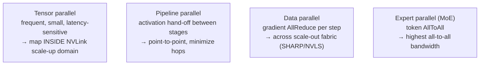
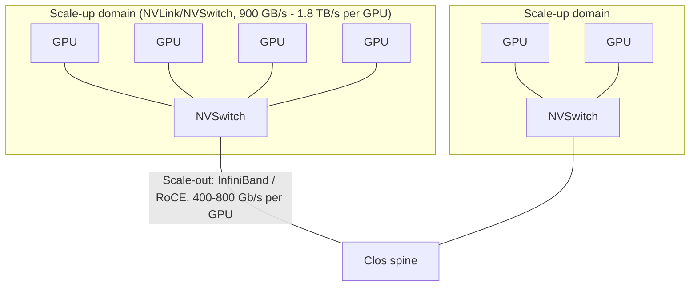

# AI/ML and HPC Networking — Fabrics, Collectives, and the Scale-Up/Scale-Out Architecture

## Introduction: The Network Is the Computer

In distributed AI training, the network is not an accessory to the computation — it *is* part of the computation. A large language model trained across tens of thousands of GPUs spends a substantial fraction of every training step moving data: synchronizing gradients, exchanging activations, routing tokens to experts. When the network stalls, the GPUs — the most expensive resource in the datacenter — sit idle. The efficiency of an AI cluster, measured as the fraction of peak FLOPS actually delivered to useful training, is determined as much by the network as by the accelerators. This chapter brings together the threads of the preceding chapters — Ethernet (File 06), InfiniBand (File 07), RDMA and collectives (File 08), NVLink and the scale-up fabrics — into the architecture of complete AI and HPC fabrics. It covers the communication patterns of distributed training, the scale-up versus scale-out distinction, the networking architectures of NVIDIA, AMD, Intel, Google, and Meta, the collective-communication algorithms in detail, and a comparative analysis of the AI-fabric options. It is the synthesis toward which much of the database builds.

## AI Training Networking Requirements

*Figure 15.2 — Each parallelism dimension has a distinct communication pattern and is mapped onto the part of the network best suited to it. Getting this mapping right — co-designing parallelism, collective algorithm, and topology — is the heart of large-scale training systems engineering.*

### Communication Patterns in Distributed Training

Distributed deep-learning training parallelizes the work across many accelerators, and each form of parallelism imposes a distinct communication pattern:
- **Data parallelism**: each GPU holds a full copy of the model and processes a different slice of the training batch. After each forward-backward pass, the GPUs must **synchronize gradients** — every GPU's gradient must be summed with every other's (an **AllReduce**) before the optimizer step. Data parallelism's communication is the AllReduce of the full gradient, once per step.
- **Tensor (model) parallelism**: a single layer's computation is split across GPUs (e.g., a matrix multiply partitioned across devices). This requires frequent **AllReduce/AllGather** within the layer's computation — many small, latency-sensitive collectives per layer, demanding very high bandwidth and low latency, which is why tensor parallelism is kept within a high-bandwidth scale-up domain (NVLink).
- **Pipeline parallelism**: the model's layers are split into stages across GPUs, with activations passed from stage to stage (point-to-point sends), and micro-batches pipelined to keep stages busy. Communication is the activation hand-off between adjacent stages — less frequent but bandwidth-significant.
- **Expert parallelism (Mixture-of-Experts, MoE)**: each GPU hosts different "expert" sub-networks, and tokens are routed to the appropriate experts via an **AllToAll** exchange — every GPU sends different data to every other. AllToAll is the most demanding pattern, and MoE models can require enormous all-to-all bandwidth.
- **Sequence parallelism**: long input sequences are split across the sequence dimension, adding further collectives.

Real frontier-model training combines several of these (3D or 4D parallelism), and the network must serve all their patterns simultaneously. The mapping of parallelism dimensions onto the physical topology — tensor parallelism within the NVLink domain, data parallelism across the scale-out fabric — is one of the central optimizations of large-scale training.

### The Communication-to-Compute Ratio

The pressure on the network has intensified because **compute has scaled faster than interconnect bandwidth**. Each GPU generation roughly multiplies FLOPS by ~2.5×, while interconnect bandwidth roughly doubles — so the ratio of compute to communication tightens, making the network an ever-larger fraction of the bottleneck. Concretely, gradient AllReduce for a model of P parameters moves on the order of the model size per step; for GPT-3-scale (175B parameters) this is tens of gigabytes synchronized per step, demanding tens of GB/s per GPU sustained; for MoE models at the trillion-parameter scale, AllToAll expert routing can demand on the order of a terabyte per second per GPU at full utilization. The network bandwidth per GPU (hundreds of gigabits to ~1 terabit per second) must keep the GPU's collectives from dominating step time.

### Collective Bandwidth and the Roofline

The key collectives and their traffic costs:
- **AllReduce**: total traffic ≈ 2 × (N−1)/N × (data size) — the factor of ~2 reflecting the reduce-scatter then all-gather phases of the ring algorithm; bandwidth efficiency approaches (N−1)/N → ~100% for large N.
- **AllGather / ReduceScatter**: each moves ≈ (N−1)/N × (full data size); these are the two halves of a ring AllReduce.
- **AllToAll**: each GPU sends a distinct shard to every other; worst-case traffic scales with N × shard size — the most bandwidth-intensive.

A **roofline** analysis frames whether a training job is compute-bound or communication-bound: the arithmetic intensity (FLOPs per byte communicated) of the workload, compared to the ratio of the accelerator's FLOPS to its interconnect bandwidth, determines which resource binds. For example, synchronizing a 70B-parameter model's gradients across 8 GPUs at 900 GB/s NVLink takes on the order of tens of milliseconds — a meaningful fraction of the ~100 ms compute time per step — so even at NVLink bandwidth, communication is a first-order term, and at the lower bandwidths of the scale-out fabric, it dominates without careful overlap and in-network reduction.

## Scale-Up versus Scale-Out

*Figure 15.1 — The two-tier AI fabric. Tensor parallelism (frequent, latency-sensitive collectives) is mapped inside the high-bandwidth scale-up domain (NVLink); data and pipeline parallelism run across the scale-out fabric (InfiniBand/RoCE). Enlarging the scale-up domain (8 GPUs in DGX H100, 72 in GB200 NVL72) lets bigger models be served at NVLink bandwidth.*

A foundational concept in AI networking is the distinction between **scale-up** and **scale-out** fabrics:

- **Scale-up fabric** connects accelerators *within a tightly coupled domain* — a server or a rack-scale unit — with ultra-high bandwidth, very low latency, and often cache coherence or a shared memory space. This is **NVLink/NVSwitch** (NVIDIA), **Infinity Fabric** (AMD within MI300X), **Xe Link** (Intel), and the emerging open **UALink**. Bandwidth: 900 GB/s (NVLink 4.0) to 1.8 TB/s (NVLink 5.0) per GPU; latency under a microsecond. Scale-up serves the frequent, small, latency-sensitive collectives of **tensor parallelism**.

- **Scale-out fabric** connects the scale-up domains to each other across the cluster — server to server, rack to rack — over **Ethernet (RoCEv2)** or **InfiniBand**. Bandwidth: 400 Gbps per GPU (NDR IB or 8×50G RoCE) to 800 Gbps (XDR IB or 800GbE); latency 600 ns (IB) to a few microseconds (RoCE). Scale-out serves the less frequent, larger, bandwidth-sensitive collectives of **data and pipeline parallelism**.

The **scale-up domain** size is a critical architectural parameter: the more GPUs that can be connected at NVLink-class bandwidth, the more tensor parallelism (and the larger the models) that can be served at full bandwidth. NVIDIA's NVLink Switch connects 8 GPUs in a DGX H100; the **Blackwell GB200 NVL72** extends the scale-up domain to **72 GPUs** in a single rack at 1.8 TB/s per GPU — a dramatic expansion. AMD and the UALink consortium aim to build large open scale-up domains as an alternative. Both fabrics are necessary because no single technology economically provides both NVLink's intra-domain bandwidth and Ethernet/IB's cluster-wide reach.

## NVIDIA Networking Architecture for AI

NVIDIA's vertically integrated AI fabric is the reference against which all others are measured:

- **DGX H100 system**: 8 H100 GPUs interconnected by **NVLink Switch (3rd Gen)** in a full 900 GB/s all-to-all mesh (the scale-up domain), plus **4 ConnectX-7 NICs** providing 4×400G NDR InfiniBand (1.6 Tbps) to the scale-out fabric. Within the box, GPUs talk over NVLink; between boxes, over InfiniBand.
- **DGX SuperPOD**: 32 DGX H100 systems connected through **Quantum-2 (NDR) InfiniBand** leaf and spine switches in a non-blocking fat-tree, with **SHARP** performing in-network gradient aggregation. The SuperPOD is the reference architecture for thousands-of-GPU training.
- **Blackwell GB200 NVL72**: a rack-scale unit of **36 Grace CPUs + 72 Blackwell GPUs** connected by **NVLink Switch (4th Gen)** at **1.8 TB/s bidirectional per GPU** — 72 GPUs sharing on the order of 130 TB/s of aggregate NVLink bandwidth within the rack — with scale-out via InfiniBand NDR/XDR or Ethernet. The NVL72 dramatically enlarges the scale-up domain, enabling far larger models to be served at NVLink bandwidth.
- **Magnum IO software stack**: **NCCL** (the collective library, with NVLS/NVLink-SHARP and IB-SHARP support), **GPUDirect RDMA** (the NIC DMAs directly to/from GPU memory, bypassing the CPU and host memory), **UCX**, CUDA-aware MPI, and **DOCA** (the BlueField DPU framework). This software is as much a moat as the hardware — NCCL's deep optimization for NVIDIA topologies is a key reason NVIDIA fabrics deliver superior collective performance.

## AMD AI Networking

**AMD's MI300X** is a chiplet marvel (8 GPU dies + 4 CPU/IO dies via 3D stacking and CoWoS, with 8 HBM3 stacks at 5.3 TB/s, File 05), but its networking philosophy contrasts sharply with NVIDIA's: AMD uses **standard Ethernet/RoCEv2 for inter-node** communication (around 7×100 GbE RDMA ports, ~700 Gbps per GPU for scale-out) and has **no proprietary NVLink equivalent** in current shipping products — relying on Infinity Fabric within the package and Ethernet between nodes. AMD's **RCCL** (ROCm Collective Communications Library) provides collectives. For scale-up, AMD is a leading backer of the open **UALink** standard (File 24), targeting large open scale-up domains for future generations (MI350X and beyond). AMD's argument: a standard Ethernet fabric is more flexible, lower cost, and customer-operable than NVIDIA's proprietary NVLink, and open standards (UALink, Ultra Ethernet) will close the performance gap. NVIDIA's counter: NVLink's bandwidth is irreplaceable for the largest models' tensor parallelism. This is the central strategic contest of AI networking.

## Intel Gaudi and AI Networking

**Intel's Gaudi** accelerators take a distinctive **Ethernet-unified** approach: Gaudi 3 integrates **24×200 GbE (or 24×100 GbE in prior gens) RDMA ports directly on the chip**, using RoCEv2 for *both* scale-up (intra-node, via on-board Ethernet) and scale-out (inter-node) — a single, unified Ethernet fabric with no proprietary scale-up interconnect. This radically simplifies the network model (everything is RoCEv2 Ethernet) and aligns with the open-Ethernet thesis. An 8-Gaudi server provides enormous aggregate Ethernet bandwidth, and Intel pairs Gaudi with merchant switches (e.g., Marvell Teralynx) in non-blocking fat-trees. Intel's collective library (part of the Habana/SynapseAI stack) and its embrace of Ultra Ethernet position Gaudi as the most thoroughly Ethernet-native of the major AI accelerators.

## Google TPU Networking

**Google's TPU** fabric is the most architecturally distinctive, eschewing both Ethernet and InfiniBand for a proprietary interconnect:
- **TPU v4**: 4,096 TPU chips per pod, interconnected in a **3D torus** via the **ICI (Inter-Chip Interconnect)** — 6 optical links per chip (two in each of x, y, z dimensions) — with **optical circuit switching (Palomar)** to reconfigure the torus topology dynamically. Each TPU has ~600 Gbps of ICI bandwidth across its 6 links.
- **Palomar OCS**: MEMS-based optical circuit switches (e.g., 128×128) reconfigure the inter-block topology in ~milliseconds, letting Google match the topology to the workload's communication pattern — different collectives prefer different topologies — and enabling fault tolerance and incremental upgrades (File 11).
- **TPU v5e / v5p**: v5e cost-optimized for inference, v5p for training (pods of thousands of chips); v5p provides high per-chip ICI bandwidth balanced to its compute. Google's ICI + OCS approach gives it topological flexibility that static Clos fabrics lack — a key differentiator and a glimpse of the reconfigurable-fabric future (File 24).

## Meta AI Networking

**Meta** takes a pragmatic, heterogeneous approach:
- **Research SuperCluster (RSC)**: an early large GPU cluster (hundreds of DGX A100 nodes) on a non-blocking **200G RoCEv2 Ethernet** fabric.
- **Grand Teton (H100)**: Meta's Open-Compute H100 platform, using NVIDIA ConnectX-7 **InfiniBand NDR** for its largest training clusters, while using Ethernet for inference and other workloads.
- **Scale**: Meta has announced AI infrastructure on the order of **350,000 H100 GPUs**, deployed across multiple large clusters, and has publicly documented running large-scale training (e.g., Llama models) over both InfiniBand and RoCE fabrics — using its experience to push the open-Ethernet (Ultra Ethernet) agenda. Meta's willingness to build very large RoCE fabrics, and to publish its findings, makes it a key force in proving Ethernet viable for frontier-scale AI.

## Collective Communication Algorithms in Depth

The performance of an AI fabric is realized (or squandered) by the collective-communication algorithms:

- **Ring AllReduce**: N nodes in a logical ring; each repeatedly sends a chunk to its neighbor while reducing received chunks; after 2(N−1) steps every node has the full reduced result. Bandwidth efficiency approaches optimal ((N−1)/N of link bandwidth is useful), making it ideal for **large messages** (bandwidth-bound), but its latency grows linearly with N — a problem at very large scale. NCCL's default for large tensors.
- **Recursive Halving/Doubling (butterfly/hypercube)**: completes in log₂(N) rounds, each communicating with a partner at increasing distance; latency grows only logarithmically with N, making it superior for **small messages** (latency-bound) — relevant to the small collectives of tensor parallelism.
- **Tree AllReduce**: reduces up a tree and broadcasts down; logarithmic latency; used where latency matters.
- **NVLS (NVLink SHARP)**: the NVLink Switch performs the reduction **in-switch** as data flows through it, so AllReduce within an NVLink domain effectively achieves N× the per-link bandwidth (the data need not traverse N−1 hops); NCCL uses NVLS for NVLink topologies — a major within-node AllReduce accelerator.
- **SHARP (InfiniBand)**: the Quantum switch performs FP16/BF16/INT reduction **in-network** across nodes, so multi-node AllReduce traffic does not traverse links repeatedly — roughly doubling effective bandwidth versus ring and eliminating the O(N) ring traversal (File 07). NCCL uses IB-SHARP for multi-node training.

In-network reduction (NVLS, SHARP) is the key to scaling collectives beyond the point where ring algorithms' linear latency becomes prohibitive — and replicating this capability in open Ethernet (via the Ultra Ethernet Consortium and in-network-computing efforts) is a central goal of the open-fabric camp.

## AI Fabric Comparison

| Fabric | BW/GPU | Latency | Lossless mechanism | Collective accel. | Scope | Open/proprietary |
|---|---|---|---|---|---|---|
| NVLink 4.0 | 900 GB/s | <1 µs | Credit (link) | NVLS | Scale-up | Proprietary |
| NVLink 5.0 (Blackwell) | 1.8 TB/s | <1 µs | Credit | NVLS | Scale-up | Proprietary |
| InfiniBand NDR | 400 Gbps | ~600 ns | Credit-based | SHARP | Scale-out | Proprietary (NVIDIA) |
| InfiniBand XDR | 800 Gbps | ~600 ns | Credit-based | SHARP | Scale-out | Proprietary (NVIDIA) |
| RoCEv2 (400/800G) | 400–800 Gbps | 1–3 µs | PFC + DCQCN/UEC | (UEC in-net, emerging) | Scale-out | Open (multi-vendor) |
| Spectrum-X | 400–800 Gbps | ~1–2 µs | PFC + NVIDIA CC | Spectrum in-net | Scale-out | NVIDIA Ethernet |
| UALink 1.0 | ~200 GB/s/link | <1 µs | Credit | (planned) | Scale-up | Open |
| Google ICI (TPU v5p) | ~hundreds GB/s | low | Credit | in-fabric | Scale-up+out | Proprietary (Google) |

This table crystallizes the landscape: NVLink dominates scale-up bandwidth (proprietary); InfiniBand leads scale-out latency and has mature in-network reduction (proprietary, NVIDIA); RoCEv2/Ultra Ethernet offers openness and cost at the price of harder congestion management; Spectrum-X is NVIDIA's Ethernet hedge; UALink is the open scale-up challenger; and Google's ICI is a proprietary, reconfigurable alternative entirely.

## Extended Deep Dive: Overlapping Communication with Computation

A crucial technique that determines real-world training efficiency, and one that the raw fabric specifications do not capture, is the **overlap of communication with computation**. The naive view of distributed training — compute the gradients, then synchronize them, then take the optimizer step — would leave the GPUs idle during the entire AllReduce, and at the bandwidths of even the fastest fabrics the AllReduce of a large model can take a meaningful fraction of the step time. Modern training frameworks therefore overlap the two: as soon as the gradients for the *last* layers of the network are computed during the backward pass, their AllReduce is launched while the backward pass continues computing the gradients of *earlier* layers. By the time the backward pass finishes, much of the gradient synchronization is already done, hiding the communication behind the computation.

This overlap is orchestrated by the collective library (NCCL, RCCL) in cooperation with the framework (PyTorch's DDP and FSDP, DeepSpeed, Megatron-LM), which bucket gradients and launch collectives on separate CUDA streams that run concurrently with compute kernels. The effectiveness of the overlap depends on the **communication-to-computation ratio**: if communication takes longer than the computation it can be hidden behind, the GPU stalls and the job becomes communication-bound regardless of how cleverly the overlap is arranged. This is precisely why fabric bandwidth and latency matter so much, and why the tightening compute-to-communication ratio (above) is alarming: as compute scales faster than interconnect, there is less computation to hide communication behind, and the overlap technique provides diminishing protection. In-network reduction (SHARP/NVLS) and higher-bandwidth fabrics directly attack this by shrinking the communication time that must be hidden, and the co-design of the parallelism strategy, the collective schedule, the overlap, and the fabric is the essence of large-scale-training systems engineering.

## Extended Deep Dive: Fault Tolerance and the Cost of a Single Slow Link

At the scale of tens of thousands of GPUs, **failures are not exceptional — they are continuous**, and the fabric's behavior under failure is a first-order determinant of useful training throughput. A cluster of 100,000 GPUs, with their NICs, transceivers, cables, and switches, experiences component failures on a timescale of hours: an optical transceiver degrades, a cable develops errors, a switch port flaps, a GPU falls off the fabric. Two distinct problems arise.

The first is **hard failure**: a component fails outright, and the training job — if synchronous — cannot proceed until the failed component is replaced or routed around. Synchronous data-parallel training is a barrier: every GPU must complete each step together, so a single failed GPU or link stalls the entire job. The mitigations are frequent **checkpointing** (so a failed job can restart from a recent saved state rather than from scratch — itself a major driver of storage-fabric bandwidth, File 18), **redundancy and fast failover** in the fabric (dual-rail topologies, File 06, so a link or switch failure does not partition the fabric), and increasingly **elastic/fault-tolerant training** frameworks that can reconfigure around a failed node and continue.

The second, more insidious problem is the **slow link** (sometimes called a "gray failure" or "straggler"): a link or component that has not failed but is degraded — a transceiver with a marginal optical signal triggering frequent FEC corrections and the occasional retransmission, a port with intermittent errors, a path with anomalous congestion. Because the collective is a barrier, **the slowest participant determines the speed of every step**, so a single degraded link among hundreds of thousands can throttle the entire job's throughput, and such degradations are far harder to detect than outright failures. This is why the tail of the latency distribution (P99.9), not the mean, is the right metric for AI fabrics (File 17), and why fine-grained telemetry (File 22) to detect and localize stragglers is operationally critical. The economic stakes are enormous: a 1% throughput loss on a cluster of tens of thousands of GPUs, each costing tens of thousands of dollars and consuming kilowatts, is a multi-million-dollar annual loss, so the detection and remediation of slow links is among the highest-value operational disciplines in AI infrastructure.

## Extended Deep Dive: The Topology of the Scale-Up Domain and Its Limits

The expansion of the NVLink scale-up domain — from 8 GPUs (DGX H100) to 72 GPUs (GB200 NVL72) and the roadmap toward larger domains — is one of the most important architectural trends in AI hardware, and its rationale and limits deserve explicit treatment. Within a scale-up domain, every GPU communicates with every other at full NVLink bandwidth (900 GB/s to 1.8 TB/s) and sub-microsecond latency, an order of magnitude beyond the scale-out fabric. The size of this domain directly bounds the practical extent of **tensor parallelism**, the parallelism dimension with the most frequent and most latency-sensitive collectives: a model layer split across the GPUs of a single scale-up domain enjoys NVLink bandwidth for its frequent AllReduce/AllGather operations, but splitting a layer *across* scale-up domains would force those operations onto the far slower scale-out fabric, crippling performance. Therefore, the larger the scale-up domain, the larger the tensor-parallel group, and the larger the models that can be served efficiently — which is why NVIDIA invested so heavily in expanding the NVLink domain to 72 GPUs and why competitors (AMD/UALink, Intel) are racing to build comparable open scale-up domains.

The limits on scale-up-domain size are physical and economic. NVLink at 1.8 TB/s per GPU requires enormous aggregate switching bandwidth (the NVL72's NVLink switches carry ~130 TB/s) and dense, power-hungry, expensive copper or optical interconnect within the rack; extending the full-bandwidth all-to-all mesh to ever-more GPUs runs into the bandwidth and power limits of the NVLink switches and the physical constraints of the rack. This is precisely where **optical scale-up** becomes relevant: connecting GPUs across multiple racks at NVLink-class bandwidth would require optics (copper cannot reach), and the convergence of scale-up interconnect with optical technology (and with UALink and CXL over optics, File 24) is a defining frontier. The scale-up domain is, in effect, the new "node," and its size — bounded by interconnect bandwidth, power, and reach — is one of the most important parameters in AI-system design.

## Extended Deep Dive: Parallelism Strategy Meets Network Topology

The deepest systems-engineering challenge in large-scale training is **mapping the parallelism strategy onto the network topology**, and elaborating it shows why the network and the training framework must be co-designed. A frontier model is trained with a combination of tensor, pipeline, data, and (for MoE) expert parallelism — often called 3D or 4D parallelism — and each dimension has a distinct communication pattern and bandwidth/latency requirement (File 15 above). The art is assigning each parallelism dimension to the part of the network best suited to it: **tensor parallelism**, with its frequent, latency-sensitive, high-bandwidth collectives, is placed within the **NVLink scale-up domain** (where bandwidth is highest and latency lowest); **data parallelism**, with its less frequent, bandwidth-heavy gradient AllReduce, is spread across the **scale-out fabric** (where in-network reduction, SHARP/NVLS, can accelerate it); **pipeline parallelism**, with its point-to-point activation hand-offs, is mapped to minimize cross-fabric hops; and **expert parallelism's** AllToAll is placed where the all-to-all bandwidth is adequate.

Getting this mapping right is worth enormous performance. A mapping that places tensor parallelism across the slow scale-out fabric (instead of within the NVLink domain) can cripple a job; a mapping that ignores the topology's hierarchy can create congestion hot spots. The training frameworks (Megatron-LM, DeepSpeed) and the collective libraries (NCCL) are increasingly topology-aware, querying the fabric's structure and arranging the parallelism and the collective algorithms to match — for example, performing a hierarchical AllReduce that first reduces within each NVLink domain (fast) then across domains over the fabric (with SHARP). This co-design of the parallelism strategy, the collective algorithm, the overlap schedule (File 15 above), and the physical topology is the essence of large-scale training systems engineering, and it is why the network topology (the size of the NVLink domain, the structure of the Clos, the presence of optical circuit switching) is not a fixed backdrop but a parameter that the training strategy is optimized around — and, increasingly, that the fabric (via reconfigurable OCS, File 11) adapts to the job. The network and the model-training software are, at the frontier, a single co-designed system.

## Extended Deep Dive: The Economics of Network Efficiency in AI Clusters

It is worth quantifying why AI networking commands such attention and investment, because the economics are stark and they explain the industry's behavior. A large AI training cluster represents an enormous capital investment — tens of thousands of GPUs at tens of thousands of dollars each, consuming tens of megawatts — and the value extracted from it is proportional to its **utilization**: the fraction of peak FLOPS actually delivered to useful training, often called the Model FLOPS Utilization (MFU). Because synchronous training is bounded by the network (the collectives are barriers, File 15), a fabric that delivers poor collective performance — through congestion, ECMP imbalance, slow links, or inadequate bandwidth — directly lowers MFU, idling the GPUs and wasting the capital and power. A cluster running at 50% MFU instead of 60% is wasting a sixth of a multi-hundred-million-dollar investment.

This is why the network, historically a small fraction of datacenter cost, commands disproportionate engineering attention in AI: a relatively modest additional investment in a better fabric (higher bandwidth, in-network reduction, careful tuning, better congestion control) that raises MFU by a few percentage points pays for itself many times over in better-utilized GPUs. It is why NVIDIA can charge a premium for InfiniBand and Spectrum-X (the fabric's contribution to MFU justifies it), why hyperscalers invest heavily in lossless-fabric engineering (File 17) and custom fabrics (Google's OCS), and why the entire AI-networking industry — from switch silicon to optics to congestion-control research — is booming. The network is a force multiplier (or divider) on the most expensive resource in the datacenter, and its efficiency translates directly into the economic return on the AI investment. Understanding this economic leverage — that a few points of MFU on a vast GPU fleet is worth more than the entire incremental cost of a superior fabric — is the key to understanding why AI networking matters so much and why so much capital and engineering flow into it.

## Extended Deep Dive: Inference Networking — A Distinct and Growing Workload

Most discussion of AI networking centers on training, but **inference** — serving trained models to users — is a distinct and rapidly growing networking workload that deserves treatment, because as deployed AI shifts from training to serving, inference networking becomes increasingly important. Inference has different characteristics from training. For smaller models that fit on a single accelerator, inference is "embarrassingly parallel" — each request is independent, and the networking demand is modest (north-south request/response, plus loading the model). But for the largest models — frontier LLMs that do not fit on one accelerator — inference requires **model parallelism** (tensor and pipeline parallelism, File 15) to spread the model across multiple GPUs, and this introduces collective communication into the inference path: each token generated may require AllReduce/AllGather across the GPUs holding the model, on the critical latency path of every request.

This makes inference networking latency-critical in a new way: where training is throughput-bound (complete the batch), interactive inference is **latency-bound per token** (the user waits for each token), so the inter-GPU communication for model-parallel inference must be ultra-low-latency — favoring the NVLink scale-up domain (File 15) for the model-parallel collectives. Furthermore, techniques like **disaggregated inference** (separating the compute-heavy "prefill" phase from the memory-bandwidth-heavy "decode" phase onto different hardware, connected by a fast fabric) and **KV-cache management** (the large, growing per-request cache that may be offloaded to CXL memory or transferred between stages) introduce new fabric demands. As inference comes to dominate AI compute consumption (a trained model is served far more than it is trained), inference networking — low-latency model-parallel collectives, disaggregated prefill/decode, KV-cache movement, and the memory fabric (CXL) for cache offload — becomes a major and distinct networking workload, with requirements (per-token latency, memory-fabric integration) different from training's (throughput, gradient AllReduce). The AI fabric must increasingly serve both, and inference's distinct demands are an important and growing dimension of AI networking that the training-centric narrative often understates.

## Conclusion

AI and HPC networking is where every layer of this database converges: the die-to-die HBM that feeds the GPU, the NVLink scale-up fabric that binds GPUs within a domain, the InfiniBand or RoCE scale-out fabric that connects domains into clusters, the optical links and circuit switches that carry it, the switch silicon that forwards it, and the collective-communication algorithms and in-network reduction that orchestrate it. The architecture is fundamentally two-tier — a high-bandwidth scale-up domain for tensor parallelism, a cluster-wide scale-out fabric for data and pipeline parallelism — and the central strategic contest is between NVIDIA's vertically integrated, proprietary stack (NVLink + InfiniBand/Spectrum-X + NCCL) and the open-standards challenge (Ethernet/Ultra Ethernet + UALink) led by AMD, Intel, and the hyperscalers, with Google's proprietary TPU fabric as a third path. The network is the computer: the efficiency of the world's largest AI clusters is decided by how well these fabrics deliver the synchronized, lossless, low-latency collective communication that training demands. The chapters that follow examine the supporting disciplines — network operating systems and programmability (File 16), the operational craft of building lossless RoCE fabrics (File 17), storage networking (File 18) — and ultimately the vendor landscape (File 23) and future roadmaps (File 24) that will decide how this contest resolves.
