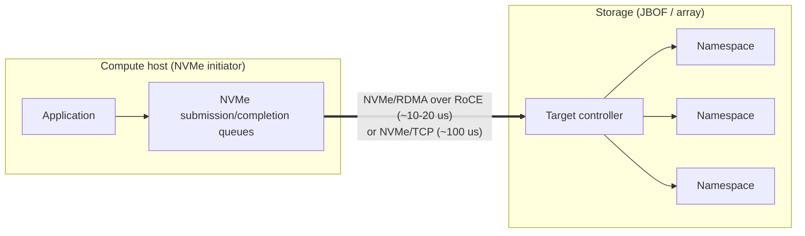

# Storage Networking — FC, NVMe-oF, and Distributed Storage Fabrics

## Introduction: Feeding the Compute

Storage networking is the discipline of connecting compute to data across a fabric, and it has been transformed twice over: first by the shift from spinning disks to flash (which made the network, not the media, the bottleneck), and again by the rise of RDMA (which let remote storage approach local-storage latency). In the AI datacenter, storage networking feeds the data pipelines that supply training (streaming petabytes of training data to GPUs) and absorbs the checkpoints that protect against failure (writing terabytes of model state periodically). This chapter covers the storage-networking protocols — Fibre Channel, iSCSI, and the modern NVMe-over-Fabrics family — and the distributed and disaggregated storage architectures built on them. It builds on the RDMA foundations of File 08 and connects to the disaggregation themes of Files 04 and 24.

## Fibre Channel — The Enterprise Storage Incumbent

**Fibre Channel (FC)** has been the dominant enterprise storage-area-network (SAN) protocol for over two decades, prized for its reliability, deterministic performance, and mature management in mission-critical enterprise environments. FC is a purpose-built, lossless, low-latency fabric for block storage, with its own physical layer, framing, and addressing — entirely separate from Ethernet/IP.

FC has scaled through generations: **Gen 5 (16GFC)**, **Gen 6 (32GFC)**, **Gen 7 (64GFC, ~2019)**, and **Gen 8 (128GFC, ~2022)**. The FC **fabric** is switched (the old arbitrated-loop topology is obsolete), with hosts and storage logging into the fabric (**FLOGI**) and to each other (**PLOGI**), and **zoning** controlling which initiators may access which targets — the SAN equivalent of network segmentation. The market is a duopoly: **Brocade (now part of Broadcom)** and **Cisco (MDS series)** dominate FC switching.

FC's extensions and decline-and-persistence are instructive. **FCoE (Fibre Channel over Ethernet)** attempted to converge FC onto Ethernet (using DCB/PFC for losslessness) but largely **failed to achieve broad adoption** — the operational complexity of converging two very different networks outweighed the benefit, and most operators kept FC and Ethernet separate or moved to IP storage. **FC-NVMe** carries NVMe commands over the FC fabric, modernizing FC for flash. FC persists strongly in enterprise storage arrays (NetApp, Dell EMC, HPE, Pure Storage) where its reliability and the installed base sustain it, even as new cloud and AI deployments favor Ethernet-based storage networking.

## iSCSI — Block Storage Over TCP/IP

**iSCSI** carries SCSI block-storage commands over ordinary TCP/IP, requiring no special fabric — any Ethernet network and commodity NIC will do. This simplicity made iSCSI hugely popular in small/medium enterprises and virtualization environments (VMware iSCSI datastores are ubiquitous). Performance options range from a pure **software initiator** (the host CPU does all the iSCSI/TCP work) to **iSCSI HBAs** (hardware offload of the iSCSI and TCP processing). iSCSI's latency — on the order of 100–200 µs, dominated by TCP processing — is acceptable for general virtualization but not for the most demanding workloads, where NVMe-oF over RDMA is far faster. iSCSI's enduring appeal is its zero-special-hardware simplicity and its use of the existing IP network.

## NVMe-over-Fabrics Architecture

*Figure 18.1 — NVMe-over-Fabrics carries NVMe's queue model across a network. NVMe/RDMA (over RoCE or InfiniBand) reaches near-local latency, enabling storage disaggregation; NVMe/TCP trades latency for fabric simplicity. The fast fabric is what lets compute and storage capacity scale independently (composable infrastructure).*

**NVMe (Non-Volatile Memory Express)**, the protocol designed for PCIe-attached flash (File 03), revolutionized storage with its massively parallel queue model (up to 65,535 I/O queues). **NVMe-over-Fabrics (NVMe-oF)** extends this model across a network, carrying NVMe's submission/completion queue semantics over a fabric transport so that remote flash can be accessed with the same low-overhead, highly parallel model as local NVMe. The NVMe controller model — namespaces, submission and completion queues, the streamlined command set — is preserved across the fabric, with an **NVMe initiator** (host) and **NVMe target** (storage controller or flash device).

NVMe-oF defines several **transports**:
- **NVMe/RDMA**: maps NVMe queues directly onto RDMA queue pairs (over RoCEv2 or InfiniBand), achieving the lowest latency — **under ~20 µs for a 4 KB read over RoCEv2, under ~10 µs over InfiniBand** — by exploiting RDMA's kernel bypass and zero-copy (File 08). This is the transport of choice for high-performance all-flash arrays.
- **NVMe/TCP**: carries NVMe over ordinary TCP, requiring no RDMA hardware, at the cost of higher latency (**~100 µs**, TCP-dominated). NVMe/TCP is gaining rapid adoption (VMware, Red Hat, Microsoft Azure Disk) precisely because it needs no special fabric, bringing NVMe-oF to commodity networks.
- **NVMe/FC**: carries NVMe over Fibre Channel, modernizing FC SANs for flash.

The **latency comparison** is the crux: NVMe/RDMA (~10–20 µs) approaches local NVMe and makes storage disaggregation viable; NVMe/TCP (~100 µs) trades latency for fabric simplicity; iSCSI (~100–200 µs) is the legacy baseline. The right choice depends on whether the workload needs RDMA-class latency (databases, high-performance analytics, AI data pipelines) or can tolerate TCP-class latency for operational simplicity.

High-performance NVMe-oF targets are often built with the **SPDK (Storage Performance Development Kit)** — Intel's user-space, polled-mode storage stack that bypasses the kernel for maximum IOPS and minimum latency, the storage analog of RDMA's kernel bypass.

## Distributed Object and Block Storage

Beyond the SAN model, **distributed software-defined storage** spreads data across many commodity servers connected by the Ethernet fabric:
- **Ceph** is the leading open-source distributed storage system, providing object (RADOS Gateway), block (RBD), and file (CephFS) storage atop **RADOS (Reliable Autonomic Distributed Object Store)**, which distributes and replicates data across a cluster with no single point of failure. Ceph runs over 100G+ Ethernet and increasingly exploits NVMe-oF (Ceph NVMe-oF gateway) for performance; it is deployed widely (Red Hat Ceph, OpenStack Cinder/Swift backends).
- **Hyperscaler proprietary equivalents**: AWS **EBS** (Elastic Block Store) and **S3** (Simple Storage Service), Azure Blob/Disk, and Google's Colossus and Persistent Disk are the proprietary, massive-scale distributed storage systems that underpin the public clouds — all fundamentally network storage, with the fabric's bandwidth and latency directly determining their performance.

For AI specifically, high-throughput parallel file systems and object stores (Lustre, IBM Storage Scale/GPFS, WEKA, VAST, and cloud object stores) feed training data to GPU clusters, and the storage fabric must sustain the enormous read bandwidth that thousands of GPUs demand — making storage networking an integral part of AI-cluster design, not an afterthought.

## Composable Disaggregated Infrastructure

The frontier is **Composable Disaggregated Infrastructure (CDI)**: decoupling compute, storage, and (via CXL) memory into independent pools connected by fast fabrics, composed on demand into the right machine for each workload. Storage disaggregation is the most mature dimension:
- **JBOF (Just a Bunch of Flash)**: dense flash enclosures accessed over NVMe-oF, separating flash capacity from compute, so capacity and compute scale independently.
- **SmartNIC/DPU NVMe-oF termination**: programmable NICs (NVIDIA BlueField, AMD Pensando, Broadcom's storage SmartNICs) terminate NVMe-oF and present local-looking NVMe to the host, offloading the storage networking from the host CPU and providing an isolation/virtualization boundary.
- **SNIA Swordfish** provides a standardized management API for composable storage, and **CXL** (File 04) extends disaggregation to memory, with CXL-attached storage-class memory and persistent memory blurring the storage/memory boundary.

The disaggregation trend — compute separate from storage capacity separate from memory, all connected by fast RDMA/NVMe-oF/CXL fabrics — is reshaping datacenter architecture, improving utilization (no stranded capacity) and flexibility (compose the right machine per workload), with the **network as the enabling substrate**: disaggregation is only viable because RDMA and NVMe-oF make remote resources nearly as fast as local ones.

## Extended Deep Dive: Storage for AI — Checkpoints and Data Pipelines

AI training imposes two distinctive and demanding storage-networking workloads that merit dedicated treatment, because they make storage an integral part of AI-cluster design rather than an afterthought. The first is the **data pipeline**: feeding training data to thousands of GPUs. A large training run streams enormous volumes of data (text, images, video) from storage to the GPUs continuously, and the aggregate read bandwidth required scales with the number of GPUs and their consumption rate — easily reaching terabytes per second for a large cluster. If the storage fabric cannot sustain this, the GPUs starve, idling the most expensive resource in the datacenter. This drives the use of high-throughput parallel file systems and object stores (Lustre, IBM Storage Scale, WEKA, VAST, cloud object stores) with the bandwidth and parallelism to feed the cluster, connected over the high-speed Ethernet fabric, often with local NVMe caching tiers to absorb repeated reads.

The second workload is **checkpointing**: periodically saving the model's complete state (parameters, optimizer state) so that a failed run can resume from a recent checkpoint rather than restart from scratch (File 15). For a frontier model, a single checkpoint can be terabytes, and because checkpointing stalls training (or competes with it for resources), it must be fast — driving the use of high-bandwidth storage and techniques like asynchronous and tiered checkpointing (writing first to fast local NVMe or even to peer GPU memory, then asynchronously to durable storage). The frequency of checkpointing is a trade-off: more frequent checkpoints lose less work on failure but cost more overhead, and at the scale where failures are continuous (File 15), getting this balance right — and having a storage fabric fast enough to make frequent checkpointing cheap — is essential to useful training throughput. Both workloads make the storage fabric a first-class component of AI infrastructure, and they are a major driver of the high-bandwidth Ethernet and NVMe-oF deployments that feed and protect AI clusters.

## Extended Deep Dive: NVMe-oF Transport Selection in Practice

The choice among NVMe-oF transports (NVMe/RDMA, NVMe/TCP, NVMe/FC) is a practical decision with real trade-offs, and elaborating it clarifies how storage networking is actually deployed. **NVMe/RDMA over RoCEv2** delivers the lowest latency (~10–20 µs) and is the choice for the highest-performance all-flash storage and for AI data pipelines that need maximum throughput at minimum latency — but it requires a lossless RoCE fabric (Files 06, 17) with all its tuning complexity, and an RDMA-capable NIC. **NVMe/TCP** trades latency (~100 µs) for radical simplicity: it runs over any IP network with any NIC, needs no lossless fabric, traverses routers and even the WAN, and is operationally far easier — which is why it is gaining rapid adoption (VMware, Microsoft, Red Hat) for the large set of workloads that need NVMe's parallelism but can tolerate TCP-class latency. **NVMe/FC** serves the installed base of Fibre Channel SANs modernizing for flash.

The decision hinges on whether the workload's latency sensitivity justifies the complexity and cost of a lossless RDMA fabric. For a latency-critical database or an AI training pipeline where storage latency directly throttles GPUs, NVMe/RDMA's order-of-magnitude latency advantage is worth the fabric complexity. For general virtualization, cloud block storage, and workloads where ~100 µs is fine, NVMe/TCP's simplicity wins — and the ability to run over the existing IP network, with no special fabric, makes NVMe/TCP the likely volume leader for mainstream storage disaggregation, with NVMe/RDMA reserved for the performance tier. This mirrors the broader pattern (File 09) of RDMA/coherent technology for the demanding tier and simpler TCP/IP technology for the volume tier, and it reflects the same engineering judgment — match the transport's cost and complexity to the workload's actual requirements — that recurs throughout datacenter networking.

## Extended Deep Dive: The Convergence of Storage and Memory Fabrics

A profound longer-term trend is the **convergence of the storage and memory fabrics**, blurring a distinction that has been fundamental to computer architecture since its inception. Historically, memory (byte-addressable, fast, volatile, attached to the CPU's memory bus) and storage (block-addressable, slower, persistent, attached to an I/O bus) were sharply separated, with very different access models, latencies, and fabrics. Several technologies are eroding this boundary. **CXL** (File 04) brings persistent memory and storage-class memory onto the memory-semantic, byte-addressable, coherent fabric — a CXL-attached persistent-memory device is accessed with loads and stores like memory, yet retains data like storage. **NVMe-oF** (this chapter) brings storage onto the same high-performance RDMA fabric as compute communication, so storage access uses the same network as memory-to-memory transfer. And emerging **computational storage** and **near-memory compute** push processing toward the data, further mixing the roles.

The endpoint of this convergence is a memory-storage hierarchy that is a continuum rather than a sharp divide: CPU caches, local DRAM, CXL-attached memory (a slightly slower memory tier), CXL-attached persistent memory (byte-addressable persistence), fast NVMe over RDMA (block storage at near-memory latency), and slower object storage — all connected by overlapping fabrics (the memory fabric for the fast tiers, the storage/RDMA fabric for the rest), and increasingly composable and disaggregated (File 24). For the system architect, this means the question is no longer "memory or storage?" but "where on the latency-persistence-cost continuum should this data live, and which fabric reaches it?" — a richer, more flexible model enabled by the convergence of the fabrics. The network, once again, is the enabler: the convergence is possible only because the fabrics (CXL, RDMA, NVMe-oF) have become fast and capable enough to span the continuum, and it is one more instance of the disaggregation-and-composability theme (File 01) that runs through the database — here applied to the most fundamental distinction in the memory hierarchy.

## Extended Deep Dive: Storage Network Topology and the Disaggregation Trade-off

The decision to **disaggregate storage** — separating storage capacity from compute and connecting them over a fabric — involves a topology and trade-off analysis worth making explicit, because it recurs as the central question of composable infrastructure (File 24). In the **converged (local-storage) model**, each compute server has its own local NVMe, giving the lowest latency (PCIe-attached, microseconds) but the worst flexibility: storage capacity is stranded on servers that may not need it (the same stranded-resource problem as memory, File 04), and capacity cannot be scaled independently of compute. In the **disaggregated model**, storage lives in dedicated enclosures (JBOFs) accessed over NVMe-oF, giving flexibility (compute and capacity scale independently, no stranding, capacity allocated where needed) at the cost of added fabric latency (the RDMA round-trip on top of the NVMe access) and dependence on the fabric's performance and reliability.

The trade-off hinges on whether the workload tolerates the fabric latency and on the value of the flexibility. For latency-critical workloads, local NVMe wins; for the large set of workloads where the ~10–20 µs NVMe/RDMA latency is acceptable, disaggregation's flexibility and efficiency (no stranded capacity, independent scaling, easier maintenance) win — which is why hyperscalers and storage vendors have moved aggressively toward disaggregated, NVMe-oF-accessed storage. The fabric is the enabler and the constraint: disaggregation is viable only because NVMe-oF over RDMA makes remote storage nearly as fast as local, and the fabric's bandwidth, latency, and reliability directly bound how aggressively storage can be disaggregated. This is the same disaggregation trade-off — locality and latency versus flexibility and efficiency, mediated by fabric performance — that defines memory pooling (File 04) and the broader composable-infrastructure vision (File 24), and storage, being more latency-tolerant than memory, has disaggregated furthest, serving as the leading example of where the rest of the datacenter is heading.

## Conclusion

Storage networking has been transformed from a specialized, Fibre-Channel-dominated SAN discipline into a central pillar of datacenter architecture, driven by flash (which moved the bottleneck to the network) and RDMA (which made remote storage nearly as fast as local). The protocol landscape spans the enterprise FC incumbent, the simple-and-ubiquitous iSCSI, and the modern NVMe-over-Fabrics family — NVMe/RDMA for the lowest latency, NVMe/TCP for fabric simplicity, NVMe/FC for FC modernization — atop which distributed systems (Ceph, the hyperscaler stores) and parallel file systems feed data to compute at scale. For AI, the storage fabric must sustain enormous read bandwidth for training data and absorb large checkpoints, making it integral to cluster design. And the disaggregation frontier — JBOF, DPU-terminated NVMe-oF, CXL memory pooling, composable infrastructure — is reshaping the datacenter into pools of compute, storage, and memory composed on demand, viable only because the network has become fast and lossless enough to make remote resources behave like local ones. The next chapter turns to securing all of this: the network security, micro-segmentation, and zero-trust architectures that protect the datacenter fabric.
