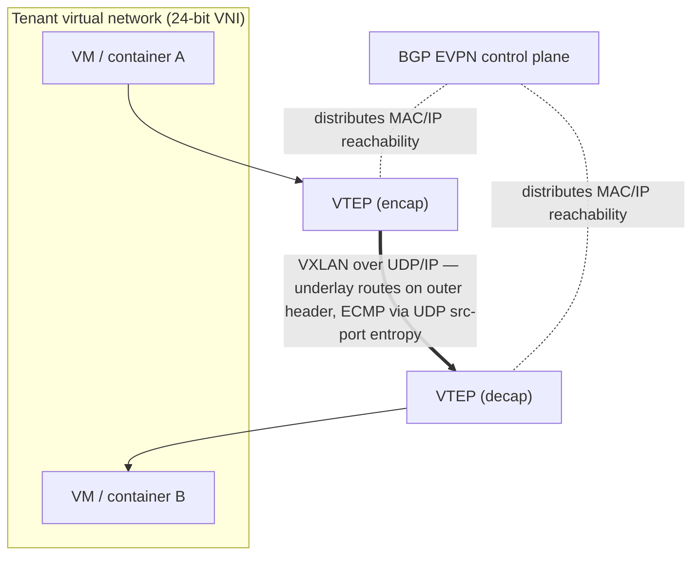

# Network Virtualization, Overlay Networks, and Cloud Networking

## Introduction: The Network as Software Abstraction

Network virtualization decouples the logical network that workloads see from the physical network that carries their packets, exactly as server virtualization decoupled the virtual machine from the physical server. This decoupling is what makes the multi-tenant cloud possible: thousands of tenants each get their own private, isolated virtual network — their own address space, their own segmentation, their own policies — all riding over a shared physical fabric that knows nothing of tenants. The mechanism is the **overlay**: encapsulating tenant packets inside outer packets that the physical underlay routes, so the underlay sees only the encapsulation and the tenants see only their virtual network. This chapter covers the overlay encapsulations (VXLAN, GENEVE, GRE), their control planes (BGP EVPN), the source-routing and label-switching alternatives (SRv6, MPLS), the platform implementations (VMware NSX), and the high-performance software dataplanes (eBPF/XDP) and container networking (Kubernetes CNI) that make virtualization fast. It builds on the protocol stack of File 02 and the security of File 19.

## VXLAN — The Dominant Datacenter Overlay

*Figure 20.1 — VXLAN decouples the tenant's logical network (top) from the physical underlay. VTEPs encapsulate frames in UDP/IP so the underlay routes them without understanding tenants; BGP EVPN is the control plane. Hardware VTEP offload (NIC/DPU/switch) is required to do this at line rate (File 19).*

**VXLAN (Virtual Extensible LAN, RFC 7348)** is the workhorse datacenter overlay. It encapsulates a complete Layer 2 Ethernet frame inside an outer **UDP/IP** packet (outer UDP destination port **4789**), with an 8-byte VXLAN header carrying a **24-bit VNI (VXLAN Network Identifier)** — 16 million virtual segments, versus the 4,096 of VLANs. The encapsulation/decapsulation endpoint is the **VTEP (VXLAN Tunnel Endpoint)**, which can reside in a hypervisor virtual switch, in a NIC (hardware offload), or in a physical switch ASIC (Broadcom Trident/Tomahawk and NVIDIA hardware VTEPs). The total overhead (~50 bytes) makes hardware offload and jumbo frames important.

A critical detail is **entropy for load balancing**: the VTEP sets the **outer UDP source port** as a hash of the inner flow, so that the underlay's ECMP (File 02) spreads different inner flows across different physical paths — the same entropy mechanism whose failure causes the elephant-flow imbalance of RoCE fabrics (File 17). VXLAN thus lets the underlay load-balance tenant traffic without understanding it.

### BGP EVPN — The VXLAN Control Plane

Early VXLAN relied on multicast or flood-and-learn to discover which VTEP hosted which MAC — inefficient and unscalable. The modern control plane is **BGP EVPN (Ethernet VPN, RFC 7432)**, which uses BGP (specifically MP-BGP with the EVPN address family) to **distribute MAC and IP reachability** among VTEPs: each VTEP advertises the MACs and IPs behind it, so other VTEPs learn the mapping without flooding. EVPN also enables **multi-homing** (a host connected to multiple leaf switches via Ethernet Segment Identifiers, ESI, for redundancy and load sharing) and **symmetric IRB (Integrated Routing and Bridging)** for efficient inter-subnet routing within the overlay. BGP EVPN over a VXLAN data plane is the standard modern datacenter overlay architecture, and it underlies the virtual networks of AWS VPC, Azure VNet, and GCP VPC (each with proprietary enhancements).

## GENEVE — The Extensible Overlay

**GENEVE (Generic Network Virtualization Encapsulation, RFC 8926)** generalizes VXLAN with a **variable-length, extensible header** carrying type-length-value (TLV) options, designed so that SDN controllers can attach arbitrary metadata to tunneled packets (e.g., for service chaining, security context, or telemetry). GENEVE's flexibility makes it the encapsulation of choice for software-defined platforms — **VMware NSX-T** uses GENEVE, as does Juniper Contrail — and **Open vSwitch** supports it natively. The trade-off versus VXLAN is that GENEVE's variable-length header is slightly more complex to offload in hardware, though modern NICs increasingly support it.

## SRv6 and MPLS — Source Routing and Label Switching

For traffic engineering and WAN/VPN services, two other paradigms matter:
- **Segment Routing over IPv6 (SRv6)** encodes the path a packet should take as a list of "segments" (IPv6 addresses) in a **Segment Routing Header (SRH)**, so the source (or ingress) determines the path and the core nodes simply follow it — **no per-flow state in the core**, unlike traditional MPLS traffic engineering. SRv6 supports traffic engineering, VPNs, and service-function chaining, and is deployed by Alibaba, SoftBank, and others for WAN traffic engineering; **compressed SRv6 (C-SRv6 / uSID)** reduces the header overhead.
- **MPLS (Multi-Protocol Label Switching)** uses short labels (rather than IP lookups) to forward packets along pre-established label-switched paths, underpinning carrier **L3VPN (RFC 4364)** and traffic engineering for two decades. New deployments increasingly use **Segment Routing MPLS (SR-MPLS)** — the MPLS forwarding plane with the stateless SR control plane — or migrate to SRv6, but the enormous installed base keeps MPLS central to carrier and inter-datacenter networks.

## VMware NSX and Platform Network Virtualization

**VMware NSX** is the leading commercial network-virtualization platform, implementing in software the entire suite of network services — logical switching (overlay), logical routing, distributed firewall (micro-segmentation, File 19), load balancing, and VPN — as a layer atop any physical fabric. **NSX-T** uses GENEVE encapsulation with VTEPs in the ESXi hypervisor kernel (or as N-VDS virtual switches), enforcing the **distributed firewall** at each VM's virtual NIC so that east-west traffic is inspected and segmented **without hairpinning** to a physical firewall. NSX exemplifies the "network as software" model: the physical fabric provides simple IP transport, and all the rich network services live in software at the hypervisor edge, programmable and mobile with the workloads.

## eBPF and High-Performance Software Dataplanes

The performance of software networking has been transformed by **eBPF (extended Berkeley Packet Filter)** and **XDP (eXpress Data Path)**, which allow sandboxed programs to run in the Linux kernel's networking fast path — processing packets at or near line rate, in the kernel, without a custom kernel module and without copying packets to user space. Use cases:
- **Cilium**: a Kubernetes networking and security plugin (CNI) built on eBPF, providing identity-based network policy, load balancing, and observability at high performance, increasingly the default for cloud-native networking.
- **Cloudflare** uses eBPF/XDP for line-rate DDoS mitigation, dropping attack packets in the kernel before they consume resources.
- **Hubble** (Cilium's observability layer) and **Pixie** provide eBPF-based observability (File 22).

eBPF lets operators implement custom, high-performance per-flow policy and observability in software, on commodity hardware, bridging the gap between the flexibility of software and the speed once requiring dedicated hardware — a profound shift in how datacenter networking functions are built.

## Kubernetes and Container Networking

The rise of containers and Kubernetes created a new layer of network virtualization: the **Container Network Interface (CNI)**, the standard for plugging networking into Kubernetes pods. CNI plugins embody different philosophies:
- **Calico**: a BGP-based, often overlay-free approach that routes pod IPs natively, scaling well and integrating with the underlay's BGP.
- **Flannel**: a simple VXLAN overlay for pod-to-pod connectivity.
- **Cilium**: the eBPF-based plugin (above), providing high-performance networking, identity-aware policy, and observability.
- **Multus**: enables multiple network interfaces per pod, important for workloads needing both a management network and a high-performance data network.

For high-performance and AI workloads, container networking integrates with the hardware: **SR-IOV** (File 03) gives a container direct access to a NIC virtual function for near-native performance; **DPDK**-accelerated CNIs bypass the kernel for maximum throughput; and **RDMA in Kubernetes** — via the NVIDIA Network Operator and GPU Operator, which expose RDMA devices and configure RoCE/InfiniBand for pods — brings GPUDirect RDMA and high-performance collective communication to containerized AI training. This convergence of container networking with hardware acceleration is essential for running AI workloads on Kubernetes at scale.

## Extended Deep Dive: The Underlay-Overlay Contract and Its Failure Modes

The relationship between the overlay and the underlay is best understood as a **contract**, and its failure modes are instructive. The contract is: the overlay (VXLAN/GENEVE) hands the underlay an encapsulated packet with an outer IP/UDP header, and the underlay promises to deliver it to the destination VTEP, load-balancing across its many paths (ECMP) using the outer header. The overlay's responsibility is to provide good **entropy** in the outer header (varying the outer UDP source port per inner flow) so the underlay's ECMP spreads flows evenly; the underlay's responsibility is to forward and load-balance efficiently. When both hold up their end, the system works: tenants get isolated virtual networks, and the physical fabric carries them efficiently without understanding them.

The failure modes arise when the contract breaks. If the overlay provides **poor entropy** — for example, if many flows hash to the same outer source port, or if the dominant traffic is between a few VTEPs — the underlay's ECMP cannot spread the load, and some physical links congest while others sit idle (the same elephant-flow problem as RDMA, File 17). If the underlay **drops or reorders** packets, the overlay's tenants suffer, and for RDMA-over-overlay (increasingly relevant for AI workloads in virtualized environments) the loss is catastrophic (File 08). If the **MTU** is misconfigured — the encapsulation adds ~50 bytes, so the underlay MTU must exceed the tenant MTU plus overhead, or packets are fragmented or dropped — connectivity breaks in subtle, hard-to-diagnose ways. And the **encapsulation overhead** itself consumes bandwidth and, without hardware offload, host CPU. These failure modes are why the overlay and underlay must be co-designed (jumbo frames in the underlay to accommodate encapsulation, hardware VTEP offload, good entropy generation, and a lossless underlay where RDMA-over-overlay is used) — yet another instance of the cross-layer co-design that this database has shown to be the essence of datacenter networking.

## Extended Deep Dive: Multi-Tenancy, Scale, and the Control-Plane Challenge

The deeper challenge of network virtualization at hyperscale is the **control plane**: distributing, to every VTEP, the constantly changing mapping of which tenant MAC/IP lives behind which VTEP, as virtual machines and containers are created, destroyed, and migrated by the millions. The data-plane encapsulation (VXLAN) is the easy part; keeping every VTEP's forwarding state correct and current across a fleet of hundreds of thousands of endpoints, with workloads churning continuously, is the hard part. BGP EVPN (above) is the standardized answer — using BGP's proven scalability to distribute the MAC/IP reachability — but at the largest scale, even EVPN strains, and hyperscalers often build **custom, controller-based** control planes (a centralized or hierarchical system that programs the VTEPs directly, an application of SDN principles, File 16) tuned for their specific scale and churn. AWS, Azure, and GCP each operate proprietary virtual-network control planes of enormous scale, with the actual encapsulation increasingly offloaded to SmartNICs/DPUs (the VTEP in hardware) so the host CPU is not consumed and the per-flow state is enforced close to the workload.

The control-plane scaling problem is a recurring theme: the abstraction (a virtual network per tenant) is conceptually simple, but realizing it for millions of endpoints with constant churn, low latency to react to changes, and no single point of failure is a deep distributed-systems challenge. It is also where much of the proprietary value of the cloud providers' networking lives — the data-plane encapsulation is standardized and commoditized, but the control plane that orchestrates virtual networks at cloud scale is a hard-won, differentiating capability. As AI workloads increasingly run in virtualized, multi-tenant environments (with the added requirement of RDMA-over-overlay for performance), the control plane must also handle the high-performance networking state, extending this challenge into the AI domain and making the integration of virtualization with RDMA/GPUDirect (above) one of the active frontiers of cloud networking.

## Extended Deep Dive: Virtualization Meets the AI Fabric

A frontier challenge is reconciling **network virtualization with the high-performance AI fabric**, because the two have historically pulled in opposite directions and AI clouds must now satisfy both. Network virtualization (overlays, micro-segmentation, multi-tenancy) is built for flexibility and isolation, traditionally at some cost in performance (encapsulation overhead, software processing, indirection). The AI fabric (RDMA, GPUDirect, lossless, low-latency) is built for raw performance, traditionally assuming a flat, trusted, bare-metal network. A multi-tenant AI cloud — renting GPU clusters to many customers — must provide both: each tenant needs an isolated virtual network (for security and multi-tenancy), yet the GPUs need RDMA/GPUDirect performance (for training efficiency).

Reconciling these is hard. RDMA's kernel bypass and direct memory access resist the indirection that virtualization traditionally imposes; the overlay encapsulation adds overhead that the latency-sensitive fabric cannot afford in software; and the strong tenant isolation required (one tenant's RDMA must not reach another's memory, File 19) must be enforced without sacrificing the fabric's performance. The emerging answers lean heavily on **hardware offload in the DPU/SmartNIC**: the DPU implements the overlay (hardware VTEP), the tenant isolation (per-tenant protection domains, enforced in hardware), the security policy, and the RDMA, all at line rate, so a tenant gets an isolated virtual network *and* GPUDirect RDMA performance, with the DPU bridging the virtualization and performance requirements. SR-IOV gives the tenant's VM direct access to a NIC virtual function for near-bare-metal performance while the hypervisor/DPU enforces isolation. This convergence — virtualized, multi-tenant, yet RDMA-performant AI fabrics, enabled by DPU offload — is one of the active frontiers of cloud networking, and it is essential to the business of renting AI infrastructure: the cloud provider must deliver bare-metal-class fabric performance with cloud-class isolation and multi-tenancy, and the DPU is the technology that makes this possible (Files 07, 19).

## Extended Deep Dive: The Cost of Abstraction and the Offload Imperative

It is worth making explicit the **fundamental cost of network virtualization** and why hardware offload is not optional but imperative at scale. Every layer of virtualization adds work: the overlay encapsulation/decapsulation (parsing, adding/removing ~50 bytes of headers per packet), the virtual switching (forwarding decisions in software), the security policy enforcement (matching packets against rules), and the entropy generation for load balancing. Performed in software on the host CPU, this work consumes cores — at high packet rates, virtual switching and encapsulation can consume many CPU cores that would otherwise run the tenant's workload, a direct and significant cost (the "datacenter tax" of infrastructure overhead). At the line rates of modern fabrics (hundreds of gigabits per second per server), software virtualization is simply infeasible without consuming an unacceptable fraction of the host's compute.

This is the **offload imperative**: the virtualization functions (overlay, virtual switching, security, RDMA) must be offloaded to hardware — the NIC, the SmartNIC, or the DPU — so that they run at line rate without consuming host CPU. The progression from software virtual switches (Open vSwitch in the kernel) to hardware-offloaded virtual switching (OVS offload to the NIC) to the full DPU (running the entire infrastructure stack on a dedicated processor, freeing the host CPU entirely) is driven by this imperative. The DPU is, in effect, the answer to the cost of abstraction: it provides the flexibility and isolation of network virtualization without the CPU cost, by running the virtualization in dedicated, line-rate hardware in a separate trust domain (File 19). The cost of abstraction, and the offload imperative it creates, is a central force shaping the evolution of the NIC into the DPU, and it connects network virtualization (this chapter) to the DPU architecture (File 07) and the DPU-centric security model (File 19) — all responses to the same imperative of providing rich, flexible, isolated networking at line rate without taxing the host CPU.

## Conclusion

Network virtualization is the abstraction that makes the multi-tenant cloud possible, decoupling the logical networks that workloads see from the physical fabric that carries them. The overlay — VXLAN with its BGP EVPN control plane, the extensible GENEVE, and the source-routing and label-switching alternatives SRv6 and MPLS — encapsulates tenant traffic so that the underlay can route it without understanding it, while platforms like VMware NSX implement the full suite of network services in software at the hypervisor edge. The performance gap that once made software networking slow has been closed by eBPF/XDP (line-rate kernel programmability) and by hardware acceleration (SR-IOV, DPDK, RDMA, offload to DPUs), and the container era has produced a rich CNI ecosystem that, for AI workloads, integrates directly with RDMA and GPUDirect. The result is a datacenter network that is simultaneously a simple, high-bandwidth physical transport and an infinitely flexible, software-defined, multi-tenant abstraction — the physical and the virtual co-designed, as every layer of this database has shown them to be. The next chapter returns to hardware, examining the optical-transceiver market — the 400G, 800G, and 1.6T modules — whose technology and fierce competition underpin all the fabrics described throughout.
