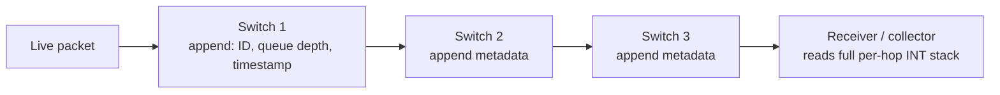
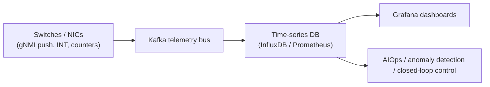

# Network Telemetry, Observability, and AIOps

## Introduction: You Cannot Operate What You Cannot See

A datacenter network spanning hundreds of thousands of ports, carrying the synchronized bursts of AI collectives and the long tail of cloud services, cannot be operated by intuition. It requires **observability** — the ability to measure, in fine-grained detail and near-real-time, what every link, queue, and flow is doing — so that operators (and increasingly, automated systems) can detect congestion, diagnose failures, and optimize performance. The legacy model of polling devices for counters every few minutes is hopelessly inadequate for a fabric where a microburst lasting microseconds can stall a billion-dollar training run. This chapter covers the modern telemetry and observability stack — in-band telemetry, streaming telemetry, flow sampling, BGP monitoring, AIOps, and eBPF-based observability — that gives operators the visibility AI-era networks demand. It builds on the gNMI/OpenConfig foundations of File 16 and the congestion-control mechanisms of Files 06 and 17.

## In-band Network Telemetry (INT)

*Figure 22.1 — In-band Network Telemetry embeds per-hop metadata (queue depth, timestamps) into live packets, giving microsecond-granularity visibility into the exact path and congestion each packet experienced — the basis of Alibaba's HPCC congestion control (File 06).*

**In-band Network Telemetry (INT)** embeds telemetry metadata directly into live data packets as they traverse the network. As a packet passes through each switch, the switch (typically a P4-programmable ASIC, File 14) appends metadata — its switch ID, the egress queue depth at that moment, a hop timestamp, link utilization — into an INT header stack within the packet. The receiver (or a monitoring endpoint) reads the accumulated INT stack, reconstructing the **exact path the packet took and the precise congestion state at every hop**, at microsecond granularity. This is far richer than any sampled or polled telemetry: it reveals the actual queueing experienced by real traffic.

INT is the basis of **Alibaba's HPCC** congestion control (File 06), which uses the precise queue-depth information to compute exact rate adjustments. INT comes in modes — **INT-MD (metadata, full per-hop insertion)** and **INT-XD (export from each node)** — and the Intel Tofino reference implementation popularized it. INT's cost is the per-packet overhead and the need for programmable switches, but for diagnosing the transient congestion that plagues AI fabrics, its visibility is unmatched.

## Streaming Telemetry

*Figure 22.2 — The streaming-telemetry pipeline. Devices push state (per-port counters, buffer occupancy, congestion events) at 100 ms - 10 ms granularity, replacing legacy SNMP polling — essential for diagnosing the microbursts that throttle AI collectives.*

**Streaming telemetry** replaces the request-response polling of SNMP with a **push** model: devices stream their state continuously to collectors. The standard mechanism is **gNMI Subscribe** (File 16), with modes for one-time snapshots (ONCE), periodic polling (POLL), and continuous streaming (STREAM). Devices push per-port counters, buffer occupancy, error rates, BGP state, and more at intervals that have shrunk from seconds toward **100 ms and even 10 ms**. The telemetry pipeline typically comprises:
- A **message bus** (Kafka) to ingest the high-volume stream.
- **Time-series databases** (InfluxDB, TimescaleDB, Prometheus) to store it.
- **Visualization** (Grafana) for the network operations center.
- **Alerting and analytics** layered on top.

This streaming model is essential for AI fabrics, where the operator must observe buffer occupancy and congestion events at sub-second granularity to correlate network behavior with collective-communication stalls and to feed congestion-control tuning (File 17).

## sFlow and IPFIX — Flow-Level Visibility

Complementing per-device telemetry, **flow-level** monitoring reveals traffic patterns:
- **sFlow** exports **sampled packets** (1 in N) from switches — a low-overhead, hardware-supported mechanism present in virtually every switch, giving a statistical view of traffic composition and enabling anomaly and DDoS detection.
- **IPFIX (RFC 7011)**, the standardized successor to Cisco's NetFlow v9, exports **flow records** (summaries of each flow: addresses, ports, byte/packet counts, timestamps) for traffic analysis, capacity planning, and security analytics.

Both are widely used for understanding *what* traffic is flowing where, complementing the *how-congested* view of INT and streaming telemetry.

## BGP Monitoring Protocol

**BMP (BGP Monitoring Protocol, RFC 7854)** exports a router's BGP RIB (Routing Information Base) and route updates to a monitoring station, enabling **BGP analytics**: tracking route changes, detecting anomalies and hijacks (File 19), analyzing path selection, and auditing the control plane. Supported by Cisco IOS-XR, Junos, FRRouting, and others, BMP gives operators visibility into the routing control plane that complements the data-plane telemetry from INT and streaming.

## AIOps for Networking

**AIOps** applies machine learning to network operations, evolving through increasing sophistication:
- **Threshold-based alerting** (the legacy: alert if a counter exceeds a fixed value) — simple but noisy and brittle.
- **Statistical anomaly detection** (e.g., isolation forests) that learn normal behavior and flag deviations, reducing false positives.
- **Time-series forecasting** (LSTM and other models) that predict traffic and capacity needs, enabling proactive action.
- **Automated root-cause analysis** that correlates events across the fabric to pinpoint the source of a problem.

Commercial AIOps for networking includes **Juniper Mist** (AI-driven wired and wireless operations), **Cisco DNA Assurance**, and others, while hyperscalers build bespoke ML pipelines on their telemetry streams. For AI fabrics, AIOps holds particular promise: detecting the subtle congestion and tail-latency patterns that degrade training efficiency, and automating the diagnosis and remediation that would otherwise require expert human analysis of overwhelming telemetry volumes.

## eBPF-Based Observability

The host side of observability has been transformed by **eBPF** (File 20). Tools like **Pixie** (open-source) and **Cilium Hubble** use eBPF to observe network and application behavior **in the Linux kernel without code changes or application instrumentation** — capturing per-packet latency, parsing Layer 7 protocols (HTTP, gRPC, MySQL, Kafka) on the fly, and providing service-level visibility into the actual traffic. This kernel-level, zero-instrumentation observability is central to cloud-native operations, giving developers and operators deep visibility into microservice communication without modifying applications, and complementing the network-device telemetry with host-level and application-level context.

## Extended Deep Dive: Telemetry for the AI Fabric — Correlating Network and Job

The distinctive observability challenge of the AI fabric is **correlating network behavior with training-job behavior**, and it deserves elaboration because it is where general network telemetry meets the specific needs of AI infrastructure. When a training job's throughput drops, the question is whether the cause is the network (a congested link, a slow transceiver, an ECMP hot spot) or the job (a straggler GPU, a data-pipeline stall, a software issue) — and answering it requires correlating fine-grained network telemetry with the job's collective-communication timeline. This means capturing, at microsecond granularity, which collectives ran when, which links they traversed, what the queue depths and PFC events were during each collective, and where the tail-latency outliers occurred — and joining that network view with the job's view (which GPU finished its step last, which AllReduce took longest).

This correlation is hard because the relevant events are transient (microbursts lasting microseconds, File 06) and distributed (spread across thousands of links and GPUs), and because the network and the job are observed by different systems. The emerging practice combines INT (per-hop, per-packet congestion visibility), high-rate streaming telemetry (buffer occupancy and PFC counters), NIC RDMA counters (out_of_buffer, out_of_sequence — File 17), and the collective library's own instrumentation (NCCL timing), fused in a pipeline that can pinpoint, for a given throughput regression, the specific link or component responsible. Given that a 1% throughput loss on a large GPU cluster is a multi-million-dollar annual cost (File 15), the value of this correlated observability is enormous, and it is an active area of development — the AI fabric is driving network observability toward finer granularity, tighter correlation with the workload, and more automation (AIOps) than any previous use case demanded.

## Extended Deep Dive: The Telemetry Data Deluge

A practical challenge that the move to high-rate streaming telemetry creates is the **data deluge**: streaming per-port, per-queue counters from hundreds of thousands of ports at 100-millisecond or 10-millisecond intervals generates an enormous volume of telemetry data — far more than legacy SNMP polling, and enough to strain the collection, storage, and analysis pipeline. A large fabric can produce terabytes of telemetry per day, and the pipeline (Kafka ingestion, time-series storage, analysis) must scale to ingest and query it without itself becoming a bottleneck or a cost center. This drives several practices: **edge filtering and aggregation** (processing telemetry on or near the device, e.g., with on-switch analytics or P4-based INT aggregation, to send only what matters rather than raw firehoses); **adaptive telemetry** (streaming at high rate only when anomalies are detected, lower rate otherwise); **efficient encoding** (compact binary formats, gNMI's protobuf rather than verbose text); and **tiered retention** (high-resolution data kept briefly, downsampled aggregates kept long-term).

The tension is between **visibility and cost**: finer-grained, higher-rate telemetry catches more transient events (the microbursts that matter for AI fabrics) but costs more to collect, store, and analyze. The art is capturing enough resolution to diagnose the transient problems that degrade training, without drowning in (and paying for) data. This is itself a systems-design problem — the observability infrastructure is a significant system in its own right at hyperscale — and it is why telemetry architecture, not just telemetry mechanisms, matters. As fabrics grow and as AI raises the value of fine-grained visibility, scaling the telemetry pipeline efficiently becomes a first-order concern, and the techniques to manage the data deluge are as important as the telemetry mechanisms (INT, gNMI) that generate it.

## Extended Deep Dive: From Observability to Closed-Loop Control

The trajectory of network telemetry points beyond observability (seeing what the network is doing) toward **closed-loop control** (automatically acting on what is observed), and this evolution deserves elaboration because it is where telemetry, AIOps, and programmable networking converge. In the open-loop model, telemetry feeds dashboards and alerts, and humans diagnose and remediate — a model that does not scale to fabrics of hundreds of thousands of ports where problems are transient (microbursts) and the cost of slow response is high (idle GPU fleets, File 15). The closed-loop model instead feeds telemetry directly into automated control: the system observes congestion, identifies the cause, and acts — rerouting traffic, adjusting congestion-control parameters, rebalancing load, or isolating a degraded component — without human intervention, at machine speed.

The building blocks of closed-loop control are precisely the technologies of this chapter and File 16: fine-grained telemetry (INT, streaming gNMI) for the observation, AIOps (anomaly detection, root-cause analysis) for the diagnosis, and programmable/SDN control (P4, controllers, intent-based systems) for the action. The most advanced realizations are the congestion-control loops themselves — HPCC's use of INT to compute precise rate adjustments (File 06) is, in effect, a closed loop operating at microsecond timescale in the data plane — and the emerging fabric-management systems that detect and route around slow links (File 15) or rebalance load automatically. The challenge is doing this safely (an automated action based on a misdiagnosis could make things worse) and at the right timescale (data-plane congestion control acts in microseconds; topology reconfiguration in milliseconds to seconds; capacity planning over longer horizons). As fabrics grow and as the value of fast, correct response rises (the AI economic leverage, File 15), the shift from observability to closed-loop, automated control is one of the most important directions in network operations — and it is the operational counterpart to the broader theme of the network becoming an intelligent, self-managing system rather than a static piece of infrastructure.

## Extended Deep Dive: The Observability of In-Network Computing

A frontier observability challenge created by the rise of in-network computing (SHARP, File 07; Spectrum-X and UEC in-network reduction, File 15) is **observing computation that happens in the network**. When a switch performs a reduction (summing gradients in-network), the traditional observability model — which treats the switch as a packet-forwarding device and watches its ports and queues — is insufficient, because the switch is now performing application-relevant computation, and a problem there (a misconfigured reduction tree, a degraded in-network operation) manifests not as a forwarding problem but as a collective-communication problem that the application experiences as slow or incorrect AllReduce. Observing the health and correctness of in-network computing requires new telemetry that exposes the state of the reduction trees, the in-network operations, and their correctness — a richer view than port counters and queue depths.

This is an emerging and important frontier, because as more computation moves into the network (the in-network-computing trend, Files 07, 24), the boundary between "network observability" and "application observability" blurs, and operators must observe the network as a participant in the computation, not merely as a transport. The correlation of network telemetry with the application's collective-communication timeline (File 22 above) is a step in this direction, but full observability of in-network computing — verifying that the switches are reducing correctly and efficiently, diagnosing problems in the in-network operations — is a capability that the telemetry stack is only beginning to develop. As in-network computing becomes central to AI-fabric performance, observing it well becomes essential, and it represents the extension of observability into the new territory that the convergence of networking and computation (the network that computes, not merely connects — File 07) is creating. The observability stack, like every other layer, is being reshaped by the AI fabric's distinctive demands.

## Extended Deep Dive: Telemetry Across the Whole Interconnect Hierarchy

A perspective that ties this chapter back to the database's organizing theme is that **observability must span the entire interconnect hierarchy** (File 01), not just the rack-level fabric — and as the hierarchy flattens (File 24), the telemetry challenge broadens accordingly. Each layer exposes its own health signals: PCIe and CXL links report their negotiated speed, error and retry counts, and (for CXL) memory-error and RAS events (Files 03, 04); NVLink and the scale-up fabric report their bandwidth and error state; the rack fabric reports the RDMA counters, PFC events, and queue depths this chapter has detailed; the optical layer reports the transceiver health (power, bias, FEC errors — File 21) and the DWDM/coherent link OSNR and performance (File 10); and the DCI and submarine links report their own optical and protection state (File 12). A complete view of a distributed AI workload's health requires observing all of these and correlating them, because a performance problem can originate at any layer — a degrading transceiver, a CXL memory error, a congested rack link, a flapping NVLink — and manifest as a training slowdown that the operator must trace to its source.

This cross-hierarchy observability is increasingly important as workloads span the whole hierarchy (a training step touching HBM, NVLink, the rack fabric, storage, and DCI — File 01) and as the hierarchy flattens (memory disaggregated over CXL and optics, scale-up domains extended over optics — File 24), blurring the boundaries the telemetry must cross. The mature observability stack therefore aspires to a unified view — ingesting telemetry from the chip-level interconnects, the rack fabric, the optical layer, and the DCI links into a common pipeline, correlated with the workload, so that a problem anywhere in the hierarchy can be detected and localized. Achieving this unified, cross-layer observability is a significant systems challenge (different layers expose telemetry through different mechanisms and at different timescales), but it is increasingly necessary: as the interconnect hierarchy flattens into a single optically interconnected fabric of compute and memory, the observability of that fabric must be correspondingly unified, spanning from the die-to-die link to the trans-oceanic cable. Telemetry, like every other discipline in this database, is being reshaped by the convergence and flattening of the interconnect hierarchy that defines the field's future.

## Conclusion

Observability is the prerequisite for operating modern networks, and the stack has been transformed from minute-granularity SNMP polling to a rich, real-time ecosystem: in-band telemetry revealing exact per-hop congestion in live packets, streaming telemetry pushing device state at sub-second granularity, flow sampling (sFlow/IPFIX) showing traffic composition, BMP exposing the routing control plane, AIOps applying machine learning to detect and diagnose problems, and eBPF delivering zero-instrumentation host and application visibility. For AI fabrics, where transient microbursts and tail-latency events directly determine the efficiency of enormously expensive training runs, this fine-grained, real-time observability — feeding both human operators and automated congestion-control tuning — is not a luxury but a necessity. You cannot operate what you cannot see, and the modern telemetry stack is how the AI-era network is made visible. The next chapter steps back to survey the vendor landscape — the companies whose products and competition constitute the industry this database describes.
