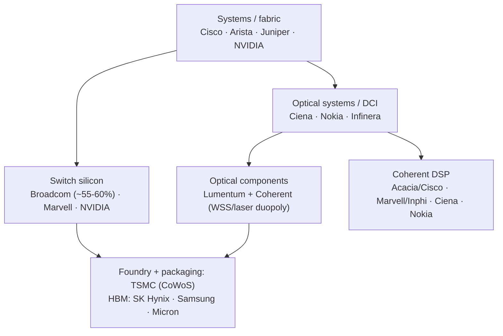

# Datacenter Networking Vendor Landscape — Deep Competitive Analysis

## Introduction: The Players and the Stakes

The datacenter networking industry is a contest among a few dozen companies for control of one of the most strategically important and rapidly growing markets in technology. The stakes have risen with AI: networking is no longer plumbing but a determinant of AI-cluster performance and economics, and the companies that supply the silicon, systems, and optics for AI fabrics are capturing extraordinary value. This chapter profiles the major vendors across the segments — switch and router systems (Cisco, Arista, Juniper), AI fabric and NICs (NVIDIA), switch and component silicon (Broadcom, Marvell), and optical systems and components (Ciena, Nokia, Infinera, Lumentum, Coherent) — covering each one's business, products, competitive moat, strategy, M&A history, and roadmap, and concludes with market-share summaries by segment. It synthesizes the technology threads of the entire database into the competitive dynamics that will determine the industry's future.

### The Supply Stack at a Glance

*Figure 23.1 — Who supplies what, and where the chokepoints (profit pools) sit: Broadcom in switch silicon, NVIDIA in AI fabric, the Lumentum/Coherent duopoly in optical components, and the SK Hynix-led oligopoly in HBM. The open-standards movements (Ultra Ethernet, UALink, open optical, SONiC) aim to dissolve these chokepoints.*

## Cisco Systems

**Cisco** is the incumbent giant of networking, with total revenue around **$52 billion** and a networking franchise that remains dominant in enterprise and carrier markets and present (if challenged) in cloud. Its datacenter and routing portfolio spans the **Nexus 9000** (datacenter switching, in ACI fabric or standalone NX-OS modes), **Nexus 3000** (low-latency switches for trading), **ASR 9000** (service-provider routing, using Broadcom Jericho2), the **Cisco 8000** series (built on its own **Silicon One** ASIC), the **Catalyst 9000** (enterprise), and a coherent optics lineup (Silicon One G100/G200 DSP and Acacia ZR+ pluggables).

Cisco's strategic pillars: the **Silicon One** unified custom-silicon architecture (File 14), differentiating against merchant silicon in routing and switching; the **Acacia acquisition ($4.5B, 2021)**, which vertically integrated leading coherent-DSP and pluggable technology and made Cisco both a systems vendor and a merchant coherent supplier (File 10); and a broad software and security portfolio (Talos threat intelligence, Meraki cloud management). Cisco's **moat** is its enterprise installed base, the IOS ecosystem and operator familiarity, support and services, and security integration. Its **challenges**: it was slower than Arista to embrace the cloud-friendly, merchant-silicon, automation-first model, and it has ceded hyperscaler and cloud share to Arista and white-box SONiC deployments. Cisco's response is Silicon One differentiation, Acacia-driven optical integration, and a push into AI-fabric reference designs, but the structural tension between its enterprise-centric model and the hyperscaler preference for open, disaggregated infrastructure persists.

## Arista Networks

**Arista** is the cloud-and-AI-optimized challenger, with revenue around **$5.86 billion (FY2023)** growing rapidly (~30%+ YoY) at operating margins near 35%, entirely focused on datacenter and cloud networking. Its product line — **7050X/7060X** (leaf, Trident/Tomahawk silicon), **7280R/7800R** (deep-buffer spine, Jericho silicon), **7500R** (modular chassis) — is built on **Broadcom merchant silicon**, a deliberate strategy: by using merchant silicon, Arista achieves faster product cycles than custom-ASIC competitors and differentiates on **software quality**. That software is **EOS (Extensible Operating System)** — a Linux-based, single-binary NOS with a published state database (SysDB), deep programmability, zero-touch provisioning, and the **CloudVision** management and analytics platform with native gNMI/OpenConfig support (File 16).

Arista's **AI-networking positioning** is strong: its deep-buffer 7800R "AI spine" platforms, its NVIDIA ConnectX-7 qualified configurations, and its AI-fabric reference architectures target the RoCE AI fabric directly, and it is a leader in the Ultra Ethernet push. Its **key customers** include Microsoft (a major account), Meta, Google, and financial institutions. Arista's **competitive position** is enviable — stealing enterprise share from Cisco on EOS simplicity, co-dominant in cloud, and well-placed for the Ethernet AI fabric — though it remains dependent on Broadcom silicon and faces NVIDIA's vertically integrated AI-fabric competition.

## Juniper Networks

**Juniper** has revenue around **$5.6 billion** and, pending its **acquisition by HPE (~$14B, announced 2024)**, spans enterprise, service-provider, and cloud. Its portfolio: **QFX5220** (datacenter leaf, Trident/Tomahawk), **QFX10000** (spine, Broadcom StrataDNX), the **MX series** (service-provider edge routing, using Juniper's in-house **Trio** ASIC), the **PTX series** (optical backbone routing, Trio-based), and the **ACX** (carrier aggregation). **Junos OS** is its UNIX-derived NOS, prized in service-provider networks for consistency and its commit/rollback model. The **Trio** custom ASIC competes with Cisco Silicon One and Broadcom Jericho in carrier routing, with strong MPLS and segment-routing capability.

Juniper's **AI and automation** assets include the **Apstra** intent-based networking platform (acquired 2021) and **Mist AI** (AI-driven access-layer operations). The **HPE acquisition** aims to combine Juniper's Mist AI and campus capability with HPE Aruba, though the cloud-networking strategy under HPE is uncertain. Juniper is a strong number-three in many segments but has less AI-datacenter momentum than Arista or NVIDIA.

## NVIDIA (Networking)

**NVIDIA's networking business** (the former Mellanox, File 07), at several billion dollars per year and growing in lockstep with AI demand, is the most strategically potent networking franchise in the industry. Its portfolio: **ConnectX-7/-8** NICs (400G/800G InfiniBand and Ethernet), **BlueField-3** DPUs, **Quantum-2/-3** InfiniBand switches, **Spectrum-3/-4** Ethernet switches (and Spectrum-X AI fabric), and **NVLink/NVSwitch** scale-up fabric.

NVIDIA's **moat** is unmatched: it is the **only** supplier of InfiniBand (a monopoly), it owns the proprietary **NVLink** GPU interconnect, **NCCL** is optimized for its stack, and it offers a **vertically integrated AI fabric** — GPU, NIC, switch, DPU, and software co-designed end-to-end. Its **Spectrum-X strategy** (File 07) extends this to Ethernet: bundling its NIC, switch, and proprietary congestion management to capture the Ethernet AI fabric the way it captured InfiniBand. NVIDIA's **risks**: regulatory scrutiny of its InfiniBand monopoly and AI dominance; AMD and Intel building competitive GPU-plus-network offerings; the Ultra Ethernet Consortium's open alternative; and the hyperscalers' custom silicon (Google TPU, Amazon Trainium) reducing NVIDIA dependence. But as of the mid-2020s, NVIDIA's grip on the AI fabric is the dominant fact of the industry.

## Broadcom

**Broadcom**, with total revenue around **$35+ billion** (including VMware), is the most powerful silicon supplier in datacenter networking. Its switch-ASIC franchise — **Tomahawk** (hyperscaler spine, 51.2T and beyond), **Trident** (leaf), **Jericho** (deep-buffer routing), **Ramon** (fabric), **Qumran** (metro) — commands an estimated **55–60% of the datacenter switch-silicon market** (File 14). Broadcom also has a substantial **optical-components** business (VCSELs, lasers, PHYs for transceivers) and broad semiconductor and software holdings.

A note on **M&A attribution** (a point of frequent confusion): Broadcom's major acquisitions include **Brocade (Fibre Channel, ~$5.9B, 2017)**, **CA Technologies (~$18.9B, 2018)**, **Symantec's enterprise security (~$10.7B, 2019)**, and **VMware (~$61B, 2023)**. The coherent-DSP maker **Inphi was acquired by Marvell ($10B, 2021)** — *not* Broadcom — and the Teralynx switch-ASIC line (Innovium) was acquired by **Marvell**, not Broadcom; Broadcom's switch-silicon growth has been primarily organic. Broadcom's **moat** is formidable: customer lock-in via the **BCM SDK** and SONiC SAI integration, the breadth of its portfolio, the relentless Tomahawk bandwidth cadence setting the hyperscaler refresh cycle, and its central position supplying silicon to both the systems vendors (Arista, Cisco, Juniper) and the optical-module makers. Broadcom is, by many measures, the single most important company in datacenter networking silicon.

## Marvell Technology

**Marvell**, with revenue around **$5.9 billion** (60%+ datacenter), is Broadcom's principal silicon challenger and a diversified datacenter-silicon powerhouse. Its products: **Teralynx** switch ASICs (acquired via Innovium, targeting AI fabric), **Prestera** (enterprise switching), the **Inphi**-derived coherent DSPs (**Meru** 400G, **Viper** 800G), **Alaska** PHYs/retimers, optical DSPs for LPO, NVMe SSD controllers, and **LiquidSecurity** HSMs. Its **Inphi acquisition ($10B, 2021)** made it a major coherent-DSP and ZR/ZR+ component supplier (File 10).

Marvell's distinctive strength is its **custom-silicon business**: it designs custom chips for hyperscalers (interconnect, accelerator components, under NDA), an estimated $1–2B+ annual and fast-growing revenue stream that positions it as a key partner for hyperscalers building their own silicon. Its **AI-networking** push centers on Teralynx for the AI fabric (partnering with Intel Gaudi, File 15), LPO DSPs for power-efficient AI optics, and a 1.6T switch roadmap competing with Broadcom's top tier. Marvell is second to Broadcom in switching but strong across coherent DSP, PHYs, custom silicon, and storage controllers.

## Ciena Corporation

**Ciena**, with revenue around **$4.0 billion**, is the optical-transport and DCI specialist (not a datacenter-switching vendor, but critical for the optical layer). Its products: the **6500** packet-optical platform, **WaveServer** (compact coherent transport), the **5170** service-delivery switch, and **Blue Planet** automation software. Its **moat** is the **WaveLogic** coherent DSP (File 10) — widely regarded as best-in-class for reach × capacity, with **WaveLogic 5e** achieving 400G at ~6000 km and 800G at ~3000 km, and **WaveLogic 6** targeting 1.6T per wavelength. Ciena's customers include Verizon, AT&T, T-Mobile, BT, NTT, and the hyperscalers (Microsoft, Google, Meta) for DCI and backbone. Its **threat** is the pluggable-coherent (ZR/ZR+) revolution commoditizing metro/regional transport (File 10), which Ciena counters by emphasizing the longest-reach, highest-capacity applications where WaveLogic still wins and by offering pluggable-compatible platforms.

## Nokia (Networks)

**Nokia's** networks business (total ~€18B, optical ~€2B) spans IP and optical. Its products: the **1830 PSS** (photonic service switch, ROADM), metro DWDM platforms, the **FP5** custom routing ASIC, and the **7750 SR** edge router family running **SROS**. The **FP5** ASIC (14.4 Tbps) competes with Cisco Silicon One and Broadcom Jericho in carrier routing, with strong MPLS/segment-routing features. Nokia's coherent **PSE** DSPs compete with WaveLogic but have commercialized more slowly. Nokia (which acquired **Alcatel-Lucent in 2016** for Bell Labs and IP capability) is roughly the **number-three optical vendor** (behind Ciena and Huawei), strong with European carriers and its native base, with less hyperscaler presence than Ciena.

## Infinera

**Infinera** (revenue ~$1.8B), an optical specialist known for **InP photonic integrated circuits (PICs)**, designs and manufactures its own InP PICs — integrating multiple lasers, modulators, and detectors on a single chip — a vertically integrated photonics-plus-DSP approach distinct in the industry. Products: the **GX series** with the **ICE6** (800G/wavelength) and roadmap **ICE7** engines, and the **FlexILS** open line system. Infinera's **ICE6** competes with Ciena's WaveLogic (800G over ~2000 km, not quite matching WaveLogic's longest reaches). It is **challenged** by coherent-pluggable commoditization and has been a perennial M&A-target subject of speculation; it pivots toward "cloud-optimized" open optical. (Infinera was subsequently the subject of acquisition interest from Nokia.)

## Lumentum Holdings

**Lumentum** (revenue ~$1.7B) is an optical-**component** supplier — not systems — and a critical vendor to the transceiver and ROADM industries. Products: **Wavelength Selective Switches (WSS)** — where it holds the leading **~45–50% share** (File 11) — EDFA pump lasers, **EML (Electro-absorption Modulated Lasers)** for 400G DR4/FR4 transceivers, DFB lasers, VCSEL arrays (with a large non-datacenter business in consumer 3D sensing), and coherent components. Lumentum's WSS and EML positions make it essential to any ROADM or high-volume transceiver product. Its **threats**: silicon photonics displacing InP/GaAs components at volume, and the challenge of 200G-per-lane VCSELs as the datacenter moves to 800G/1.6T-SR.

## Coherent (formerly II-VI / Coherent)

**Coherent** — the company formed by **II-VI's acquisition of Coherent (2022)**, which had earlier acquired **Finisar** — has revenue around **$4.7 billion** and spans optical components and systems. Products: transceivers (400G, coherent ZR/ZR+), **WSS** (the ~35% number-two to Lumentum), **EML/DFB lasers**, VCSELs, III-V wafers (GaAs, InP), SiC substrates (a major power-semiconductor business), and laser systems. Its strategy is **vertical integration** from wafer to system, competing with Lumentum in components, with the systems vendors in some products, and with the module makers in transceivers. Its **challenges** are post-merger integration complexity (consolidating the II-VI, Coherent, and Finisar brands) and the debt from acquisitions, balanced against the strength of its vertically integrated optical and compound-semiconductor portfolio.

## Market-Share Summaries by Segment

The following summarize the competitive structure of each key segment (approximate, mid-2020s):

- **Datacenter switch silicon**: Broadcom dominant (~55–60%), Marvell the principal challenger, NVIDIA (Spectrum/Quantum) growing with AI, Intel (Tofino) exiting, plus custom hyperscaler designs.
- **Datacenter Ethernet switch systems**: Cisco and Arista co-leading (Arista gaining, especially in cloud/AI), Juniper third, with Huawei strong in non-Western markets, and Dell/HPE/white-box (SONiC) significant.
- **InfiniBand NIC/switch**: NVIDIA effectively a monopoly (90%+).
- **400G/800G optical transceivers**: a fragmented, competitive market — Coherent, InnoLight (volume leader), Eoptolink, Lumentum, Accelink, Acacia/Cisco (coherent), Source Photonics — split between Western and Chinese suppliers (~35–40% Chinese by volume).
- **ROADM/WSS**: a Lumentum (~45–50%) / Coherent (~35%) duopoly, with Santec and Huawei in the remainder.
- **Coherent DSP**: Acacia/Cisco, Marvell/Inphi, Ciena (WaveLogic, captive), Nokia (PSE), Infinera (ICE), and HiSilicon (Huawei, captive/restricted).
- **DCI / optical systems**: Ciena leading, with Nokia, Infinera, Cisco, Huawei, and ZTE.

## Extended Analysis: The Hyperscalers as Vendors and Customers

A profile of the vendor landscape is incomplete without treating the **hyperscalers themselves as participants** — not merely as customers but increasingly as designers of their own networking silicon and systems, reshaping the market they buy from. **Google** is the most advanced: it designs custom switch silicon, built the Jupiter fabric with optical circuit switching, designs the TPU and its ICI interconnect, and builds its own optical line systems and owns submarine cables (File 12) — a degree of vertical integration that makes Google a peer of the merchant vendors in many domains, and a reference customer whose published research (Jupiter Evolving, Swift, BBR) shapes the whole industry. **Amazon AWS** built the Nitro system (custom networking/storage/security offload silicon), the Trainium and Inferentia AI accelerators with custom NeuronLink interconnect, and a famously custom, blast-radius-minimizing network design philosophy. **Microsoft** open-sourced SONiC (reshaping the NOS market), builds custom NICs (Azure Boost, MANA), operates a custom optical backbone, and is a lead deployer of NVIDIA Spectrum-X and InfiniBand for OpenAI. **Meta** drove the Open Compute Project (commoditizing switch and rack hardware), builds the MTIA accelerator, operates very large RoCE and InfiniBand AI fabrics, and is a principal force behind the Ultra Ethernet Consortium.

The strategic significance is twofold. First, the hyperscalers' custom silicon **reduces their dependence** on the merchant vendors (Broadcom, NVIDIA), capping the vendors' pricing power and capturing value in-house — a direct threat to the merchant model, and a key reason NVIDIA's monopoly position, however strong today, faces structural pressure. Second, the hyperscalers' preference for **open, disaggregated, multi-sourced** infrastructure (SONiC, OCP, Ultra Ethernet, open optical line systems) is the single largest force pushing the industry toward openness, against the vertical-integration pull of NVIDIA's AI fabric. The vendor landscape, in other words, is not a fixed set of suppliers selling to passive buyers; it is a dynamic contest in which the largest buyers are themselves becoming designers, and in which the balance between merchant and custom, and between proprietary and open, is continuously renegotiated.

## Extended Analysis: M&A as Strategy and the Consolidation of the Optical Component Layer

The competitive landscape has been shaped as much by **mergers and acquisitions** as by organic product competition, and the pattern of consolidation reveals the strategic logic of the industry. The optical-component layer, in particular, has consolidated dramatically: **II-VI acquired Finisar (2019)** and then **Coherent (2022)**, rebranding as Coherent, to build a vertically integrated optical company spanning III-V wafers, lasers, modulators, WSS, and modules; **Lumentum acquired Oclaro (2018)** and **NeoPhotonics** changed hands (acquired by Coherent), concentrating the WSS and EML supply into a Lumentum/Coherent duopoly with enormous leverage over any ROADM or transceiver product. In the DSP and silicon layer, **Cisco acquired Acacia ($4.5B, 2021)** to vertically integrate coherent DSP and pluggables, while **Marvell acquired Inphi ($10B, 2021)** for coherent DSP and **Innovium** for switch ASICs — making Marvell a diversified silicon challenger to Broadcom. In the systems and fabric layer, **NVIDIA acquired Mellanox ($6.9B, 2020)** — the single most strategically consequential networking acquisition, giving NVIDIA the AI fabric — and **HPE moved to acquire Juniper (~$14B, 2024)** to bolster its enterprise and AI-ops position. Broadcom's networking franchise grew largely organically, supplemented by adjacent acquisitions (Brocade in Fibre Channel, and the broader VMware/CA/Symantec moves that diversified the company).

The logic across these deals is consistent: **vertical integration** to capture more of the value chain (Cisco/Acacia, II-VI/Coherent, NVIDIA/Mellanox), **diversification** to challenge a dominant incumbent (Marvell's acquisitions versus Broadcom), and **consolidation** to gain pricing power in a critical component (the WSS/EML duopoly). For a buyer of networking equipment, the consequence is a supply chain with a few powerful chokepoints — Broadcom in switch silicon, NVIDIA in AI fabric, the Lumentum/Coherent duopoly in optical components, the SK Hynix-led oligopoly in HBM (File 05) — each of which represents both a strategic risk (single-source dependence, pricing power) and a target of the open-ecosystem and multi-sourcing efforts that the hyperscalers drive. The M&A history is, in effect, the story of how the value in datacenter networking has been concentrated, and the open-standards movements (Ultra Ethernet, UALink, open optical, SONiC) are the countervailing force seeking to de-concentrate it.

## Extended Analysis: The Geopolitical Dimension

No competitive analysis of datacenter networking is complete without the **geopolitical dimension**, which has become inseparable from the commercial one. The most advanced HBM is produced predominantly in South Korea (File 05); the most advanced logic and the CoWoS packaging that AI accelerators require are concentrated at TSMC in Taiwan; and the optical-transceiver supply chain spans Western component leaders (Coherent, Lumentum, the DSP makers) and Chinese module leaders (InnoLight, Eoptolink, Accelink) who hold a large and growing share by volume (File 21). US export controls restrict the flow of the most advanced GPUs, DSPs, and manufacturing equipment to China; Chinese vendors (Huawei's HiSilicon coherent DSPs, for example) are advanced but restricted from Western markets and constrained in their access to leading-edge foundries. The result is a bifurcating supply chain in which the same technology is increasingly developed in parallel, restricted ecosystems, with hyperscalers dual-sourcing to balance cost against supply-chain-security and geopolitical risk. For the vendors profiled here, geopolitics is now a first-order strategic variable: it shapes which markets they can serve, where they can manufacture, which customers they can sell to, and how resilient their supply chains are — and it is a recurring theme across the HBM (File 05), transceiver (File 21), and switch-silicon markets. The competition over datacenter-networking technology is, increasingly, a dimension of the broader strategic competition between the United States and China over the foundational technologies of artificial intelligence.

## Extended Analysis: The Profit Pools and Where Value Accrues

A useful way to understand the vendor landscape is to ask **where the profit pools are** — which layers of the stack capture the most value — because this drives strategy and M&A. The most profitable, defensible positions are those with high barriers and limited competition: **switch silicon** (Broadcom's ~55–60% share, sustained by the SDK/ecosystem moat and the enormous engineering cost of competing), **AI fabric** (NVIDIA's InfiniBand monopoly and integrated stack), **critical optical components** (the Lumentum/Coherent WSS and laser duopoly), and **HBM** (the SK Hynix-led oligopoly, File 05). These chokepoints command premium margins because customers have few alternatives and the technical/capital barriers to entry are high.

The less profitable, more competitive positions are those that are commoditized or fragmented: **optical transceiver modules** (a crowded field of Western and Chinese vendors competing on cost, File 21), **white-box switch systems** (commoditized hardware running open SONiC), and increasingly **systems integration** (as merchant silicon and open software commoditize the box). The strategic implication is that value flows toward the chokepoints, and the competitive battles are fights over who controls them: NVIDIA defending its AI-fabric chokepoint against the open Ethernet/UALink challenge; Broadcom defending its switch-silicon chokepoint against Marvell and custom silicon; the open-optical and pluggable-coherent movements trying to break the integrated-systems chokepoint; and the hyperscalers trying, through custom silicon and open standards, to commoditize the chokepoints they depend on and capture the value themselves. Reading the vendor landscape as a contest over profit pools and chokepoints — who holds them, who is attacking them, and how the open-standards movements are trying to dissolve them — is the clearest lens on the industry's competitive dynamics, and it explains the M&A (vertical integration to capture or defend a chokepoint), the strategy (NVIDIA's vertical integration, the hyperscalers' open push), and the technology bets (CPO, UALink, Ultra Ethernet) that the players are making.

## Extended Analysis: Scenarios for How the AI-Fabric Contest Resolves

Because the AI-fabric contest (NVIDIA's proprietary stack versus the open Ethernet/UALink challenge) is the central strategic question, it is worth laying out the plausible scenarios for its resolution, as a synthesis of the analysis throughout this database. In the **NVIDIA-dominance scenario**, NVIDIA's vertical integration (GPU + NVLink + InfiniBand/Spectrum-X + NCCL) proves so superior in delivered performance, and its execution so far ahead, that it retains the bulk of the AI-fabric market across both InfiniBand and (via Spectrum-X) Ethernet, sustaining its premium and its chokepoint — the open alternatives perpetually a generation behind. In the **open-Ethernet scenario**, the historical pattern of Ethernet's victories (File 06) reasserts itself: the Ultra Ethernet Consortium delivers InfiniBand-class performance over open, multi-vendor, cost-competitive Ethernet, the hyperscalers (who control the demand) standardize on it, and NVIDIA's fabric advantage erodes to its GPU and software, with the fabric commoditizing as every previous networking battle eventually did.

In the most likely **segmented scenario**, the market divides: NVIDIA's integrated stack dominates the highest-performance, NVIDIA-GPU training clusters where its vertical integration is most valuable and customers prioritize performance; open Ethernet (UEC) wins the hyperscaler-built, multi-vendor, cost-and-control-sensitive fabrics and the AMD/Intel/custom-accelerator deployments; and UALink establishes an open scale-up alternative to NVLink for the non-NVIDIA accelerator ecosystem. The resolution depends on factors traced throughout this database: how fast the UEC matures relative to NVIDIA's roadmap, whether the hyperscalers' open push or NVIDIA's integration advantage proves stronger, how the AMD/Intel GPU challenge to NVIDIA's compute dominance fares (since the fabric contest is downstream of the GPU contest), and the pace of the optical-integration and in-network-computing transitions that could reshape the competitive basis. This contest — the proprietary-integration-versus-open-standards tension at the scale of the most strategic infrastructure of the AI era — is the defining drama of the field, and its resolution will determine the shape of the datacenter-networking industry for the next decade.

## Extended Analysis: The Emerging-Players and Startup Ecosystem

Beyond the established giants, a vibrant ecosystem of **emerging players and startups** is attacking specific layers of the stack, often at the frontiers where the incumbents are weakest, and surveying them rounds out the competitive picture and signals where disruption may come. In **connectivity silicon**, **Astera Labs** built a high-profile business (and IPO) on PCIe/CXL retimers and "smart fabric" connectivity for AI servers — capitalizing on the signal-integrity wall (File 03) that makes retimers essential — and **Credo** grew rapidly on active electrical cables (AEC) for AI deployments where passive copper ran out of reach (File 21). In **CXL**, **Xconn** builds dedicated CXL switch silicon, and **Montage** and **Astera** build CXL memory controllers (File 04), attacking the memory-disaggregation opportunity ahead of the incumbents.

In **co-packaged and photonic interconnect**, the startup ecosystem is especially active: **Ayar Labs** (silicon-photonic optical I/O chiplets, TeraPHY), **Lightmatter** (photonic interconnect and compute, Passage), **Celestial AI** (photonic fabric for memory-to-compute), and **Salience Labs** and others are building the optical-interconnect and photonic-compute technologies (Files 13, 24) that could reshape the fabric if they mature — attacking the bandwidth-power wall where the incumbents' pluggable-optics businesses are most exposed. In **switch silicon**, the now-acquired **Innovium** (Marvell) and **Barefoot** (Intel) were the notable challengers to Broadcom, and the hyperscalers' custom designs are the most serious ongoing threat. In **coherent and optical components**, startups in **thin-film lithium niobate** (HyperLight and others, File 09) attack the modulator frontier.

The pattern is instructive: startups cluster at the **frontiers and seams** — the signal-integrity wall (retimers, AEC), the memory-disaggregation opportunity (CXL silicon), the optical-integration transition (CPO, photonic interconnect), and the modulator frontier (TFLN) — precisely where the incumbents' established businesses face disruption and where the technology is in flux. Some will be acquired (the common exit, as Marvell acquired Innovium and Inphi, Cisco acquired Acacia, Corning acquired Lumenisity); some will grow into independent players (Astera, Credo); and some will fail. But collectively they are where much of the field's innovation originates, and they are the leading indicators of where the established competitive landscape will be disrupted next. For the incumbents, the startup ecosystem is both a threat (disruption at the frontiers) and a pipeline (acquisition targets to fill capability gaps), and watching where the startups and their venture funding cluster — today, heavily in optical interconnect, CXL, and AI-fabric connectivity — is one of the best signals of where the technology and the competitive landscape are heading. The vibrancy of this ecosystem, funded by the enormous capital flowing into AI infrastructure, is itself a sign of how much of the field remains in flux and how much value is seen as still up for grabs at the frontiers of datacenter networking.

## Conclusion

The datacenter-networking vendor landscape is defined by a few structural facts: Broadcom's dominance of switch silicon; NVIDIA's vertically integrated, near-monopoly grip on the AI fabric (InfiniBand, NVLink, and the Spectrum-X Ethernet hedge); Arista's rise as the cloud/AI systems leader on merchant silicon and superior software, at Cisco's expense; the Lumentum/Coherent duopoly in critical optical components; and the Ciena-led, increasingly disaggregated optical-transport market. The central competitive dramas — NVIDIA's proprietary AI fabric versus the open Ethernet/UALink challenge (AMD, Intel, Broadcom, Arista, hyperscalers); merchant silicon versus custom ASIC; integrated optical systems versus pluggable-coherent disaggregation; and Western versus Chinese supply across transceivers and components — are the competitive expressions of the technology tensions that opened this database (File 01). How they resolve will determine which companies capture the enormous value flowing into AI infrastructure, and the final substantive chapter turns to the future roadmaps and emerging technologies that will shape that resolution over the next decade.
