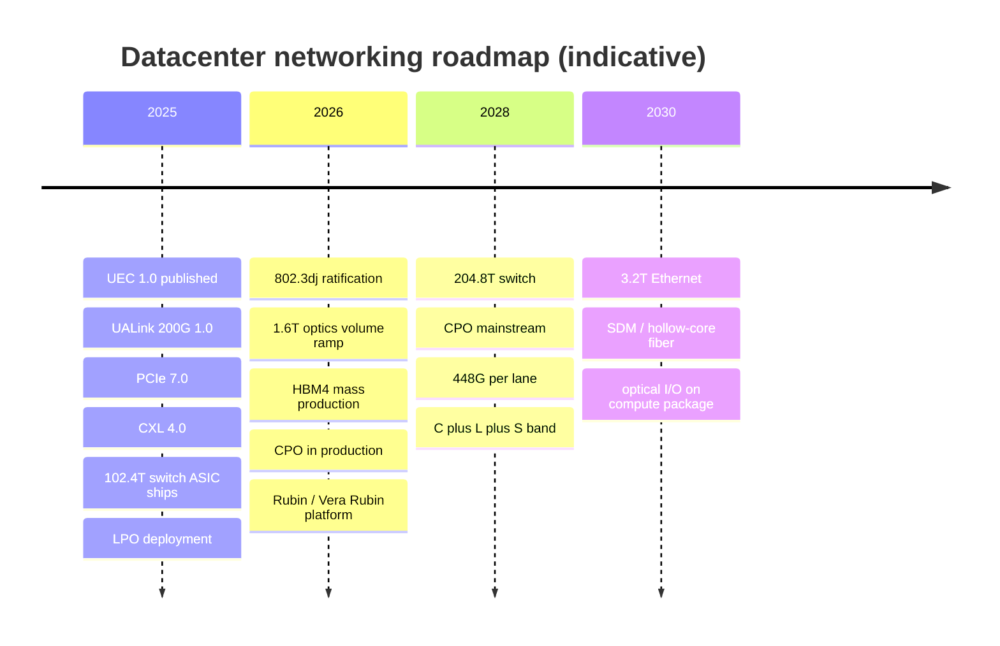
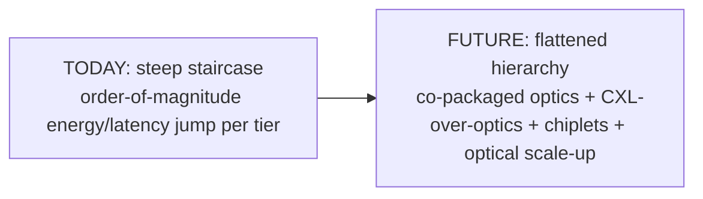

# Future Technology Roadmaps, Emerging Protocols, and the Next Decade of Datacenter Networking

## Introduction: Projecting the Trajectories

Every technology in this database is on a trajectory, and the purpose of this chapter is to project those trajectories into the next decade. The exercise is necessarily speculative, but the trajectories are constrained by physics, economics, and the published roadmaps of the standards bodies and vendors, so informed projection is possible. This chapter examines the futures of electrical interconnect scaling, next-generation coherent optics, switch-ASIC roadmaps, the daunting challenge of 100,000-GPU AI clusters, quantum networking, the post-NVLink scale-up ecosystem (UALink), photonic computing, 6G's datacenter implications, and the evolution of memory-semantic networking. It synthesizes the forward-looking threads woven through every preceding chapter into a coherent picture of where datacenter networking is heading.

## What Has Already Landed (Status as of August 2026)

A forward-looking chapter ages faster than any other, so it is worth stating plainly which of the "future" items in this database have already become present tense. As of August 2026 the following have shipped, published, or closed:

| Item | Status | Detail |
|---|---|---|
| **UEC 1.0** | Published June 2025 (1.0.2 maintenance release, 2026) | ~560-page full-stack specification; first UEC-conformant NICs and switch software in the field |
| **UALink 200G 1.0** | Published April 2025 | 200 Gbps per lane, up to 1,024 accelerators; first switch silicon expected late 2026 |
| **PCIe 7.0** | Final specification released to members June 2025 | 128 GT/s, ~512 GB/s bidirectional at x16; PCIe 8.0 draft circulated to members February 2026 |
| **CXL 4.0** | Released November 2025 | Rides PCIe 7.0's 128 GT/s; bundled ports for ~1.5 TB/s; multi-rack pooling targeted late 2026–2027 |
| **102.4T switch silicon** | Shipping in production volume since 2025 | Broadcom Tomahawk 6, including the CPO variant (TH6-Davisson) |
| **Co-packaged optics** | Production, not pilot | NVIDIA Quantum-X Photonics (InfiniBand) in early 2026; Spectrum-X Photonics Ethernet in 2H 2026 |
| **IEEE 802.3dj (200G/lane, up to 1.6TbE)** | Draft D2.4+, ratification expected during 2026 | 1.6T optics shipping ahead of formal ratification on pre-standard interoperability |
| **HBM4** | Mass production ramping through 2026 | ~2 TB/s per stack at 16-high; ~11 Gbps per pin; logic base die |
| **Scale-up Ethernet** | Standardization underway | OCP **ESUN** workstream launched 2025; Broadcom SUE; UALink; see the new section below |
| **HPE–Juniper** | Closed July 2025 | ~$14B; DOJ settlement required divesting Instant On and licensing Mist AI source |
| **Nokia–Infinera** | Closed February 2025 | ~$2.3B; makes Nokia the number-two optical systems vendor at roughly 20% share |

The pattern worth noting is that the *specification* layer of the open-ecosystem response to NVIDIA (UEC, UALink, ESUN, CXL 4.0) largely completed during 2025, while the *silicon and systems* layer lands across 2026–2027. The intervening period is where the strategic question of this decade — whether open, multi-vendor fabrics can match a vertically integrated one — actually gets answered, and it is being answered now rather than in some indefinite future.

## Electrical Interconnect Scaling Roadmap

*Figure 24.1 — Indicative roadmap, revised August 2026. Items through 2026 are now largely observed rather than projected (see the "What Has Already Landed" section below); medium-term depends on solving known challenges (CPO thermal/laser/yield); post-2030 items are directional and speculative.*

*Figure 24.2 — The unifying theme: flattening the interconnect hierarchy (File 01) by pushing low-energy optical interconnect outward to longer length scales, so the boundaries between chip, package, board, rack, and datacenter progressively dissolve.*

The IEEE 802.3 Ethernet roadmap delivers **1.6 TbE** through the P802.3dj task force (200G per lane; draft D2.4 and later during 2026, with ratification expected within the year and volume 1.6T optics already shipping against pre-standard interoperability), then projects **3.2 TbE (~2028–2030)** and **6.4 TbE (post-2030)**, each roughly doubling on a multi-year cadence — but the pace of Ethernet speed doubling is now slower than the pace of AI compute scaling, tightening the communication bottleneck (File 15). The enabling electrical technology is the **200G-per-lane interface (200GAUI)**, driving 1.6T transceivers, where the SerDes power is severe: roughly 10–15 pJ/bit, or ~2 W per lane, ~16 W for eight lanes *before* the optics — power that makes **LPO or CPO essentially mandatory** at 1.6T and beyond (Files 13, 21).

The next electrical rung is **448G per lane**, the basis of 3.2T optics and the successor to the 224G generation. It moved from paper to demonstration during 2026: at OFC 2026 the OIF's CEI-448G work was shown alongside live 448G-per-channel active copper cables, modulator drivers, and TIAs from multiple suppliers, and TE Connectivity demonstrated 3.2T co-packaged optics. Whether 448G arrives as PAM4 at ~224 GBaud, as a higher-order modulation, or only inside the package (with optics taking over the box-to-box path entirely) is the live engineering argument; the demonstrations to date suggest the electrical channel survives one more doubling, but only over very short reaches and with heavy equalization.

The signaling endgame is constrained: **PAM8** (3 bits/symbol) could in principle push per-lane rates higher (e.g., 600 Gbps at 200 GBaud), but it demands data converters with >6 effective bits at 200 GHz bandwidth and roughly 5× the power of PAM4 — widely judged **impractical**, so the industry is unlikely to adopt it. Higher per-lane rates will instead come from higher baud rates and, ultimately, from **optics**: the **optical-I/O integration timeline** runs through LPO (2025), NPO/CPO pilots (2026–2027), CPO mainstream (2028–2030), and eventually integrated optical fabric with the laser and photonics inside the computing package (post-2030). The electrical interconnect is approaching its limits, and the future is optical.

## Next-Generation Coherent Optical

Coherent optics continues its march:
- **1.6T per wavelength**: 130 Gbaud × PM-64QAM ≈ 1.56 Tbps gross, requiring narrow-linewidth lasers, >130 GHz data converters with >5 ENOB, and advanced (27%-overhead) FEC. This is now shipping rather than pending: **Ciena WaveLogic 6 Extreme** delivers 1.6 Tbps per wavelength in transponder and MOTR module form, and **Nokia's PSE-6** line — now combined with the **ICE7** roadmap Nokia acquired with Infinera (February 2025) — competes directly (File 10).
- **2T+ per wavelength**: PM-256QAM at high baud rate is theoretically possible but demands >30 dB OSNR, feasible only on very short spans or with near-quantum-limited amplification — a research target for 2027–2030.
- **C+L+S band expansion**: adding S-band (via TDFA, File 09) to the C+L bands would extend usable spectrum to ~150 nm, tripling wavelengths versus C-band alone and pushing fiber capacity beyond 300 Tbps per pair; commercial S-band maturity is expected 2026–2028.
- **Hollow-core fiber (HCF)**: light travels in an air core, approaching the speed of light in vacuum (versus ~69% in silica) — a **~30% latency reduction**, plus ultra-low nonlinearity and potentially lower attenuation (0.08 dB/km demonstrated in research). **Corning (which acquired Lumenisity, 2022)** and others are developing HCF; field trials (e.g., a BT/Corning trial in London) are underway. Challenges: low-loss splicing to standard fiber, bend sensitivity, and moisture management. HCF's latency advantage is especially valuable for latency-sensitive trading and distributed AI.
- **Space-Division Multiplexing (SDM)**: multi-core fiber (4–12+ cores) or few-mode fiber with MIMO DSP multiplies capacity by the core/mode count, with crosstalk management and special amplifiers (multi-core EDFA, fan-in/fan-out). Sumitomo, OFS, and YOFC are developing MCF; first commercial SDM is expected ~2027–2030, especially for **submarine**, where SDM optimizes total capacity per watt of repeater power. With C+L expansion and SDM, submarine cables could exceed **1 Pbps per cable**, sustaining the AI-driven doubling of transatlantic capacity every few years (File 12).

## Next-Generation Switch ASIC Roadmap

Switch silicon scales toward:
- **102.4 Tbps (shipping since 2025)**: Broadcom **Tomahawk 6** (128×800G or 64×1.6T, ~5nm, ~800–1000 W) reached production volume in 2025, and the **TH6-Davisson** variant made 102.4 Tbps of *optically enabled* capacity — CPO integrated with the switch package — a shipping product rather than a demonstration. **Tomahawk Ultra** addresses the low-latency, in-network-reduction scale-up niche; NVIDIA's **Spectrum-6** arrives with the Rubin platform, and Marvell's Teralynx line follows.
- **204.8 Tbps (~2027–2028)**: 128×1.6T or 256×800G, ~3nm, with **CPO essentially required** (pluggable density becomes infeasible) — full migration to optical I/O at the package boundary. The 2026 evidence that CPO can ship in volume at 102.4T substantially de-risks this rung, which had been the least certain step in the earlier roadmap.
- **Programmable/fixed convergence**: Broadcom adds programmable-table capability to its SDKs (absorbing P4 concepts) while keeping the efficiency of fixed pipelines; the fully programmable Tofino approach having lost the volume market (File 14).
- **In-network computing evolution**: generalizing SHARP beyond AllReduce — toward in-network MoE routing, attention-related operations, and more complex reductions — with NVIDIA, the Ultra Ethernet Consortium, and UALink switches all pursuing richer in-network compute (Files 07, 15).

## The 100,000-GPU Cluster Challenge

The frontier of AI infrastructure is the **100,000-GPU cluster**, and its networking requirements are staggering. At ~3.2 Tbps per GPU, 100,000 GPUs imply on the order of **320 Pbps of bisection bandwidth** — requiring thousands of high-radix spine switches and tens of thousands of leaf switches in a multi-tier Clos. The **latency** problem is acute: at ~5 µs per hop over ~4 hops, a single collective round-trip is ~20 µs, and a naive ring AllReduce across 100,000 GPUs (latency scaling with N) would take seconds per iteration — infeasible.

The solutions are hierarchical and topological:
- **Hierarchical AllReduce**: reduce within the NVLink scale-up domain first, then across racks via the scale-out fabric — a two-level reduction that drastically cuts the number of cross-fabric hops (File 15).
- **In-network aggregation (SHARP/NVLS)**: eliminating the O(N) ring traversal by reducing in the switches (Files 07, 15).
- **Topology-aware collectives**: mapping tensor parallelism into the high-bandwidth NVLink domain and data parallelism across the fabric.
- **Reconfigurable fabrics**: Google-style OCS (Files 11, 15) reconfiguring topology per collective pattern, potentially cutting effective AllReduce time several-fold versus a static Clos.

The **congestion** problem is equally hard: when 100,000 GPUs finish a forward pass nearly simultaneously and launch AllReduce together, the synchronized burst and RDMA incast at aggregation switches can overwhelm buffers. Mitigations include injection-rate limiting (DCQCN), deliberate jitter (randomizing collective start times to de-synchronize bursts), and priority queuing (isolating collective traffic from storage). Building reliable 100,000-GPU fabrics is the defining networking challenge of the late 2020s, and it is driving every technology in this database to its limits.

## UALink and the Post-NVLink Scale-Up Ecosystem

The **UALink (Ultra Accelerator Link)** consortium — **AMD, Intel, Broadcom, Cisco, Google, HPE, Meta, Microsoft** — is the open industry's answer to NVIDIA's proprietary NVLink for **scale-up** accelerator interconnect. The **UALink 200G 1.0 specification was published in April 2025**: 200 Gbps *per lane*, with lanes grouped into x1, x2, or x4 links and four lanes forming a "Station" carrying up to 800 Gbps in each direction, scaling to a **1,024-accelerator** pod. UALink is **complementary to CXL** in the clean framing (CXL for memory/coherence, UALink for scale-up accelerator mesh) but overlaps at the edges (File 04).

The honest status as of mid-2026 is that the specification is done and the switch silicon is not. Dedicated UALink switch products — from Broadcom and from startups such as Upscale AI — are targeted for **late 2026**, which means the first genuinely open 1,024-accelerator scale-up domains are a 2027 phenomenon. In the meantime, AMD's rack-scale **Helios** system (MI400 series) is the flagship UALink-aligned design, quoted at roughly **3.6 TB/s of scale-up bandwidth per accelerator** across a 72-GPU rack (~260 TB/s at rack level) — bandwidth parity with NVIDIA's contemporaneous NVLink 6 generation, achieved on an open specification. That parity claim, rather than the specification itself, is what makes 2026–2027 the real test of whether the open scale-up ecosystem can hold NVIDIA's pace (Files 15, 23).

## Scale-Up Ethernet: ESUN, SUE, and the Third Standards Front

A development that post-dates most treatments of the scale-up problem is the industry's decision to attack it with **Ethernet** rather than only with purpose-built links. Three efforts now overlap:

- **ESUN (Ethernet for Scale-Up Networking)**, an **Open Compute Project** workstream launched at the 2025 OCP Global Summit by an unusually broad coalition — AMD, Arista, Arm, Broadcom, Cisco, HPE Networking, Marvell, Meta, Microsoft, **NVIDIA**, OpenAI, and Oracle. ESUN's scope is deliberately narrow and therefore credible: L2/L3 Ethernet framing and switching for the *inside-the-pod*, mostly single-hop domain, with lossless and error-resilient delivery, header optimization to cut the per-packet overhead that matters when transfers are small and latency-critical, and multi-vendor interoperability. It explicitly coordinates with IEEE 802.3 and the UEC rather than competing with them.
- **SUE (Scale-Up Ethernet)**, Broadcom's own framing of the same idea, paired with **Tomahawk Ultra** silicon tuned for the low-latency, in-network-reduction workload rather than for raw radix.
- **UALink**, above, which remains the purpose-built alternative.

NVIDIA's participation in ESUN alongside its continued NVLink investment (and its **NVLink Fusion** program, which licenses NVLink to third-party silicon, with partners including Astera Labs) is the strategically interesting fact: the scale-up domain is no longer a single-vendor question, and the incumbent is hedging across both the proprietary and the open path. For the reader tracking the Ethernet-versus-proprietary tension that runs through this database (Files 01, 07, 15), scale-up is now the *third* front, after scale-out and the optical layer — and it is the one where the outcome is least settled.

## Scale-Across: The Multi-Datacenter AI Fabric

Between "scale-up" (inside the pod) and "scale-out" (across the cluster), the industry added a third term during 2025–2026: **scale-across**, meaning the deliberate stitching of geographically separated AI clusters into one training or inference domain. It exists because single-site power, not silicon, has become the binding constraint on cluster size (File 25) — if a campus cannot get another 500 MW, the next increment of scale has to come from another campus.

The technical requirement is unusual: very high bandwidth over tens to hundreds of kilometers, deep buffering to absorb the bandwidth-delay product, line-rate encryption, and enough congestion discipline that a distant collective does not collapse. Two representative products define the category. **Cisco's Silicon One P200** and the **8223** system built on it target exactly this: 51.2 Tbps full-duplex, 64×800G in 3RU, deep buffers, line-rate encryption using post-quantum-resilient key management (a meaningful choice given that AI training runs and their stolen ciphertext both outlive current cryptographic assumptions), silicon root of trust, and — notably — SONiC as the first supported NOS with IOS XR following. **NVIDIA's Spectrum-XGS** addresses the same problem from the fabric side, extending Spectrum-X congestion control across datacenter boundaries.

Scale-across changes what the DCI layer is for (File 12). DCI was historically about replication, backup, and user traffic; it is becoming a component of the training fabric itself, which raises its bandwidth requirements by an order of magnitude and makes its latency and loss characteristics a first-order determinant of training throughput rather than a background concern.

## Photonic Computing and AI Inference

Beyond optical interconnect lies **photonic computing** — performing computation (especially the matrix multiplications at the heart of AI) with light. **Lightmatter's Passage** combines a photonic interconnect with photonic compute, claiming large performance-per-watt advantages for matrix operations and offering an optical mesh between AI accelerators; it has raised substantial funding and partners with TSMC on 3nm. **Celestial AI's** Photonic Fabric targets optical memory-to-compute interconnect, claiming HBM-class bandwidth over optics. Other photonic-compute startups include **Lightelligence, Luminous (acquired by Groq), and Optalysys**. The realistic timeline: optical **interconnect** (CPO, NPO) is a 2–5 year horizon; photonic **computing** for AI inference is a 5–10 year horizon; and a full photonic neural-network processor remains research-stage (2030+). Photonic computing's promise — computation at the speed of light with very low energy per operation — is real, but the engineering challenges (precision, programmability, integration) are formidable.

## Quantum Networking — The Long Horizon

**Quantum networking** is a long-term (5–15+ year) horizon with little near-term datacenter relevance, but worth noting:
- **Quantum Key Distribution (QKD)** uses single photons to exchange cryptographic keys with information-theoretic security, over ~100–300 km (with trusted relays for longer distances). Commercial QKD networks exist in China, Korea, and Japan (Toshiba, ID Quantique, QuantumCTek), but QKD is not relevant to datacenter networking for years.
- **Quantum repeaters** (using entanglement swapping and quantum memory) would extend QKD range and enable a **quantum internet** for distributed quantum computing and quantum-secured communication — a 2035–2040 horizon at the earliest, driven by DARPA, the EU Quantum Flagship, and China's investments. Quantum networking is a fascinating long-term frontier but does not bear materially on the datacenter networking of the next several years.

## 6G and Datacenter Networking Implications

**6G** (ITU IMT-2030, with deployments ~2030–2033, peak radio rates ~1 Tbps) will reshape the telecom edge in ways that intersect with datacenter networking. **6G fronthaul** will require massive optical capacity (100G+ per cell site for massive MIMO), driving optical-transceiver and fiber demand (eCPRI and next-gen fronthaul, O-RAN). **vRAN (virtualized RAN)** and **Open RAN** push cloud-native, datacenter-grade networking and GPU-accelerated baseband processing into the telecom edge cloud, blurring the line between the telecom network and the datacenter. The net effect is a large increase in optical fronthaul deployment and the spread of datacenter networking technology (Ethernet, RDMA, programmable silicon) into the radio-access network — a significant adjacent growth vector for the industry.

## Memory-Semantic Networking Evolution

The CXL trajectory (File 04) extends into the next decade:
- **CXL fabric scaling**: **CXL 4.0 was released in November 2025**, earlier than the ~2027 the previous edition of this chapter projected. It moves the electrical base from PCIe 6.x to **PCIe 7.0 (128 GT/s)**, doubling bandwidth over CXL 3.x while retaining the 256-byte FLIT of the 3.x generation, and adds **bundled ports** that aggregate links for roughly **1.5 TB/s** connections. The stated target is multi-rack memory pooling, with systems expected in the **late 2026–2027** window — so the specification is ahead of the silicon, which remains the persistent pattern of the CXL story (File 04).
- **CXL for accelerator coherence**: future GPUs/TPUs/accelerators adding CXL.mem/CXL.cache for coherent host access without proprietary links, simplifying GPU virtualization and memory management.
- **CXL-attached persistent memory**: byte-addressable persistence (an Optane successor model) for checkpointing and in-memory databases.
- **CXL over optics**: extending CXL beyond the ~few-meter copper limit to 100m–1km via optical links (an OIF working-group effort targeting ~2026 specification), enabling **building-scale disaggregated memory pools** — the ultimate flattening of the interconnect hierarchy (File 01), where memory a hundred meters away is accessed almost as cheaply as local memory.

## Extended Analysis: The Ultra Ethernet Consortium in Depth

The **Ultra Ethernet Consortium (UEC)** deserves deeper treatment as perhaps the single most important open-ecosystem effort for the AI-fabric future. Founded in 2023 under the Linux Foundation by AMD, Arista, Broadcom, Cisco, Meta, Microsoft, and others (and rapidly expanding), the UEC **published its 1.0 specification in June 2025** — a roughly 560-page document covering the full stack from NICs and switches through optics and cables, with a **1.0.2 maintenance revision** following in 2026. The consortium's goal is to deliver a complete, modernized Ethernet stack purpose-built for AI and HPC — closing the gap with InfiniBand while preserving Ethernet's openness, multi-vendor ecosystem, and cost advantages. The UEC's work spans the stack. At the **transport layer**, it defines the Ultra Ethernet Transport (UET), a new transport designed for AI traffic: it supports **multipathing and packet spraying** (spreading a flow's packets across all available paths to defeat the ECMP elephant-flow imbalance, File 17), **out-of-order delivery** with reassembly at the endpoint (so packet spraying does not require in-order delivery), and modern **congestion control** that keeps queues short without the fragility of PFC-dependent DCQCN. It addresses **scalability** to the million-endpoint scale that 100,000-GPU clusters and beyond will require, and it incorporates **in-network collective** capabilities to rival SHARP. The UEC's significance is strategic: it is the open industry's coordinated answer to both InfiniBand and NVIDIA's Spectrum-X, an attempt to make standard, multi-vendor Ethernet "just work" for AI as well as InfiniBand does — and if it succeeds, it would erode NVIDIA's fabric advantage the way open standards have eroded proprietary advantages throughout networking history. Whether the UEC can match InfiniBand's maturity and NVIDIA's vertically integrated optimization, and how quickly, is one of the defining open questions of the late-2020s AI-infrastructure market.

The market evidence through 2026 is that the *Ethernet* half of that question has been answered affirmatively while the *open, multi-vendor* half has not. Ethernet passed InfiniBand in AI back-end networks during 2025 and by the first quarter of 2026 accounted for roughly two-thirds of switch revenue in AI clusters — but a large share of that Ethernet is NVIDIA's own **Spectrum-X**, whose demand now roughly matches NVIDIA's legacy InfiniBand base, and NVIDIA has taken the number-one position in datacenter Ethernet switching by revenue. Ethernet winning is therefore not the same as NVIDIA losing; the fabric standard changed while the vendor concentration did not, at least not yet. The genuinely open UEC deployments — multi-vendor NIC and switch combinations passing UEC conformance — are the metric to watch from here, and they are only now reaching volume.

## Extended Analysis: Optical I/O Inside the Compute Package

The deepest implication of the optical-integration transition (File 13) is the eventual migration of optical I/O **inside the compute package itself** — not just the switch, but the GPU, the CPU, and the accelerator. Today, an accelerator's off-package bandwidth is bounded by the electrical SerDes that drive its NVLink/PCIe/Ethernet interfaces, and as established throughout this database, those electrical interfaces are hitting the power and reach wall. The endgame is to put optical engines on the accelerator package, so that the GPU's scale-up and scale-out links leave the package as light rather than as electrical signals — enabling NVLink-class bandwidth to reach across racks (which copper cannot), dissolving the distinction between the scale-up domain and the scale-out fabric (File 15), and flattening the interconnect hierarchy (File 01) at its innermost levels.

This is the logical culmination of several threads: UCIe-attached optical chiplets (File 05) bringing the optical engine onto the accelerator package; CXL-over-optics (below) extending coherent memory beyond the rack; UALink and NVLink scaling over optical links; and silicon-photonic interconnect (Ayar Labs, Lightmatter, Celestial AI, File 13) providing the dense, low-energy optical I/O. The vision is a datacenter in which the boundaries between chip, package, board, rack, and row progressively dissolve into a single optically interconnected fabric of compute and memory — the "datacenter as a computer" taken to its physical conclusion. The timeline is long (post-2027 for early forms, post-2030 for maturity) and the challenges (laser integration, thermal management, cost, reliability — File 13) are formidable, but the direction is clear, and it represents the deepest restructuring of computer architecture that the AI era is driving.

## Extended Analysis: What Could Disrupt These Roadmaps

Roadmaps are projections, and it is worth enumerating the discontinuities that could disrupt them. **A breakthrough in optical computing** (Lightmatter, Celestial AI, and others) that delivered practical photonic matrix multiplication at scale would reshape the relationship between compute and interconnect, potentially making the network and the computer one optical fabric. **A failure of co-packaged optics** to overcome its thermal/laser/yield challenges (File 13) would prolong the reign of pluggables and LPO and slow the bandwidth roadmap. **A decisive victory of Ethernet/UEC over InfiniBand** (or vice versa) would consolidate the AI-fabric market and reshape the vendor landscape (File 23). **A major shift in AI model architecture** — away from the dense-transformer, synchronous-training paradigm toward, say, more asynchronous or more sparse (MoE-heavy) approaches — would change the communication patterns the fabric must serve, favoring different topologies and collectives. **Geopolitical disruption** of the HBM, advanced-packaging, or transceiver supply chains (Files 05, 21, 23) could constrain the entire AI-hardware buildout. And **a slowdown in AI investment** — the bursting of any AI capital-expenditure bubble — would slacken the demand that currently drives the entire networking roadmap at breakneck pace. The trajectories projected in this chapter are the most likely paths given current physics, economics, and roadmaps, but the AI era has repeatedly demonstrated that the pace and direction of this field can shift faster than any roadmap anticipates, and the prudent reader holds these projections with appropriate humility.

## Extended Analysis: The Flattening of the Interconnect Hierarchy

The single unifying theme of the next decade — and of this entire database — is the **flattening of the interconnect hierarchy** introduced in File 01, and it is worth synthesizing explicitly as the organizing principle of the future. Today, the interconnect hierarchy is a steep staircase: each step outward (die-to-die → on-package → board → rack → datacenter → metro → long-haul) costs roughly an order of magnitude more energy per bit and more latency (File 13's energy-per-bit table). The entire thrust of the emerging technologies in this chapter is to **soften that staircase** — to push high-bandwidth, low-energy interconnect outward to longer length scales so that the boundaries between the levels blur and the datacenter behaves more like a single, tightly coupled machine.

Concretely: **co-packaged optics** (File 13) pushes low-energy optical I/O onto the switch and accelerator package, so that crossing from chip to rack costs less. **CXL over optics** (above) pushes coherent memory access beyond the rack to building scale, so that remote memory behaves more like local memory. **UALink and NVLink over optics** push scale-up-class bandwidth across racks, so that the "node" (the scale-up domain, File 15) grows toward the rack and beyond. **Chiplets and UCIe** (File 05) push the network *inside* the package, so that the chip is itself a network of chiplets. The endpoint of all these trajectories is a datacenter in which the steep staircase of the interconnect hierarchy has flattened into a gentler ramp — where compute, memory, and accelerators are pools connected by optical, low-energy, high-bandwidth fabrics at every scale, composed on demand, with the historical boundaries (chip, package, board, rack, datacenter) progressively dissolved. This is the "datacenter as a computer" taken to its physical conclusion, and it is the deepest restructuring that the AI era is driving. Every emerging technology in this chapter is, in some sense, a step in flattening the hierarchy, and that flattening is the through-line that connects the innermost die-to-die interconnect to the trans-oceanic submarine cable.

## Extended Analysis: The Co-Design Imperative as the Field Matures

A meta-trend that will intensify over the next decade is the **co-design imperative** — the recognition, traced throughout this database, that the highest performance comes not from optimizing each layer independently but from co-designing across layer boundaries. This has already reshaped how AI fabrics are built (the FEC-PFC-ECMP-congestion-control co-design of File 02, the parallelism-topology-collective co-design of File 15, the ASIC-optics co-design of File 13), and it will deepen. As the easy gains from optimizing individual components are exhausted, the remaining performance and efficiency gains lie increasingly at the seams between components — between the GPU and the fabric, between the switch ASIC and the optics, between the training framework and the network topology, between the memory tier and the interconnect.

This co-design imperative has organizational and competitive consequences. It favors **vertically integrated** players who control multiple layers and can co-optimize across them (NVIDIA's GPU-NIC-switch-software stack being the exemplar), and it pressures the **open ecosystem** to achieve co-design across vendor boundaries through standards (the Ultra Ethernet Consortium co-designing the transport, congestion control, and in-network computing; UCIe co-designing the chiplet interface) — a harder coordination problem than a single vertically integrated vendor faces, but one with the offsetting benefits of openness and competition. The tension between vertical-integration-enabled co-design and open-standards-enabled co-design is, in a sense, the deepest version of the proprietary-versus-open theme of this database, and how the industry resolves it — whether co-design at the frontier requires vertical integration, or whether open standards can achieve it across vendor boundaries — will shape not just the technology but the structure of the industry. The maturation of datacenter networking is, increasingly, the maturation of cross-layer co-design, and the players and standards that master it will define the next decade.

## Extended Analysis: Synthesis — The Three Forces Shaping the Decade

Standing back from the individual trajectories, the next decade of datacenter networking will be shaped by the interplay of **three great forces**, and naming them synthesizes the entire database. The first force is **the relentless demand of AI** — the appetite for bandwidth, low latency, scale, and efficiency created by training and serving ever-larger models, which pulls every technology forward at a pace the field has never seen, funds the enormous investment driving the roadmaps, and makes the network a first-order determinant of the economics of the most valuable computing workload in history. This demand is the engine; it is why 800G arrived faster than planned, why co-packaged optics is being rushed forward, why InfiniBand was thrust from niche to center stage, and why the entire field is in ferment.

The second force is **the physics of energy and reach** — the hard limits that bound what the demand can achieve. Electrical signaling hits the power and reach wall (driving optical integration); fiber hits the nonlinear Shannon limit (driving new bands, cores, and fibers); the energy-per-bit hierarchy imposes its order-of-magnitude costs at each boundary (driving the flattening of the hierarchy); and power and cooling increasingly bound the whole enterprise (driving efficiency as a first-order concern). Physics is the constraint that shapes how the demand can be met, and the technologies of this chapter — co-packaged optics, hollow-core fiber, space-division multiplexing, in-network computing, memory disaggregation over optics — are all responses to physical limits, ways of buying more capability within or around the constraints that physics imposes.

The third force is **the contest between proprietary integration and open standards** — the strategic struggle, traced throughout the database, between the performance and integration of vertically owned solutions (NVIDIA's AI fabric, proprietary scale-up, integrated optical systems) and the flexibility, competition, and cost discipline of open, multi-vendor standards (Ethernet/Ultra Ethernet, UALink, CXL, open optical, SONiC). This contest, propelled by the hyperscalers' demand for openness and NVIDIA's drive for integration, will determine not just the technology but the structure of the industry — who captures the value, where the chokepoints are, and how concentrated or open the AI infrastructure stack becomes. The interplay of these three forces — AI's demand as the engine, physics as the constraint, and the proprietary-versus-open contest as the strategic battleground — is the framework within which every specific trajectory of this chapter unfolds, and holding all three in mind is the key to anticipating how the decade will actually develop. The future of datacenter networking is the resolution of the tension among insatiable demand, immovable physics, and the perennial struggle between integration and openness.

## Extended Analysis: Timelines and the Confidence of Prediction

It is useful to close the forward-looking analysis with an explicit **calibration of confidence** across the timelines in this chapter, because not all projections are equally certain, and distinguishing the near-certain from the speculative is itself valuable. The **near-term (2025–2027) projections are high-confidence**, because they rest on published roadmaps and silicon already in development: 1.6T Ethernet (IEEE 802.3dj), 102.4 Tbps switches (Broadcom/Marvell), 1.6T coherent (WaveLogic 6, ICE7), LPO deployment, NPO/early CPO pilots, UALink 1.0 silicon, CXL 3.x products, and HBM4 — these are engineering execution against known plans, and while timing may slip by quarters, the direction and rough timing are reliable. The **medium-term (2027–2030) projections are moderate-confidence**: mainstream CPO, C+L+S band expansion, early space-division multiplexing and hollow-core deployment, 204.8 Tbps switches, CXL over optics, and the maturation of Ultra Ethernet — these depend on overcoming known but unsolved challenges (CPO's laser/thermal/yield problems, SDM's connector and amplifier challenges), so the direction is clear but the timing is genuinely uncertain.

The **long-term (post-2030) projections are low-confidence and genuinely speculative**: practical photonic computing for AI, integrated optical I/O on the compute package at scale, quantum networking, and the full flattening of the interconnect hierarchy into a building-scale optically interconnected fabric — these depend on breakthroughs that may or may not arrive on any predictable schedule, and the prudent reader holds them as plausible directions rather than dependable forecasts. This calibration matters because it guides where to place confidence: an architect planning a 2026 deployment can rely on the near-term roadmap; one reasoning about 2030 should treat the medium-term as directionally reliable but timing-uncertain; and claims about the post-2030 frontier should be held loosely, as the field has repeatedly shown that both breakthroughs and disappointments arrive unpredictably. The honest forward-looking posture — high confidence in the near-term execution roadmap, moderate confidence in the medium-term direction-with-uncertain-timing, and appropriate humility about the speculative long-term frontier — is the right way to read this chapter's projections, and it reflects the reality that the AI era has compressed and disrupted timelines in ways that make confident long-range prediction unwise even as the near-term roadmap has never been more visible or more aggressively funded.

## Conclusion

The next decade of datacenter networking will be defined by a set of converging trajectories: the electrical interconnect approaching its physical limits and yielding to optical I/O (LPO, CPO, integrated photonics); coherent optics scaling to 1.6T+ per wavelength and exploiting C+L+S bands, hollow-core fiber, and space-division multiplexing; switch silicon reaching 100–200 Tbps and requiring co-packaged optics; AI clusters scaling to 100,000+ GPUs and stressing every technology to its limit; the open ecosystem (UALink, Ultra Ethernet, CXL) challenging NVIDIA's proprietary AI fabric; memory disaggregation via CXL extending over optics to building scale; and longer-horizon frontiers in photonic computing, quantum networking, and 6G. The unifying theme is the one this database opened with (File 01): the **flattening of the interconnect hierarchy**, pushing high-bandwidth, low-energy interconnect outward to ever-longer length scales, so that the boundaries between chip, package, board, rack, and datacenter progressively dissolve. The datacenter is becoming a single, disaggregated, optically interconnected computer, and the network is its nervous system. The final chapter examines the constraint that increasingly bounds this entire enterprise: power, cooling, and sustainability.
