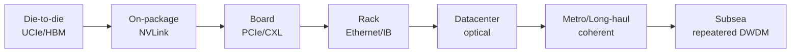

# Glossary of Datacenter Networking Terms and Acronyms

This glossary cross-references the key acronyms and terms used throughout the database, with concise definitions and pointers to the files where each is treated in depth.

## A

**ACS (Access Control Services)** — PCIe mechanism controlling peer-to-peer traffic between endpoints, forcing or permitting routing through the root complex/IOMMU for isolation. (File 03)

**ADC (Analog-to-Digital Converter)** — converts the received analog optical/electrical signal to digital samples for DSP; coherent receivers sample at 100+ GS/s. (File 10)

**AEC (Active Electrical Cable)** — copper cable with embedded retimers/redrivers to extend reach beyond passive DAC. (File 02)

**AIB (Advanced Interface Bus)** — Intel's open parallel die-to-die bus, a UCIe predecessor. (File 05)

**AllReduce** — the dominant collective operation in data-parallel training: every participant's value is reduced (summed) and the result distributed to all. (Files 08, 15)

**APD (Avalanche Photodiode)** — photodetector with internal multiplication gain for higher sensitivity. (File 09)

**ASE (Amplified Spontaneous Emission)** — noise added by optical amplifiers (EDFAs), accumulating over spans and limiting reach. (File 09)

**ASPM (Active State Power Management)** — PCIe link power-saving states (L0s, L1). (File 03)

## B

**BGP (Border Gateway Protocol)** — the routing protocol used as the datacenter underlay (RFC 7938) and for inter-domain internet routing. (Files 02, 16, 19)

**BlueField** — NVIDIA's DPU line (NIC + Arm CPU), offloading infrastructure functions. (Files 07, 19)

**BMP (BGP Monitoring Protocol)** — exports BGP RIB and updates to monitoring stations (RFC 7854). (File 22)

**BoW (Bunch of Wires)** — OCP/ODSA open die-to-die parallel-bus standard. (File 05)

**BTH (Base Transport Header)** — InfiniBand transport header, carried in RoCEv2 packets. (File 08)

## C

**CDC ROADM (Colorless, Directionless, Contentionless)** — fully flexible ROADM architecture. (File 11)

**CLOS / fat-tree** — the dominant datacenter topology with high bisection bandwidth and many equal-cost paths. (File 06)

**CPO (Co-Packaged Optics)** — integrating optical engines into the switch/GPU package to eliminate long electrical SerDes channels; **in production from 2025–2026** (Broadcom TH6-Davisson, NVIDIA Quantum-X and Spectrum-X Photonics). (Files 13, 14, 21)

**CTLE (Continuous-Time Linear Equalizer)** — analog receiver equalizer compensating frequency-dependent channel loss. (Files 02, 06)

**CWDM (Coarse WDM)** — wide-channel-spacing (20 nm) WDM, uncooled lasers, low cost. (File 09)

**CXL (Compute Express Link)** — cache-coherent, memory-semantic interconnect built on PCIe; sub-protocols CXL.io/.cache/.mem; device Types 1/2/3. (File 04)

## D

**DAC (Direct-Attach Copper)** — passive twinax copper cable for short links. (File 02)

**DCBX (Data Center Bridging Exchange)** — protocol negotiating PFC/ETS configuration between link partners. (File 02)

**DCI (Datacenter Interconnect)** — connecting datacenters across campus, metro, regional, and continental distances. (File 12)

**DCQCN (Data Center Quantized Congestion Notification)** — the dominant ECN-based congestion control for RoCEv2. (Files 06, 17)

**DFE (Decision-Feedback Equalizer)** — receiver equalizer canceling post-cursor ISI. (Files 02, 06)

**DPU (Data Processing Unit)** — a NIC with a programmable CPU complex, offloading networking/storage/security. (Files 07, 19)

**DSP (Digital Signal Processor)** — the processing engine in coherent transceivers (and in pluggable DSP modules). (File 10)

**DWDM (Dense WDM)** — tight-channel-spacing (50/100 GHz) WDM for high-capacity transport. (File 09)

## E

**ECMP (Equal-Cost Multi-Path)** — load-balancing across multiple equal-cost paths in a Clos fabric. (Files 02, 06)

**ECN (Explicit Congestion Notification)** — marking packets to signal congestion without dropping them. (Files 02, 06, 17)

**EDFA (Erbium-Doped Fiber Amplifier)** — the workhorse C-band optical amplifier. (File 09)

**EML (Electro-absorption Modulated Laser)** — integrated DFB laser + EAM, dominant in 400G DR4/FR4 transceivers. (File 09)

**EMIB (Embedded Multi-die Interconnect Bridge)** — Intel's silicon-bridge die-to-die packaging. (File 05)

**EVPN (Ethernet VPN)** — BGP-based control plane for VXLAN overlays (RFC 7432). (File 20)

## F

**FEC (Forward Error Correction)** — redundant coding to correct errors without retransmission; RS(528,514), RS(544,514)/KP4, and soft-decision LDPC. (Files 02, 06, 10)

**FLIT (Flow Control Unit)** — fixed-size unit (242 B in PCIe 6.0) enabling inline FEC. (File 03)

**FlexE (Flexible Ethernet)** — OIF shim layer decoupling Ethernet rate from PHY rate. (File 12)

**Foveros** — Intel's 3D die-stacking packaging. (File 05)

## G-H

**GENEVE** — extensible network virtualization encapsulation (RFC 8926). (File 20)

**gNMI (gRPC Network Management Interface)** — modern streaming-telemetry and configuration protocol. (Files 16, 22)

**GPUDirect RDMA** — NIC DMA directly to/from GPU memory, bypassing CPU/host memory. (Files 08, 15)

**HBM (High Bandwidth Memory)** — stacked DRAM with a wide interface via TSV/interposer; 1024-bit through HBM3E, **2048-bit at HBM4** (mass production 2026, ~2 TB/s per stack, logic base die). (File 05)

**HCF (Hollow-Core Fiber)** — fiber guiding light in an air core for lower latency and nonlinearity. (File 24)

**HPCC (High Precision Congestion Control)** — Alibaba's INT-based congestion control. (Files 06, 22)

## I

**INT (In-band Network Telemetry)** — embedding per-hop telemetry into live packets. (File 22)

**iWARP** — RDMA over TCP. (File 08)

**IOMMU** — translates and isolates device DMA addresses (Intel VT-d, AMD IOMMU, Arm SMMU). (File 03)

## L-M

**LACP (Link Aggregation Control Protocol)** — bonds physical links into a logical link (802.3ad). (File 02)

**LCoS (Liquid Crystal on Silicon)** — the spatial light modulator in most WSS/ROADMs. (File 11)

**LPO (Linear Drive Optics)** — pluggable optics without a DSP, relying on the host ASIC's SerDes. (Files 13, 21)

**MACsec (802.1AE)** — Layer 2 hop-by-hop encryption, hardware-accelerated in switch ASICs. (File 19)

**MLD (Multiple Logical Device)** — a CXL Type 3 device partitioned into logical devices for multiple hosts. (File 04)

**MZM (Mach-Zehnder Modulator)** — interferometric optical modulator (LiNbO₃, TFLN, SiPh). (File 09)

## N

**NCCL (NVIDIA Collective Communications Library)** — the collective library for NVIDIA GPUs (ring, tree, NVLS). (Files 08, 15)

**NVLink / NVSwitch** — NVIDIA's proprietary scale-up GPU interconnect and switch. (Files 07, 15)

**NVMe-oF (NVMe over Fabrics)** — NVMe storage protocol over RDMA, TCP, or FC. (Files 08, 18)

**NRZ (Non-Return-to-Zero)** — two-level signaling, 1 bit/symbol. (Files 02, 06)

## O-P

**OCS (Optical Circuit Switch)** — MEMS-based reconfigurable optical switching, deployed by Google in datacenters. (Files 11, 15)

**OTN (Optical Transport Network)** — ITU-T G.709 carrier-grade optical transport framing. (File 12)

**PAM4 (4-level Pulse Amplitude Modulation)** — 2 bits/symbol signaling used at 50G+ per lane; requires FEC. (Files 02, 06)

**PCIe (PCI Express)** — the dominant serial board-level interconnect; Gen 1–7. (File 03)

**PCS (Probabilistic Constellation Shaping)** — shaping QAM symbol probabilities toward Gaussian for ~1–1.5 dB gain. (File 10)

**PFC (Priority Flow Control, 802.1Qbb)** — per-priority pause for lossless Ethernet. (Files 02, 06, 17)

**PMD (Polarization Mode Dispersion)** — differential delay between fiber polarization modes, compensated in coherent DSP. (File 09)

## Q-R

**QP (Queue Pair)** — the RDMA endpoint (send + receive queue). (Files 07, 08)

**RDMA (Remote Direct Memory Access)** — direct memory-to-memory transfer bypassing the CPU/kernel. (File 08)

**ROADM (Reconfigurable Optical Add-Drop Multiplexer)** — wavelength-granular optical routing node. (File 11)

**RoCEv2 (RDMA over Converged Ethernet v2)** — InfiniBand transport over UDP/IP, routable. (Files 06, 08, 17)

## S

**SHARP (Scalable Hierarchical Aggregation and Reduction Protocol)** — InfiniBand in-network reduction. (Files 07, 15)

**SiPh (Silicon Photonics)** — optical components in silicon waveguides; central to CPO. (Files 09, 13)

**SONiC** — Microsoft's open-source Linux-based network OS. (Files 14, 16)

**SR-IOV (Single Root I/O Virtualization)** — PCIe virtualization exposing virtual functions. (File 03)

**SRv6 (Segment Routing over IPv6)** — IPv6 source routing for traffic engineering. (File 20)

## T-U

**TCAM (Ternary Content-Addressable Memory)** — wildcard-match memory for routing/ACLs; power-hungry. (File 14)

**TFLN (Thin-Film Lithium Niobate)** — low-Vπ, high-bandwidth modulator technology. (File 09)

**UALink (Ultra Accelerator Link)** — open scale-up accelerator interconnect standard; the **200G 1.0 specification** was published in April 2025 (200 Gbps per lane, up to 1,024 accelerators). (Files 04, 15, 24)

**UCIe (Universal Chiplet Interconnect Express)** — open die-to-die chiplet interconnect standard. (File 05)

**Ultra Ethernet (UEC)** — consortium modernizing Ethernet for AI/HPC fabrics; **specification 1.0 published June 2025**, revision 1.0.2 in 2026. See also UET. (Files 06, 15, 17, 24)

## V-W-Z

**VOQ (Virtual Output Queuing)** — switch architecture eliminating head-of-line blocking. (File 14)

**VXLAN (Virtual Extensible LAN)** — dominant Layer 2 overlay encapsulation (RFC 7348), 24-bit VNI. (Files 02, 20)

**WSS (Wavelength Selective Switch)** — the core switching component of a ROADM (LCoS or MEMS). (File 11)

**ZR / ZR+** — coherent pluggable optics for DCI (80 km / amplified longer reach). (Files 10, 12)

## Additional Terms

**AOC (Active Optical Cable)** — a permanently terminated optical cable with optics built into both ends, for fixed point-to-point links. (Files 02, 21)

**ASIC (Application-Specific Integrated Circuit)** — a custom chip; here, switch/routing silicon. (File 14)

**BER (Bit Error Rate)** — the fraction of bits received in error; targets ~10⁻¹² post-FEC. (Files 02, 06)

**Baud** — symbols per second; for PAM4, data rate = 2 × baud. (Files 02, 06, 10)

**BDF (Bus:Device:Function)** — the PCIe identifier for a function in the topology. (File 03)

**CoWoS (Chip-on-Wafer-on-Substrate)** — TSMC's 2.5D silicon-interposer packaging. (File 05)

**DCB (Data Center Bridging)** — the set of Ethernet enhancements (PFC, ETS, DCBX) for lossless operation. (File 02)

**DAC (Direct-Attach Copper)** — passive copper cable for short links. (File 02)

**DDR (in InfiniBand)** — Double Data Rate IB generation; (in memory) Double Data Rate DRAM. (Files 05, 07)

**EAM (Electro-Absorption Modulator)** — InP modulator, integrated with a laser as an EML. (File 09)

**ECL (External-Cavity Laser)** — a narrow-linewidth laser used in coherent and DWDM systems. (Files 09, 10)

**ETS (Enhanced Transmission Selection, 802.1Qaz)** — bandwidth allocation among priority classes. (File 02)

**FC (Fibre Channel)** — the enterprise storage-area-network protocol. (File 18)

**FCoE (Fibre Channel over Ethernet)** — FC over Ethernet; limited market adoption. (File 18)

**Foveros** — Intel's 3D die-stacking packaging. (File 05)

**GBaud** — gigabaud; symbols per second in billions. (File 10)

**GPUDirect** — NVIDIA technology for direct NIC-to-GPU-memory DMA. (Files 08, 15)

**HDM (Host-managed Device Memory)** — CXL memory mapped into the host address space; HDM-H and HDM-DB variants. (File 04)

**iSCSI** — SCSI block storage over TCP/IP. (File 18)

**KGD (Known-Good-Die)** — a chiplet tested before assembly to protect package yield. (File 05)

**LD (Logical Device)** — a CXL memory partition assigned to a host. (File 04)

**LDPC (Low-Density Parity-Check)** — a soft-decision FEC code used in coherent optics. (File 10)

**LTSSM (Link Training and Status State Machine)** — the PCIe link state machine. (File 03)

**MFU (Model FLOPS Utilization)** — the fraction of peak FLOPS delivered to useful training. (File 15)

**MPO/MTP** — multi-fiber optical connectors for parallel optics. (File 09)

**MSA (Multi-Source Agreement)** — an industry agreement standardizing a form factor. (File 10)

**NPO (Near-Package Optics)** — optics on the board adjacent to the ASIC, an intermediate step toward CPO. (File 13)

**NVLS (NVLink SHARP)** — in-switch reduction over NVLink. (File 15)

**OCP (Open Compute Project)** — the hyperscaler open-hardware community. (File 01)

**ODSA (Open Domain-Specific Architecture)** — the OCP chiplet effort (BoW). (File 05)

**OIF (Optical Internetworking Forum)** — defines electrical/optical interfaces (CEI, 400ZR, CPO). (File 01)

**OSFP (Octal Small Form-factor Pluggable)** — a high-power transceiver form factor. (File 10)

**OXC (Optical Cross-Connect)** — all-optical switching at fiber/path granularity. (File 11)

**PD (Protection Domain)** — an RDMA isolation boundary. (File 07)

**PIC (Photonic Integrated Circuit)** — integrated optical components on a chip (InP or silicon). (Files 10, 13)

**QSFP-DD (Quad Small Form-factor Pluggable, Double Density)** — the dominant 400G transceiver form factor. (File 10)

**SDM (Space-Division Multiplexing)** — multiplying fiber capacity via multiple cores/modes. (File 24)

**SerDes (Serializer-Deserializer)** — the circuit converting parallel data to/from serial high-speed signaling. (Files 06, 14)

**SOA (Semiconductor Optical Amplifier)** — a chip-scale optical amplifier. (File 09)

**SoIC (System on Integrated Chips)** — TSMC's 3D hybrid-bonding packaging. (File 05)

**SR-IOV (Single Root I/O Virtualization)** — PCIe virtualization exposing virtual functions. (File 03)

**TLP (Transaction Layer Packet)** — the fundamental PCIe transaction unit. (File 03)

**TSV (Through-Silicon Via)** — a vertical interconnect through a die for 3D stacking. (File 05)

**VTEP (VXLAN Tunnel Endpoint)** — the overlay encapsulation/decapsulation point. (Files 02, 20)

**WDM (Wavelength Division Multiplexing)** — carrying multiple wavelengths on one fiber (CWDM, DWDM). (File 09)

**XDR (eXtra Data Rate)** — the ~800G-per-port InfiniBand generation. (File 07)

## Terms Added in the 2026 Update

**448G (per lane)** — the electrical signaling generation after 224G, the basis of 3.2T optics; demonstrated in active copper cables, drivers, and TIAs at OFC 2026, with OIF **CEI-448G** the corresponding interface work. (Files 21, 24)

**800 VDC** — the direct-current rack power distribution architecture adopted to feed AI racks approaching 1 MW, transmitting over 150% more power through the same copper than 415/480 VAC and eliminating conversion stages. (File 25)

**Davisson (TH6-Davisson)** — Broadcom's co-packaged-optics variant of Tomahawk 6; the first shipping switch with 102.4 Tbps of optically enabled capacity. (Files 13, 14)

**ESUN (Ethernet for Scale-Up Networking)** — the OCP workstream defining Ethernet framing and switching for the pod-internal scale-up domain, coordinating with IEEE 802.3 and the UEC. (Files 06, 24)

**Helios** — AMD's UALink-based rack-scale system (MI400 series), quoting ~3.6 TB/s of scale-up bandwidth per accelerator across 72 GPUs. (Files 15, 24)

**Ironwood (TPU v7)** — Google's TPU generation scaling to 256-chip pods and 9,216-chip superpods over optical circuit switching. (Files 11, 15)

**LRO (Linear Receive Optics)** — an intermediate architecture retaining a DSP on the transmit path while running the receive path linear; one point on the pluggable-to-CPO continuum alongside LPO and NPO. (Files 13, 21)

**ML-KEM / ML-DSA / SLH-DSA** — the NIST-standardized post-quantum key-encapsulation and signature algorithms (from CRYSTALS-Kyber, Dilithium, and SPHINCS+ respectively), deployed in hybrid with classical algorithms. (File 19)

**NVLink Fusion** — NVIDIA's program licensing NVLink to third-party silicon, a departure from the fully closed posture of earlier NVLink generations. (Files 07, 15, 24)

**PQC (Post-Quantum Cryptography)** — cryptography resistant to quantum attack; in networking it primarily replaces key establishment rather than bulk encryption, motivated by the "harvest now, decrypt later" threat. (File 19)

**Scale-across** — the joining of geographically separated AI clusters into a single training or inference domain, driven by per-site power limits; served by products such as Cisco's P200/8223 and NVIDIA's Spectrum-XGS. (Files 12, 24)

**SUE (Scale-Up Ethernet)** — Broadcom's scale-up Ethernet framing, paired with Tomahawk Ultra silicon. (Files 06, 14, 24)

**UET (Ultra Ethernet Transport)** — the transport at the center of the UEC 1.0 specification: multipath packet spraying, out-of-order delivery with endpoint reassembly, and congestion control that does not depend on PFC. (Files 06, 17, 24)

**Vera Rubin** — NVIDIA's 2026 platform generation, launched as six co-designed chips: the Vera CPU, Rubin GPU, NVLink 6 Switch, ConnectX-9 SuperNIC, BlueField-4 DPU, and Spectrum-6 Ethernet switch. (Files 07, 15)

## Reference Tables

*Figure 26.1 — Quick-reference view of the interconnect hierarchy that organizes the whole database, from die-to-die to subsea (full detail and energy/latency figures in File 01, Figure 1.1).*

### Interconnect Hierarchy and Energy

| Tier | Span | Energy/bit | Example |
|---|---|---|---|
| Die-to-die | mm | <0.5 pJ | UCIe advanced |
| On-package | cm | ~1–2 pJ | NVLink, HBM |
| Board | 10s cm | ~3–5 pJ | PCIe, CXL |
| Rack/pod | m–10s m | ~5–15 pJ | Ethernet, IB |
| Datacenter | 100s m | ~15 pJ | optical FR/LR |
| Long-haul/subsea | km–1000s km | 100s pJ | coherent DWDM |

### Signaling and Modulation

| Scheme | Bits/symbol | Use |
|---|---|---|
| NRZ | 1 | ≤25G/lane electrical |
| PAM4 | 2 | 50G–200G/lane electrical, direct-detect optics |
| PM-QPSK | 4 (×2 pol) | long-haul coherent |
| PM-16QAM | 8 | 400G coherent, metro/regional |
| PM-64QAM | 12 | 800G coherent, short reach |

### Ethernet/InfiniBand Speed Correspondence

| Per-lane | Ethernet (4–8 lanes) | InfiniBand (4×) |
|---|---|---|
| 25G NRZ | 100G (4×) | EDR 100G |
| 50G PAM4 | 200G/400G | HDR 200G |
| 100G PAM4 | 400G/800G | NDR 400G |
| 200G PAM4 | 800G/1.6T | XDR 800G |

---

*This glossary is a quick reference; each term is developed in full in the file(s) noted. The reference tables above summarize the interconnect-hierarchy energy costs, the signaling/modulation schemes, and the Ethernet/InfiniBand speed correspondence that recur throughout the database. For a future revision, consider adding a complete alphabetical index and a fuller units/notation appendix.*

## Notation and Conventions Used Throughout

For clarity, the database uses the following conventions consistently. **Data rates** are quoted in bits per second with SI prefixes (Gbps = gigabits/second, Tbps = terabits/second), while **byte-oriented bandwidths** (memory, PCIe payload) use bytes (GB/s = gigabytes/second); the distinction matters because a factor of eight separates them — a PCIe 5.0 x16 link at ~63 GB/s corresponds to ~504 Gbps. **Signaling rates** are quoted in GT/s (gigatransfers/second) for PCIe and in Gbps per lane for SerDes, with the usable data rate lower after encoding/FEC overhead. **Latency** is quoted in nanoseconds (ns) for on-chip, die-to-die, and switch-internal figures, in microseconds (µs) for fabric and RDMA figures, and in milliseconds (ms) for long-haul and reconfiguration figures. **Energy** is quoted in picojoules per bit (pJ/bit), the standard figure of merit for interconnect efficiency. **Reach** is quoted in meters (m) and kilometers (km). **Optical wavelengths** are in nanometers (nm), and **optical channel spacing** in gigahertz (GHz) or nm. **Modulation orders** (QAM) and **bits per symbol** follow the conventions of Files 09 and 10, with dual-polarization (PM-) formats carrying twice the single-polarization bits per symbol.

Vendor names, product names, and specific figures (speeds, dates, market shares, capacities) reflect the state of the field in the mid-2020s and the roadmaps current at the time of writing; the rapidly evolving nature of the field — especially product roadmaps and market shares — means these specifics should be verified against primary sources for any time-sensitive use. The structural relationships, architectural principles, physics, and competitive dynamics described throughout are more durable than the specific numbers, and they are the database's primary contribution: a coherent, cross-referenced framework for understanding datacenter networking from the die to the ocean floor, organized around the recurring themes — the energy hierarchy, cross-layer co-design, proprietary-versus-open, losslessness, disaggregation, and AI economic leverage — that the overview (File 01) introduced and that every chapter develops. The reader who internalizes those themes and the relationships among the layers will find the framework far outlasts any individual figure within it.
