# 27. 全库简体中文翻译（Full Repository Translation — Simplified Chinese）

本节是本知识库（Datacenter Networking Technology Knowledge Database）全部内容的完整简体中文翻译，逐章对照原始英文文件编排。翻译力求精确、完整，不做删减或摘要；每一节标题下均附有指向对应英文原始 Markdown 文件的链接，便于交叉核对。

**翻译说明与术语约定：**

- 协议、标准、产品与公司名称（如 PCIe、CXL、UCIe、RDMA、RoCE、InfiniBand、Ethernet、NVLink、NVIDIA、Broadcom、Cisco 等）保留英文原文，不做音译，这是中文技术写作的通行惯例。
- 已有通行中文技术译法的术语（如"交换机"对应 switch、"带宽"对应 bandwidth、"时延/延迟"对应 latency、"拥塞控制"对应 congestion control 等）采用标准中文译法，必要时在首次出现处以英文缩写加注。
- 表格、列表、代码块、Mermaid 图表及所有 Markdown 结构均与原文保持一致；内部链接的显示文字已译为中文，但链接目标（文件路径）保持不变，以确保仍指向仓库中的正确文件。
- 数字、单位、日期、金额及产品型号均按原文准确保留。
- 第 26 章《术语表》中的词条标题（英文缩写及展开）保留英文原文，仅译文定义部分译为中文，以便作为查阅索引使用。

**关于版本状态：** 与全库其余部分一致，本翻译反映知识库最近一次更新时的内容状态；如需读取最新的权威版本，请始终以对应的英文原始文件为准。

<a id="目录--table-of-contents"></a>
## 目录 / Table of Contents

1. [数据中心网络技术知识库](#sec-27-1) — 对照原文: [README.md](README.md)
2. [数据中心网络——概述、规模与战略背景](#sec-27-2) — 对照原文: [01_overview_and_strategic_context.md](01_overview_and_strategic_context.md)
3. [OSI模型、协议栈与数据中心网络分层](#sec-27-3) — 对照原文: [02_osi_model_and_datacenter_protocol_stack.md](02_osi_model_and_datacenter_protocol_stack.md)
4. [PCIe——架构、代际演进、协议深度解析与路线图](#sec-27-4) — 对照原文: [03_pcie_deep_dive.md](03_pcie_deep_dive.md)
5. [CXL(Compute Express Link)——架构、协议、内存语义与路线图](#sec-27-5) — 对照原文: [04_cxl_deep_dive.md](04_cxl_deep_dive.md)
6. [UCIe、Die-to-Die 互连与芯粒生态系统](#sec-27-6) — 对照原文: [05_ucie_and_die_to_die_interconnects.md](05_ucie_and_die_to_die_interconnects.md)
7. [数据中心以太网——速率、标准、架构与演进](#sec-27-7) — 对照原文: [06_ethernet_fundamentals_and_datacenter.md](06_ethernet_fundamentals_and_datacenter.md)
8. [InfiniBand — 架构、代际演进、RDMA、AI 网络结构与技术路线图](#sec-27-8) — 对照原文: [07_infiniband_deep_dive.md](07_infiniband_deep_dive.md)
9. [RDMA、RoCE、iWARP 与高性能传输协议](#sec-27-9) — 对照原文: [08_rdma_and_roce.md](08_rdma_and_roce.md)
10. [光网络基础 —— 物理原理、组件与技术](#sec-27-10) — 对照原文: [09_optical_networking_fundamentals.md](09_optical_networking_fundamentals.md)
11. [相干光、收发器与可插拔生态系统](#sec-27-11) — 对照原文: [10_coherent_optical_and_transceiver_ecosystem.md](10_coherent_optical_and_transceiver_ecosystem.md)
12. [光交换、ROADM架构与可重构网络](#sec-27-12) — 对照原文: [11_optical_switching_and_roadm.md](11_optical_switching_and_roadm.md)
13. [数据中心互联(DCI)、都会网络、长途网络与海底光缆](#sec-27-13) — 对照原文: [12_datacenter_interconnect_and_subsea.md](12_datacenter_interconnect_and_subsea.md)
14. [共封装光学(CPO)、线性驱动光学(LPO)与光学集成的未来](#sec-27-14) — 对照原文: [13_co_packaged_optics_and_lpo.md](13_co_packaged_optics_and_lpo.md)
15. [网络交换ASIC——架构、厂商与AI网络](#sec-27-15) — 对照原文: [14_network_switching_asics.md](14_network_switching_asics.md)
16. [AI/ML与HPC网络——网络结构、集合通信与Scale-Up/Scale-Out架构](#sec-27-16) — 对照原文: [15_ai_networking_and_hpc_fabric.md](15_ai_networking_and_hpc_fabric.md)
17. [网络操作系统、SDN与可编程性](#sec-27-17) — 对照原文: [16_network_os_sdn_and_programmability.md](16_network_os_sdn_and_programmability.md)
18. [构建无损 RoCEv2 AI 网络——架构、调优与运维](#sec-27-18) — 对照原文: [17_roce_and_lossless_fabric_deployment.md](17_roce_and_lossless_fabric_deployment.md)
19. [存储网络——FC、NVMe-oF 与分布式存储网络](#sec-27-19) — 对照原文: [18_storage_networking.md](18_storage_networking.md)
20. [数据中心网络安全、微分段与零信任](#sec-27-20) — 对照原文: [19_network_security_and_zero_trust.md](19_network_security_and_zero_trust.md)
21. [网络虚拟化、覆盖网络与云网络](#sec-27-21) — 对照原文: [20_network_virtualization_and_overlay.md](20_network_virtualization_and_overlay.md)
22. [光收发器市场——400G、800G 与 1.6T 的技术与竞争格局](#sec-27-22) — 对照原文: [21_400g_800g_1pt6t_transceiver_market.md](21_400g_800g_1pt6t_transceiver_market.md)
23. [网络遥测、可观测性与 AIOps](#sec-27-23) — 对照原文: [22_network_telemetry_and_observability.md](22_network_telemetry_and_observability.md)
24. [数据中心网络供应商格局——深度竞争分析](#sec-27-24) — 对照原文: [23_vendor_landscape_and_competitive_analysis.md](23_vendor_landscape_and_competitive_analysis.md)
25. [未来技术路线图、新兴协议与数据中心网络的下一个十年](#sec-27-25) — 对照原文: [24_future_roadmaps_and_emerging_technologies.md](24_future_roadmaps_and_emerging_technologies.md)
26. [数据中心网络中的电力、散热与可持续性](#sec-27-26) — 对照原文: [25_sustainability_power_and_cooling.md](25_sustainability_power_and_cooling.md)
27. [数据中心网络术语与缩略语词汇表](#sec-27-27) — 对照原文: [26_glossary.md](26_glossary.md)

---


<a id="sec-27-1"></a>
## 27.1 数据中心网络技术知识库

**中文翻译，原文见:** [README.md](README.md)

---

### 数据中心网络技术知识库

一个结构化、深入的数据中心网络知识库，涵盖完整的互连层级体系——从芯片级裸片间互连(UCIe、HBM)，经过板级互连架构(PCIe、CXL)，到机架级和舱位级网络(Ethernet、InfiniBand、RDMA)、光层(相干光学、ROADM、DCI、海底光缆、共封装光学)、交换芯片与AI网络架构，以及界定整个领域的供应商格局、未来路线图和可持续性约束。

#### 执行摘要

数据中心网络已经从支撑性的基础设施转变为决定性能与经济效益的一级因素，这首先是由AI和HPC工作负载的兴起所驱动的：这些工作负载所需的同步、多对多、对时延高度敏感的集合通信，要求无损、超低时延、超高带宽的网络架构。本知识库将整个互连层级体系作为一个统一的主题来处理，因为在AI时代，它实际上已经成为了一个整体：一次训练步骤会触及每一层——从HBM连接的GPU内存，到节点内的NVLink，到节点间的InfiniBand或RoCE，再到跨地域的光DCI。孤立地理解任何一层都已不再足够。

本知识库的组织方式是从内到外、从物理层到战略层的递进式展开。它从战略背景和协议栈开始，深入到芯片级互连(PCIe、CXL、UCIe)，再上升到机架级网络架构(Ethernet、InfiniBand、RDMA)，深入探讨光层(基础原理、相干光、光交换、DCI、共封装光学)，考察交换芯片以及整合一切的AI网络架构，最后以运维实践(网络操作系统、无损网络部署、存储、安全、虚拟化、遥测)、光模块市场、供应商格局、未来路线图以及功耗与可持续性约束作为收尾。

贯穿全书反复出现的是一组结构性张力：以太网与InfiniBand在AI领域的竞争；电互连与光互连的竞争；商用芯片与定制ASIC的竞争；以及专有标准与开放标准的竞争(NVLink对UALink、InfiniBand对Ethernet、集成式光系统对解耦式开放线路系统)。这些张力是底层技术演进轨迹在竞争与战略层面的体现，追溯这些张力是本知识库的组织主题之一。

本书的目标读者涵盖工程师、架构师、产品与战略从业者，以及具备技术背景的投资者，他们需要一份关于数据中心网络技术的、连贯、深入、相互交叉引用的参考资料——一份能将调制器的物理原理与超大规模运营商网络架构的经济效益联系起来、将交换机ASIC的架构与其制造企业的战略联系起来的资料。

#### 目录

1. **[概述与战略背景](01_overview_and_strategic_context.md)** — 数据中心网络所涵盖的内容、AI拐点、超大规模网络的规模、互连层级体系、标准组织、市场规模，以及关键技术张力。
2. **[OSI模型与数据中心协议栈](02_osi_model_and_datacenter_protocol_stack.md)** — 逐层展开的协议栈，包含数据中心专属实现，以及各层如何协同设计以构建无损AI网络；叠加网络(VXLAN、GENEVE)。
3. **[PCIe深度解析](03_pcie_deep_dive.md)** ⭐ — PCIe架构、第1代至第7代、三层协议栈、电源管理、数据中心中的角色与瓶颈，以及生态系统。
4. **[CXL深度解析](04_cxl_deep_dive.md)** ⭐ — Compute Express Link：起源、三个子协议、设备类型、内存池化与交换、Fabric/点对点(3.0/3.1)、竞争格局，以及软件栈。
5. **[UCIe与裸片间互连](05_ucie_and_die_to_die_interconnects.md)** ⭐ — Chiplet与裸片间互连的必要性、UCIe、各类专有互连架构(EMIB、Foveros、Infinity Fabric、NVLink-C2C、CoWoS、SoIC)，以及HBM。
6. **[以太网基础与数据中心](06_ethernet_fundamentals_and_datacenter.md)** ⭐ — 以太网历史、完整的速率标准家族(100G–1.6T)、物理层、数据中心拓扑，以及拥塞管理(PFC、DCQCN、HPCC、Swift、Ultra Ethernet)。
7. **[InfiniBand深度解析](07_infiniband_deep_dive.md)** ⭐ — InfiniBand历史与Mellanox收购案、各代产品、架构、NVIDIA AI网络产品，以及InfiniBand与Ethernet的对比。
8. **[RDMA与RoCE](08_rdma_and_roce.md)** — RDMA基础、RoCE/iWARP/Soft-RoCE、编程模型、MPI与集合通信、NVMe-oF，以及RoCEv2部署。
9. **[光网络基础](09_optical_networking_fundamentals.md)** ⭐ — 光在光纤中的物理原理、光纤类型、放大器、调制器、接收器，以及WDM。
10. **[相干光与光模块生态系统](10_coherent_optical_and_transceiver_ecosystem.md)** ⭐ — 相干DSP、调制格式、FEC、外形规格与MSA、ZR/ZR+、DSP供应商，以及开放光网络。
11. **[光交换与ROADM](11_optical_switching_and_roadm.md)** — ROADM、WSS、OXC、OCS、硅光交换机，以及供应商。
12. **[DCI、城域网、长途网与海底光缆](12_datacenter_interconnect_and_subsea.md)** — DCI覆盖范围连续谱、OTN、FlexE、城域/长途DWDM，以及海底光缆系统。
13. **[共封装光学与LPO](13_co_packaged_optics_and_lpo.md)** ⭐ — 带宽-功耗危机、LPO、CPO架构与光学引擎、激光器挑战、产品，以及面临的挑战。
14. **[网络交换芯片](14_network_switching_asics.md)** ⭐ — 交换芯片架构(交换网络、流量管理、流水线、TCAM、SerDes)与各供应商产品组合。
15. **[AI网络与HPC网络架构](15_ai_networking_and_hpc_fabric.md)** ⭐ — 训练通信模式、纵向扩展与横向扩展、NVIDIA/AMD/Intel/Google/Meta各家架构，以及集合通信算法。
16. **[网络操作系统、SDN与可编程性](16_network_os_sdn_and_programmability.md)** — 传统与开放网络操作系统、SDN、意图驱动网络、P4、gNMI/OpenConfig，以及验证。
17. **[无损RoCEv2网络部署](17_roce_and_lossless_fabric_deployment.md)** — 设计与调优无损AI网络架构(PFC、ECN、DCQCN、ECMP)的运维实践，以及InfiniBand运维。
18. **[存储网络](18_storage_networking.md)** — Fibre Channel、iSCSI、NVMe-oF、分布式存储，以及可组合解耦式基础设施。
19. **[网络安全与零信任](19_network_security_and_zero_trust.md)** — 零信任、微分段、DDoS、MACsec/IPsec、DPU安全卸载、BGP安全，以及供应链安全。
20. **[网络虚拟化与叠加网络](20_network_virtualization_and_overlay.md)** — VXLAN/EVPN、GENEVE、SRv6/MPLS、NSX、eBPF/XDP，以及Kubernetes CNI。
21. **[400G/800G/1.6T光模块市场](21_400g_800g_1pt6t_transceiver_market.md)** — 按速率代际划分的光模块市场、供应商格局，以及技术趋势。
22. **[网络遥测与可观测性](22_network_telemetry_and_observability.md)** — INT、流式遥测、sFlow/IPFIX、BMP、AIOps，以及eBPF可观测性。
23. **[供应商格局与竞争分析](23_vendor_landscape_and_competitive_analysis.md)** ⭐ — 对Cisco、Arista、Juniper、NVIDIA、Broadcom、Marvell、Ciena、Nokia、Infinera、Lumentum和Coherent的深度剖析，以及市场份额总览。
24. **[未来路线图与新兴技术](24_future_roadmaps_and_emerging_technologies.md)** ⭐ — 电互连扩展、下一代相干光、交换芯片路线图、10万GPU挑战、UALink、光子计算、量子技术、6G，以及内存语义网络。
25. **[可持续性、功耗与冷却](25_sustainability_power_and_cooling.md)** — 网络的功耗占比、AI带来的功耗攀升、CPO/LPO节能效果、液冷、供电、碳排放，以及能效指标。
26. **[术语表](26_glossary.md)** — 交叉引用的缩略语与术语。

(⭐表示核心、深度最大的章节。)

#### 如何导览本书

**对于新读者**，建议的阅读顺序如下：
1. 从**第01篇**(战略背景)和**第02篇**(协议栈)开始，建立概念地图。
2. 阅读**第09篇**(光学基础)以了解后续大部分内容所依赖的物理背景。
3. 阅读**第06篇**(以太网)和**第07篇**(InfiniBand)以了解两大机架级网络架构家族，然后阅读**第08篇**(RDMA)以了解其底层传输机制。
4. 阅读**第15篇**(AI网络)，这是将各类网络架构整合到AI应用场景中的综合性章节。
5. 再深入到感兴趣的领域：芯片级(第03–05篇)、光学深度内容(第10–13篇)、芯片(第14篇)、运维(第16–22篇)，以及战略/未来(第23–25篇)。

**若要深入了解某项具体技术**，可直接阅读对应章节；每章都与相关章节相互交叉引用。

**若要了解竞争与战略全貌**，建议将第01、15、23和24篇一起阅读。

#### 方法论与状态说明

本知识库整合了截至最近一次更新时公开可得的数据中心网络技术知识，并将其组织为一份连贯、相互交叉引用的参考资料。它强调技术深度和路线图细节，倾向于使用完整的叙述性文字配合表格和详细阐述，而非简单的要点罗列。具体数字(速率、日期、市场份额、产品细节)反映的是2020年代中期该领域的状态，以及当时已发布的路线图；读者应就快速变化的具体信息(尤其是产品路线图和市场份额)与一手资料进行核实。

**最近更新时间：** 2026-06-24

**正在考虑中的未来补充内容：** 扩展的独立索引、单位/符号说明附录、更深入的详细实例与案例研究，以及随着该领域的发展对路线图和市场份额数据进行的定期更新。

[↑ 返回目录 / Back to Table of Contents](#目录--table-of-contents)

---

<a id="sec-27-2"></a>
## 27.2 数据中心网络——概述、规模与战略背景

**中文翻译，原文见:** [01_overview_and_strategic_context.md](01_overview_and_strategic_context.md)

---

### 数据中心网络——概述、规模与战略背景

#### 数据中心网络所涵盖的内容

数据中心网络是一门在各种物理距离尺度上、在计算元件之间传递信息的学科，从相邻硅裸片上相隔仅数微米的晶体管，到相隔数千公里海底光纤的数据机房，无所不包。人们很容易把"网络"想象成机架安装的交换机以及机架之间的线缆，但这种看法早已过时数十年。更准确的理解是，现代数据中心网络是一个连续的互连层级体系，其中同一个基本工程问题——以最高带宽、最低时延、最低单比特能耗和可接受的成本，将比特从A点移动到B点——在每一个长度尺度上反复出现，每个尺度都有各自主导的物理原理、主导的协议和主导的供应商。

在最短的长度尺度上，**裸片间互连(die-to-die interconnect)**在共封装于同一基板上的多个chiplet之间传输数据。这里的传输介质是微观尺度的铜凸点或混合键合铜焊盘，距离在亚毫米到几毫米之间，相关标准包括UCIe(Universal Chiplet Interconnect Express，通用chiplet互连高速通道)、HBM(High Bandwidth Memory，高带宽内存)接口，以及一系列专有互连架构，如Intel的EMIB和Foveros、AMD的Infinity Fabric、NVIDIA的NVLink-C2C，以及台积电的CoWoS和SoIC封装技术。这里的能耗预算极其紧张——低于每比特1皮焦耳(picojoule)——带宽密度可达每毫米接口边缘数十太比特每秒。

再往外一步，**芯片间的封装内和板级互连**在印刷电路板上的完整封装之间，或服务器内的插槽之间传输数据。PCIe(Peripheral Component Interconnect Express)及其缓存一致性超集CXL(Compute Express Link)主导着CPU到设备的通路；NVLink及其交换式网络NVSwitch主导着加速器节点内GPU到GPU的通路；而新兴的开放标准，如UALink(Ultra Accelerator Link)，则致力于打破NVIDIA在纵向扩展加速器网络上的专有垄断。

在**机架和舱位(pod)尺度**上，两大竞争阵营相互角力：以太网(Ethernet)，这种通用的尽力而为(best-effort)分组网络几乎征服了它所进入的每一个网络领域；以及InfiniBand，这种基于信用(credit-based)的无损、RDMA原生网络架构，长期主导着高性能计算领域，直到最近也一直主导着AI训练集群。在机架之间以及跨数据中心，网络几乎普遍采用由leaf交换机和spine交换机构成的Clos(胖树)拓扑，而在最大规模的AI网络架构中，这种拓扑正日益被光电路交换所补充。

在**园区、城域和长途尺度**上，传输介质变为光纤，技术变为相干光传输、波分复用(WDM，wavelength division multiplexing)、可重构光分插复用器(ROADM，reconfigurable optical add-drop multiplexer)——以及在数据中心互连(DCI，datacenter interconnect)方面——可插拔相干光模块，如400G-ZR和800G-ZR+。最后，在**行星尺度**上，每隔40至80公里配置光中继器的海底光缆承载着连接全球云网络的洲际流量，如今超大规模运营商甚至开始拥有整套私有海底光缆系统。

本知识库将所有这些内容作为一个统一主题来处理，因为它们正日益融合为一体。对大语言模型进行微调的AI工作负载，在单次训练步骤中会触及所有这些层级：梯度在HBM连接的GPU内存中计算，在节点内通过NVLink规约，在节点间通过InfiniBand或RoCE聚合，通过NVMe-over-Fabrics检查点存储到解耦式存储，而对于地理分布式训练而言，还要通过跨越城域和长途光系统的DCI链路进行同步。孤立地理解任何一层都已不再足够。

#### 为什么现在如此重要：AI网络拐点

大约三十年来，数据中心流量一直由网络架构师所称的**南北向(north-south)**流量主导：互联网上某处的客户端发起请求，请求经由负载均衡器进入数据中心，命中Web层，Web层查询应用层，应用层查询数据库，响应再原路返回。南北向流量的典型特征是：每台服务器的聚合带宽相对较低、具有突发性、在毫秒级时延上具有容忍度，而且关键是能够容忍丢包，因为TCP传输层正是为了从偶发丢包中优雅恢复而设计的。

云计算时代将平衡向**东西向(east-west)**流量倾斜：这是数据中心内部服务器与服务器之间的通信，由分布式数据库、微服务网格、MapReduce式分析以及分布式存储所驱动。多年来，东西向流量的增长速度快于南北向流量，这正是业界放弃旧有的三层接入/汇聚/核心拓扑(该拓扑针对流量进出互联网做了优化)、转而采用扁平化、高对分带宽(bisection bandwidth)的Clos网络架构(该架构针对任意服务器间的通信做了优化)的原因。

AI和HPC工作负载已将这种转变推向了一个质变的新阶段。分布式深度神经网络训练的特征是**多对多(all-to-all)**和**全规约(all-reduce)**集合通信模式：在每个训练微步骤结束时，每个加速器都必须与参与相关并行维度的每个其他加速器交换梯度或激活数据。这种流量不仅仅是东西向的；它是**同步的、突发的、带宽需求巨大的，且对时延极度敏感**。当1024个GPU几乎在同一时刻完成一次前向-反向传播，并同时发起一次AllReduce操作时，网络会经历一次协同的突发流量，这种流量可能瞬间要求网络架构的全部对分带宽。任何尾部时延——单条慢速链路、单个拥塞的交换机缓冲区、单个触发RDMA(Remote Direct Memory Access，远程直接内存访问)重传的丢包——都不仅会拖慢一条流，还会拖慢整个集合通信操作，因为集合通信操作只有等到最慢的参与者完成才能完成。在同步数据并行训练任务中，GPU会闲置等待网络，而每颗价值数万美元的GPU闲置，是现代数据中心中代价最为高昂的单一故障模式。

这正是为什么曾经小众的三项技术，对AI基础设施而言变成了生死攸关的存在：

- **RDMA(远程直接内存访问)**在不涉及任何一方CPU的情况下，直接在两台机器的内存之间传输数据，绕过内核网络协议栈，消除数据拷贝，将小消息时延从数十微秒(经典TCP套接字)降低到不足一微秒。RDMA正是使GPU的网卡能够将梯度数据直接写入远程GPU内存的技术。

- **无损网络架构**确保网络不会因拥塞而丢包，因为RDMA的可靠连接传输(reliable-connection transport)在从丢包中恢复时，代价远高于TCP——单次丢包可能迫使从最后一个已确认的序列号开始重传，严重拖累吞吐量。InfiniBand通过基于信用的流控原生实现无损；以太网则通过优先级流控(PFC，Priority Flow Control)加上拥塞控制算法(如DCQCN)来实现无损。

- **超低且高度可预测的时延**之所以重要，是因为集合通信操作本质上是屏障(barrier)：决定训练吞吐量的是时延分布的尾部，而非均值。对于同步训练而言，一个平均值良好但P99.9尾部很长的网络架构，反而不如一个平均值稍差但尾部紧凑的网络架构。

其结果是，长期被视为基础配套设施的网络，已经成为决定AI集群性能和经济效益的一级因素。NVIDIA在2020年以69亿美元收购Mellanox一事，回过头看，堪称半导体史上最具战略远见的举措之一：它使NVIDIA同时掌控了AI训练所需的计算(GPU)和互连(InfiniBand、ConnectX网卡、Quantum交换机、BlueField DPU)，如今这已成为一条与GPU需求同步增长、价值数十亿美元的收入来源。

#### 现代数据中心网络的规模

超大规模网络所涉及的数字规模，令人难以直观把握。一家大型超大规模运营商在其全球机队中运营的交换机端口数量级达到**数百万**，通过**数千万个光模块**和**数百万公里的光纤**互连在一起。单个大型数据中心楼宇内部的聚合内部带宽以**每秒拍比特(petabits)**计量；Google公开描述的Jupiter数据中心网络架构显示，单代建筑内的对分带宽超过每秒6拍比特，而后续各代产品的这一数字还在继续增长。

为了让这一点更加具体，可以考虑一个超大规模Clos网络架构的拓扑结构。一个现代leaf-spine舱位可能使用51.2太比特每秒的交换芯片，配置为64个800G端口或128个400G端口。由这类交换机构建的、超订阅比为1:1(适用于AI工作负载)的无阻塞两层Clos架构，可以在一个舱位内以全带宽互连数千台服务器。将多个舱位堆叠成带有超级spine层的三层Clos架构，可以将这一规模扩展到数十万个端点。当端点是GPU而非通用服务器时——而且当每颗GPU所需的网络带宽是400到800吉比特每秒，而非通用计算服务器典型的25到100吉比特每秒时——带宽需求还要再上一个数量级。

各大超大规模运营商都在以行星尺度追求这一目标，但各自采用了不同的架构理念：

- **Google**率先开创了商用芯片与定制芯片相结合的混合路线，自研交换芯片并构建Jupiter网络架构，并且是首家在生产数据中心中大规模部署光电路交换(OCS，optical circuit switching)的公司，使用基于MEMS的光交换机来动态重构拓扑。Google的TPU舱位采用带有光链路的3D环面(torus)互连，这与通用计算所使用的Clos网络架构截然不同。

- **Meta**在其协助创立的开放计算项目(OCP，Open Compute Project)硬件基础上构建了大部分基础设施，部署基于Broadcom芯片的交换机(Wedge、Minipack)以及大规模的RoCEv2以太网AI网络架构，同时也为其最大规模的GPU部署运营着相当规模的InfiniBand集群。Meta已公开表示其AI基础设施规模达到约35万颗H100 GPU的量级。

- **Microsoft**开源了SONiC(Software for Open Networking in the Cloud)，这一基于Linux的网络操作系统如今已在业界广泛使用，并为OpenAI合作项目运营着基于NVIDIA的大规模AI网络架构(包括Spectrum-X以太网)，同时配备自研网卡(Azure Boost、MANA)。

- **Amazon AWS**构建了超大规模运营商中最激进的定制化基础设施，包括Nitro系统(将网络、存储和安全功能卸载到定制芯片)、自研的Trainium和Inferentia AI加速器及配套的定制NeuronLink互连，以及一套优先考虑故障影响范围缩减和运维简洁性的专有网络设计理念。

- **字节跳动(ByteDance)**及其他中国超大规模运营商(阿里巴巴、腾讯、百度)也在以相当的规模运营，其中阿里巴巴尤其发表了具有影响力的网络研究成果(HPCC拥塞控制、高精度带内遥测)，并构建了大规模的RoCE网络架构，同时也在应对美国对最先进GPU和光器件的出口管制。

#### 互连层级体系

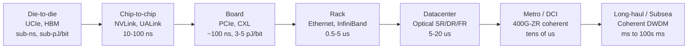

*图1.1——从裸片到海洋的互连层级体系。每向外一步，单比特能耗和时延大致上升一个数量级；该领域的发展轨迹(第24篇)正是要拉平这一阶梯。*

有必要明确列出这一完整的层级体系，因为本知识库的整体结构正是遵循这一体系由内而外展开的：

| 层级 | 尺度 | 主导技术 | 单比特能耗 | 时延 |
|---|---|---|---|---|
| 裸片间(封装内) | µm–mm | UCIe、HBM、EMIB、Foveros、Infinity Fabric、NVLink-C2C、CoWoS、SoIC | <1 pJ/bit | <1 ns |
| 芯片间(封装内) | mm–cm | NVLink、NVSwitch、UALink、Infinity Fabric | 1–2 pJ/bit | ~10–100 ns |
| 板级 | cm | PCIe、CXL | 3–5 pJ/bit | ~100 ns |
| 机架级 | m | Ethernet(DAC/AEC/光)、InfiniBand、RoCEv2 | 5–15 pJ/bit | 0.5–5 µs |
| 舱位级 | 数十m | Ethernet/IB光(SR/DR) | ~10 pJ/bit | 1–5 µs |
| 数据中心级 | 数百m | Ethernet光(FR/LR)、光电路交换 | ~15 pJ/bit | 5–20 µs |
| 园区/城域DCI | 1–80 km | 400G/800G-ZR相干可插拔模块 | 数十pJ/bit | 数十µs |
| 长途/区域 | 80–3000 km | 相干DWDM、ROADM、OTN | 数百pJ/bit | ms |
| 海底/洲际 | 数千km | 海底相干DWDM、带中继EDFA | 数百pJ/bit | 数十至数百 ms |

单比特能耗这一列讲述了一个推动大部分技术路线图演进的故事：数据每跨越这一层级体系中的一个边界，能耗成本大致上升一个数量级，时延也相应上升。共封装光学、chiplet集成和内存解耦这整个技术方向的核心诉求，正是要拉平这一层级体系——将高带宽、低能耗的互连向外推向更长的距离尺度，从而使得，例如，10米外的内存池几乎能以本地板载内存同样低廉的成本被访问。

#### 关键行业组织与标准

没有任何单一组织统管整个数据中心网络领域；相反，是由一批标准组织、行业联盟和开源社区各自掌管技术栈的某一部分。了解谁掌管什么，对读懂各类路线图至关重要。

- **IEEE 802.3**是以太网工作组，负责从最初的10 Mbps同轴以太网到新兴的1.6太比特以太网(P802.3dj任务组)之间的每一项以太网物理层和MAC标准。IEEE的流程是共识驱动的、多厂商参与的，虽然缓慢但持久；一项经IEEE认证的以太网标准几乎可以保证多厂商互操作性。

- **IETF(互联网工程任务组)**通过其RFC(Request for Comments，征求意见稿)流程，掌管数据链路层之上的各类协议：IP、TCP、UDP、BGP、VXLAN(RFC 7348)、GENEVE(RFC 8926)、EVPN(RFC 7432)，以及具有深远影响的RFC 7938("在大规模数据中心中使用BGP进行路由")，该文档将如今已成为标准实践的、在数据中心底层网络(underlay)中运行BGP作为路由协议的做法固化下来。

- **OIF(光互联网论坛)**定义了将光域与电域衔接在一起的电气和光学接口：定义芯片到模块、芯片到芯片SerDes的通用电气接口(CEI，Common Electrical Interface)规范(CEI-112G、CEI-224G)、相干可插拔模块的实施协议(400ZR)，以及共封装接口。

- **CXL联盟**掌管Compute Express Link标准，并已将早先的Gen-Z、CCIX和OpenCAPI等工作合并纳入这一单一的内存与一致性互连标准中。

- **PCI-SIG(PCI特别兴趣小组)**掌管PCIe标准，如今大致以三年为周期发布各代规范(PCIe 6.0、7.0)。

- **UCIe联盟**掌管Universal Chiplet Interconnect Express裸片间互连标准，该联盟由Intel、AMD、Arm、台积电、三星等公司于2022年创立。

- **InfiniBand贸易协会(IBTA)**掌管InfiniBand标准，同时也掌管着重要的RoCE(RDMA over Converged Ethernet)标准，因为RoCE复用了InfiniBand的传输语义并将其运行在以太网之上。

- **开放计算项目(OCP)**是由超大规模运营商主导的开放硬件社区，负责制定服务器、机架、交换机和光硬件的设计标准，其中包括对共封装光学具有影响力的相关工作、SONiC网络操作系统生态系统，以及开放领域专用架构(ODSA，Open Domain-Specific Architecture)的chiplet相关工作(Bunch of Wires)。

- **JEDEC**掌管包括HBM(高带宽内存)各代标准以及DDR/LPDDR在内的内存标准，这些标准正通过CXL连接内存和作为封装内互连的HBM，与网络技术日益产生交集。

- **电信基础设施项目(TIP，Telecom Infra Project)**是由Meta主导的、面向光传输和电信传输领域的OCP对应组织，推动解耦式光传输(开放光分组传输)和开放RAN的发展。

#### 市场规模与经济效益

全球数据中心网络设备市场——交换机、路由器及相关系统——在2024年的年收入已超过**300亿美元**，并仍在增长，其中AI驱动的高端细分市场增速远快于通用计算细分市场。若干相邻市场进一步扩大了这一总体潜在市场规模：

- **光模块市场**已超过**150亿美元**，是技术领域增长最快的硬件品类之一，其增长动力来自从100G向400G再向800G的迭代过渡，以及AI集群互连的爆发式需求。一个大型AI训练集群的单次部署，就可能消耗数十万个高速光模块。

- **交换与路由ASIC(芯片)市场**由Broadcom主导，Marvell、NVIDIA、Cisco(Silicon One)以及一长串定制化的超大规模运营商自研芯片则在争夺剩余份额。交换芯片是一门高利润、高护城河的业务：领先的SerDes技术、分组处理流水线、软件开发套件以及客户锁定效应相结合，构筑起一道有力的防御壁垒，使得Broadcom的网络业务成为半导体行业中利润最高的业务之一。

- **线缆与连接器市场**——直连铜缆(DAC，direct-attach copper)、有源电缆(AEC，active electrical cable)、有源光缆(AOC，active optical cable)以及结构化光纤布线系统——本身就是一门价值数十亿美元的业务，而且随着每一代速率提升，无源铜缆的传输距离极限不断收缩，迫使业界即便对机架内部的短距离链路也要转向有源和光学解决方案，这使得该市场的重要性与日俱增。

AI经济已经使这些市场发生了扭曲。在传统云数据中心中，网络可能占资本支出的10%–15%。而在AI训练集群中，若按合理方式计量，网络所占比例可能显著更高，因为每台GPU服务器所需的网络带宽要高出一个数量级，而且提供无损、低时延、高带宽互连所需的InfiniBand或高端以太网网络架构，其定价也颇为高昂。仅NVIDIA一家的网络业务收入，就已达到每年数十亿美元的规模，该公司也已明确将网络——而不仅仅是GPU——定位为一个战略性的控制点。

#### 竞争格局概览

供应商格局将在第23篇中作详尽阐述，大致可分为若干相互交织的竞技场：

- **交换机和路由器整机系统**：Cisco(传统的行业巨头，在企业市场和运营商市场占主导地位，在云市场也有布局)、Arista(面向云和AI优化的挑战者，正以蚕食Cisco份额的速度快速增长)、Juniper(在运营商级路由领域实力雄厚，已被HPE收购)，以及白牌生态系统(Dell、Edgecore等厂商，在商用芯片上运行SONiC或其他解耦式网络操作系统)。

- **交换芯片**：Broadcom(占据主导地位，市场份额约55%–60%，旗下有Tomahawk、Trident和Jericho系列)、Marvell(Teralynx、Prestera，外加一项庞大的定制芯片业务以及Inphi相干DSP业务)、Intel(如今已逐步收缩的Tofino可编程芯片产品线)，以及NVIDIA(Spectrum以太网和Quantum InfiniBand)。

- **AI网络架构**：NVIDIA凭借InfiniBand(近乎垄断)、NVLink/NVSwitch(专有纵向扩展方案)以及Spectrum-X(其以太网AI产品)占据主导地位，面临来自AMD(以太网为主，外加UALink)、Intel(Gaudi，以太网为主)，以及各超大规模运营商自研互连方案(Google TPU ICI、Amazon NeuronLink)的挑战。

- **光系统与光器件**：Ciena、Nokia和Infinera在DWDM和DCI系统领域；Lumentum和Coherent(由II-VI与Coherent合并而成)在光器件领域(WSS、激光器、调制器)；Acacia(Cisco旗下)、Marvell(Inphi)等在相干DSP领域；此外还有一个庞大的光模块生态系统，涵盖西方供应商(Coherent、Lumentum)和中国供应商(光迅、Eoptolink、Accelink、华为海思Hi-Link)。

- **超大规模运营商的定制芯片**：Google(TPU互连、定制交换机)、Amazon(Nitro、Trainium NeuronLink)、Microsoft(MANA、Azure Boost)以及Meta(MTIA加速器、OCP交换机)日益自主设计各自的网络芯片，以降低对商用供应商的依赖，并针对各自特定的工作负载进行优化。

#### 关键技术张力

本知识库其余部分将反复回归到几组将塑造未来十年格局的结构性张力上。

**以太网与InfiniBand在AI领域的竞争。** InfiniBand提供原生无损特性、更低且更可预测的时延、硬件卸载的集合通信(SHARP)，以及一套垂直整合的NVIDIA技术栈——代价是单一厂商生态、专有管理平面以及溢价定价。以太网提供开放的多厂商生态、运维层面的熟悉度(BGP、OpenConfig、标准化工具)，以及激烈的成本竞争——代价是需要PFC和复杂的拥塞控制(DCQCN，以及来自Ultra Ethernet Consortium的更新方案)来逼近InfiniBand的无损表现。超大规模运营商出于对开放生态和运维掌控力的偏好，正大力推动向以太网转型；NVIDIA的Spectrum-X正是其试图以类InfiniBand的性能表现和NVIDIA主导的拥塞管理，来夺取以太网AI网络架构市场的尝试。

**电互连与光互连的竞争。** 随着每通道信号速率从50G攀升到100G再到200G PAM4，无源铜缆的传输距离急剧收缩，将电信号从交换芯片驱动到前面板可插拔光模块所付出的能耗和信号完整性代价，正日益成为交换机功耗中的主导部分。线性驱动光模块(LPO，Linear-drive Pluggable Optics)和共封装光学(CPO，Co-Packaged Optics)是业界对此作出的回应，将光引擎不断推向更靠近ASIC封装的位置(并最终推向封装内部)。

**商用芯片与定制ASIC的竞争。** Broadcom的商用交换芯片提供最快的上市速度和最广泛的生态系统；定制ASIC(Cisco Silicon One、各超大规模运营商的自研芯片)则以巨大的工程成本换取差异化优势和针对工作负载的优化。这一平衡会来回摆动，但对除极少数最大规模的运营商之外的所有厂商而言，商用芯片经济效益的引力都十分强大。

**专有标准与开放标准的竞争。** NVLink对UALink、InfiniBand对Ethernet、集成式光系统对解耦式开放线路系统、厂商私有CLI对OpenConfig——在每一层，专有的、垂直整合方案所具有的性能和集成优势，与开放标准所具有的灵活性、多源采购能力和成本纪律之间，都存在着张力。从网络技术的历史来看，长期而言开放标准往往占据上风(以太网屡战屡胜的历史正是典型例证)，但AI时代暂时性地对垂直整合给予了丰厚回报，而这一张力如何解决，正是该领域核心的战略性博弈所在。

这些张力并非抽象概念；它们直接转化为价值数十亿美元的产品决策，转化为训练前沿AI模型的集群架构，也转化为本知识库所涵盖各家企业的竞争命运。后续各章将依次考察互连层级体系的每一层，从协议栈(第02篇)开始，经过芯片级互连(PCIe、CXL、UCIe)、机架级网络架构(Ethernet、InfiniBand、RDMA)、光层(基础原理、相干光、光交换、DCI、共封装光学)、交换芯片、AI网络架构，最后是供应商格局、未来路线图，以及日益制约整个行业的可持续性约束。

#### 交叉主题：如何阅读本知识库

在深入各个层级之前，有必要先明确指出在每一个尺度上都反复出现的**交叉主题**，因为正是这些主题将一部跨越微米到海洋尺度的知识库串联成一个连贯的整体。牢记这些主题的读者，将会发现同样的模式以不同的物理外衣，在每一层都反复出现。

第一个主题是**单比特能耗层级体系**(在第13篇中有定量展开)。每一种互连方式都有其传输单比特数据的特征能耗成本，而这些成本在层级体系中每向外一步就大致上升一个数量级——从裸片上导线的亚皮焦耳级别，到长途相干传输的数百皮焦耳级别。这一层级体系是本知识库中几乎所有架构选择背后的深层原因：为什么GPU到GPU通信使用NVLink而非PCIe，为什么共封装光学得以出现，为什么chiplet要走向集成，为什么内存解耦如此困难，以及为什么未来的发展方向(第24篇)正是**拉平**这一层级体系。

第二个主题是**跨层协同设计**。OSI模型(第02篇)那种清晰的分层结构，在高性能网络架构中被有意打破：物理层的FEC、链路层的流控、网络层的负载均衡以及传输层的拥塞控制，被作为一个统一的控制系统协同设计，而最高的性能正来自于跨越层边界的优化，而非局限于单层内部的优化。这一主题在AI训练中体现为并行方式-拓扑-集合通信的协同设计(第15篇)，在共封装光学中体现为ASIC-光学协同设计(第13篇)，在网络虚拟化中体现为叠加网络-底层网络协同设计(第20篇)。

第三个主题是**专有与开放之间的张力**。在每一层，追求极致性能和紧密集成的专有、垂直整合方案，都在与追求灵活性、竞争和更低成本的开放多厂商标准相互角力：InfiniBand对Ethernet、NVLink对UALink、集成式光系统对解耦式开放线路系统、厂商私有CLI对OpenConfig、专有CPO对标准化CPO。从网络技术的历史来看，长期而言开放标准往往占据上风，但AI时代暂时性地对垂直整合给予了丰厚回报，而这一张力如何解决，正是贯穿本知识库的核心战略性博弈。

第四个主题是**无损性与拥塞问题**。凡是出现RDMA或高性能传输的地方(第06、07、08、17篇)，网络都必须是无损或近乎无损的，而在不引发背压病理反应(PFC死锁、拥塞扩散)的前提下实现这一点，是一个反复出现的棘手问题，InfiniBand(主动信用机制)和以太网(被动PFC加拥塞控制)对此给出了不同的解法，这也是决定一个网络架构性能表现的核心所在。

第五个主题是**解耦与可组合性**。在每一个尺度上，发展轨迹都是将单体拆解为一组组独立优化、独立采购的组件，再通过高性能网络架构重新连接起来：芯片被拆解为chiplet(第05篇)，服务器内存被拆解为CXL内存池(第04篇)，存储被拆解为解耦式NVMe-oF(第18篇)，最终数据中心本身也被拆解为可组合的计算、内存和加速器资源池(第24篇)。网络正是实现解耦的推动力——只有当网络架构变得足够快速且无损、足以让远程资源表现得如同本地资源一般时，这种解耦才具备可行性。

第六个、也是最后一个主题是**AI经济杠杆效应**。由于网络是作用于数据中心中最昂贵资源(GPU机队)之上、受屏障约束的力量放大器，其效率会直接转化为庞大AI投资的经济回报(第15篇)。这种杠杆效应——即在庞大机队上哪怕几个百分点的GPU利用率提升，其价值也可能超过采用更优网络架构所增加的全部成本——正是网络这一长期被视为基础配套设施的领域，如今获得了不成比例的工程关注度和资本投入的原因，也是本知识库将其作为一级主题来处理的原因。牢记这六大主题——能耗层级体系、跨层协同设计、专有与开放之争、无损性、解耦，以及AI经济杠杆效应——的读者，将会在后续每一章中，以不同的物理形式，认出这些主题的反复出现。

[↑ 返回目录 / Back to Table of Contents](#目录--table-of-contents)

---

<a id="sec-27-3"></a>
## 27.3 OSI模型、协议栈与数据中心网络分层

**中文翻译，原文见:** [02_osi_model_and_datacenter_protocol_stack.md](02_osi_model_and_datacenter_protocol_stack.md)

---

### OSI模型、协议栈与数据中心网络分层

#### OSI模型：数据中心技术栈的一张地图

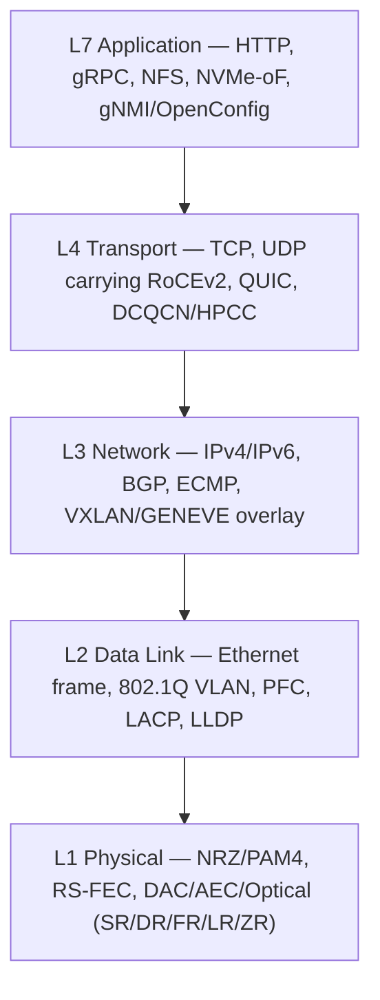

*图2.1——填入了各自数据中心实现的OSI各层。后续各章将各项技术分别映射到这一技术栈之上。*

七层开放系统互连(OSI，Open Systems Interconnection)参考模型由ISO于1984年正式确立，它是一种理想化模型，没有任何真实网络会逐字照搬实现，但它依然是网络领域不可或缺的共同语言。它在数据中心中的持久价值在于作为一张地图：它告诉我们某项特定技术运作在哪一层，它依赖哪些层，又有哪些层依赖它。当一位AI训练工程师抱怨"网络架构在丢包"，当一位数据中心架构师争论"主机侧应采用二层还是三层"，或者当一位光网络工程师规定要使用"一层中继器(retimer)"时，他们其实都是在这张地图上给自己所关心的问题定位。

本章从底层向上逐层展开这一模型，为每一层填入构成现代数据中心网络的具体协议、编码方式和硬件。本章末尾将阐明一个至关重要的洞见：在高性能AI网络架构中，各层并非独立运作。物理层的前向纠错、链路层的流控、网络层的负载均衡以及传输层的拥塞控制是被协同设计、紧密耦合在一起的。任何一层的变动都会波及所有其他层。

七层模型简述如下：

1. **物理层(Physical)**——在介质(铜缆、光纤、背板)上传输原始比特。关注点：信令、调制、编码、前向纠错、连接器、传输距离。
2. **数据链路层(Data Link)**——在单条链路或局域网内进行帧封装、寻址和介质访问。关注点：以太网帧、MAC地址、VLAN、流控。
3. **网络层(Network)**——跨越多条链路进行寻址和路由，以到达任意目的地。关注点：IP、BGP、ECMP、叠加网络(overlay)。
4. **传输层(Transport)**——端到端的传输、可靠性和拥塞控制。关注点：TCP、UDP、RDMA传输、拥塞控制算法。
5. **会话层(Session)**——建立、管理和终止会话。
6. **表示层(Presentation)**——数据表示、加密、序列化。
7. **应用层(Application)**——应用程序所使用的协议：HTTP、gRPC、NFS、NVMe-oF、gNMI。

在实践中，TCP/IP模型将第5至第7层合并为单一的"应用层"，大多数数据中心相关的讨论也沿用这一做法。本书保留OSI的层级编号，因为它精确地命名了那些对硬件卸载和协议设计而言至关重要的边界。

#### 第一层：数据中心中的物理层

物理层是抽象比特与物理定律相遇之处，在数据中心中，它由三大类传输介质主导——铜缆、有源电缆和光纤——并伴随着一场针对信号劣化(每次速率提升都会加剧这一问题)的持续斗争。

##### 铜缆、有源电缆与光学介质

**直连铜缆(DAC，Direct-Attach Copper)**，也称为twinax(双芯同轴电缆)，是一种无源屏蔽铜缆，用于最短距离的链路——典型场景是同一机架内从顶部交换机(ToR)到服务器，距离最多几米。DAC是成本最低、功耗最低的选项(没有有源元件，没有激光器)，但其传输距离会随每一代速率提升而急剧收缩。在每通道10G和25G速率下，无源DAC的传输距离可达3–5米；在50G PAM4下约为2–3米；在100G PAM4下，无源DAC的传输距离被限制在大约1.5–2米；而在每通道200G速率下，即便在机架内部，无源铜缆也已变得勉强可用。

**有源电缆(AEC，Active Electrical Cable)**在线缆连接器中内嵌信号调理芯片(中继器retimer或再驱动器redriver)，以延长铜缆的传输距离。通过再生电信号，AEC即便在很高的每通道速率下，也能将可用距离重新拉长到约7米，代价是增加的功耗(几瓦)和成本。随着无源DAC的传输距离逐渐耗尽，AEC已成为机架间和排内(within-row)链路不可或缺的选择；Credo等公司正是凭借面向超大规模AI部署的AEC业务，建立起了可观的规模。

**光学介质**在铜缆无法企及的地方接管传输任务。光学传输距离的分类被编码进了IEEE的命名规则中：
- **SR(短距离，Short Reach)**——采用VCSEL激光器的多模光纤，典型波长850纳米，传输距离30–100米；用于机架内和排内。变体包括：SR4(4通道)、SR8(8通道)。
- **DR(500米距离)**——单模光纤，每通道单波长，约500米；用于舱位内的机架间连接。DR4=四根并行单模光纤。
- **FR(2公里)**——单模，约2公里；用于园区内跨舱位连接。
- **LR(10公里)**——单模，10公里；用于园区和短距离DCI。
- **ER(40公里)**和**ZR/ZR+(80公里及以上)**——扩展距离和相干传输，用于数据中心互连。

##### 信令：NRZ、PAM4，以及向PAM8的演进

数十年来，数据中心SerDes一直采用**NRZ(非归零，Non-Return-to-Zero)**信令：用两个电压电平编码每个符号(每波特)一个比特。NRZ非常稳健——其两个电平相距很远，具有良好的抗噪能力——但其频谱效率仅为每波特一比特，因此要将数据速率翻倍，就必须将波特率翻倍，而这会碰到信道带宽的限制。

在每通道50 Gbps及以上速率下，业界转向了**PAM4(4电平脉冲幅度调制，4-level Pulse Amplitude Modulation)**，它使用四个电压电平来编码每个符号两个比特。PAM4将给定数据速率所需的波特率减半(一条100 Gbps的PAM4通道运行在约53.1 Gbaud，而非NRZ所需的约106 Gbaud)，从而使信号保持在信道带宽范围之内。但代价是严重的：在同样的电压摆幅内塞入四个电平，电平间距只有NRZ的三分之一，这会造成大约**9.5 dB的信噪比损失**。正是这一信噪比损失，使得PAM4必须依赖前向纠错——若不加纠错，原始误码率会高到无法直接使用。

**PAM8(8电平，每符号3比特)**已被研究用于超越每通道200G的信令速率，但面临更为严酷的信噪比损失，并要求数据转换器在极高带宽下具备极高的有效位数(ENOB，effective-number-of-bits)。截至2020年代中期，业界共识是PAM8在生产环境中并不实用；通向更高每通道速率的路径要经由更高的波特率，并最终经由光学方案实现，而非依靠更多的调制电平。

##### 前向纠错

**前向纠错(FEC，Forward Error Correction)**在数据流中添加冗余符号，使接收端无需重传即可检测和纠正错误。在高速数据中心链路中，FEC并非可有可无的辅助清理手段——它是一项根本性的使能技术，使PAM4能够在原始(纠错前)误码率高达10⁻⁴的情况下运行，同时向上层交付10⁻¹²或更优的纠错后误码率(BER)。

主流编码方式是里德-所罗门(Reed-Solomon)码：
- **RS(528,514)**，即"Base-R"或"KR4/CR4" FEC，在514个数据符号上添加14个校验符号(2.7%的开销)，每个码字可纠正最多7个符号错误。它是为25G NRZ链路标准化的，会增加大约80纳秒的时延。
- **RS(544,514)**，即"KP4" FEC，添加30个校验符号(5.8%的开销)，可纠正最多15个符号错误，是50G PAM4及更快速率通道的主力FEC方案。其时延大约在100–150纳秒之间。

FEC时延对AI和存储RDMA而言至关重要，因为它会直接叠加到每一次链路穿越的时延中，进而叠加到限制集合通信操作完成时间的往返时延(round-trip time)之中。这种张力催生了以太网技术联盟(Ethernet Technology Consortium)推出的专门的**低时延FEC(LL-FEC)**方案，这类方案以牺牲部分纠错能力换取时延的降低，有时甚至促使运营商在非常短、非常干净的链路上彻底禁用FEC——这是一种有风险的优化，因为RDMA流上一次未被纠正的错误，其代价可能远高于所节省下来的FEC时延。

这一层的关键性能指标包括**眼图(eye diagram)**(一种可视化信号质量的方法，展示符号电平之间的"眼睛张开度")、**误码率(BER，bit error rate)**目标(以太网为纠错后10⁻¹²；受KP4保护的PAM4的纠错前预算约为10⁻⁴)，以及以分贝(dB)计的信道**插入损耗预算(insertion loss budget)**，这一预算决定了在给定的信令、均衡和FEC组合下，某一传输距离是否可行。

#### 第二层：数据链路层

数据链路层将比特封装为可寻址的单元，并管理对共享介质的访问。在数据中心中，这一层绝大多数场景下都是以太网(InfiniBand的链路层是主要的替代方案，详见第07篇)。

##### 以太网帧

一个以太网帧，在线路上呈现出的结构包括：
- **前导码(Preamble，7字节)**和**帧起始定界符(SFD，Start Frame Delimiter，1字节)**——一个已知的模式，让接收端能够同步其时钟并找到帧边界。
- **目的MAC地址(6字节)**和**源MAC地址(6字节)**——48位硬件地址；目的地址的最高有效位区分单播和多播，另有一个独立的位区分全局唯一地址(OUI分配)和本地管理地址。
- **以太网类型/长度字段(EtherType/Length，2字节)**——值≥0x0600表示负载所属协议(0x0800=IPv4，0x86DD=IPv6，0x8100=802.1Q VLAN标签，0x8847=MPLS)；更小的值表示帧长度(旧版802.3)。
- **负载(标准为46–1500字节，巨型帧可达约9000字节)**——被封装的上层数据包。巨型帧(jumbo frame)在数据中心中已成为通用配置，因为它能分摊每帧的开销，并降低批量传输时的CPU中断负载。
- **帧校验序列(FCS，Frame Check Sequence，4字节)**——对整个帧进行的CRC-32校验，用于错误检测(注意：仅是检测，而非纠正；纠正是物理层FEC的职责)。

##### VLAN、QinQ与流控

**802.1Q VLAN标签**在源MAC地址之后插入一个4字节的标签，其中包含一个12位的VLAN ID(可提供4096个VLAN)和一个3位的优先级代码点(PCP，Priority Code Point，即优先级流控所使用的"服务类别")。**802.1ad(QinQ)**堆叠两个标签——一个外层"服务"标签和一个内层"客户"标签——以将分段规模扩展到超过4096个，并让服务提供商能够透明地传输客户的VLAN。在现代数据中心中，大规模的基于VLAN的分段方式已在很大程度上被VXLAN叠加网络(见下文)所取代，但VLAN标签在本地分段方面依然无处不在，而且至关重要的是，它还承载着驱动无损行为的优先级比特位。

流控正是数据链路层对AI网络架构变得不可或缺的地方：
- **802.3x PAUSE**是最初的链路级流控机制：当接收端的缓冲区填满时，它会发送一个PAUSE帧，告诉发送端在指定时间内停止发送。PAUSE的粒度很粗——它会暂停链路上的*全部*流量，当对时延敏感的控制流量与批量数据共享同一条链路时，这是无法接受的。
- **802.1Qbb 基于优先级的流控(PFC，Priority-based Flow Control)**对PAUSE进行了细化，使其能够按优先级运作：它可以暂停优先级3(比如说，RDMA流量)，同时让其他优先级的流量继续流动。PFC正是使"无损以太网"成为可能的机制，因为它让交换机能够在自身缓冲区溢出并丢包之前，对上游发送端施加背压。但PFC同时也是诸多病理问题的根源——队头阻塞(head-of-line blocking)、拥塞扩散，以及令人生畏的PFC死锁和PFC风暴——这些将在第06篇和第17篇中深入探讨。
- **802.1Qaz 增强传输选择(ETS，Enhanced Transmission Selection)**以及**数据中心桥接交换协议(DCBX，Data Center Bridging Exchange，属于802.1AB/LLDP的一部分)**允许交换机和网卡在各优先级类别之间协商带宽分配，并自动交换PFC和ETS配置，确保链路两端就哪些优先级应为无损达成一致。

**802.3ad 链路聚合(LACP，Link Aggregation)**将多条物理链路捆绑为一条逻辑链路，以提升带宽并实现冗余，并通过哈希将流量分散到各条成员链路上。**LLDP(链路层发现协议，Link Layer Discovery Protocol，802.1AB)**让设备向邻居通告自身的身份和能力，是自动化拓扑发现和DCBX的基础。

#### 第三层：网络层

网络层提供全局寻址和路由。在数据中心中，寻址由IP(v4以及日益增多的v6)承担，底层网络的路由则由BGP承担。

##### IPv4和IPv6报头

**IPv4报头**为20字节(不含选项)：版本和报头长度、服务类型/DSCP(差分服务代码点，Differentiated Services Code Point)和ECN比特位、总长度、标识/标志/分片偏移(用于分片)、TTL(生存时间，每经过一跳递减以消除环路)、协议字段(6=TCP，17=UDP)、报头校验和，以及32位的源地址和目的地址。ToS字段中的两个**ECN(显式拥塞通知，Explicit Congestion Notification)**比特位对数据中心拥塞控制而言至关重要：一台发生拥塞的交换机可以设置"经历拥塞(Congestion Experienced)"代码点而不是直接丢包，从而在不丢包的情况下向端点发出降速信号。

**IPv6报头**是固定的40字节，设计更为简洁：版本、流量类别(DSCP+ECN)、流标签(flow label，一个20位字段，可携带用于负载均衡的每流熵值)、负载长度、下一报头字段(通过一系列扩展报头链，取代了"协议"字段和选项机制)、跳数限制(hop limit，相当于TTL)，以及128位的源地址和目的地址。流标签在大型数据中心中正日益被用来提升ECMP哈希的熵值，而其庞大的地址空间也简化了超大规模场景下的寻址工作。

##### 数据中心中的BGP、OSPF与IS-IS

现代数据中心底层网络最具决定性的架构决策，就是采用**BGP(边界网关协议，Border Gateway Protocol)**——历史上一直是全球互联网所使用的协议——作为*数据中心内部*的路由协议。**RFC 7938《在大规模数据中心中使用BGP进行路由》**将这一实践固化为标准。其内在逻辑是：Clos网络架构是一种规则的、密集互连的拓扑，其中每个leaf都连接到每个spine。在这样的拓扑上运行链路状态协议(OSPF或IS-IS)，会产生庞大的链路状态数据库和频繁的泛洪；相比之下，BGP只通告可达性，能够扩展到数十万条前缀，支持丰富的策略控制，而且关键的是，BGP能够自然地提供**ECMP(等价多路径，Equal-Cost Multi-Path)**，因为一个leaf会通过每一个spine学习到相同的目的前缀，并在所有spine之间进行负载均衡。

在典型设计中，每台交换机都是其自身的BGP自治系统(使用私有或4字节ASN)，每条网络架构链路上都运行eBGP会话，整个网络架构从ToR一路向下都成为一个路由型三层网络——有时甚至一路延伸到主机("路由到主机"，routing on the host)。**OSPF和IS-IS**依然作为底层协议出现，尤其是在受运营商设计理念影响的方案中，以及在部分光/MPLS底层网络中；而在偏好使用iBGP以减少全互联会话数量的场景下，则会使用**路由反射器(route reflector)**。但BGP无处不在的模型，通常配合自动化和模板化手段，正是超大规模场景下的默认做法。

ECMP与叠加网络之间的相互作用是一个反复出现的主题：由于VXLAN将内层数据包封装在外层UDP/IP报头内部，网络架构是基于*外层*报头进行负载均衡的，因此封装设备会有意让外层UDP源端口发生变化，注入熵值，使得不同的内层流能够哈希到不同的路径上。熵值随机化不足是导致ECMP负载不均衡以及困扰RDMA网络架构的"大象流(elephant flow)"热点问题的一个典型原因(第17篇)。

#### 第四层：传输层

传输层提供端到端的传输，而在数据中心中，它也是决定网络架构性能表现良好还是在负载下崩溃的拥塞控制算法所在之处。

##### TCP及其数据中心拥塞控制变体

TCP提供可靠、有序的字节流传输，并配有拥塞控制。经典算法**CUBIC**会积极地增大发送窗口，并在丢包时回退；它在广域互联网上表现良好，但在数据中心浅缓冲区和微秒级RTT的环境下表现不佳。若干数据中心专属变体应运而生：
- **DCTCP(数据中心TCP，Data Center TCP)**按比例使用ECN标记：它不是在收到任何拥塞信号时就将窗口减半，而是估计被标记数据包所占的*比例*，并按比例缩减窗口，从而使交换机队列保持较短、时延保持较低。DCTCP是DCQCN在概念上的前身。
- **BBR(瓶颈带宽与往返传播时延，Bottleneck Bandwidth and Round-trip propagation time)**，由Google提出，直接对瓶颈带宽和最小RTT建模，并将传输节奏控制在最优工作点，而非依据丢包做出反应。BBR被广泛用于Google的广域网和服务流量。

##### UDP、RDMA与QUIC

对于以太网上的RDMA而言，传输层采用的是**UDP**：**RoCEv2**将InfiniBand的传输语义封装进UDP/IP数据包中(目的端口4791)，使RDMA能够在三层网络架构中路由。由于UDP本身不提供拥塞控制，RoCEv2依赖PFC(链路层无损性)与拥塞控制算法——**DCQCN、HPCC、Timely或Swift**——的组合，这类算法在网卡中实现，并通过ECN或带内遥测发出信号。这些内容将在第06、08和17篇中详细探讨。这里的关键概念是**802.1Qau 量化拥塞通知(QCN，Quantized Congestion Notification)**，这是一种早期的二层拥塞通知方案，其思想在DCQCN的量化速率调整机制中得以延续。

**QUIC**最初是Google的协议，如今已成为IETF标准(RFC 9000)，在UDP之上运行可靠、多路复用、加密的数据流。在数据中心中，它主要用于前端和服务间的服务流量，而非AI网络架构，但其用户空间实现以及对队头阻塞的规避，使其对东西向微服务通信而言正日益重要。

#### 第5至7层：会话层、表示层与应用层

在传输层之上，是应用程序和基础设施实际使用的各类协议。在数据中心中，最重要的包括：

- **存储协议**：**NFS**(网络文件系统)用于共享文件；**iSCSI**(通过TCP传输的SCSI块命令)用于块存储；而对现代闪存而言最为重要的是**NVMe-oF(NVMe over Fabrics)**，它将NVMe的队列对(queue-pair)存储模型承载于RDMA、TCP或Fibre Channel传输之上(第18篇)。基于RDMA的NVMe-oF可实现低于20微秒的远程存储时延，已接近本地NVMe的水平。
- **RPC与API**：**gRPC**(基于HTTP/2、使用protobuf序列化的远程过程调用)和**REST/HTTP**主导着服务间通信和管理通信。
- **网络管理与遥测**：**OpenConfig**(与厂商无关的YANG数据模型)、用于流式遥测和配置的**gNMI(gRPC网络管理接口，gRPC Network Management Interface)**，以及以毫秒级粒度将每端口计数器、缓冲区占用率和拥塞事件推送给采集器的**基于gRPC的遥测**流水线，取代了传统的SNMP轮询模式(第16篇、第22篇)。

#### 各层如何在无损AI网络架构中相互作用

本章的核心论点是：在高性能AI训练网络架构中，OSI各层并非彼此独立——它们构成了一个紧密耦合的控制系统，而理解这种耦合关系，对理解为何这些网络架构如此难以构建而言至关重要。

考虑在一个RoCEv2以太网网络架构上执行单次AllReduce时会发生什么：

1. **物理层**：每条链路都以PAM4配合RS(544,514) FEC运行。FEC每跳增加约150纳秒的时延，并确保纠错后的BER足够低，使RDMA传输实际上几乎不会遇到因数据损坏导致的丢包。若FEC能力较弱，数据损坏导致的丢包将触发RDMA重传；若FEC时延较高，集合通信操作完成速度就会变慢。

2. **数据链路层**：RDMA流量运行在配置了PFC的专用优先级类别上(比如PCP 3)。当交换机中该优先级对应的缓冲区接近填满时，它会向上游发送PFC PAUSE，防止缓冲区溢出并丢弃RDMA数据包。这正是使网络架构实现"无损"的机制。但PFC是一种逐跳背压机制：如果它在网络架构深处被触发，就会向上游传播，而如果拓扑中存在环状缓冲区依赖关系，就可能发生死锁——因此网络层的拓扑设计和链路层的PFC配置必须协同设计，以确保不发生死锁。

3. **网络层**：AllReduce流量通过ECMP分散到整个Clos网络架构上。由于给定一对端点之间的RDMA批量传输通常共享同一个队列对(因而共享同一个5元组)，朴素的ECMP会将它们全部哈希到同一条路径上，从而形成"大象流"热点。缓解手段位于这一层(flowlet交换、自适应路由、容忍乱序的逐包喷洒式传输)，并直接与传输层对乱序交付的容忍度相互作用。

4. **传输层**：RoCEv2网卡运行DCQCN(或更新的算法)。当交换机遇到拥塞时，它会设置ECN的"经历拥塞"比特位；接收端通过拥塞通知数据包(Congestion Notification Packet)将这一信息反射给发送端；发送端随之降低其注入速率。DCQCN的职责是让队列保持足够短，从而使PFC很少被触发——因为虽然PFC能够防止丢包，但它是通过扩散拥塞来实现这一点的，因此一个调优良好的网络架构会将ECN/DCQCN作为主要的、渐进式的控制手段，而将PFC仅仅作为最后一道安全网。

构建这类网络架构的技艺，正是本知识库通篇探讨的内容，其核心在于将这四层协同调优：FEC强度与时延的权衡、PFC阈值与ECN标记阈值的权衡、缓冲区大小与突发吸收能力的权衡、ECMP熵值与流冲突的权衡，以及DCQCN参数与消息大小分布的权衡。若这种耦合关系没有调好，网络架构要么会丢弃RDMA数据包(对吞吐量而言是灾难性的)，要么会扩散PFC背压直至整个网络架构陷入停滞(对集合通信操作而言是灾难性的)。若调好了，网络架构就能在数万颗GPU之间提供接近线速、接近确定性的集合通信性能。这正是为什么AI网络是一个系统性问题，而非逐层独立的问题。

#### 叠加网络：VXLAN、GENEVE与GRE

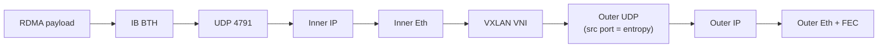

*图2.2——一次通过VXLAN叠加网络承载的RDMA写操作的封装嵌套结构。底层网络(underlay)交换机根据外层报头(右侧)进行路由；外层UDP源端口中的熵值让ECMP得以将隧道化的流量分散开来。要在线速下处理这一深度的封装，需要硬件卸载和巨型帧的支持。*

协议栈的最后一部分是叠加网络(overlay)——构建在物理(底层，underlay)网络架构之上的虚拟网络，用以提供租户隔离、迁移能力和独立寻址能力。

**VXLAN(虚拟可扩展局域网，Virtual Extensible LAN，RFC 7348)**是主流的数据中心叠加网络技术。它将一个完整的二层以太网帧封装进外层UDP/IP数据包中。VXLAN报头为8字节，携带一个**24位的VNI(VXLAN网络标识符，VXLAN Network Identifier)**，可提供1600万个虚拟网络分段——比VLAN的4096个高出三个数量级。这一封装工作由**VTEP(VXLAN隧道端点，VXLAN Tunnel Endpoint)**执行，VTEP可以位于虚拟机监控程序(hypervisor)的虚拟交换机中、位于网卡中(硬件VTEP，经过卸载)，或位于物理交换机中(ASIC内的硬件VTEP)。总开销大约为50字节(14字节外层以太网+20字节外层IPv4+8字节UDP+8字节VXLAN)，这正是为什么巨型帧和硬件卸载至关重要——在线速下用软件方式进行VXLAN封装会消耗巨量CPU资源。在现代部署中，VXLAN的控制平面是**BGP EVPN(以太网VPN，Ethernet VPN，RFC 7432)**，它在各VTEP之间分发MAC和IP可达性信息，支持多归属(multi-homing)，并实现对称的集成路由与桥接(IRB，integrated routing and bridging)。

**GENEVE(通用网络虚拟化封装，Generic Network Virtualization Encapsulation，RFC 8926)**在VXLAN的基础上进行了泛化，采用可扩展的、可变长度的报头，携带类型-长度-值(TLV，type-length-value)选项，其设计目的是让SDN控制器能够向隧道化数据包附加任意元数据。它受到VMware NSX-T等软件定义平台的青睐，并得到Open vSwitch的支持。

**GRE(通用路由封装，Generic Routing Encapsulation)**是一种更老、更简单的隧道协议，如今仍用于特定的点对点隧道以及部分云网关设计中。

贯穿所有叠加网络技术的关键工程考量是**硬件卸载**：封装与解封装，以及底层网络ECMP负载均衡所需的熵值生成，都必须在网卡或交换芯片中以线速完成。一个根据内层流哈希值变化外层UDP源端口的VTEP，能让底层网络将隧道化流量分散到所有ECMP路径上——这与第三层所讨论的、若处理不当就会导致负载不均衡的熵值机制是同一套原理。叠加网络与底层网络，正如AI时代数据中心中其他每一对层级一样，必须协同设计。

#### 技术栈的实际运作：封装深度与报头开销

有必要具体追溯一下，在现代数据中心中，封装栈可以变得多深，因为上文所述的分层结构是层层叠加的，每一层都会增加硬件必须在线速下处理的报头开销。考虑一次从一台GPU服务器写入另一台GPU服务器的RDMA写操作，在多租户云环境中，通过VXLAN叠加网络进行：最内层的负载是应用数据；外面包裹一个用于RDMA的InfiniBand传输报头(BTH)；再外面包裹一个UDP报头(端口4791)和一个IP报头，以实现RoCEv2的可路由性；再外面包裹一个内层以太网帧；由VTEP封装进一个VXLAN报头、一个外层UDP报头(源端口中带有熵值)、一个外层IP报头和一个外层以太网帧；最后在物理层加上前导码、FEC和线路编码进行成帧。因此，单个数据包携带着多达六层嵌套报头，每一层都由不同的层添加，而网卡和交换机必须以每秒数百吉比特的速度解析、处理并(对某些层而言)修改所有这些报头。这正是为什么硬件卸载(解析、封装/解封装、校验和、FEC)和巨型帧(用于将固定的每包报头开销分摊到更大的负载上)并非可有可无的锦上添花，而是根本性的必需要求——一个以软件方式在线速下处理这种封装深度的技术栈将消耗巨量CPU资源，而小帧上的每包报头开销也会浪费可观的带宽。协议栈的可组合性十分强大，但它也带来了处理和开销负担，唯有硬件加速和精心的帧大小设计才能承受。

#### 技术栈的实际运作：为何层违反普遍存在且有其必要性

关于数据中心协议栈的最后一个观察是：OSI模型那种清晰的分层隔离，在高性能设计中经常性地、且有必要地被**打破**——理解其原因，有助于揭示工程现实的本质。该模型主张各层应彼此独立，仅通过明确定义的接口进行通信，但数据中心的性能要求却要求跨层优化。RDMA(本属于传输层/会话层的关注点)向下延伸，要求物理层提供FEC、链路层提供PFC(无损性)。拥塞控制(传输层)依赖于交换机设置ECN(网络层/链路层)，而在HPCC中，还依赖于交换机嵌入遥测信息(这是一种刻意的层违反，将物理队列状态暴露给传输层)。ECMP(网络层)的负载均衡依赖于叠加网络(更高层)必须刻意注入到外层报头中的熵值。网内计算(SHARP)让交换机(一种网络层设备)执行应用层的规约操作。这些"违反"中的每一项，都是一种刻意的跨层优化，以牺牲模型的清晰模块化为代价，换取工作负载所要求的性能。

这并非马虎行事；这正是本知识库反复回归的核心工程原则：在AI时代的数据中心中，各层构成一个紧密耦合的控制系统，而最高的性能正来自于跨层边界的协同设计——FEC与传输层协同、PFC与拥塞控制协同、叠加网络与底层网络协同、网络与集合通信协同。OSI模型依然是不可或缺的*地图*(它命名了各项关注点及其自然边界)，但高性能网络架构的*疆域*，却是一片刻意、审慎的跨层耦合之地。同时秉持这两种认识——模型作为地图，跨层协同设计作为现实——对于理解数据中心网络究竟如何实现其性能表现至关重要，这也是本知识库后续各章审视每一项技术时所采用的视角。

[↑ 返回目录 / Back to Table of Contents](#目录--table-of-contents)

---

<a id="sec-27-4"></a>
## 27.4 PCIe——架构、代际演进、协议深度解析与路线图

**中文翻译，原文见:** [03_pcie_deep_dive.md](03_pcie_deep_dive.md)

---

### PCIe——架构、代际演进、协议深度解析与路线图

#### 引言：为什么 PCIe 是服务器的脊柱

外设组件互连高速总线(Peripheral Component Interconnect Express,PCIe)是服务器内部最重要、却又最少被人想起的互连技术。它是连接 CPU 与 GPU、网络接口卡、NVMe 存储、加速器,并且——通过其缓存一致性的超集 CXL——连接到解耦内存(disaggregated memory)的总线。GPU 在训练运行前从主机内存中暂存的每一个字节、供给数据管道的每一次 NVMe 读取、NIC 交付到主机缓冲区的每一个数据包,都要经过 PCIe。在 AI 服务器中,PCIe 并不是那个最引人注目的互连——那个荣誉属于 NVLink 和 InfiniBand——但它是连接加速器与系统其余部分不可或缺的基础层,并且日益成为界定"哪些部分保持电域、哪些部分必须走向光域"的分界线。

本章将从 PCIe 的起源出发,展开其分层协议架构、从 2.5 GT/s 到预计 128 GT/s 的代际路线图、其电源管理机制、它在 AI 数据中心中的具体角色与瓶颈,以及围绕它的芯片厂商、IP 供应商与竞争性互连技术所构成的生态格局。PCIe 同时也是 CXL(第 04 篇)构建于其上的基础,也是光学扩展(第 13、24 篇)的候选对象,因此透彻理解 PCIe 是理解本知识库其余大部分内容的前提。

#### PCIe 基础与历史

##### 从并行总线到串行点对点

PCIe 大约在 2001—2003 年间被构思出来,作为两项日渐老化的并行总线技术的继任者:**PCI 总线**(一种共享的、并行的、多分支的总线,运行在 33 或 66 MHz)和 **AGP(加速图形端口,Accelerated Graphics Port)**(专用于图形的、点对点增强版的 PCI)。并行共享总线架构已经触及了根本性的极限。并行总线在多条导线上同时发送许多比特,而随着时钟速度提升,**偏斜(skew)**——由于走线长度和负载的微小差异导致的并行比特到达时间的差异——变得难以掌控。共享总线还迫使所有设备为一组导线争用,因此聚合带宽并不会随设备数量增加而扩展;增加设备只会让争用更加恶化,而不是改善。

PCI-SIG(PCI 特别兴趣小组,PCI Special Interest Group)是掌管该标准的行业联盟,它为 PCIe 选择了一种根本不同的架构:**串行、差分、点对点链路**。取代共享并行总线的做法是,每个设备都获得一条到交换机或根联合体(root complex)的专属链路;取代许多同步驱动的单端并行导线的做法是,数据通过少量差分对串行发送,每条差分对都携带由接收端恢复的嵌入式时钟,从而消除了偏斜问题。这与同一时代每一种高速互连所经历的架构转变(从并行 ATA 到串行 ATA、从并行 SCSI 到 SAS、从前端总线到点对点处理器互连)如出一辙,原因也相同。

第一份 **PCIe 1.0 规范(2003 年)** 定义了每通道(per-lane)2.5 GT/s(每秒千兆传输次数,gigatransfers per second)的信号速率。这一设计的精妙之处在于它通过**通道聚合(lane aggregation)**实现的可扩展性:一条 PCIe 链路由一条或多条**通道(lane)**构成,每条通道在每个方向(发送和接收)上各是一对差分线,设备可以使用 x1、x2、x4、x8、x16 或 x32 条通道,在带宽与引脚数量、成本之间做权衡。图形卡使用 x16;NVMe SSD 通常使用 x4;低带宽外设使用 x1。同一协议在所有宽度上都能运行。

##### 物理层:通道、线对与连接器

每条 PCIe 通道由两对差分线组成:**TX+/TX−** 用于发送,**RX+/RX−** 用于接收,从而实现全双工通信。差分信令——在两条紧密耦合的导线上传输信号及其反相信号,并在接收端取两者之差——能够抑制两条导线同等拾取的共模噪声,这在 PCIe 运行的数吉赫兹频率下至关重要。这些线对采用交流耦合(电容阻断直流),使发送端和接收端可以工作在不同的共模电压上。

PCIe 以多种物理连接器形式呈现:
- **CEM(卡式机电连接器,Card ElectroMechanical)**——主板上常见的金手指插槽连接器,提供 x1、x4、x8 和 x16 长度,并带有机械键位,允许更短的卡插入更长的插槽。
- **M.2**——在笔记本电脑和服务器中广泛用于 NVMe SSD 的小型边缘连接器,可承载最多 x4 的 PCIe。
- **U.2(SFF-8639)**——一种 2.5 英寸驱动器连接器,承载 x4 PCIe,用于可热插拔的数据中心 NVMe 驱动器。
- **OCuLink**——一种用于内部及短距离外部连接的线缆式 PCIe 连接器。
- **EDSFF(企业与数据中心 SSD 外形规范,Enterprise and Datacenter SSD Form Factor)**——现代产品家族(E1.S、E1.L、E3.S、E3.L),专为数据中心 NVMe 的密度、散热和可维护性而设计,如今已是新款数据中心闪存的主流外形规范。

一项关键特性是**机械与电气上的向后兼容性**:一块 PCIe 5.0 的卡可以插入 PCIe 3.0 的插槽(以 PCIe 3.0 的速度运行),一块 x4 的卡也可以插入 x16 的插槽。链路会在链路训练期间协商出双方共同支持的最高速率和可用宽度。

#### PCIe 代际演进:速度路线图

PCIe 的标志性节奏是每通道带宽大约每三年翻一番。每一代要么将信号速率翻倍,要么改变调制/编码方式以从每次传输中提取更多比特。下表和随后的讨论给出了完整细节。

| 代次 | 年份 | 每通道速率(GT/s) | 编码方式 | x16 带宽(单方向) | 主要应用 |
|---|---|---|---|---|---|
| 1.0 | 2003 | 2.5 | 8b/10b | 约 4 GB/s | 早期图形卡、首批 PCIe 系统 |
| 2.0 | 2007 | 5.0 | 8b/10b | 约 8 GB/s | 主流图形卡、RAID |
| 3.0 | 2010 | 8.0 | 128b/130b | 约 15.75 GB/s | NVMe 时代开启,GPGPU |
| 4.0 | 2017 | 16 | 128b/130b | 约 31.5 GB/s | AMD Ryzen/EPYC、Gen4 NVMe |
| 5.0 | 2019 | 32 | 128b/130b | 约 63 GB/s | Sapphire Rapids、Genoa、CXL 1.1/2.0 |
| 6.0 | 2022 | 64 | PAM4 + FLIT,FEC | 约 126 GB/s | CXL 3.0、AI 服务器(新兴) |
| 7.0 | 约 2025 年定稿 | 128 | PAM4 + FLIT | 约 256–512 GB/s | 光学 PCIe、下一代 AI/CXL |

##### 逐代详解

**PCIe 1.0(2003 年):2.5 GT/s,8b/10b 编码。** 最初的版本使用 **8b/10b 编码**,即每 8 位数据被编码为一个 10 位符号进行传输。这种编码能够保证足够的电平跳变以供时钟恢复,并维持直流平衡(长期看零一数量相等,这是交流耦合所必需的),但它带来了高达 **20% 的开销**:每传输 10 个比特,只有 8 个携带数据。因此,一条 2.5 GT/s 的通道实际可用数据速率为 2.0 Gbps(即 250 MB/s),一条 x16 链路每个方向大约能提供 4 GB/s。

**PCIe 2.0(2007 年):5.0 GT/s,8b/10b。** 直接将信号速率翻倍至 5.0 GT/s,仍保留 8b/10b 编码,x16 链路的可用带宽翻倍至约 8 GB/s。

**PCIe 3.0(2010 年):8.0 GT/s,128b/130b。** PCIe 3.0 并没有将速率直接翻倍到 10 GT/s(这会对信道造成过大压力),而是将速率提高到 8.0 GT/s,同时改用 **128b/130b 编码**,该编码仅在每 128 位负载上增加 2 位同步头部——开销约为 1.5%,而非 20%。1.6 倍的速率提升与编码效率的增益相结合,使得可用带宽实际翻倍,x16 达到约 15.75 GB/s。PCIe 3.0 成为早期 NVMe 和 GPGPU 时代的主力代次,并在此后近十年间保持常见。

**PCIe 4.0(2017 年):16 GT/s,128b/130b。** 速率翻倍至 16 GT/s,仍保留 128b/130b 编码。PCIe 4.0 值得注意之处在于这是 **AMD 抢占先机**的一代:Ryzen 3000 桌面平台(2019 年)是首个搭载 PCIe 4.0 的主流消费级平台,领先于英特尔,而 EPYC "Rome" 则把它带入了服务器领域。PCIe 4.0 x16 每个方向可提供约 31.5 GB/s。

**PCIe 5.0(2019 年):32 GT/s,128b/130b。** 再一次翻倍至 32 GT/s。PCIe 5.0 是当前 AI 服务器主流所在的一代:英特尔 **Sapphire Rapids** 和 AMD **Genoa** 服务器 CPU 都提供 PCIe 5.0,它也是 NVIDIA H100 级 GPU 和 ConnectX-7 网卡的主机接口。一条 x16 PCIe 5.0 链路单方向可提供约 63 GB/s(双向合计约 126 GB/s)。PCIe 5.0 同时也是 CXL 1.1 和 CXL 2.0 的物理层。在 32 GT/s 下,信号完整性问题变得足够严重,以至于走线长度超过约 8—10 英寸时经常需要**重定时器(retimer)**。

**PCIe 6.0(2022 年):64 GT/s,PAM4 + FLIT,强制 FEC。** PCIe 6.0 是自最初一代以来在架构上最重大的一次跃升。在标准 FR4 印刷电路板信道上再次将信号速率翻倍是不可能的,因此 PCIe 6.0 将调制方式从 NRZ 改为 **PAM4**(四个电平、每符号两比特),将波特率保持在 32 Gbaud 的同时,把数据速率翻倍至 64 GT/s。正如第 02 篇所述,PAM4 会付出大约 9.5 dB 的信噪比代价,使原始误码率上升到 NRZ 时代的 PCIe 从未容忍过的水平。为应对这一问题,PCIe 6.0 引入了两项根本性变化:

- **FLIT(流控制单元,Flow Control Unit)编码**:PCIe 6.0 不再使用旧有的、采用 128b/130b 编码的可变长度 TLP/DLLP 帧格式,而是把流量打包为固定大小的 **242 字节 FLIT**。每个 FLIT 都具有固定结构:236 字节的 TLP 负载、6 字节的 CRC,以及前向纠错校验位。固定大小的 FLIT 简化了数据通路,使内联 FEC 成为可能,并让流量控制更为高效。
- **强制前向纠错(FEC)**:由于 PAM4 的原始误码率过高,PCIe 6.0 要求每个 FLIT 内部都配备一种轻量级 FEC。该 FEC 被刻意设计得较弱且低时延(仅纠正少量符号错误),并与 CRC 及既有的链路层重传机制配合使用,处理 FEC 无法纠正的少数错误。设计目标是让 FEC 解码只增加约 1—2 纳秒的时延,同时将有效误码率控制在可接受水平。PCIe 6.0 将 **L-FEC(轻量级)**定义为标准内联模式,由重传机制处理残余错误。

PCIe 6.0 还引入了 **L0p** 低功耗激活状态(下文详述),它可以在不使链路完全下线的情况下动态减少通道宽度。一条 x16 的 PCIe 6.0 链路单方向可提供约 126 GB/s。

**PCIe 7.0(规范目标定于约 2025 年,产品稍晚):128 GT/s。** PCIe 7.0 再次将速率翻倍至 128 GT/s,仍保留 PAM4(因此波特率提升到 64 Gbaud)以及 FLIT/FEC 架构。在 128 GT/s 下,常规 PCB 上的信道损耗预算变得极为苛刻;PCIe 7.0 将需要激进的均衡技术,几乎肯定需要在非常短的距离内就使用重定时器,并且这是**光学 PCIe**——使用可插拔光模块通过光纤运行 PCIe——从研究课题转变为主流考量对象的第一代。OIF 的 **CEI-224G** 电气接口工作为 SerDes 提供了基础,PCI-SIG 也有一个活跃的光学工作组。一条 x16 PCIe 7.0 链路的目标是单方向达到约 256 GB/s 量级(双向合计 512 GB/s),这样的带宽开始逼近 AI 加速器对主机侧内存挂载和一致性互连结构的需求。

#### PCIe 协议栈:三层结构

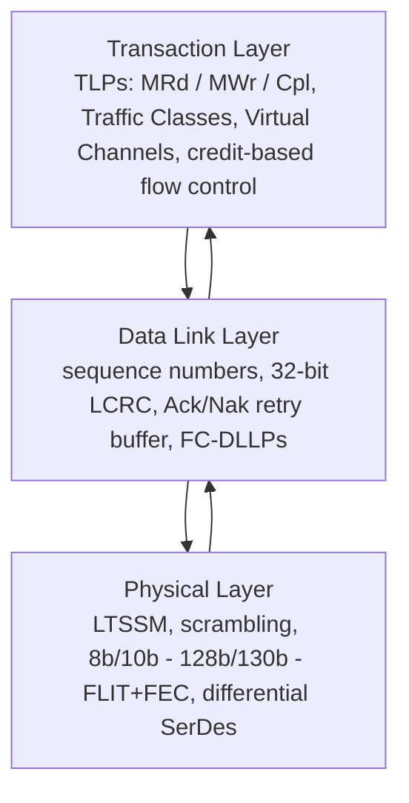

*图 3.1——三层 PCIe 协议栈。事务在发送端向下流动,在接收端向上流动;数据链路层提供的可靠传递(重传)和无损流量控制(信用)机制,在更大规模上被 CXL 和 InfiniBand 所延续。*

PCIe 的协议被组织为三层,在概念上类似于(但又不同于)OSI 分层:**事务层(Transaction Layer)**、**数据链路层(Data Link Layer)**和**物理层(Physical Layer)**。数据在发送端沿协议栈向下流动(事务层 → 数据链路层 → 物理层),在接收端沿协议栈向上流动。理解这些层次至关重要,因为 CXL(第 04 篇)复用了 PCIe 的物理层以及(对于 CXL.io 而言)事务层,同时又添加了自己的一致性协议;而分层结构也解释了时延、可靠性和流量控制的来源。

##### 事务层

事务层是请求产生的地方。它将各种操作打包成 **TLP(事务层报文,Transaction Layer Packet)**,这是 PCIe 通信的基本单元。TLP 类型包括:

- **内存读(MRd)与内存写(MWr)**——最主要的两类操作,用于读写系统或设备内存。内存写是**已提交(posted)**的(不需要等待完成响应——在事务层"发出即忘",可靠性由更底层提供),而内存读是**非提交(non-posted)**的(需要携带数据的完成报文)。
- **配置读/写(CfgRd/CfgWr)**——访问设备的配置空间,在枚举过程中用于发现和设置设备。
- **I/O 读/写**——对 x86 I/O 端口空间的传统访问方式,在现代系统中已基本沦为遗留功能。
- **消息(Msg/MsgD)**——用于中断的带内信令(MSI/MSI-X 实际上是内存写操作,但传统的 INTx 及各类事件使用消息)、电源管理以及错误报告。
- **完成报文(Cpl/CplD)**——对非提交请求的响应;CplD 携带数据(用于读操作),Cpl 仅携带状态(用于需要确认的写操作)。

一个 TLP 头部要么是 **3 个双字(12 字节)**,要么是 **4 个双字(16 字节)**,较长的形式携带 64 位地址(相对于 32 位)。关键的头部字段包括:

- **地址**——32 位或 64 位,标识目标内存或 I/O 位置。
- **请求方 ID**——即 **BDF(总线号、设备号、功能号,Bus number, Device number, Function number)**,唯一标识 PCIe 层级结构中发起请求的功能单元,用于将完成报文路由回请求方。
- **标签(Tag)**——一个标识符,允许一个请求方同时有多个未完成的非提交请求在途;完成报文携带匹配的标签,以便请求方能够将响应与请求相关联。标签字段的宽度(在后期规范中为 8、10 或 14 位)限定了未完成请求的数量上限,这直接影响高时延链路上可实现的带宽(带宽 = 在途数据量 ÷ 往返时延)。
- **属性**——修改排序和缓存行为的标志位:**松弛排序(Relaxed Ordering,RO)**允许结构相对于其他事务对本事务重新排序以提升性能;**不监听(No Snoop,NS)**告知系统该事务无需与 CPU 缓存进行核对(用于已知 CPU 不会缓存的数据);**基于 ID 的排序(ID-based Ordering,IDO)**放松了来自不同请求方的事务之间的排序约束。
- **字节使能(Byte Enables)**——细粒度指示一个双字内哪些字节有效。
- **TLP 摘要(TLP Digest)**——一种可选的端到端 CRC(ECRC),覆盖整个 TLP,提供超出链路级 CRC 的数据完整性保护。

##### 数据链路层

数据链路层将事务层尽力而为的 TLP 流转变为跨单条链路的**可靠、按序**交付服务。它通过两种机制来实现这一点:确认/重传协议和基于信用的流量控制,二者都由 **DLLP(数据链路层报文,Data Link Layer Packet)**承载。

**可靠交付(Ack/Nak):** 每个传输的 TLP 都被分配一个**序列号**,并由一个 **32 位 LCRC(链路 CRC,Link CRC)**保护。发送方在**重传缓冲区**中保留每个 TLP 的副本,直到接收方确认为止。接收方检查每个到达 TLP 的 LCRC 和序列号;如果正确且顺序无误,它会周期性地发送携带成功接收的最高序列号的 **Ack DLLP**,使发送方能够从重传缓冲区中释放截至该序号的所有 TLP。如果某个 TLP 到达时 LCRC 错误或顺序不对,接收方会发送 **Nak DLLP**,发送方便从重传缓冲区中**重放**从上一个已确认序列号之后的所有 TLP。序列号空间为 12 位(4,096 个取值),限定了在途未确认 TLP 的数量。正是这种重传机制使得 PCIe 即便存在偶发的比特错误也依然可靠——而在 PCIe 6.0/7.0 中,它为内联 FEC 无法纠正的少数错误提供了兜底。

**流量控制(信用):** PCIe 从不会因为接收缓冲区已满而丢弃 TLP,因为它使用**基于信用的流量控制**。在发送 TLP 之前,发送方必须拥有足够的信用,而接收方通过**流量控制(FC)DLLP** 通告可用的缓冲区空间作为信用。信用被分别针对六个类别进行追踪,即三种 TLP 类别与两种资源类型的交叉组合:
- **已提交头部/已提交数据**(用于已提交写操作和消息),
- **非提交头部/非提交数据**(用于读操作和非提交写操作),
- **完成头部/完成数据**(用于完成报文)。

这种分离防止了某一类流量饿死另一类流量,并且对于避免死锁至关重要:即使已提交队列和非提交队列已满,完成报文也必须能够继续推进,这正是完成报文被单独进行流量控制的原因。每个**虚拟通道(Virtual Channel,VC)**都拥有自己独立的一整套上述六个信用池。

数据链路层还承载用于在链路电源状态之间转换的**电源管理 DLLP**。

##### 物理层

物理层分为**逻辑子块**和**电气子块**。

**逻辑子块**负责编码(Gen1/2 使用 8b/10b,Gen3—5 使用 128b/130b,Gen6 及以后基于 FLIT)、加扰,以及用于管理链路的**有序集(ordered sets)**:用于建立和配置链路的 **TS1 和 TS2** 训练序列、**EIEOS(电气空闲退出有序集,Electrical Idle Exit Ordered Set)**、用于补偿发送端与接收端时钟容差的 **SOS/SKP(跳跃有序集,Skip Ordered Set)**、**EIOS(电气空闲有序集,Electrical Idle Ordered Set)**,以及在退出低功耗状态时用于重新同步的 **FTS(快速训练序列,Fast Training Sequences)**。**加扰(Scrambling)**使用一个已知的伪随机序列(由线性反馈移位寄存器生成,早期代次经典采用多项式 x¹⁶ + x⁵ + x⁴ + x³ + 1,后续代次采用不同多项式)来分散信号的频谱能量,避免产生会造成电磁干扰并劣化时钟恢复的重复图案。

**电气子块**负责实际的差分信令:发送端的驱动电平及去加重/预加重均衡、接收端的均衡(CTLE 和 DFE)、交流耦合,以及满足信号完整性预算的各项模拟细节。

物理层的行为由 **LTSSM(链路训练与状态状态机,Link Training and Status State Machine)**统辖,这是 PCIe 链路管理的核心。其主要状态包括:
- **Detect(检测)**——检测对端是否存在接收方。
- **Polling(轮询)**——交换训练序列以建立比特和符号同步,并就数据速率达成一致。
- **Configuration(配置)**——协商链路宽度(哪些通道可用)、通道反转以及通道间去偏斜。
- **Recovery(恢复)**——在发生错误后或改变速率时重新建立链路;Gen3 及以后的均衡过程发生在此状态。
- **L0**——完全激活的运行状态。
- **L0s、L1、L2、L3**——逐级加深的省电状态(详见下文)。

当链路遇到错误或需要改变速率时(例如,在初始化期间从 Gen1 训练升级到 Gen5),它会经过 Recovery 状态。在 Recovery 中进行的均衡过程——发送端和接收端使用已知测试图案(如 PRBS 序列)迭代调整各自的均衡器系数——正是高代次 PCIe 得以在有损信道上运行的原因,其收敛速度也是信号完整性工程的一个重点关注对象。

**PCIe 6.0 的 FLIT 模式**从根本上重构了物理层的成帧方式:不再采用早期代次那种可变长度、逐个独立成帧的 TLP,而是把流量承载在固定的 **242 字节 FLIT** 中,每个 FLIT 可能承载多个小的 TLP(或一个大 TLP 的一部分)、一个 CRC 以及 FEC。这种重构正是使 PAM4 所需的内联 FEC 得以实现的关键,也是 Gen6 和 Gen7 带宽效率的前提条件。FEC 解码会为每个 FLIT 增加一个较小的固定时延(约 1—2 纳秒量级)。

##### 虚拟通道与流量类别

PCIe 最多支持 **8 个虚拟通道(VC0—VC7)**,其中 VC0 是强制的,其余为可选。每个 VC 都拥有自己的流量控制信用池和缓冲区,提供流量类别之间的隔离。流量在 TLP 头部中被标记为 **8 个流量类别(TC0—TC7)**之一,一个可配置的 **TC 到 VC 的映射**将每个流量类别分配给一个虚拟通道。这套机制提供了服务质量保障:对时延敏感的流量可以被隔离在自己的 VC 中,不受另一个 VC 中批量流量的队头阻塞影响。VC 仲裁(在多个 VC 之间采用轮询或加权轮询,在为交换机供给流量的多个端口之间采用严格优先级或轮询)决定带宽如何分配。实践中,大多数消费级系统以及许多服务器系统只使用 VC0,但在对 QoS 有严格要求的系统中会出现多 VC 配置。

##### 地址转换、虚拟化与安全

PCIe 包含一整套广泛的虚拟化、隔离与安全特性,这些特性在多租户数据中心中至关重要:

- **SR-IOV(单根 I/O 虚拟化,Single Root I/O Virtualization)**允许单个物理 PCIe 设备呈现为多个虚拟设备。一个设备暴露一个**物理功能(Physical Function,PF)**和多个轻量级的**虚拟功能(Virtual Function,VF)**,每个 VF 都可以直接分配给一台虚拟机。这使得虚拟机能够以接近原生的性能驱动网卡或加速器,而无需管理程序(hypervisor)介入每一次事务——这对高性能网络和 GPU 虚拟化至关重要。举例来说,一块 ConnectX 网卡可以向不同的虚拟机或容器暴露数十甚至数百个 VF。
- **ARI(替代路由 ID 解释,Alternative Routing-ID Interpretation)**重新解释了 BDF,使单个设备能够暴露超过 8 个功能(传统限制),从而支持 SR-IOV 所需的大量 VF。
- **ACS(访问控制服务,Access Control Services)**控制 PCIe 端点之间的对等(peer-to-peer)流量,可以允许或强制将对等事务路由到根联合体(从而经过 IOMMU)以实现隔离。ACS 对于安全地允许或限制 GPU 到 GPU、或 GPU 到网卡的直接 DMA 至关重要。
- **PASID(进程地址空间标识符,Process Address Space Identifier)**为事务打上其所针对的进程地址空间的身份标签,使 IOMMU 能够维护按进程划分的地址转换。PASID 使得设备与应用程序之间实现**共享虚拟内存**——GPU 或加速器可以直接操作应用程序的虚拟地址,由 IOMMU 负责转换,而无需要求固定的、物理寻址的缓冲区。
- **PCIe IDE(完整性与数据加密,Integrity and Data Encryption)**在链路上对 TLP 负载进行加密和完整性保护,为跨 PCIe 链路传输中的数据提供机密性。IDE 是机密计算和可信执行环境的基础构件,确保在 CPU 与加速器(或 CXL 内存设备)之间移动的数据不会被受损的中间环节观察或篡改。

**IOMMU(输入输出内存管理单元,Input/Output Memory Management Unit)**——英特尔的 VT-d、AMD 的 IOMMU、Arm 的 SMMU——位于 PCIe 设备与系统内存之间,负责将设备可见的(I/O 虚拟)地址转换为物理地址,并强制执行访问权限。IOMMU 与 PASID、ACS 一起,是使放心地将某个 PCIe 设备直接交给虚拟机控制成为可能的关键:设备只能对 IOMMU 允许的内存执行 DMA。

#### PCIe 电源管理深度解析

在数据中心场景中,电源管理正变得日益核心——成千上万条链路,每条各消耗数瓦,累积起来就是可观的功耗,而空闲的链路则会白白浪费能量。PCIe 定义了一套通过 LTSSM 和 ASPM 管理的电源状态层级。

**ASPM(主动状态电源管理,Active State Power Management)**在空闲期间自动将链路转换到低功耗状态,对软件透明:
- **L0s** 是一种快速、浅层的低功耗状态,在链路某一方向短暂空闲时进入;退出时延约为 100 纳秒量级。L0s 以极小的性能影响节省适度的功耗。
- **L1** 是更深的状态,发送端和接收端均处于电气空闲,PLL 可能被关闭;退出时延为微秒量级(通常为 1—4 微秒)。L1 节省更多功耗,但会给下一次事务带来实实在在的时延代价。
- **L1 子状态(L1.1 和 L1.2)**进一步推进,关闭共模保持器,并且在 L1.2 中允许完全关闭参考时钟和 PLL,链路通过 **CLKREQ#** 边带信号来指示其就绪状态。这些子状态在移动设备以及空闲的数据中心 NVMe 驱动器中被大量使用,以最小化待机功耗。

更深一层,**L2** 是接近完全关闭的状态,主电源被移除(仅保留用于唤醒事件的辅助电源),**L3** 则是完全关闭。

**L0p** 是 PCIe 6.0 引入的一项性质不同且重要的新增功能:它允许链路在**不进行完整重训练周期**的情况下**动态减少其激活通道宽度**。一条经历轻负载流量的 x16 链路可以关闭其中 8 条或 12 条通道,以 x8 或 x4 的方式运行,并在流量增加时重新启用它们——所有这些都在依然处于激活的 L0 状态族之内完成。这对于**突发性流量**(例如在密集的数据暂存突发与计算受限的空闲期之间交替的 AI 加速器)极具价值,使链路能够让功耗跟随实际利用率变化,而不是持续消耗全部 x16 的功率。

存储设备增加了自己的状态:**DevSleep**(用于 SATA/NVMe 驱动器的低功耗状态)以及各种 NVMe 定义的电源状态,与 PCIe 电源管理相集成,以最小化超大规模存储中庞大 NVMe 集群的待机功耗。

#### PCIe 在数据中心场景中的应用

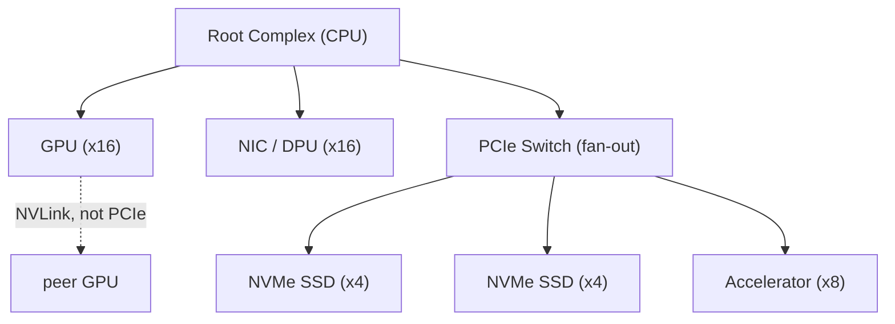

*图 3.2——PCIe 是一棵严格以 CPU 根联合体为根的树状结构。请注意,GPU 到 GPU 的流量使用 NVLink(虚线),而非 PCIe——PCIe 是 CPU 到 GPU 的数据暂存与 GPU 到网卡的通路,而不是 GPU 到 GPU 的训练通路(第 07 篇)。*

##### GPU 连接与 PCIe 带宽问题

一个常见的误解是,PCIe 是 AI 训练中 GPU 到 GPU 通信的瓶颈。事实并非如此——理解为什么并非如此,能够揭示整个 AI 服务器架构的全貌。以 NVIDIA H100 为例:其 HBM3 内存提供约 **3.35 TB/s** 的带宽,而一条 PCIe 5.0 x16 链路单方向仅提供约 **63 GB/s**——大约低了 **53 倍**。如果 GPU 到 GPU 的通信必须经过 PCIe,训练将陷入无可救药的瓶颈。

答案在于,GPU 到 GPU 的通信**并不**使用 PCIe;它使用 **NVLink**(第 07、15 篇),通过 NVSwitch 为每块 H100 GPU 提供 900 GB/s 的双向带宽——是 PCIe 5.0 x16 数值的十四倍。PCIe 在 AI 服务器中的角色不同且互补:它是 **CPU 到 GPU 的数据暂存通路**和 **GPU 到网卡的通路**。PCIe 负责将数据和参数从主机内存(以及来自存储和网络)初始加载到 GPU 内存中,并承载控制和管理流量。就这些角色而言,PCIe 5.0 的 63 GB/s 尚且够用,但正在变得吃紧,这正是为什么 CXL 和更快代次的 PCIe 至关重要:随着模型规模增长、数据暂存需求上升,CPU-GPU 通路正成为真正的制约因素,而行业的应对之道正是更快的 PCIe(Gen6、Gen7)以及一致性的 CXL 挂载内存。

##### 基于 PCIe 的 NVMe 与 NVMe-oF

PCIe 是 **NVMe(非易失性内存高速传输标准,Non-Volatile Memory Express)**的原生传输方式,这一协议通过用一种为 NAND 闪存的并行性和 PCIe 的低时延而设计的方案,取代了传统的 AHCI/SATA 命令模型,从而彻底革新了闪存存储。NVMe 最多暴露 **65,535 个 I/O 队列**,每个队列最多有 **65,536 个条目**,支持大规模并行——每个 CPU 核心都可以拥有自己独享的通往驱动器的队列对,从而消除了锁竞争。经由 PCIe 的端到端 NVMe 时延远低于 100 微秒,对于缓存命中或 SLC 缓冲的操作,通常处于几十微秒的低位区间。NVMe 的队列模型与网络化传输高度契合,以至于 **NVMe-oF(基于结构网络的 NVMe,NVMe over Fabrics)**能够通过 RDMA、TCP 或光纤通道承载相同的提交/完成队列语义,以接近本地 NVMe 的时延访问远程存储(第 18 篇)。

##### PCIe 交换机与非透明桥接

当系统需要比 CPU 根联合体所能提供的更多 PCIe 端点时——例如,一台装满大量 NVMe 驱动器或大量加速器的服务器——就会使用 **PCIe 交换机**。占主导地位的厂商是 **博通(Broadcom,PLX/PEX 系列,收购自 PLX Technology)** 和 **美高森美(Microchip,Switchtec,收购自 Microsemi)**。一台 PCIe 交换机将单个上行端口扇出为多个下行端口,把多个设备复用到 CPU 的通道上(并在受 ACS 约束的前提下,提供下行设备之间的对等路径)。**非透明桥接(Non-Transparent Bridging,NTB)**是交换机的一项特性,允许两个独立的 PCIe 层级结构(例如两台 CPU/主机)通过交换机进行通信,同时保持各自地址空间相互隔离,常用于高可用存储控制器以及部分多主机系统。

##### 重定时器与再驱动器

随着信令速率的攀升,无源 PCB 信道已无法将信号传输足够远的距离,**信号调理芯片**变得不可或缺。**再驱动器(redriver)**是一种模拟器件,它增强并均衡信号,但并不恢复时钟;**重定时器(retimer)**则是更为复杂的数字器件,它完全恢复时钟和数据,并重新发送干净的信号,从而有效地重置了信道预算。重定时器具备协议感知能力(它们参与 LTSSM 训练),并可以级联以延伸传输距离。重定时器市场——**德州仪器(Texas Instruments)、Parade Technologies、Astera Labs、Kandou、Montage** 等——随 PCIe 5.0 迅速壮大,在该代次中,长度超过约 8—10 英寸的信道通常就需要重定时器,而在 PCIe 6.0/7.0 中则更加关键,因为重定时器可能在短得多的距离上就有需求。**Astera Labs** 尤其在很大程度上依靠 PCIe/CXL 重定时器以及面向 AI 服务器的"智能结构"连接技术,建立起可观的业务并完成了备受瞩目的 IPO,这说明高速 PCIe 下的信号完整性挑战已经催生出一整个芯片品类。

##### CXL:PCIe 的一致性超集

CXL(Compute Express Link)直接构建于 PCIe 物理层之上——相同的电气信令、相同的连接器、相同的通道——并复用 PCIe 事务层作为其 CXL.io 子协议的基础,同时增加了缓存一致性(CXL.cache)和内存语义(CXL.mem)协议。CXL 1.1/2.0 运行于 PCIe 5.0 之上;CXL 3.0 运行于 PCIe 6.0 之上。由于 CXL 设备在传统操作系统看来就是 PCIe 设备,这两项标准深度交织在一起。第 04 篇将对 CXL 进行全面深入的介绍;此处的关键要点是,PCIe 的物理层和协议基础使其成为内存解耦革命天然的基底。

##### PCIe 7.0 / 光学 PCIe 的挑战

在 **128 GT/s(PCIe 7.0)**下,铜介质上的信道损耗预算变得几乎无法承受任何有意义的传输距离。这正是**光学 PCIe** 从研究课题走向路线图的转折点。通过光纤运行 PCIe——使用可插拔光模块或共封装光引擎,以 OIF 的 **CEI-224G** 电气接口作为 SerDes 基础——将使 PCIe(以及 CXL)得以超越铜缆几英寸的传输距离,延伸至数米,支持机架规模的一致性结构和以光学方式互连的解耦内存池。PCI-SIG 拥有一个活跃的光学工作组,而光学 PCIe 与光学 CXL 以及更广泛的共封装光学运动(第 13 篇)的融合,是 2020 年代后期具有决定性意义的技术脉络之一。

#### PCIe 竞争与生态格局

##### 芯片与 IP 生态

PCIe 由一个分层的生态系统实现:
- **交换机与重定时器芯片**:博通(PEX 交换机)、美高森美(Switchtec 交换机)、Astera Labs、德州仪器、Parade、Montage 以及 Kandou(信号调理与重定时器)。
- **控制器芯片**:Marvell、美高森美等厂商构建基于 PCIe 的 NVMe SSD 控制器;网卡和加速器厂商则将 PCIe 控制器集成进自己的设备中。
- **PCIe IP 核**:大多数芯片设计公司并不从零开始构建 PCIe 控制器;它们从 **新思科技(Synopsys,DesignWare)** 和 **Cadence** 这两家占主导地位的 IP 供应商那里获取 **PCIe 控制器与 PHY IP** 授权。一颗现代 SoC 的 PCIe 接口通常是一个新思科技或 Cadence 的控制器加上一个硬化的 PHY,经过集成并针对 PCI-SIG 一致性认证项目进行验证。正是这种 IP 授权模式,使得 PCIe 的互操作性如此稳健:业界大多数 PCIe 接口都源自数量不多的、经过充分验证的 IP 核。

##### PCIe 与竞争性互连技术的对比

PCIe 并非孤立存在;它处在一个由多种互连技术构成的竞争格局中,每一种都针对不同的细分场景进行了优化:
- **NVLink(NVIDIA,专有)**为 GPU 到 GPU 的纵向扩展(scale-up)提供远高得多的带宽(H100 双向 900 GB/s,Blackwell 达 1.8 TB/s),而这正是 PCIe 带宽不足的领域。NVLink 是 NVIDIA 的专有技术。
- **UALink(超级加速器链路,Ultra Accelerator Link)**是一项开放标准,由 AMD、英特尔、博通、思科、谷歌、慧与(HPE)、Meta 和微软共同支持,明确旨在为加速器到加速器的纵向扩展提供 NVLink 的开放替代方案。UALink 的目标是约 200 GB/s 级别的双向链路和大规模纵向扩展域,并且它可以将 PCIe 物理层用作一种传输选项(第 24 篇)。
- **Gen-Z** 是一项更早期的内存语义结构项目,连同 **CCIX**(由 Arm 主导的缓存一致性互连)和 **OpenCAPI**(由 IBM 主导的一致性互连)一起,最终都被并入了 **CXL**。这些项目全部整合进构建于 PCIe 之上的 CXL,生动说明了 PCIe 的强大引力:行业并没有陷入多种相互竞争的一致性互连技术的泛滥,而是收敛到了一个建立在通用 PCIe 基底之上的单一标准。

##### PCIe 路线图汇总

| 代次 | 每通道速率 | 编码方式 | x16 单方向带宽 | 调制方式 | 备注 |
|---|---|---|---|---|---|
| 1.0 | 2.5 GT/s | 8b/10b | 约 4 GB/s | NRZ | 首代 PCIe |
| 2.0 | 5.0 GT/s | 8b/10b | 约 8 GB/s | NRZ | — |
| 3.0 | 8.0 GT/s | 128b/130b | 约 15.75 GB/s | NRZ | 高效编码 |
| 4.0 | 16 GT/s | 128b/130b | 约 31.5 GB/s | NRZ | AMD 主导的应用 |
| 5.0 | 32 GT/s | 128b/130b | 约 63 GB/s | NRZ | AI 主流、CXL 1.1/2.0,重定时器普遍使用 |
| 6.0 | 64 GT/s | FLIT + FEC | 约 126 GB/s | PAM4 | FLIT、强制 FEC、L0p、CXL 3.0 |
| 7.0 | 128 GT/s | FLIT + FEC | 约 256 GB/s | PAM4 | 光学 PCIe、极端信号完整性挑战、CEI-224G |

#### 深度扩展:带宽效率、未完成请求数与实际吞吐量

PCIe 的标称带宽数字(例如 Gen5 x16 的约 63 GB/s)是原始链路速率;**实际可达到的吞吐量**更低,并取决于一些值得理解的微妙协议因素,因为它们决定了设备的真实性能。首先是**编码与成帧开销**:Gen3—5 的 128b/130b 编码开销约为 1.5%,而每个 TLP 的开销(头部、序列号、LCRC、成帧)意味着小型传输的效率远不如大型传输——一个携带 64 字节负载的 TLP,其字节中相当一部分被约 20 多字节的头部和成帧信息占用,因此**有效效率随负载大小增加而提升**(最大负载大小,即 MPS,是一个协商参数,通常为 256 或 512 字节,对此设有上限)。其次,更微妙的是,读操作的吞吐量受**未完成请求数量**限制:由于内存读是非提交的(请求发出,完成报文稍后返回),可达到的读带宽等于在途数据量除以往返时延,而在途数据量受**标签(tag)**字段(用于标识未完成请求)以及接收方完成信用可用量的限制。如果标签空间或信用相对于链路的时延—带宽积而言过小,读操作就无法使链路饱和,无论其原始速率如何——这正是后期 PCIe 代次将标签字段扩展到 10 位和 14 位的原因,也是高性能设备需要仔细管理未完成请求深度的原因。实践的教训是:PCIe 的实际吞吐量是负载大小、MPS、流量控制信用以及未完成请求深度共同作用的结果,而不仅仅取决于链路速率,要提取出完整带宽(尤其是在高时延路径上的读操作)需要对所有这些因素予以关注。

#### 深度扩展:信号完整性、均衡与重定时器经济

PCIe 在 Gen5 时需要重定时器、在 Gen6/7 时更加需要重定时器的原因值得展开讨论,因为它揭示了与推动交换领域走向共封装光学(第 13 篇)的电气信道损耗壁垒相同的底层逻辑。随着信令速率的提升(2.5 → 32 → 64 → 128 GT/s),信号中的高频成分增加,而印刷电路板信道——伴随其介质损耗、导体的趋肤效应损耗、连接器和过孔处的阻抗不连续,以及串扰——对信号的衰减和失真愈发严重。超过某个插入损耗(在奈奎斯特频率处以 dB 计量)之后,无论接收端均衡(CTLE + DFE)如何努力都无法恢复到可接受的误码率。Gen5(32 GT/s)在大约 8—10 英寸典型 PCB 走线加一个连接器处就触及这道壁垒;Gen6/7(PAM4,其带来 9.5 dB 的信噪比损失)在更短的距离上就会触及这道壁垒。补救办法就是**重定时器**——一种具备协议感知能力的芯片,它完全恢复时钟和数据并重新发送干净的信号,从而重置信道预算——在 Gen5/6 下,只要服务器中 CPU 与远端插槽或背板之间存在任何有意义的走线长度,就需要在路径中配备一个或多个重定时器。

这催生了一整个芯片品类以及若干知名企业(Astera Labs、Parade、德州仪器、Montage、Kandou),而"重定时器经济"正是光学世界信号完整性挑战的直接类比。对于更长的传输距离或更恶劣的信道,即便是重定时器最终也会变得不够用或不经济,而这恰恰就是**光学 PCIe**(通过 OIF CEI-224G 电气接口以及可插拔/共封装光模块,让 PCIe 运行于光纤之上)变得有吸引力的门槛——PCI-SIG 活跃的光学工作组正体现了这样一种认识:正如交换机到前面板链路的情形一样,PCIe 的电气信道正在触及一道最终只有光学才能克服的壁垒。PCIe 的信号完整性故事与共封装光学的故事,归根结底是同一个故事在互连层级结构不同位置上的不同讲法。

#### 深度扩展:PCIe、CXL 及二者在单条链路上的共存

一个经常引发困惑的问题是,鉴于 CXL 运行在 PCIe 物理层之上(第 04 篇),PCIe 和 CXL 究竟如何共存。在链路训练阶段,一个同时具备两种能力的端口会执行**替代协议协商**:它判断链路对端是普通的 PCIe 设备还是 CXL 设备,如果是 CXL 设备,则建立 CXL 的"flex bus",在相同的物理通道上动态复用三个 CXL 子协议(CXL.io、CXL.cache、CXL.mem)。关键在于,**CXL.io 本质上就是 PCIe**——它使用 PCIe 的 TLP/DLLP 事务层和数据链路层——因此一个 CXL 设备始终可以像 PCIe 设备一样被枚举和控制(保证了向后兼容性和操作系统回退能力),而 CXL.cache 和 CXL.mem 则增加了 PCIe 所缺乏的缓存一致性和内存语义流量,由 flex-bus 逻辑以固定的、低时延的成帧方式与 CXL.io 交织在一起。物理层(SerDes、均衡、重定时器、连接器)是共享的,这正是 CXL 继承了 PCIe 整套物理基础设施的原因,也是 CXL 2.0 设备运行在 PCIe 5.0 通道上、CXL 3.0 设备运行在 PCIe 6.0 通道上的原因。这种分层复用——CXL 在 PCIe 的物理层以及(对于 CXL.io 而言)事务层之上叠加一致性和内存语义——正是行业将其一致性互连的努力整合到 CXL 上、而不是另外发明一套物理层的架构原因,也是为什么透彻理解 PCIe(本章)是理解 CXL(第 04 篇)以及内存解耦的未来(第 24 篇)的前提。

#### 深度扩展:枚举、拓扑树与地址空间

PCIe 塑造系统构建方式的一个基础性方面,是其**枚举(enumeration)**模型以及它所强加的严格树状拓扑。一个 PCIe 层级结构是一棵以(CPU 中的)**根联合体**为根的树,通过**交换机**(每个交换机拥有一个上行端口和多个下行端口)分支,直到**端点**(设备)。在启动时,系统固件执行**枚举**过程:对该树进行深度优先遍历,读取每个设备的配置空间以发现其身份(厂商/设备 ID)及其资源需求(需要多少内存映射 I/O 以及多少总线号),然后为每个设备分配一个 **总线:设备:功能(Bus:Device:Function,BDF)** 标识符,并为其 **BAR(基地址寄存器,Base Address Registers)** 划分出物理地址空间的区域,将设备的寄存器和内存映射进 CPU 的地址空间,使 CPU 的读写操作能够到达该设备。这一枚举过程生成了操作系统所看到的 **PCIe 拓扑树**,而 BDF 和 BAR 的分配决定了后续每一次事务的路由与寻址方式。

树状拓扑带来了一些后果。由于 PCIe 严格采用层级结构(而非网状结构),不同交换机下的两个端点之间的流量必须先向上抵达共同的祖先节点,再向下传递——而对等流量(例如通过 PCIe 进行的 GPU 到 GPU DMA,或网卡到 GPU 的 GPUDirect)则要受到每个交换机上的 ACS(访问控制服务)策略约束,该策略可能会将流量强制上行到根联合体(经过 IOMMU)以实现隔离,从而增加时延。这正是 GPU 到 GPU 通信使用 NVLink 而非 PCIe 的原因之一(第 07 篇):PCIe 的树状拓扑以及由 ACS 中介的对等通信,并未针对 AI 所需的密集全对全 GPU 通信进行优化。枚举模型同时也是热插拔和 SR-IOV 的基础:添加一个热插拔设备会触发其子树的重新枚举,而 SR-IOV 的虚拟功能则表现为额外的 BDF(通过 ARI 突破 8 功能限制而实现),每个都可以独立分配给一台虚拟机。理解枚举过程和地址空间映射,对于理解 CPU 究竟如何实际到达并控制由 PCIe 连接的 GPU、网卡和存储至关重要。

#### 深度扩展:热插拔、可维护性与 EDSFF 外形规范

数据中心的运维现实——成千上万块 NVMe 驱动器会出故障,必须在不停机的情况下更换——推动了消费级市场极少见到的 PCIe 特性与外形规范。**热插拔(Hot-plug)**(在系统运行时插入或移除设备)和**意外移除(surprise removal)**(在没有事先软件通知的情况下移除设备)都需要精心的协调:PCIe 规范、平台固件和操作系统必须使受影响设备的流量静默、处理链路下线、在插入时重新枚举,并在意外移除后优雅地恢复而不导致系统崩溃。这并非易事——正在被使用的设备遭意外移除时绝不能导致系统数据损坏——而稳健的热插拔支持是数据中心的一项关键需求,**EDSFF(企业与数据中心 SSD 外形规范)**家族正是围绕这一需求设计的。

EDSFF(E1.S、E1.L、E3.S、E3.L 外形规范)取代了从笔记本电脑挪用而来的 M.2 以及传统的 2.5 英寸 U.2,以专为数据中心 NVMe 打造的外形规范应对以下需求:**密度**(在机箱中容纳更多驱动器)、**散热**(为高功率闪存提供充足的气流和散热)、**可维护性**(前面板可访问、可热插拔、无需工具)以及**容量扩展**(E1.L "长尺"外形规范使单块驱动器的闪存容量最大化)。EDSFF 如今已是新款数据中心闪存的主流外形规范,它体现了 PCIe 的物理和运维细节是如何被数据中心的特定需求——密度、可维护性、散热以及可靠的热插拔——所塑造的,而非沿袭 PCIe 起源的桌面传统。这个不起眼的驱动器外形规范,实际上是对超大规模场景下闪存运维经济学的精心工程回应,在这种场景中,驱动器是一种持续被维护、被热插拔、受密度和散热约束的资源。

#### 深度扩展:决定正确性的标签、信用与排序规则

在 PCIe 的性能表现之下,存在一整套决定正确性的**排序与流量控制规则**,它们微妙到值得专门讨论,因为违反这些规则会导致死锁和数据损坏。PCIe 强制执行**生产者—消费者排序**:已提交写(内存写)之间不得相互超越,这确保了如果一个设备先写入数据、再写入一个"完成"标志,那么读到该标志的读者必定能够看到对应的数据——这正是设备驱动程序正确通信的基础。读操作并非在所有情况下都会推动写操作前进,而**松弛排序**和**基于 ID 的排序**属性则在软件确知重新排序是安全的情况下,有意放松这些规则以提升性能。流量控制信用类别(已提交、非提交、完成,每类又分为头部和数据——如上文所述)之所以存在,正是为了防止**死锁**:即使已提交队列和非提交队列已满,完成报文也必须始终能够继续推进,因为一个设备如果因为等待一个无法送达的完成报文(因为其队列已被无法排空的已提交写操作占满)而被阻塞,就会发生死锁——因此完成报文在一个独立的信用池上进行流量控制,已提交/非提交流量无法耗尽该信用池。

这些规则——排序保证以及分离的信用池——在一切正常运作时是不可见的,但它们是 PCIe 正确性的基石,并且它们以不同的形式在每一种可靠的互连中反复出现(InfiniBand 的虚拟通道和信用池,第 07 篇,体现了相同的死锁避免原则)。它们同时也说明了一个关于互连技术的普遍真理:困难的部分并不在于快速地传输比特,而在于在保证排序、防止死锁并维持可靠性的同时做到这一点——正是同样的挑战,在机架规模上,催生了 PFC 死锁(第 06 篇)和 RDMA 丢包灾难(第 08 篇)。PCIe 的三层协议,连同其排序规则和分离的信用池,堪称互连正确性方面的典范之作,本知识库其余部分所述的各种结构都在更大规模上延续着它的思路。

#### 深度扩展:作为平台心跳的 PCIe 节奏

最后值得一提的是,**PCIe 的代际节奏**——每三年大约将每通道带宽翻一番——扮演着整个服务器平台心跳的角色,协调着 CPU、加速器、网卡、存储以及(通过 CXL)内存的演进。由于如此多的设备都通过 PCIe 挂载,每一代新规范都限定了整个生态系统可用的带宽:一款新 GPU 的主机暂存带宽、一款新网卡的主机接口、一块新 NVMe 驱动器的吞吐量,以及一台新 CXL 设备的链路,都随着 PCIe 代次一同演进。这使得 PCI-SIG 的路线图成为业界最具影响力的路线图之一,也意味着 CPU 对新一代 PCIe 的支持时机(英特尔和 AMD 的服务器路线图)实际上决定了其周围加速器和设备可用带宽的推进节奏。

AI 时代给这一节奏带来了异乎寻常的压力。CPU 到 GPU 数据暂存瓶颈的收紧、CXL 内存的带宽需求,以及高速网卡的胃口,都在推动 PCIe 更快地演进——这正是 PCIe 6.0 和 7.0 相较于更早代次那种从容步调而以加速时间表推出的部分原因,也是为何要探索光学 PCIe(见上文)以突破铜缆壁垒的原因。PCIe 的节奏,长期以来一直是一种稳定的背景韵律,如今已成为更为紧迫的驱动力,而它的加速正是 AI 建设浪潮重塑基础技术时间表的诸多方式之一。作为一切其他事物都依附其上的基底,PCIe 的步调设定了整个平台的节拍,而保持这一节拍——通过更快的代次、CXL,以及最终的光学化——对于让系统其余部分得到充分供给至关重要。这条不起眼的扩展总线,历经二十年,依然是服务器的节拍器。

#### 结语:作为持久基底的 PCIe

PCIe 二十年的历史,是一个关于精心设计的标准如何长盛不衰的案例研究:通过选择正确的根本架构(串行、差分、点对点、可按通道扩展),通过保持严格的向后兼容性,通过按可预期的节奏使带宽翻倍,以及通过吸纳相邻功能(虚拟化、安全性,以及——通过 CXL——内存一致性)而不是被它们取代。在 AI 数据中心中,PCIe 并不是那种光鲜亮丽的互连技术,但它却是其他一切都依赖的技术:CPU 到加速器的通路、主机到网卡的通路、NVMe 存储的基础、CXL 的物理层,以及 Gen7 光学扩展的候选对象。随着互连层级结构日趋扁平化、内存日趋解耦,PCIe——通过 CXL 以及通过光学扩展——有望在可预见的未来继续充当服务器的结缔组织。下一章将转向 CXL,这一将 PCIe 从一条 I/O 总线转变为解耦、可组合内存基础的一致性与内存语义超集。

[↑ 返回目录 / Back to Table of Contents](#目录--table-of-contents)

---

<a id="sec-27-5"></a>
## 27.5 CXL(Compute Express Link)——架构、协议、内存语义与路线图

**中文翻译，原文见:** [04_cxl_deep_dive.md](04_cxl_deep_dive.md)

---

### CXL(Compute Express Link)——架构、协议、内存语义与路线图

#### 引言:重新定义内存的互连技术

Compute Express Link(CXL)是 2020 年代最具深远意义的新型互连标准,因为它所攻克的问题是任何单纯的算力扩展都无法独自解决的:**内存墙(memory wall)**。随着处理器的核心数量和加速器的浮点算力以惊人速度增长,内存子系统——受限于一颗 CPU 所能驱动的 DIMM 插槽数量、DDR 通道的带宽以及 DRAM 的成本——却逐渐被远远甩在后面。CXL 是业界协同给出的答案。它将朴实无华的 PCIe 链路转变为一种缓存一致、具备内存语义的结构,使内存能够突破 DIMM 插槽的限制而扩展、跨主机共享、动态池化并重新分配,并被加速器以一致性方式访问。在此过程中,CXL 开始消融"互连技术"与"内存系统"之间的界限,并为第 24 篇所展望的、面向未来十年的解耦、可组合数据中心奠定了基础。

本章将从 CXL 的起源与战略动因出发,展开其三个子协议与三种设备类型、其交换与内存池化能力、CXL 3.0/3.1 的结构与对等扩展、竞相打造 CXL 产品的 CPU 厂商与内存厂商所构成的密集竞争格局,以及使 CXL 内存变得可用的软件栈。CXL 构建于 PCIe(第 03 篇)之上,因此该篇是本章的前提;CXL 同时也与 AI 结构(第 15 篇)以及未来路线图(第 24 篇)相互交织。

#### CXL 的起源与战略意义

##### 创立与大整合

CXL 由**英特尔于 2019 年**提出,英特尔提交了初版规范并成立了 CXL 联盟,创始成员包括 **阿里巴巴、思科、戴尔易安信(Dell EMC)、Facebook(Meta)、谷歌、慧与(HPE)、华为和微软**——这份名单涵盖了 CPU 厂商、超大规模云厂商以及系统原始设备制造商,从一开始就表明了业界的广泛认同。CXL 1.0 于当年发布,随后不久 CXL 1.1 便对规范进行了细化完善。

CXL 历史中最为不凡之处,是随后发生的**大整合**。在 CXL 出现之前,业界至少存在三项相互竞争的一致性/内存语义互连技术:
- **CCIX(加速器缓存一致性互连,Cache Coherent Interconnect for Accelerators)**,由 Arm 主导,旨在为 PCIe 级链路添加缓存一致性;
- **Gen-Z**,一种由慧与、戴尔等厂商支持的内存语义结构,直接瞄准内存解耦与池化;
- **OpenCAPI(开放一致性加速器处理器接口,Open Coherent Accelerator Processor Interface)**,由 IBM 主导,源自其 POWER 架构中的 CAPI 技术的一致性互连。

每一项技术都各有其价值,但一个碎片化的生态对任何人都没有好处——芯片设计公司无力支持多种互不兼容的一致性结构,而内存和设备厂商也需要一个统一的大市场。在 2020 年至 2022 年间,**Gen-Z、CCIX 和 OpenCAPI 全部将各自的规范和资产转让给了 CXL 联盟**,CXL 由此成为缓存一致性与内存语义互连领域唯一统一的行业标准。这次整合是业界选择走向融合而非碎片化的较为清晰的范例之一,也让 CXL 拥有了异乎寻常强劲的起点。

##### 为什么需要 CXL:内存容量墙与带宽墙

理解 CXL 动因的最佳方式,是将其视为一组具体而棘手的约束条件:

- **内存容量墙。** 一颗现代服务器 CPU 只能直接连接有限数量的 DIMM——通常是 8 到 12 个 DDR5 通道,每个通道配备一到两根 DIMM。一旦这些插槽被占满,要为该 CPU 增加更多内存的唯一办法就是……没有别的办法了,除非换用更大的 CPU 插座。然而,许多工作负载——内存数据库、大规模分析,尤其是模型体量和 KV 缓存占用巨大的 AI 推理与训练——都是受内存容量制约的。CXL 内存扩展器通过 CXL 链路为 CPU 附加额外的 DRAM(或持久内存),从而突破 DIMM 插槽的天花板。

- **内存带宽墙。** 具有 8—12 个通道的 DDR5 提供大约 300—500 GB/s 量级的 CPU 内存带宽——这一数字与 GPU 上每秒数太字节的 HBM 带宽相比相形见绌。CXL 与 DDR 通道并行地增加内存带宽:一台 CXL 挂载的内存设备贡献自己的带宽,多台 CXL 设备可以聚合。虽然单条 CXL 链路的带宽受限于其所运行的 PCIe 通道数,但这种架构允许通过增加链路和设备来扩展带宽。

- **异构系统的一致性。** 现代服务器已不再是纯 CPU 系统;它们装配了 GPU、FPGA、智能网卡以及各类领域专用加速器,所有这些都需要与 CPU 共享数据。如果没有一致性机制,在 CPU 与加速器之间共享数据就需要显式的、由软件管理的数据拷贝和缓存刷新——既慢又容易出错。CXL 在 CPU 与所挂载设备之间提供硬件缓存一致性,使加速器能够读写主机内存(反之亦然),并由硬件维护一致的视图,从而极大简化了异构编程。

##### 构建于 PCIe 之上,向后兼容

CXL 得以快速普及的背后有一项关键设计决策:它**构建于 PCIe 物理层之上**。CXL 使用与 PCIe 相同的电气信令、相同的连接器以及相同的通道。CXL 1.1 和 2.0 运行于 PCIe 5.0(32 GT/s)通道之上;CXL 3.0 运行于 PCIe 6.0(64 GT/s)通道之上。在链路初始化时,一个端口通过"替代协议协商"来决定是以普通 PCIe 链路还是以 CXL 链路的方式运行。这意味着 CXL 复用了整个 PCIe 生态系统——连接器、重定时器、板级设计、信号完整性工程——而一台不理解 CXL 的传统操作系统会将 CXL 设备回退识别为一台 PCIe 设备。这种向后兼容性消除了一道巨大的普及障碍:系统设计者无需发明新的物理基础设施;他们直接复用了 PCIe。

##### 版本演进概览

CXL 经历了若干代次的演进,每一代都增加了重大能力:
- **CXL 1.0 / 1.1(2019 年)**——奠基性版本,定义了三个子协议以及基础形态的设备类型 1 和类型 2(加速器)、类型 3(内存),运行于直接点对点链路之上。
- **CXL 2.0(2020 年)**——增加了**单级交换**和**内存池化**,允许多台主机通过 CXL 交换机共享一个类型 3 内存设备池,并支持持久内存以及完整性/加密特性。
- **CXL 3.0(2022 年)**——一次重大飞跃,升级到 **PCIe 6.0** 物理层(带宽翻倍)、**多级交换与结构化组网**、**对等(peer-to-peer)**设备通信、带有反向失效通知的增强一致性,以及大得多的规模。
- **CXL 3.1(2023 年)**——对结构、安全性(可信执行环境支持)以及可管理性进行了细化完善。

#### CXL 的三个子协议

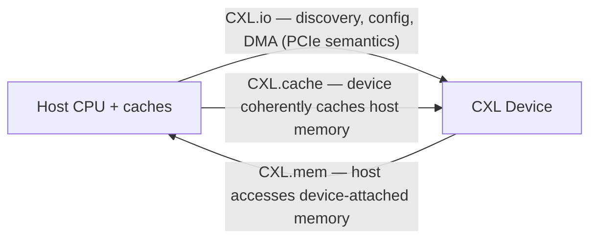

*图 4.1——三个 CXL 子协议在同一条 PCIe 物理链路上复用。CXL.io(强制,兼容 PCIe)承载控制流量;CXL.cache 让设备能够缓存主机内存;CXL.mem 让主机能够访问设备内存。不同设备类型使用不同的子集:类型 1 = io+cache,类型 2 = 三者全部,类型 3 = io+mem。*

CXL 在单条链路上复用了三个不同的子协议,并动态地交织传输它们:**CXL.io**、**CXL.cache** 和 **CXL.mem**。一台具体设备会根据自身类型使用其中的某个子集。这些协议在物理线路上由 CXL flex-bus 逻辑层进行复用,该逻辑层以固定格式、低时延的成帧方式,将 CXL.io 流量(对时延不太敏感)与 CXL.cache 及 CXL.mem 流量(对时延高度敏感)交织在一起。

##### CXL.io——I/O 与控制通路

**CXL.io** 在功能上等同于 PCIe:它直接映射到 PCIe 的 TLP/DLLP 语义之上,用于设备发现、配置、中断、寄存器访问以及 DMA——即控制与管理通路。每台 CXL 设备都必须支持 CXL.io,因为它提供了与 PCIe 相同的枚举和配置设备的机制。CXL.io 正是保证向后兼容性的关键:对枚举软件而言,一台 CXL 设备的 CXL.io 通路与一台 PCIe 设备并无二致。它是三个子协议中对时延最不敏感的一个,承载的是日常事务性工作,而非热点数据通路。

##### CXL.cache——设备对主机内存的缓存

**CXL.cache** 是使**加速器(设备)能够一致性地缓存主机 CPU 内存**的子协议。这正是 CXL 区别于普通 PCIe 的能力所在:加速器可以将主机内存行拉入自己的缓存,对其进行操作,并由硬件保持一切与 CPU 缓存的一致,而无需软件管理的刷新操作。

CXL.cache 定义了两个通道方向,每个方向各携带三种消息类别:
- **D2H(设备到主机,Device-to-Host)**:请求(设备请求一条缓存行,例如用于读取或用于获取所有权)、响应,以及监听响应(设备对主机监听请求的回复)。
- **H2D(主机到设备,Host-to-Device)**:请求、响应,以及监听(主机监听设备的缓存以维护一致性)。

一致性以**缓存行粒度(64 字节)**运作,与 CPU 的缓存行大小相匹配。该协议承载着熟悉的一致性事务:请求共享副本(RdShared)或独占/拥有副本(RdOwn)的读操作、写操作和逐出操作(干净逐出、脏逐出),以及主机为使设备持有的缓存行失效或降级而发出的监听请求(SnpData、SnpInv、SnpCur)。设备的一致性状态机为其所缓存的缓存行维护类 MESI 状态。

一个尤为重要的概念是**偏置模式(bias mode)**,它根据访问模式来优化一致性开销:
- **主机偏置(Host Bias)**:主机被视为一条缓存行的主要所有者/管理者。设备对此类缓存行的访问可能需要与主机协调。这种模式适用于 CPU 正在积极共享该数据的情况。
- **设备偏置(Device Bias)**:加速器被视为所有者,可以以较低的一致性开销访问该缓存行(不需要在每次访问时都涉及主机)。这大幅降低了以 GPU 或加速器为主的访问模式下的时延,在这类模式中,设备操作的是 CPU 当前并未触及的数据。软件(或运行时)可以随着访问模式的变化,在主机偏置和设备偏置之间翻转某个区域的设置。

由此,CXL.cache 使得加速器能够执行**一致性对等 DMA**——以硬件一致性方式直接访问主机内存,而非依赖软件管理的拷贝——这对异构系统的编程模型而言具有变革性意义。

##### CXL.mem——主机访问设备挂载的内存

**CXL.mem** 是反方向的能力:它让**主机 CPU 能够访问物理挂载在某个 CXL 设备上的内存**,仿佛这部分内存就是 CPU 自身地址空间的一部分。这正是 CXL 内存扩展器背后的协议。设备的内存被暴露为 **HDM(主机管理的设备内存,Host-managed Device Memory)**,并直接映射进 CPU 的物理地址空间,使得普通的 CPU 加载/存储操作能够到达它(伴随额外的时延)。

CXL.mem 承载内存事务——读、写以及所有权/共享操作(该规范定义了诸如 MemRd、MemWr 以及所有权/共享变体等消息)——并维护一致性。存在两种主要的 HDM 模型:
- **HDM-H(仅主机一致)**:一致性完全由主机管理;设备的内存只是一个由主机的归宿代理(home agent)控制的一致性内存目标。这是简单的类型 3 内存扩展器所采用的模型,在该模型中设备自身并不缓存该内存。
- **HDM-DB(设备一致,带反向失效)**:设备可以缓存自身内存的若干缓存行(或更积极地参与一致性),并使用**反向失效(back-invalidation)**来使主机所持有的副本失效。这实现了设备管理的一致性,使内存设备或近内存加速器能够扮演更主动的角色,这对计算型内存以及 CXL 3.0 的结构一致性至关重要。

CPU 为 CXL 挂载的内存维护标准的 MESI 一致性状态,将其纳入与本地 DRAM 相同的一致性域——这正是使 CXL 内存能够被未经修改的软件使用的关键所在,当然还需配合 NUMA 感知的优化(见下文)。

#### CXL 设备类型

CXL 根据设备所实现的子协议定义了三种设备类型,每种都针对一种不同的使用场景:

**类型 1——带缓存、无设备内存的加速器(CXL.io + CXL.cache)。** 类型 1 设备是一种需要一致性地缓存主机内存、但自身没有值得暴露给主机的重要本地内存的加速器。示例包括带有一致性缓存的智能网卡,或操作主机数据结构的 FPGA 加速器。该设备通过 CXL.cache 一致性地缓存主机内存,并通过 CXL.io 进行配置/控制。当加速器的工作是处理存放在主机内存中的数据时,类型 1 就是恰当的模型。

**类型 2——同时具备缓存与设备内存的加速器(CXL.io + CXL.cache + CXL.mem)。** 类型 2 设备是一个完整的加速器——GPU 级别——它拥有自己可观的本地内存,**同时**又希望对主机内存进行一致性访问。它使用全部三个子协议:CXL.io 用于控制,CXL.cache 用于一致性地访问主机内存,CXL.mem 用于将自身的本地内存一致性地暴露给主机。这是需要与 CPU 之间进行紧密、双向一致性共享的加速器所采用的模型——例如,一块 GPU,其 HBM 与主机的 DRAM 构成一个统一的一致性空间。NVIDIA 的 H100 NVL 以及多种加速器都支持这种角色的 CXL,英特尔的 Habana Gaudi 系列及其他产品也瞄准类型 2 语义。类型 2 是要求最高的设备类别,需要完整的一致性机制。

**类型 3——内存扩展器,无计算,无缓存(CXL.io + CXL.mem)。** 类型 3 设备是纯粹的内存:DRAM 或持久内存,为主机增加容量(以及带宽),不具备计算能力,也不缓存主机内存。主机通过 CXL.mem 访问它;CXL.io 负责枚举与管理。类型 3 是驱动内存扩展和内存池化用例的设备类别,也是内存厂商集中发力的产品方向:**三星的 CMM-D(CXL 内存模块——DRAM,CXL Memory Module-DRAM)、SK 海力士的 CMM-H,以及美光的 CXL 内存扩展器**都属于类型 3 设备,持久内存变体和计算型内存交换机同样如此。类型 3 是最容易构建的设备类别(无需为缓存主机内存构建一致性引擎),也是最能立即部署的类别,这正是它引领 CXL 商业化落地的原因。

#### CXL 内存池化与交换(CXL 2.0 及以后)

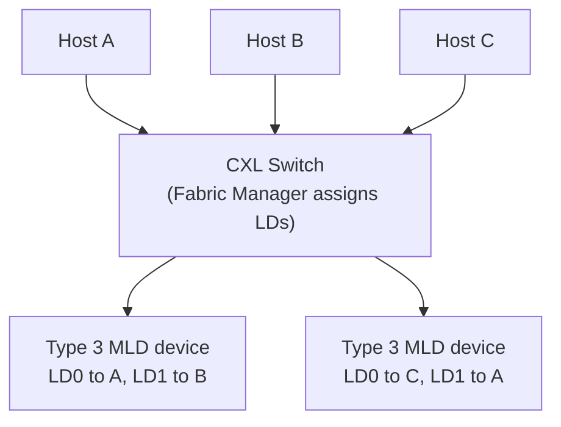

*图 4.2——CXL 2.0 内存池化。一个共享的类型 3 内存池被划分为若干逻辑设备(LD),并由结构管理器(Fabric Manager)动态分配给各主机,从而应对内存"搁浅"问题。CXL 3.0 将这一能力扩展到多级结构以及设备到设备的对等访问。*

CXL 1.1 只支持主机与设备之间的直接点对点链路。**CXL 2.0 引入了交换机制**,并借此带来了具有变革意义的**内存池化**能力。

##### CXL 交换机与逻辑设备

一台 **CXL 交换机**位于多台主机与多台类型 3 内存设备之间,使内存能够**作为一个池被共享**,而非专属于单台主机。CXL 2.0 支持单级交换;CXL 3.0 扩展到多级结构。其关键抽象概念包括:
- **逻辑设备(Logical Device,LD)**:一台物理内存设备容量中被分配给某台特定主机的一部分。主机将其 LD 视为自身地址空间中的内存。
- **MLD(多逻辑设备,Multiple Logical Device)**:一台物理类型 3 设备被划分为多个 LD,每个分配给不同的主机。这样,一个物理内存模块便能服务多台主机,每台各自拥有其中一部分。这正是内存池化的核心所在——一个物理内存池被划分为若干 LD,按需分配给各主机。
- **结构管理器(Fabric Manager,FM)**:管理交换机和设备的软件/固件控制平面——负责将 LD 分配给主机、划分带宽,以及重新配置分配方案。FM 是内存池的编排者。

##### 动态内存分配与内存搁浅问题

内存池化背后的经济动因,是**内存搁浅问题**。在传统的服务器机群中,每台服务器都按照其最坏情况的工作负载来配置足够的内存,但在任一时刻,大多数服务器实际使用的内存远少于其最大配置——因此机群总 DRAM 中相当大的一部分处于闲置状态,"搁浅"在当前并不需要它们的服务器中,而其他服务器却面临内存饥荒。DRAM 是数据中心中最昂贵的组件之一,因此内存搁浅的代价极为高昂。

CXL 内存池化使云运营商能够**超额配置聚合内存并动态分配**:一个 CXL 类型 3 内存池被众多主机共享,容量被分配给当前需要它的主机。需要更多内存的主机会从池中获得额外的 LD;不再需要内存的主机则将容量释放回池中。重新分配并非瞬时完成——内存必须先被清零(以防止租户间的数据泄露)、在页表中重新映射,并重新上线,这一过程大约需要数秒量级——因此内存池化针对的是容量层面的弹性,而非微秒级的即时重新分配。但回报是可观的:减少 DRAM 总采购量、减少搁浅容量,以及为占用量随需求变化的工作负载(例如 AI 推理,其中 KV 缓存大小取决于上下文长度和批处理规模)提供弹性内存的能力。

##### CXL 内存时延与 NUMA 感知

CXL 内存并非没有代价:相对于本地 DDR,它会增加时延。本地 DDR5 访问大约为 **80 纳秒**量级;CXL 2.0 内存访问会在此基础上再增加约 **100—150 纳秒**,总计落在 170—250 纳秒区间,而 CXL 3.0 将额外时延改善至 80—100 纳秒左右。这对于**容量层**(存放不在最热路径上数据的内存)而言是可以接受的,但对时延关键的工作集则不然。这意味着 CXL 内存最适合用作**第二内存层**,将最热的数据保留在本地 DRAM 中,较冷的数据放在 CXL 中。

软件必须具备 **NUMA 感知**才能有效使用 CXL 内存。CXL 挂载的内存在操作系统看来表现为额外的 **NUMA(非一致性内存访问,Non-Uniform Memory Access)节点**——但这些是没有本地 CPU 的节点(所谓"无 CPU"或"仅内存"NUMA 节点),访问时延更高。Linux 内核的 NUMA 均衡机制以及新兴的**分层内存管理**子系统(在软件部分讨论)负责将热页放置在快速的本地 DRAM 中,并将冷页迁移到较慢的 CXL 内存中,在可能的情况下对应用程序保持透明。做好这种分层——基于访问频率对页面进行晋升和降级——是内核开发中一个活跃的领域,对于在不损害应用性能的前提下实现 CXL 的承诺至关重要。

#### CXL 3.0 与 3.1——结构化组网与对等访问

CXL 3.0 借助 PCIe 6.0 翻倍的带宽,将 CXL 从一种点对点加单级交换的技术,转变为一种能够在机架规模上连接数百台主机与设备的**结构(fabric)**。

##### 多级交换与机架规模结构

CXL 3.0 支持**多级交换**——主机与设备之间可以有多个交换层级——从而支持一种**机架规模的 CXL 结构**,将大量主机连接到一个庞大的共享内存池。这正是解耦内存机架的架构基础:一个装满内存设备的机箱、一个装满计算的机箱,通过一个 CXL 结构将它们缝合在一起,使得任何主机都可以从任何设备获得内存分配。该结构支持的主机和设备数量,远超单级交换的 CXL 2.0 设计,推动 CXL 从"单台服务器的内存扩展器"迈向"整机架的内存结构"。

##### 对等一致性与设备到设备通信

CXL 3.0 引入了**设备之间的对等(P2P)一致性访问**,无需经过主机 CPU 路由。此前,两个希望一致性地共享数据的加速器必须经由主机的一致性代理;CXL 3.0 将 CXL.cache 扩展到涵盖 **D2D(设备到设备,Device-to-Device)**事务,使加速器能够直接一致性地访问彼此的内存。这使得一组加速器能够共享一个一致性内存空间——这一能力与多加速器 AI 系统直接相关,也是它与 NVLink、UALink 在加速器到加速器通信领域产生重叠(及竞争)的地方。

##### 反向失效与增强一致性

CXL 3.0 将**反向失效(Back-Invalidation,BI)**机制推广开来:即内存设备使主机所持有的缓存行失效的机制。反向失效使内存扩展器或近内存加速器能够**从设备一侧管理一致性**——例如,当一台计算型内存设备修改数据时,它可以使主机缓存中的陈旧副本失效。这种设备管理的一致性(即 HDM-DB 模型)降低了以设备为主的访问模式下的时延,对结构和 P2P 能力至关重要,因为在这些场景中,一致性必须跨众多设备维护,而不能把一切都汇聚到单一的主机归宿代理上处理。

##### 结构寻址

为了在跨多台交换机的结构中路由一致性事务,CXL 3.0 定义了一种**全局寻址方案**。设备和端口携带标识符(一种结构/端口/设备/逻辑设备的寻址层级结构),使一个事务能够跨多个交换机跳数被路由到正确的设备和逻辑设备。正是这种全局寻址,将一堆交换机和设备的集合转变为一个真正的一致性结构,而非一组彼此孤立的链路。

#### CXL 竞争格局

由于 CXL 涉及 CPU、加速器、内存、交换机和控制器,它吸引了异乎寻常广泛的参与者。以下概述了主要参与者及其产品。

##### CPU 厂商

**英特尔**是 CXL 的发起者,也是最坚定的支持者,将 CXL 定位为数据中心通用的内存与一致性结构。**Sapphire Rapids**(第四代至强 Scalable)是首款支持 CXL(1.1)的服务器 CPU;**Emerald Rapids** 延续了这一支持;而 **Granite Rapids** 正朝着 CXL 2.0 迈进。英特尔已展示了 CXL 内存扩展参考设计,并将 CXL 集成进其 Agilex FPGA 中。英特尔的战略动因显而易见:作为一家内存与平台公司,CXL 增强了 CPU 平台的价值,并为英特尔芯片创造了新的挂载点。

**AMD** 在其整条 EPYC 产品线中支持 CXL:**Genoa**(第四代 EPYC)带来了 CXL 1.1,**Turin** 正朝 CXL 2.0 迈进,AMD 还将 CXL 用于其 MI300 系列加速器的一致性主机内存访问。AMD 的 Pensando DPU 产品组合以及其更广泛的 Infinity Fabric 传统,使其具备构建 CXL 挂载设备和内存扩展器的能力。

**Arm** 将 CXL 集成进其 **Neoverse** 服务器核心(N2、V2)中,基于 Arm 的服务器厂商——Ampere,以及 AWS 的 Graviton 系列——都采用了 CXL。Arm 早先的 CCIX 项目已并入 CXL,而 Arm 的一致性网状结构(CMN)在系统层面与 CXL 互操作。

##### 内存厂商

内存厂商正竞相打造 CXL 类型 3 设备,因为 CXL 开辟了一个完全超越 DIMM 的全新内存产品品类:
- **三星**推出了 **CMM-D(CXL 内存模块——DRAM,CXL Memory Module — DRAM)**,一种基于 DRAM 的类型 3 扩展器,以及基于 LPDDR5 的变体 **CMM-B**,并在业界活动(闪存峰会,Flash Memory Summit)上展示了 CXL 内存模块。三星同时也在推进 **PIM(存内计算,Processing-in-Memory)**变体,将计算能力置于内存设备内部,通过 CXL 暴露出来——这是通向计算型内存的一条路径。
- **SK 海力士**推出了 **CMM-H**,一种 CXL DRAM 模块(例如,128 GB 的 CXL 2.0 类型 3 产品),并已宣布推出 CXL 3.0 模块。SK 海力士在 HBM 领域的主导地位,使其有强烈动机将其内存领先优势延伸到 CXL 领域。
- **美光**已开发出 CXL 内存扩展产品(包括 CXL 挂载设备以及一条 CXL SSD 产品线),并正在投资 CXL DRAM。美光的加入,使得三大 DRAM 厂商悉数投入 CXL 阵营。

##### 控制器、交换机与 IP

构建一台 CXL 内存设备需要一个将 CXL 链路桥接到 DRAM 的**内存控制器**,这催生了一个专门的芯片细分领域:
- **Montage Technology(澜起科技)**凭借其在 DDR 寄存时钟驱动器方面的技术积累,构建了 CXL 内存缓冲器和控制器芯片。
- **Rambus** 提供 CXL 内存控制器 IP 和芯片。
- **美高森美(Microchip)**提供 CXL 控制器和交换结构芯片,并将 CXL 集成进其 FPGA 中。
- **Astera Labs** 在其 PCIe/CXL 重定时器业务之外,还提供 CXL 内存控制器和智能结构连接产品——是 CXL 建设浪潮的主要受益者之一。

在交换机领域,**Xconn Technologies** 是一家值得关注的初创企业,正为 CXL 2.0 和 3.0 构建专用的 **CXL 交换芯片**,支持内存池化和结构化用例。**美高森美**也涉足 CXL 交换领域。

##### UALink 与 CXL——互补还是竞争?

一个经常引起困惑的问题,是 **CXL 与 UALink(超级加速器链路,Ultra Accelerator Link)**之间的关系。UALink 由 AMD、英特尔、博通、思科、谷歌、慧与(HPE)、Meta 和微软支持,瞄准的是 **GPU 到 GPU 的纵向扩展(scale-up)**互连——在纵向扩展域内连接加速器的高带宽(200 GB/s 级)链路,是 NVIDIA NVLink 的开放替代方案。CXL 瞄准的是**一致性内存与 CPU-设备**互连。以最清晰的框架来看,二者是**互补的**:CXL 用于内存扩展、池化以及 CPU-加速器一致性;UALink 用于高带宽的加速器网状互连。实践中,二者存在重叠——CXL 3.0 的对等设备一致性触及了 UALink 同样涉及的加速器到加速器领域——两项标准将在这一边界上相互角力。但业界的广泛共识是,将 CXL 视为内存/一致性结构,将 UALink 视为纵向扩展的加速器结构,二者共同作为对抗 NVIDIA 专有技术栈的开放性力量。

#### CXL 软件栈

硬件只是故事的一半;若没有操作系统和运行时的支持来发现、管理并智能地在其上放置数据,CXL 内存将毫无用处。

##### Linux 内核支持

**Linux 内核 CXL 子系统**(位于 `drivers/cxl/` 目录下)自内核 5.12 版本前后开始合入,并持续稳步成熟。它包含用于设备枚举的驱动(`cxl_pci`)、用于类型 3 内存的驱动(`cxl_mem`),以及创建 **CXL 区域(region)**——由一个或多个 CXL 内存设备支撑的连续主机物理地址范围——的机制,并通过 sysfs 暴露和配置这些区域。内核将 CXL 内存作为 NUMA 节点集成,并为分层内存管理提供了钩子接口。驱动和子系统的开发依然活跃,持续跟进不断演进的 2.0/3.0 特性(池化、动态容量、结构管理)。

##### 分层内存管理

由于 CXL 内存是一个较慢的层级,内核必须决定哪些页面驻留在快速的本地 DRAM 中、哪些驻留在较慢的 CXL 内存中,并随着访问模式的变化在各层级之间迁移页面。相关技术包括:
- **DAMON(数据访问监视器,Data Access MONitor)**,一个能够高效监视内存访问模式的内核子系统,可以驱动页面晋升/降级决策(通过 DAMOS,即基于 DAMON 的操作方案,DAMON-based Operating Schemes)。
- **分层库和工具**,例如 **Memkind** 和 `numactl`,它们让应用程序和管理员能够将分配定向到特定的内存层级。
- 与英特尔早期 **Optane 持久内存**的 Memory Mode(对 PMEM 上 DRAM 的透明缓存)相对于 App Direct 模式(应用程序显式控制)的概念类比,对应到 CXL 中透明分层与显式放置这两种选择之间的关系。

目标是**透明分层**:应用程序无需修改即可运行,而内核则将热数据保留在快速内存中、冷数据放在 CXL 内存中,以最小的性能损失换取大部分的容量和成本收益。要在多样化的工作负载中稳健地实现这一点,是 CXL 时代软件层面的核心挑战之一。

##### 仿真与测试

由于 CXL 硬件既新且昂贵,**QEMU 的 CXL 仿真**功能极为宝贵:QEMU 能够仿真 CXL 交换机和内存设备,使操作系统、固件和管理软件的开发者能够在没有物理硬件的情况下测试 CXL 枚举、区域创建和池化功能。这在广泛的硬件可用性到来之前,加速了软件栈的成熟。

##### 错误处理与 RAS

内存是容易出故障的部件,CXL 必须融入平台的 **RAS(可靠性、可用性、可维护性,Reliability, Availability, Serviceability)**机制中。CXL 错误通过 **CPER(通用平台错误记录,Common Platform Error Records)**和平台错误处理流程进行报告,CXL 内存支持**中毒处理(poison handling)**——将内存介质错误标记为"中毒",使得消费这类损坏数据时触发一个受控错误,而非静默的数据损坏。稳健的 RAS 对于 CXL 内存在生产环境中获得信任至关重要,在池化配置中尤其如此,因为一台设备的故障可能影响多台主机;确保故障被隔离、不会让一台设备的故障级联扩散,是结构管理器和平台的关键要求。

#### 深度扩展:时延代价及为何分层如此困难

CXL 内存面临的核心实际挑战是**时延代价**,以及管理这一代价所需的软件复杂性,这值得详细展开,因为它决定了 CXL 能否在实践中兑现其承诺。本地 DDR5 访问约为 80 纳秒;CXL 2.0 内存在此基础上增加约 100—150 纳秒(包括 CXL 协议处理、链路传输,以及设备自身的内存访问),总计落在 170—250 纳秒区间。这并非灾难性的——它与在多路服务器中访问远端 NUMA 插槽的内存相当——但已经足以使得将工作负载的*热*数据放在 CXL 内存中会明显拖累性能。因此,CXL 内存是一个**第二层级**:用于存放温数据和冷数据,而热数据保留在本地 DRAM 中。

真正困难的部分,在于如何动态、透明地判断哪些数据是热的、哪些是冷的,并相应地在层级之间迁移页面。这就是**分层内存管理**问题,它确实相当棘手。内核必须以足够细的粒度监视访问模式以识别热页(即上文提到的 DAMON 子系统),同时不能让监视本身消耗过多资源;它必须将热页向上迁移到快速内存、将冷页向下迁移到 CXL,并且只有在收益足以证明其合理性时,才承担迁移成本(拷贝页面、更新页表、刷新 TLB);它还必须避免病态的抖动现象(反复迁移一个被间歇性访问的页面)。不同的工作负载具有截然不同的访问模式——一个数据库、一个图分析任务、一台带有大型 KV 缓存的 AI 推理服务器——对某一种工作负载有效的分层策略,可能对另一种就会失效。要在不同工作负载之间、以对应用程序透明的方式把这件事做好,是内核开发中一个活跃且尚未完成的领域,也是 CXL 内存的实际收益迄今落后于其理论承诺的主要原因。硬件先于软件就绪,这是内存系统创新中反复出现的模式(NUMA 和持久内存都曾如此),而分层内存管理的成熟程度,正是决定 CXL 能否作为容量层被广泛采用的制约因素。

#### 深度扩展:内存池化经济学详解

CXL 内存池化——用以解决内存搁浅问题——的经济学论证值得量化分析,因为这是 CXL 基础设施最清晰的近期正当性所在。在传统机群中,每台服务器都按其峰值内存需求配置,但超大规模厂商的测量结果一致显示,在任一时刻,相当大比例的已配置 DRAM 处于闲置状态:一台运行轻内存负载工作的服务器只使用了其 DIMM 容量的一小部分,而与此同时,机群中别处的一台重内存负载工作负载却受到制约。由于 DRAM 是服务器成本中最大的项目之一(常常与 CPU 相当甚至超过 CPU),这种搁浅的内存代表着重大的资本效率损失——可能有机群总 DRAM 的百分之几十处于闲置状态。

CXL 池化使运营商能够在众多服务器之间配置一个**共享池**的 CXL 内存,并动态分配它(见上文),从而使总体配置量更接近*聚合*需求,而非各服务器*峰值需求*之和。节省幅度取决于众多工作负载之间的统计平滑效应(各服务器的需求彼此越不相关,峰值相互抵消的程度就越大,所需的池就越小),已发表的分析显示,对于现实的机群而言,总 DRAM 可实现有意义的个位数到中低两位数百分比的削减——在超大规模场景下这是一笔巨大的绝对节省。需要与之权衡的成本包括 CXL 的时延代价(池化内存是较慢的层级)、CXL 基础设施(交换机、控制器、结构),以及结构管理器分配和清零内存的运维复杂性(重新分配耗时约数秒量级,适用于容量层面的弹性,但不适用于微秒级的即时共享)。净经济效益因工作负载和机群而异,但对于拥有多样化工作负载和昂贵 DRAM 的大型运营商而言,内存池化是 CXL 各类用例中回报最清晰、最直接的一个——这正是内存厂商(三星、SK 海力士、美光)以及控制器/交换机厂商(Montage、Astera、Xconn)如此大力投资类型 3 设备和 CXL 交换技术的原因。

#### 深度扩展:CXL 与 NVLink-C2C 的对比及一致性技术格局

将 CXL 置于更广泛的一致性互连技术格局中,尤其是与 NVIDIA 的 NVLink-C2C(第 05 篇)进行对比,颇具启发意义。二者都提供缓存一致性的 CPU-加速器内存访问,但体现了截然相反的理念。**NVLink-C2C** 是专有技术,针对 NVIDIA 的 Grace-Hopper/Grace-Blackwell 超级芯片进行了最大程度的优化,提供 900 GB/s 的一致性带宽——远超经由 PCIe 通道运行的 CXL 链路所能提供的带宽——代价是它是一种封闭的、单一厂商的解决方案,只能在 NVIDIA 的集成产品内使用。**CXL** 是一项开放的、多厂商标准,可被任何 CPU、加速器或内存设备使用,提供的带宽较低(受限于其所运行的 PCIe 通道),但拥有互操作性和广泛生态系统这一巨大优势。这种权衡,呼应了贯穿本知识库始终的 InfiniBand 对 Ethernet(第 07 篇)以及 NVLink 对 UALink(第 24 篇)之间的张力:专有集成与峰值性能,对比开放标准化与生态广度。

可能的结局是一种**角色分工**:NVLink-C2C(以及广义上的 NVLink)负责 NVIDIA 产品内部最高带宽、紧密集成的 CPU-GPU 及 GPU-GPU 一致性;CXL 负责整个行业更广泛的开放、多厂商内存扩展、池化以及 CPU-设备一致性用例;而 UALink 负责开放的纵向扩展加速器网状互连。CXL 的角色,与其说是在原始带宽上与 NVLink 竞争,不如说是成为数据中心其余部分的**通用、开放的内存与一致性结构**——一种能让任何 CPU 挂载池化内存、任何加速器一致性地访问主机内存,并且(最终,通过光学化)让任何主机都能触及建筑规模内存池的标准。在一个充斥着专有高性能结构的格局中,CXL 是将异构、多厂商数据中心编织在一起的开放标准,这正是它能够吸引到那场吞并了 Gen-Z、CCIX 和 OpenCAPI 的全行业整合运动的原因所在。

#### 深度扩展:缓存一致性基础及 CXL.cache 为何困难

要理解 CXL.cache 所完成的壮举,必须先理解它所解决的缓存一致性问题,这值得展开讨论,因为一致性是计算机体系结构中最困难的问题之一。当多个代理(CPU 核心、加速器)缓存同一内存位置的副本时,系统必须确保它们看到的值都是一致的——如果某个代理执行了写操作,其他代理持有的陈旧副本就必须被失效或更新。CPU 在单个插座内通过硬件一致性协议解决这一问题(MESI 及其变体:每条缓存行处于已修改、独占、共享或无效状态之一,各代理相互监听彼此的缓存以维持一致性)。将这种一致性通过一条链路扩展到外部加速器——使加速器能够缓存主机内存、主机也能够缓存加速器内存,并且一切都保持一致——正是 CXL.cache 所做的事情,这确实相当困难,因为一致性消息(监听、失效、所有权请求)必须在有界时延内、且不产生死锁的情况下跨越链路传输,同时还要保持软件所依赖的内存排序保证。

**偏置模式**(主机偏置和设备偏置,见上文)是 CXL 用以管理一致性开销的巧妙优化:软件无需在每次访问时都产生一致性事务,而是可以将某个内存区域声明为设备偏置(由加速器拥有,在本地访问而无需涉及主机)或主机偏置(由主机进行协调),并随着访问模式的变化而翻转偏置设置。**反向失效**机制(HDM-DB,见上文)让内存设备能够更积极地参与一致性,在需要时使主机侧的副本失效——这对于结构的设备管理一致性至关重要。CXL 之所以能在早期一致性互连项目(CCIX、OpenCAPI、Gen-Z)纷纷走向碎片化的情况下取得成功,部分原因在于它把这套一致性模型做对了、并且做到了广泛可接受,部分原因也在于业界对碎片化的疲惫——但一个干净、无死锁、性能良好、且构建于 PCIe 之上的跨链路一致性协议,本身就是一项重大的技术成就,正是它使得异构、一致性、解耦的数据中心成为可能。

#### 深度扩展:CXL 与服务器架构的重塑

CXL 更深层的意义在于,它重塑了**服务器的基本架构**,厘清这一点有助于说明为什么 CXL 不仅仅是一个内存扩展器。经典的服务器是一个固定的组合体:一颗 CPU 配备固定数量的 DIMM 插槽、若干 PCIe 设备,全部装在一个机箱内,内存容量和带宽永久地与 CPU 插座绑定。CXL 开始消融这种绑定关系。有了 CXL 内存扩展,内存容量不再受限于插座的 DIMM 插槽数量——一台服务器可以通过 CXL 挂载远超以往的内存。有了 CXL 池化,内存不再由单台服务器独占,而是从一个共享池中动态提取和分配。有了 CXL 3.0 的结构和对等能力,加速器可以在整个机架范围内一致性地共享内存。其终点便是**解耦、可组合的服务器**:计算、内存和加速器各自成池,通过 CXL(以及为获取最高带宽而使用的 NVLink/UALink)结构相互连接,按需组合成适合每种工作负载的机器(第 18、24 篇)。

这是一次深刻的架构转变,也正是为什么业界——CPU 厂商、内存厂商、超大规模云厂商——尽管面临早期挑战(时延代价、尚不成熟的分层软件),依然如此大举投入 CXL 的原因。其回报是终结资源搁浅(内存被分配在闲置之处,而其他地方却正需要它)以及从资源池中按需组合机器的灵活性——这是一个更高效、更灵活的数据中心。这一愿景的完全实现还需要数年时间(它需要成熟的池化、结构管理、分层软件,以及最终光学化的 CXL 以突破机架边界,详见第 24 篇),但方向已经确定,而 CXL 正是使内存解耦——由于内存对时延极为敏感,这是解耦中最困难、也最有价值的一种形式——成为可能的互连技术。在重塑内存挂载计算的方式的过程中,CXL 正在重塑服务器本身,并通过服务器,重塑整个数据中心。

#### 结语:作为解耦数据中心内存结构的 CXL

CXL 起初是一种一致性互连技术,正在成长为数据中心的内存结构。它的演进轨迹——从一个点对点的扩展器(1.1),到一个池化的、可交换的资源(2.0),再到一个具备对等设备通信能力的机架规模一致性结构(3.0/3.1)——描绘出数据中心架构走向**解耦与可组合性**的更宏大弧线:计算、内存和加速器各自成池,通过快速的一致性结构相互连接,按需组合成适合每种工作负载的机器。促成 CXL 诞生的内存墙问题并未消失——如果说有什么变化的话,AI 对内存容量和带宽的胃口正在使其愈发严峻——而 CXL 正是业界协同一致、整合后的答案。它最终通过光学链路的扩展(经由光纤的 CXL,第 24 篇)有望将一致性内存池从机架规模推向建筑规模,完成第 01 篇所描述的互连层级结构扁平化进程。CXL 的成功并非板上钉钉——时延、软件成熟度以及池化的经济性都是真实的挑战——但没有任何其他技术,比它更有条件重新定义数据中心中"内存"一词的含义。下一章将再向下深入一个层级,探讨构成本章所述加速器和 CPU 本身基础的芯片间(die-to-die)互连技术——UCIe、HBM 以及芯粒(chiplet)生态系统。

[↑ 返回目录 / Back to Table of Contents](#目录--table-of-contents)

---

<a id="sec-27-6"></a>
## 27.6 UCIe、Die-to-Die 互连与芯粒生态系统

**中文翻译，原文见:** [05_ucie_and_die_to_die_interconnects.md](05_ucie_and_die_to_die_interconnects.md)

---

### UCIe、Die-to-Die 互连与芯粒生态系统

#### 引言：当网络移入封装体内部

数据中心互连层次结构的最内层存在于单个芯片封装体内部，数据在**芯粒（chiplet）**——共同封装在同一基板上的独立硅片——之间流动，传输距离以微米计。这正是die-to-die互连的领域，如今它已成为整个计算行业中战略地位最重要、演进速度最快的领域之一。原因很简单：把一切功能都集成到单个大裸片上的单片式片上系统（SoC）已经触及经济和物理极限，而业界的出路是把芯片本身解构为多个芯粒，再用高带宽、超低能耗的die-to-die链路将它们重新连接起来。"网络"已经转移到了封装体内部。

本章覆盖芯粒革命及其互连技术：采用芯粒的理由、旨在让不同厂商芯粒实现互操作的开放标准**UCIe（Universal Chiplet Interconnect Express，通用芯粒互连高速通道）**、英特尔（EMIB、Foveros）、AMD（Infinity Fabric、3D V-Cache）、NVIDIA（NVLink-C2C）和台积电（CoWoS、SoIC）各自的专有die-to-die技术，以及其他die-to-die标准（BoW、AIB、HBI），还有作为所有AI加速器"供粮"的典范die-to-die互连——**HBM（High Bandwidth Memory，高带宽内存）**。这些技术运行在亚纳秒级时延和亚皮焦耳每比特的能耗水平上，是本数据库通篇讨论的GPU、CPU与加速器得以物理实现的基础。

#### 芯粒架构与die-to-die互连的必要性

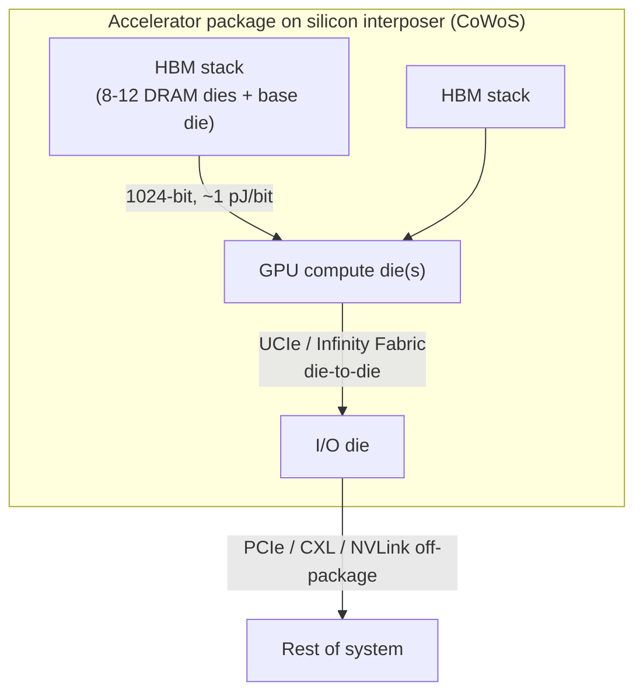

*图5.1——现代加速器本身就是一个由芯粒组成的小型网络：计算裸片、I/O裸片和HBM堆栈共同封装在中介层（interposer）上，并通过die-to-die链路（UCIe、专有互连结构、1024位HBM接口）以亚纳秒级时延和亚皮焦耳级能耗相连。*

##### 为何选择芯粒：单片式扩展的终结

数十年来，构建复杂芯片在经济上最优的方式，一直是在当时最先进的制程节点上，把所有功能集成到单个单片式裸片中。多股汇聚的压力打破了这一模式：

- **光罩极限（reticle limit）。** 光刻在单次曝光中只能对有限面积进行图形化处理——即光罩极限，约为800平方毫米。随着芯片设计（尤其是AI加速器）规模不断增长，它们撞上了这一硬性上限；单片式裸片不可能做得比光罩极限更大。芯粒把一个庞大的逻辑设计拆分为多个各自都在光罩极限之内的裸片，再将它们重新连接起来。

- **良率经济学。** 缺陷会以一定密度随机出现在晶圆上。裸片无缺陷的概率随裸片面积呈指数下降，因此非常大的单片式裸片良率极差——一个缺陷就会毁掉一整块昂贵的大裸片。将设计拆分为更小的芯粒可以大幅提升良率（一个缺陷只会毁掉一个小芯粒，而非整个系统），并且可以在组装之前就以较低成本剔除有缺陷的芯粒。这一良率优势是推动芯粒采纳的最强经济驱动力之一。

- **异构集成。** 不同功能对应不同的最优制程节点。高性能逻辑电路受益于最先进的制程（例如台积电N3）；大型SRAM缓存在最新制程上扩展性较差，在稍旧的制程上可能更划算；模拟和I/O电路（SerDes、PHY）通常在成熟、特性已充分表征的制程（7纳米、28纳米）上表现最佳；而最新制程的每晶体管成本异常高昂。芯粒让设计者可以在各自最优的制程节点上构建每种功能再加以组合——把计算部分放在N3、缓存放在N5、I/O放在更旧的制程上——而不必把所有东西都塞进一个折中的工艺。

- **上市时间与IP复用。** 芯粒可以一次设计、在多种产品中复用，一款产品也可以由新旧芯粒混合组装而成，从而加快开发进度。

结果是，如今几乎每一款前沿数据中心处理器——AMD的EPYC和Instinct、英特尔的Xeon和Ponte Vecchio/Falcon Shores、NVIDIA的Grace和Blackwell，以及各大云计算厂商的定制加速器——都已是多芯粒设计。

##### 互操作性问题与作为"芯粒界USB-C"的UCIe

芯粒革命带来了一个新问题：**互操作性**。各厂商各自开发了专有的die-to-die接口——英特尔的EMIB和Foveros、AMD的Infinity Fabric、台积电的封装互连——而来自不同厂商的芯粒根本无法组合使用，因为它们的die-to-die接口互不兼容。这把每家厂商都锁定在自家芯粒之内，也断绝了真正**芯粒市场**的愿景，即设计者可以从一家厂商购买业内顶尖的计算芯粒，从另一家购买I/O芯粒，再从第三家购买存储芯粒，并将它们组装成定制产品。

**UCIe（Universal Chiplet Interconnect Express）**是业界给出的答案：一种开放、标准化的die-to-die接口，任何厂商都可以实现，从而让来自不同来源的芯粒实现互操作——这类似于USB-C如何统一了此前一片混乱的连接器格局。其雄心是打造一个芯粒可以自由搭配组合的生态系统，从而极大拓展设计灵活性与竞争空间。

##### 产业与政府层面的芯粒倡议

推动芯粒标准化的力量还得到了更广泛倡议的加持。**美国《芯片与科学法案》（CHIPS Act）**中包含鼓励先进封装和芯粒标准的条款，作为重建国内半导体能力的一部分。**DARPA的CHIPS计划（Common Heterogeneous Integration and IP Reuse Strategies，通用异构集成与IP复用策略）**率先开展了芯粒互操作性研究，其中包括影响了UCIe思路的AIB接口。**开放计算项目（Open Compute Project）的ODSA（Open Domain-Specific Architecture，开放领域专用架构）**产出了**Bunch of Wires（BoW）**die-to-die标准。而**JEDEC**则为芯粒系统所依赖的封装与内存接口（包括HBM）制定标准。这些努力共同表明，芯粒与先进封装如今已是国家和产业层面的战略优先事项，而不仅仅是工程上的便利选择。

#### UCIe——深入技术解析

##### 成立与版本演进

**UCIe联盟（UCIe Consortium）**于**2022年3月**成立，创始成员阵容异常齐整，涵盖半导体产业各方：**英特尔、AMD、Arm、ASE（一家领先的封装/组装厂商）、谷歌、Meta、微软、高通、三星和台积电**等。这一广度——横跨逻辑芯片厂商、封装厂、云计算巨头和晶圆代工厂——为UCIe赢得了立竿见影的公信力。**UCIe 1.0**定义了基础规范；**UCIe 1.1（2023年）**增加了若干澄清说明，尤其是围绕die-to-die适配器以及汽车/可靠性应用场景；**UCIe 2.0**则向更先进的能力扩展，包括3D封装和可管理性。该标准明确设计为搭建在成熟的协议生态之上——将PCIe和CXL映射到die-to-die链路上——因此由UCIe连接的芯粒组成的SoC可以跨越芯粒边界透明地使用PCIe/CXL通信。

##### 物理层：先进封装与标准封装

UCIe定义了两种物理层变体，分别对应两类封装：

- **先进封装（Advanced packaging）**面向最高带宽密度，采用凸点间距（bump pitch）约为**25–55微米**的精细间距先进封装技术（硅中介层、硅桥或混合键合）。信号速率为**每引脚4–32 Gbps**，由于凸点密度极高，单位接口边长的带宽极为惊人——在最高密度下，UCIe的目标是在2毫米宽的接口上实现数十太比特每秒量级的聚合带宽。先进封装适用于必须以接近片内带宽进行通信的芯粒，例如计算到计算或计算到缓存的链路。

- **标准封装（Standard packaging）**面向成本敏感型设计，采用传统的倒装芯片有机封装，凸点间距约为**100–130微米**，信号速率最高可达**每引脚16 Gbps**。带宽密度较低（凸点间距粗得多），但封装成本便宜得多，也不需要中介层或硅桥。标准封装适合那些需要互连、但并不要求绝对最大带宽的芯粒——例如连接到计算芯粒的I/O芯粒，其链路可以稍窄一些。

UCIe物理层的一个显著特征是它**不使用SerDes、采用源同步（source-synchronous）方式**：不同于长距离链路所用的复杂时钟恢复型SerDes，UCIe将时钟随数据一并转发（时钟转发），并使用简单的基于选通（strobe）的采样方式，这是因为物理距离极短、信道特性温和。这使得每比特能耗极低（远低于1皮焦耳/比特），时延处于亚纳秒级。物理层包含用于纠错的轻量级FEC或CRC，以及用于居中采样眼图和对齐通道（deskew）的训练序列；通道被组织为多个模块（例如每模块16、32或64条数据通道加时钟通道），多个模块可以并联以获得更高带宽。

##### 协议栈：物理层、适配器层、协议层

UCIe的协议栈分为三层：

- **物理层**——上文所述的差分（或单端）信号传输、时钟转发、训练和通道管理。
- **Die-to-Die适配器（D2D Adapter）**——在协议流量与物理通道之间架起桥梁的一层。它提供重定时FIFO，将流量格式化为flit（流控单元），处理流控信用（credit），并管理链路状态。它支持两种模式：**原始模式（Raw Mode）**，即链路作为一条透明的比特管道，承载协议层发送的任何内容（用于自带成帧机制的专有协议）；以及采用UCIe自有flit格式和可靠性机制的成帧/流式模式。
- **协议层**——将上层协议映射到链路之上的一层。UCIe为**PCIe（TLP/DLLP）**和**CXL（CXL.io、CXL.cache、CXL.mem）**定义了标准映射，使芯粒可以像位于同一裸片上一样跨越芯粒边界使用PCIe或CXL通信。它还支持**原始/流式模式（raw/streaming mode）**，以承载任意自定义协议——NVLink、Infinity Fabric或某厂商的专有AI互连协议都可以借助原始模式运行在UCIe物理层之上，从而在保留自定义协议的同时获得标准PHY的好处。

正是这种分层设计，使UCIe既是一种**标准**（面向希望获得PCIe/CXL互操作性的用户），又是一种**基础层（substrate）**（面向希望在专有协议之下使用标准PHY的用户）。

##### 带宽、时延与价值主张

带宽数字令人瞩目。在**先进封装**中，以每通道32 Gbps和密集的通道数计算，一个UCIe接口每毫米接口宽度可提供**数百吉字节每秒**量级的带宽——由于一个芯片边缘可以容纳多个毫米宽度的UCIe接口，die-to-die总带宽可达到数太字节每秒的量级。**标准封装**提供的带宽数字更为保守（每条链路数十GB/s），但成本要低得多。

**时延**优势同样重要：在先进封装下，UCIe die-to-die时延目标为**低于1纳秒**，因为物理距离在亚毫米级，且不使用SerDes。相比之下，带重定时器的PCIe链路时延约为10纳秒，封装外互连的时延则为数十到数百纳秒——保持通信在封装体内进行的价值不言而喻。整个芯粒设计的核心诉求，正是要利用这种时延和能耗优势——在把芯片解构为芯粒的同时，不必付出把它们连接到封装体之外所带来的时延和能耗代价。

#### 英特尔的Die-to-Die技术

英特尔率先开创了现代先进封装的大部分技术，并提供了一整套die-to-die技术组合。

**EMIB（Embedded Multi-die Interconnect Bridge，嵌入式多裸片互连桥）**是嵌入在*封装基板内部*的一小块硅桥，用精细间距布线连接两个相邻的芯粒。与横跨整个芯片面积、造价昂贵的完整硅中介层不同，EMIB是一种局部化的桥接结构，仅放置在两个芯粒需要连接的位置，凸点间距约为**55微米**，可提供高带宽（每座桥约达数太比特每秒量级），且无需大面积中介层或硅通孔，因而更具成本优势。EMIB被用于英特尔的Agilex FPGA、Ponte Vecchio数据中心GPU等多款产品。其优势在于成本以及无需使用TSV；其局限在于硅桥必须预先放置在基板中，限制了灵活性。

**Foveros**是英特尔的**3D裸片堆叠**技术，通过微凸点和贯穿基础裸片的硅通孔（TSV）将一枚裸片面对面地叠放在另一枚裸片之上，把电源和信号引到堆叠裸片。Foveros支持有源对有源堆叠——例如，将计算裸片堆叠在提供I/O和互连功能的基础裸片之上。**英特尔Lakefield**将计算裸片堆叠在基础裸片上，作为早期示范；**Meteor Lake**利用Foveros将独立的计算（Compute）、图形（Graphics）、SoC和I/O裸片组合在一枚基础裸片之上。Foveros的微凸点间距约为**36微米**，TSV直径约为10微米量级。

**Foveros Direct**进一步演进为**铜对铜混合键合（copper-to-copper hybrid bonding）**，摒弃微凸点，改用间距约**10微米**的直接铜对铜键合——相比微凸点版本的Foveros，密度提升了一个数量级，使堆叠裸片之间能够实现远高得多的互连密度。混合键合是3D集成的前沿领域，Foveros Direct瞄准的是未来产品。**ODI（Omni-Directional Interconnect，全向互连）**将EMIB式的横向桥接与Foveros式的纵向堆叠结合起来，实现复杂的2.5D加3D混合集成。

#### AMD的Die-to-Die技术

AMD是基于芯粒的CPU的商业先驱，其die-to-die互连结构是其成功的核心所在。

**Infinity Fabric**是AMD专有的die-to-die及芯片间互连技术，其血统可追溯至HyperTransport。它包含片内和片外两部分组件——连接同一裸片内的核心、封装体内的芯粒以及系统内的插槽——同时提供数据传输和一致性可扩展互连结构（coherence scalability fabric）功能。在AMD的EPYC服务器CPU上，Infinity Fabric将多个**CCD（Core Compute Die，核心计算裸片）**连接到一枚中央**I/O裸片（IOD）**：一颗Genoa EPYC最多可搭载12个（基于5纳米制程构建的）CCD，围绕一枚（基于6纳米制程构建的）IOD排布，每条CCD到IOD的Infinity Fabric链路都能提供可观的带宽（每方向每链路达数十吉字节每秒量级）。这种解构式拓扑——若干小型计算芯粒环绕一个中央I/O枢纽——正是让AMD得以在保持良率的同时激进地扩展核心数量的架构。

**3D V-Cache**是AMD将混合键合技术应用于在CCD之上直接堆叠额外SRAM缓存的成果。一枚64MB的SRAM缓存芯粒通过**间距约9微米的铜对铜混合键合**，键合在CCD现有的L3缓存之上，在缓存芯粒与底层裸片之间提供极高的带宽（数太比特每秒量级），且时延极低。3D V-Cache首次亮相于Ryzen 7 5800X3D，并出现在EPYC"Genoa-X"服务器型号中，其巨量缓存显著提升了对缓存敏感型工作负载（技术计算、EDA、某些数据库）的性能。它展示了3D die-to-die集成如何能够添加原本无法经济地容纳在基础裸片上的能力（此处即为缓存）。

#### NVIDIA的Die-to-Die与多裸片技术

NVIDIA主要的封装内die-to-die技术是**NVLink-C2C（Chip-to-Chip，芯片到芯片）**，正是这一互连将**Grace CPU与Hopper（或Blackwell）GPU**结合成一颗统一的一致性超级芯片。NVLink-C2C在封装体内的CPU与GPU之间提供**900 GB/s的双向带宽**——大约是PCIe 5.0 x16链路带宽的7倍——而能耗则低得多（约1.3皮焦耳/比特量级，相比之下PCIe为数皮焦耳/比特）。关键之处在于，NVLink-C2C提供**一致的（coherent）**CPU-GPU内存访问：Grace CPU的LPDDR内存与Hopper GPU的HBM被统一为一个一致的地址空间，因此GPU可以访问CPU内存，反之亦然，且由硬件通过高带宽的C2C链路保证一致性。

与CXL的对比颇具启发意义：**NVLink-C2C提供的带宽高于CXL，但为NVIDIA专有**，而CXL是开放标准。NVIDIA的判断是，对于其紧密集成的CPU-GPU超级芯片而言，一条专有的、经过最大化优化的一致性链路，其价值超过开放互操作性——这与贯穿NVIDIA整个AI技术栈的垂直整合理念一脉相承。Blackwell一代进一步扩展了这一点，提供更高的C2C带宽，并使用die-to-die链路将构成单颗Blackwell GPU的两枚大型GPU裸片连接为一个逻辑设备。

#### 台积电基于封装的Die-to-Die技术

作为占主导地位的晶圆代工厂，**台积电（TSMC）**提供了物理实现业界绝大多数芯粒设计的封装技术。

**CoWoS（Chip-on-Wafer-on-Substrate）**是台积电的**2.5D**集成技术：芯粒（包括GPU裸片和HBM堆栈）并排放置在**硅中介层**上，中介层提供芯粒之间精细间距的再布线层（RDL）布线（间距约40微米），中介层再置于封装基板之上。CoWoS是AI加速器封装的主力技术——NVIDIA的H100/H200/A100以及AMD的MI300X正是借助它将GPU计算裸片与多个HBM堆栈集成在一起的。CoWoS产能已成为AI加速器生产中的关键瓶颈，台积电正竞相扩产。该技术存在多种变体（采用硅中介层的CoWoS-S、采用RDL中介层的CoWoS-R、在RDL中介层中嵌入局部硅桥的CoWoS-L），在成本、尺寸和带宽之间各有取舍。

**SoIC（System on Integrated Chips）**是台积电采用**铜对铜混合键合**的**3D**堆叠技术，凸点间距约为**9微米**（SoIC-T，晶圆对晶圆键合方式）——相比传统微凸点密度提升约10倍——并有路线图规划在本十年后期迈向更细的间距（朝3微米方向发展）。SoIC实现了真正的3D集成（逻辑对逻辑，或缓存对逻辑，如AMD的3D V-Cache所采用的，正是台积电的混合键合技术）。CoWoS（2.5D）与SoIC（3D）的组合，为台积电提供了一套支撑起大部分AI硬件产业的全面先进封装技术组合。

#### 其他Die-to-Die标准

除UCIe及各家专有互连结构之外，还存在若干其他die-to-die标准：

- **BoW（Bunch of Wires）**是OCP ODSA的开放die-to-die标准：一种简单、低时延、低功耗的并行总线（每根线约8 Gbps），用于连接相邻芯粒，不定义协议（它承载原始数据，将协议留给系统层处理）。BoW在概念上与UCIe较简单的应用场景形成竞争。
- **AIB（Advanced Interface Bus）**是英特尔开放的并行CMOS die-to-die总线（每信号约2 Gbps），贡献给了DARPA的CHIPS计划，并用于英特尔的Stratix 10 FPGA。AIB是UCIe设计思路的直接先驱。
- **HBI（High Bandwidth Interface）**是JEDEC推动的一项工作，面向类内存的2.5D/3D接口——采用宽总线（例如512位）连接SRAM或DRAM芯粒与逻辑裸片，在概念上是片上缓存领域与HBM竞争的方案。
- **MIPI A-PHY / D-PHY及类似标准**是来自移动和汽车领域的die-to-die及短距离标准，此处仅为完整性提及——它们并非数据中心互连技术，但它们说明了die-to-die信号传输在整个产业中已变得多么普遍。

#### HBM作为一种Die-to-Die互连

任何关于die-to-die互连的讨论，若缺少**HBM（High Bandwidth Memory）**都是不完整的，因为HBM*本身就是*一种die-to-die互连——而且是对AI而言最重要的一种。HBM使用硅通孔（TSV）将多枚DRAM裸片垂直堆叠，置于一枚基础逻辑裸片之上，再通过硅中介层（CoWoS）以一个极宽的接口——**每堆栈1024位**——将该堆栈连接到处理器（GPU或加速器）。通过以位宽换取每引脚速度，HBM在相对温和的每引脚信号速率下实现了巨大的带宽，且由于中介层连接距离很短，能效表现优异。

##### HBM各代产品

| 世代 | 大致年份 | 每引脚数据速率 | 每堆栈带宽 | 备注 |
|---|---|---|---|---|
| HBM1 | 2015 | 1 GT/s | ~128 GB/s | 4–8枚DRAM裸片+基础裸片 |
| HBM2 | 2016 | 2 GT/s | ~256 GB/s | 采用范围扩大 |
| HBM2E | 2020 | ~3.6 GT/s | ~460 GB/s | SK海力士Aquabolt-XL、三星Flashbolt |
| HBM3 | 2022 | ~6.4 GT/s | ~819 GB/s | 12层堆栈；NVIDIA H100使用5个堆栈，约达3.35 TB/s |
| HBM3E | 2024 | ~9.6 GT/s | ~1.2 TB/s | H200使用6个堆栈，约达4.8 TB/s；MI300X使用8个HBM3堆栈，约达5.3 TB/s |
| HBM4 | ~2026年目标 | 16+ GT/s | ~2 TB/s | 基础裸片逻辑集成；更宽的接口 |

这一进程势不可挡：每一代产品的单堆栈带宽大致翻倍，而加速器设计者也在每台设备上堆叠更多的HBM堆栈。NVIDIA的H100集成了五个HBM3堆栈，聚合内存带宽约达3.35 TB/s；H200使用六个HBM3E堆栈，约达4.8 TB/s；AMD的MI300X使用八个HBM3堆栈，约达5.3 TB/s。目标在2026年前后推出的**HBM4**，将进一步拓宽接口，并把更多逻辑功能集成到基础裸片中（有可能针对每个客户定制基础裸片），继续朝着每堆栈数太比特每秒带宽的方向迈进。

##### HBM供应格局与地缘政治利害关系

HBM市场由三家供应商主导：**SK海力士**（市场领导者，市场份额约占一半，是NVIDIA HBM3/HBM3E的主力供应商）、**三星**（份额较大，正竞相通过其HBM3E的认证）以及**美光**（规模较小的第三家进入者，正在扩产HBM3E并力争提升份额）。HBM生产的高度集中——加之最先进的HBM主要产自**韩国**这一事实——使HBM成为AI供应链中至关重要且具地缘政治敏感性的一个环节。

其战略意义怎么强调都不为过：**NVIDIA的H100和H200产量一直受限于HBM供应**，而非GPU逻辑芯片的制造。HBM是AI加速器产量的制约资源，为每一家AI芯片厂商都构成了核心关切——争取HBM配额一直是重中之重。这使得HBM不仅仅是一种die-to-die互连，更是整个AI硬件经济体系中的一个关键节点——一项其供给状况直接决定着训练全球最大模型的加速器产能的单一技术。对少数几家韩国供应商在最先进HBM上的依赖，是科技领域中最重要的供应链风险之一，正推动着对新增产能和新增供应商的投资，也是围绕先进内存的种种地缘政治关注的驱动因素。

#### 深入探讨：先进封装技术对比

本章讨论的die-to-die互连，与那些将其物理实现出来的**先进封装**技术密不可分，对二者进行比较分析有助于厘清整体格局。封装方案大体分为**2.5D**（芯粒并排放置在中介层或硅桥上）和**3D**（芯粒垂直堆叠）两类。在2.5D方案中，可选方案包括：**完整硅中介层**（台积电CoWoS-S）——一整块带有精细间距布线、横跨全部芯粒的大型硅板，可提供最高的互连密度，但成本高昂，且受限于中介层自身的光罩尺寸；**硅桥**（英特尔EMIB、台积电CoWoS-L）——仅在芯粒连接处嵌入小型硅桥，避免了完整中介层的成本，同时在局部保留精细间距；以及**RDL（再布线层）中介层**（CoWoS-R、InFO等扇出方案）——采用有机或聚合物布线层，比硅更便宜但间距更粗。在3D方案中，可选方案包括**微凸点堆叠**（英特尔Foveros，间距约36微米，需要贯穿基础裸片的TSV）和**混合键合**（英特尔Foveros Direct、台积电SoIC、AMD 3D V-Cache，间距约9微米并持续向更细方向发展），后者通过直接铜对铜键合完全消除凸点，实现密度的数量级提升。

这些权衡是根本性的。更精细的间距（混合键合）意味着单位面积的互连数更多，因而带宽更高、每比特能耗更低，但需要晶圆级的对准精度、洁净的表面以及精密的工艺控制，并伴随相应的良率与成本挑战。更粗的间距（有机、标准封装）成本更低、容错性更好，但限制了带宽密度。3D堆叠能最大化密度并最小化互连长度（从而降低时延和能耗），但会带来严峻的散热挑战（堆叠有源裸片会困住热量），并使供电复杂化（电力必须通过TSV到达顶层裸片）。2.5D方案则将芯粒横向铺开，以更长的互连为代价缓解散热压力。在这些方案之间的取舍——以及UCIe同时支持"先进"（精细间距、中介层/硅桥/混合键合）和"标准"（粗间距、有机）两类封装——体现的正是互连层次结构每一层都反复出现的成本与性能权衡。带有GPU裸片和HBM堆栈、置于CoWoS中介层上的AI加速器，处于高性能、高成本的一端；采用有机标准封装的成本敏感型芯粒SoC，则处于另一端。

#### 深入探讨：3D集成的散热与供电挑战

3D裸片堆叠的承诺——将计算、缓存和内存直接叠放在彼此之上以实现最短互连长度——与两个日益制约该技术的棘手物理问题相碰撞。第一个是**散热**。在平面芯片中，热量向上穿过裸片流向散热片再到散热器；而在3D堆叠中，上层裸片的热量必须*穿过*下层裸片才能到达散热器，如果下层裸片本身是耗散自身功耗的有源逻辑裸片，它既会增加热通量，又会阻碍热量逃逸。将一枚发热的逻辑裸片堆叠在另一枚发热的逻辑裸片之上，可能产生超出风冷甚至直接液冷所能带走的热密度，这也是为什么早期3D堆叠往往把低功耗裸片（如AMD 3D V-Cache中的缓存，或I/O裸片）放在高功耗逻辑裸片之上，也是为什么散热考量强烈地决定了什么可以堆叠在什么之上。随着堆叠越来越普遍、功率密度不断上升，先进冷却技术（例如在裸片中蚀刻微流体通道）正成为一个研究前沿。

第二个问题是**供电**。要在低电压（亚伏级）、高电流的现代逻辑需求下，将数百瓦的功率通过封装体输送到裸片堆栈，再经TSV向上输送到上层裸片，是极其困难的——压降（IR drop）和电流密度会给TSV和供电网络带来巨大压力。诸如**背面供电（backside power delivery）**（将电源布线安排在裸片背面，与正面的信号布线分离）等创新技术，正部分是为了满足高密度2.5D/3D集成的供电需求而被开发出来。散热和供电这两方面的制约，共同构成了业界能在多大程度上激进地进行堆叠与集成的主要物理极限——这也正是为什么die-to-die互连、封装、散热和供电必须协同设计，就如同网络其他每一层都需要在其各自组成学科间协同设计一样。

#### 深入探讨：HBM的基础裸片与通往HBM4之路

HBM向HBM4（约2026年）演进，是AI硬件领域最具深远影响的趋势之一，其核心在于**基础裸片（base die）**——位于HBM堆栈底部、在堆叠的DRAM与主处理器之间充当接口的逻辑裸片。在HBM3之前，基础裸片一直只是相对简单的接口层。HBM4拓宽了接口（朝每堆栈2048位方向发展，是本已很宽的HBM3接口的两倍），更重要的是，它开启了打造**定制化、逻辑功能丰富的基础裸片**的可能性——该基础裸片有可能由晶圆代工厂（台积电）而非DRAM厂商，采用先进逻辑制程制造，并针对每个客户定制，以集成内存控制器、近内存计算或专用接口等功能。这模糊了内存与逻辑之间、以及内存厂商与逻辑代工厂之间的界线，也可能让AI加速器设计者能够将HBM基础裸片与GPU协同优化——这是本章所描述的芯粒/异构集成范式的进一步深化。这里的战略利害关系不小：HBM基础裸片的主导权正在内存厂商（SK海力士、三星、美光）与逻辑代工厂（台积电）之间被争夺，其结果将在未来数年内塑造AI加速器的经济性与架构。因此，HBM4正体现了本章的核心主题——最先进的计算正是通过die-to-die互连将异构裸片集成在一起而构建出来的，而裸片、内存、封装与代工厂之间的边界，全都处于流变之中。

#### 深入探讨：驱动一切的芯粒经济学

芯粒革命建立在一套值得量化的经济逻辑之上，因为它解释了为什么整个产业——英特尔、AMD、NVIDIA、各大云计算厂商——都转向了芯粒，尽管这带来了die-to-die互连方面的额外复杂性。核心驱动力是**良率经济学**。半导体缺陷以一定的单位面积密度出现，裸片无缺陷的概率大致随其面积呈指数下降。一枚非常大的单片式裸片（接近约800平方毫米的光罩极限）因此良率很低——任何位置出现一个缺陷，就会毁掉整个昂贵的裸片——每枚*良品*裸片的成本因此急剧攀升。将该设计拆分为例如四个各占四分之一面积的芯粒，可以大幅提升每个芯粒的良率（一个缺陷只会毁掉一个小芯粒），而有缺陷的芯粒可以在组装之前以较低成本被剔除，因此每套良品*系统*的成本会大幅下降。对于最大的芯片——正在逼近光罩极限的AI加速器而言——单凭这一良率优势就可能起到决定性作用。

在此基础之上叠加的是**异构工艺**带来的节省：最先进的制程节点（例如N3）每晶体管成本异常高昂，而并非每种功能都能从中受益——大型SRAM缓存在最新制程上扩展性较差，模拟/IO电路（SerDes）通常在成熟制程上表现最佳。通过在各自成本最优的制程节点上构建每种功能，再借助芯粒将它们组合起来，设计者得以避免为不需要它的功能支付前沿制程的价格——AMD的EPYC正是典范案例：计算芯粒采用先进制程，而IO裸片采用更旧、更便宜的制程。再加上**IP复用**（一次设计芯粒，在多款产品中使用）和**更快的上市速度**（新旧芯粒混合搭配）带来的好处，对于复杂、高价值芯片而言，采用芯粒的经济理由变得势不可挡。其代价——die-to-die互连（UCIe、HBM接口、专有互连结构）以及先进封装（CoWoS、EMIB、Foveros、SoIC）——正是本章的主题所在，而这是业界乐于承担的代价，因为将芯片解构所带来的良率、工艺优化、复用和上市速度方面的收益，远远超过了这一代价。芯粒之于芯片，正如解构之于数据中心：将一个整体拆解为可组合、可独立优化、可独立采购的部件，再通过高性能互连重新连接起来。

#### 深入探讨：已知良好裸片与芯粒供应链

芯粒模式带来的一个实际挑战——它也与本数据库更广泛的供应链主题相呼应——是**已知良好裸片（Known-Good-Die, KGD）**问题以及尚处于萌芽阶段的芯粒供应链。当一个系统由多个芯粒在昂贵的中介层（CoWoS）上或在3D堆叠中组装而成时，一个有缺陷的芯粒就会毁掉整个组装模块，而此时该模块中已经包含了若干良品（且昂贵）的芯粒和成本不菲的封装。只有在有缺陷的芯粒在组装*之前*就被发现的前提下，芯粒的良率优势才能真正实现——这正是需要KGD的原因：在将每个芯粒纳入封装体之前，对其（包括其die-to-die接口）进行彻底测试。在裸片键合之前对其高速die-to-die接口进行测试，在技术上颇具难度（没有连接器可供探测），KGD测试是测试工程中一个活跃的研究领域，与协封装光学器件中的"已知良好光学器件（Known-Good-Optics）"挑战（第13篇）如出一辙。

芯粒模式最终也意味着一个**芯粒市场**——即上文所述的UCIe愿景：从不同厂商采购芯粒并将其组装起来——这不仅需要一个可互操作的接口（UCIe），还需要一条用于采购、测试和集成第三方芯粒的供应链，并伴随着诸如谁来保证KGD、谁承担集成良率风险、以及不同厂商的芯粒如何被联合认证等一系列问题。目前这在很大程度上仍处于萌芽阶段（多数芯粒系统仍然使用单一厂商的芯粒），但这正是UCIe所指向的方向，它也将把本数据库在各个尺度上追踪的那种多厂商、可组合的动态扩展到芯粒层面。KGD问题与芯粒供应链，是让芯粒愿景真正落地的实际前沿——这些不那么光鲜的物流和测试工程工作，必须先行成熟，混搭组合芯粒的精妙架构才能变得司空见惯，就如同光学物理层（第09篇）和无损互连结构的运维技艺（第17篇）分别是各自尺度上的实际前沿一样。

#### 结语：作为网络的封装体

die-to-die这一层清楚表明，"一块芯片"与"一个网络"之间的界线已经模糊。现代AI加速器已不再是一块芯片，而是一个由芯粒组成的小型网络——计算裸片、I/O裸片、HBM堆栈——通过运行在先进封装（CoWoS、SoIC、EMIB、Foveros）之上的die-to-die链路（UCIe、专有互连结构、HBM接口）互连而成。这些链路以亚纳秒级时延和亚皮焦耳级能耗，承载着每秒数太字节的数据，达到了封装体之外无法企及的性能水平——这正是为什么把芯片解构为芯粒、再在封装体内重新连接它们，成为了主导性的设计范式。UCIe的承诺，是把这个最内层的网络向多厂商互操作性开放，将芯粒变成一个市场，把以太网和PCIe曾在更大尺度上带来的开放标准动态，延伸到封装体这一层级。而HBM——所有die-to-die互连中最重要的一种——则身处AI供应链的中心，既是推动者，也是瓶颈。从这里出发，本数据库将向外延伸——去看板卡和机架级的互连结构（以太网、InfiniBand），正是它们把这些由芯粒构建而成的加速器连接成用于训练和服务大规模AI的集群。

[↑ 返回目录 / Back to Table of Contents](#目录--table-of-contents)

---

<a id="sec-27-7"></a>
## 27.7 数据中心以太网——速率、标准、架构与演进

**中文翻译，原文见:** [06_ethernet_fundamentals_and_datacenter.md](06_ethernet_fundamentals_and_datacenter.md)

---

### 数据中心以太网——速率、标准、架构与演进

#### 引言：无处不在的网络

以太网是历史上最成功的网络技术。它构思于1973年，于1983年成为标准，并自那以后不断自我革新，先后取代或吸收了几乎每一种曾与之竞争的技术——令牌环（Token Ring）、FDDI、ATM，乃至在通用计算领域中，连光纤通道（Fibre Channel）也不例外，如今InfiniBand也正在被逐步吸收。它的秘诀不在于在任何某个时间点上的技术优越性，而在于一种无可匹敌的组合：开放标准化、规模经济、向后兼容性，以及不懈的速率提升。无论高端市场出现什么样的新奇技术，以太网最终总能以一小部分的成本、加上整个产业的工具链支持，提供90%的能力，并最终胜出。

在数据中心中，除了最高端的AI训练集群（在那里它要与InfiniBand竞争）以及少数专用HPC互连之外，以太网是几乎所有场景下的默认互连结构。本章将全面覆盖数据中心以太网：从10 Mbps到1.6太比特的历史与演进、IEEE 802.3速率标准的完整家族、物理层技术（NRZ、PAM4、FEC、均衡）、基于以太网交换机构建的数据中心拓扑（Clos、蜻蜓型（dragonfly）、环面（torus）、导轨优化（rail-optimized）、光电路交换），以及使以太网能够胜任无损AI互连结构的拥塞管理技术（PFC、DCQCN、HPCC、Swift、Timely）。这是本数据库中篇幅最长、也是最重要的章节之一，因为以太网触及数据中心的每一层。

#### 以太网的历史与数据中心演进

##### 起源与CSMA/CD的消亡

以太网由**罗伯特·梅特卡夫（Robert Metcalfe）和大卫·博格斯（David Boggs）于1973年在施乐帕洛阿尔托研究中心（Xerox PARC）**发明，最初是为了通过共享同轴电缆连接Alto工作站。它最初的媒体接入方式是**CSMA/CD（Carrier Sense Multiple Access with Collision Detection，带冲突检测的载波侦听多路访问）**：各站点在发送前先侦听，如果介质空闲则发送，当两个站点同时发送时检测到冲突，并在随机时间间隔后退避重试。CSMA/CD对于共享介质而言堪称巧妙，它定义了以太网最初二十年的形态。

但在数据中心中，它已经完全过时。20世纪90年代末向**交换式全双工以太网**的转变，消除了共享介质：每个站点通过专用链路连接到交换机端口，发送和接收使用不同的线对，不存在冲突的可能性。CSMA/CD由此变得形同虚设——它出于向后兼容的目的仍保留在标准中，但从未被真正调用。现代数据中心以太网从头到尾都是点对点、全双工、交换式的；名称中的"多路访问"已成为一个历史遗迹。理解这一点很重要，因为这意味着，在链路层，现代以太网远比其起源所暗示的要简单和确定得多——不存在冲突，不存在退避，在一条干净的点对点链路上，只有成帧和流控。

##### 数据中心速率的演进历程

数据中心以太网沿着每比特成本大致减半的节奏，历经了多代速率跃迁：

- **10 Mbps → 100 Mbps（快速以太网）→ 1 GbE**：局域网时代；1 GbE在千禧年前后成为服务器连接的标准。
- **10 GbE（2002年批准）**：第一个专为数据中心设计的速率，使服务器到交换机、交换机到交换机的链路远超千兆水平。10 GbE推动了数据中心东西向流量建设的第一波浪潮。
- **40 GbE**：以4条10G通道（4×10G）构建，用于交换机上行链路，是某种过渡性速率。
- **25 GbE（2016年）**：一次关键性的创新。业界没有继续沿用10G通道，而是开发了每通道25G的SerDes，从而实现了服务器连接用的**25 GbE**（单通道）、**50 GbE**（双通道）和**100 GbE**（四通道，4×25G）。25G通道同时取代了10G（用于服务器）和40G（4×25G=100G，在每比特成本上优于4×10G=40G）。这场"25G/100G转型"重塑了数据中心，而单条快速通道可扩展至多种速率的经济学模式，也成为此后历代速率演进的模板。
- **100 GbE → 400 GbE**：400 GbE最初以8×50G PAM4构建，后来演变为4×100G PAM4，是当前数据中心大规模部署的前沿速率，用于脊柱（spine）链路，并越来越多地用于高端服务器和AI连接。
- **800 GbE（2024–2025年新兴）**：8×100G PAM4，主要由AI集群部署驱动，因为每颗GPU需要数百吉比特每秒的带宽。
- **1.6 TbE（2026年及以后的路线图）**：8×200G PAM4，是下一个前沿，需要每通道200G的电气信号传输，这已逼近铜缆和DSP的极限，并加速了向线性驱动光模块和协封装光学器件的转变。

##### 解读IEEE命名规范

IEEE 802.3标准名称以紧凑的方式编码了技术信息。以**100GBASE-SR4**为例：
- **100G**——数据速率（每秒100吉比特）。
- **BASE**——基带信号传输（信号占据整个介质，与宽带/带通传输相对）。
- **SR**——介质/传输距离类型（此处为多模光纤上的短距离，Short Reach）。
- **4**——通道数量（此处为4条并行通道/光纤）。

传输距离/介质代码在各速率间反复出现：**SR**（短距离，多模，VCSEL激光器）、**DR**（500米单模，每通道一个波长）、**FR**（2公里单模）、**LR**（10公里单模）、**ER**（40公里）、**ZR**（80公里相干传输）、**CR**（铜缆，直连）、**KR**（背板）。通道数后缀则表明并行度。因此**400GBASE-DR4**是通过四条500米单模通道（4×100G）传输的400G，**800GBASE-SR8**是通过八条短距离多模通道（8×100G）传输的800G。一旦掌握这套命名规则，工程师便能一眼解读出任何以太网变体的物理实现方式。

#### IEEE 802.3速率标准——完整覆盖

本节按速率家族对主要的数据中心以太网变体进行梳理，涵盖其通道结构、信号方式、介质和传输距离。每种变体都代表着成本、距离与带宽这一权衡空间中的一个特定点。

##### 100吉比特以太网家族

100 GbE仍被大量部署，有多种形态：
- **100GBASE-SR4**——4条25G NRZ通道，通过850纳米VCSEL在多模光纤上传输，OM3光纤下可达约70米，OM4光纤下可达约100米，使用MPO连接器。它是100G世代中机架级和行内（intra-row）场景的主力方案；在早期变体中，25G NRZ短距离传输不需要FEC（后来为了留出裕量，短距离FEC被加入）。
- **100GBASE-DR**——单通道100G PAM4，通过1310纳米激光器在单模光纤上传输，距离500米，使用RS(544,514) FEC。这种单波长100G是构建400G-DR4（由四个这样的通道组成）的基本单元。
- **100GBASE-FR1 / FR**——单通道100G PAM4，1310纳米，2公里单模。
- **100GBASE-LR4**——4条25G NRZ通道，通过CWDM技术（1271/1291/1311/1331纳米）复用到一对光纤上，10公里单模，用于10公里距离的园区/DCI场景。
- **100GBASE-CR4**——4条25G NRZ通道，通过直连铜缆传输，约5米，用于机架顶到服务器的连接。
- **100GBASE-KR4**——4条25G NRZ通道，通过背板传输，用于机箱和刀片系统。

##### 200吉比特以太网

200 GbE基于50G PAM4通道构建：
- **200GBASE-DR4**——4×50G PAM4，1310纳米，500米单模。
- **200GBASE-FR4**——4×50G PAM4，通过CWDM4复用，2公里单模。
- **200GBASE-SR4**——4×50G PAM4，850纳米，约100米多模。

200 GbE的独立部署较为有限，许多场景选择直接从100G跳到400G，跳过了它；但其50G PAM4通道技术为通向400G架起了桥梁。

##### 400吉比特以太网——当前的前沿

截至2020年代中期，400 GbE是数据中心以太网大规模部署的前沿：
- **400GBASE-SR8**——8条50G PAM4通道，通过多模光纤（850纳米VCSEL）传输，约100米，使用MPO-16连接器。用于400G世代的机架内和行内连接。
- **400GBASE-DR4**——4条100G PAM4通道，1310纳米EML激光器，500米单模。用于同一个Pod内的机架间连接，是AI互连结构中的关键传输距离。
- **400GBASE-FR4**——4×100G PAM4，通过CWDM4复用，2公里单模。用于同一园区内跨Pod连接。
- **400GBASE-LR4**——4×100G PAM4，通过LAN-WDM传输，10公里。用于短距离DCI。
- **400GBASE-ZR**——单条相干波长（双偏振16QAM）在80公里以上的放大DWDM链路上承载400G。这正是那种彻底改变了DCI（第10篇）的可插拔相干变体，使一条400G相干链路得以装入QSFP-DD或OSFP模块。
- **400GBASE-ZR+**——ZR的一种MSA扩展，具有更强的FEC和更长的传输距离（120公里以上，或更长的放大跨段）。

##### 800吉比特以太网——新兴技术

由AI驱动的800 GbE，在2024–2025年间开始大规模到货：
- **800GBASE-SR8**——8×100G PAM4，850纳米，约50米多模。
- **800GBASE-DR8**——8×100G PAM4，1310纳米，500米单模。
- **800GBASE-VR8**——一种极短距离变体（8×100G PAM4），面向协封装光学器件和数米以内的板对板连接。
- **800G客户端聚合**——将两路400G客户端信号流聚合，用于相干ZR+传输。

800G这一代与AI紧密相连：NVIDIA GB200 NVL72及同类系统驱动着800G的网卡到交换机链路，而800G光模块市场也随着AI集群建设的浪潮而爆发式增长（第21篇）。

##### 1.6太比特以太网——路线图

1.6 TbE是下一个前沿，由**IEEE 802.3dj**任务组制定标准（目标是在2020年代中期完成定案）：
- **1.6TBASE-SR8 / DR8**——8条200G PAM4通道，通过多模或单模光纤传输。
- 其核心挑战在于**每通道200G的电气信号传输**（即**200GAUI**连接单元接口），这需要约100+吉波特（GBaud）的PAM4信号——是一项极其严峻的DSP和信号完整性挑战。要把每通道200G的信号一路驱动到前面板可插拔模块，功耗高到近乎难以承受，这使得**LPO（Linear-drive Pluggable Optics，线性驱动可插拔光模块）**或**协封装光学器件（co-packaged optics）**几乎成为必需。因此，1.6 TbE不仅仅是速度更快的以太网；它是光学集成转型（第13篇）变得不可避免的那个速率节点。

#### 以太网物理层深入解析

##### NRZ、PAM4与PAM8

正如第02篇所介绍的，**NRZ**信号方式（两个电平，每符号一比特）支撑了以太网直到每通道25G的水平。它宽阔的电平间距带来了良好的抗噪能力，但其每波特一比特的效率意味着，要扩展到更高的数据速率，就需要按比例提升波特率，而信道带宽在超过约25–28吉波特之后就无法承受了。

**PAM4**（四个电平，每符号两比特）成为从每通道50G起的首选信号方式。通过在每个符号中打包两比特，PAM4在给定波特率下实现了双倍的数据速率——一条100G PAM4通道运行在约53吉波特，而不是NRZ通道所需的约106吉波特。其代价是电平间距被压缩带来的约9.5 dB信噪比（SNR）损失，这就要求必须使用FEC和精密的均衡技术。PAM4被用于每通道50G、100G和200G的速率。

**PAM8**（八个电平，每符号三比特）已被研究用于超过每通道200G的信号传输，但其SNR损失更加严重，并且要求数据转换器具备在现有技术下不切实际的有效位数和带宽——功耗大约是PAM4的5倍。业界的共识是，PAM8不会进入量产；更高的每通道速率将来自更高的波特率和光学技术，而非更多的调制电平数。

##### 均衡技术

在PAM4速率下，信道会严重扭曲信号，而**均衡（equalization）**正是用来恢复信号的手段：
- **CTLE（Continuous-Time Linear Equalizer，连续时间线性均衡器）**是接收端的一种模拟滤波器，用于提升高频分量，以补偿信道频率相关的损耗。
- **FFE（Feed-Forward Equalizer，前馈均衡器）**位于发送端，对信号进行预失真处理（预加重/去加重），以抵消预期的信道损耗。
- **DFE（Decision-Feedback Equalizer，判决反馈均衡器）**位于接收端，通过反馈此前的符号判决结果来消除后光标符号间干扰（post-cursor ISI）。一款112G级别的PAM4接收器可能使用约17个DFE抽头，而这种均衡所需的DSP功耗随波特率增长——这是交换机和光模块功耗的主要贡献因素，也是通过协封装光学器件缩短电气信道这一做法的关键动机。

##### 前向纠错

在PAM4速率下，FEC是强制性的。以太网中的主要编码方式包括：
- **RS(528,514)**（"Base-R"/"Clause 74" FireCode系列/KR4-CR4 FEC）——2.7%开销，用于25G NRZ场景，此时只需适度改善误码率下限即可；时延约80纳秒。
- **RS(544,514)**（"KP4" FEC）——5.8%开销，是50G PAM4及更高速率的标准FEC；每码字可纠正多达15个符号错误；时延约100–150纳秒。
- **低时延FEC（LL-FEC）**——以太网技术联盟（Ethernet Technology Consortium）提出的变体，以牺牲纠错强度为代价，将FEC时延降低（趋近于约20纳秒），适用于对时延敏感的RDMA和HPC链路。

对于AI和存储互连结构而言，FEC时延是一个一级重要的关切因素，因为它会直接叠加到端到端往返时延（RTT）之中，进而影响集合通信操作的完成时间。FEC强度（可防止触发昂贵的RDMA重传的错误）与FEC时延（会拖慢每一次集合通信）之间的权衡，是运维人员需要审慎调优的对象，有时甚至会在非常短、非常干净的链路上禁用FEC——这是一种经过计算的风险取舍。

##### 自动协商与链路训练

以太网链路会自动协商其配置。**自动协商（Autonegotiation, AN）**和**链路训练（Link Training, LT）**最初在**IEEE 802.3ap**中为背板定义，后来扩展到其他介质，它们让链路两端能够就速率、FEC模式和暂停能力达成一致，然后使用已知的测试图样（如PRBS31）迭代地调整均衡器抽头系数，直到链路收敛到较低的误码率。训练收敛通常在不到一秒的时间内完成。这种自动化在大规模场景下至关重要——一个拥有数百万条链路的超大规模互连结构不可能依赖人工逐条调优。

#### 数据中心网络拓扑

**两层叶脊（Clos）架构：**

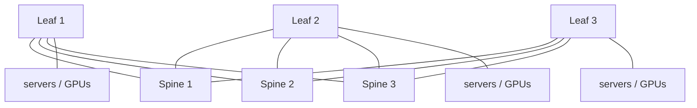

*图6.1——叶脊式Clos架构：每台叶交换机都连接到每台脊交换机，因此任意到任意的流量都走"叶-脊-叶"路径，等价代价路径的数量与脊交换机数量相同（ECMP）。AI互连结构通常采用1:1（无阻塞）的超额订阅比。*

**面向超大规模场景的三层Clos（超级脊，super-spine）架构：**

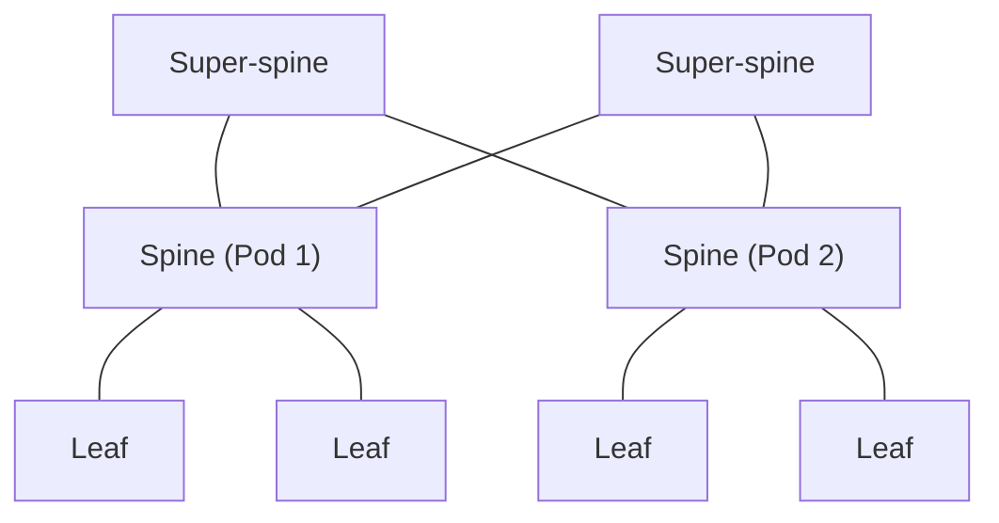

*图6.2——超级脊层将多个叶脊互连结构组成的Pod拼接在一起，通过在每一层都使用ECMP，可扩展到数十万个端点。*

**替代拓扑——二维环面（HPC/TPU风格）：**

```
        +----+   +----+   +----+
        | N00|---| N01|---| N02|--(wrap)
        +----+   +----+   +----+
          |        |        |
        +----+   +----+   +----+
        | N10|---| N11|---| N12|--(wrap)
        +----+   +----+   +----+
          |        |        |
        +----+   +----+   +----+
        | N20|---| N21|---| N22|--(wrap)
        +----+   +----+   +----+
       (wrap)    (wrap)   (wrap)
```

*图6.3——环面（torus）拓扑仅将每个节点与其最近邻节点相连，并带有环绕（wraparound）链路——对邻近节点间的流量而言跳数很少，但对全互连（all-to-all）流量而言表现不佳。谷歌的TPU Pod采用基于光链路和光电路交换的三维环面（第11篇、第15篇）。*

拓扑的选择决定了数据中心网络的可扩展性、对分带宽（bisection bandwidth）、时延、成本和容错能力。以太网支持多种拓扑，各自适用于不同的工作负载。

##### 胖树/Clos——占主导地位的拓扑

**Clos拓扑**（以查尔斯·克洛斯（Charles Clos）命名，他于1953年为电话交换系统描述了这一拓扑），在数据中心中实现为**胖树（fat-tree）**或**叶脊（leaf-spine）**互连结构，是当今数据中心中占绝对主导地位的拓扑。其原理是：用许多分层排列的小型物理交换机构建出一台大型逻辑交换机，使得任意两个端点之间存在多条等价代价路径，且各层之间的聚合带宽（"对分带宽"）足够高，足以实现无阻塞（或接近无阻塞）。

在**两层叶脊**互连结构中，每台**叶（leaf）**（机架顶）交换机都连接到每台**脊（spine）**交换机。从一台叶交换机下的服务器发往另一台叶交换机下的服务器的报文，走"叶→脊→叶"的路径，由于每台叶交换机都能到达每台脊交换机，路径数量与脊交换机数量相同，流量通过**ECMP**在这些路径间实现负载均衡。**超额订阅比（oversubscription ratio）**——下行带宽（连接服务器）与上行带宽（连接脊交换机）之比——是一个关键的设计参数：对于任意到任意带宽至关重要的AI互连结构，采用**1:1（无阻塞）**；而对于并非所有服务器都同时突发流量的通用计算场景，**4:1或8:1**的超额订阅比是可以接受的。

为实现更大规模，**三层Clos架构**会在多个叶脊互连结构组成的Pod之上再加一层**超级脊（super-spine）**，并在每一层都使用ECMP，从而可扩展到数十万个端点。各大云计算厂商的数据中心互连结构——谷歌的Jupiter、Meta的互连结构、微软和亚马逊的网络——都是Clos原理的精心演绎，无一不精心打磨，力求用商用交换芯片构建出巨大的对分带宽。

##### 蜻蜓型（Dragonfly）——HPC的直径缩减方案

**蜻蜓型拓扑（dragonfly topology）**用于Cray/HPE Slingshot互连结构等HPC系统，它将交换机分组为若干"组"（Pod），组内实现全互连，组间则通过较为稀疏的全局链路连接。蜻蜓型拓扑的优势在于网络**直径**低（任意两个端点之间跳数少），且所需的昂贵全局（通常是光学的）链路数量少于完整胖树所需的数量。当全局带宽是成本高昂的资源时，这种拓扑更受青睐。**dragonfly+**变体对组内拓扑进行了改进。蜻蜓型是许多规模最大的超级计算机所选择的拓扑，其设计原理也影响着AI互连结构的设计。

##### 环面与网格——TPU的方案

**环面（torus）**拓扑将节点连接成规则的网格（二维、三维或更高维），并带有环绕链路，因此每个节点只与其最近邻节点相连。环面对于最近邻通信有着较低的跳数，且无需Clos所要求的大型交换机层级即可扩展，但其在全互连流量（必须经过多次跳转）上的表现较差。**谷歌的TPU Pod采用三维环面**，每颗TPU芯片在三个维度上各有光链路（共六条链路），通过光电路交换机互连。这是一种与用于通用计算的Clos互连结构截然不同的架构，专为TPU工作负载的特定通信模式而优化，并可通过光交换（见下文）实现可重构。TPU v2/v3/v4使用规模不断扩大的环面互连。

##### 面向AI的导轨优化（Rail-Optimized）拓扑

AI集群采用**导轨优化（rail-optimized）**设计，以最小化集合通信中的跳数。在**单导轨（single-rail）**设计中，只有一个网络平面；在**双导轨（或多导轨）（dual-rail / multi-rail）**设计中，存在多个独立的Clos网络（导轨），每颗GPU都连接到每条导轨，从而提供容错能力和带宽倍增效果。GPU到导轨的映射方式以及每条导轨自身的拓扑，都经过精心设计，以确保全互连（all-to-all）和全归约（all-reduce）等集合通信操作经过尽可能少的跳数，并避免拥塞。NVIDIA的DGX SuperPOD参考架构正是出于这一原因，规定了特定的导轨拓扑（第15篇）。

##### 光电路交换——可重构拓扑

最先进的拓扑创新是**光电路交换（Optical Circuit Switching, OCS）**，由**谷歌**率先在大规模场景下实现（其Palomar系统及与Jupiter深度集成的OCS，见SIGCOMM 2022年"Jupiter Evolving"论文所述）。OCS使用MEMS微镜（或其他光交换技术）在物理层面重新配置交换机之间的光连接，动态改变网络拓扑——重配置通常耗时约10毫秒。这使互连结构能够根据流量调整其拓扑：为大型"大象"流分配专用的直连光路，或重新配置以便为某种特定的集合通信模式提供无阻塞连接。对于AI训练而言，不同的并行策略和不同的集合通信操作会对网络造成不同的压力，因此重新配置拓扑的能力是一项强大的工具，谷歌已经借助OCS提升了其Jupiter互连结构的效率和可增量升级性。OCS模糊了分组交换与电路交换两个世界之间的界线，是AI网络未来发展的一个重要主题（第11篇、第15篇、第24篇）。

#### 数据中心以太网拥塞管理

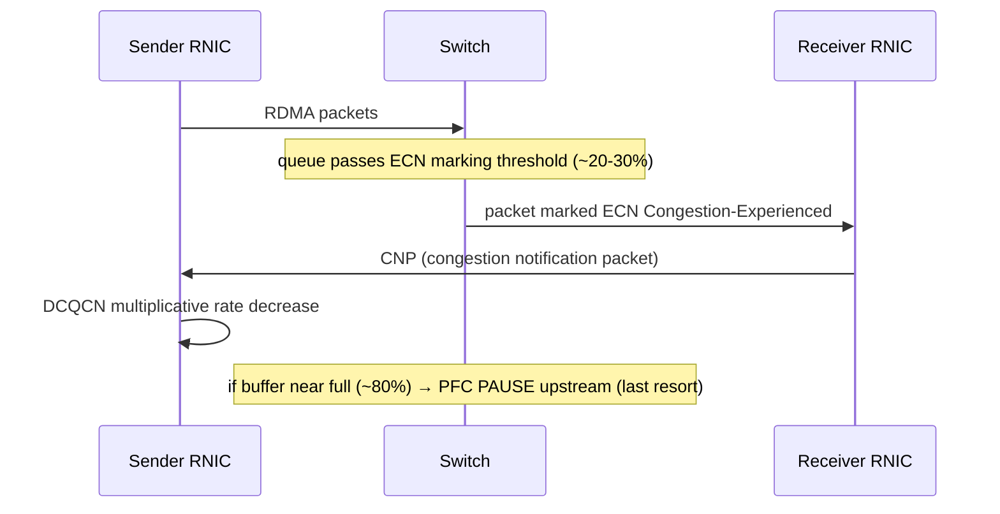

*图6.4——RoCEv2拥塞控制闭环。ECN/DCQCN是主要的、能优雅地把队列维持在较短水平的控制手段；PFC则是最后一道安全网，如果设计不当，其背压效应可能扩散拥塞、甚至造成死锁（第02篇、第17篇）。*

数据中心以太网中最棘手的问题——也是决定以太网能否在AI领域与InfiniBand一较高下的问题——是**面向无损RDMA的拥塞管理**。RoCEv2（第08篇）要求无损的互连结构，因为一个丢弃的报文会引发昂贵的RDMA重传。要在以太网这样尽力而为（best-effort）的技术上实现无损，需要一整套精心设计的机制。

##### PFC——无损基础及其病理

**优先级流控（Priority Flow Control, PFC，IEEE 802.1Qbb）**是无损以太网的基石。它将旧有的PAUSE机制扩展为按优先级运作：当交换机上某个优先级类别（例如RDMA类别）的缓冲区接近满载时，它会向该优先级的上游发送方发送一个PFC PAUSE帧，告知其在指定时间内停止发送该类别的流量。这种**逐跳背压（hop-by-hop backpressure）**可以防止缓冲区溢出和丢包，但会将拥塞逐链路向上游传播。

PFC让无损成为可能，但它是一种粗暴的工具，存在严重的病理问题：
- **队头阻塞（Head-of-line blocking）**：暂停某个优先级类别，会停止该链路上*所有*属于该类别的流量，包括那些并未导致拥塞的流。
- **拥塞扩散**：PFC将背压向上游传播，因此某台交换机上的拥塞可能导致多跳之外的发送方停顿，将问题扩散到整个互连结构。
- **PFC风暴与死锁**：如果缓冲区依赖关系形成了环路（不谨慎的拓扑或路由设计可能造成这种情况），PFC背压可能使整个互连结构彻底死锁——这是一种灾难性的故障模式。避免PFC死锁需要精心设计拓扑和路由（第17篇）。

由于存在这些病理问题，良好互连结构设计的目标是仅将PFC用作**最后一道安全网**，并通过（下文所述的）拥塞控制机制把队列维持在足够短的水平，使PFC很少被触发。

##### DCQCN——RoCE拥塞控制的主力方案

**DCQCN（Data Center Quantized Congestion Notification，数据中心量化拥塞通知）**由微软和Mellanox开发，发表于SIGCOMM 2015，是RoCEv2中占主导地位的拥塞控制算法。它将交换机上的**ECN标记**与RoCEv2网卡上的**速率控制**结合起来。当交换机的队列超过某个阈值时，它会用ECN"已发生拥塞（Congestion Experienced）"码点标记报文（而非丢弃它们）；接收方通过拥塞通知报文（Congestion Notification Packet）将这些标记反馈给发送方；发送方则通过对自身拥塞状态建模，在检测到拥塞时执行乘性速率下降，在没有拥塞时执行加性（以及"超激进"）速率上升——概念上类似于DCTCP，但实现在网卡中以服务于RDMA。DCQCN将队列维持在足够短的水平，使PFC很少被触发，PFC只作为后备手段。它已在Azure、AWS、阿里巴巴以及许多其他RoCEv2互连结构中大规模部署，而针对特定集群规模和消息大小分布调优其参数（第17篇）是一项核心的运维技能。

##### HPCC——高精度拥塞控制

**HPCC（High Precision Congestion Control，高精度拥塞控制）**由阿里巴巴提出（SIGCOMM 2019），通过使用**带内网络遥测（In-band Network Telemetry, INT）**改进了DCQCN粗粒度的ECN信号：交换机将精确的队列深度、链路利用率和时间戳直接嵌入报文头，使接收方/发送方能够准确了解每一跳的拥塞程度，并据此计算出所需的精确速率调整量。HPCC实现了远为精细的队列控制（稳态队列占用率约为0.5%，相比之下DCQCN为5–10%），反应更快，并避免了基于ECN的控制中常见的过冲和欠冲问题。它需要交换机支持INT，目前已在阿里云中部署。HPCC体现了由遥测数据驱动、追求高精度的拥塞控制这一发展趋势。

##### Swift与Timely——基于时延的控制

**Swift（谷歌）**和**Timely（谷歌/微软）**采用基于时延的方法，使用**RTT测量值**而非ECN标记作为拥塞信号。**Timely**直接从ACK的到达时序中测量RTT，并根据RTT的变化梯度（RTT是上升还是下降）及其绝对值调整发送速率，对PFC的依赖较小。**Swift**部署在谷歌的Jupiter互连结构中，其目标是让端到端RTT尽量接近基准（空队列）RTT，用单一机制同时处理短流和长流，并与谷歌的主机网络协议栈紧密集成。基于时延的控制方式的吸引力在于，它使用的信号（RTT）能直接反映排队状况，而无需依赖交换机的ECN配置，这种思路对下一代传输协议的设计（包括Ultra Ethernet联盟的相关工作）颇具影响力。

##### Ultra Ethernet联盟

这些努力的集大成者是**Ultra Ethernet联盟（Ultra Ethernet Consortium, UEC）**，这是一项产业联合行动（成员包括AMD、博通（Broadcom）、思科、Meta、微软等众多厂商），旨在为AI和HPC量身定制一套完整、现代化的以太网协议栈——涵盖一种新的传输协议（具备改进的拥塞控制、多路径能力和对乱序到达的容忍度）、用于改善负载均衡的报文喷洒（packet spraying）技术，以及各层之间更紧密的集成。UEC代表着开放以太网生态系统对InfiniBand以及NVIDIA Spectrum-X给出的协同回应，旨在通过一个完全开放、多厂商的以太网标准，交付InfiniBand级别的AI互连结构性能。它的进展是AI网络领域最具深远影响的发展之一（第15篇、第24篇）。

#### 深入探讨：缓冲区大小、Incast与微突发问题

除了这些冠名的拥塞控制算法之外，交换机中的物理**缓冲**及其与突发性流量的相互作用，正是许多真实数据中心网络成败的关键所在，值得专门探讨。其典型病理是**incast（多对一拥塞）**：多个发送方同时向单个接收方（或通过单个交换机端口）发送数据，例如当一次分布式查询扇出到许多服务器、这些服务器同时作出响应时会发生这种情况；又如更为剧烈的情形——当数千颗GPU同时完成一个计算阶段，并同时向聚合交换机突发流量以执行AllReduce操作时。这种同步到达的流量会压垮出端口的缓冲区，如果没有足够的缓冲或足够快的流控，报文就会被丢弃（这对RDMA而言是灾难性的），或者触发PFC（从而扩散拥塞）。**微突发（microburst）**——持续时间以微秒计、远短于多数监控系统粒度的突发流量——是一种隐蔽的形式：平均利用率看起来一切正常，但瞬时突发会溢出缓冲区，导致常规遥测手段根本看不到的丢包或PFC事件（这也正是微秒级粒度遥测技术（第22篇）之所以重要的原因）。

缓冲区大小该定多少——这一问题有着漫长且充满争议的历史。经典的经验法则（带宽×时延乘积）建议使用大缓冲区，但数据中心的RTT极小（微秒级），过度的缓冲会造成"缓冲区膨胀（bufferbloat）"（因报文滞留在深队列中而导致高时延）。数据中心给出的答案通常是：对于时延敏感型互连结构，采用**浅缓冲加激进拥塞控制**（保持队列短、反应快）；而对于路由/AI脊柱角色（第14篇）中需要吸收突发流量的场景，则采用**深缓冲**——这就是浅缓冲与深缓冲之争。具体到AI互连结构而言，缓冲区必须能够在拥塞控制作出反应所需的时间（大致相当于一个RTT）内，吸收最坏情况下的同步incast流量，这就设定了每端口所需的最小缓冲区；把这个量估计错了，要么导致丢包/PFC（缓冲太小），要么带来额外的时延和成本（缓冲过大）。缓冲区大小、ECN标记阈值、PFC阈值与拥塞控制反应时间之间的相互作用，正是无损互连结构调优（第17篇）的核心所在。

#### 深入探讨：PFC死锁的剖析

由于PFC死锁是无损以太网最令人畏惧的故障模式，理解其发生机制颇有价值。PFC会产生背压：一台拥塞的交换机会暂停其上游邻居，而如果该上游邻居自身的缓冲区随之填满，它又会暂停*它*的上游邻居，如此逐级传递。当这种背压形成一个环路时——交换机A因等待交换机B而被暂停，交换机B因等待交换机C而被暂停，交换机C又因等待交换机A而被暂停——就会发生**死锁**：环路中没有任何一台交换机能够排空其缓冲区，整个环路永久性地冻结，导致互连结构中一大片区域瘫痪。形成这种环路的条件颇为微妙：一个采用严格上/下（up/down）转发规则的纯粹Clos互连结构不存在循环缓冲区依赖，因而是无死锁的，但**路由异常**——例如链路故障导致流量走上意外路径、不完善的ECMP重哈希，或存在循环路径的拓扑——可能形成循环的缓冲区依赖，而PFC随后会将其锁死成死锁。这正是为什么互连结构设计者不遗余力地确保路由无死锁（通常采用单一的无损优先级类别，以及能够从原理上证明可消除环路的拓扑/路由规则）；这也是为什么PFC看门狗（第17篇）会被用来检测并解除卡死的暂停状态；同时也是为什么许多架构师将PFC视为一种应尽量减少而非依赖的"必要之恶"——这正是推动整个行业不断改进拥塞控制（DCQCN、HPCC）、以及转向仅依赖拥塞控制或调度式互连结构方案（以减少甚至消除对PFC依赖）的深层动因。

#### 深入探讨：智能网卡、主机网络与互连结构的边缘

数据中心以太网互连结构并不止于交换机；它还延伸进了**主机**内部，而主机网络的演进是这一互连结构整体行为中不可或缺的一部分。现代服务器网卡已不再是简单的报文搬运工，而是能够执行TCP分段卸载、校验和卸载、接收端扩展（Receive-Side Scaling，将流量分散到多个CPU核心）、RDMA的精密引擎，并且越来越多地承担起完整的隧道封装（VXLAN）、安全（IPsec/TLS）和虚拟化（SR-IOV、Open vSwitch）卸载功能——也就是智能网卡（SmartNIC）和DPU的功能（第07篇、第19篇）。对于AI和无损互连结构而言，网卡正是拥塞控制（DCQCN、UEC传输协议）实际实现的地方，是RDMA队列对（queue pair）所在的地方，是GPUDirect将数据投递进GPU显存的地方，也是互连结构行为最终在端点上得以实现的地方。以太网互连结构的"边缘"——网络与主机之间的边界——因此正变得越来越智能、越来越可编程，而网卡拥塞控制、交换机ECN/PFC行为与拓扑路由三者的协同设计，正是让无损RoCE互连结构得以正常运作的关键（第17篇）。DPU正朝着一种全面可编程基础设施处理器的方向发展（运行自己的操作系统，卸载网络/存储/安全功能），这意味着互连结构的主机端边缘本身正在成为一台真正意义上的计算机，模糊了网络与服务器之间的边界，正如die-to-die互连模糊了芯片与网络之间的边界一样。

#### 深入探讨：为什么以太网总能获胜

值得退后一步思考：为什么以太网屡次击败技术上更胜一筹的竞争者——令牌环、FDDI、ATM，以及在通用计算领域的光纤通道——因为这一模式也照亮了当下与InfiniBand的较量。以太网的历次胜利都遵循同一种机制：它是一种**开放、多厂商标准**，背后有整个产业的规模支撑，因此能获得最多的竞争、最多的投资、最快的成本下降，以及最广泛的工具、人才和配套产品生态。某项竞争技术在推出时可能更优秀，但受其规模和开放性的推动，以太网改进得更快、成本降得也更快，往往只需一两代时间，就能以竞争对手一小部分的成本，实现其大部分能力，届时竞争对手的细分市场便随之崩溃。ATM在技术上颇为精妙，具备以太网所欠缺的服务质量（QoS）保证，但以太网凭借其简单性、成本优势和不懈的速率提升赢得了胜利。光纤通道曾是更优越的存储互连结构，但以太网（通过iSCSI，如今又通过NVMe/TCP和RoCE）正在稳步吸收存储网络领域。

这段历史是支持以太网最终也将在AI互连结构领域胜出的最有力论据——而上文提到的Ultra Ethernet联盟，正是通过开放、多厂商以太网交付InfiniBand级AI性能这一目标的明确实现机制。反对的观点认为，NVIDIA的垂直整合（GPU + InfiniBand + NCCL）打造出了一套紧密协同设计的系统，开放标准难以与之匹敌，而AI时代的发展节奏也许不会给以太网留出足够时间在市场结构固化之前迎头赶上。但历史规律的力量是强大的：背靠整个产业全部分量的开放标准往往能够获胜，而掌握需求主导权的各大云计算厂商，正是因为早已见识过这样的剧情、更倾向于避免被单一厂商锁定，才在大力推动以太网。AI是否会成为验证这一规律的例外，还是以太网漫长胜利史中的又一个篇章，是该领域悬而未决的核心问题（第07篇、第15篇、第24篇）。

#### 深入探讨：通道速率倍增的经济学

以太网速率提升的节奏——每通道10G、25G、50G、100G、200G——遵循着一套值得明确阐述的经济逻辑，因为它解释了为什么产业按这样的步伐前进，以及为什么每一步都如此举足轻重。其根本驱动力是**每比特成本**：每一种新的每通道速率，一旦成熟，都能以低于上一代的每比特成本提供带宽，因为同样的物理通道（一个SerDes、一条光通道、一根光纤）如今能承载更多数据。这正是为什么25G通道取代了10G通道（4×25G=100G在每比特成本上优于4×10G=40G，最终淘汰了40G），也是为什么此后每一次翻倍（每通道50G、100G、200G）都会推动数据中心围绕新的通道速率进行整体性的重新架构。

但每一次翻倍都比上一次更难。迈向50G需要PAM4（因而也需要FEC和精密的均衡技术，以及随之而来的功耗和时延成本）；迈向100G则将铜缆传输距离逼到了极限（即使是短链路也要依赖有源电缆（AEC）和光模块）；而迈向每通道200G（用于1.6T以太网）的难度之大，已经迫使光学集成转型（LPO、CPO，第13篇）成为必然——电气通道几乎难以到达前面板，更遑论跨越整个机架。因此，在每比特成本持续降低这一不懈经济动力的驱使下，通道速率演进的节奏正撞上日益加剧的物理难题，每一代都需要更为艰巨的工程突破（更好的SerDes、PAM4、FEC，进而是线性驱动和协封装光学器件）才能维持每比特成本的持续改善。以太网速率发展的历史，正是这种张力的历史——即"每通道容纳更多比特"的经济拉力，与"信号传输难度不断加大"的物理阻力之间的博弈——理解这一点，既能解释产业的路线图，也能说明为什么光学集成转型如今已不可避免。通道是以太网经济学的基本单元，而不断倍增其速率的引擎，正是推动数据中心从10G迈向1.6T的动力所在。

#### 结语：以太网对AI互连结构的角逐

以太网的历史是一部胜利的历史——战胜了令牌环，战胜了ATM，在通用场景中也战胜了光纤通道——而这些胜利靠的从来不是在高端领域拥有最强的技术，而是靠开放、廉价、无处不在，以及不懈的持续改进。AI时代给以太网带来了迄今为止最严峻的考验：一项历来尽力而为、并不保证无损的技术，能否在地球上要求最苛刻的集合通信场景中，匹敌InfiniBand与生俱来的无损特性、低时延和确定性行为？目前正在拼凑出的答案——通过PAM4信号传输、精密的FEC与均衡技术、Clos与导轨优化拓扑、光电路交换，以及从PFC到DCQCN、HPCC、Swift，直至Ultra Ethernet联盟这一整套分层拥塞管理体系——越来越倾向于"能"。各大云计算厂商偏好开放生态系统和运维自主权，正在大举押注以太网用于AI，而整个产业规模和工具链的分量，一如既往地站在它这一边。以太网最终能否在AI训练领域完全取代InfiniBand，还是二者将长期共存，是第07篇和第15篇的核心议题所在。可以确定的是，以太网将一如既往地——正如它过去五十年所做的那样——变得更快、更便宜、更好，并将继续作为数据中心核心的那张无处不在的网络。

[↑ 返回目录 / Back to Table of Contents](#目录--table-of-contents)

---

<a id="sec-27-8"></a>
## 27.8 InfiniBand — 架构、代际演进、RDMA、AI 网络结构与技术路线图

**中文翻译，原文见:** [07_infiniband_deep_dive.md](07_infiniband_deep_dive.md)

---

### InfiniBand — 架构、代际演进、RDMA、AI 网络结构与技术路线图

#### 引言:专为特定用途设计的网络结构

InfiniBand 是一种从诞生之初就是为 AI 训练所面临的确切问题而设计的网络结构:以尽可能低的延迟、零丢包,以及完全绕过 CPU 的直接内存到内存传输,在众多计算机之间移动海量数据。二十年来,它一直是一项专业技术——超级计算机和高端存储的互连方案,对更广泛的计算世界而言几乎是隐形的。随后 AI 训练爆发式增长,InfiniBand 发现自己处于计算史上最重要的一次基础设施建设浪潮的中心,因为训练大语言模型的 GPU 集群恰恰需要 InfiniBand 原生提供的无损、低延迟、RDMA 原生网络结构,而以太网则必须竭力才能勉强逼近这一水平。

本章将全面介绍 InfiniBand:它的历史以及 NVIDIA 收购 Mellanox 这一关键事件、从 SDR 到 XDR 的代际速度路线图、其分层架构(基于信用的链路层、RDMA 传输、子网管理、路由)、主导 AI 网络结构的 NVIDIA 产品家族(ConnectX 网卡、Quantum 交换机、BlueField DPU、NVLink/NVSwitch、SHARP 网内计算),以及 InfiniBand 与以太网在 AI 场景下的详细对比——这一对比构成了本领域核心的战略性问题。本章建立在第 08 篇文件所进一步阐述的 RDMA 概念之上,并直接引出第 15 篇文件中的 AI 网络结构架构。

#### InfiniBand 的历史与生态系统

##### 起源:两种愿景的合并

InfiniBand 诞生于 **1999** 年,源自两个相互竞争的下一代 I/O 方案的合并:**Future I/O**(由 Compaq、IBM 和 HP 支持)与 **Next Generation I/O**(由 Intel 等公司支持)。这一合并后的项目由 **InfiniBand 贸易协会(IBTA)** 主导,旨在用一种交换式、串行、高速的网络结构取代老化的 PCI 总线,使其既能作为系统内部的 I/O 互连,又能作为系统之间的网络。首批产品于 2001 年前后上市。

最初的宏大愿景——取代 PCI 成为每台服务器内部通用的 I/O 网络结构——并未实现;PCIe(第 03 篇文件)赢得了这一角色。但 InfiniBand 在**高性能计算(HPC)**和**高端存储**领域找到了持久且不断增长的立足之地,在那里,其低延迟、高带宽以及原生 RDMA 相较于当时的以太网具有决定性优势。在 2000 年代和 2010 年代,InfiniBand 成为 TOP500 超级计算机中占主导地位的互连方案,也是对延迟敏感的企业存储与数据库集群的标配。以太网赢得了通用计算领域;InfiniBand 则赢得了性能前沿领域。

##### NVIDIA 收购 Mellanox

InfiniBand 历史上最具决定性的单一事件是 **NVIDIA 于 2020 年以约 69 亿美元收购 Mellanox Technologies**。Mellanox 是占主导地位的 InfiniBand 供应商——实际上就等同于整个 InfiniBand 生态系统,提供网卡(ConnectX)、交换机(Switch-IB、Quantum)以及软件。通过收购 Mellanox,NVIDIA 掌控了 AI 训练系统的两端:执行计算的 **GPU**,以及将 GPU 绑定成集群的**互连结构**。

这一战略逻辑,只有事后回顾才能充分显现其非凡之处。随着 AI 训练规模从单个 GPU 扩展到成千上万个 GPU 的集群,互连结构变得与 GPU 同等重要,而 NVIDIA 现在两者兼具。这次收购为 NVIDIA 带来了 ConnectX-7 和 BlueField-3 网卡、Quantum-2 InfiniBand 交换机,以及——至关重要的是——**协同设计** GPU、网卡、交换机和集合通信软件(NCCL)、将其作为单一、垂直整合的 AI 网络结构的能力。这次收购还让 NVIDIA 在 InfiniBand 领域获得了近乎垄断的地位,这种地位赋予了公司巨大的定价权和战略控制力,而 NVIDIA 已在整个 AI 热潮中充分利用了这一点。收购完成后,NVIDIA 的网络业务发展成为一个数十亿美元规模的收入来源,也是其 AI 主导地位的核心支柱。

##### 架构理念:设计上即无损

InfiniBand 与以太网之间最深层的差异在于理念。**InfiniBand 从设计上即为无损**:其链路层采用**基于信用的流量控制**,发送方只有在持有表明接收方拥有缓冲空间的信用时才能发送,因此接收方的缓冲区永远不会溢出,数据包也永远不会因拥塞而被丢弃。无损性是内在固有的,而非事后附加的。

**以太网从设计上是尽力而为的**:它被设计为在拥塞时丢弃数据包,并依赖上层重传,而无损性(对于 RoCEv2 而言)必须通过 PFC 和拥塞控制算法(DCQCN 等)来后加改造,伴随而来的是第 06 篇文件所描述的种种病理问题。InfiniBand 还是**原生 RDMA** 的——RDMA 是其基础传输模型,而非叠加层——而 RoCE 则是将 InfiniBand 的 RDMA 语义适配到以太网之上。这种原生、主动、无损、以 RDMA 为先的设计,是 InfiniBand 面向 AI 的核心技术优势,也正是为什么在要求最苛刻的训练集群中,尽管成本高昂且生态系统由单一供应商主导,InfiniBand 长期以来仍是默认之选。

#### InfiniBand 的代际演进与速率

InfiniBand 的带宽以每通道(per-lane)和每端口(per-port)为单位标注,端口通常聚合 4 个通道(4×)。其代际演进如下:

| 代际 | 约始于年份 | 每通道速率 | 4× 端口速率 | 信令/编码方式 | NVIDIA 产品所处代际 |
|---|---|---|---|---|---|
| SDR(单倍数据速率) | 2001 | 2.5 Gbps | 10 Gbps | 8b/10b | 首代 IB |
| DDR(双倍数据速率) | 2005 | 5 Gbps | 20 Gbps | 8b/10b | — |
| QDR(四倍数据速率) | 2007 | 10 Gbps | 40 Gbps | 8b/10b | — |
| FDR(十四倍数据速率) | 2011 | 14 Gbps | 56 Gbps | 64b/66b | ConnectX-3 |
| EDR(增强数据速率) | 2015 | 25 Gbps | 100 Gbps | 64b/66b | ConnectX-4 |
| HDR(高数据速率) | 2018 | 50 Gbps(PAM4) | 200 Gbps | PAM4 | ConnectX-6、Quantum |
| NDR(下一代数据速率) | 2022 | 100 Gbps(PAM4) | 400 Gbps | PAM4 | ConnectX-7、Quantum-2 |
| XDR(超级数据速率) | 约2025 | 200 Gbps(PAM4) | 800 Gbps | PAM4 | ConnectX-8、Quantum-3 |

关于这一演进过程的一些说明。早期代际(从 SDR 到 QDR)使用**8b/10b 编码**,其开销为 20%;**FDR** 转向效率高得多的**64b/66b 编码**(开销 3%),并将每通道速率提升到 14 Gbps(因此得名"十四倍数据速率")。**EDR** 以每通道 25 Gbps 的速率首次实现了"100G InfiniBand"(4×25),与 25G 以太网通道时代保持一致。**HDR** 引入了**PAM4**,每通道 50 Gbps,构成 200G 端口,为 NVIDIA DGX A100 系统提供动力。**NDR** 再次翻倍至每通道 100 Gbps(400G 端口),为 DGX H100 提供动力。**XDR** 于本世纪中期随 ConnectX-8 和 Quantum-3 到来,达到每通道 200 Gbps(800G 端口),在 AI 网络结构领域与 800G 以太网直接竞争。

此外还存在**半宽变体**——HDR100、NDR100——它们使用 2 个通道而非 4 个通道(例如 2×50G = 100G,2×100G = 200G),用于不需要完整 4× 宽度的服务器端口,使一个交换机端口可以被拆分,从而以更经济的方式服务更多端点。

#### InfiniBand 架构深度剖析

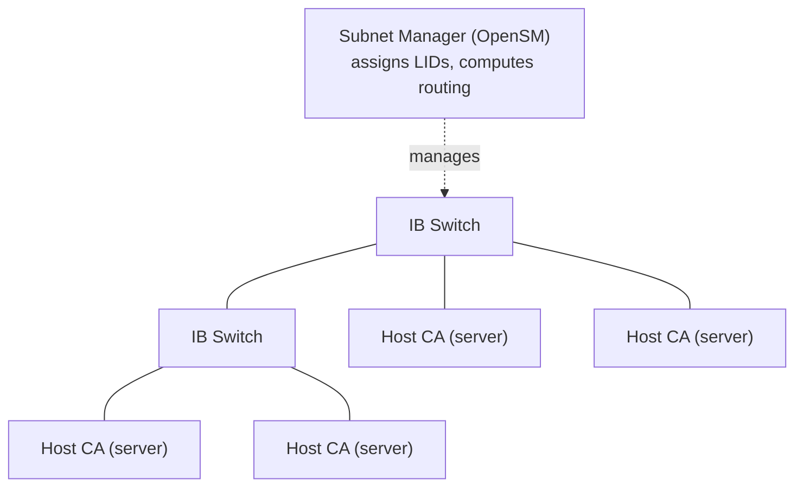

*图7.2 —— InfiniBand 采用集中式控制:子网管理器负责发现网络结构、分配 16 位 LID,并计算无死锁的转发表——这与以太网分布式、自配置的 BGP/ECMP 控制平面形成鲜明对比。每条链路上基于信用的流量控制使该网络结构在设计上即为无损。*

##### 链路层:基于信用的流量控制

InfiniBand 的链路层围绕**虚拟通道(VL)**和**基于信用的流量控制**构建。一条物理链路被划分为最多 **16 条虚拟通道(VL0–VL15)**,每条通道都拥有各自独立的缓冲区和信用池(VL15 保留用于子网管理流量)。基于信用的流量控制机制如下:接收方向发送方通告其可用缓冲空间的大小,以信用为单位;发送方只能发送不超过其所持信用数量的数据;随着接收方清空其缓冲区并释放空间,它会归还信用。由于发送方永远不会发送超出接收方缓冲能力的数据,**数据包永远不会因拥塞而被丢弃**——无损性在链路层是主动地、有保障地实现的。

这与以太网的 PFC 形成鲜明对比,PFC 是**被动反应式的**:以太网自由发送数据,直到接收方缓冲区几乎溢出时,才发送一个 PAUSE 帧以停止发送方。InfiniBand 主动式的信用机制避免了缓冲区溢出边缘博弈的风险,以及困扰 PFC 的拥塞扩散病理问题。由于每条虚拟通道都拥有独立的缓冲和流量控制,虚拟通道还提供了原生的服务质量隔离。

##### 传输层:连接类型

InfiniBand 的传输层定义了若干**服务类型**,它们在可靠性、有序性和可扩展性之间进行权衡:
- **可靠连接(RC)**:面向连接,保证按序交付并带确认——是 HPC 和 AI 中 RDMA 的主力服务类型,以 RDMA 语义提供类似 TCP 的可靠性。
- **不可靠连接(UC)**:面向连接但不带确认;在应用能够容忍丢失的场景下开销更低。
- **不可靠数据报(UD)**:无连接,不保证交付——用于可扩展的组播,以及自行管理可靠性的应用;UD 可以扩展到大量对等端,而无需维护逐连接状态。
- **可靠数据报(RD)**:一种无连接的可靠服务,实际中很少使用。
- **扩展可靠连接(XRC)**:一项重要的可扩展性增强,允许多个队列对共享资源,从而缓解"N² 队列对问题"——在朴素的 RC 方案中,每一对进程都需要各自的队列对,因此一个跨 M 个节点、每节点 N 个进程的作业需要数量庞大的队列对;XRC 大幅降低了这一数量,对大规模 MPI 作业至关重要。

##### RDMA Verbs

InfiniBand 的编程模型是 **verbs** API,它将 RDMA 操作直接暴露给应用程序:
- **RDMA 写(RDMA Write)**:源端网卡将数据直接写入远端节点内存的指定区域,**不涉及远端 CPU**。远端 CPU 不会被中断,也不会为该传输消耗任何周期。
- **RDMA 读(RDMA Read)**:源端直接从远端内存读取数据,同样不涉及远端 CPU。
- **原子操作**:**比较并交换(CAS)**和**取并加(Fetch-and-Add)**在远端内存上原子地执行,支持分布式同步原语。
- **发送/接收(Send/Receive)**:双边操作,接收方发布一个接收缓冲区,发送方向其中发送数据(这是唯一需要接收方参与的操作)。

其决定性特征是**内核旁路(kernel bypass)**:verbs 在用户空间执行,应用程序通过内存映射 I/O 直接向网卡发布工作请求,完全绕过操作系统内核。没有系统调用,没有内核网络协议栈,没有数据拷贝——网卡通过 DMA 直接在应用内存和线路之间传输数据。这正是 RDMA 具备亚微秒级小消息延迟和近乎零 CPU 开销的原因,也是高性能分布式计算的基础。

##### 队列对与内存注册

核心的 RDMA 对象包括:
- **队列对(QP)**:一个发送队列加一个接收队列——即 RDMA 连接的端点。应用程序向这些队列发布工作请求(WR)。
- **完成队列(CQ)**:网卡在此发布完成通知;应用程序轮询 CQ 以获知操作已完成(为获得最低延迟,采用轮询而非中断)。
- **内存区域(MR)**:向网卡**注册**的一段应用内存,使网卡能够对其进行 DMA 读写。注册会锁定该内存(防止其被换出),并生成授权访问所需的密钥(本地密钥和远程密钥)。内存注册存在开销,而高效地管理这一开销(注册缓存、按需分页)是重要的性能考量因素。
- **保护域(PD)**:一个隔离边界,将 QP 和 MR 分组,防止一个应用访问另一个应用的内存。
- **地址句柄(AH)**:用于不可靠数据报通信的目的地寻址信息。

##### 子网管理

一个 InfiniBand 网络(即一个"子网")由运行在管理节点上的**子网管理器(SM)**——可以是开源的 **OpenSM**,也可以是厂商自有实现——进行集中管理。与以太网分布式、自配置的控制平面(每台交换机各自运行 BGP 或独立学习 MAC 地址)不同,InfiniBand 采用**集中式管理**:SM 负责发现拓扑、为每个端口分配一个**16 位的 LID(本地标识符)**、为每台交换机计算转发表、配置 QoS 和分区,并持续监控整个子网。16 位 LID 地址空间将单个子网的规模限制在 65,536 个端点;更大规模的网络则通过 InfiniBand 路由器连接多个子网。

这种集中式模型既是优势也是短板。它能够实现全局最优的路由和严格的控制,但需要运行并保护 SM,并且这一管理模式对于浸淫于以太网/IP 工具体系的网络工程师而言并不熟悉——这是超大规模云厂商偏好以太网的一个真实因素。

##### 路由

InfiniBand 交换机根据目的 LID,依据由 SM 计算出的**线性转发表**进行转发。SM 会运行一种适合当前拓扑的**路由算法**——对通用拓扑采用 **MINHOP**,对胖树拓扑采用 **上/下路由(up/down routing)**(数据包先上行到共同的祖先交换机,再下行,以保证无死锁),或针对特定结构采用 **DFSSSP** 等其他算法。NVIDIA 的 Quantum 交换机支持**自适应路由(AR)**,使交换机能够根据当前拥塞情况,将数据包动态改道至拥塞较轻的路径,而非死板地遵循预先计算好的转发表,从而改善不规则、突发流量下的负载均衡——这对于集合通信模式容易造成热点的 AI 工作负载而言,是一项显著优势。自适应路由必须谨慎实施,以保持 RDMA 所依赖的无损、有序语义。

#### NVIDIA AI 网络结构产品

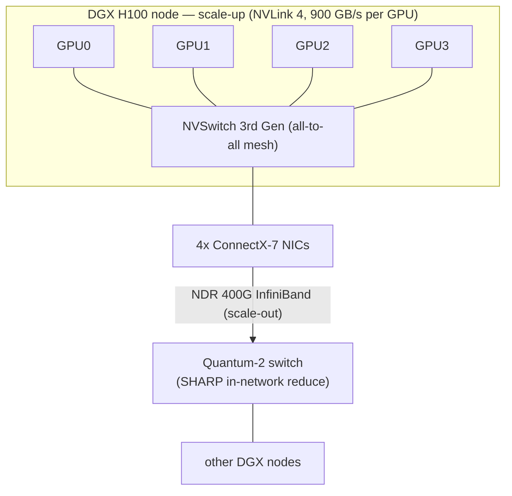

*图7.1 —— NVIDIA 的双层 AI 网络结构:NVLink/NVSwitch 在节点内部提供超高带宽的纵向扩展(scale-up)网状网络,而 InfiniBand(ConnectX-7 网卡接入 Quantum-2 交换机,由 SHARP 执行网内梯度归约)则在节点之间提供横向扩展(scale-out)网络结构(见第 15 篇文件)。*

NVIDIA 在收购 Mellanox 之后的网络产品组合,是一套与其 GPU 和软件协同设计的垂直整合 AI 网络结构。

##### ConnectX-7 与网卡产品线

**ConnectX-7** 是 NVIDIA 的 NDR 代网络适配器,支持 **400 Gbps InfiniBand(NDR)或 400 GbE**,采用 PCIe 5.0 主机接口。除了原始带宽之外,ConnectX-7 还提供 **MPI 集合通信的硬件卸载**,并支持 **SHARP**(见下文),以及大量面向存储和网络的卸载功能。作为 XDR 代继任者的 **ConnectX-8** 将速率提升至 800 Gbps。这些网卡是 AI 网络结构的端点,分布在每台 GPU 服务器中,并通过 **GPUDirect RDMA**(网卡直接对 GPU 内存进行 DMA 读写,完全绕过 CPU 和主机内存)将数据直接送入 GPU 内存。

##### Quantum-2 与 Quantum-3 交换机

**Quantum-2** 是 NVIDIA 的 NDR InfiniBand 交换机:提供 **64 个 400 Gbps 端口**,总计 **25.6 Tbps** 的无阻塞交换容量,支持自适应路由、FEC,以及——至关重要的——**交换机内 SHARP 计算**。Quantum-2 是 DGX SuperPOD 网络结构的构建单元。作为 XDR 代交换机的 **Quantum-3** 将每端口速率提升至 800 Gbps,聚合容量也大幅提高,将 NVIDIA 在 InfiniBand 领域的领先地位延伸至 800G 时代,并与 800G 以太网 AI 网络结构展开竞争。

##### SHARP —— 网内计算

**SHARP(可扩展分层聚合与归约协议,Scalable Hierarchical Aggregation and Reduction Protocol)** 是 NVIDIA 最重要的网络结构差异化能力之一。在传统的 AllReduce 中,梯度数据在跨所有参与者进行归约(求和)的过程中会多次穿越网络——在环形 AllReduce 中,每份数据大约要跨越网络结构两次。SHARP 则将**归约操作转移到交换机 ASIC 内部**:当梯度数据沿着交换机树向上流动时,每台交换机对来自其子节点的贡献求和,并只转发部分和,因此数据是在**网络内部**被归约的,而不是在端点上。其结果是 AllReduce 以远少得多的数据移动量完成——相比环形算法,实际上大致将 AllReduce 的有效带宽**提升了一倍**,并省去了端点归约这一步骤。Quantum-2 交换机可在网络内部执行 FP16/BF16/INT 归约。SHARP 是**网内计算**的一个具体实例,也是 InfiniBand 网络结构能够提供更优集合通信性能的主要原因之一——这也是以太网网络结构正在竞相追赶的能力(见第 15 篇文件)。

##### BlueField DPU

**BlueField-3 DPU(数据处理单元,Data Processing Unit)**在单一器件上将一颗 ConnectX-7 网卡与一个 16 核 Arm CPU 复合体结合在一起,构成了一个可编程的基础设施处理器。它将整个"基础设施"工作负载从主机 CPU 上卸载出来——存储虚拟化(NVMe-oF)、安全(IPsec、TLS)、网络虚拟化(Open vSwitch、VXLAN VTEP)等等——从而释放主机核心用于应用工作负载,并在租户工作负载与基础设施功能之间提供一个隔离边界。**SmartNIC**(带有部分卸载能力的网卡)与 **DPU**(拥有完整可编程 CPU 复合体和操作系统的网卡)之间的区别,正是由 BlueField 所体现——它运行自己的 Linux 系统,并可通过 NVIDIA 的 DOCA 框架进行编程。DPU 是第 19 篇文件和第 20 篇文件中安全与虚拟化架构的核心组成部分。

##### NVLink 与 NVSwitch —— 纵向扩展网络结构

与 InfiniBand(节点之间的横向扩展网络结构)不同,**NVLink** 是 NVIDIA 用于在节点内部连接 GPU 的**纵向扩展(scale-up)**网络结构。**NVLink 4.0** 通过每颗 GPU 18 条链路,为每颗 H100 GPU 提供 **900 GB/s 的双向带宽**,而 **NVSwitch(第三代)**则以该带宽将一台 DGX H100 中的 8 颗 GPU 连接成完全的全互连(all-to-all)网状网络。**NVLink 5.0**(Blackwell 代)将每条链路的带宽提升一倍,而 **GB200 NVL72** 机架级系统通过第四代 NVLink 交换机,将 **72 颗 Blackwell GPU 和 36 颗 Grace CPU** 连接成一个单一的巨型纵向扩展域,每颗 GPU 拥有 **1.8 TB/s 的双向 NVLink 带宽**。NVLink 的带宽——大致是最快的横向扩展网络结构每 GPU 带宽的两倍——正是使张量并行(要求在一个 Transformer 层内进行频繁、对延迟敏感、高带宽的集合通信)得以实现的关键,也是 NVIDIA 最严加守护的专有优势,是开放的 UALink 项目(见第 24 篇文件)所瞄准的目标。

#### InfiniBand 与以太网在 AI 场景下的详细对比

对于 AI 训练网络结构而言,选择 InfiniBand 还是以太网是本领域最具决定性的问题,其取舍是多维度的:

**延迟。** InfiniBand NDR 的 MPI 延迟约为 **600 纳秒**,而以太网上的 RoCEv2 通常为 **1–2 微秒**。InfiniBand 更低、更确定的延迟有利于训练过程中占主导地位的、对延迟敏感的同步集合通信。延迟分布的尾部比均值更重要(因为集合通信操作本质上是屏障),而 InfiniBand 基于信用的无损设计能产生更收窄的尾部延迟。

**拥塞控制。** InfiniBand **基于信用的流量控制是主动且确定性的**——没有丢包,没有 PFC 风暴,在 AllReduce 同步突发流量下行为可预测。RoCEv2 的 **DCQCN 是被动反应式的**,即便经过良好调优,仍会出现偶发的微突发以及 PFC 病理问题的风险。对于大规模的全互连(all-to-all)流量,InfiniBand 的可预测性是一项实实在在的优势,不过以太网的拥塞控制正在快速改进(HPCC、Ultra Ethernet)。

**管理与生态熟悉度。** InfiniBand 需要一套大多数网络运营人员并不熟悉的**子网管理器和专有管理平面**。以太网则使用运营人员早已熟知的**标准 BGP/OSPF、OpenConfig、gNMI 以及整个以太网工具生态系统**。对于运营着庞大机队、拥有成熟运维实践的超大规模云厂商而言,这种熟悉度是转向以太网的强大推力。

**成本。** InfiniBand NDR 交换机和网卡通常比同等规格的 400G 以太网**更昂贵**,这既反映了真实的工程投入,也反映了 NVIDIA 作为 InfiniBand 垄断供应商所拥有的定价权。以太网则受益于多供应商(Broadcom、Marvell、Cisco、Arista 等)之间激烈的竞争,这种竞争压低了价格。

**生态开放性。** InfiniBand 生态系统**仅由 NVIDIA 一家掌控**,是单一的供应与控制来源。以太网生态系统则横跨众多芯片厂商和系统厂商,为客户提供了多元采购、议价能力,以及不被单一供应商锁定的自由。这或许是超大规模云厂商偏好以太网的单一最大因素:它们极不愿意将其最具战略意义的基础设施建立在单一供应商专有的、垄断定价的网络结构之上。

##### NVIDIA Spectrum-X:以 NVIDIA 的方式做以太网

NVIDIA 对以太网浪潮的回应是 **Spectrum-X**,这是一套基于以太网的 AI 网络结构,将 **Spectrum-4** 以太网交换机 ASIC(51.2 Tbps)与 **ConnectX-7** RoCEv2 网卡,以及 **NVIDIA 专有的拥塞管理**增强功能(对 DCQCN 的扩展、自适应路由、精确遥测)捆绑在一起,声称能够在标准以太网网络结构上实现类似 InfiniBand 的性能。Spectrum-X 是一步精明的战略对冲:如果市场转向以太网来构建 AI 网络结构,NVIDIA 打算以其当年拿下 InfiniBand 市场的同样方式来拿下这一以太网网络结构——将网卡、交换机以及拥塞控制"秘方"打包销售,从而将以太网 AI 集群锁定在 NVIDIA 的生态系统中。微软 Azure 已在部分 GPU 部署中采用了 Spectrum-X。Spectrum-X 与开放的 Ultra Ethernet Consortium 技术栈以及 InfiniBand 之间的三方角逐,将决定 AI 网络结构市场的最终格局(见第 15、23、24 篇文件)。

#### 深度扩展:基于信用的流量控制实际是如何工作的

"InfiniBand 从设计上即为无损"这一论断完全建立在其基于信用的流量控制机制之上,而这一机制值得仔细审视,因为它解释了 InfiniBand 在负载下的确定性行为。在每条链路上,针对每一条虚拟通道,接收方都维护一个缓冲区,并持续以**信用**(每个信用对应一定量的缓冲空间)的形式,向发送方通告有多少可用空间。发送方维护一个可用信用的计数,并在发送数据时**递减该计数**;当该计数即将变为负数时——意味着接收方已没有确定可用的空间——发送方便简单地**停止发送**。随着接收方处理数据并释放缓冲空间,它会(通过流量控制数据包)将信用归还给发送方,补充发送方的信用计数,并允许传输恢复。由于发送方永远不会发送接收方无法缓冲的数据,接收方的缓冲区永远不会溢出,数据包也永远不会因拥塞而被丢弃——无损性是作为该协议的一项不变量被主动地保证的,而非事后被动实现的。

将这一机制与以太网的 PFC(第 06 篇文件)进行对比:以太网自由发送数据,直到接收方缓冲区几乎溢出时才发送一个 PAUSE 帧以停止发送方——这是一种*被动反应式*方案,必须在缓冲区溢出之前、但已接近满载之后才采取行动,伴随而来的是边缘博弈、粗粒度的全有或全无式暂停,以及拥塞扩散和死锁病理问题。InfiniBand *主动式*的信用机制从不让缓冲区接近溢出,并且由于信用是按虚拟通道分别管理的,不同的流量类别可以独立地进行流量控制,而不会出现跨通道的队头阻塞。其代价在于,基于信用的流量控制要求接收方为每条链路上的每条虚拟通道预留缓冲空间(占用片上存储器),并要求信用归还回路的速度相对于链路的带宽时延积而言足够快(以便在发送方停滞之前信用得以补充——这也是为什么 InfiniBand 的无损性在数据中心网络结构的短距离场景下最为自然)。这种主动、确定性、按通道进行的流量控制,是 InfiniBand 在 AI 集合通信同步突发流量下表现出可预测、尾部收窄行为的架构根源,而这恰恰是 RoCE 必须借助 PFC 加 DCQCN 才能勉力逼近的行为。

#### 深度扩展:InfiniBand 垄断的经济学与锁定效应

InfiniBand 作为一项**单一供应商(NVIDIA)技术**的地位,带来了深远的经济与战略后果,塑造了整个 AI 网络结构市场。由于 NVIDIA 实际上是 InfiniBand 网卡(ConnectX)、交换机(Quantum)以及周边软件的唯一供应商,它所拥有的定价权是竞争异常激烈的以太网市场所不具备的,InfiniBand NDR/XDR 设备在相同端口速率下相较同等以太网产品要贵出一截。更重要的是,在 InfiniBand 上构建 AI 集群,意味着将最具战略意义的基础设施托付给单一供应商专有的、垄断定价的网络结构之上——没有第二供应源,没有来自竞争供应商的议价能力,并且要依赖该供应商的路线图和产能分配决策(在 AI 驱动的供应短缺期间,这一问题会变得尤为尖锐)。这是超大规模云厂商下决心转向以太网构建 AI 网络结构的单一最大因素:并不是因为 InfiniBand 在技术上逊色(在许多方面,它其实更为优越),而是因为超大规模云厂商无论技术多好,都不愿意将其核心基础设施建立在单一供应商锁定之上。

NVIDIA 的应对之策是其**垂直整合**:通过将 GPU、网卡、交换机、DPU 以及集合通信软件(NCCL)作为一个优化系统进行协同设计,NVIDIA 交付了一套端到端性能超越多供应商组合方案所能达到水平的 AI 网络结构,并以此论证这种整合足以证明溢价和锁定的合理性。NVIDIA 的整合性能论点与超大规模云厂商的开放生态与成本论点之间的张力,是 AI 网络领域的核心战略动态,这也是为什么 NVIDIA 要以 Spectrum-X 进行对冲(以 NVIDIA 的方式拿下以太网网络结构),也是为什么开放阵营要在 Ultra Ethernet Consortium 和 UALink 上大力投入(见第 15、24 篇文件)。从某种意义上说,InfiniBand 的垄断地位既是 NVIDIA 最大的资产,也是激发其对立力量集结的最大动因。

#### 深度扩展:SHARP 与网内计算的兴起

SHARP(前文已作介绍)值得更深入的探讨,因为它是**网内计算**——将计算从端点迁移到网络本身——这一 AI 网络结构中最重要的架构趋势之一的代表实例。在传统的 AllReduce 中,归约(对梯度贡献求和)发生在端点,数据必须在交换部分和的过程中多次穿越网络;带宽成本随参与者数量增长。SHARP 则将参与的端点组织成一棵以交换机为根的**归约树**:当每台交换机接收到来自其子节点(其下方的端点或交换机)的贡献时,它会在交换机 ASIC 内的专用算术硬件中执行归约(求和)操作,并只向上转发单一的归约结果;最终结果随后沿树向下广播回去。数据是*在流经网络的过程中*被归约的,因此每条链路基本上只被遍历一次,而不是多次,归约工作也从 GPU 卸载到了交换机上——相比环形算法,这大致将有效的 AllReduce 带宽提升了一倍,并消除了环形延迟 O(N) 的扩展规律。

其影响不止于 AllReduce。网内计算将交换机从单纯的数据包搬运者重新定位为计算的参与者,而其发展轨迹(见第 24 篇文件)指向更丰富的网内操作——更多的归约数据类型和运算符、专家混合(MoE)路由的网内处理,以及潜在的其他集合通信原语。其战略意义在于,网内计算是一种网络结构层面的能力,能够带来实实在在的性能优势,而在开放以太网世界中复制这一能力(通过 Ultra Ethernet Consortium 以及新兴的网内计算标准)对于以太网要在 AI 场景下完全匹敌 InfiniBand 而言至关重要。因此,SHARP 既是 NVIDIA 当下一项具体的优势,也是所有 AI 网络结构未来发展方向的范本:走向能够计算、而不仅仅是连接的网络。

#### 深度扩展:子网管理与路由的实际运作

将 InfiniBand 与以太网区分开来的集中式子网管理模型值得从实践角度进一步阐述,因为它既是一种优势,也是塑造 IB 网络结构运维方式的一项运维特性。当一个 InfiniBand 子网启动时(或当拓扑发生变化时),**子网管理器(SM)**会扫描整个网络结构,发现每一台交换机和主机通道适配器,为每个端口分配一个 16 位的 **LID(本地标识符)**,然后为每台交换机计算**转发表**——针对每一个目的 LID,决定每台交换机应使用哪个输出端口。SM 所运行的路由算法会根据拓扑来选择,并保证无死锁:对 Clos 拓扑采用**上/下路由**或**胖树路由**(数据包先上行到共同的祖先节点,再下行,其规则可防止导致死锁的信用依赖环);对通用拓扑采用 **MINHOP**;对特定结构采用专门算法(DFSSSP)。SM 还负责配置服务质量(将流量映射到虚拟通道)、分区(PKeys,即 IB 中用于多租户隔离、相当于 VLAN 的机制),以及 SHARP 归约树。

这种集中式模型使 InfiniBand 能够凭借完整的拓扑知识,计算出全局最优、无死锁的路由——这是以太网分布式的 BGP/ECMP 在最优性上无法比拟的——但它也带来了一些运维特性:SM 必须具备高可用性(一台没有备份的 SM 发生故障将是整个网络结构范围的风险),其路由计算能力必须能够随网络结构规模扩展(大型网络结构会给 SM 带来压力),而且这种管理模式对于浸淫于以太网分布式、自配置工具体系的运营人员而言并不熟悉。在实践中,IB 网络结构会运行一台主用 SM 和一台备用 SM,而 SM 的路由算法选择及配置是关键的运维决策(见第 17 篇文件)。集中式 SM 正是 InfiniBand 整体理念的缩影——主动、确定性、全局协调——与以太网被动反应式、分布式、自组织的方式形成对照,这是两种网络结构在运维特性上又一个存在差异的维度,也是超大规模云厂商尽管认可 InfiniBand 的技术优势、却依然偏好运维上更为熟悉的以太网模型的原因之一。

#### 深度扩展:InfiniBand 中的自适应路由与拥塞

尽管 InfiniBand 基于信用的流量控制使其实现了无损,但这本身并不能解决**拥塞**问题——即过多流量汇聚到某条路径或某个目的地,填满缓冲区,并通过信用耗尽使发送方停滞的情形(这是 IB 中与以太网里 ECN/DCQCN 所管理的拥塞相类似的问题)。InfiniBand 通过**自适应路由(AR)**和**拥塞控制**来应对这一问题。自适应路由由 NVIDIA Quantum 交换机支持,允许交换机根据当前拥塞状况,在通往给定目的地的多条等价代价输出端口之间动态选择,将流量从热点处分散开来——这是 IB 对应于以太网网络结构用来克制大象流问题的 ECMP 加自适应路由技术的对等方案(见第 17 篇文件)。由于 IB 是无损且对顺序敏感的,自适应路由的实施必须十分谨慎,以保持 RC 传输所期望的顺序性,为此需要采用能够在跨路径重新平衡的同时维持逐流顺序的技术。

InfiniBand 还定义了一套**拥塞控制**机制(CCA,拥塞控制架构):交换机检测拥塞并标记数据包(通过前向显式拥塞通知,FECN),接收方将其反射回去(BECN),发送方随之降低其注入速率——概念上类似于以太网中的 ECN/DCQCN,但它是在 IB 无损、基于信用的框架内运行的,作为一种优化手段,用以减少仅靠信用背压所引发的拥塞扩散。基于信用的无损性(不丢包)、自适应路由(负载均衡)与拥塞控制(速率调整)三者相结合,为 InfiniBand 提供了一套全面的拥塞管理工具集,而在许多重要方面,这正是以太网 AI 网络结构(DCQCN、HPCC、Ultra Ethernet、自适应路由)一直在努力复制的模型。理解 InfiniBand 是以一体化、协同设计的方式解决了无损性、负载均衡和拥塞控制这三个问题——而 RoCE/以太网则必须从 PFC、ECN、拥塞控制算法和自适应路由中拼凑出等效能力——有助于说明为什么 InfiniBand 长期以来在 AI 网络结构上占据优势,以及开放以太网阵营要与之匹敌必须实现什么。

#### 结论:AI 使之不可或缺的网络结构

InfiniBand 用二十年的时间做着一项专业化的技术——优秀,但小众,是远离主流计算世界的超级计算机互连方案。AI 革命将它推向了整个行业的中心,因为 AI 训练所要求的同步、无损、低延迟、RDMA 原生的集合通信,恰恰正是 InfiniBand 生来就要提供的能力——而 NVIDIA 富有先见之明地收购 Mellanox,使其同时掌控了 GPU 和网络结构,打造出一台性能无可匹敌、定价能力也令人生畏的垂直整合 AI 机器。以超大规模云厂商和 Ultra Ethernet Consortium 为首的开放以太网阵营,正在发起一场坚决的挑战,而 NVIDIA 则以 Spectrum-X 进行对冲。无论 InfiniBand 是保持其主导地位、向以太网让出阵地,还是与以太网在细分市场中共存,它的架构理念——基于信用的无损性、RDMA、内核旁路、网内归约——都已成为每一种 AI 网络结构、无论是 InfiniBand 还是以太网,如今都必须体现的范本。下一章将聚焦 RDMA 和 RoCE,以其应得的细致程度审视这些理念,而第 15 篇文件则在完整 AI 集群架构的语境下,让 InfiniBand 与以太网之争走向最终定论。

[↑ 返回目录 / Back to Table of Contents](#目录--table-of-contents)

---

<a id="sec-27-9"></a>
## 27.9 RDMA、RoCE、iWARP 与高性能传输协议

**中文翻译，原文见:** [08_rdma_and_roce.md](08_rdma_and_roce.md)

---

### RDMA、RoCE、iWARP 与高性能传输协议

#### 引言:无需 CPU 参与的数据搬运

远程直接内存访问(Remote Direct Memory Access,RDMA)是使高性能分布式计算成为可能的技术。其前提看似简单:让一台计算机直接读取或写入另一台计算机的内存,不涉及远端 CPU,不通过内核缓冲区拷贝数据,也不承受传统套接字加内核网络协议栈所带来的延迟与开销。其带来的后果意义深远——亚微秒级的消息延迟、数据搬运几乎为零的 CPU 开销,以及在数千个加速器之间扩展集合通信的能力。RDMA 是 InfiniBand(第 07 篇文件)之下、以太网 AI 网络结构(第 06 篇文件)之下、以及现代存储(第 18 篇文件)之下所共有的传输层。本章将审视 RDMA 本身、它在以太网/IP 上的三种实现形态(RoCE、iWARP、Soft-RoCE)、其编程模型、构建于其上的集合通信库,以及部署 RDMA 网络结构的运维现实。

#### RDMA 基础

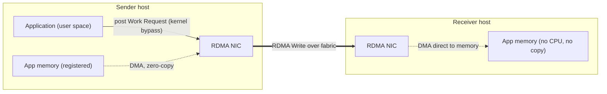

*图8.1 —— RDMA 的三大超能力:内核旁路(应用直接与网卡对话)、零拷贝(网卡直接对已注册的应用内存进行 DMA 读写),以及单边传输(远端 CPU 从不参与)。这带来了亚微秒级延迟和近乎零的 CPU 开销——也正因如此,一次会引发重传的拥塞丢包代价才如此高昂(见第 17 篇文件)。*

经典的网络协议栈——应用程序、套接字、TCP/IP、内核、网卡——带来了三项被 RDMA 消除的成本。其一是**CPU 参与**:每个数据包都要经过内核,为协议处理、中断处理和上下文切换消耗 CPU 周期。其二是**内存拷贝**:数据要从应用缓冲区拷贝到内核套接字缓冲区,再拷贝到网卡缓冲区(接收方向则相反),消耗内存带宽。其三是**延迟**:穿越内核协议栈的过程会增加数微秒的延迟。对于一台 Web 服务器来说,这些成本尚可接受;但对于每隔几毫秒就要交换一次梯度的万卡级 GPU 训练任务而言,它们是致命的。

RDMA 通过三种机制消除了以上全部三项成本:
- **内核旁路**:应用程序从用户空间通过内存映射队列直接与网卡通信,数据路径上不产生任何系统调用。
- **零拷贝**:网卡直接在应用内存与线路之间进行 DMA 数据搬运,不产生任何中间拷贝。
- **单边操作**:RDMA 读和 RDMA 写在完全不需要远端 CPU 参与的情况下,向/从远端内存传输数据——远端网卡自主地处理传输过程。

RDMA 的编程接口是 **verbs API**,在 Linux 中通过 **libibverbs** 暴露。RDMA 为此付出的代价是**内存注册**:在网卡能够对某个缓冲区进行 DMA 读写之前,该缓冲区必须先经过注册(在物理内存中锁定,并被授予访问密钥),这一操作带有不小的开销,设计良好的应用会通过注册缓存来分摊这一开销。RDMA 模型起源于 InfiniBand,并由 RDMA Consortium 加以广泛标准化;如今其语义已横跨 InfiniBand、以太网以及新兴的光网络结构。

#### RoCE —— 融合以太网上的 RDMA

**RoCE** 将 InfiniBand 的 RDMA 传输带到以太网上,使各组织能够在其现有以太网基础设施上运行 RDMA,而无需部署独立的 InfiniBand 网络。它存在两个版本:

- **RoCEv1** 将 InfiniBand 传输直接封装在以太网帧中(以太网类型 0x8915)。它仅工作在第二层——在单一广播域/子网内——因为它没有 IP 头,因此无法被路由。这限制了它在大型网络结构中的可用性。

- **RoCEv2** 是如今普遍使用的版本,它将 InfiniBand 传输封装在 **UDP/IP** 数据包内部(目的 UDP 端口为 **4791**)。由于带有 IP 头,RoCEv2 **可路由**,能够跨三层 Clos 网络结构传输,因此适用于大型数据中心网络。一个 RoCEv2 数据包携带 IP 和 UDP 头,随后是 InfiniBand 的 **GRH(全局路由头)**和 **BTH(基础传输头)**,再后面是 RDMA 负载。InfiniBand 的传输语义——可靠连接队列对、RDMA 读/写/原子操作,以及相同的 verbs API——在以太网物理层和 IP 网络层之上保持不变地运行。

RoCEv2 的承诺是"在以太网硬件上实现 InfiniBand RDMA",但它继承了以太网尽力而为的本质,因此需要第 06 篇文件所述的无损机制(PFC)和拥塞控制(DCQCN、HPCC 等)才能表现良好。UDP 源端口会针对每条流有意变化,以便为网络结构的 ECMP 负载均衡提供熵——不过正如第 17 篇文件所讨论的,RDMA 倾向于对批量传输使用单一队列对(因而也就是单一五元组),这削弱了这一机制的效果,造成了"大象流"负载失衡问题。

#### iWARP —— TCP 上的 RDMA

**iWARP(互联网广域 RDMA 协议,internet Wide Area RDMA Protocol)** 采取了不同的方案:它在 **TCP** 之上叠加 RDMA 语义(通过 MPA、DDP 和 RDMAP 协议层)。由于运行在 TCP 之上,iWARP 继承了 TCP 的可靠性和拥塞控制,因此它**不**需要无损网络结构(无需 PFC),并可以在普通的路由网络上运行,包括广域互联网。其代价是**延迟高于 RoCE**——即使卸载到网卡上处理,TCP 处理仍会带来额外开销——网卡实现也更为复杂。iWARP 在存储领域以及部分企业场景中获得了应用(Chelsio 和 Intel 曾是知名的 iWARP 网卡厂商;Marvell 的 FastLinQ 也支持它),但在 AI/HPC 网络结构之争中败给了延迟更低的 RoCEv2 和 InfiniBand。iWARP 的主要吸引力——在无需特殊网络结构配置的有损、路由网络上依然稳健——在无损网络结构不可行的场景下依然具有现实意义。

#### Soft-RoCE 与软件 RDMA

**Soft-RoCE(rxe)** 是 Linux 内核中 RoCE 的一种软件实现,运行在普通以太网网卡之上,无需 RDMA 硬件。它以软件方式实现了 RoCE 协议,因此不具备真正 RDMA 的任何性能优势(由 CPU 完成相关工作,伴随拷贝和内核参与),但它使开发者能够在没有专用硬件的情况下编写和测试 RDMA 应用,并使系统能够与 RDMA 对端互操作。Soft-RoCE 对开发、持续集成和教学而言非常宝贵,并为缺乏 RDMA 网卡的节点提供了一条后备路径。

#### RDMA 编程模型

直接进行 RDMA 编程涉及一套特定的操作序列:
1. **内存注册**:应用程序注册缓冲区,将其锁定,并获得用于本地访问的**本地密钥(lkey)**,以及与对端共享、用于授权其对该缓冲区进行 RDMA 访问的**远程密钥(rkey)**。
2. **队列对的创建与连接**:应用程序创建队列对并建立连接(对于 RC 而言),带外交换所需的寻址和密钥信息。
3. **发布工作请求**:应用程序向发送队列或接收队列发布工作请求(WR)——RDMA 写、RDMA 读、发送、接收、原子操作。
4. **轮询完成状态**:应用程序轮询完成队列,以检测操作何时完成,从而避免中断带来的延迟。

直接使用 verbs 编程虽然强大,但十分繁琐,因此大多数应用会使用更高层的抽象。**libfabric(OpenFabrics 接口,OFI)** 是构建在 verbs 及其他 RDMA/网络提供者之上的一个可移植抽象层,提供一致的 API,可面向 InfiniBand verbs、RoCE、iWARP、共享内存,或厂商专有传输——使应用程序免受底层网络结构差异的影响。**UCX(统一通信 X,Unified Communication X)** 是另一种被广泛使用的抽象层(见下文)。

#### MPI 与基于 RDMA 的集合通信

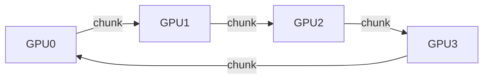

*图8.2 —— 环形 AllReduce:每颗 GPU 将一个已归约的数据块传递给环上的相邻 GPU;经过 2(N-1) 步之后,每颗 GPU 都持有完整的归约结果。对于大张量而言带宽最优。网内归约(SHARP/NVLS,见第 15 篇文件)则改为在交换机内进行归约,从而将数据移动量减半,并消除了 O(N) 的环形延迟。*

HPC 领域以及大部分 AI 分布式计算所采用的主流编程模型是 **MPI(消息传递接口,Message Passing Interface)**,由 **OpenMPI**、**MVAPICH2** 等实现。MPI 通过 **UCX(统一通信 X)** 等传输层运行在 RDMA 之上,UCX 会根据拓扑,在 InfiniBand verbs、RoCEv2、节点内的共享内存,或其他传输方式之间自动选择最佳传输方式,不仅被 OpenMPI 使用,也被包括 Spark 和 TensorFlow 在内的分布式框架所使用。UCX 抽象掉了传输选择和优化中繁杂的细节,提供了一套简洁的点对点及单边通信 API。

对 AI 和 HPC 而言最重要的操作是**集合通信**——涉及全体(或一组)参与者的操作:
- **AllReduce**:每个参与者贡献一个值(例如一个梯度张量),这些值被合并(通常是求和),然后每个参与者都收到结果。这是数据并行训练(梯度同步)中占主导地位的操作。
- **AllGather**:每个参与者的数据被收集起来并分发给所有人(用于张量并行和分片优化器方案)。
- **ReduceScatter**:计算归约结果,并将结果分片散发给各参与者——这是环形 AllReduce 的后半部分。
- **AllToAll**:每个参与者向每一个其他参与者发送不同的数据(这是专家混合(MoE)路由的核心操作)。
- **Broadcast(广播)**与 **Reduce(归约)**:一对多和多对一。

这些集合通信操作的效率取决于所采用的算法。**环形 AllReduce** 实现了接近最优的带宽利用效率(每个参与者的链路承载的数据量大致是所需的最小值),更适合大消息;**树形**算法和**递归减半/倍增**算法则在小消息场景下实现更低的延迟。实现这些算法以服务加速器的库至关重要:**NCCL(NVIDIA 集合通信库,NVIDIA Collective Communications Library)**是面向 NVIDIA GPU 占主导地位的实现,实现了环形、树形以及 **NVLS(NVLink SHARP)** 算法,并利用 NVLink、NVSwitch 以及 InfiniBand SHARP 实现网内归约;**RCCL** 是 AMD 面向 ROCm 的对应实现;**oneCCL** 则是 Intel 的实现。这些库以及它们所体现的集合通信算法,将在第 15 篇文件中深入探讨。

#### 面向存储的 RDMA:NVMe-oF

RDMA 对存储领域同样具有变革性意义。**NVMe-oF(结构化 NVMe,NVMe over Fabrics)** 将 NVMe 存储协议的提交/完成队列模型运行在网络结构之上,而 **NVMe/RDMA** 则将 NVMe 队列直接映射到 RDMA 队列对上,从而实现接近本地 NVMe 水平的远程存储延迟。这一延迟对比非常鲜明:**基于 RoCEv2 的 NVMe/RDMA** 在 4 KB 读取时的延迟低于约 20 微秒;**基于 InfiniBand 的 NVMe-oF** 可以低于约 10 微秒;而 **NVMe/TCP**(基于普通 TCP、不使用 RDMA 的 NVMe)则约为 100 微秒。RDMA 在远程存储延迟上带来的数量级优势,正是使存储解耦(将计算与存储容量通过高速网络结构分离开来)在不严重损害性能的前提下变得可行的关键。第 18 篇文件将全面介绍存储网络。

#### 拥塞与 RDMA 的丢包灾难

RDMA 在运维层面所面临的定义性挑战在于:对于可靠连接传输而言,**丢包是灾难性的**。当一个数据包被丢弃时,RC 传输必须重传——而在基础的回退 N(go-back-N)方案中,它会从最后一个已确认的序列号开始重传,这可能会重新发送大量数据,并摧毁吞吐量。(现代网卡实现了选择性重传和改进的丢包恢复机制,但丢包的代价依然远高于专为应对丢包而设计的 TCP。)这正是 RoCEv2 网络结构必须是**无损的**的原因:一次拥塞丢包就可能使一条流陷入瘫痪。

无损性是通过 **PFC** 实现的,但 PFC 的病理问题(队头阻塞、拥塞扩散、死锁——见第 06 篇文件)意味着 PFC 必须作为最后手段。主要的防线是**拥塞控制**,它使队列足够短,从而使 PFC 很少触发:**DCQCN**(基于 ECN)、**HPCC**(基于遥测)、**Timely/Swift**(基于时延)。FEC(防止损坏导致的丢包)、PFC(防止拥塞导致的丢包)和拥塞控制(防止 PFC 触发)三者之间的相互作用,是第 02 篇文件所引入、并由第 17 篇文件加以具体运维化的精妙多层协同设计。

#### RoCEv2 部署最佳实践

要良好地部署一套生产级 RoCEv2 网络结构,需要关注众多细节(在第 17 篇文件中详细阐述):
- **流量隔离**:将 RDMA 流量置于专用的优先级/VLAN 上,仅对该类流量启用 PFC,使其与有损的尽力而为流量相隔离。
- **ECN 标记阈值**:配置交换机的 WRED/ECN,使其在缓冲区占用率处于中等水平时(例如 20%–30%)即开始标记,从而使 DCQCN 能在缓冲区被填满、PFC 被触发之前作出反应。
- **DCQCN 参数调优**:根据集群的规模和消息大小分布,调优速率降低定时器、字节重置计数器、速率提升参数、alpha 更新频率、最小速率,以及加性/超激进增长参数。
- **PFC 安全性**:启用 PFC 看门狗,以检测并打破 PFC 卡死的状况,并设计无循环缓冲区依赖(无死锁)的拓扑与路由。
- **监控**:关注揭示网络结构健康状况的 RDMA 网卡计数器——**out_of_buffer**(背压/接收方未就绪事件)、**out_of_sequence**(乱序)以及 **duplicate_requests**(重传指标)——并对 PFC 风暴和不断上升的尾部延迟进行告警。

正是这些实践,将一套接近 InfiniBand 性能的 RoCEv2 网络结构,与一套在大规模训练同步突发流量下崩溃的网络结构区分开来。坦白地说,要在大规模场景下把这些做对本身就很困难,这正是 InfiniBand 历久不衰的优势之一——InfiniBand 用少得多的调优就能实现无损性和低延迟——这也正是 Ultra Ethernet Consortium 和 NVIDIA 的 Spectrum-X 都在努力弥合的差距。

#### 深度扩展:内存注册及其代价

RDMA 所带来的唯一显著开销——内存注册——值得进一步阐述,因为它塑造了 RDMA 应用的编写方式,也决定了其性能的极限所在。在网卡能够对某个缓冲区进行 DMA 读写之前,该缓冲区必须先被**注册**:操作系统会锁定相关页面(防止它们被换出或迁移,因为网卡将异步地按物理地址访问它们),并填充网卡的内存转换表,使其能够转换该缓冲区的虚拟地址并强制执行访问权限,由此生成本地密钥(lkey)和远程密钥(rkey)。注册并非没有代价——锁定页面并对网卡的转换表进行编程需要时间,而且被锁定的内存无法被操作系统回收,这会限制内存管理。

应用程序通过多种方式缓解这一问题。**注册缓存**使常用的缓冲区保持已注册状态,而不是每次操作都注册和解除注册。**预先注册的大型缓冲区池**只需分配一次并反复重用。现代网卡所支持的**按需分页(ODP)**通过让网卡自行处理缺页异常,放宽了锁定要求,以性能换取灵活性。**共享/隐式注册**方案则降低了每缓冲区的开销。对于 AI 训练而言,由于同样的梯度和激活缓冲区在每一步都被重复使用,注册开销被摊薄到可以忽略不计;而对于拥有不可预测、生命周期短暂的缓冲区的工作负载(某些存储和 RPC 模式)而言,注册开销可能相当可观,妥善管理这一开销是 RDMA 编程的一项关键技能。内存注册模型是 RDMA 为内核旁路和零拷贝所付出的代价——必须事先明确告知网卡它可以触碰哪些内存,并赋予相应的权限——这也是 RDMA 编程比套接字编程更为苛刻的主要原因之一。

#### 深度扩展:为什么单次丢包对 RC 传输代价如此高昂

可靠连接传输中丢包所带来的灾难性代价——也是无损网络结构如此重要的原因——值得给出一个具体的解释。经典的 InfiniBand/RoCE RC 传输采用**回退 N(go-back-N)**重传方案:数据包携带序列号,接收方按序对其进行确认。如果一个数据包被丢弃,接收方会检测到序号缺口,发送方必须重传——但在基础的回退 N 方案中,它会重传**从丢失的数据包开始的所有后续数据**,而不仅仅是丢失的那一个数据包,因为接收方已经丢弃了缺口之后收到的乱序数据包。在带宽较高、往返时延不可忽略的链路上,丢包被检测到时可能已有大量数据正在传输途中,因此重传会重新发送大量数据,在恢复期间有效吞吐量会崩溃。更糟的是,如果丢包是由拥塞导致的,重传会向一个本已拥塞的网络结构中注入*更多*流量,可能引发进一步的丢包——形成一个破坏性的螺旋。

这与 TCP 有着根本性的不同,TCP 从设计之初就将丢包视为正常的拥塞信号,并通过选择性确认和快速重传优雅地恢复。RDMA 的 RC 传输是为一个丢包属于例外情况的无损网络结构而设计的,因此其丢包恢复机制相对而言相当粗暴。现代 RoCE 网卡已通过选择性重传(只重发丢失的数据包)和更好的丢包恢复算法改进了这一点,缩小了差距,但根本性的结论依然成立:在 RDMA 网络结构上,一次拥塞丢包的代价远高于在 TCP 网络上——这正是为什么 PFC、ECN 和 DCQCN(第 06、17 篇文件)这一整套体系存在的意义在于防止丢包,也是为什么下一代传输(Ultra Ethernet)会内建多路径和乱序容忍能力,以使丢包和乱序不再那么具有灾难性。"丢包灾难"是关于 RDMA 网络结构最重要的一项运维事实,它驱动着围绕它所建立的一切设计。

#### 深度扩展:作为真正接口的集合通信库

在实践中,极少有 AI 或 HPC 应用会直接对 RDMA verbs 进行编程;它们使用对网络结构进行抽象的**集合通信库**,而真正的性能工程正是在这些库中完成的——因此它们值得被视为面向 AI 的 RDMA 网络结构的真正接口来对待。**NCCL(NVIDIA 集合通信库)**是面向 NVIDIA GPU 占主导地位的实现:它向框架(PyTorch、TensorFlow)提供简单的集合通信操作(AllReduce、AllGather、AllToAll 等),而在内部,它会发现拓扑(NVLink、NVSwitch、PCIe、InfiniBand/RoCE)、选择最优算法(环形、树形、NVLS、SHARP——见第 15 篇文件),并通过恰当的传输方式(节点内使用 NVLink,跨节点使用 RDMA,并借助 GPUDirect 使网卡直接读写 GPU 内存)编排数据传输。框架只需调用一行 AllReduce;NCCL 则将其转化为一个具备拓扑感知、多传输方式、流水线化、便于重叠计算的集合通信操作,从而榨取出网络结构的性能。

其他生态系统中的对应实现——**RCCL**(AMD ROCm)、**oneCCL**(Intel),以及运行在 UCX 之上、面向 HPC 的 MPI 实现(OpenMPI、MVAPICH2)——扮演着同样的角色。其意义在于,决定实际网络结构性能的接口是集合通信库,而非裸的 verbs:一个网络结构的好坏,取决于该库能在多大程度上加以利用,而 NCCL 针对 NVIDIA 拓扑(NVLink、NVSwitch、SHARP)所做的深度优化,正是 NVIDIA 竞争护城河的重要组成部分(见第 07、15 篇文件)——竞争对手的网络结构,无论硬件多么出色,也必须匹敌 NCCL 成熟、具备拓扑感知、经过不断打磨优化的集合通信算法,才能交付同等的训练性能。这也是为什么开放生态的努力不仅涵盖网络结构本身(Ultra Ethernet),也涵盖集合通信库及其优化,以及为什么软件——那个将 RDMA 原语转化为高效集合通信操作的库——与硬件同等具有战略重要性。对应用而言,集合通信库就是网络结构;其下的 RDMA verbs 只是由该库管理的实现细节。

#### 深度扩展:超越数据中心的 RDMA 与传输方式的融合

一个具有前瞻性的观察是 **RDMA 传输方式的融合与延伸**,这正在拓宽 RDMA 的适用范围,并重塑传输格局。历史上,RDMA 一直局限于数据中心内部(在受控的、无损的网络结构上运行 InfiniBand 或 RoCE),因为它对丢包的不容忍(见上文本篇文件所述)要求一个经过精心工程设计的无损网络。有两项进展正在改变这一点。其一,**下一代传输方式**(Ultra Ethernet Transport,见第 15 篇文件)将对丢包和乱序的容忍能力内建到 RDMA 传输本身之中——通过多路径、数据包喷洒(packet spraying)以及带重组的乱序交付——从而使 RDMA 不再需要一个完美无损的网络结构,并能够容忍更大规模、更为多样化网络的运行条件。这放宽了长期以来使 RoCE 网络结构运维起来如此苛刻的脆弱无损性要求(见第 17 篇文件)。

其二,RDMA 正在**拓展自身的触及范围**:用于跨数据中心分布式训练的更长距离 RDMA(见第 12 篇文件)、虚拟化/多租户云环境中的 RDMA(见第 20 篇文件),以及存储(NVMe-oF)与计算通信在同一 RDMA 网络结构上的融合。其发展轨迹正指向一种更为稳健、适用范围更广的 RDMA——既保留使其具有价值的内核旁路、零拷贝、单边操作性能,又摆脱长期以来限制其适用范围的脆弱性(对丢包的不容忍、网络结构调优负担)。如果 Ultra Ethernet 的努力取得成功,RDMA 将变得既更高性能又更易于运维,能够在更广泛的网络和条件下使用,这将把高性能分布式计算的触及范围,远远拓展到今天经过精心调优的无损网络结构之外。RDMA 传输方式的演进——从经典 InfiniBand/RoCE 中对丢包不容忍的 RC,发展到 Ultra Ethernet 中对丢包容忍、多路径、数据包喷洒的传输方式——是数据中心网络领域最具深远意义的发展之一,因为它正在解决自 RDMA 诞生以来一直制约着它的、最棘手的运维难题(丢包灾难以及无损性带来的负担)。

#### 结论

RDMA 是高性能分布式计算默默无闻的基石:内核旁路、零拷贝、单边内存访问,提供了分布式训练和解耦存储所需要的亚微秒级延迟以及近乎零的 CPU 开销。它在以太网上的三种实现形态——RoCEv2(性能领先者,需要无损网络结构)、iWARP(在有损网络上依然稳健,但速度较慢)以及 Soft-RoCE(软件实现,用于开发)——将 RDMA 带入了无处不在的以太网世界,而 InfiniBand 则原生提供 RDMA。在 RDMA 之上,坐落着抽象层(libfabric、UCX)以及集合通信库(NCCL、RCCL、oneCCL),它们将原始的内存到内存传输,转化为定义 AI 训练的 AllReduce 和 AllToAll 操作。而这一切之下,则是无损性这一不容妥协的要求,以及使 RDMA 在以太网上得以运行的精妙多层协同设计——这正是第 17 篇文件所专门探讨的主题。RDMA,正是"网络"这一抽象承诺,与在数万块 GPU 之间搬运数拍字节(PB)梯度数据、却不丢一个包、不浪费一个 CPU 周期这一具体现实相遇的地方。

[↑ 返回目录 / Back to Table of Contents](#目录--table-of-contents)

---

<a id="sec-27-10"></a>
## 27.10 光网络基础 —— 物理原理、组件与技术

**中文翻译，原文见:** [09_optical_networking_fundamentals.md](09_optical_networking_fundamentals.md)

---

### 光网络基础 —— 物理原理、组件与技术

#### 引言:为何选择光

超出铜缆的可及范围之外——在现代信令速率下也就几米——数据中心网络便进入了光域。玻璃光纤中传输的光,是唯一能够以数据中心、园区、城域,乃至跨洋所要求的距离,以现代世界所消耗的带宽,并以可接受的能耗和损耗来移动数据的介质。光网络是网络技术与基础物理学交汇之处:介电波导中电磁波的行为、光放大的量子力学、玻璃对强光场的非线性响应,以及一根光纤能够承载多少比特的信息论极限。本章从光网络的物理基础出发进行构建——光与光纤的特性、限制传输的各种损伤、生成、调制、放大和探测光的各种组件,以及将众多信道打包进单根光纤的波分复用技术。本章是后续相干光学、光交换、数据中心互连(DCI)以及共封装光学各章(第 10–13 篇文件)的先修基础。

#### 作为通信介质的光 —— 物理原理

##### 电磁频谱与电信窗口

光通信使用近红外光,波长范围大致在 1260–1625 nm——人眼不可见(可见光范围约为 400–700 nm),但非常适合二氧化硅玻璃光纤。在这一近红外范围内,业界定义了若干命名的**波段**:
- **O 波段(1260–1360 nm)**——"原始波段"(Original),接近标准光纤的零色散波长;用于数据中心的短距光模块(例如 DR/FR/LR 收发器中的 1310 nm),因为在该波段色散最小。
- **E 波段(1360–1460 nm)**——"扩展波段"(Extended),历史上曾受到水吸收峰(见下文)的影响而性能下降。
- **S 波段(1460–1530 nm)**——"短波段"(Short),是未来容量扩展的前沿方向。
- **C 波段(1530–1565 nm)**——"常规波段"(Conventional),是长距和高容量传输中占主导地位的波段。
- **L 波段(1565–1625 nm)**——"长波段"(Long),用于在 C 波段之外进一步扩展容量。

**C 波段**在长距和 DWDM 领域的主导地位并非偶然。有两个事实使其特殊:二氧化硅光纤的**最小衰减**——约 0.2 dB/km——出现在 1550 nm 附近,也就是 C 波段,因此信号在这里传输的距离最远;而**掺铒光纤放大器(EDFA)**这一主力光放大器,恰好正是在 C 波段(1530–1565 nm)提供增益。最小损耗与一款实用放大器恰好出现在同一波段,这一巧合正是整个长距光通信产业的物理基础。L 波段以第二个放大窗口对此加以扩展,而 S 波段则是下一个前沿方向。

##### 光纤衰减

光纤中的信号会随着传播而减弱,有三种机制主导着这种**衰减**:
- **瑞利散射**——光在冻结于玻璃中的微观密度涨落上发生散射,其强度按 λ⁻⁴ 的规律变化(因此在较短波长处最为显著,并随波长增加而迅速下降)。瑞利散射在约 1500 nm 以下的波长处设定了基本的损耗下限。
- **红外吸收**——在长波长(约 1700 nm 以上)处,玻璃自身会吸收光,因为光子能量与分子振动发生耦合。这在长波长处设定了损耗下限。
- **OH⁻(水)吸收**——羟基离子,是制造过程中来自水的污染物,在约 **1383 nm** 附近有一个强烈的吸收峰,历史上曾形成一个"水峰",使 E 波段无法使用。现代**低水峰光纤(ITU-T G.652.D)**和抗弯光纤(G.657)消除了这一吸收峰,从而开放了整个频谱。

上述机制相互作用,形成了在 1550 nm 附近取得最小值的著名衰减曲线。**超低损耗(ULL)光纤**——如康宁(Corning)的 SMF-28 ULL、住友(Sumitomo)的 Z-fiber 等——通过采用能最大程度减少瑞利散射的纯二氧化硅纤芯,将 1550 nm 处的衰减降低到约 **0.148–0.16 dB/km**,这对海底和超长距干线链路而言是一项至关重要的优势,因为每减少一点点 dB/km,都能延长无中继或无放大跨段的距离。

##### 色散(Chromatic Dispersion)

**色散**是指不同波长的光在光纤中以略有差异的速度传播这一现象。由于任何真实的光脉冲都包含一定波长范围的分布(且任何调制信号都占据一定的频率带宽),各分量到达的时间会略有不同,从而在传播过程中使脉冲**展宽**,并最终导致相邻脉冲发生重叠——这种码间干扰限制了可实现的波特率 × 距离乘积。色散由参数 **D**(单位 ps/nm/km)来表征:对于标准单模光纤,在 1550 nm 处约为 **+17 ps/nm/km**,并在约 **1310 nm** 处**过零**("零色散波长",这也是 1310 nm 被用于数据中心短距光模块的原因——该处色散极小,可实现简单的直接检测传输)。

色散可以通过多种方式管理。历史上,曾通过在链路中熔接**色散补偿光纤(DCF)**——一种具有较大负色散的光纤——来抵消累积的色散,**光纤布拉格光栅(FBG)**也曾提供紧凑型的补偿方案。现代相干方案则要优雅得多:**在 DSP 中进行电子色散补偿**。由于相干接收机能够恢复完整的光场(幅度和相位),它可以应用一个数字滤波器,精确地逆转光纤那(线性的、特征已充分掌握的)色散——在数字域中撤销数千公里累积下来的色散,从而完全省去物理补偿的必要。这是相干检测(第 10 篇文件)的一大优势。

##### 偏振模色散(Polarization Mode Dispersion)

单模光纤实际上支持两种偏振模式,而真实光纤中的缺陷和应力会导致这两种模式以略有差异的速度传播——即**偏振模色散(PMD)**。PMD 由一个约为 0.05–0.2 ps/√km 的系数来表征(注意其对距离的平方根依赖关系,反映了它随机的统计性质),并且是**随温度和时间变化**的,会随光纤受到的扰动而波动。PMD 曾是高速直接检测系统的一项严重限制,但相干接收机能够通过**电子偏振跟踪**优雅地处理这一问题——DSP 持续估计并补偿偏振状态,同样是利用了所恢复出的光场。这也是为什么相干系统能够使用**偏振复用**(在两个偏振态上传输独立的数据以使容量翻倍)——这在直接检测系统中是无望实现的。

##### 非线性效应

在短距链路的低光功率下,光纤表现为线性介质。但长距 DWDM 系统会发射相当大的功率(以克服损耗,并在经过多个放大跨段后仍维持信噪比),而在高功率下,玻璃会通过**克尔效应**(折射率取决于光强)和散射过程呈现出**非线性**响应:
- **自相位调制(SPM)**——一个脉冲自身的强度会调制它所感受到的折射率,从而展宽其频谱。
- **交叉相位调制(XPM)**——一个 WDM 信道的强度会调制相邻信道的相位,造成串扰。
- **四波混频(FWM)**——三个光波混合,生成第四个位于新频率处的光波,该光波可能落在另一信道上并使其受损。当色散较低时,FWM 最为严重(这也是为什么零色散位移光纤 G.653 对 DWDM 而言问题重重)。
- **受激拉曼散射(SRS)**——将功率从较短波长的信道转移到较长波长的信道(这也是下文拉曼放大的原理基础)。
- **受激布里渊散射(SBS)**——限制了能够注入单一窄线宽波长的功率上限(阈值约为 10 dBm),超过该阈值的功率会被反向反射。

这些非线性效应带来了**非线性香农极限**:提高发射功率会改善信噪比(有利),但也会增加非线性噪声(不利),因此存在一个最优发射功率,超过该值后容量反而会下降。这一非线性极限将单根光纤在 C 波段的实际容量上限限定在每纤对约 100 Tbps——这一天花板促使业界转向 C+L+S 波段扩展、空分复用以及新型光纤(第 24 篇文件)。相干系统可以在 DSP 中(通过数字反向传播)部分补偿非线性效应,但计算成本高昂。

#### 光纤类型

ITU-T G.65x 系列标准规定了构成全球光纤基础设施的各种光纤类型:
- **G.652(标准单模光纤,SMF)**——全球安装量最大的光纤;在 1310 nm 处模场直径约 9.2 µm;在 1550 nm 处衰减约 0.18–0.20 dB/km;零色散点约在 1310 nm。**G.652.D** 变体抑制了水峰,开放了整个频谱。
- **G.653(色散位移光纤,DSF)**——将零色散波长移至 1550 nm,这对单信道 1550 nm 系统而言看似理想,但对 DWDM 而言却是灾难性的,因为零色散会使四波混频最大化。目前已基本淘汰。
- **G.655(非零色散位移光纤,NZ-DSF)**——设计为在 1550 nm 处具有较小的正色散(3–8 ps/nm/km),足以抑制 FWM,同时保持较低的色散;康宁 LEAF 和朗讯 TrueWave 等产品属于此类。在传统 DWDM 建设中较为常见。
- **G.654(截止波长位移/超低损耗光纤)**——纯二氧化硅纤芯光纤,衰减极低(0.15–0.16 dB/km),用于海底光缆以及以跨段损耗为约束条件的长距陆地干线。
- **G.657(抗弯光纤)**——针对紧密弯曲下的低损耗而设计,对于数据中心机柜内空间局促、走线密集的布线以及接入部署而言十分重要。
- **多模光纤(OM1–OM5)**——纤芯较大(50 µm 或 62.5 µm)、支持多种传播模式的光纤,配合低成本的 850 nm VCSEL 用于短距场景。**OM3**(10G 下 300 米,40G-SR4 下 100 米)、**OM4**(性能提升,更高速率下可达 100–150 米)以及 **OM5**(宽带型,支持短波波分复用)服务于数据中心机柜内及顶架交换机(TOR)到服务器的链路。多模光纤的可达距离随速率提高而缩短(受模式色散限制),这也是为什么即便在最高速率代际的短距场景中,单模光纤也在逐渐取代多模光纤。

#### 光放大器

光放大器的发明——直接放大光信号,而无需将其转换为电信号再转换回来——是长距 DWDM 在经济上得以可行的关键,因为一台放大器能够同时放大所有的 WDM 信道。

##### EDFA —— 主力放大器

**掺铒光纤放大器(EDFA)**是长距光通信的基石。一段掺铒离子的光纤被一台激光器**泵浦**(波长为 980 nm 或 1480 nm),从而激发铒离子;当 C 波段的信号光通过时,它会刺激受激发的离子发出辐射,从而直接在光域内放大信号。EDFA 能够提供 **20–40 dB 的增益**,**噪声系数为 4–6 dB**,一次性放大整个 C 波段(带宽约 35 nm),这正是 DWDM 系统能够通过周期性放大,在数千公里范围内承载数十个波长的原因。

EDFA 存在两项重要的缺陷。其一,它们会引入 **ASE(放大自发辐射)** 噪声,该噪声会在一连串放大器中累积,最终限制了可用跨段的数量(从而限制了传输距离)——光信噪比(OSNR)会随每一台放大器逐级劣化。其二,其**增益在 C 波段内并不平坦**,因此一连串 EDFA 会逐渐使频谱发生倾斜;这一问题通过**增益平坦滤波器(GFF)**和动态增益均衡(通常集成在 ROADM 中)加以纠正。**C+L 波段 EDFA** 将放大范围扩展到 L 波段,大致将可用频谱、进而将光纤容量提升一倍。

##### 拉曼放大(Raman Amplification)

**拉曼放大器**利用了受激拉曼散射效应:一台高功率泵浦激光器,其波长比信号短约 100 nm,在信号与泵浦光一同沿传输光纤本身传播的过程中,将能量转移给信号。由于增益是沿传输光纤本身**分布式**产生的(而不是集中在一段分立的掺铒线圈中),拉曼放大能够产生更低的有效噪声系数——分布式拉曼放大能够实现低于分立放大器量子极限的有效噪声系数,因为信号在尚未完全衰减之前就已被放大。拉曼放大被用于**超长跨段(500 公里以上)**以及**海底**系统,通常采用拉曼与 EDFA 混合配置,以在纯 EDFA 方案 OSNR 不足的场景下延伸传输距离。

##### SOA 与 TDFA

**半导体光放大器(SOA)**是一种芯片级放大器(一种没有反射镜的类激光有源波导),具有快速的增益动态特性(纳秒级响应)。其高速特性使其适用于**光交换**和突发模式应用,但其**依赖于信号模式的增益饱和**特性(增益取决于近期的信号历史)会在 WDM 传输中造成失真,限制了它作为传输放大器的应用。SOA 在**光子集成**(可集成在 InP 光子芯片上)以及共封装光学中正变得日益重要。**掺铥光纤放大器(TDFA)**在 **S 波段(1450–1530 nm)**提供放大,是未来 S+C+L 波段容量扩展(第 24 篇文件)的一项关键使能技术,不过目前尚未得到广泛的商业部署。

#### 光调制器与收发器

生成光信号需要一个光源(激光器)以及一种将数据印加到其上的方式(调制)。调制技术的选择会深刻影响传输距离、速率、成本和功耗。

##### 直接调制

最简单的方法是**直接调制**:通过改变激光器的驱动电流来改变其输出功率。这种方式廉价且紧凑,但调制电流也会无意间调制激光器的频率——即**啁啾(chirp)**——它与光纤色散相互作用,限制了传输距离。直接调制激光器(DML)在单模光纤上大致被限制在 10G NRZ(受啁啾限制),但在多模短距场景下的 **VCSEL**(垂直腔面发射激光器,Vertical-Cavity Surface-Emitting Laser)中被广泛使用,工作波长为 850 nm,可在约 100 米的 OM4 光纤上实现 100G PAM4。VCSEL 是数据中心内部光模块廉价的主力器件,不过将其扩展到面向 1.6T 的每通道 200G 是一项严峻的挑战(第 21 篇文件)。

##### 马赫-曾德调制器(Mach-Zehnder Modulator)

对于更高速率和更长距离而言,**外部调制**将(持续发光的)激光器与调制器分离开来。**马赫-曾德调制器(MZM)**是一种光学干涉仪:光被分成两个臂,在其中一个臂上施加的电压通过**电光效应**使其相位发生偏移,当两臂重新合并时,相长或相消干涉便对输出进行了调制。在半波电压 **Vπ** 处,两臂完全反相,输出变暗。MZM 能够产生**无啁啾**调制,并可生成复杂的多电平格式。

经典的 MZM 材料是**铌酸锂(LiNbO₃)**——插入损耗低、带宽宽,但 Vπ 相对较高(约 4 V)且体积较大。近期一项变革性的进展是**薄膜铌酸锂(TFLN)**——一种绝缘衬底上的铌酸锂——它将 Vπ 大幅降低(至约 1–2 V),将带宽推高到超过 100 GHz,并缩小了器件体积,从而实现了紧凑、低功耗、超高速的调制器。TFLN 领域的初创公司(HyperLight 等)以及成熟厂商都在竞相将其商业化,以用于 800G/1.6T 相干和直接检测应用。

##### 电吸收调制器(Electro-Absorption Modulator)

**电吸收调制器(EAM)**是一种基于 InP 的器件,通过 Franz-Keldysh 效应或量子限制斯塔克效应,在外加电场下改变其**吸收特性**(而非相位)。EAM 结构紧凑,Vπ 较低,而且至关重要的是,它可以与 DFB 激光器**单片集成**,形成 **EML(电吸收调制激光器,Electro-absorption Modulated Laser)**——一种将光源与调制器结合在一起的单一紧凑器件。EML 是 **400G-DR4 和 400G-FR4** 数据中心收发器中占主导地位的发射器,带宽可达约 100 GHz。EML 是数据中心中最重要、出货量最大的光学组件之一,其供应(由 Lumentum、Coherent 等少数几家厂商主导)是收发器供应链(第 21、23 篇文件)的关键一环。

##### 硅光子调制器

**硅光子(SiPh)**采用与 CMOS 工艺兼容的方法,在硅波导中构建光学组件,有望带来半导体产业所具备的成本和集成优势。问题在于硅缺乏强的线性电光(泡克尔斯)效应,因此硅光子调制器依赖于较弱的**等离子体色散效应**(通过改变 PN 结中的自由载流子浓度来改变折射率)。这带来了相对较高的 Vπ·L(约 2 V·cm),并将调制带宽限制在约 50 GHz,这对许多数据中心应用而言已经够用,但在最高速率场景下则面临挑战。一种常见的增强方案是集成一个**锗基 EAM**(硅波导上的锗吸收体)以实现更快的调制(超过 100 GHz)。硅光子技术由 Intel、Cisco/Acacia、Coherent 等公司推动,并且是共封装光学(第 13 篇文件)的核心所在,因为它能够在一块芯片上密集集成大量光通道——其缺乏高效片上激光器(由硅的间接带隙所致)是其仍待解决的主要挑战,该问题可通过 III-V 族混合集成来解决。

##### 面向相干传输的 IQ 调制器

**相干**传输需要同时调制光场的幅度和相位,并且要在两个偏振方向上都进行调制。这是通过**双偏振 IQ(DP-IQ)调制器**实现的:两个以正交方式排列(相差 90°)的 MZM 为一个偏振方向生成同相和正交分量,该结构在正交偏振方向上再复制一份,两者随后通过一个偏振光束合束器合并在一起。这使得相干传输丰富的调制格式——QPSK、16QAM、64QAM 及更高阶格式(第 10 篇文件)——得以实现,在光载波上封装更多比特每符号。

#### 光接收机

##### 直接检测接收机

最简单的接收机是 **PIN 光电二极管**(一种 p-i-n 结,通常为面向 900–1650 nm 范围的 InGaAs 材料),它将光功率直接转换为电流,在 1550 nm 处响应度约为 0.9 A/W,带宽可达 100 GHz。基于 PIN 的直接检测——接收机只感知光的*功率*,而丢弃相位信息——被用于所有短距数据中心收发器(SR、DR、FR、LR)。**雪崩光电二极管(APD)**增加了内部倍增增益(10–40 倍)以获得更高的灵敏度,适用于接入网 PON 以及接收机灵敏度至关重要的长距链路,代价是更高的噪声和更高的复杂度。

##### 相干接收机

**相干接收机**要复杂得多,能力也强得多。它在一个 **90° 光学混频器**中,将输入信号与**本振(LO)**激光器混频,并通过**平衡光电探测器**(双偏振情形下为四对)恢复出完整的复数光场——同时在两个偏振方向上恢复幅度和相位信息。正是这种完整的光场恢复能力,使 DSP 能够以数字方式撤销色散、跟踪并补偿 PMD 和偏振旋转,并解调高阶 QAM 信号。相干检测相比直接检测具有 **10–15 dB 的灵敏度优势**,是所有长距和 DCI 传输的基础。现代**集成相干接收机(ICR)**将 90° 混频器、四对平衡光电探测器以及跨阻放大器单片集成在一块 InP 芯片上,面向 800G 相干应用带宽超过 100 GHz——这是光子集成领域的一项奇迹(第 10 篇文件)。

#### WDM —— 波分复用

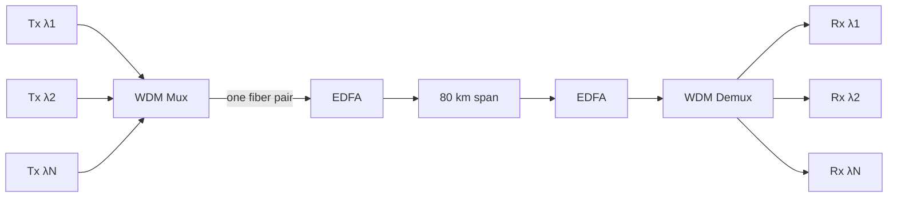

*图9.1 —— WDM 在一根光纤上承载多个波长,每个波长都是一个独立的信道,由 EDFA(一次性放大全部信道)进行周期性再放大。DWDM 在 C 波段内可打包约 96 个信道;C+L 扩展可将这一数字大致翻倍。每台放大器都会引入 ASE 噪声,使 OSNR 沿链路逐级劣化(第 10 篇文件)。*

高容量光传输的核心技术是**波分复用(WDM)**:在单根光纤上承载多个独立的数据信道,每个信道使用不同波长(颜色)的光,在发送端复用在一起,并在接收端分离开来。WDM 正是使单根光纤能够承载每秒数十太比特数据的关键。

##### CWDM

**粗波分复用(CWDM,ITU-T G.694.2)**在较宽的范围(1271–1611 nm,最多 18 个信道)内采用较宽的 **20 nm 信道间隔**。较宽的间隔意味着激光器无需温度控制(非制冷 DFB 激光器即可胜任,因为其波长可以在较宽的信道范围内漂移),这使得 CWDM 成本低廉。数据中心的 **100G-LR4 和 400G-FR4** 采用一种 4 信道方案(通常称为 CWDM4,约位于 1271/1291/1311/1331 nm,不过严格来说这种更紧密的间隔属于 LAN-WDM)在一对光纤上承载四条通道。CWDM 的低成本适用于信道数无需很多的短/中距场景。

##### DWDM

**密集波分复用(DWDM,ITU-T G.694.1)**将信道紧密地打包在一起——**50 GHz 或 100 GHz 间隔**(在 1550 nm 处,100 GHz 约等于 0.8 nm)——在 50 GHz 间隔下,C 波段内可容纳约 96 个信道,若采用 C+L 波段则可达 160 个以上。这种紧密的间隔要求**波长稳定、温度受控的激光器**(制冷 DFB 激光器或外腔激光器,对于 50 GHz 栅格而言稳定度需优于 ±1.5 GHz)。DWDM 是长距、城域和 DCI 传输所采用的技术。

DWDM 系统的**容量**随着相干调制的发展已大幅提升:100G PM-QPSK × 96 个信道 ≈ 每纤对 9.6 Tbps;400G PM-16QAM × 96 个信道 ≈ 38.4 Tbps;800G PM-64QAM(信道数较少,仅限 C 波段)≈ 64 Tbps;正在逼近 C 波段单模光纤约 100 Tbps 的非线性香农极限天花板。**灵活栅格 DWDM(Flex-grid DWDM)**(G.694.1 的一项修订)摒弃了固定栅格,改为以 12.5 GHz 为增量的可变信道宽度,根据每个信道的波特率和调制方式为其分配恰好足够的频谱——使**带宽可变收发器(BVT)**能够根据可用的光传输距离调整其调制方式、波特率和 FEC,从频谱中榨取最大容量。

#### 深度扩展:非线性香农极限与容量天花板

光传输中最深刻的一项限制——也是业界追求新波段、新型光纤以及空分复用(第 24 篇文件)的原因——是**非线性香农极限**,值得作更充分的阐述。克劳德·香农的经典容量公式指出,信道容量随信噪比的对数增长,因此天真地想,只需发射更多的光功率(提高信噪比)就能提升容量。而在光纤中,由于克尔非线性效应(见上文)的存在,这一做法会失效:随着发射功率的提升,非线性效应(SPM、XPM、FWM)的增长速度快于线性信号增益,产生非线性"噪声",使有效信噪比劣化。其结果是一条特征曲线:容量随发射功率上升,直至一个**最优点**,此后随着非线性效应占据主导而*下降*。这一非线性香农极限,将单根 C 波段光纤的实际容量上限限定在每纤对约 100 Tbps——这一天花板无法通过更好的调制或编码技术来突破,因为它是由玻璃本身的物理特性所设定的。

正是这一天花板,使得业界的容量增长策略无一例外都涉及增加*更多*的某种资源,而不是在单一信道上一味加码:**更多的频谱**(C+L,继而 C+L+S 波段,使波长数量增至三倍——第 24 篇文件)、**更多的光纤/纤芯**(采用多芯光纤的空分复用,容量随纤芯数量倍增——第 24 篇文件),以及**更低非线性的光纤**(空芯光纤,光在其中在空气中传播,克尔非线性效应几乎消失——第 24 篇文件)。相干 DSP 可以通过数字反向传播(计算并逆转非线性传播过程)*部分*缓解非线性效应,但计算成本高昂,而且并不完整,因为在密集 WDM 系统中,跨信道的非线性相互作用并不能被完全逆转。因此,非线性香农极限是光容量工程所面对的根本物理边界,理解这一点有助于说明为何光容量路线图(第 24 篇文件)呈现出如今的样貌——增加波段、纤芯和特种光纤,而不是单纯地调高功率。

#### 深度扩展:直接检测与相干检测——何时用、为何用

数据中心光学中一个反复出现的设计决策,是选用**直接检测**还是**相干检测**,这一权衡值得明确阐述,因为它塑造了整个收发器格局(第 10、21 篇文件)。直接检测(由 PIN 或 APD 光电二极管感知光功率)简单、紧凑、低功耗且廉价——它舍弃了光的相位信息,只感知光强,这对于短距数据中心链路(SR、DR、FR、LR)所采用的通断键控和 PAM4 强度调制信号而言已经足够。对于数据中心速率下约 10 公里以内的传输距离,直接检测是正确的选择:无需相干方案的复杂性和功耗,链路预算即可闭合,而其成本和密度优势对于数据中心内部海量的光模块部署而言是决定性的。

相干检测(本振、90° 混频器、平衡探测器以及强大的 DSP——第 10 篇文件)能够恢复完整的复数光场,从而实现色散和 PMD 的电子补偿、高阶调制、偏振复用,并带来 10–15 dB 的灵敏度优势——但代价是功耗较高的 DSP、更复杂昂贵的模块,以及更高的延迟。因此,相干检测被保留用于确实需要它的传输距离和容量场景:DCI、城域、长距和海底传输(第 10、12 篇文件),在这些场景中,色散和传输距离要求必须使用相干检测,相干模块的每比特成本也因传输距离而变得合理。二者之间的分界线——历史上大致位于城域/DCI 边界处——正被可插拔相干技术革命(ZR/ZR+,第 10 篇文件)所推动,后者将相干技术带入可插拔的外形规格,使其能够以经济的方式服务于较短的 DCI 传输距离,同时相干 DSP 的成本也在不断降低。但根本性的划分依然存在:直接检测用于数据中心内部及相邻数据中心之间大批量的短距传输,相干检测用于远距离数据中心之间的长距传输,而收发器市场(第 21 篇文件)正是沿着这一分界线构建起来的。

#### 深度扩展:连接器、布线与物理基础设施

光网络中一个常被忽视、但在运维层面至关重要的维度,是**物理基础设施**——即构成实际已安装光基础设施的连接器、线缆、配线架和光纤管理系统。光连接器(用于双工单纤连接的 LC 连接器,以及 SR8/DR8 等并行光模块所需的多纤带状连接器 MPO/MTP)会引入插入损耗(每对连接约零点几个 dB)和回波损耗,这些都必须计入链路预算,而其洁净度则是一个长期存在的运维问题——光纤端面上的一粒灰尘就足以使一条高速链路瘫痪,这使得连接器的检查与清洁成为一项常规操作规范。向并行单模光模块(DR4、DR8)以及更高光纤芯数的转变,推动了高密度 MPO 连接器和结构化布线系统的采用,而现代 AI 集群中庞大的光纤数量——数以万计的 GPU 中每一颗都需要多条高速光链路——使光纤管理、标识以及结构化布线系统本身,就成为一项重大的工程和运维任务。上文提到的抗弯 G.657 光纤之所以重要,正是因为在密集机柜布线中的紧密弯曲,原本会带来无法接受的损耗。物理基础设施正是前文各节所述那优雅的物理学原理,与安装、连接、测试和维护数百万条光纤连接这一并不光鲜的现实相遇之处——而在 AI 集群的规模下,该物理基础设施的可靠性和可管理性,是决定该网络结构能否真正正常工作的首要因素。

#### 深度扩展:VCSEL 与多模短距主力器件

**VCSEL(垂直腔面发射激光器)**值得专门加以讨论,因为它是数据中心内部光学领域默默无闻的主力器件,而其扩展所面临的挑战,对速率路线图而言又是关键所在。VCSEL 从芯片表面垂直发光(而不像边发射的 DFB/EML 激光器那样从边缘发光),这使其能够以晶圆级阵列的方式廉价地制造和测试,易于与多模光纤耦合,并且功耗低——非常适合机柜内和机排内高容量、短距离的链路(SR4、SR8)。多年来,工作在 850 nm、基于多模光纤的 VCSEL,以远低于单模方案的成本,承担了数据中心内部大部分光链路的重任。

但 VCSEL 正面临一堵扩展的高墙。随着每通道速率攀升至 100G PAM4,并进一步迈向 200G PAM4(用于 800G-SR8 和 1.6T-SR8),VCSEL 的调制带宽以及多模光纤的模式色散正成为限制因素。将 VCSEL 推向 200 Gbps PAM4 已处于可行性的边缘,而多模光纤的可达距离又随速率提升而缩短(模式色散会恶化),因此 VCSEL 所占据的短距多模细分市场正承受压力——在最高速率下,业界正日益转向单模方案(DR,采用 EML 或硅光子发射器),即便在短距场景下也是如此,这正在侵蚀 VCSEL 的领地。这一转变——从廉价的多模 VCSEL 链路转向即便在短距场景下也采用单模链路——是数据中心内部光学格局中的一次重大转变,对成本(单模方案历来更为昂贵)以及组件供应商(Lumentum、Coherent 等 VCSEL 厂商,相对于 EML 和硅光子供应商)都有影响。VCSEL 难以扩展到每通道 200G 这一困境,正是 1.6T 一代面临如此严峻挑战的具体技术原因之一(第 21 篇文件),也是推动业界更广泛地转向单模及共封装光学的一个因素。

#### 深度扩展:从各组件到链路预算

值得将本章的各个组件综合到那个将它们串联起来的学科之中:**光链路预算**,即用于判断某条给定链路能否正常工作的核算方法。链路预算从发射机的发射光功率开始,减去沿路径上的所有损耗——光纤衰减(dB/km × 距离)、连接器和熔接损耗(每处约零点几个 dB),以及任何组件的插入损耗(ROADM 路径中的 WSS、复用器等)——再加上任何放大器增益(EDFA、拉曼),从而得到接收端的光功率和信噪比。这一结果必须超过接收机的**灵敏度**(在经过任何 FEC 编码增益之后,达到目标误码率所需的最小功率/OSNR),并留有足够的**余量**,以应对老化、温度和制造偏差。对于直接检测链路,预算核算的核心是功率和接收机灵敏度;对于相干链路,核算的核心则是 OSNR,以及 DSP/FEC 在所选调制格式下所需的 OSNR(第 10 篇文件)。

本章中的每一项设计决策都会影响这一预算:光纤类型(衰减)、波长波段(损耗与放大器可用性)、调制器和激光器(发射功率及各种代价)、放大器(增益及新增噪声)、接收机类型(灵敏度),以及 FEC(编码增益)。一条数据中心内部的短距链路拥有宽裕的预算(短距离、低损耗、简单的直接检测);而一条跨洋海底链路则拥有严苛得多的预算(数千公里的光纤、数十台放大器累积的噪声),这要求使用超低损耗光纤、拉曼放大、相干检测以及最强的 FEC,并将调制格式限定为稳健的低阶方案。链路预算是光网络统一的工程框架——本章所涉及的全部物理原理和组件,都在这一定量核算中汇聚在一起,共同决定在给定跨段上什么是可能的——掌握这一框架,是光学工程师从机柜内部的 VCSEL 链路,到跨洋海底光缆,所必须具备的核心能力。

#### 结论

光网络是数据中心直面基础物理学的地方,也是工程智慧一再拓展玻璃与光看似固有极限的地方。从 C 波段中光纤最小损耗与 EDFA 增益恰好重合的巧合,到相干 DSP 中对色散和 PMD 的电子补偿,再到 DWDM 将数十个波长打包进单根光纤,这一领域已将物理层面的理解,不断转化为愈发庞大的容量与传输距离。本章所综述的各类组件——光纤、放大器、调制器和探测器——是数据中心内外每一条光链路的构建基石,从跨越机柜间几米距离的 850 nm VCSEL,到横跨大洋的相干海底系统,概莫能外。后续各章将直接建立在这些基础之上:第 10 篇文件将全面展开相干光传输与可插拔收发器生态;第 11 篇文件涵盖光交换与 ROADM;第 12 篇文件涵盖数据中心互连与海底系统;第 13 篇文件则涵盖共封装光学革命,该革命将把这些光学组件拉入交换机乃至加速器封装体内部。本章所确立的物理原理,是贯穿这一切之下永恒不变的基质。

[↑ 返回目录 / Back to Table of Contents](#目录--table-of-contents)

---

<a id="sec-27-11"></a>
## 27.11 相干光、收发器与可插拔生态系统

**中文翻译，原文见:** [10_coherent_optical_and_transceiver_ecosystem.md](10_coherent_optical_and_transceiver_ecosystem.md)

---

### 相干光、收发器与可插拔生态系统

#### 引言:从功率到场

过去十五年间光网络领域最重要的技术转变,是从**直接检测**(direct detection,仅感知光功率)转向**相干检测**(coherent detection,在两个偏振态上恢复完整的复数光场,即幅度与相位)。这一转变得益于高速模数转换器和强大的数字信号处理技术,彻底改变了光传输方式。它使色散和偏振模色散(PMD)得以通过电域而非光域进行补偿,支持每符号承载更多比特的高阶调制格式,通过偏振复用将容量翻倍,并将传输距离从数百公里推进到数千公里。而在21世纪20年代,相干技术又经历了第二次转变:它从机架尺寸的线卡收缩为一根粗USB记忆棒大小的**可插拔模块**(400G-ZR及以后),从而消弭了光传输世界与数据中心交换世界之间的界限。

本章深入阐述相干光技术——DSP、调制格式、FEC、星座整形——然后考察收发器外形规格与MSA标准、ZR/ZR+数据中心互联生态系统、相干DSP ASIC厂商,以及正在解构光网络的开放光网络运动。本章直接建立在第09篇光物理内容之上,并为第12篇的数据中心互联与海底光缆内容以及第21篇的收发器市场分析提供铺垫。

#### 相干光技术深度剖析

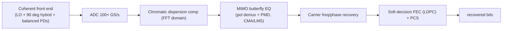

*图10.1——相干接收DSP处理流水线。恢复完整的光场使DSP能够以数字方式撤销色散和PMD、解调高阶QAM,并施加约11 dB增益的软判决FEC——这正是所有长距离传输、数据中心互联和可插拔ZR传输的引擎。其计算负荷决定了相干收发器的功耗与工艺制程。*

##### 作为相干核心的DSP

相干收发器从根本上说是一个围绕强大**DSP(数字信号处理器)**构建的高速混合信号系统。在接收端,相干前端(90°混频器、平衡光电探测器,详见第09篇)将四路电信号(每个偏振方向各自的I路和Q路)送入**采样率超过100吉采样/秒的ADC**,随后DSP执行一系列非凡的操作以恢复数据:

- **色散补偿**:频域均衡器施加一个数字滤波器,精确逆转光纤累积的色散——在数字域中撤销数千公里传输所造成的脉冲展宽。由于色散是线性且稳定的,这种补偿几乎是完美的。
- **偏振解复用与PMD补偿**:通常由恒模算法(CMA)驱动的自适应"蝶形"均衡器(一个2×2 MIMO滤波器),分离两路偏振复用信号,并跟踪随时间变化的偏振旋转和PMD。
- **载波频率与相位恢复**:算法(维特比-维特比算法、盲相位搜索)估计并消除发射激光器与本振之间的频率偏移,并跟踪两个激光器的相位噪声。
- **非线性补偿(可选,代价高昂)**:数字反向传播(DBP)或Volterra非线性均衡器可以通过模拟逆向传播来部分抵消光纤非线性,但计算开销很高。
- **软判决FEC解码**:最后一级施加强大的FEC(见下文)。

该DSP以领先工艺的ASIC实现(通常采用可用的最先进工艺节点),它是决定相干收发器传输距离、容量和功耗的主要因素。相干DSP从100G到400G、800G,再到1.6T的演进历程,是数据转换器速度不断提升、均衡与FEC能力不断增强、工艺节点不断精进的故事。

##### 调制格式与距离-容量权衡

相干传输的灵活性来自其选择**调制格式**的能力,该格式在频谱效率(每符号比特数)与所需信噪比(进而影响传输距离)之间进行权衡。所有格式均为双偏振(PM,偏振复用),使每符号比特数翻倍:

| 格式 | 每符号比特数(×2偏振) | 典型传输距离/容量 |
|---|---|---|
| PM-BPSK | 2 | 最长传输距离;海底100G |
| PM-QPSK | 4 | 100G/波长;跨洲DWDM |
| PM-8QAM | 6 | 中等距离下150–200G |
| PM-16QAM | 8 | ~1000公里下400G(配合SD-FEC、拉曼放大) |
| PM-64QAM | 12 | 300–500公里下600G;~80公里下800G |
| PM-128QAM | 14 | 1.2T+,实验阶段,研究阶段 |

其根本权衡在于:阶数更高的格式(每符号比特数更多、容量更大)使星座点排列更密集,因而需要更高的信噪比,进而缩短传输距离。跨越大洋的海底电缆可能采用PM-QPSK(稳健、传输距离长);而80公里的都会区数据中心互联链路则可能采用PM-64QAM(高容量、短距离)。相干收发器通常能够通过软件切换调制格式,以适应链路情况。

##### 概率星座整形

一项强大的改进技术是**概率星座整形(PCS)**:PCS并非以相同概率发送所有星座点,而是比外层点更频繁地发送内层(较低能量)点,从而逼近信息论所指出的最优高斯分布。这种**整形增益**相对于均匀QAM可带来约1–1.5 dB的改善——相当于显著提升传输距离或容量——更关键的是,它允许对有效比特速率进行**细粒度、近乎连续的调节**(通过调整整形分布),而非离散调制格式的粗放步进。PCS已在所有主要厂商(Acacia/Cisco、Ciena、Nokia、Infinera)的相干DSP中实现,是使现代相干系统能够逼近香农极限、并精确适应每条链路条件的关键技术之一。

##### 波特率扩展

与高阶调制并行的是,相干系统也在扩展**波特率**(每秒符号数):32 Gbaud(100G时代)→64 Gbaud(400G)→约96 Gbaud(800G)→约130 Gbaud(1.2T–1.6T)。更高的波特率需要更高带宽、更高采样率的数据转换器,但可以在不诉诸最高阶(传输距离最短)调制的情况下,在每个波长上承载更多数据。130 Gbaud × PM-64QAM信号的总容量约为1.56 Tbps。迈向更高波特率的步伐受限于ADC/DAC的带宽和有效位数,以及调制器的带宽(这正是薄膜铌酸锂和先进InP调制器得以采用的驱动力,详见第09篇)。

##### 相干系统中的FEC

相干系统使用网络领域中最强大的FEC,因为它们在极低的OSNR下运行。其演进历程如下:
- **硬判决FEC(约7%开销,ITU-T G.975.1)**:将预FEC误码率纠正到约3×10⁻³左右。
- **软判决FEC(SD-FEC,约15–20%开销)**:通常为LDPC(低密度奇偶校验码)或turbo码,利用解调器提供的软(概率性)信息;可容忍约2×10⁻²的预FEC误码率,提供约11–12 dB的**净编码增益(NCG)**。
- **更高开销的编码(约27%)**:turbo乘积码和先进LDPC,用于最高性能的系统(例如Ciena的WaveLogic)。

11 dB以上的净编码增益是巨大的——它开辟出等量的光学余量,直接转化为更长的传输距离或更高的容量。SD-FEC与PCS的结合,正是让现代800G相干系统实现十年前难以想象的传输距离的关键。

#### 收发器外形规格与MSA标准

将光学器件封装进热插拔模块的物理形式,由**多源协议(MSA)**——业界统一外形规格标准以便多家厂商能够生产可互换模块的协议——所规范。外形规格的演进与速率的演进同步:

- **QSFP28(100G)**——4×25G NRZ;自约2016年以来占主导地位的100G外形规格;约3.5 W;承载100G-SR4、LR4、CWDM4。
- **QSFP56(200G)**——4×50G PAM4;与QSFP28的机械封装相同;采用有限(业界基本跳过了200G)。
- **QSFP-DD(400G)**——"双密度"(Double Density),8条电气通道(400G为8×50G PAM4);向后兼容QSFP28/QSFP56(QSFP28模块可在QSFP-DD笼型插槽中工作);功耗最高约14 W;是主导的400G外形规格,承载400G-DR4、FR4、LR4,乃至400G-ZR/ZR+。
- **OSFP(400G/800G)**——"八通道小型可插拔"(Octal Small Form-factor Pluggable),物理尺寸比QSFP-DD更大,功耗预算更高(最高约24 W,对ZR+相干至关重要);与QSFP-DD不具备机械互换性;适用于功耗余量重要的场合以及800G。
- **QSFP-DD800(800G)**——QSFP-DD机械结构配合8×100G PAM4;约18–20 W;被思科、Arista、瞻博网络采用于QSFP-DD生态系统中的800G应用。
- **OSFP800(800G)**——800G规格下的OSFP外形规格,为相干800G-ZR+提供更多热余量。
- **传统CFP家族(CFP、CFP2、CFP4、CFP8)**——较老、较大的相干外形规格;**CFP2-ACO**(模拟相干光,DSP位于主机侧)和**CFP2-DCO**(数字相干光,DSP位于模块内)承载了早期的100G/200G相干应用;正被QSFP-DD和OSFP相干可插拔模块所取代。
- **DSFP、SFP-DD**——用于较低速率(例如2×25G/50G)细分应用的更小外形规格。

这一趋势显而易见:每一代都在热插拔模块中塞入更多电气通道(以及更高的单通道速率),而功耗预算是约束因素——这正是线性驱动光学器件(LPO)和共封装光学器件(CPO)在800G和1.6T时代出现以打破功耗壁垒的原因(详见第13篇)。

#### ZR与ZR+——数据中心互联的革命

相干光学领域最具颠覆性的进展,就是将其塞进可插拔模块并针对**数据中心互联(DCI)**进行标准化。在ZR出现之前,通过暗光纤连接两个数据中心需要昂贵的机架规模DWDM传输系统。ZR将相干传输放入直接插入路由器或交换机的QSFP-DD/OSFP模块中。

##### 400G-ZR

**400G-ZR**由**OIF(光互联网络论坛)**标准化,使用**约60 Gbaud的PM-16QAM**在单个相干波长上承载400G,在**单个未放大DWDM跨段上可达80公里**传输距离(在都会网络中通过EDFA放大可达300–600公里)。它可装入功耗为14–17 W的QSFP-DD或OSFP可插拔模块中,集成了DP-IQ调制器、相干接收机和相干DSP。至关重要的是,400G-ZR是一项**互操作标准**——来自不同厂商的模块可以互操作——这使相干数据中心互联商品化,让超大规模云厂商可以像购买其他任何可插拔器件一样购买相干光学器件。这对光传输行业的商业模式产生了深远的转变(见下文)。

##### ZR+与OpenZR+

**ZR+**(由**OpenZR+ MSA**正式确立)在400G-ZR基础上扩展了性能更强的DSP,以获得更长传输距离和更高灵活性:它支持较低阶格式(适用于超长距离的PM-QPSK)、较高阶格式(PM-8QAM、PM-16QAM)、配合PCS的SD-FEC,以及最高约3000公里的放大传输距离。OpenZR+成员包括Acacia(思科)、Coherent(原II-VI)、InnoLight等。OpenZR+更高的功耗预算使其倾向于OSFP外形规格。一条400G-ZR+链路可以通过ROADM网络覆盖数百公里,将相干灵活性带入可插拔外形规格。

##### 800G-ZR+

**800G-ZR+**于2024–2025年间出现,使用**96–130 Gbaud × PM-64QAM**在单个波长上承载800G,未放大情况下可达约80公里,放大后可达500–800公里,采用OSFP/OSFP800封装,DSP功耗约为15–20 W。厂商包括Acacia(思科的"Orion"世代)、Coherent以及Nokia/Acacia。800G-ZR+将可插拔相干革命延伸至下一个速率等级,加剧了可插拔相干与传统集成传输系统之间的竞争(详见第23篇)。

#### 相干DSP ASIC厂商

相干DSP是相干生态系统中的王冠明珠——是最能决定性能的组件——少数几家厂商围绕它展开激烈竞争:

- **思科/Acacia**:思科于**2021年以约45亿美元收购Acacia**,垂直整合了一家领先的相干DSP和可插拔器件制造商。Acacia的DSP("Tierra"、"Orion"及后续世代,涵盖400G、800G和1.2T)为思科的相干线卡和可插拔模块提供动力,Acacia也继续向第三方销售模块——这使思科既是系统厂商,也是商用相干供应商。
- **Ciena(WaveLogic)**:Ciena的**WaveLogic** DSP在传输距离×容量方面被广泛认为是同类最佳。**WaveLogic 5 Extreme(WL5e)**利用先进的PCS和SD-FEC技术,在约6000公里距离实现400G,在约3000公里距离实现800G,并在较短距离实现1.2T;**WaveLogic 6**目标是每波长1.6T。WaveLogic是Ciena系统专有的技术,是核心竞争护城河(详见第23篇)。
- **Nokia(光子服务引擎,PSE)**:Nokia源自贝尔实验室的**PSE**系列DSP(PSE-3、PSE-4及后续版本)为其1830光学平台提供动力,并有虚拟化变体(PSE-V)用于白盒转发器。
- **Infinera(ICE)**:Infinera的**无限容量引擎**系列DSP(ICE6约为800G/波长,ICE7迈向1.6T)与Infinera自研的**InP光子集成电路(PIC)**配对使用——这种光子学与DSP垂直整合的方式在业界独树一帜(详见第23篇)。
- **Marvell**:Marvell通过收购**Inphi(耗资100亿美元,2021年)**,提供销售给模块制造商(InnoLight、Coherent等)的相干DSP("Meru"400G和"Viper"800G系列),使其成为可插拔生态系统中主要的商用相干DSP供应商。
- **博通**:博通在相干DSP和大批量可插拔光学器件领域展开竞争,依托其更广泛的光学元件产品组合。
- **海思(华为)**:华为的内部相干DSP为其OTN和都会网络系统提供动力;技术先进但不对第三方开放,并受到美国出口管制的限制。

**商用DSP供应商**(Marvell/Inphi、Acacia、博通——面向模块制造商销售)与**集成系统厂商**(Ciena、Nokia、Infinera——将DSP保留在内部)之间的区别,是相干市场的一条核心分界线,而标准化可插拔模块(ZR/ZR+)中商用DSP的崛起,正是催生下文所述开放光网络解构的原因。

#### 开放光网络与白盒转发器

传统的光传输业务是**垂直整合**的:一家厂商将转发器、ROADM、放大器和管理软件作为单一专有系统出售。可插拔相干革命以及超大规模云厂商对开放、多厂商采购基础设施的偏好,正在瓦解这一模式。

- **OpenROADM**是一项MSA,定义了用于ROADM和转发器控制的开放**YANG模型**,支持多厂商光网络;已被AT&T和德国电信等运营商采用。
- **电信基础设施项目(TIP)**由Meta牵头,推动**开放光与分组传输(OOPT)**——即解构式光转发器和线路系统规范,以及运行第三方相干可插拔模块的白盒硬件。
- **开放线路系统(OLS)**将光线路系统(ROADM、EDFA、光监控信道)与转发器解耦。在解构式架构中,运营商从一家厂商购买OLS,并将相干ZR/ZR+波长(来自路由器/交换机,或来自第三方转发器)接入其中,由OLS负责波长路由和放大。兼容OpenROADM的OLS产品来自富士通、Ciena、Lumentum等厂商。

**对商业模式的影响**是显著的。可插拔相干(ZR/ZR+)使运营商能够将相干功能直接置入其路由器/交换机中,在众多数据中心互联应用场景中绕过独立转发器系统——这对Ciena、Nokia和Infinera的集成传输业务收入构成直接威胁,这些厂商正通过提供自有的兼容可插拔平台,并强调最佳DSP(WaveLogic、ICE)的集成系统仍占优势的更长距离、更高容量应用场景来适应变化。元件供应商(Lumentum、Coherent)则从同时向可插拔和集成两个世界销售中获益。而超大规模云厂商——谷歌、Meta、微软——正日益自建开放线路系统,并批量采购相干可插拔器件,推动着重塑整个光传输行业的解构进程(详见第23篇)。

#### 扩展深度剖析:相干接收DSP流水线详解

值得更详细地追溯相干接收DSP流水线,因为这正是相干传输真正发挥"魔力"的地方,也因为其计算成本决定了每一个相干收发器的功耗和工艺节点要求。相干前端(90°混频器和四个平衡光电探测器,详见第09篇)将四路电气支路信号(两个偏振各自的同相和正交分量)送入ADC后,数字流水线大致按以下方式进行。

首先,**前端校正**补偿模拟硬件本身的不完善之处:四路支路之间的偏斜、增益不平衡、正交不平衡(I路和Q路并非精确相差90°),以及ADC非线性。这些校正(通常通过Gram-Schmidt正交化或专门的校准来完成)至关重要,因为下游算法都假定接收到的是理想光场。

其次,**静态色散补偿**施加一个固定的(针对特定链路的)频域滤波器。由于色散是一种线性的、全通的相位失真,具有已知的频率-相位二次方特性,因此可以通过基于重叠保留法(overlap-and-save)FFT处理高效实现的滤波器精确地逆转它。该滤波器的长度随累积色散量增长(因而也随链路距离和波特率增长),所以更长的链路和更高的波特率需要更多的FFT抽头——这是DSP门数量和功耗的主要来源。一条跨洋链路可能需要跨越数千个抽头的色散补偿滤波器。

第三,**自适应均衡器**——一个2×2(先进方案中为4×4)MIMO蝶形滤波器——同时执行偏振解复用(分离被光纤旋转和混合的两路偏振复用信号)和动态均衡(跟踪随时间变化的PMD和残余色散)。它通常由**恒模算法(CMA)**(利用PSK信号的恒模特性)初始化,然后针对承载数据的QAM信号切换到**判决导向LMS(最小均方)**模式。该均衡器持续自适应,跟踪光纤缓慢变化的偏振状态。

第四,**载波恢复**消除发射激光器与本振之间的频率偏移(可能达到数百MHz至GHz),并跟踪两个激光器的相位噪声。频率偏移估计通常在频域中完成(对于QPSK,寻找信号四次方后的谱峰),相位跟踪则使用**维特比-维特比**或**盲相位搜索(BPS)**算法;对于更高阶的QAM,相位噪声容限会收窄,这要求采用窄线宽激光器和更复杂的相位估计。

第五,也是最后一步,**软判决FEC解码**(LDPC或turbo乘积码)利用解调器提供的软(对数似然比)信息来纠正预FEC误码率高达约2×10⁻²的错误,提供上文所述超过11 dB的净编码增益,从而开辟出光学余量。可选的**非线性补偿**(数字反向传播)可以在FEC之前进行,但计算成本很高。

该流水线以每四路支路超过100吉采样/秒的速率运行,其总计算负荷是惊人的,这正是相干DSP要在最先进的可用工艺节点上制造的原因,也是其功耗(800G相干DSP为15–25 W)成为相干可插拔模块功耗预算中主导项的原因,更是相干可插拔模块需要OSFP更高功耗封装的原因。

#### 扩展深度剖析:光信噪比与链路预算

光传输的通用货币是**OSNR(光信噪比)**,每条相干链路从根本上说都是一个OSNR预算问题。链路中的每一个EDFA都会增加ASE噪声(详见第09篇),OSNR会随每个跨段的增加而劣化;问题在于,经过DSP编码增益提升后,接收端累积的OSNR是否足以在目标后FEC误码率下恢复所选调制格式。阶数更高的调制格式(每符号比特数更多)需要更高的OSNR——星座密度每翻一倍大致需要多3 dB——这正是PM-64QAM传输距离仅约80公里,而PM-QPSK能够跨越大洋的原因。链路设计者在调制阶数(容量)与放大跨段的数量和间距(传输距离)之间进行权衡,PCS在离散调制阶跃之间提供细粒度调节,而SD-FEC提供编码增益余量。拉曼放大(详见第09篇)通过在信号完全衰减之前对其进行放大,提升了长跨段上的有效OSNR,在纯EDFA预算捉襟见肘之处延伸了传输距离。将链路理解为一个OSNR预算——生成值减去累积噪声再减去损伤,与该格式加FEC所需的OSNR相比较——是从都会区数据中心互联跳段到跨太平洋海底光缆的所有相干系统设计的统一框架。

#### 扩展深度剖析:用数字看可插拔相干带来的颠覆

可插拔相干带来的颠覆性经济效应值得量化说明。传统的都会区DWDM部署需要基于机箱的传输系统:配备嵌入式相干转发器的线卡、独立的ROADM、放大器,以及管理平面——每节点的资本设备成本高达数万到数十万美元,再加上一个独立传输网络的运维开销以及运营该网络所需的专业人员。400G-ZR可插拔模块极大地压缩了这一切:一个相干波长如今可以装入一个QSFP-DD/OSFP模块,其成本仅为一块转发器线卡的一小部分,直接插入运营商已有的路由器或交换机,并通过相同的工具进行管理。对于以400G连接都会区域数据中心的超大规模云厂商而言,通过在路由器端口中插入一个可插拔模块来增加一个相干波长——而不是配置一套独立的传输系统——在成本、简便性和部署速度上都是一次质变。这正是可插拔相干转型重塑光传输商业模式的原因(见上文):它将一项高价值功能(相干传输)从专业化、集成化、高利润的传输系统,转移到了商品化、标准化、多厂商采购的可插拔模块中,价值也随之从系统厂商向DSP和模块制造商,以及如今承载相干功能的路由器/交换机厂商迁移。集成系统厂商(Ciena、Nokia、Infinera)保留了最长距离、最高容量的应用场景——在这些场景中,其一流的DSP(WaveLogic、PSE、ICE)和集成光子学仍占优势——但都会区和区域层级正日益成为可插拔器件的领域,集成与解构之间的战略博弈(详见第23篇)在很大程度上正是这一故事的写照。

#### 扩展深度剖析:DCO/ACO之分与可插拔功耗包络

塑造行业发展路径的一个实际区别是相干可插拔模块中的**DCO(数字相干光)与ACO(模拟相干光)**之分。在**ACO**模块中,光前端(调制器、相干接收机)位于可插拔模块内,但耗电较大的DSP留在主机线卡上——相干功能被拆分在模块和主机之间。在**DCO**模块中,包括DSP在内的整个相干功能都被集成到可插拔模块中,因此该模块是一个自包含的相干收发器,可插入标准端口并向主机呈现干净的数字接口。DCO在数据中心和路由器应用中占据了决定性优势,因为它使相干功能"只是又一个可插拔模块"——主机不需要专门的相干线卡,只需要一个能够提供功率的端口即可——这正是使上文所述将相干功能引入路由器和交换机的ZR/ZR+革命成为可能的原因。

问题在于**功耗**。将相干DSP集成到可插拔模块中,意味着该模块必须在可插拔外形规格有限的体积和热包络内耗散DSP的15–25 W功耗——这正是相干可插拔模块推向更大、功耗更高的OSFP外形规格(以及用于800G相干的OSFP800)的原因,也是可插拔外形规格的功耗包络(见上文第10篇)成为相干集成约束因素的原因。DCO方案将相干功能集中到一个自包含、标准化、与主机无关的模块中,代价是需要一个能够支持高功率的端口——这是业界接受的权衡,因为"相干作为可插拔器件"所带来的运维简便性物有所值。这一制约相干可插拔模块的功耗包络约束,正是驱动直接检测光学器件走向LPO和CPO(详见第13篇)的同一堵墙:在这两种情况下,可插拔模块热包络内电子器件的功耗(相干的DSP,直接检测的SerDes)都是限制因素,而应对方案(相干的OSFP,直接检测的LPO/CPO)是同一功耗问题的不同侧面。

#### 扩展深度剖析:相干走向短距——与数据中心的融合

一个值得展开阐述的重大趋势是**相干技术向更短距离迁移**,与数据中心的直接检测领域相融合。相干技术历来专用于长距离传输,因为只有长距离才能证明其复杂性和成本的合理性;所有短距离领域都由直接检测占据。但有三股力量正在推动相干走向更短距离:相干DSP不懈的**成本下降**(每一代每比特成本都更低)、相干可插拔模块的**标准化**(400G-ZR作为多厂商商品)、以及最高速率下**直接检测的传输距离限制**(随着单通道速率上升,即使短距离链路对简单直接检测而言也变得更加困难)。其结果是相干技术如今已服务于都会区数据中心互联(80公里),而关于相干技术最终是否能服务于园区乃至数据中心内部距离、从而在高端取代直接检测的争论已经出现。

反作用力在于,在其能够服务的距离范围内,直接检测技术仍然远比相干技术更便宜、功耗更低,而数据中心内部链路的大宗(SR/DR/FR光学器件的巨大数量)在可预见的未来仍将保持直接检测。可能的结果是一个**移动的边界**:随着相干成本下降,相干持续蚕食数据中心内更长的距离(园区、楼宇间),而直接检测(及其LPO/CPO演进形态)则守住高流量的短距离领域。这种融合——相干与直接检测技术在都会区/园区边界相遇,且该边界随经济因素变化而移动——是光收发器市场(详见第21篇)的决定性动态之一,它模糊了本数据库结构(第09–12篇)所反映的相干"传输"世界与直接检测"数据中心"世界之间曾经清晰的界限。这两个长期分离的世界正在融合,受同样驱动数据中心网络中一切事物的不懈成本和速率扩展所推动。

#### 结论

相干光学技术诞生于长距离传输网络,已成为数据中心网络中的决定性力量之一——首先是通过赋能连接跨都会区、跨区域、跨大洋数据中心所需的容量和传输距离,随后又通过可插拔ZR/ZR+革命,消弭了光传输世界与数据中心交换世界之间的界限。相干DSP——具备色散补偿、偏振跟踪、高阶调制、概率星座整形和强大软判决FEC——是这一转变的引擎,其制造商(Ciena、Acacia/思科、Nokia、Infinera、Marvell、博通)之间的竞争是业界技术要求最苛刻的竞争之一。将相干技术封装进可插拔模块,以及正在解构传输网络的开放光网络运动,正在重塑一个存续数十年的商业模式。而不懈的规模扩展——每波长从400G到800G再到1.6T,波特率和调制阶数不断攀升——最终撞上了同一堵功耗之墙,推动光学领域的其他部分走向线性驱动和共封装集成。后续章节将在此基础上继续展开:第11篇讲述路由这些相干波长的光交换技术(ROADM、OXC、OCS);第12篇讲述它们所穿越的数据中心互联与海底系统;第13篇讲述将把相干和直接检测光学器件一同拉入交换机封装内部的共封装未来。

[↑ 返回目录 / Back to Table of Contents](#目录--table-of-contents)

---

<a id="sec-27-12"></a>
## 27.12 光交换、ROADM架构与可重构网络

**中文翻译，原文见:** [11_optical_switching_and_roadm.md](11_optical_switching_and_roadm.md)

---

### 光交换、ROADM架构与可重构网络

#### 引言:在不触碰比特的情况下交换光

一旦数据以光波长的形式在光纤中传输,尽可能长时间地保持光域形态是极为有利的。每一次光电转换再转回光的过程("OEO"转换)都会消耗功率、增加延迟,并需要昂贵的转发器。**光交换**——在不将波长或整条光纤转换为电信号的情况下对其进行路由——使网络能够在光仍是光的状态下,引导其穿越整个拓扑结构。本章涵盖光交换的各项技术:在传输网络中路由单个波长的**ROADM(可重构光分插复用器)**、其核心部件**WSS(波长选择开关)**、用于大规模全光交换的**OXC(光交叉连接设备)**、超大规模云厂商如今在数据中心内部署的**OCS(光电路交换机)**,以及承诺实现纳秒级重构的新兴硅光交换机。本章建立在第09篇WDM与元件物理内容之上,并与第06篇的数据中心拓扑创新以及第15篇的AI架构可重构性相衔接。

#### ROADM——可重构光分插复用器

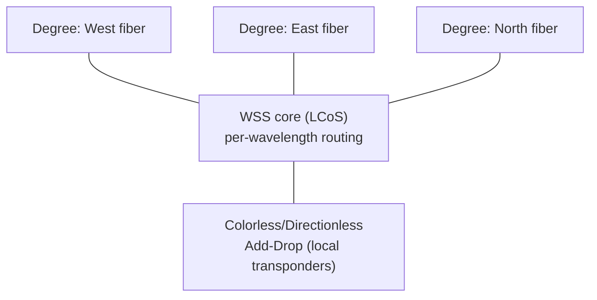

*图11.2——一台多方向CDC-ROADM。每个波长都可以直通至任意方向,或从本地转发器上下路,全部在光域内通过波长选择开关完成。正是这种波长粒度的软件驱动路由,使光传输网络具备了敏捷性。*

**ROADM**是现代光传输网络的主力设备。其任务是获取到达输入光纤的数十个波长,并针对每个波长决定是**直通**(继续传向另一目的地)、**下路**(交付给本地转发器/接收机),还是将本地生成的波长**上路**到输出光纤——所有这些都在光域内完成,而无需将直通波长转换为电信号。这种波长粒度、可远程重构的路由,正是现代光网络具备敏捷性的原因:运营商可以从管理控制台配置和重新路由波长,而无需派遣技术人员去跳接光纤。

##### 演进与架构

ROADM历经数代演进,灵活性不断提升。早期的固定式OADM只能上下路预先确定的波长。现代ROADM围绕**波长选择开关(WSS)**构建,并增加了**方向(degree)**——"方向"是指朝向相邻节点的一个方位(一对输入/输出光纤)。二方向ROADM位于线性跨段上;八方向或二十方向ROADM则位于网状网络的交汇节点,在多个方向之间路由波长。

最灵活的现代架构是**CDC ROADM(无色、无方向、无冲突)**:
- **无色(Colorless)**:任何上下路端口都可以处理任何波长(不与特定颜色硬绑定),因此转发器可以调谐至任意波长并连接到任意端口。
- **无方向(Directionless)**:上下路的波长可以路由到或来自任意方向,而不局限于某一个方向。
- **无冲突(Contentionless)**:来自不同方向的同一波长的多个实例可以同时上下路,而不产生内部阻塞。

因此,CDC ROADM实现了完全自动化的软件定义波长配置——任意波长、任意方向、任意端口——这是软件定义光网络的基础。ROADM还集成了**放大级**(前置放大器、增强放大器,以及中间级EDFA),并且必须管理波长在多个ROADM间级联时的**OSNR预算**,因为每个ROADM和放大器都会引入损耗和噪声。**无网格(柔性网格)ROADM**支持可变信道宽度(详见第09篇),可将频谱灵活分配给不同波特率的信道。

#### WSS——波长选择开关

**WSS**是每台ROADM核心处的光学元件。它接收一条承载多个波长的光纤,用光栅将其在空间上色散分离,再利用可编程空间光调制器将每个波长独立路由至若干输出端口中的任意一个。主导技术是**LCoS(硅基液晶)**——一个二维液晶像素阵列,通过施加可编程相位图案来引导每个色散分离后的波长——它支持全C波段、96个以上信道、柔性网格操作,以及每波长衰减控制(每端口插入损耗为3–5 dB)。另一种替代技术是**基于MEMS的WSS**(微型倾转反射镜)。

WSS市场近乎双寡头格局:**Lumentum**占据最大份额(约45–50%),其次是**Coherent(由II-VI与Finisar合并而成)**(约35%),此外还有规模较小的参与者(Santec等)。由于每个ROADM端口都需要一个WSS,这种双寡头格局赋予了Lumentum和Coherent在光学系统供应链中的巨大议价能力(详见第23篇)。WSS是价值最高的光学元件之一,支撑它的LCoS技术是一种复杂的光子-MEMS-液晶混合技术。

#### OXC——光交叉连接设备

**OXC(光交叉连接设备)**在整条光纤或光纤空间路径(而非单个波长)的粒度上执行全光交换。用于大型OXC的主导技术是**三维MEMS**:一个由微型反射镜组成的阵列,每个反射镜可以沿两个轴倾转,从而将来自任意输入光纤的光束引导至任意输出光纤,构建规模可达**1000×1000端口**甚至更大的交换矩阵。OXC应用于海底光缆登陆站(用于互联缆线系统与陆上回传网络)以及大型光核心网络中。**Calient Technologies**是三维MEMS OXC的主要厂商(其S系列产品)。OXC重构速度较慢(毫秒级,受限于反射镜的物理移动),但能以极低的单比特功耗,提供大规模、协议透明、比特率透明的全光交换——在不曾"看"光一眼的情况下完成对光的交换。

#### OCS——数据中心内的光电路交换

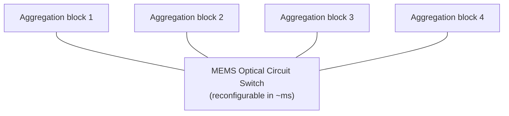

*图11.1——光电路交换(谷歌的Apollo/Palomar)在聚合区块之间插入一台可重构的MEMS光交换机,使结构拓扑能够以毫秒级速度重新布线,以匹配流量——或者对于AI而言,匹配作业的集合通信模式(详见第06、15篇)。它还支持增量式、异构式的架构升级。*

光交换领域最引人注目的近期应用是在**数据中心内部**,**谷歌**在生产规模上率先实现了**光电路交换(OCS)**。谷歌的**Apollo/Palomar** OCS系统在SIGCOMM 2022论文**《Jupiter Evolving》**中有所描述,使用**基于MEMS的光交换机**动态重构数据中心结构的拓扑。谷歌并未采用带有电子脊交换机的固定Clos架构,而是在聚合区块之间插入OCS,使逻辑拓扑能够(大致以毫秒级速度)重构,以匹配流量模式并支持结构的增量式、异构式升级。

其动机是多方面的。**拓扑工程**:不同的流量模式(对于AI而言,还包括不同的集合通信算法)最适合不同的拓扑结构,而OCS使结构能够随之适应。**增量升级**:OCS将设备的各个世代解耦,使谷歌能够在不推倒重来的情况下升级结构的部分组件。**大象流**:大型、长生命周期的流可以被分配专用的光电路,将其从分组交换结构中卸载出来。**功耗与成本**:消除一层电子脊交换机(以近乎无源的光交换取而代之)可以节省功耗和成本。就AI训练而言,重构拓扑以匹配特定作业通信模式的能力——为该作业所需的AllReduce或AllToAll提供无阻塞连接——是一项强大的优化手段(详见第15篇)。谷歌在数据中心规模上部署OCS,是过去十年中最重要的网络创新之一,其他运营商正竞相效仿。

#### 硅光交换机

一项前沿技术是**硅光交换机**——使用**微环谐振器**或**马赫-曾德尔干涉仪(MZI)**作为交换元件、集成在硅光芯片上的光交换技术。与MEMS(毫秒级重构)或LCoS(重构速度相近)不同,硅光交换机可以在**纳秒级**完成重构,为有朝一日能够以光学方式交换单个分组或突发流打开了可能性。当前器件的端口数受限(数量级在64×64左右),并面临诸多挑战(插入损耗、环的热调谐、与系统其余部分的集成)。**Lightmatter(Passage)、Ayar Labs、Celestial AI、Salience Labs**等初创企业生态正在为AI结构开发硅光交换和互联技术,在这些场景中,快速交换与光学带宽密度的结合可能带来变革性影响(详见第13、24篇)。硅光交换还与共封装光学紧密相关,未来光学引擎和交换功能或许有朝一日能够与计算功能集成在一起。

#### 光交换厂商与系统

构建ROADM、OXC及相关传输平台的光系统厂商包括:
- **Ciena**——Waveserver和GeoMesh平台,是相干传输和ROADM系统领域的领导者。
- **Nokia**——1830光子服务交换机(PSS)系列以及1350管理系统。
- **Infinera**——GX系列和FlexILS开放线路系统,拥有其独特的InP PIC技术。
- **富士通**——1FINITY平台,在解构式/开放光领域颇具影响力。
- **华为**——OptiX OSN 9800及相关平台,在许多非西方市场占主导地位,但在其他市场受到出口管制的限制。
- **中兴通讯**、**Coriant(现属于Infinera)**及其他厂商共同构成了这一领域。

元件供应商——**Lumentum和Coherent**(WSS、放大器、激光器)、**Calient**(OXC)——为这些系统厂商提供集成所需的构建模块。包括集成系统与解构式开放光架构之间的张力在内的竞争动态,详见第23篇。

#### 扩展深度剖析:为何光电路交换适合AI训练

将光电路交换部署于数据中心内部——谷歌最引人注目的贡献(见上文)——值得与AI工作负载明确关联起来,因为这种契合并非巧合。AI训练集合通信(详见第15篇)具有**结构化、可预测、且生命周期相对较长**的通信模式:一个数据并行作业在同一组GPU上每一步都执行相同的AllReduce,持续数小时或数天;一个流水线并行作业则在同一批相邻阶段之间反复发送激活值。这些正是**电路交换**大放异彩的条件:当通信模式稳定且流量大时,为其分配一条专用光电路(通过MEMS重构建立需要毫秒级时间)可以将建立成本分摊到一条长期、大带宽的流上,该电路随后以全光带宽承载流量,没有分组交换的开销、没有缓冲、也没有拥塞。相比之下,分组交换擅长处理突发性、短生命周期、不可预测的流量——而这恰恰是电路交换处理不佳的场景。

谷歌所追求的综合方案是一种**混合**结构:分组交换用于一般性、突发性流量,而光电路交换则用于为大型、结构化的流提供直接、可重构的拓扑,并使结构拓扑匹配作业的通信模式。由于不同的并行策略和不同的集合通信算法偏好不同的拓扑(环形AllReduce需要环形拓扑,分层归约需要树形拓扑),按作业——甚至按作业的不同阶段——重构光学拓扑的能力,相较于必须以单一拓扑服务所有模式的静态Clos架构,可以显著提升有效带宽并缩短集合通信完成时间。随着AI集群规模扩展至10万个以上GPU(详见第24篇),静态胖树架构变得极其昂贵,集合通信延迟扩展也变得难以承受,可重构光学结构正日益成为一种颇具吸引力的工具,而这一始于谷歌数据中心创新的OCS,正有望成为最大规模AI结构的核心技术。

#### 扩展深度剖析:重构时间谱系

组织本章各项光交换技术的一个有用方式,是按其**重构时间**进行划分,因为该参数决定了每种技术的适用场景。在速度较慢的一端,**三维MEMS OXC和基于MEMS的OCS**的重构时间大致在**毫秒级**(受限于微反射镜的物理移动和稳定时间)——足够快以便在作业或阶段之间重新配置拓扑,或绕过故障重新路由,但对于交换单个分组而言则远远太慢。**基于LCoS的WSS/ROADM**在波长重构方面同样处于毫秒级范围,适合在传输网络中进行不频繁变更的波长配置和梳理。在速度较快的一端,**硅光交换机**(微环、MZI)可以在**纳秒级**完成重构,原则上足够快以光学方式交换突发流甚至分组——为长期以来一直是研究目标的光学分组/突发交换开辟了诱人的可能性,尽管当前器件的端口数量有限,并面临损耗和控制方面的挑战。

这一重构时间谱系映射到一个根本性的架构问题:网络拓扑应以何种时间尺度进行调整?毫秒级交换(MEMS)适合拓扑工程和配置;纳秒级交换(硅光子)如果技术成熟,则可能适合细粒度、按突发流的光学路由。两者之间的空白——微秒级交换——在很大程度上尚无成熟技术填补,弥合这一空白正是硅光交换初创企业(详见第13篇)的目标之一。随着AI结构朝着更细粒度的可重构性推进以匹配其结构化的集合通信,这一重构时间谱系及占据其各个区段的技术,正成为结构设计的核心内容——而快速光交换与共封装光学的融合,最终可能彻底模糊交换机与光学结构之间的界限。

#### 扩展深度剖析:级联ROADM的OSNR代价

塑造光网络设计的一项实际约束是**级联ROADM的OSNR代价**,理解这一点有助于解释光网络为何采用如此的工程设计方式。波长每经过一台ROADM,都会增加损耗(每次通过的WSS插入损耗为3–5 dB,再加上复用/解复用损耗),这些损耗必须通过放大来补偿,而每台放大器(EDFA)都会增加ASE噪声(详见第09篇),从而劣化光信噪比。因此,一个穿越多台ROADM和放大级的波长会累积噪声,远端的OSNR会随之下降——最终可能降至接收机(经FEC后)所需水平以下,从而设定了一个波长在必须再生(转换为电信号再转回光信号,这是一种昂贵的、能重置OSNR的OEO操作)之前所能级联的ROADM数量上限。

这一OSNR预算约束了光网络的**传输距离与拓扑结构**:一个波长在必须再生之前只能通过有限数量的ROADM,这限定了全光域的规模,并决定了再生站点必须设置在何处。相干技术(详见第10篇)极大地放宽了这一约束——相干技术卓越的接收灵敏度和强大的FEC能够容忍低得多的OSNR,因此相干波长在再生之前能够穿越远更多的ROADM和远更长的距离,从而扩展了全光域的覆盖范围,并减少了对昂贵再生的需求。这是相干技术未被充分认识的优势之一:它不仅能在每个波长上承载更多比特,还能让这些波长在不经OEO再生的情况下穿越光网络的更大范围,从而简化网络并降低成本。OSNR预算与级联ROADM之间的约束关系是光网络规划中的核心考量因素,而相干技术缓解这一约束的方式,正是相干技术不仅重塑了点对点链路、更重塑了整个光网络架构——更少的再生站点、更大的全光域、更简单的拓扑结构——的原因之一。

#### 扩展深度剖析:光交换与光网络的解构

光交换技术与**光网络的解构**(详见第10篇)紧密交织,厘清这一联系有助于阐明一个重要的行业趋势。在传统的集成光系统中,ROADM、放大器、转发器和管理软件都是同一厂商垂直整合的产品。解构式模型(开放线路系统,详见第10篇)将这些分离开来:**光线路系统(OLS)**——即ROADM、WSS、放大器和光监控信道——成为一个层,而转发器(或路由器/交换机中的相干可插拔模块)成为另一个层,二者可能来自不同厂商,并通过开放接口(OpenROADM)相互连接。在这一模型中,光交换(ROADM/WSS)是OLS的核心,提供解构式转发器所接入的波长路由功能。

这种由标准化接口和可插拔相干技术(详见第10篇)所推动的解构,正在重塑光系统市场(详见第23篇):它使各层商品化并开放,让运营商能够混用不同厂商的产品,并在集成系统厂商(Ciena、Nokia、Infinera)、元件供应商(Lumentum、Coherent——制造OLS核心的WSS)以及路由器/交换机厂商(其可插拔相干模块接入OLS)之间转移价值。超大规模云厂商凭借其对开放性和多厂商采购的偏好,推动着这一解构进程,自建或采购开放线路系统,并将相干波长接入其中。因此,本章所述的光交换技术——ROADM、WSS——不仅仅是一种技术能力,更是一个正在解构的光网络中的一个层级,其角色以及围绕它的竞争动态(WSS双寡头格局,详见第23篇)受到贯穿整个数据库的同一种专有与开放、集成与解构张力(详见第01篇)的塑造。光交换正处于开放线路系统的核心位置,而光网络的解构,在很大程度上正是围绕它开放各层的故事。

#### 结论

光交换是在不触碰比特的情况下路由光的艺术——在波长和光纤保持在光域的同时引导它们穿越网络,从而节省电转换所需的功率、延迟和成本。基于WSS构建的ROADM使传输网络具备敏捷性和软件定义能力;OXC在电缆规模上提供大规模全光交换;而最引人注目的是,光电路交换已经迁移进入数据中心内部,谷歌的OCS部署动态重构结构拓扑,以服务于不断变化的流量和AI集合通信模式。前沿技术——纳秒级硅光交换——有望将光交换推向更精细的粒度,模糊电路交换与分组交换之间的界限,并与共封装光学革命相互交织。随着AI结构对巨大带宽和拓扑灵活性的双重需求,光交换正从传输网络的边缘走向数据中心的核心,本章所考察的这些技术正日益成为构建最大规模AI集群的核心所在。下一章将追随这些交换机所路由的波长,一路走出数据中心——进入构成数据中心互联的都会区、长途骨干和海底系统。

[↑ 返回目录 / Back to Table of Contents](#目录--table-of-contents)

---

<a id="sec-27-13"></a>
## 27.13 数据中心互联(DCI)、都会网络、长途网络与海底光缆

**中文翻译，原文见:** [12_datacenter_interconnect_and_subsea.md](12_datacenter_interconnect_and_subsea.md)

---

### 数据中心互联(DCI)、都会网络、长途网络与海底光缆

#### 引言:将云缝合在一起

单一数据中心早已不再是云计算的基本单元。超大规模云厂商运营着由多栋数据中心楼宇通过都会光纤连接而成的**区域**,区域之间通过跨洲长途系统互联,大洲之间则由跨洋海底光缆连接。经由这些链路流动的流量规模巨大且持续增长:为保证持久性和可用性而进行的数据复制、内容分发、跨区域服务通信,以及——日益增多的——跨地理分布式基础设施的AI训练与推理同步。**数据中心互联(DCI)**是承载这些流量的一系列技术,涵盖从楼宇间数公里的暗光纤,到数千公里带中继器的海底光缆这一连续谱系。本章考察这一连续谱系:DCI传输距离层级及其对应技术、OTN和FlexE传输框架、都会区与长途DWDM,以及如今由超大规模云厂商直接拥有的海底光缆系统,这一点着实令人惊叹。本章建立在第10篇相干光学和第11篇光交换内容之上。

#### DCI传输距离连续谱系

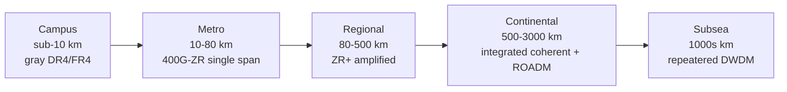

*图12.1——DCI传输距离连续谱系及沿途的技术交叉点:直接检测的灰光模块、单跨段ZR、放大型ZR+、集成长途相干,以及海底系统。随着DSP成本下降(详见第10篇),可插拔相干正持续蚕食更长的距离层级。*

DCI应用场景跨越了极其广泛的距离范围,每个范围最适合采用不同的技术:

- **园区DCI(约10公里以下)**:连接园区内的各栋楼宇,通常使用运营商自有的**暗光纤**。在这一距离范围内,直接检测的400G/800G可插拔模块(DR4、FR4)或短距相干即可胜任;无需放大。这是成本最低、最简单的层级,以直接插入路由器/交换机的灰光(单波长)或低信道数光学器件为主。

- **都会区DCI(10–80公里)**:连接都会区域内的数据中心。这是**400G-ZR**单跨段相干可插拔模块的最佳应用区间,未放大情况下传输距离可达约80公里——一个相干400G波长置于QSFP-DD/OSFP模块中,直接插入路由器,无需独立的传输系统。都会区DCI因ZR技术而发生了革命性变化(详见第10篇)。

- **区域DCI(80–500公里)**:连接跨区域的数据中心,需要放大(EDFA)。**ZR+**可插拔模块(凭借其更强的DSP和FEC)通过放大跨段和ROADM网络覆盖这一距离范围,传统转发器系统也服务于这一层级。

- **跨洲/长途DCI(500–3000公里)**:连接跨洲区域,需要完整的相干传输,配合多个放大跨段、ROADM,通常还需拉曼放大。这一层级使用性能最高的集成相干系统(Ciena WaveLogic、Nokia PSE、Infinera ICE),在此层级中最佳DSP的传输距离×容量表现至关重要,同时在传输距离足够的情况下也会使用ZR+。

这一连续谱系直接对应第10篇中的技术选择:可插拔相干(ZR/ZR+)正在取代较短层级中的集成转发器,而拥有最佳DSP的集成系统则保留了最长、容量最高的层级。

#### OTN——光传输网络

**OTN(光传输网络,ITU-T G.709)**是传统上为光传输构建帧结构的运营商级数字封装标准。OTN定义了一套容器层级结构:**OTU(光传输单元)**帧承载客户信号,其中**OTU4**承载100G,**OTUCn**(OTU-Cn)承载n×100G以支持更高速率。客户信号被映射进**ODU(光数据单元)**容器(ODU0到ODU4及柔性变体)中,可对其进行复用和交换。OTN提供了运营商所需的关键特性:标准化的**FEC**、用于跨多个运营商网段进行故障隔离的丰富**性能监控(PM)**和**串联连接监控(TCM)**开销,以及能够在数十毫秒内将流量绕过故障重新路由的稳健**保护倒换**(1+1、1:N)。

OTN丰富的开销和保护机制使其数十年来一直是运营商传输网络的骨干。但其复杂性超出了超大规模云厂商的实际需求:超大规模云厂商更倾向于更简单、更高带宽的成帧方式,并在更高层(IP/应用层)处理弹性问题,因此他们日益偏好**FlexE**(见下文)以及直接的以太网over DWDM,而非完整的OTN。OTN在传统运营商网络中,以及在需要多运营商、运营商级SLA和监控的场合仍然占据主导地位。

#### FlexE——灵活以太网

**FlexE(灵活以太网,OIF)**是以太网MAC层与物理层之间的一个垫层,将以太网速率与底层物理层速率解耦。FlexE能够将多个100G物理层**捆绑(bond)**成更高速率的逻辑客户端(例如捆绑构建出一条400G或1T管道)、将一条高速率物理层**信道化(channelize)**为多个较低速率的客户端(子速率化,例如通过一条100G物理层交付一项25G或250G的服务),并利用基于日历的时分机制实现MAC与物理层速率的**不匹配(mismatch)**。这种灵活性使运营商能够在标准以太网物理层和DWDM波长上配置任意速率的服务,兼具以太网的简洁性而非OTN的开销。FlexE(目前已发展到2.x版本)被谷歌、微软、AT&T等公司应用于都会区和DCI网络中,体现了超大规模云厂商偏好以太网为中心、更简单传输方式而非传统OTN的取向。

#### 都会区与长途DWDM

承载DCI和骨干流量的都会区与长途DWDM系统,正是第10篇所述相干技术以最高性能部署的场所。现代系统承载**单载波800G相干波长**(Ciena WaveLogic 5e/6、Nokia PSE-4/5、Infinera ICE6/7),并在一对光纤上封装约96个信道(若采用C+L波段则可达160个以上)。延伸传输距离和容量的关键技术包括:
- **C+L波段扩展**:增加L波段放大和信道,可使每对光纤的波长数大致翻倍,是为现有光纤基础设施增加容量最直接的方式。
- **超低损耗光纤**(G.654,详见第09篇),用于最长的放大跨段。
- **拉曼+EDFA混合放大**,用于纯EDFA的OSNR不足以支撑的超长跨段。
- **概率星座整形与SD-FEC**(详见第10篇),以逼近香农极限运行,并精确适应每条链路的情况。

这些系统代表了光学工程的最高水平,在跨越数千公里的每对光纤中挤压出每秒数十太比特的容量,它们是超大规模云厂商跨区域流量和运营商核心流量所依赖的骨干网络。

#### 海底光缆系统

```mermaid
flowchart LR
  LS1["Landing station<br/>+ Power Feed Equipment"] --> R1["Repeater (EDFA)"]
  R1 -->|"40-80 km"| R2["Repeater (EDFA)"]
  R2 -->|"40-80 km"| R3["Repeater (EDFA)"]
  R3 --> BU["Branching Unit"]
  BU --> LS2["Landing station A"]
  BU --> LS3["Landing station B"]
```

*图12.2——一套海底光缆系统:陆上登陆站为湿设备供电(通过电缆的铜导体输送高压直流电),EDFA中继器每隔40–80公里进行一次再放大,分支单元将信号分流至多个登陆点。超大规模云厂商如今自建并整体拥有全部私有电缆(谷歌的Dunant/Grace Hopper,Meta的2Africa)。*

最非凡的光学系统当属跨越大洋的**海底光缆**,它们承载着绝大多数的洲际数据流量。海底光缆系统是在地球上最严酷的环境之一——深海海床——中运行、设计寿命长达25年的一项工程壮举。

##### 海底系统剖析

一套海底光缆系统由**湿设备**(水下的一切)和**干设备**(岸上的登陆站)组成。**电缆**本身在由钢制强度构件、铜导体(用于输电)和聚乙烯绝缘层构成的结构中,捆扎了多对**单模光纤**,并在靠近岸边的浅水区域(渔业活动和船锚会对其构成威胁)加装**铠装**。每隔**40–80公里**,包含**EDFA**的**中继器**会对所有光纤的信号进行放大;这些中继器由沿铜导体从岸上**供电设备**输送来的高压直流电供电,该设备能够输出数千伏电压,为整条跨洋中继器链供电。**分支单元**允许一条电缆分流至多个登陆点。

从模拟到**数字相干光(DCO)**的转变彻底改变了海底容量:现代海底系统使用相干转发器(通常设在岸上,湿设备仅负责放大),充分利用所有相干技术——高阶调制、PCS、SD-FEC、C波段(并日益采用C+L波段)——以最大化容量。海底系统设计中的一个关键参数是**频谱效率与功率的权衡**:海底中继器的电力供应有限(由岸上馈电),因此海底系统通常针对每瓦特中继器功率所能承载的最多比特数进行优化,这可能倾向于采用较低阶调制(PM-QPSK)配合更多跨段的方案。

##### 容量纪录与超大规模云厂商的电缆

海底容量的增长堪称爆炸式。现代系统单条电缆可承载**每秒数百太比特**;Infinera等公司已展示接近或超过**1 Pbps**总容量的系统。最引人注目的发展是所有权格局的转变:海底光缆曾经由电信运营商联盟建设并拥有,而如今**超大规模云厂商正自建并拥有私有电缆**以服务自身流量:
- **谷歌**已投资了众多电缆项目,包括**Dunant**(跨大西洋,12对光纤,约250 Tbps)、**Grace Hopper**(跨大西洋,约352 Tbps,在登陆点采用了新颖的光纤切换技术)、**Curie**、**Equiano**(西非)以及**Firmina**(美洲)。
- **Meta**投资了包括**2Africa**(环绕非洲大陆,是有史以来最大的电缆项目之一)和**MAREA**(跨大西洋,与微软共建)在内的电缆项目。
- **微软**、**亚马逊**等公司同样投资于私有和联盟电缆项目。

这种超大规模云厂商的所有权模式,反映了其流量规模之庞大——它们消耗的洲际带宽如此之多,以至于拥有电缆比租赁容量更为经济——并使其能够掌控路由、容量和升级时机。这是云巨头如何在最深层的物理层面成为基础设施公司的最清晰例证之一。

##### 海底技术的演进

海底技术持续演进:**开放电缆系统**(湿设备与转发器分开出售,使运营商能够在电缆的整个使用寿命期间升级岸上的相干设备以提升容量——类似于第10篇所述开放线路系统的解构化思路)、海底环境中的**C+L波段扩展**、**空分复用(SDM)**下每条电缆配备更多对光纤(以每根光纤的容量换取更多光纤数量,优化每瓦特中继器功率所能承载的总容量——一项重大设计趋势),以及用于远程管理这些系统的**海底SDN控制**。洲际数据需求的不懈增长——如今因AI数据迁移和分布式训练而加速——推动跨大西洋容量大约每几年翻一番,维持着一波接一波持续不断的新电缆建设浪潮。

#### 扩展深度剖析:跨数据中心的分布式AI训练

一项将DCI从单纯的复制与连接性事务提升为核心AI基础设施事务的前沿发展,是**地理分布式训练**——即跨越由DCI链路连接的多个数据中心运行单一训练作业。随着前沿模型规模不断扩大,以及单一数据中心站点可用的电力日益成为一项约束因素(一个大型AI集群所需的电力可能超过单一站点电网连接所能供应的量),运营商被迫将训练分散到多个站点,通过都会区乃至长途DCI进行同步。这极具挑战性,因为数据中心之间的延迟(都会区级别数十微秒,长途级别数毫秒)远远超过数据中心内部结构的延迟,而站点之间的带宽虽然可观,却远低于数据中心内部的对分带宽。

使跨数据中心分布式训练成为可行方案的技术,在更大规模上呼应了第15篇所述的层级化策略:将对延迟敏感、高频次的集合通信(张量并行)保留在单一数据中心内部,而将数据中心间链路留给频率较低、对延迟容忍度更高的同步(某些形式的数据并行,或异步/周期性同步)。DCI链路必须承载巨大的带宽(推动了对运营商所在区域内数据中心之间高容量相干DWDM和暗光纤都会区链路的需求),训练框架也必须设计为能够容忍站点间延迟。这一新兴需求正在重塑运营商规划数据中心园区的方式(在都会区距离范围内集群化多栋楼宇,通过充裕的暗光纤和400G/800G相干技术连接),也是DCI容量增长的一项重要新驱动力——AI建设浪潮正将其带宽需求从数据中心内部延伸到都会区和区域光网络。

#### 扩展深度剖析:超大规模云厂商自有海底光缆的经济学与战略

海底光缆所有权从电信联盟转向超大规模云厂商(见上文)的这一转变,是这个时代最引人瞩目的基础设施发展之一,其背后的逻辑值得进一步阐述。历史上,海底光缆由电信运营商联盟共同建设,分摊巨额成本(每条电缆从数亿美元到超过十亿美元不等),并将容量出售给其他各方。超大规模云厂商的流量增长如此之大——由跨区域数据复制、内容分发和跨数据中心服务通信所驱动——以至于租赁容量的成本高于直接拥有电缆,而拥有电缆则使它们能够掌控路由、容量、升级时机和弹性。于是谷歌、Meta、微软和亚马逊开始为自身流量建设**私有电缆**(谷歌的Dunant、Grace Hopper、Curie、Equiano、Firmina;Meta的2Africa以及共建的MAREA),有时还采用了新颖的技术特性(谷歌的Grace Hopper在登陆点采用光纤切换技术以增强弹性;Dunant率先采用了对空分复用友好的多光纤对设计)。

其战略意义深远。超大规模云厂商如今拥有新建跨洋容量的相当大一部分,使它们不再仅仅是使用者,而是全球互联网基础设施最深层的建设者和拥有者——这是一种从GPU和交换机ASIC一直延伸到海床上电缆(及其上频谱)的垂直整合。这为它们带来了掌控力和成本优势,但也将关键的全球基础设施集中在少数几家私营企业手中,引发了监管、安全和弹性方面的问题。这也塑造了技术走向:超大规模云厂商对每条电缆最高容量的需求,推动了空分复用技术(每条电缆配备更多对光纤,针对每瓦特中继器功率的容量进行优化——详见第24篇)以及海底环境中C+L波段扩展的采用。AI时代对跨大洲迁移训练数据和同步分布式基础设施的巨大需求,只会进一步加剧这一需求,维持着一波持续不断的新私有和联盟电缆建设浪潮,使海底层成为数据中心内部同一场容量竞赛的活跃前沿。

#### 扩展深度剖析:DCI传输距离层级及其技术交叉点

理解DCI传输距离连续谱系(第12篇)的最佳方式,是通过随距离增加而出现的**技术交叉点**,因为每个交叉点都标志着主导技术和经济格局的一次转变。在最短的层级(园区,10公里以内,暗光纤),**直接检测灰光光学器件**(路由器中的DR4/FR4可插拔模块)或短距相干即可胜任,该链路本质上是数据中心内部结构的延伸——无需放大,技术简单,单比特成本最低。第一个交叉点出现在都会区层级(10–80公里)附近,转向**单跨段相干(400G-ZR)**:在这一距离范围内,直接检测的传输距离已经耗尽,相干技术的色散补偿和灵敏度变得必要,但单个未放大跨段仍然够用,相干功能也能装入可插拔模块中。第二个交叉点进入区域层级(80–500公里),增加了**放大(EDFA)和ROADM**,并转向**ZR+**(更强的DSP/FEC以支持放大传输距离)——此时链路已成为一个带有放大站点和波长路由的受管理光网络,而非简单的点对点跨段。第三个交叉点进入长途/跨洲层级(500–3000公里),带来了**性能最高的集成相干系统**(Ciena WaveLogic、Nokia PSE、Infinera ICE)、拉曼放大、C+L波段扩展,以及长途DWDM的完整装备,在这一层级中最佳DSP的传输距离×容量表现最为关键。

这些交叉点——从直接检测到单跨段相干、从单跨段到放大型ZR+、从ZR+到集成长途系统——标志着技术和经济格局发生转变的位置,它们也解释了DCI和光传输市场的结构(详见第23篇):可插拔相干(ZR/ZR+)正日益占据都会区和区域层级(在这些层级取代集成转发器,详见第10篇),而拥有最佳DSP的集成系统则保留了长途和海底层级,在这些层级其传输距离优势具有决定性意义。因此,这一传输距离连续谱系并非平滑的,而是被这些技术交叉点所打断,每个交叉点都是不断蚕食的可插拔相干方案与既有集成系统方案之间的竞争战场,随着相干DSP性能提升和成本下降(详见第10篇),每个交叉点的位置也在不断移动,可插拔相干正随着时间推移持续向更长的距离推进。

#### 扩展深度剖析:弹性、保护与故障的代价

DCI和海底链路的**弹性**值得专门探讨,因为这些高容量、长距离链路发生故障的代价是严重的,并塑造了其设计方式。海底光缆断裂(源于船锚、渔船拖网或海床滑坡)或长途光纤断裂(源于施工作业,即那句老话中的"挖掘机")可能切断巨大的容量,而修复工作——尤其是海底修复,需要专门的电缆修复船来定位、打捞、拼接并重新铺设电缆——可能耗时数天到数周。依赖该链路的流量所受到的影响可能十分严重,因此弹性设计需要在多个层面进行工程实现。

在**光层**,OTN保护倒换(1+1、1:N——详见第12篇)和基于ROADM的恢复机制,如果存在多样化路径,可以在数十毫秒内将波长绕过故障重新路由。在**网络层**,IP/MPLS或SRv6层将流量绕过故障链路重新路由。而在**架构层面**,运营商构建**路径多样性**——在关键节点之间铺设多条物理上分散的电缆和路由,以确保没有单一的一次断裂就能孤立一个区域——这正是超大规模云厂商在关键路由上投资多条海底电缆(详见第12篇)的部分原因,也是为关键DCI设计多样化陆上路由的原因。其经济账十分清晰:配置多样化、受保护容量的成本,需要与故障的代价(以及声誉和合同层面的后果)相权衡,对于价值最高的流量而言,这种冗余是值得的。因此,弹性工程——保护倒换、路径多样性、快速恢复,以及多样化电缆和路由的布局——是DCI和海底网络的一门核心学科,也是这些长距离光学系统据以设计、光系统和海底电缆行业据以竞争和差异化的又一个维度(与容量和传输距离并列)。

#### 结论

数据中心互联覆盖了一个非凡的范围——从园区内楼宇间数公里的暗光纤,到跨越洋底数千公里带中继器的电缆——但归根结底,这一切都是第09篇和第10篇所述光学技术在不同尺度上的部署。各个传输距离层级(园区、都会区、区域、跨洲、海底)各自从相干工具箱中选择自己的技术:最短距离采用直接检测可插拔模块和短距相干,都会区和区域采用ZR/ZR+可插拔模块,而长途和海底则采用性能最高的集成相干系统。OTN和FlexE为传输构建帧结构;C+L波段扩展、超低损耗光纤和混合放大延伸了传输距离;而如今拥有整套海底光缆系统的超大规模云厂商,已将其基础设施延伸至海底。随着AI工作负载日益跨越区域和大洲——出于数据引力、容量、弹性等考量——DCI和海底系统正变得对AI基础设施故事愈发核心,它们所支撑的容量增长是整个网络领域中最可靠的趋势之一。下一章将转向一项将从内部重塑光学器件的技术:共封装光学与线性驱动光学,这是对所有这些系统不懈的带宽扩展所造成的功耗危机的回应。

[↑ 返回目录 / Back to Table of Contents](#目录--table-of-contents)

---

<a id="sec-27-14"></a>
## 27.14 共封装光学(CPO)、线性驱动光学(LPO)与光学集成的未来

**中文翻译，原文见:** [13_co_packaged_optics_and_lpo.md](13_co_packaged_optics_and_lpo.md)

---

### 共封装光学(CPO)、线性驱动光学(LPO)与光学集成的未来

#### 引言:交换机面板上的功耗之墙

本数据库中的每一项技术,归根结底都受制于功耗。而这一约束在交换机ASIC与其面板上光收发器之间的边界处,表现得最为尖锐、也最为迫近。随着交换芯片带宽的爆炸式增长——12.8 Tbps、25.6 Tbps、51.2 Tbps,以及即将到来的102.4 Tbps及更高——将这些比特从ASIC承载出去,穿过封装、穿过印刷电路板,再送达前面板可插拔光模块的电气接口,已成为一个主要且不可持续的功耗消耗者。业界的应对之策是从根本上重新架构光转换发生的位置:将其拉近ASIC(线性驱动光学),再放到同一封装上(共封装光学),最终进入计算裸片内部本身。本章详细审视这场带宽-功耗危机、近期方案**线性驱动光学(LPO)**、长期方案**共封装光学(CPO)**、使CPO成为可能的光学引擎与激光集成技术、关键产品与路线图,以及将决定这一转变展开速度的热管理、制造和标准化挑战。这是整个数据中心网络领域中最具影响力、演进最迅速的领域之一,它将第09篇的光物理、第10篇的收发器生态系统与第14篇的交换机ASIC架构紧密联系在一起。

#### 数据中心光学器件中的带宽-功耗危机

```mermaid
flowchart TB
  subgraph PL["Pluggable today — total ~6-9 pJ/bit"]
    A1["Switch ASIC"] -->|"long lossy SerDes (inches)"| FP["Front-panel module + DSP"] --> F1["fiber"]
  end
  subgraph LP["LPO — remove module DSP"]
    A2["Switch ASIC (does the EQ)"] -->|"SerDes"| FP2["Linear module, no DSP"] --> F2["fiber"]
  end
  subgraph CP["CPO — total ~1.5-2 pJ/bit"]
    A3["Switch ASIC"] -->|"mm, on-package (UCIe-like)"| OE["Co-packaged optical engine"] --> F3["fiber"]
  end
```

*图13.1——应对面板功耗之墙的三种方案。CPO消除了通往前面板的冗长、有损电气SerDes通道(即5–10 pJ/比特这一项),将总能耗削减约4–5倍;LPO是移除模块DSP的近期见效方案。其代价在于传输距离、可维护性以及热/激光方面的挑战。*

考察一下交换机ASIC带宽的演进轨迹。博通的Tomahawk系列很能说明问题:**Tomahawk 4达到12.8 Tbps**,**Tomahawk 5达到51.2 Tbps**,路线图指向**102.4 Tbps**及更高。交换机带宽每翻一番,都必须从芯片上承载出去、送达网络,而在前面板这意味着需要更多、也更快的光收发器。一台51.2 Tbps交换机的前面板可能容纳64个800G端口或128个400G端口;下一代又将其再次翻倍。两个功耗问题相互叠加:

首先是**收发器功耗**本身。一个可插拔光模块的功耗大约在5–20瓦范围内(400G QSFP-DD约为10–14 W,800G模块更高)。乘以高端交换机上256到512个端口,仅收发器就可能消耗**一到数千瓦**——往往超过交换机ASIC本身的功耗。收发器,而非交换芯片本身,成为了主导的功耗项。

其次,更隐蔽的是,将信号从ASIC驱动到前面板模块所需的**电气SerDes功耗**。在**112G PAM4**每通道速率下(即将迈向224G),从ASIC裸片经过封装、穿过PCB、通过连接器到达前面板笼型插槽的电气通道既长又有损耗,需要在两端都配备带有复杂均衡技术(CTLE、FFE、多抽头DFE——详见第02篇)的强大SerDes。这种SerDes仅仅为了将信号跨越封装边界传送到模块,就要消耗约**5–10皮焦耳每比特**。在51.2 Tbps速率下,驱动前面板的SerDes仅仅为了穿越几英寸的电气通道,就可能消耗**数十瓦**功率——这些功率既未用于计算,也未用于光转换,而只是用来推动电子在有损铜走线中前进。

前面板还带来了硬性的**物理密度**限制:交换机正面能容纳QSFP-DD/OSFP笼型插槽的空间是有限的,而随着带宽翻番,面板却无法相应扩大。收发器功耗、SerDes功耗与面板密度的叠加,构成了这场带宽-功耗危机,并恰好在51.2 Tbps这一代变得尖锐,在此之后则变得不可持续。业界的应对方案,按激进程度递增依次为**LPO**、**近封装光学(NPO)**和**CPO**。

#### 线性驱动光学(LPO)

**线性驱动光学(LPO)**,也称为线性可插拔光学器件,是一种精巧的近期方案。其核心洞见在于:现代可插拔收发器中最耗电的元件,是模块内执行重定时、均衡和信号恢复的**DSP(数字信号处理器)**芯片。LPO**将DSP彻底从收发器中移除**,代之以简单的线性模拟驱动器(发送侧)和线性跨阻放大器(接收侧)。原本由模块DSP承担的信号调理工作,转而由**交换机ASIC自身的SerDes**承担——ASIC的发送均衡对信号进行了足够充分的预调理,ASIC的接收DSP则对返回信号进行清理,因此模块本身不执行任何数字处理。光学器件成为ASIC SerDes与光纤之间的一种"线性"(模拟)直通通道。

**节省的功耗**相当可观:消除每个400G收发器约2–4 W的DSP功耗,在256个端口上累计,每台交换机可节省约一千瓦——相当于收发器功耗降低30–40%。LPO还降低了延迟(没有DSP重定时延迟)和成本(没有DSP芯片)。

**代价**在于传输距离和复杂性。由于没有模块DSP的均衡,链路的传输距离受限于原始光学信噪比——通常**不超过500米**(楼宇或园区内部),不适合数据中心间链路。而负担则转移到了**系统**层面:交换机ASIC的SerDes必须足够优秀,能够处理原本由模块DSP管理的各种损伤,这就需要ASIC与模块之间更严格的电气规范,并带来了**互操作性挑战**——由于模块不再"清理"边缘信号,每一种ASIC厂商与模块厂商的组合都必须一起进行认证。这种多对多的认证矩阵,是LPO广泛采用的主要障碍。

LPO正在被迅速标准化和验证:目前有OIF的相关工作和IEEE 802.3的贡献提案,在OFC(光纤通信大会)上有众多演示,还有一个由模块制造商(InnoLight、Coherent、HiLight、Lumentum)和ASIC厂商(博通、Marvell)组成的生态系统,共同发布使LPO可行的电气规范。交换机厂商(Arista等)提供带有ASIC侧重定时选项的"LPO就绪"平台。业界普遍预期,LPO在整个21世纪20年代中期将占据800G市场日益增长的份额,成为近期、干扰最小的功耗优化方案,为共封装光学成熟之前的过渡阶段架起桥梁。

#### 共封装光学(CPO)——完整技术深度剖析

**共封装光学(CPO)**是更为长远、也更为激进的方案:将光学引擎物理集成**到交换机(或GPU)封装本身内部**,彻底消除通往前面板的冗长电气SerDes通道。ASIC不再需要跨越数英寸的PCB驱动112G PAM4信号到达面板笼型插槽,而是通过一条极短、低损耗的电气链路——毫米级而非英寸级——连接到位于同一封装基板上的光学引擎,光学引擎就在此处将信号转换为光,再由光纤将信号带出封装。

##### CPO的功耗优势

功耗方面的算式相当有说服力。一条**可插拔400G**链路在封装边界处的成本约为光学部分**1 pJ/比特**,加上驱动前面板的ASIC SerDes部分**5–8 pJ/比特**——**总计6–9 pJ/比特**。一条**CPO 400G**链路的成本约为光学引擎部分**低于0.5 pJ/比特**,加上极短的ASIC到引擎连接部分约**1 pJ/比特**——**总计1.5–2 pJ/比特**,提升约**4–5倍**。在51.2 Tbps速率下,这一差异折算下来每台交换机可节省数百瓦,而在一个拥有数千台交换机的数据中心中,累计可达数十万瓦(详见第25篇)。CPO从根本上说是一场功耗效率的博弈,而这种功耗节省正是其巨大工程和制造难度得以证成的理由。

##### CPO架构方案

CPO并非单一架构,而是一个整合方案的谱系:
- **封装内CPO**:光学引擎是一个粘合在与交换机ASIC相同封装基板上的芯粒,通过裸片间接口(通常**基于UCIe**,详见第05篇)连接。这是最紧密的集成方式,也是功耗最低的方案,但制造难度最大(光学器件与ASIC共享一个封装,必须共同组装和共同测试)。博通和Marvell正沿此方向推进。
- **近封装光学(NPO)**:光学引擎位于紧邻ASIC的小型板上(相距几厘米),通过短走线连接——这是一个中间步骤,能够捕获大部分功耗节省效果,同时缓解了热管理难度(光学器件的热量与ASIC的热量在一定程度上分离)和制造难度(引擎是独立的、可更换的单元)。英特尔的"Flyover"光学器件和Ayar Labs的TeraPHY在某些配置中即针对NPO。
- **板级集成CPO**:光学引擎集成在交换机(或加速器)板上,与ASIC之间为短电气连接,如Lightmatter的Passage互连方案,将光学引擎与计算单元共同布置在一块板上。

##### 光学引擎技术

任何CPO方案的核心都是**光学引擎**——实现电光转换的集成光子器件。三大技术阵营相互竞争:
- **硅光子(SiPh)光学引擎**:采用硅波导、锗光电探测器,以及硅(等离子体色散效应)或SiGe调制器,激光器通常位于芯片外部。SiPh与CMOS工艺兼容,能够实现多信道的高密度集成,是主流的CPO方案。**Ayar Labs的TeraPHY**是典型代表:一个通过类UCIe裸片间接口与交换机(或计算)ASIC通信的硅光子芯粒,激光器由外部提供;它的目标是每个芯粒实现每秒数太比特的光学I/O,每根光纤承载WDM信道。思科/Acacia、英特尔等公司也在构建SiPh引擎。
- **InP(磷化铟)光学引擎**:在InP上单片集成激光器、调制器和探测器,以更高成本提供更优异的激光器和调制器性能。Infinera和Lumentum带来了InP方面的专业能力。InP引擎可能适合对激光器质量要求最高的CPO场景。
- **基于VCSEL的引擎**:850纳米VCSEL的二维阵列,用于短距(多模)CPO;密度高、成本低,但传输距离有限——适合机架规模的CPO,而非跨机架应用。

##### 激光集成难题

硅光子CPO中最难解决的单一问题是**激光器**。硅具有**间接带隙**,因此无法高效发光——不存在良好的硅激光器。每个SiPh光学引擎都必须从某处获得其光源,各种方案各有其缺陷:
- **外部连续波激光器(片外)**:一个独立的激光器模块提供连续波光,通过光纤或透镜耦合进SiPh芯片。这规避了硅激光器的问题,但带来了**单点故障**隐患(一个激光器为多个调制器供光)以及**功率分配**挑战(将一个激光器的光分配给多个信道,同时保证每个信道有足够的功率)。外部激光光源的可靠性及其耦合方式成为关键问题。
- **III-V/硅异质集成**:将一层薄的III-V材料(能够产生激光)键合到硅上,从而在SiPh波导上方的III-V层中制造激光器。**英特尔的混合硅激光器**(与加州大学圣塔芭芭拉分校合作开发)以及IMEC/根特大学的III-V-on-Si异质集成研究开创了这一方向;它以更复杂的工艺(晶圆键合)为代价,将激光器集成到芯片上。这被广泛认为是通往集成激光器最有前景的路径。
- **在硅上直接外延生长III-V材料**:直接在硅上生长III-V激光材料本应是理想方案,但晶格失配会产生高密度的穿透位错(>10⁷ cm⁻²),破坏激光器的可靠性;这仍是一个研究课题。
- **微转印(µTP)**:将预制的VCSEL或激光器裸片从其原生晶圆印制到SiPh晶圆上(X-Celeprint等公司采用此方法),有望将优质激光器与高集成密度结合起来。

激光器问题是SiPh CPO在可靠性和良率方面的瓶颈问题,其解决方式(外部光源还是集成III-V)将塑造CPO的路线图走向。

#### 关键CPO产品与路线图

- **Ayar Labs TeraPHY**:最受瞩目的CPO光学I/O芯粒,每个芯粒提供每秒数太比特的光学带宽(目标约为每平方毫米8 Tbps的光学I/O密度),配备兼容UCIe的电气接口、每根光纤16×100G WDM信道(工作波长1310纳米),并采用外部(片外)激光光源("SuperNova"远程激光器)。Ayar与英特尔合作生产,并已与超大规模云厂商开展试点,目标是在21世纪20年代中期实现云规模部署,将光学I/O定位为任何ASIC都可通过UCIe集成的芯粒。
- **英特尔CPO/光计算互连(OCI)**:英特尔展示了与交换芯片集成的共封装光学I/O(例如4×400G),并展示了用于光学连接CPU和加速器的OCI技术,依托其硅光子和混合激光器方面的专业能力。
- **博通CPO**:博通已针对其最高带宽的Tomahawk系列产品瞄准兼容CPO的封装方案,并宣布了CPO合作项目,同时继续供应可插拔和LPO解决方案;博通庞大的交换芯片市场份额使其CPO推进时机对整个行业至关重要。
- **Marvell CPO**:Marvell将光子学与其Teralynx交换机ASIC集成,并展示了共封装光学I/O,借助其源自Inphi的光学DSP专业能力。
- **Lightmatter Passage**:一种光子互连(及光子计算)方案,将光学结构与AI加速器共同布置在一块板上,声称在AI互连方面具备巨大的带宽密度和功耗优势;获得了大量资金支持,并与台积电建立了合作关系。
- **Celestial AI**:面向AI的"光子结构",目标是实现光学存储器到计算、计算到计算的互连,相较电气/HBM方案宣称具有巨大的带宽密度优势;目前处于试点阶段。

#### CPO的热管理、可靠性与制造挑战

CPO的前景与其面临的巨大挑战相匹配:

- **热管理**:硅光子器件,尤其是用于WDM调制/滤波的**微环谐振器**,对温度极为敏感——一个环的谐振波长大约每摄氏度偏移**0.08纳米**。将温度敏感的光学器件与耗散**500–800 W**的交换机ASIC共同布置,会产生严重的热梯度,需要为每个环配备**加热器**(每个约10 mW)和主动热控制,以保持波长稳定。热管理可以说是封装内CPO的核心工程挑战。

- **可靠性与光纤连接**:可插拔模块可以在现场轻松更换;共封装光学引擎则不能。将光**纤**连接到封装上(一种机械上十分精细的连接),并使引擎具备**现场可维护性**(以确保单个失效的引擎不会报废整台交换机),都是棘手的难题。业界正趋向于永久性光纤带连接方案,配合**现场可更换的光学引擎模块**以及封装边缘的可拆卸光学连接器。

- **制造良率**:最终良率是交换机ASIC良率、光学引擎良率和组装良率三者的乘积。在昂贵的ASIC与光学器件共同组装的情况下,组装后发现的缺陷代价极其高昂,返工(尤其是在光纤连接之后)十分困难。这催生了对**已知良好光学器件(KGO)**的需求——在光学引擎被绑定到封装*之前*对其进行彻底测试——这类似于芯粒组装(详见第05篇)中对已知良好裸片的要求。

- **标准化与互操作性**:要形成健康的多厂商生态系统(而非垂直整合的专有CPO),ASIC与光学引擎必须能够跨厂商互操作。**OIF的共封装工作**(一个共封装框架和电气接口,有时称为cPHY)旨在标准化ASIC与光学引擎之间的接口,使不同厂商的引擎和ASIC能够组合使用——这对于避免CPO演变为一堆专有孤岛至关重要。

#### CPO采用时间表

综合业界各方路线图,一个合理的采用时间表如下:
- **2024–2025年**:LPO在超大规模云厂商中部署,作为800G阶段的近期功耗优化方案,与可插拔模块并行使用。
- **2025–2026年**:近封装光学(NPO)与早期CPO进入超大规模云厂商的概念验证和试点部署阶段(谷歌、Meta、微软),并在102.4 Tbps交换机世代中,面板功耗问题变得至关重要。
- **2026–2028年**:封装内CPO在超大规模云厂商中进入量产,用于带宽最高(1.6T端口级别)的交换机平台,在这些平台上可插拔器件的密度和功耗已不可行。
- **2028–2030年**:CPO成为高带宽AI结构部署中的标准方案,可插拔模块被限定用于边缘和低带宽端口;光学I/O日益与计算(GPU/加速器)封装本身集成,而不仅限于交换机。

这一时间表存在不确定性,也存在争议——LPO的成功可能延迟CPO的到来,热管理/制造方面的挑战也可能拖慢其进程——但方向是明确的:光转换正不可阻挡地从面板向硅片迁移。

#### 扩展深度剖析:每比特能耗层级及其驱动一切的原因

理解共封装光学转型——事实上也是理解本数据库大部分内容——最有用的视角是**每比特能耗层级**。每种互连技术在其跨越的距离上移动一个比特都有其特有的能耗成本,这些成本跨越了三个数量级以上:

| 互连方式 | 每比特能耗 | 跨度 |
|---|---|---|
| 片上导线 | 约0.01–0.1 pJ/比特 | 微米级 |
| 裸片到裸片(先进UCIe) | 低于0.5 pJ/比特 | 毫米级 |
| HBM接口 | 约1 pJ/比特 | 毫米级(转接板) |
| NVLink/封装内 | 约1.3 pJ/比特 | 厘米级 |
| PCIe/CXL(板级) | 约3–5 pJ/比特 | 数十厘米级 |
| ASIC SerDes到前面板 | 约5–10 pJ/比特 | 英寸级 |
| 可插拔光学器件(总计) | 约6–9 pJ/比特 | 最长可达公里级 |
| CPO光学引擎 | 约1.5–2 pJ/比特 | 最长可达公里级 |
| 相干(长途) | 100+ pJ/比特 | 数千公里级 |

这一模式一目了然:每当数据跨越互连层级中的一个边界,每比特能耗大致都会上升一个数量级,而**通往前面板的电气SerDes**是一个明显的低效环节——将一个比特推过封装和电路板上的短短几英寸到达可插拔模块所耗费的能量,与光学器件随后将其承载至可能长达数公里所耗费的能量相当。共封装光学正是要解决这一低效问题,将5–10 pJ/比特的电气SerDes项压缩至约1 pJ/比特,方法是将电气路径缩短至毫米级,从而使CPO总能耗(约1.5–2 pJ/比特)主要由光学引擎主导,而非电气接口。这正是CPO从根本上说是一场能效博弈的原因,也是每比特能耗层级——而非原始带宽——才是理解光学集成转型的正确框架的原因。这也是该领域更广阔发展轨迹(详见第24篇)是这一层级*趋于扁平化*的原因所在:将低能耗互连(UCIe、光学)向外推进到更长的尺度上,从而软化各数量级之间的跳跃,使数据中心的行为更像一台单一的、紧密耦合的机器。

#### 扩展深度剖析:为何激光器是最难的问题

硅光子CPO中的激光集成难题值得更深入的探讨,因为它是决定CPO采用节奏和形态的瓶颈问题。其根本原因是量子力学层面的:硅具有**间接带隙**,意味着电子-空穴复合必须伴随一个声子(晶格振动)以守恒动量,这使得辐射复合(发光)极为低效。III-V族半导体(InP、GaAs)具有直接带隙,能够高效发出激光,但由于晶格失配(原子间距不同),它们无法直接在硅上以可接受的质量生长,这会产生穿透位错——一种充当非辐射复合中心、破坏激光器可靠性的晶体缺陷。直接外延所能达到的位错密度(>10⁷ cm⁻²)比可靠激光器所能容忍的水平高出好几个数量级。

业界的各种应对方案各自体现了不同的权衡取舍。**外部激光器**(片外,通过光纤或透镜耦合)完全规避了这一问题,但引入了一个耦合接口(带来其损耗和对准公差)、单点故障隐患(一个激光器通常通过分光为多个调制器供光),以及功率分配挑战(向众多信道中的每一个输送足够的光功率)。外部激光光源及其耦合方式的可靠性,成为系统的薄弱环节,而Ayar Labs远程"SuperNova"激光器等方案,将激光功能集中到一个可独立维护、具备冗余能力的模块中。**III-V与硅的异质键合**——将一层薄的III-V材料转移到硅光子晶圆上并在其中制造激光器——以优良的质量将激光器集成到芯片上(III-V是键合而非生长的,从而规避了位错问题),代价是工艺更复杂、良率更低;英特尔的混合硅激光器是最成熟的实现形式。将预先测试过的III-V激光器裸片**微转印**到硅光子晶圆上,提供了一条将已知良好激光器与高密度集成相结合的路径。**硅基量子点激光器**是一个研究方向,其中点结构相比量子阱更能容忍位错,或许能够实现直接外延生长。哪种方案胜出——以及激光器是集成还是远程供光——将决定CPO的可靠性、良率、可维护性,并最终决定其采用时间表。可以毫不夸张地说,激光器正是共封装光学中,系统其余部分都在等待其到位的那个部件。

#### 扩展深度剖析:光学器件与1000瓦ASIC的热共存

将温度敏感的光学器件与高功率交换机ASIC共同封装所带来的热挑战值得进一步阐述,因为它可以说是封装内CPO面临的核心物理障碍。依赖谐振效应的硅光子器件——尤其是**微环谐振器**,因每个环都能上下路或调制一个波长而在密集WDM中极具吸引力——其谐振波长大约每摄氏度偏移**0.08纳米**。因此,即使只有几度的失控温度变化,也会破坏亚纳米间距的WDM信道网格,所以每个环都需要一个本地加热器(以及一个控制回路)将其谐振锁定到指定波长,每个环消耗约数毫瓦的功率——在一个拥有数千个环的高带宽引擎中,这累计起来会成为一项不容忽视的功耗项,也会带来控制复杂度上的负担。

现在把这个温度敏感的引擎放置在与耗散500–1000瓦的交换机ASIC相同的封装上。ASIC会在封装上产生巨大且动态变化的热梯度,而光学器件就处于这一热场之中。该引擎要么必须与ASIC实现热隔离(在共享基板上难以实现),要么必须采取主动温控(在功耗和复杂度上代价高昂),要么必须采用热稳健性更强的器件设计(例如倾向于使用宽带马赫-曾德尔调制器而非对热敏感的微环,但代价是密度降低)。共封装组件的热管理——在交换芯片这一"熔炉"旁边,将光学器件维持在其狭窄的工作窗口内——是一个没有干净利落解决方案的问题,这也是近封装光学(NPO,将光学器件的热域与ASIC分离)成为一个颇具吸引力的中间步骤的主要原因。业界如何解决这一热共存问题,将与激光器问题一道,决定封装内CPO究竟是2026年就能实现的现实,还是要等到2030年。

#### 扩展深度剖析:CPO的互操作性与商业模式利害关系

除了技术挑战之外,共封装光学还提出了一个深刻的**商业模式与互操作性**问题,这将决定其能否被采用以及如何被采用,值得展开阐述,因为它呼应了贯穿本数据库始终的专有与开放之间的张力。可插拔收发器是一种离散的、标准化的、多厂商采购的产品:运营商可以从众多厂商中任意购买模块、自由混用,并在几秒钟内更换故障模块——这是一个具有第二供应源和价格竞争的、充分竞争的商品化市场。共封装光学对此构成了威胁:如果光学引擎被集成进交换机ASIC的封装中,光学器件与交换机就变成了一个单一的、共同组装的、可能是单一来源的产品,运营商将失去混用不同厂商产品、寻找第二供应源以及现场更换的能力——这可能重新制造出可插拔模块曾经打破的那种垂直锁定。

业界的应对之策是推动**CPO标准化与互操作性**——OIF的共封装框架和电气接口(cPHY),以及定义标准光学引擎接口的努力,以使不同厂商的引擎和ASIC能够互操作,并使引擎能够成为现场可更换的模块,而非永久键合的部件。利害关系重大:一个标准化、多厂商的CPO生态系统能够维护运营商(尤其是超大规模云厂商)所要求的竞争和采购灵活性,而一个专有的、垂直整合的CPO则会集中价值并制造锁定效应。这与InfiniBand对以太网(详见第07篇)、NVLink对UALink(详见第24篇)、集成与解构式光系统(详见第10篇)之间的动态如出一辙:都是专有方案的性能与集成优势,同开放标准的灵活性与竞争性之间的张力。将成为CPO最早、也是最大规模采用者的超大规模云厂商,正大力推动开放、标准化、现场可维护的模式,而CPO最终是以一个开放生态系统的形式出现,还是以一堆专有孤岛的形式出现,其重要性丝毫不亚于技术本身——这是一个凌驾于热管理、激光器和良率挑战之上的商业模式问题。

#### 扩展深度剖析:NPO作为务实的中间路径

近封装光学(NPO)值得更充分的探讨,因为它可能作为一种务实的折中方案,在转型的过渡年份中占据主导地位——它在捕获CPO大部分收益的同时,规避了其最棘手的难题。在NPO方案中,光学引擎并非置于ASIC的封装上,而是位于紧邻ASIC的电路板上——相距几厘米,通过短的、受控阻抗的走线连接——因此电气通道远短于通往前面板可插拔模块的距离(捕获了大部分的SerDes功耗节省),但光学器件又不与"熔炉"般炽热的ASIC共封装(规避了热耦合问题中最严重的部分),光学引擎也可以是一个独立的、可维护的、甚至可插座化的单元(缓解了制造良率和现场可更换性问题)。因此,NPO占据了一个甜蜜点:捕获CPO大部分的功耗收益,却承受远小得多的热管理和可维护性难度。

其代价在于,NPO的电气通道虽然远短于通往前面板的距离,但仍长于封装内CPO,因此它捕获的SerDes功耗节省效果略逊一筹,可能仍需要一定的均衡处理。但在过渡年份(21世纪20年代中后期),随着业界攻克CPO在激光器、热管理和良率方面的挑战,NPO是一座颇具吸引力的桥梁——早期若干"共封装"演示和产品,更准确地说其实是近封装。从可插拔(当前)到LPO(近期功耗优化方案)、再到NPO(中间阶段)、再到封装内CPO(长期方案)、最终到计算封装上的集成光学I/O(详见第24篇),这一演进路径是较可能的走向,其中NPO所扮演的角色将比"可插拔直接跃迁到CPO"这一简单叙事所暗示的更大、也更持久。将NPO视为一个独特而务实的选项——而不仅仅是一个中转站——对于理解光学集成转型将如何真正展开十分重要,这也反映了一个工程现实:最简洁的长期架构(封装内CPO)并不总是实现该收益的最快路径,而能以较低风险捕获大部分价值的中间步骤,在实践中往往占据主导地位。

#### 结论

共封装光学与线性驱动光学,代表了光学行业对自身所造成的功耗危机的回应:交换机带宽不懈的翻番增长,使通往前面板可插拔模块的电气接口成为一项不可持续的功耗消耗者,唯一的出路是缩短或消除这一接口,将光转换拉向——并最终拉入——ASIC封装内部。LPO通过移除模块DSP并依托ASIC的SerDes,提供了一种优雅的近期缓解方案;CPO则提供了共封装光学引擎这一激进的长期解决方案,可带来4–5倍的功耗优势,但面临令人生畏的热管理、可靠性和制造挑战。支撑技术——硅光子和InP光学引擎、激光集成这一难题、通往光学芯粒的基于UCIe的裸片间接口,以及OIF共封装标准——正在快速演进,Ayar Labs、英特尔、博通、Marvell、Lightmatter和Celestial AI都在竞相定义未来。从可插拔光学到共封装光学的转型,是数据中心网络领域最重要的架构转变之一,它将决定网络能否跟上其所服务计算能力的发展步伐。下一章将转向这一切的核心所在——那些带宽增长引发了这场危机、其架构定义了数据中心网络的交换机ASIC。

[↑ 返回目录 / Back to Table of Contents](#目录--table-of-contents)

---

<a id="sec-27-15"></a>
## 27.15 网络交换ASIC——架构、厂商与AI网络

**中文翻译，原文见:** [14_network_switching_asics.md](14_network_switching_asics.md)

---

### 网络交换ASIC——架构、厂商与AI网络

#### 引言:驱动数据包流动的芯片

每一台数据中心交换机的核心都是一颗芯片——**交换ASIC(switch ASIC)**——它完成接收数十甚至数百个端口上的数据包、决定每个包应去往何处并以线速转发的实际工作,总吞吐量可达每秒数十太比特(Tbps)。交换ASIC是整个计算领域中要求最苛刻的芯片之一:它必须每秒处理数十亿个数据包,对庞大的表执行复杂的查找,在数百个队列间管理拥塞,并驱动连接光模块的高速SerDes——所有这些都要在严格的功耗预算内完成。这些芯片的设计决定了整个数据中心网络的带宽、时延、功能特性与经济性,而其制造商之间的竞争——由Broadcom主导,Marvell、NVIDIA、Cisco以及各大云厂商的自研芯片与之角逐——是业内战略意义最重大的竞争之一。本章将深入介绍交换ASIC架构,然后概览厂商格局,并特别关注正在重塑交换芯片的AI网络需求。本章建立在第06篇和第07篇所述的以太网与InfiniBand网络结构之上,并与第13篇的共封装光学(co-packaged optics)未来以及第15篇的AI网络结构相衔接。

#### 交换ASIC架构基础

```mermaid
flowchart LR
  IN["Ingress ports (SerDes)"] --> P["Parser<br/>(extract headers)"]
  P --> MA["Match-Action<br/>TCAM (ACL/LPM) + SRAM (exact-match)"]
  MA --> MOD["Modifier<br/>(TTL, MAC rewrite, VXLAN encap/decap)"]
  MOD --> TM["Traffic Manager<br/>(VOQ, 8 priority queues, buffers)"]
  TM --> DP["Deparser"] --> OUT["Egress ports (SerDes)"]
```

*图14.1——交换ASIC的数据包处理流水线。TCAM提供O(1)复杂度的通配符/最长前缀查找(但功耗代价很高);流量管理器的VOQ与缓冲区设置了在负载下主导尾部时延的排队时延(第17篇)。SerDes(入端口/出端口)占据了芯片面积和功耗的大部分——这正是共封装光学(第13篇)所要解决的问题。*

##### 交换矩阵架构

交换ASIC的核心是其**交换矩阵(switching fabric)**——将数据包从入端口移动到出端口的内部结构。存在多种架构,区别在于数据包缓存的位置:
- **输入排队(Input-Queued, IQ)**:数据包在入端口处缓存。结构简单,但存在**队头阻塞(head-of-line, HOL blocking)**问题——位于输入队列队首的数据包如果因其输出端口繁忙而被阻塞,会导致其后面原本可以发往空闲输出端口的数据包也无法前进。
- **输出排队(Output-Queued, OQ)**:数据包在出端口处缓存,消除了HOL阻塞,能实现理想性能,但要求交换矩阵以N倍线速运行(以便同时把所有N个输入端口的数据交付到一个输出端口)——在大规模场景下不切实际。
- **输入输出联合排队(Combined Input-Output Queued, CIOQ)**配合**虚拟输出队列(Virtual Output Queuing, VOQ)**:这是实际可行的折中方案。每个输入端口为每个输出端口维护一个**独立的虚拟队列**,因此某个输出端口造成的阻塞不会影响发往其他输出端口的数据包——从而消除了HOL阻塞——同时缓存主要发生在入端口。**调度器(scheduler)**在每个周期为输入与输出进行匹配,使用诸如**iSLIP**或**PIM(并行迭代匹配,Parallel Iterative Matching)**等算法,在crossbar上计算出高吞吐量、公平的匹配方案。在大规模场景下,内部交换矩阵本身通常也是一个**Clos**结构("芯片内部的矩阵"),带有虚拟内部通道。

##### 流量管理

**流量管理器(traffic manager)**负责出端口一侧的缓存与调度。每个端口都有入端口队列和出端口队列——通常是**每端口8个优先级队列**(对应第06篇所述的8种服务类别/PFC优先级)。队列间的调度使用**严格优先级(Strict Priority, SP)**(始终服务优先级最高的非空队列)、**亏损加权轮询(Deficit Weighted Round Robin, DWRR)**(按比例分配带宽),或两者的混合(对时延敏感类别用SP,其余用DWRR)。一个关键的架构选择是**缓冲区模型(buffer model)**:
- **共享缓冲区(shared buffer)**:一大块缓冲存储器根据需要在各端口间动态分配。Broadcom的Trident/Tomahawk系列采用共享缓冲区,在给定内存量下最大化突发吸收能力,但使每端口的行为可预测性降低。
- **分布式(每端口独立)缓冲区(distributed buffer)**:每个端口拥有自己的缓冲区,提供可预测的每端口时延,但限制了总的突发吸收能力。
- **深缓冲(deep buffer)**:面向路由的ASIC(如Broadcom Jericho)使用非常大的缓冲区(数百MB),以吸收大规模突发并处理广域网(WAN)规模的流量,相较之下高带宽数据中心交换机的缓冲区较浅(小于50MB)。

缓冲区架构是AI网络结构设计中的一个决定性权衡:深缓冲能够吸收AllReduce(第15篇)的同步突发流量,但会增加时延与成本;而浅缓冲交换机则依赖拥塞控制来保持队列短小——这是AI网络结构设计中的核心争论之一。

##### 数据包处理流水线

交换ASIC通过一条**流水线(pipeline)**处理每个数据包:
1. **解析器(Parser)**:识别数据包的报头(以太网、VLAN、IP、TCP/UDP、VXLAN等)并提取相关字段。
2. **匹配-动作表(Match-Action tables)**:转发的核心。数据包的字段与表进行匹配——**TCAM**用于通配符/最长前缀匹配(路由、ACL),**基于SRAM的精确匹配**表用于MAC表、精确路由——匹配到的表项指定动作(转发至端口X、丢弃、改写等)。
3. **修改器/改写(Modifier/rewrite)**:更新报头——递减TTL、改写MAC地址、压入/弹出VLAN标签、执行VXLAN封装/解封装。
4. **流量管理器(Traffic manager)**:对数据包进行出端口方向的排队与调度。
5. **复制器(Replicator)**:为组播/广播复制数据包。
6. **反解析器(Deparser)**:将(可能已被修改的)报头重新组装到数据包上以供发送。

##### TCAM——高功耗的查找主力

**TCAM(三态内容寻址存储器,Ternary Content-Addressable Memory)**是使通配符匹配得以快速实现的特殊存储器。与普通RAM(输入地址、输出数据)不同,CAM输入数据、返回匹配到的地址——而*三态(ternary)*CAM允许每一位取值为**0、1或X(无关位)**,从而支持最长前缀匹配路由和访问控制列表所必需的通配符匹配。TCAM将查找键与**所有表项同时**比较,无论表大小如何都能实现O(1)复杂度的查找。代价是**功耗**:每个表项都配有比较逻辑与在每次查找时激活的灵敏放大器,因此TCAM极其耗电(约每Mbps查找带宽消耗1-2瓦),且面积成本高昂。一台大型交换机可能拥有51.2万(512K)条80位以上的表项。由于TCAM的功耗和面积扩展性较差,交换机设计者使用**算法型TCAM(algorithmic TCAM)**(用巧妙的基于SRAM的数据结构来模拟三态匹配)以降低功耗,代价是略高的时延,并谨慎地为真正需要的匹配场景配给有限的真TCAM资源。

##### 可编程流水线与P4

传统上,交换机流水线是**固定功能(fixed-function)**的——解析器与匹配-动作行为被固化在芯片中。以**P4(协议无关的可编程包处理器语言,Programming Protocol-independent Packet Processors)**和Barefoot/Intel的**Tofino**ASIC为代表的**可编程流水线(programmable-pipeline)**运动,使流水线变得软件定义:一个P4程序指定解析图、匹配-动作表和动作,ASIC以线速执行它。P4支持自定义协议、**带内网络遥测(In-band Network Telemetry, INT)**(第22篇)、RDMA卸载以及快速实验。其代价在于,相对于针对已知协议优化的固定流水线,完全可编程的流水线可能会牺牲面积、功耗和表容量——正如我们将看到的,市场最终在很大程度上更青睐固定流水线(辅以选择性可编程性),用于大批量的数据中心交换。

##### SerDes——功耗与面积的主导项

将ASIC与外部世界相连的**SerDes(串行器-解串器,Serializer-Deserializer)**模块占据了现代交换ASIC芯片面积和功耗的大部分。一台51.2 Tbps的交换机需要**512条100G(或等效)通道**的SerDes,每条通道都需要112G PAM4所要求的复杂均衡电路(CTLE、FFE、多抽头DFE——第02篇)。以每比特几皮焦耳(picojoule)计,仅SerDes就可能消耗数十瓦功率。SerDes的功耗随波特率×通道数增长,正是这一项被**共封装光学(第13篇)**通过缩短电气通道长度而加以解决——面板处的SerDes功耗危机,归根结底是一个交换ASIC问题。SerDes的质量(传输距离、功耗、误码率)也是ASIC厂商之间的一项关键竞争差异化因素。

#### Broadcom交换ASIC产品线

**Broadcom**是商用交换芯片(merchant switch silicon)领域的主导力量,在数据中心交换ASIC市场估计占据**55%-60%的份额**,其产品系列定义了各个细分市场:

- **Trident系列**(企业/云接入与leaf层):功能丰富、可深度编程,面向leaf/接入层的交换机。**Trident 4**(25.6 Tbps)和**Trident 5**代产品驱动着具备丰富功能(丰富的ACL、通过BCM SDK实现的深度可编程性、VXLAN/EVPN)的100G/400G leaf交换机。客户包括Arista、Cisco(Nexus)和Juniper(QFX)。

- **Tomahawk系列**(超大规模云厂商的spine/核心层):最大带宽、精简功能、最低的每比特功耗——这正是超大规模云厂商所需要的权衡。**Tomahawk 4**(12.8 Tbps)、**Tomahawk 5**(51.2 Tbps,例如64×800G或128×400G),以及路线图上的**Tomahawk 5 Ultra/Tomahawk 6(102.4 Tbps)**共同定义了高带宽spine层。Tomahawk牺牲了Trident的部分可编程性和表深度,以换取原始带宽和效率——这正是超大规模云厂商spine层所需要的,而Tomahawk的路线图实际上设定了超大规模云厂商网络结构升级的节奏。

- **Jericho系列**(运营商/服务提供商路由):**深缓冲**、功能丰富的路由ASIC(Jericho2、Jericho2c,以及面向AI的**Jericho3-AI**),配备数百MB的缓冲区和丰富的QoS,用于运营商路由平台(例如Cisco的ASR 9000系列)。Jericho3-AI专门针对AI流量模式,将深缓冲、调度式矩阵技术引入AI网络结构——这是与浅缓冲Tomahawk相对立的另一种设计理念。

- **Ramon**(矩阵芯片):与Jericho线卡配对使用的交换矩阵芯片,用于在内部构建大型多机箱Clos系统。

- **Qumran**(城域网/汇聚):用于城域网和汇聚场景的中等带宽路由芯片,应用于各种运营商平台。

Broadcom的**护城河**十分强大:**BCM SDK**(软件开发套件)与SAI(交换抽象接口,Switch Abstraction Interface)对SONiC的集成造就了深度的客户锁定,产品线的广度覆盖了每一个细分市场,而Tomahawk不懈的带宽提升节奏则让竞争对手疲于追赶。Broadcom的交换机业务,结合其光学器件业务以及(通过收购获得的)广泛半导体产品组合,使其成为数据中心网络芯片领域最强大的单一玩家(第23篇)。

#### Marvell交换ASIC产品线

**Marvell**是Broadcom在商用芯片领域的主要挑战者,其产品线涵盖交换、PHY以及定制芯片:
- **Teralynx系列**:高带宽数据中心交换机——**Teralynx 10**(12.8 Tbps,400G)及**Teralynx 10/Teralynx后继产品(25.6 Tbps及以上,800G)**——明确面向AI网络结构,定位为Tomahawk的替代方案,具备可编程(类P4)能力。Marvell已发布面向AI网络结构的**1.6T级别**交换芯片,与Tomahawk的最高档产品竞争。
- **Prestera系列**:企业级交换ASIC(包括控制平面型和包处理器型),用于白盒交换机和企业交换机。
- **Alaska系列**:以太网**PHY与retimer**(100G/400G/800G)——Marvell在PHY层实力雄厚,这与其交换芯片业务相辅相成,并为LPO/光学生态系统提供支持。

Marvell更广泛的战略是将商用交换芯片与庞大的**定制芯片业务**(在NDA保密协议下为超大规模云厂商设计芯片,包括互连与加速器组件)以及来自Inphi的相干DSP业务(第10篇)相结合,使其成为数据中心芯片领域实力雄厚的多元化厂商——在交换领域仅次于Broadcom,但在相邻领域实力强劲(第23篇)。

#### Intel/Barefoot Tofino——可编程性的一次试验

**Intel于2019年收购了Barefoot Networks**,带来了完全**P4可编程**的**Tofino**系列交换ASIC——**Tofino 1**(6.5 Tbps)、**Tofino 2**(12.8 Tbps)以及**Tofino 3**(具备400G端口)。Tofino在线速下可编程的流水线是一项真正的创新,支持INT、自定义协议以及研究应用,曾被用于学术网络、微软SONiC研究项目以及超大规模云厂商的定制实验。但市场给出了自己的答案:大多数数据中心运营商更青睐Broadcom的固定流水线芯片,其功能集以更优的带宽、功耗和表深度覆盖了他们的需求,Tofino始终未能达到能够维持自身生存的出货量。**Intel于2023年宣布逐步停止Tofino产品线。**这段历史极具启示意义:技术上精妙的完全可编程性,最终败给了经过优化的固定流水线在经济性和功能充分性上的优势——尽管如此,P4的理念(选择性可编程性、INT)已被更广泛的ASIC生态系统所吸收,包括Broadcom日益可编程化的SDK。

#### NVIDIA Spectrum与Quantum

**NVIDIA**同时提供以太网(Spectrum)和InfiniBand(Quantum)两条交换芯片产品线,与其网卡和GPU协同设计,服务于AI:
- **Spectrum-3**(12.8 Tbps以太网)和**Spectrum-4**(51.2 Tbps以太网)——后者是**Spectrum-X**(NVIDIA的AI以太网网络结构)的基础,集成了RoCEv2拥塞管理(配合ConnectX-7网卡)和网内计算能力。**Spectrum-X(及800G/102.4 Tbps的后续产品)**是NVIDIA志在夺取以太网AI网络结构市场的举措(第07篇、第15篇)。
- **Quantum-2**(64×400G NDR InfiniBand,25.6 Tbps)和**Quantum-3**(XDR,800G)——具备自适应路由和**SHARP网内规约(in-network reduction)**(第07篇)能力的InfiniBand交换机,是NVIDIA DGX SuperPOD和GB200网络结构的核心。

NVIDIA交换芯片的独特之处在于与GPU、网卡和集合通信软件**垂直协同设计**,针对AI进行端到端优化,而非作为通用商用芯片出售。

#### Cisco Silicon One

**Cisco的Silicon One**是其统一的定制芯片架构,以单一可编程架构横跨路由与交换领域:**Q100**(12.8 Tbps)、**Q200**(25.6 Tbps)及其路由/交换后续产品,再加上用于ZR+可插拔光模块的**G100/G200**相干DSP变体。Silicon One的设计理念是用同一架构服务于运营商(P)、提供商边缘(PE)和客户边缘(CE)角色,部署于Cisco 8000路由器和NCS平台中,与Broadcom Jericho在运营商路由领域直接竞争。Cisco悠久的ASIC研发历史(Nexus 9000中的Cloud Scale、ASR 1000中的QuantumFlow等)最终汇聚成Silicon One,作为其对商用芯片的战略回应——在适当情况下仍会采购Broadcom芯片,同时将高价值芯片留在自己手中(第23篇)。

#### 超大规模云厂商的定制交换ASIC

规模最大的运营商越来越多地自行设计交换芯片:
- **Google——Jupiter**:Google的交换技术从商用芯片(早期的"Firehose"/"Watchtower"/"Saturn"各代产品)演进为定制设计,其**Jupiter**网络结构独树一帜地集成了Google自研交换芯片与**光电路交换(optical circuit switching, OCS)**,构成混合的包交换/电路交换网络结构(第06篇、第11篇)。SIGCOMM 2022年的论文《Jupiter Evolving》详细介绍了Google如何使用OCS和定制芯片构建一个可增量升级、拓扑灵活的网络结构,并针对TPU集群(采用3D环面ICI而非Clos结构,第15篇)进行了AI专属增强。
- **Meta**:Meta的开放计算(Open Compute)交换机硬件(Wedge、Minipack,基于Broadcom Tomahawk芯片构建)及其大规模RoCEv2和InfiniBand AI网络结构(Research SuperCluster、Grand Teton)体现了商用芯片与开放硬件相结合的务实做法(第15篇)。
- **Microsoft**:Microsoft开源了**SONiC**,并自研网卡(Azure Boost、MANA网络适配器ASIC)和定制光学骨干网,同时在其网络结构中使用商用芯片和NVIDIA芯片。
- **Amazon AWS**:定制化程度最为激进,其Nitro系统将网络/存储/安全功能卸载到定制芯片上,并拥有自研的加速器互连方案。

#### 开放网络与白盒交换机

交换机的解耦——将网络操作系统与硬件分离——是当前最具代表性的趋势之一:
- **SONiC(云开放网络软件,Software for Open Networking in the Cloud)**:Microsoft于2016年将SONiC开源;它是一个基于Linux的网络操作系统(NOS),通过**SAI(交换抽象接口,Switch Abstraction Interface)**运行在Broadcom、Marvell、NVIDIA/Mellanox及其他厂商的芯片上,将网络功能分解为多个容器(FRRouting负责BGP、lldpd负责LLDP等)。SONiC被Microsoft、阿里巴巴、腾讯等众多企业使用,打破了NOS与硬件之间的厂商锁定。**SONiC-DASH**将其扩展至DPU/智能网卡集成。
- **OpenConfig**:厂商中立的YANG配置与遥测模型,配合**gNMI**流式传输,被Google、Microsoft、AT&T采用,并获得所有主流厂商的支持(第16篇)。
- **DENT**:一个由Linux基金会主导(Marvell赞助)的网络操作系统,面向企业/运营商边缘,基于内核的switchdev模型构建。
- **SDN控制器**(ONOS、OpenDaylight)与**P4.org**(P4语言基金会及P4Runtime)共同构成了开放网络生态系统的其余部分(第16篇)。

#### 扩展深入探讨:共享缓冲区与深缓冲之争,以及AI网络结构的辩论

交换芯片中最具深远影响的架构选择之一——也是被AI推向风口浪尖的一项选择——就是缓冲区架构,**浅共享缓冲**交换机与**深缓冲**交换机之间的争论值得详细展开。Broadcom Tomahawk系列是浅共享缓冲理念的典型代表:相对较小的总缓冲量(数十MB)在所有端口间动态共享,针对最低时延和最高每瓦带宽进行优化,其前提假设是拥塞控制能保持队列短小、突发流量持续时间短暂。Broadcom Jericho系列(以及类似的深缓冲路由芯片)则持相反观点:数百MB乃至数GB的缓冲区(通常使用片外HBM或专用缓冲存储器),能够吸收大规模、持续的突发流量,并提供丰富的按流排队能力,代价是更高的时延、功耗和成本。

对于AI网络结构而言,这一选择颇具争议。AllReduce操作产生的同步incast流量——数千个GPU同时向一个聚合点发起突发——可能在瞬间要求远超浅缓冲交换机所能提供的缓冲能力,从而触发PFC及其一系列病理问题(第17篇)。深缓冲的拥护者(以及Broadcom自家专为AI推出的深缓冲ASIC Jericho3-AI)认为,用缓冲区吸收这些突发流量比依赖拥塞控制来预防它们更为稳健,而调度式、基于信元(cell)的网络结构(将信元喷洒(spray)到整个结构中再重新组装,深缓冲机箱正是这样做的)能提供近乎理想的负载均衡,从而克服ECMP的"大象流"(elephant-flow)问题(第17篇)。浅缓冲的拥护者则反驳称,深缓冲会增加时延(这对时延敏感的集合通信而言是大忌),良好的拥塞控制和数据包喷洒(Ultra Ethernet)无需大缓冲区即可保持队列短小,而且浅缓冲交换机能提供更高的每瓦、每美元带宽。最终的取舍取决于具体工作负载和设计,各大厂商也通过同时提供两种方案来对冲风险——但这场缓冲之争仍是AI网络结构交换机设计中最具代表性的技术争论之一,并直接映射到"调度式网络结构"与"拥塞控制"这一更广泛的哲学分野。

#### 扩展深入探讨:作为重心的SerDes

值得深入探讨一下为何SerDes主导了现代交换ASIC设计,因为这解释了整个行业发展轨迹中的许多现象。一台51.2 Tbps的交换机必须每秒收发51.2万亿比特的数据,双向各经由(每通道100G计)512条通道传输。每条通道的SerDes——这一模拟/混合信号电路负责将并行数据串行化、通过发送端均衡将其驱动到信道上,并在接收端通过CTLE、多抽头FFE和DFE恢复时钟并对接收信号进行均衡——是芯片上最复杂的模拟电路之一。在112G PAM4速率下,接收端DFE可能需要约17个抽头,模拟前端必须具备巨大的带宽,而整个电路必须在满足严格误码率指标的同时,将功耗控制在每比特几皮焦耳的水平。将单通道SerDes的面积和功耗乘以1024条通道(收发各512条),SerDes便占据了芯片面积的大部分以及功耗的相当大比例——按每比特几皮焦耳计算,仅SerDes在一台51.2T交换机上就可能消耗25瓦以上的功率,这还不包括任何数据包处理的功耗。

这种主导地位带来三个深远的影响。第一,**SerDes质量是ASIC厂商之间的一项主要竞争差异化因素**——更好的SerDes意味着更长的铜缆传输距离(可使用更多无源DAC、更少retimer)、更低的功耗,以及驱动更高单通道速率的能力。第二,**SerDes随工艺节点演进的扩展性比逻辑电路差**(模拟电路不像数字电路那样能很好地随制程微缩而缩小),因此SerDes在芯片中所占的比例会越来越大。第三,也是最重要的一点,**从SerDes到前面板的功耗正是共封装光学所要消除的对象**(第13篇)——整个CPO运动从根本上说就是针对交换ASIC的SerDes功耗问题,通过缩短电气通道使SerDes可以做得更简单、功耗更低。因此,交换ASIC与光学集成转型实际上是同一个问题的两个不同视角,而SerDes正是连接二者的枢纽。

#### 扩展深入探讨:商用交换芯片的经济性与护城河

交换芯片市场的竞争格局——Broadcom约55%-60%的主导地位——是由值得深入理解的经济护城河所支撑的。设计一款前沿的交换ASIC需要耗费数亿美元(先进制程节点、庞大的SerDes与数据包处理IP、大量的验证工作),而任何一代产品的市场规模都是有限的,因此只有少数几家厂商能够承受这样的投入。Broadcom的规模优势使其能够在最大的客户群体中摊销这些成本,并支撑起每两年带宽翻倍(Tomahawk)的不懈节奏,这是竞争对手难以匹敌的。但更深层的护城河在于**软件与生态系统**:用于对芯片编程的**BCM SDK**,以及让SONiC等网络操作系统得以运行在Broadcom芯片上的**SAI(交换抽象接口)**层,凝聚了Broadcom及其客户和NOS厂商多年的投入。更换交换ASIC厂商会给客户的软件栈带来实实在在的重新工程成本,从而形成锁定效应。这正是为何即便是资金雄厚的挑战者(Marvell,以及已经退出的Intel Tofino)也难以撼动Broadcom的地位:芯片本身只是产品的一部分;SDK、生态系统、与系统厂商(Arista、Cisco)的适配认证,以及客户已积累的软件投入,才是产品的其余部分。超大规模云厂商的定制芯片和开放的SAI/SONiC生态系统,在某种程度上正是试图侵蚀这一护城河的努力——将芯片商品化,把价值转移到开放软件之中——但Broadcom在数据中心网络芯片领域的地位依然是最为稳固的。

#### 扩展深入探讨:穿越交换机的时延预算

理解交换ASIC内部时延的来源,有助于厘清对AI网络结构至关重要的设计权衡——在AI网络结构中,交换机每一纳秒的时延都会累加进限定集合通信操作完成时间的往返时间(round-trip time)中(第15篇)。数据包穿越交换机所产生的时延来自以下几个部分:**物理层/SerDes**入端口处理(包括FEC解码,在KP4方案下约增加100纳秒——第02篇);**解析器与流水线**(解析报头、执行表查找、应用动作——通常为数十到数百纳秒,具体取决于流水线深度以及是直通式(cut-through)还是存储转发式);**流量管理器与排队**(在负载下会增加排队时延——这可能是主导性且最易变的一项);以及**出端口SerDes/FEC**。现代数据中心交换机为实现低时延而采用**直通(cut-through)**转发方式(在数据包尚未完全到达时即开始转发,只要报头解析完成、目的地已知即可),区别于**存储转发(store-and-forward)**方式(先缓存整个数据包);设计良好的直通式交换机在无负载情况下,端口到端口的时延可低至数百纳秒。

对AI网络结构而言至关重要的洞见是:主导尾部时延的是**排队时延**,而非固定的流水线时延:在集合通信的同步突发流量下,数据包会排在其他数据包之后,而决定集合通信完成时间(第17篇)的P99/P999时延,取决于队列究竟能积累到多深——这正是为什么拥塞控制(保持队列短小)和缓冲区架构(见上文第14篇)如此重要,也是为什么FEC时延(每跳固定约100纳秒)和流水线时延虽然是真实存在的,但在负载下通常次于排队时延。这也是为什么低时延交换机(Nexus 3000级别、Arista 7130,以及用于高频交易的基于FPGA的交换机)致力于将固定流水线时延最小化(直通式转发、最少的处理)——这是针对那些连固定的纳秒级时延都举足轻重的时延敏感型应用;而AI网络结构则专注于通过拥塞控制和充足的缓冲来保持排队时延处于低位。因此,穿越交换机的时延预算是固定项(SerDes、FEC、流水线)与可变的、依赖负载的项(排队)之和,而管理好后者正是AI网络结构性能工程的核心所在。

#### 扩展深入探讨:交换芯片的自研与外购之争

一个在整个行业中反复出现——并且定义了第23篇竞争格局——的战略问题是交换芯片的**自研还是外购(make-versus-buy)**决策:系统厂商或超大规模云厂商究竟应该自行设计ASIC,还是从Broadcom/Marvell购买商用芯片?这笔账很有启发性。**采购商用芯片**(Broadcom Tomahawk/Trident/Jericho)能提供最快的上市速度(芯片已经就绪,配有成熟的SDK和生态系统)、最低的工程成本(无需资助耗资数亿美元的ASIC研发项目),以及享受Broadcom规模效应和路线图节奏带来的好处——这正是Arista将其整个成功业务建立在商用芯片加卓越软件(EOS)之上的原因,也是大多数系统厂商选择外购的原因。**自研定制芯片**(Cisco Silicon One、NVIDIA Spectrum/Quantum、Google和Amazon的自研设计)能带来差异化(商用芯片无法提供的功能和优化)、针对特定工作负载的调优,以及减少对商用芯片厂商的依赖(以及支付给对方的利润)——但代价是巨大的工程成本和风险,只有在具备足够规模或战略必要性的情况下才是合理的。

这一决策取决于规模与战略。一家采购数百万端口的超大规模云厂商,或是像NVIDIA这样将ASIC与GPU、软件协同设计以构建垂直集成AI网络结构的厂商,能够为这项投资提供合理性并获取差异化收益;而服务于碎片化市场的系统厂商,通常无法在经济性上战胜商用芯片,更适合选择外购芯片、在软件层面实现差异化。这一权衡解释了当前的市场结构:Broadcom的主导地位(行业中大多数厂商选择外购)、商用芯片加软件模式厂商(Arista)的成功、差异化或垂直整合足以证明自研合理性的定制芯片案例(NVIDIA、Cisco Silicon One、超大规模云厂商自研设计),以及失败的中间地带(Intel的Tofino,它既不是廉价的商用芯片,也不是拥有内部专属出货量的垂直整合差异化产品)。这一由规模、差异化价值和战略掌控力驱动的自研/外购权衡,是理解整个交换芯片竞争格局(第23篇)的透镜,也正是在本数据库的每一层都反复出现的同一种权衡——专有集成与开放商品化之争。

#### 扩展深入探讨:FPGA、NPU与可编程转发的光谱

交换ASIC的版图两端,是那些以牺牲性能换取可编程性的替代方案,梳理这一光谱有助于厘清固定流水线ASIC所处的位置及其主导地位的原因。在最具可编程性(也最低效率)的一端是**FPGA(现场可编程门阵列,Field-Programmable Gate Arrays)**——可重构逻辑能够实现任意数据包处理,用于灵活性优先于原始效率的场景:智能网卡(早期的Microsoft Azure智能网卡曾使用FPGA)、低时延交易用交换机(定制转发逻辑和尽可能低的时延比端口密度更重要)、网络设备,以及原型开发。FPGA提供了完全的灵活性,但其每单位吞吐量的成本和每比特功耗远高于固定ASIC,因此它们只服务于细分市场,而非高容量的数据中心网络结构。光谱上再往下是**可编程流水线ASIC**(Intel Tofino的P4模型),它们比FPGA高效得多,但如前所述,在效率和功能充分性方面败给了固定流水线,从而失去了大批量市场。接下来是主导数据中心的**固定流水线ASIC**(Broadcom Tomahawk/Trident、Marvell Teralynx)——针对已知协议优化,效率最高,并通过更丰富的SDK逐步引入选择性可编程性。而在最专用化的一端,则是**固定功能与领域专用**设计。

这一光谱——FPGA(最灵活、效率最低)→可编程ASIC→带可编程表的固定流水线→固定功能(最不灵活、效率最高)——勾勒出转发芯片中永恒的灵活性与效率之权衡。数据中心的大容量网络结构牢牢地位于高效一端(固定流水线),因为在数据中心的规模和带宽下,效率(每瓦、每美元带宽)是主导因素,而协议已足够成熟,完全的可编程性并非必需——市场对Tofino的拒绝,本质上是一次判决:对于核心转发功能,数据中心更看重效率而非可编程性。FPGA和可编程方案则占据着那些灵活性、低时延或定制处理足以证明效率代价合理的细分市场(智能网卡、交易、遥测、原型开发),而趋势是固定ASIC正在吸收选择性的可编程性(可编程表、INT支持),从而在不牺牲效率的前提下捕获真正重要的灵活性。理解这一光谱,能解释为何数据中心网络结构建立在固定流水线ASIC之上,而更灵活的方案服务于边缘场景,这也是贯穿本数据库各个层面、反复出现的效率与灵活性(以及集成与通用性)权衡的一个具体实例。

#### 结论

交换ASIC是数据中心网络的芯片核心,其架构——交换矩阵、流量管理器与缓冲区、数据包处理流水线、TCAM,以及最重要的SerDes——决定了建立于其上的一切事物的带宽、时延、功能特性与功耗。Broadcom凭借其Trident、Tomahawk和Jericho产品线的广度,以及其SDK和SONiC集成所形成的锁定效应,主导着这一市场;Marvell则凭借Teralynx和多元化的芯片产品组合发起挑战;NVIDIA为AI协同设计Spectrum和Quantum;Cisco通过Silicon One追求定制化差异;而超大规模云厂商则越来越多地自行设计芯片。市场对完全可编程的Tofino的拒绝、转而青睐经过优化的固定流水线,深缓冲与浅缓冲之争在AI网络结构中的博弈,以及驱动共封装光学发展的SerDes功耗危机,是这一领域最具代表性的几对张力。随着AI重塑流量模式,交换芯片正在为训练过程中的同步突发流量和集合通信操作而重新优化——通过深缓冲(Jericho3-AI)、网内计算(SHARP、Spectrum-X)以及共封装光学——这使得交换ASIC这个长期以来并不起眼的商品化部件,再次成为创新的前沿。下一章将把所有这些内容汇聚到完整的AI与HPC网络结构架构之中。

[↑ 返回目录 / Back to Table of Contents](#目录--table-of-contents)

---

<a id="sec-27-16"></a>
## 27.16 AI/ML与HPC网络——网络结构、集合通信与Scale-Up/Scale-Out架构

**中文翻译，原文见:** [15_ai_networking_and_hpc_fabric.md](15_ai_networking_and_hpc_fabric.md)

---

### AI/ML与HPC网络——网络结构、集合通信与Scale-Up/Scale-Out架构

#### 引言:网络即计算机

在分布式AI训练中,网络并非计算的附属品——它*就是*计算的一部分。一个跨越数万个GPU训练的大语言模型,在每个训练步骤中都要将相当一部分时间用于数据搬运:同步梯度、交换激活值、将token路由至专家(expert)。当网络出现停滞时,GPU——数据中心中最昂贵的资源——就会闲置。AI集群的效率,即实际交付给有效训练的峰值FLOPS所占比例,由网络与加速器共同决定,二者同等重要。本章将汇聚前几章的脉络——以太网(第06篇)、InfiniBand(第07篇)、RDMA与集合通信(第08篇)、NVLink与scale-up网络结构——整合进完整的AI与HPC网络结构架构之中。本章涵盖分布式训练的通信模式、scale-up与scale-out的区别、NVIDIA、AMD、Intel、Google和Meta的网络架构、详细的集合通信算法,以及对各类AI网络结构方案的比较分析。这是本数据库诸多脉络汇聚而成的综合篇章。

#### AI训练的网络需求

```mermaid
flowchart TB
  TP["Tensor parallel<br/>frequent, small, latency-sensitive<br/>→ map INSIDE NVLink scale-up domain"]
  PP["Pipeline parallel<br/>activation hand-off between stages<br/>→ point-to-point, minimize hops"]
  DP["Data parallel<br/>gradient AllReduce per step<br/>→ across scale-out fabric (SHARP/NVLS)"]
  EP["Expert parallel (MoE)<br/>token AllToAll<br/>→ highest all-to-all bandwidth"]
```

*图15.2——每种并行维度都有其独特的通信模式,并被映射到网络中最适合它的部分。正确地完成这一映射——协同设计并行策略、集合通信算法与拓扑结构——是大规模训练系统工程的核心所在。*

##### 分布式训练中的通信模式

分布式深度学习训练将工作负载并行分摊到众多加速器上,每种并行方式都会带来独特的通信模式:
- **数据并行(Data parallelism)**:每个GPU持有模型的完整副本,处理训练批次(batch)中的不同切片。每次前向-反向传播之后,各GPU必须**同步梯度**——每个GPU的梯度必须与其他所有GPU的梯度求和(即**AllReduce**),然后才能执行优化器步骤。数据并行的通信就是对完整梯度执行AllReduce,每个训练步骤执行一次。
- **张量(模型)并行(Tensor/model parallelism)**:单个层的计算被拆分到多个GPU上(例如,将一次矩阵乘法在多个设备间进行划分)。这需要在该层的计算过程中频繁执行**AllReduce/AllGather**——每层需要大量小规模、对时延敏感的集合通信操作,要求极高的带宽和极低的时延,这正是为何张量并行被限定在高带宽的scale-up域(NVLink)内进行的原因。
- **流水线并行(Pipeline parallelism)**:模型的各层被拆分为多个阶段(stage),分布在多个GPU上,激活值在各阶段之间传递(点对点发送),并对微批次(micro-batch)进行流水线化处理以保持各阶段忙碌。其通信是相邻阶段之间的激活值交接——频率较低,但带宽需求可观。
- **专家并行(Expert parallelism,混合专家模型MoE)**:每个GPU托管不同的"专家(expert)"子网络,token通过**AllToAll**交换被路由至相应的专家——每个GPU向其他每一个GPU发送不同的数据。AllToAll是要求最苛刻的通信模式,MoE模型可能需要极其庞大的all-to-all带宽。
- **序列并行(Sequence parallelism)**:长输入序列沿序列维度被拆分,由此带来额外的集合通信。

真正的前沿模型训练会将上述多种并行方式组合使用(3D或4D并行),网络必须同时服务于它们各自的通信模式。将各并行维度映射到物理拓扑之上——张量并行置于NVLink域内,数据并行跨scale-out网络结构进行——是大规模训练中最核心的优化工作之一。

##### 通信与计算之比

网络所承受的压力之所以加剧,是因为**计算能力的扩展速度已超过互连带宽的扩展速度**。每一代GPU的FLOPS大致提升约2.5倍,而互连带宽大致仅翻倍——因此计算与通信之比不断收紧,使网络在瓶颈中所占的比重越来越大。具体而言,对于参数量为P的模型,其梯度AllReduce每步移动的数据量大致相当于模型大小的量级;对于GPT-3规模(1750亿参数)的模型,这意味着每步需同步数十GB数据,要求每个GPU持续维持数十GB/s的带宽;而对于万亿参数规模的MoE模型,在满载利用率下,AllToAll专家路由每个GPU可能需要约每秒一太字节(terabyte)的带宽量级。每GPU的网络带宽(数百吉比特每秒到约1太比特每秒)必须足以防止GPU的集合通信操作主导整个训练步骤的耗时。

##### 集合通信带宽与屋顶线模型(Roofline)

关键的集合通信操作及其流量开销:
- **AllReduce**:总流量约等于2×(N−1)/N×(数据大小)——系数约为2,反映了环形(ring)算法中先reduce-scatter、后all-gather这两个阶段;当N较大时,带宽利用效率趋近于(N−1)/N→约100%。
- **AllGather / ReduceScatter**:每种操作移动的数据量约为(N−1)/N×(完整数据大小);这两者正是环形AllReduce的两个组成阶段。
- **AllToAll**:每个GPU向其他每一个GPU发送不同的数据分片;最坏情况下流量随N×分片大小而扩展——是带宽消耗最大的操作。

**屋顶线(roofline)**分析用于判断一个训练任务是受计算能力限制还是受通信能力限制:将工作负载的算术强度(每字节通信所对应的FLOPs)与加速器FLOPS同其互连带宽之比进行比较,即可确定哪一项资源构成瓶颈。举例来说,在900 GB/s的NVLink上,对一个700亿参数模型跨8个GPU同步梯度大约需要数十毫秒——这在每步约100毫秒的计算时间中占据了相当可观的比例——因此即便是在NVLink的带宽水平下,通信也是一个一阶重要的因素;而在带宽更低的scale-out网络结构上,如果没有精心的重叠(overlap)与网内规约,通信将占据主导地位。

#### Scale-Up与Scale-Out

```mermaid
flowchart TB
  subgraph D1["Scale-up domain (NVLink/NVSwitch, 900 GB/s - 1.8 TB/s per GPU)"]
    a0["GPU"] --- nsw1["NVSwitch"]
    a1["GPU"] --- nsw1
    a2["GPU"] --- nsw1
    a3["GPU"] --- nsw1
  end
  subgraph D2["Scale-up domain"]
    b0["GPU"] --- nsw2["NVSwitch"]
    b1["GPU"] --- nsw2
  end
  nsw1 -->|"Scale-out: InfiniBand / RoCE, 400-800 Gb/s per GPU"| SPINE["Clos spine"]
  nsw2 --> SPINE
```

*图15.1——两层结构的AI网络结构。张量并行(频繁、对时延敏感的集合通信)被映射到高带宽的scale-up域(NVLink)内部;数据并行和流水线并行则跨scale-out网络结构运行。扩大scale-up域的规模(DGX H100中为8个GPU,GB200 NVL72中为72个)使得更大的模型能够以NVLink带宽提供服务。*

AI网络中一个基础性的概念是**scale-up**与**scale-out**网络结构之间的区分:

- **scale-up网络结构**在*一个紧密耦合的域内*连接加速器——一台服务器或一个机架级单元——具备超高带宽、极低时延,并常常具备缓存一致性或共享内存空间。这就是**NVLink/NVSwitch**(NVIDIA)、**Infinity Fabric**(AMD,MI300X内部)、**Xe Link**(Intel),以及新兴的开放标准**UALink**。带宽:每GPU 900 GB/s(NVLink 4.0)到1.8 TB/s(NVLink 5.0);时延低于1微秒。scale-up服务于**张量并行**中频繁、小规模、对时延敏感的集合通信。

- **scale-out网络结构**在整个集群范围内将各个scale-up域彼此连接——服务器到服务器、机架到机架——通过**以太网(RoCEv2)**或**InfiniBand**实现。带宽:每GPU 400 Gbps(NDR IB或8×50G RoCE)到800 Gbps(XDR IB或800GbE);时延600纳秒(IB)到数微秒(RoCE)。scale-out服务于**数据并行与流水线并行**中频率较低、规模更大、对带宽敏感的集合通信。

**scale-up域**的规模是一个关键的架构参数:能以NVLink级带宽连接的GPU越多,能够以全带宽提供服务的张量并行规模(以及能够服务的模型规模)就越大。NVIDIA的NVLink Switch在一台DGX H100中连接8个GPU;**Blackwell GB200 NVL72**将scale-up域扩展到单个机架内的**72个GPU**,每GPU带宽达1.8 TB/s——这是一次巨大的扩展。AMD和UALink联盟正致力于构建大型开放的scale-up域作为替代方案。这两种网络结构都是必要的,因为没有任何单一技术能够经济地同时提供NVLink级的域内带宽和以太网/IB级的集群范围覆盖能力。

#### NVIDIA面向AI的网络架构

NVIDIA垂直整合的AI网络结构是衡量其他所有方案的参照基准:

- **DGX H100系统**:8颗H100 GPU通过**NVLink Switch(第三代)**互连,构成一个完整的900 GB/s全互连(all-to-all)网状结构(即scale-up域),并配备**4张ConnectX-7网卡**,通过4×400G NDR InfiniBand(1.6 Tbps)连接至scale-out网络结构。在机箱内部,GPU通过NVLink通信;在机箱之间,则通过InfiniBand通信。
- **DGX SuperPOD**:32台DGX H100系统通过**Quantum-2(NDR)InfiniBand** leaf层和spine层交换机连接,构成无阻塞的fat-tree结构,并由**SHARP**执行网内梯度聚合。SuperPOD是数千GPU规模训练的参考架构。
- **Blackwell GB200 NVL72**:一个机架级单元,由**36颗Grace CPU + 72颗Blackwell GPU**通过**NVLink Switch(第四代)**互连,每GPU双向带宽达**1.8 TB/s**——机架内72个GPU共享约130 TB/s的聚合NVLink带宽——并通过InfiniBand NDR/XDR或以太网实现scale-out。NVL72大幅扩展了scale-up域,使得规模远大得多的模型也能以NVLink带宽提供服务。
- **Magnum IO软件栈**:**NCCL**(集合通信库,支持NVLS/NVLink-SHARP和IB-SHARP)、**GPUDirect RDMA**(网卡直接对GPU内存进行DMA读写,绕过CPU和主机内存)、**UCX**、支持CUDA的MPI,以及**DOCA**(BlueField DPU框架)。这套软件与硬件同样构成一道护城河——NCCL针对NVIDIA拓扑的深度优化,是NVIDIA网络结构能够提供卓越集合通信性能的一个关键原因。

#### AMD的AI网络

**AMD的MI300X**是一款chiplet(芯粒)杰作(通过3D堆叠和CoWoS工艺集成8个GPU裸片+4个CPU/IO裸片,配备8颗HBM3堆栈,带宽达5.3 TB/s,第05篇),但其网络理念与NVIDIA形成鲜明对比:AMD在**节点间通信中使用标准以太网/RoCEv2**(约7×100 GbE RDMA端口,scale-out方向每GPU约700 Gbps),在当前已出货产品中**没有专有的NVLink同等方案**——依靠封装内的Infinity Fabric以及节点间的以太网。AMD的**RCCL**(ROCm集合通信库,ROCm Collective Communications Library)提供集合通信功能。在scale-up方面,AMD是开放的**UALink**标准(第24篇)的主要支持者之一,致力于为未来的产品世代(MI350X及以后)构建大型开放scale-up域。AMD的论点是:标准以太网网络结构比NVIDIA专有的NVLink更灵活、成本更低、客户更易于自主运维,而开放标准(UALink、Ultra Ethernet)将逐步缩小性能差距。NVIDIA的反驳是:对于最大规模模型的张量并行而言,NVLink的带宽是不可替代的。这正是AI网络领域最核心的战略博弈。

#### Intel Gaudi与AI网络

**Intel的Gaudi**加速器采取了一种独特的**以太网统一**方案:Gaudi 3在芯片上直接集成了**24×200 GbE(前几代为24×100 GbE)RDMA端口**,无论是scale-up(节点内,通过板载以太网)还是scale-out(节点间)都使用RoCEv2——这是一个统一的单一以太网网络结构,不存在专有的scale-up互连。这极大简化了网络模型(一切都是RoCEv2以太网),并契合开放以太网的理念。一台8颗Gaudi的服务器可提供极为庞大的聚合以太网带宽,Intel将Gaudi与商用交换机(例如Marvell Teralynx)搭配,构建无阻塞的fat-tree网络结构。Intel的集合通信库(Habana/SynapseAI软件栈的一部分)及其对Ultra Ethernet的拥抱,使Gaudi成为各大主流AI加速器中以太网原生程度最彻底的产品。

#### Google TPU网络

**Google的TPU**网络结构在架构上最为独树一帜,舍弃了以太网和InfiniBand,采用专有互连方案:
- **TPU v4**:每个pod包含4,096颗TPU芯片,通过**ICI(片间互连,Inter-Chip Interconnect)**以**3D环面(3D torus)**方式互连——每颗芯片有6条光链路(x、y、z三个维度各两条)——并使用**光电路交换(Palomar)**动态重配置环面拓扑。每颗TPU的6条链路总计提供约600 Gbps的ICI带宽。
- **Palomar OCS**:基于MEMS的光电路交换机(例如128×128规格)能在约几毫秒内重新配置区块间拓扑,使Google能够将拓扑与工作负载的通信模式相匹配——不同的集合通信操作偏好不同的拓扑——并支持容错和增量升级(第11篇)。
- **TPU v5e / v5p**:v5e针对推理进行了成本优化,v5p针对训练优化(可组成数千颗芯片规模的pod);v5p提供了与其计算能力相匹配的高单芯片ICI带宽。Google的ICI+OCS方案赋予其静态Clos网络结构所不具备的拓扑灵活性——这是一项关键的差异化优势,也预示着可重构网络结构的未来(第24篇)。

#### Meta的AI网络

**Meta**采取了务实的异构方案:
- **Research SuperCluster(RSC)**:一个早期的大型GPU集群(数百个DGX A100节点),基于无阻塞的**200G RoCEv2以太网**网络结构。
- **Grand Teton(H100)**:Meta基于开放计算(Open Compute)的H100平台,在其规模最大的训练集群中使用NVIDIA ConnectX-7 **InfiniBand NDR**,同时在推理和其他工作负载中使用以太网。
- **规模**:Meta已宣布其AI基础设施规模约为**35万颗H100 GPU**,部署在多个大型集群中,并已公开记录了在InfiniBand和RoCE两种网络结构上运行大规模训练(例如Llama系列模型)的经验——利用这些经验推动开放以太网(Ultra Ethernet)议程的发展。Meta愿意构建规模极大的RoCE网络结构并公开其研究成果,这使其成为证明以太网可胜任前沿规模AI训练的关键力量。

#### 深入解析集合通信算法

AI网络结构的性能最终是由集合通信算法来实现(或浪费)的:

- **环形AllReduce(Ring AllReduce)**:N个节点构成一个逻辑环;每个节点反复向其邻居发送一个数据块,同时对收到的数据块进行规约;经过2(N−1)步之后,每个节点都获得完整的规约结果。带宽利用效率接近最优(链路带宽的(N−1)/N部分是有效利用的),因此非常适合**大消息**(受带宽限制)场景,但其时延随N线性增长——在超大规模下会成为问题。这是NCCL对大张量的默认算法。
- **递归折半/倍增(蝶形/超立方体,Recursive Halving/Doubling)**:在log₂(N)轮内完成,每一轮与距离逐渐增大的伙伴节点通信;时延仅随N对数增长,因此在**小消息**(受时延限制)场景中表现更优——这与张量并行中的小规模集合通信操作密切相关。
- **树形AllReduce(Tree AllReduce)**:沿树形结构向上规约、再向下广播;时延为对数级;用于时延至关重要的场景。
- **NVLS(NVLink SHARP)**:NVLink Switch在数据流经交换机时**在交换机内部**执行规约操作,因此NVLink域内的AllReduce实际上能达到单链路带宽的N倍(数据无需经过N−1跳传输);NCCL在NVLink拓扑下使用NVLS——这是节点内AllReduce的一项重要加速手段。
- **SHARP(InfiniBand)**:Quantum交换机跨节点执行FP16/BF16/INT**网内**规约,因此多节点AllReduce流量无需在链路上重复传输——相较环形算法,有效带宽大致翻倍,并消除了O(N)的环形遍历开销(第07篇)。NCCL在多节点训练中使用IB-SHARP。

网内规约(NVLS、SHARP)是将集合通信扩展到超越环形算法线性时延瓶颈的关键所在——而在开放以太网中复现这一能力(通过Ultra Ethernet联盟以及网内计算方面的努力)正是开放网络结构阵营的核心目标。

#### AI网络结构对比

| 网络结构 | 每GPU带宽 | 时延 | 无损机制 | 集合通信加速 | 适用范围 | 开放/专有 |
|---|---|---|---|---|---|---|
| NVLink 4.0 | 900 GB/s | <1 µs | 基于信用(链路级) | NVLS | Scale-up | 专有 |
| NVLink 5.0(Blackwell) | 1.8 TB/s | <1 µs | 基于信用 | NVLS | Scale-up | 专有 |
| InfiniBand NDR | 400 Gbps | 约600 ns | 基于信用 | SHARP | Scale-out | 专有(NVIDIA) |
| InfiniBand XDR | 800 Gbps | 约600 ns | 基于信用 | SHARP | Scale-out | 专有(NVIDIA) |
| RoCEv2(400/800G) | 400–800 Gbps | 1–3 µs | PFC + DCQCN/UEC | (UEC网内,新兴中) | Scale-out | 开放(多厂商) |
| Spectrum-X | 400–800 Gbps | 约1–2 µs | PFC + NVIDIA拥塞控制 | Spectrum网内 | Scale-out | NVIDIA以太网 |
| UALink 1.0 | 约200 GB/s/链路 | <1 µs | 基于信用 | (规划中) | Scale-up | 开放 |
| Google ICI(TPU v5p) | 约数百GB/s | 低 | 基于信用 | 结构内置 | Scale-up+out | 专有(Google) |

这张表清晰地勾勒出整个格局:NVLink在scale-up带宽上占据主导(专有);InfiniBand在scale-out时延方面领先,并拥有成熟的网内规约能力(专有,NVIDIA);RoCEv2/Ultra Ethernet提供了开放性和成本优势,但代价是更复杂的拥塞管理;Spectrum-X是NVIDIA在以太网领域的对冲之举;UALink是开放的scale-up挑战者;而Google的ICI则是一条完全专有、可重构的另类路径。

#### 扩展深入探讨:通信与计算的重叠

一项决定实际训练效率、且原始网络结构规格参数无法体现的关键技术,是**通信与计算的重叠(overlap)**。分布式训练的朴素做法——先计算梯度,再同步梯度,然后执行优化器步骤——会使GPU在整个AllReduce期间处于闲置状态,而即便在最快的网络结构带宽下,一个大模型的AllReduce也可能占用训练步骤耗时中相当可观的一部分。因此,现代训练框架会将二者重叠进行:一旦反向传播过程中网络*最后几层*的梯度计算完成,就立即启动其AllReduce,与此同时反向传播继续计算*更早*层的梯度。等到反向传播结束时,大部分梯度同步工作已经完成,从而将通信隐藏在了计算之后。

这种重叠由集合通信库(NCCL、RCCL)与训练框架(PyTorch的DDP和FSDP、DeepSpeed、Megatron-LM)协同编排,它们将梯度分桶(bucket),并在与计算内核并发运行的独立CUDA流上启动集合通信操作。重叠的效果取决于**通信与计算之比**:如果通信耗时超过了可用来隐藏它的计算耗时,GPU就会停滞,无论重叠安排得多么巧妙,该任务都会变为受通信限制。这正是网络结构带宽和时延如此重要的原因,也是前文提到的计算与通信之比日益收紧这一趋势令人担忧的原因:随着计算能力的扩展速度超过互连带宽,可用来隐藏通信的计算就越来越少,重叠技术所能提供的保护效果也随之递减。网内规约(SHARP/NVLS)和更高带宽的网络结构正是通过缩短必须被隐藏的通信时间来直接应对这一问题,而并行策略、集合通信调度、重叠安排与网络结构的协同设计,正是大规模训练系统工程的精髓所在。

#### 扩展深入探讨:容错能力与单条慢链路的代价

在数万个GPU的规模下,**故障并非例外情况——而是持续发生的常态**,网络结构在故障情况下的表现是决定有效训练吞吐量的一阶因素。一个拥有10万个GPU、及其配套网卡、光模块、线缆和交换机的集群,以小时为时间尺度经历组件故障:一个光模块性能退化,一根线缆开始出现误码,一个交换机端口频繁抖动(flap),一个GPU脱离网络结构。这里存在两个截然不同的问题。

第一个是**硬故障**:某个组件彻底失效,而训练任务——如果是同步式的——在该故障组件被更换或绕行之前无法继续进行。同步式数据并行训练本质上是一道屏障(barrier):每个GPU都必须共同完成每一个训练步骤,因此单个GPU或链路的故障会使整个任务停滞。缓解手段包括频繁的**检查点(checkpointing)**(使失败的任务能够从最近保存的状态重启,而非从头开始——这本身也是存储网络结构带宽需求的一大驱动因素,第18篇)、网络结构中的**冗余与快速故障切换**(双轨(dual-rail)拓扑,第06篇,使得单条链路或交换机故障不会分割网络结构),以及日益普及的**弹性/容错训练**框架,它们能够绕开失效节点重新配置并继续运行。

第二个更为隐蔽的问题是**慢链路**(有时称为"灰色故障"或"拖后腿者/straggler"):某条链路或组件并未彻底失效,但性能已经退化——例如一个光信号处于临界水平的光模块,频繁触发FEC纠错并偶尔发生重传;一个偶发误码的端口;一条出现异常拥塞的路径。由于集合通信操作是一道屏障,**最慢的参与者决定了每一步的速度**,因此在数十万条链路中,哪怕只有一条退化的链路,也可能拖累整个任务的吞吐量,而这类退化远比彻底的故障更难以检测。这正是为什么对于AI网络结构而言,时延分布的尾部(P99.9)而非均值才是正确的度量指标(第17篇),也是为什么用于检测和定位拖后腿链路的细粒度遥测(第22篇)在运维层面至关重要。其经济代价是巨大的:在一个由数万个GPU组成的集群上,每个GPU造价数万美元、功耗以千瓦计,1%的吞吐量损失就意味着数百万美元的年度损失,因此检测和修复慢链路是AI基础设施运维中价值最高的工作之一。

#### 扩展深入探讨:scale-up域的拓扑及其极限

NVLink scale-up域的扩展——从8个GPU(DGX H100)到72个GPU(GB200 NVL72),以及通往更大规模域的路线图——是AI硬件领域最重要的架构趋势之一,其背后的原理与局限值得明确阐述。在一个scale-up域内,每个GPU都以完整的NVLink带宽(900 GB/s到1.8 TB/s)和亚微秒级时延与其他每一个GPU通信,这比scale-out网络结构高出一个数量级。该域的规模直接限定了**张量并行**——集合通信最频繁、对时延最敏感的并行维度——的实际可行范围:一个被拆分到单个scale-up域内各GPU之间的模型层,其频繁的AllReduce/AllGather操作能够享受到NVLink级的带宽,但如果将一层*跨*多个scale-up域拆分,就会迫使这些操作使用速度慢得多的scale-out网络结构,严重损害性能。因此,scale-up域越大,张量并行组就越大,能够高效服务的模型规模也就越大——这正是NVIDIA不惜重金将NVLink域扩展到72个GPU的原因,也是竞争对手(AMD/UALink、Intel)竞相构建可比拟的开放scale-up域的原因。

scale-up域规模的限制既有物理层面的,也有经济层面的。每GPU 1.8 TB/s的NVLink需要庞大的聚合交换带宽(NVL72的NVLink交换机承载约130 TB/s的总带宽)以及机架内密集、高功耗、昂贵的铜缆或光互连;将全带宽的全互连网状结构扩展到更多GPU,会遇到NVLink交换机的带宽与功耗极限,以及机架物理空间的限制。这正是**光学scale-up**变得相关的地方:要以NVLink级带宽跨多个机架连接GPU,就必须依靠光学方案(铜缆无法达到所需距离),而scale-up互连与光学技术(以及基于光学的UALink和CXL,第24篇)的融合,是一个具有决定性意义的前沿领域。scale-up域实际上已经成为新的"节点(node)",而其规模——受限于互连带宽、功耗和传输距离——是AI系统设计中最重要的参数之一。

#### 扩展深入探讨:并行策略与网络拓扑的交汇

大规模训练中最深层的系统工程挑战,是**将并行策略映射到网络拓扑之上**,详细阐述这一点有助于说明为何网络和训练框架必须协同设计。一个前沿模型的训练会综合运用张量并行、流水线并行、数据并行,以及(对于MoE而言)专家并行——通常称为3D或4D并行——每个维度都有其独特的通信模式以及带宽/时延需求(参见上文第15篇)。其中的关键技艺在于,将每个并行维度分配到网络中最适合它的部分:**张量并行**因其频繁、对时延敏感、高带宽需求的集合通信,被置于**NVLink scale-up域**内(带宽最高、时延最低之处);**数据并行**因其频率较低、但带宽消耗大的梯度AllReduce,被分散到**scale-out网络结构**上(网内规约SHARP/NVLS可为其加速);**流水线并行**的点对点激活值交接被映射为尽量减少跨网络结构的跳数;而**专家并行**的AllToAll则被放置在all-to-all带宽足够充裕的位置。

正确完成这一映射能带来极为可观的性能收益。如果将张量并行安排在缓慢的scale-out网络结构上(而非放在NVLink域内),可能会严重拖累任务性能;如果映射时忽略了拓扑的层级结构,则可能产生拥塞热点。训练框架(Megatron-LM、DeepSpeed)和集合通信库(NCCL)正日益具备拓扑感知能力,能够查询网络结构的结构,并相应地安排并行方式与集合通信算法——例如,执行一种分层式AllReduce,先在每个NVLink域内部完成规约(速度快),再跨域通过网络结构完成规约(借助SHARP)。这种对并行策略、集合通信算法、重叠调度(参见上文第15篇)与物理拓扑的协同设计,正是大规模训练系统工程的精髓所在,也正因如此,网络拓扑(NVLink域的规模、Clos结构、光电路交换的存在与否)并非固定不变的背景板,而是训练策略据以优化的一个参数——而且,网络结构本身也日益能够(通过可重构的OCS,第11篇)适应具体任务。在前沿领域,网络与模型训练软件已经融为一个协同设计的单一系统。

#### 扩展深入探讨:AI集群中网络效率的经济学

有必要量化说明为何AI网络会受到如此多的关注和投资,因为其经济账触目惊心,且能解释整个行业的行为模式。一个大型AI训练集群代表着巨额资本投入——数万个GPU,每个价值数万美元,消耗数十兆瓦电力——而从中提取的价值与其**利用率**成正比:即实际交付给有效训练的峰值FLOPS所占比例,通常称为模型FLOPS利用率(Model FLOPS Utilization,MFU)。由于同步训练受网络制约(集合通信操作是屏障,参见上文第15篇),一个因拥塞、ECMP不均衡、慢链路或带宽不足而导致集合通信性能不佳的网络结构,会直接拉低MFU,使GPU闲置,浪费资本和电力。一个以50%的MFU运行、而非60%的集群,相当于浪费了这笔数亿美元投资的六分之一。

这正是为什么网络——历史上只占数据中心成本的一小部分——在AI领域会受到不成比例的工程关注:对更优网络结构(更高带宽、网内规约、精心调优、更好的拥塞控制)进行相对适度的额外投资,如果能将MFU提升几个百分点,其回报往往是这笔额外投资的许多倍,体现为GPU利用率的提升。这也是为什么NVIDIA能够为InfiniBand和Spectrum-X收取溢价(网络结构对MFU的贡献足以证明这一溢价合理),为什么超大规模云厂商大力投资于无损网络结构工程(第17篇)和定制网络结构(Google的OCS),以及为什么整个AI网络产业——从交换芯片到光学器件再到拥塞控制研究——都在蓬勃发展。网络是作用于数据中心最昂贵资源上的力量倍增器(或力量削弱器),其效率直接转化为AI投资的经济回报。理解这种经济杠杆效应——即庞大GPU机队上几个百分点的MFU,其价值远超一套优质网络结构的全部增量成本——是理解为何AI网络如此重要、又为何有如此多的资本和工程资源投入其中的关键。

#### 扩展深入探讨:推理网络——一种独特且不断增长的工作负载

多数关于AI网络的讨论都聚焦于训练,但**推理(inference)**——向用户提供已训练模型的服务——是一种独特且快速增长的网络工作负载,值得专门探讨,因为随着已部署的AI从训练转向服务,推理网络的重要性正与日俱增。推理的特征与训练不同。对于能装入单个加速器的较小模型而言,推理是"易并行的(embarrassingly parallel)"——每个请求相互独立,网络需求也相对适中(南北向的请求/响应流量,加上模型加载)。但对于最大规模的模型——那些无法装入单个加速器的前沿大语言模型——推理需要**模型并行**(张量并行和流水线并行,参见第15篇)才能将模型分摊到多个GPU上,这就将集合通信引入了推理路径:生成的每一个token都可能需要在承载该模型的多个GPU之间执行AllReduce/AllGather,处于每个请求时延关键路径之上。

这使得推理网络以一种全新的方式变得对时延至关重要:训练是受吞吐量限制的(完成整个批次即可),而交互式推理则是**按token受时延限制的**(用户要等待每一个token生成),因此用于模型并行推理的GPU间通信必须具备极低的时延——这使得NVLink scale-up域(参见第15篇)成为模型并行集合通信的首选。此外,诸如**分离式推理(disaggregated inference)**(将计算密集的"预填充(prefill)"阶段与内存带宽密集的"解码(decode)"阶段分离到不同硬件上,通过高速网络结构连接)以及**KV缓存管理**(体积庞大且不断增长的按请求缓存,可能被卸载到CXL内存中,或在各阶段之间传输)等技术,也带来了新的网络结构需求。随着推理逐渐主导AI算力消耗(一个训练完成的模型被用于服务的次数远多于被训练的次数),推理网络——低时延的模型并行集合通信、分离式预填充/解码、KV缓存搬运,以及用于缓存卸载的内存网络结构(CXL)——正成为一项与训练需求(吞吐量、梯度AllReduce)截然不同、且日益重要的独立网络工作负载。AI网络结构必须日益同时服务于二者,而推理这种独特的需求,是AI网络中一个重要且不断增长的维度,而以训练为中心的叙事往往对其估计不足。

#### 结论

AI与HPC网络正是本数据库各个层面汇聚交融之处:为GPU供能的die间HBM、将GPU绑定在一个域内的NVLink scale-up网络结构、将各个域连接成集群的InfiniBand或RoCE scale-out网络结构、承载这一切的光链路与电路交换机、负责转发的交换芯片,以及编排这一切的集合通信算法和网内规约。其架构从根本上是两层结构——面向张量并行的高带宽scale-up域,以及面向数据并行和流水线并行的集群范围scale-out网络结构——而核心的战略博弈,是在NVIDIA垂直整合的专有技术栈(NVLink + InfiniBand/Spectrum-X + NCCL)与由AMD、Intel及超大规模云厂商所领导的开放标准挑战(以太网/Ultra Ethernet + UALink)之间展开的,而Google专有的TPU网络结构则代表着第三条道路。网络即计算机:全球最大规模AI集群的效率,取决于这些网络结构在多大程度上能够交付训练所要求的同步、无损、低时延集合通信。后续各章将考察相关的支撑学科——网络操作系统与可编程性(第16篇)、构建无损RoCE网络结构的运维技艺(第17篇)、存储网络(第18篇)——并最终考察决定这场竞争走向的厂商格局(第23篇)与未来路线图(第24篇)。

[↑ 返回目录 / Back to Table of Contents](#目录--table-of-contents)

---

<a id="sec-27-17"></a>
## 27.17 网络操作系统、SDN与可编程性

**中文翻译，原文见:** [16_network_os_sdn_and_programmability.md](16_network_os_sdn_and_programmability.md)

---

### 网络操作系统、SDN与可编程性

#### 引言:软件吞噬网络

在网络技术发展史的大部分时间里,运行在交换机或路由器上的软件与运行它的硬件密不可分——它们作为一个垂直整合、专有的技术栈作为单一产品出售,通过厂商专有的命令行界面(CLI)进行配置,并按厂商自己的节奏进行升级。过去十五年间,塑造计算领域其他部分的那些力量——解耦(将软件与硬件分离)、开源、可编程性和自动化——也稳步瓦解了这一模式。本章将概览网络软件的格局——传统与开放的网络操作系统、软件定义网络、基于意图的网络、P4可编程数据平面运动、流式遥测,以及YANG/OpenConfig数据建模生态系统——这些正日益决定着数据中心网络的构建和运维方式。本章与第14篇的交换芯片、第22篇的遥测以及第20篇的虚拟化相衔接。

#### 传统网络操作系统

现有的网络操作系统在企业和运营商网络中依然占据主导地位:
- **Cisco IOS / IOS-XE / IOS-XR**:这一系列产品定义了业界的CLI标准。IOS-XE(企业级)和IOS-XR(运营商/服务提供商级,模块化且基于Linux)是其现代变体。数十年积累的运营商熟悉度和功能深度是Cisco的护城河,但也是复杂性和锁定效应的来源。
- **Juniper Junos**:一款源自FreeBSD、单一镜像的操作系统,拥有简洁的配置模型和深厚的服务提供商血统,以其一致性和提交/回滚(commit/rollback)配置纪律著称。
- **Arista EOS(可扩展操作系统,Extensible Operating System)**:一款基于Linux、单一二进制文件的网络操作系统,通过发布-订阅数据库(SysDB)暴露其完整状态,可用Python进行深度编程,并开创了云友好、以自动化为先的交换机软件模式,这一模式帮助Arista赢得了云和AI客户(第23篇)。

这些网络操作系统都是与厂商硬件及ASIC SDK紧密耦合的封闭软件栈。其优势在于集成度和支持能力;其弱点则是锁定效应,以及无法在商用硬件上运行运营商自己偏好的软件——而这正是开放网络操作系统所填补的空白。

#### 开放网络操作系统

```mermaid
flowchart TB
  Apps["Containerized services<br/>FRRouting (BGP), lldpd, DHCP relay, teamd"]
  DB["Redis central state DB"]
  Orch["orchagent / syncd"]
  SAI["SAI (Switch Abstraction Interface)"]
  ASIC["Merchant ASIC (Broadcom / Marvell / NVIDIA)"]
  Apps --> DB --> Orch --> SAI --> ASIC
```

*图16.1——SONiC开放网络操作系统技术栈。SAI是解耦网络操作系统与芯片的厂商中立"腰部"层,使一个网络操作系统能够运行在多个厂商的ASIC之上,打破了历史上NOS与硬件之间的锁定。*

开放网络操作系统运动将网络软件与硬件解耦,使运营商能够在基于商用芯片、来自多家厂商的交换机上运行一套共同的软件栈:
- **SONiC(云开放网络软件,Software for Open Networking in the Cloud)**:由Microsoft于2016年开源,如今已是Linux基金会的一个项目,SONiC是当前占主导地位的开放网络操作系统。它通过**SAI(交换抽象接口,Switch Abstraction Interface)**——一个抽象底层ASIC的标准化API——运行在Broadcom、Marvell、NVIDIA/Mellanox及其他厂商的芯片上,并将网络功能分解为多个**容器**:FRRouting负责BGP/OSPF、lldpd负责LLDP、DHCP中继容器、负责LAG的teamd,等等,在Linux基础之上由一个基于Redis的中央状态数据库进行编排。SONiC被Microsoft Azure、阿里巴巴、腾讯、Dell、Edgecore等众多企业使用,从根本上打破了超大规模云厂商和大型企业面临的NOS-硬件锁定。**SONiC-DASH(面向SONiC主机的解耦API,Disaggregated APIs for SONiC Hosts)**将这一模型扩展到DPU/智能网卡领域,定义了将有状态服务(NAT、负载均衡、安全策略)卸载到可编程网卡的API。
- **DENT**:一个由Linux基金会主导、Marvell赞助的网络操作系统,面向企业和运营商的边缘/园区场景,直接构建在Linux内核的**switchdev**模型之上(该模型将交换机端口表示为Linux网络接口,并通过内核将转发功能卸载给ASIC)——秉持"原生使用Linux网络栈"的理念。
- **OpenWRT**及其他嵌入式网络操作系统服务于边缘场景和长尾市场。

开放网络操作系统运动是更广泛的解耦趋势最鲜明的体现之一:网络正如此前的服务器一样,正在成为一个"商用硬件+开放软件"的平台。

#### 软件定义网络(SDN)

```mermaid
flowchart TB
  Ctrl["SDN Controller (centralized control plane)"]
  Ctrl -->|"OpenFlow / P4Runtime / gNMI"| S1["Switch (data plane)"]
  Ctrl -->|"southbound API"| S2["Switch (data plane)"]
  Ctrl -->|"southbound API"| S3["Switch (data plane)"]
  App["Apps / orchestration"] -->|"northbound API"| Ctrl
```

*图16.2——SDN模型将集中式控制平面与交换机的数据平面分离。纯粹形态的OpenFlow在通用数据中心场景中败下阵来(BGP在底层网络中扩展性更好),但这一理念在广域网流量工程(Google B4)和覆盖网络编排领域取得了决定性的胜利。*

**SDN**是一场始于约2008至2011年的运动,主张将网络的**控制平面**(决定如何转发的逻辑)与其**数据平面**(执行转发的硬件)分离,将控制平面集中到一个软件**控制器**中,通过一个开放协议对交换机进行编程。**OpenFlow**,来自开放网络基金会(Open Networking Foundation),是其中的经典南向协议:控制器向交换机的流表中安装流规则(匹配-动作表项)。

OpenFlow的纯粹形态在规模化场景下遇到了硬性瓶颈:从中央控制器安装规则所带来的时延和开销、控制器本身成为瓶颈和单点故障,以及交换机流表容量的限制。一个完全由中央集中、由OpenFlow编程的网络这一宏大愿景,并未在通用数据中心场景中实现。但SDN的**理念**在特定领域取得了决定性的胜利:**Google的B4**,一个软件定义的广域网骨干网,使用集中式流量工程将其数据中心间链路的利用率提升至接近100%(这是分布式路由协议无法实现的),是SDN最伟大的成功案例之一。SDN的理念也支撑着网络虚拟化(第20篇)的覆盖网络/控制器模型,以及光网络的集中式控制。其中的教训是:在全局优化具有高价值、且控制平面规模可控的场景(广域网流量工程、覆盖网络编排)中,集中化能够胜出;而分布式协议(BGP)在高规模、快速收敛的数据中心底层网络中依然更胜一筹。

#### 基于意图的网络

**基于意图的网络(Intent-Based Networking, IBN)**将抽象层次从配置提升到**意图**:运营商声明网络*应该*做什么(例如"这些工作负载之间可以通信;该租户是隔离的;该路径必须具有低时延"),系统将这一意图转化为设备配置,持续**验证**实际网络状态是否与该意图相符,并修复偏差。**Cisco DNA Center**和**Juniper Apstra**(2021年被收购)是领先的IBN平台。Apstra尤为突出,它为数据中心网络结构的设计和运维带来了一种厂商无关、由意图驱动的方法,并持续对照所声明的意图进行验证。IBN弥合了设计意图与运维现实之间的鸿沟——解决了网络因人工变更而逐渐偏离预期状态这一长期存在的问题——随着网络结构规模增长到无法逐台设备进行管理的地步,这一点变得愈发重要。

#### P4与可编程数据平面

**P4(协议无关的可编程包处理器语言,Programming Protocol-independent Packet Processors)**是使交换机数据平面本身变得可编程的语言(第14篇)。P4程序并非将固定的解析器和流水线固化到芯片中,而是定义要解析的报头、匹配-动作表和动作——编译后以线速运行在可编程ASIC(Intel/Barefoot Tofino)或智能网卡上。**P4Runtime** API使控制器能够在运行时填充这些表。P4的应用场景包括:
- **带内网络遥测(In-band Network Telemetry, INT)**:交换机将元数据(交换机ID、队列深度、时间戳)插入实时数据包中,以实现微秒级粒度的可视性(第22篇),这正是阿里巴巴HPCC拥塞控制(第06篇)的基础。
- **自定义协议与报头处理**:解析并处理固定流水线原生不支持的协议。
- **卸载**:RDMA应答处理、段路由加速、将负载均衡逻辑移入数据平面。

尽管完全可编程的Tofino在大批量数据中心市场上败给了经过优化的固定流水线(第14篇),但P4的理念——选择性可编程性、INT、运行时填充的表——已渗透到整个行业,而开源P4生态系统(p4c编译器、P4Runtime、P4.org基金会)则持续推动着研究工作和专用部署。

#### gNMI、OpenConfig与流式遥测

管理平面已经历了从**轮询**到**流式传输**、从厂商专有CLI到**厂商中立数据模型**的转变:
- **OpenConfig**是一套厂商中立的**YANG数据模型**,用于配置和监控网络设备,由一个运营商联盟(Google、Microsoft、AT&T等)推动,并获得所有主流厂商(Arista、Cisco、Juniper、Nokia、Ciena)的支持。OpenConfig使运营商能够通过一套一致的模型来管理多厂商网络,而无需依赖各厂商各自的CLI。
- **gNMI(gRPC网络管理接口,gRPC Network Management Interface)**是OpenConfig的现代传输方式:一个基于gRPC的协议,用于配置(Get/Set),以及至关重要的、通过Subscribe实现的**流式遥测**(具备ONCE、POLL和STREAM三种模式)。设备**主动推送**遥测数据——每端口计数器、缓冲区占用率、拥塞事件、BGP状态——持续发送给采集器,采集间隔正从数秒缩短到100毫秒乃至10毫秒。
- 遥测流水线通常将数据送入**Kafka**消息总线、**时序数据库**(InfluxDB、TimescaleDB、Prometheus)以及供网络运维中心使用的**Grafana**仪表盘,取代了传统的**SNMP轮询**模型,后者已无法满足现代网络结构所需的粒度或规模(第22篇)。

这种流式的、模型驱动的方法对于运维AI网络结构而言至关重要,因为瞬态的拥塞事件和微突发必须以亚秒级粒度进行观测,才能诊断出集合通信的停滞问题。

#### YANG、NETCONF与配置管理

支撑模型驱动管理的底层技术是**YANG(RFC 6020)**,一种将网络设备的配置和状态建模为分层、类型化模式(schema)的语言。既存在厂商专属的YANG模型(Cisco IOS-XR YANG、Juniper Junos YANG),也存在厂商中立的OpenConfig模型。**NETCONF(RFC 6241)**是较早期的、基于XML的YANG建模配置传输协议(具备candidate/running/startup三种数据存储以及提交/回滚机制),而**gNMI**则是现代的、基于gRPC的替代方案。YANG模型、NETCONF/gNMI传输协议与自动化工具(Ansible、Juniper的PyEZ等Python库,以及定制化自动化系统)的结合,使得网络能够以**基础设施即代码(infrastructure-as-code)**的方式在超大规模下进行管理——即像管理软件一样,对网络配置进行模板化和版本控制。

#### 网络验证与保障

随着网络日益复杂、超出人工推理的能力范围,**形式化验证**工具开始通过分析配置来在部署前证明其属性:**Batfish**(开源)对网络的配置进行建模,并回答诸如"A能否到达B?"或"这次ACL变更是否安全?"之类的问题;**Forward Networks**和**Cisco的Network Assurance Engine**则构建网络的数学模型,以验证路由和策略是否符合预期意图,并预测变更的影响。这些工具被包括Microsoft Azure和大型金融机构在内的运营商使用,能够在配置错误——导致中断的一大主因——进入生产环境之前就将其捕获,并对基于意图的网络中的持续验证起到补充作用。

#### 扩展深入探讨:SAI抽象层及其重要意义

开放网络操作系统运动在技术上的关键支点是**SAI(交换抽象接口,Switch Abstraction Interface)**,理解其作用有助于阐明为何解耦在早期尝试屡屡失败之处取得了成功。在不同交换机硬件上运行一套共同的网络操作系统,历史上面临的障碍在于,每个交换ASIC厂商都提供各自专有的SDK,拥有各自的编程模型——Broadcom的BCM SDK、Marvell的SDK等彼此互不兼容,因此一个网络操作系统必须耗费巨大努力才能移植到每一种芯片上。SAI是一项开放计算项目(Open Compute Project)标准,为常见的交换功能(编程转发表、配置端口、设置ACL、QoS、隧道)定义了一个**厂商中立的API**,每个ASIC厂商都提供一个将该标准API映射到自家芯片上的SAI实现。像SONiC这样的网络操作系统面向SAI编程,便可以在任何具备SAI实现的芯片上不加修改地运行。

正是这一抽象层使得SONiC的多厂商可移植性成为现实,并改变了整个行业的竞争格局:它使芯片接口商品化,让运营商能够在同一个网络操作系统下混用不同厂商的芯片,从而削弱了曾是芯片厂商护城河重要组成部分的SDK锁定效应(第14篇)。SAI实际上是网络领域中操作系统硬件抽象层的对应物——是一个精简的标准化"腰部"层,将上层的软件生态系统与下层的硬件生态系统解耦。它的成功是超大规模云厂商得以推行开放、解耦网络的一大重要原因,也清楚地展示了一个设计精良的抽象层如何通过打破锁定来重塑一个行业的竞争格局。

#### 扩展深入探讨:SDN在何处胜出、又在何处未能胜出

软件定义网络的发展轨迹——从革命性的承诺到选择性的采纳——为网络技术究竟如何真正被采纳,提供了一个极具启发性的案例研究。最初的SDN愿景(大约在2008至2011年间)极为宏大:一个中央控制器通过OpenFlow对所有交换机进行编程,彻底取代分布式路由协议。这一纯粹的愿景在通用数据中心场景中基本上落空了,原因具体而实际:从中央控制器安装流规则的时延无法跟上流量的动态变化;控制器成为扩展性瓶颈和单点故障;交换机的流表容量有限;而SDN试图取代的分布式路由协议(BGP)在高规模、快速收敛的数据中心底层网络中其实表现非常出色(第02篇)。

但SDN的核心理念——**在全局优化具有高价值的地方集中控制**——在特定领域取得了决定性的胜利。**广域网流量工程**是其中的经典成功案例:Google的B4软件定义广域网使用集中式控制,将数据中心间链路的利用率提升至接近100%,这是分布式协议无法实现的,因为没有任何一台路由器拥有优化整个网络流量所需的全局视图;广域网带宽的高价值(昂贵的长途/海底电缆容量)证明了集中式优化的合理性。**覆盖网络编排**(由控制器驱动的VXLAN/GENEVE虚拟网络的配置provisioning,第20篇)是另一个成功案例,**光网络控制**(波长的集中式配置)也是如此。这一教训——即在全局优化有价值、且控制平面规模可控之处,集中化能够胜出,而分布式协议在高变化率、高规模的数据路径中依然更胜一筹——是一条经久不衰的原则,它比最初那种"全有或全无"的愿景,更好地解释了SDN实际、有选择性的落地形态。这也印证了网络领域一个反复出现的规律:革命性的架构很少能够全面获胜,但其中最好的理念会在适合的场景中被吸收采纳。

#### 扩展深入探讨:基础设施即代码与网络的自动化

软件给网络带来的最深刻的实际变革,是将**网络运维自动化为基础设施即代码**,这一点值得详细阐述,因为它正是使超大规模网络能够被运维的根本原因。一个拥有数十万台设备的网络,不可能靠人工、逐台设备通过CLI来配置——所需的人力、错误率和不一致性都是难以承受的。相反,现代网络是**用代码来定义的**:期望的配置以模板形式表达并进行版本控制(如软件一样,存放在Git中),从一个"事实来源"(描述预期拓扑和策略的数据库)中以编程方式生成,并通过自动化(Ansible、使用PyEZ/NETCONF/gNMI的Python工具,或定制化系统)应用到设备上——采用与软件工程相同的实践:版本控制、代码审查、测试、持续集成和回滚。

这种建立在模型驱动基础(YANG、OpenConfig、gNMI,第16篇)之上、并由开放可编程网络操作系统所支持的基础设施即代码模型,将网络运维从一门手工技艺转变为一门软件工程学科。它使配置变得**一致**(每台设备都由相同的模板生成配置,消除了"雪花式"的特例配置)、**可审计**(每次变更都是一次版本控制的提交)、**可测试**(在部署前先对照模型和仿真验证配置,第16篇),以及**可扩展**(同样的自动化既适用于十台设备,也适用于一万台设备)。基础设施即代码、模型驱动管理、流式遥测和验证(Batfish、Forward Networks,第16篇)的结合,构成了现代网络运维技术栈,正是它使得一支小团队能够运维一个超大规模、高复杂度的网络。对于AI网络结构而言尤其如此——其规模巨大,配置(PFC、ECN、DCQCN、路由)错综复杂且必须在整个网络结构中保持一致(第17篇),而配置错误的代价高昂——这种自动化不是一种便利,而是一项前提条件。网络的自动化,是"软件吞噬网络"这一进程的集大成之作,正是它使AI时代的数据中心网络结构得以运维,其重要性丝毫不亚于本数据库中的任何硬件技术。

#### 扩展深入探讨:解耦技术栈——从芯片到应用

值得将本章各软件层如何组合成一个**完整的解耦技术栈**加以综合梳理,因为正是这种分层结构,交付了超大规模云厂商所追求的开放性和灵活性。最底层是**商用芯片**(Broadcom、Marvell——第14篇),它使硬件商品化。在其之上,**SAI(交换抽象接口)**对芯片进行抽象,将软件与具体的ASIC解耦(见上文第16篇)。在SAI之上运行着**开放网络操作系统**(SONiC),它被分解为容器化的网络功能(FRRouting负责BGP等),将网络操作系统与硬件解耦。在网络操作系统之上,**模型驱动管理**(OpenConfig/gNMI/YANG)提供了厂商中立的配置和遥测接口,将管理工具与具体设备解耦。而在最顶层,**自动化与编排**(基础设施即代码、控制器、基于意图的系统)与**验证**共同闭合了这一回路,将运营商的意图与设备的手工配置解耦。

这一技术栈的每一层都解耦了某个历史上被捆绑在一起的部分——芯片与网络操作系统、网络操作系统与管理接口、管理与自动化——累积的效果是一个完全解耦的网络:运营商可以混用不同厂商的芯片、运行开放软件、通过厂商中立的模型进行管理、并通过代码实现自动化,从而摆脱了传统"网络操作系统+硬件"一体化产品所带来的垂直锁定。这一解耦技术栈是更广泛的解耦与可组合性主题(第01篇)在网络领域的具体体现,也是超大规模云厂商最重要的成就之一:他们通过构建并开源这些层(Microsoft的SONiC、OpenConfig联盟、SAI标准)打破了垂直捆绑,从而重塑了整个网络行业。对于AI网络结构而言,这一技术栈提供了运维数万台设备所需的可运维性、一致性和开放性,是构建并运行这一高性能硬件网络结构的软件基础。

#### 结论

软件对网络的吞噬,与其对计算领域其他部分的吞噬一样彻底。垂直整合、由CLI管理的专有技术栈,正在让位于基于商用芯片的解耦式开放网络操作系统(SONiC、DENT)、在全局优化能带来回报之处实现的集中式控制(Google B4)、弥合设计与现实之间鸿沟的意图驱动抽象、让运营商能够自行定义转发行为的可编程数据平面(P4),以及以厂商中立、基础设施即代码的方式运维、取代轮询和各厂商专有CLI的模型驱动流式管理(OpenConfig、gNMI、YANG)。对于AI网络结构而言,这场软件变革并非可有可无:其规模之大、对亚秒级遥测的需求,以及对自动化、可验证运维的要求,都使得现代网络软件成为构建和运维数万个加速器规模集群的必要前提。下一章将从通用软件技术栈,转向构建和调优无损RoCEv2网络结构这一具体而严苛的运维技艺,这正是当前AI训练所高度依赖的基础。

[↑ 返回目录 / Back to Table of Contents](#目录--table-of-contents)

---

<a id="sec-27-18"></a>
## 27.18 构建无损 RoCEv2 AI 网络——架构、调优与运维

**中文翻译，原文见:** [17_roce_and_lossless_fabric_deployment.md](17_roce_and_lossless_fabric_deployment.md)

---

### 构建无损 RoCEv2 AI 网络——架构、调优与运维

#### 引言：运维的技艺

前面几章已经确立了理论:RDMA 需要无损性(第 08 章),以太网通过 PFC 和拥塞控制实现无损性(第 06 章),而 AI 训练以同步的集合通信突发流量给网络带来压力(第 15 章)。本章讲的是**实践**——即设计、调优和运维生产级 RoCEv2 网络的运维技艺,使其在为 AI 训练提供接近 InfiniBand 性能的同时,不会陷入潜伏在每一个无损以太网网络中的各种病理问题(PFC 风暴、死锁、ECMP 失衡、微突发)。这是本知识库中最贴近实操的一章,而把这些细节做对的难度,坦率地说,正是 InfiniBand 长期保持竞争优势的原因之一(第 07 章)。本章还会对比介绍 InfiniBand 的运维对应机制(子网管理器、SHARP 配置)。

#### 端到端 RoCEv2 网络设计

```mermaid
flowchart TB
  FEC["Layer 1: Physical FEC<br/>corrects bit errors (ns)"]
  CC["Layer 2: Congestion control<br/>ECN/DCQCN keeps queues short (us) — PRIMARY"]
  PFC["Layer 3: PFC PAUSE<br/>last-resort, prevents drop (per-link) — BACKSTOP"]
  FEC --> CC --> PFC
```

*图 17.2——无损 RoCE 网络中对抗丢包的三层防御。每一层都为前一层兜底;调优的技艺在于让优雅的 ECN/DCQCN 控制率先生效,而 PFC(伴随其死锁/拥塞扩散风险)几乎从不触发。*

一个生产级 AI RoCE 网络自上而下都是围绕非阻塞、无损、低延迟的集合通信来设计的:
- **服务器网卡**:支持 RoCEv2、具备硬件拥塞控制和 GPUDirect RDMA 能力的网卡——NVIDIA **ConnectX-7**(400G)、Marvell **FastLinQ**,或 Intel **E810** 级适配器——每个 GPU 配备一块或多块,提供逐 GPU 的横向扩展带宽(400–800 Gbps)。
- **机架顶部(叶)交换机**:高基数、低延迟的交换机,具备充足的缓冲和强大的 PFC/ECN 支持——例如 Arista 7050X/7060X、Cisco Nexus 9300、Juniper QFX5220——通常基于 Broadcom Trident/Tomahawk 或同类芯片构建。
- **脊交换机**:高带宽交换机(Arista 7800R、Cisco Nexus 9500,或固定的 51.2T 平台),提供非阻塞的对分带宽。
- **网络链路**:用于交换机间链路的 400G/800G DR4/FR4 光模块,AI 网络采用**非阻塞(1:1 超订)**的 Clos 架构,确保任何集合通信都不会因带宽不足而受限(第 06 章)。
- **拓扑**:通常采用**导轨优化(rail-optimized)**设计(第 15 章),将每个 GPU 的网卡映射到特定的导轨/平面,使集合通信经过最少的跳数并避免跨导轨拥塞。

设计理念是:预留足够充裕的资源(非阻塞、足够深的缓冲)并进行细致的调优(拥塞控制保持队列短小),使得 PFC 极少触发,网络在最坏情况的同步突发流量下也能表现得近乎无损。

#### PFC 域设计

**优先级流控(Priority Flow Control)**是无损性的基础,正确设计 PFC 域是首要的运维任务:
- **流量类隔离**:将 RDMA 流量放在专用优先级上(通常是 802.1p 优先级 3,有时是 4),并**仅**对该类别启用 PFC。其他流量(TCP 管理流量、存储流量等)运行在独立的、有损的类别上,使得 RDMA 上的 PFC 背压永远不会阻塞无关流量,反之亦然。
- **单一无损类以避免死锁**:PFC 死锁产生于**循环缓冲依赖**——如果缓冲区占用的依赖关系图中存在环路,PFC 背压就可能无限循环、冻结整个网络。最简单、最稳健的防御方式是使用**单一的无损优先级类**,配合无死锁的路由/拓扑(采用上/下转发的 Clos 网络没有环路),避免导致死锁的多类依赖环路。
- **PFC 看门狗**:启用 **PFC 看门狗定时器**,检测端口是否长时间卡在暂停状态(这是 PFC 风暴或死锁的迹象),并采取纠正措施(清空队列、发出告警),防止局部卡滞状况扩散为全网范围的停滞。

PFC 必须被视为**最后一道安全网**,而不是主要的拥塞机制——目标是让拥塞控制把队列维持得足够短,使 PFC 几乎从不触发。

#### ECN 标记配置

```mermaid
flowchart LR
  Q0["Empty"] --> QE["ECN marking zone<br/>start ~20-30% buffer"] --> QP["PFC PAUSE threshold<br/>~80% buffer"] --> QF["Full = DROP (must never reach for RDMA)"]
```

*图 17.1——无损 RoCE 队列的交换机缓冲阈值。ECN 标记在缓冲区填满之前就早早开始,使 DCQCN 能够平缓地降低发送速率;PFC PAUSE 阈值设置得更高,作为最后一道兜底防线;丢弃点对 RDMA 流量而言绝不能被触及。将 ECN 阈值与 PFC 阈值分开,是这项调优工作的核心。*

主要的拥塞机制是基于 **ECN 的 DCQCN**(第 06 章),配置交换机的 ECN 标记至关重要:
- 交换机在 RDMA 队列上使用 **WRED(加权随机早期检测)**策略进行 ECN 标记,该策略由**最小阈值**(低于此值不标记)、**最大阈值**(高于此值所有报文都被标记)以及在两者之间递增的**标记概率**共同定义。
- 典型的 AI 网络设置会在中等的缓冲区占用率(例如队列的 **约 20–30%**)就开始标记,使 DCQCN 能在缓冲区填满到触发 PFC 之前就做出反应,而 PFC 阈值设置得更高(例如约 80%)作为兜底。ECN 标记阈值(较低)与 PFC 阈值(较高)之间的这种分离,正是让优雅的、由 ECN 驱动的速率下降能够率先生效、PFC 只有在 ECN 未能及时控制住突发流量时才介入的关键所在。
- **缓冲区大小**:端口必须有足够的缓冲来吸收控制回路反应时间内的突发流量——大致相当于(RTT × 线速)的数据量。在 400G、约 100 微秒往返控制延迟的条件下,这大约是每端口数 MB 的量级,这也决定了在浅缓冲(Tomahawk)交换机与深缓冲(Jericho)交换机之间该如何为网络做选型(第 14 章)。

#### DCQCN 参数调优

**DCQCN** 在网卡上有大量可调参数,针对集群规模和消息大小分布对其进行调优是一项专门的技能:
- **速率下降定时器(Rp_timer,约 55 毫秒)**和**字节重置计数器(约 150 KB)**决定了发送方在拥塞事件后如何恢复其速率。
- **速率上升定时器(约 5 毫秒)**以及**加性增长(AI)**和**超速增长(HAI)**参数决定了发送方回升速率的快慢。
- **Alpha 更新频率**决定了发送方的拥塞估计值(alpha)跟踪被标记报文比例的速度。
- **最小速率(例如线速的 10%)**防止发送方的速率跌落至零。

这些默认值只是起点;最优值取决于集群规模(端点越多→潜在的同步发送方越多)、消息大小分布(大型 AllReduce 张量与小型张量并行集合通信之间的差异)以及拓扑结构。调优不当的 DCQCN 要么反应过慢(导致 PFC 触发、拥塞扩散),要么反应过于激进(导致网络利用率不足)。运维人员会利用网络遥测数据和集合通信基准测试结果对这些参数进行迭代调整。

#### RDMA 路由设计:ECMP 失衡问题

RoCE 网络中一个微妙却极具破坏性的问题是 **ECMP 哈希失衡**,即"大象流"问题。ECMP 通过对报文的五元组进行哈希,将流量负载均衡到 Clos 网络的各条路径上。但一对给定端点之间的 RDMA 批量传输通常只使用**单个队列对(queue pair)**,因而只有单一的五元组,于是一次大型传输的**全部**数据都会被哈希到**同一条路径**——当许多这样的大象流在同一条链路上碰撞、而其他链路却处于空闲状态时,即使聚合带宽充裕,网络也会出现拥塞。解决方案包括:
- **增加熵值**:按 QP 变化 UDP 源端口,或为一次传输使用多个 QP,以将传输分散到多条路径上(这要求传输层能够容忍由此产生的乱序)。
- **自适应路由**:交换机(例如面向 IB 的 NVIDIA Quantum,或支持自适应路由/Spectrum-X 的以太网交换机)动态地将流量重新路由到拥塞较轻的路径上。
- **流片(flowlet)交换**:将一条流拆分为"流片"(由间隙分隔的突发),并在各路径之间重新平衡这些流片,利用流片之间自然存在的间隙来避免突发内部的乱序。
- **报文喷洒(packet spraying)**(逐报文在所有路径间做负载均衡),这是超级以太网联盟(Ultra Ethernet Consortium)所倡导的方案,配合端点上能够容忍乱序的传输层——这是最彻底的解决方案,但需要传输层的支持。

ECMP 失衡是导致现实世界中 RoCE 性能不尽如人意的最常见原因之一,解决这一问题也是下一代以太网传输层设计的核心目标之一。

#### 监控与运维

运维 RoCE 网络需要关注正确的信号:
- **RDMA 网卡计数器**:**out_of_buffer**(接收方尚未就绪——背压/信用耗尽事件)、**out_of_sequence**(报文到达时出现乱序——多路径乱序或丢包的迹象),以及 **duplicate_requests**(重传——丢包/超时的迹象)。这些计数器数值的上升是网络出现问题的早期预警。
- **PFC 计数器与风暴检测**:监控按优先级统计的 PFC 暂停帧收发数量;持续的高比率意味着 ECN 未能控制住拥塞,而卡滞状态则意味着可能存在风暴/死锁。
- **缓冲区占用遥测**:通过 gNMI/INT(第 16/22 章)流式采集队列深度数据,以发现微突发和热点链路。
- **延迟百分位监控**:跟踪 P99 与 P999 延迟,而不仅仅是平均值——集合通信本质上是一种屏障(barrier),因此尾部延迟决定了训练吞吐量。目标通常是训练集合通信的延迟低于 100 微秒,存储场景的要求则更为苛刻。

运维的目标是在拥塞热点、PFC 事件和尾部延迟劣化影响训练效率之前就将其检测出来并加以修复——并将这些观测结果反馈到拓扑、路由和 DCQCN 调优当中。

#### 作为对比的 InfiniBand 运维

作为对比,运维一套 **InfiniBand** 网络围绕着不同的机制展开(第 07 章):
- **子网管理器(Subnet Manager,OpenSM 或厂商 SM)**配置:确保有冗余 SM 在运行、管理 LID 空间,并选择**路由算法**(针对胖树的 DFSSSP 或上/下路由,针对其他拓扑的 MINHOP)。
- 在 Quantum 交换机上启用/禁用**自适应路由**并进行调优。
- **SHARP 树配置**:搭建用于集合通信加速的网内归约树。
- **分区(PKeys)**:为多租户隔离配置 InfiniBand 分区,相当于 IB 版本的 VLAN/租户分段。

一个值得注意的对比是,InfiniBand 以**远少得多的调优**就能实现无损性和低延迟——其基于信用的流控本身就是无损且确定性的,不需要 RoCE 所要求的那种精细的 PFC/ECN/DCQCN 平衡。这种运维上的简洁性是 InfiniBand 价值主张中真实存在(却常常未被充分认可)的一部分,而弥合这一运维差距——让以太网像 InfiniBand 一样"开箱即用"地服务于 AI——正是 NVIDIA Spectrum-X 和超级以太网联盟所追求的目标。

#### 延伸深入:抵御丢包的三层防御

值得将无损网络的各项机制综合为一个统一连贯的模型:一套**三层的丢包防御体系**,每一层在不同的时间尺度上运作,并为前一层兜底。第一层也是最快的一层是**物理层 FEC**(第 02 章),它纠正由信道噪声引起的比特错误,使因损坏导致的丢包基本不会到达传输层——它以纳秒级的时间尺度、逐码字持续运作。第二层是**拥塞控制**(DCQCN、HPCC,或超级以太网传输层),它以往返时间的时间尺度(微秒级)运作,通过 ECN 标记或遥测数据感知即将发生的拥塞,并在缓冲区填满*之前*降低发送方的速率以保持队列短小——这是应对拥塞丢包的主要、也是最平缓的防御手段。第三层也是最后一道防线是 **PFC**,它在链路的时间尺度上运作——当缓冲区即将溢出、而拥塞控制又未能及时应对时,通过暂停上游发送方来防止丢包——这是必须极少触发的安全网。

正如本章所详述的,网络调优的技艺就在于安排好这三层防御,使每一层各司其职,只有当前一层不堪重负时下一层才出手:FEC 要足够强,使损坏导致的丢包永不发生;拥塞控制要经过调优(ECN 阈值、DCQCN 参数),把队列保持得足够短,使 PFC 极少触发;而 PFC 的配置(阈值高于 ECN 标记点、看门狗、无死锁路由)则作为一道安全的兜底防线。当这三层都被正确地协同设计时,网络在最坏情况的同步突发流量下也能实现事实上的无损,拥塞由速率控制平缓地处理,PFC 的各种病理问题几乎不会显现。而当调优出现偏差时——FEC 太弱、ECN 阈值不对、DCQCN 反应太慢、PFC 阈值与 ECN 阈值重叠——网络要么会丢弃 RDMA 报文(丢包灾难,第 08 章),要么会让 PFC 背压蔓延成停滞。这个三层模型是贯穿无损网络工程一切内容的统一心智框架。

#### 延伸深入:网络的基准测试与验证

在一套 RoCE 网络承载生产训练负载之前,以及之后的持续过程中,它都必须经过**基准测试和验证**,而其方法论本身就是运维技艺的一部分。基础工具是 **perftest** 套件(ib_write_bw、ib_read_bw、ib_send_lat 等),用于测量节点对之间的原始 RDMA 带宽和延迟,以确认点对点网络性能达标。在此之上,**集合通信基准测试**——NCCL 测试套件(all_reduce_perf、all_to_all_perf)——测量跨多个 GPU 的实际集合通信带宽和延迟,而这才是训练性能最终所依赖的东西;这些测试能够揭示网络在真实集合通信模式下是否交付了理论对分带宽,又或者 ECMP 失衡、拥塞或某条慢速链路正在拖累性能。运维人员会以逐步扩大的规模(8 个 GPU、一个机架、一个 Pod、整个集群)运行这些测试,以验证性能是否按拓扑所承诺的方式扩展。

验证工作还必须探究**故障和压力**行为:注入负载以验证拥塞控制能否保持队列短小、PFC 是否极少触发;使链路故障以验证无死锁重路由是否生效;运行长时间测试以暴露短时测试会遗漏的间歇性"灰色故障"(第 15 章)。整个过程中都要持续监视遥测计数器(out_of_buffer、out_of_sequence、PFC 暂停计数),以确认网络在负载下保持健康。这种基准测试的规范——建立性能基线、验证其可扩展性、并持续监控回归——正是区分以下两种网络的关键:一种能够可靠地向昂贵的 GPU 集群交付其额定性能,另一种则因细微的配置错误而每天在悄无声息地浪费一部分集群价值。在超大规模场景下,这一部分浪费折算下来可达数百万美元,因此网络基准测试和验证是一项高价值、持续性的工程职能,而不是一次性的验收测试。

#### 延伸深入:Day-2 运维与网络的生命周期

在初始设计和调优之外,**Day-2 运维**——即网络在其生命周期内的持续运行——是大量实际运维投入所在之处,值得专门探讨,因为一套网络并非建成一次就一劳永逸,而是要持续运营多年。Day-2 运维涵盖:**监控**(如上所述,对 RDMA 计数器、PFC 事件、缓冲区占用和尾部延迟的持续观察,并对异常进行告警);**固件与软件管理**(通过第 16 章所述的基础设施即代码自动化手段,在整个网络中保持网卡固件、交换机软件以及拥塞控制参数的一致和最新);**故障处理**(检测并更换故障组件——收发器、线缆、交换机——以及检测那些不易察觉的"灰色故障"和降级而非直接损坏的慢速链路,第 15 章);**容量管理**(随着集群增长而增加容量、进行再平衡、管理网络的演进);以及**持续调优**(随着工作负载和规模的变化,重新调优拥塞控制和路由)。

从生命周期的视角来看,无损网络是一个必须被持续观察、维护和调优的**活系统**——而不是一次静态的装机。糟糕的 Day-2 运维代价高昂:一条未被发现的慢速链路会在无声无息中拖慢训练吞吐量(即 AI 的经济杠杆,第 15 章);配置漂移会引入不一致,导致细微的性能损失,或者更糟糕地导致 PFC 死锁;错过的固件更新会使已知的缺陷长期存在。Day-2 运维的各项规范——监控、由自动化驱动的一致性、主动的故障检测,以及持续调优——正是让网络在其多年生命周期内持续交付额定性能的关键所在,其重要性不亚于初始设计。这也正是为什么运维工具(遥测,第 22 章;自动化,第 16 章;验证)以及运维专业能力被视为头等重要的关切,也正是为什么把一套高性能网络运维好是一门专门的、高价值的学问——正如本文通篇所指出的,RoCE 与 InfiniBand 之间在运维复杂度上的差距(InfiniBand 所需的 Day-2 调优要少得多)正是 InfiniBand 一项不显山露水的优势,也是超级以太网和 Spectrum-X 努力的重要方向之一,即让以太网 AI 网络运行起来更简单。

#### 延伸深入:Spectrum-X 与超级以太网对调优负担的解答

RoCE 网络运维中最核心的痛点——即精细而依赖专业知识地调优 PFC、ECN、DCQCN 和路由以实现类 InfiniBand 表现(本章内容)——恰恰是两大主要 AI 以太网倡议致力于消除的问题,对比它们的方案能够很好地综合本章的主题。**NVIDIA 的 Spectrum-X**(第 07 章)采取的是垂直整合的路线:通过同时控制交换机(Spectrum-4)、网卡(ConnectX-7)以及两者之间的拥塞控制算法,NVIDIA 对整个系统进行协同调优,交付一套预集成、预调优的 AI 以太网网络,力求"开箱即用"地获得类 InfiniBand 的性能,让运维人员省去大量手工调优的工作——但代价是要接受 NVIDIA 的一体化技术栈(即专有与开放之间的权衡,第 23 章)。**超级以太网联盟**(第 15 章)采取的是开放路线:它对传输层本身进行重新设计,使其对调优不那么敏感——报文喷洒无需手工调整路由即可克服 ECMP 大象流问题,新的拥塞控制被设计为无需依赖脆弱的 DCQCN 调优就能保持队列短小,而对丢包和乱序的容忍度则降低了对完美无损性(进而对完美 PFC 调优)的依赖——其目标是让开放的、多厂商的以太网无需承受调优负担就能实现类 InfiniBand 的表现。

从根本上说,这两项倡议都是在试图**消除本章所详述的运维复杂性**——弥合调优一套 RoCE 网络的难度与 InfiniBand 相对简洁性(第 07 章)之间的差距。它们若能成功,将把 AI 以太网从一种依赖专家、需要精心调优的网络,转变为一种像 InfiniBand 一样能够更自动化地交付无损低延迟性能的网络——Spectrum-X 通过垂直整合和预调优实现,超级以太网通过从根本上更稳健的传输设计实现。二者之间的对比正是专有与开放这一主题(第 01 章)在运维简洁性问题上的具体体现,而究竟哪种路线胜出——或者两者是否会共存、分割市场——不仅将决定 AI 以太网网络的性能,也将决定其可运维性,进而决定高性能 AI 网络能在多大程度上普及到那些不具备手工调优 RoCE 专业能力的超大规模厂商之外的用户。从某种意义上说,本章所讲述的调优负担,正是下一代 AI 以太网正在争相使之成为过去式的问题。

#### 结论

构建一套无损的 RoCEv2 AI 网络,是对每一层——网卡、交换机、拓扑、路由、PFC、ECN 和拥塞控制——进行协同设计的一项工程,目的是让网络能够吸收大规模集合通信的同步突发流量,而不丢弃任何一个报文,也不让 PFC 背压蔓延成停滞。技艺就体现在细节之中:隔离 RDMA 流量类别,分离 ECN 与 PFC 阈值以使优雅的控制在安全网触发之前生效,按突发流量所需调整缓冲区大小,针对集群特点调优 DCQCN,用自适应路由或报文喷洒克服 ECMP 大象流失衡,并监控那些揭示网络健康状况的网卡计数器与尾部延迟。做得好,RoCE 能够在一套开放、多厂商、成本更具竞争力的网络上接近 InfiniBand 的性能;做得不好,它就会在自己本应承载的那种工作负载下崩溃。RoCE 与 InfiniBand 之间在运维简洁性上的差距,正是下一代以太网——超级以太网和 Spectrum-X——正在争相弥合的差距,而这场竞赛的结局将在未来数年内塑造 AI 网络市场的格局(第 15、23、24 章)。下一章将转向一个相关的网络学科:存储网络,在这里,RDMA 和 NVMe-oF 让远程存储得以以接近本地的延迟交付数据。

[↑ 返回目录 / Back to Table of Contents](#目录--table-of-contents)

---

<a id="sec-27-19"></a>
## 27.19 存储网络——FC、NVMe-oF 与分布式存储网络

**中文翻译，原文见:** [18_storage_networking.md](18_storage_networking.md)

---

### 存储网络——FC、NVMe-oF 与分布式存储网络

#### 引言:为计算供给数据

存储网络是一门跨网络连接计算与数据的学科,它经历了两次转型:第一次是从旋转磁盘向闪存的转变(这使得瓶颈从存储介质转移到了网络本身),第二次是 RDMA 的兴起(它使远程存储得以接近本地存储的延迟)。在 AI 数据中心中,存储网络既要供给训练所依赖的数据管道(将数 PB 级的训练数据流式传输给 GPU),也要承接为防止故障而定期写入的检查点(周期性地写入数 TB 级的模型状态)。本章介绍存储网络协议——Fibre Channel、iSCSI,以及现代的 NVMe-over-Fabrics 系列——以及构建于其上的分布式和解耦式存储架构。本章建立在第 08 章 RDMA 基础之上,并与第 04 章和第 24 章的解耦主题相衔接。

#### Fibre Channel——企业存储的既有主导者

**Fibre Channel(FC)**二十多年来一直是占主导地位的企业存储区域网络(SAN)协议,以其可靠性、确定性的性能以及在关键任务企业环境中成熟的管理能力而著称。FC 是一种为块存储专门构建的无损、低延迟网络,拥有自己独立的物理层、成帧机制和寻址方式——与以太网/IP 完全分离。

FC 经历了多代扩展:**Gen 5(16GFC)**、**Gen 6(32GFC)**、**Gen 7(64GFC,约 2019 年)**,以及 **Gen 8(128GFC,约 2022 年)**。FC **网络**是交换式的(旧有的仲裁环拓扑已被淘汰),主机和存储设备登录到网络(**FLOGI**)以及彼此之间登录(**PLOGI**),而**分区(zoning)**则控制哪些发起方可以访问哪些目标端——这相当于 SAN 版本的网络分段。这一市场呈双寡头格局:**Brocade(现属 Broadcom 旗下)**和 **Cisco(MDS 系列)**主导着 FC 交换市场。

FC 的扩展及其衰退与延续都很能说明问题。**FCoE(以太网上的 Fibre Channel)**曾试图将 FC 融合到以太网之上(利用 DCB/PFC 实现无损性),但基本上**未能实现广泛采用**——融合两种截然不同网络所带来的运维复杂度超过了其收益,大多数运维方要么保持 FC 与以太网分离,要么转向了 IP 存储。**FC-NVMe** 在 FC 网络上承载 NVMe 命令,使 FC 得以适应闪存时代。FC 在企业存储阵列(NetApp、Dell EMC、HPE、Pure Storage)中依然保持着强劲的生命力,凭借其可靠性和庞大的存量装机基础得以延续,即便新的云和 AI 部署更倾向于基于以太网的存储网络。

#### iSCSI——基于 TCP/IP 的块存储

**iSCSI** 在普通的 TCP/IP 之上承载 SCSI 块存储命令,不需要任何专用网络——任何以太网网络和普通网卡都可以胜任。这种简洁性使 iSCSI 在中小型企业和虚拟化环境中大受欢迎(VMware 的 iSCSI 数据存储随处可见)。其性能选项从纯**软件发起方**(主机 CPU 完成全部 iSCSI/TCP 处理工作)到 **iSCSI HBA**(对 iSCSI 和 TCP 处理进行硬件卸载)不等。iSCSI 的延迟——大约在 100–200 微秒量级,主要由 TCP 处理开销主导——对一般虚拟化场景来说是可以接受的,但对最苛刻的工作负载而言则不够,在这些场景中基于 RDMA 的 NVMe-oF 要快得多。iSCSI 长盛不衰的吸引力在于它无需任何特殊硬件的简洁性,以及对现有 IP 网络的复用。

#### NVMe-over-Fabrics 架构

```mermaid
flowchart LR
  subgraph H["Compute host (NVMe initiator)"]
    App["Application"] --> Q["NVMe submission/completion queues"]
  end
  Q ==>|"NVMe/RDMA over RoCE (~10-20 us)<br/>or NVMe/TCP (~100 us)"| T["Target controller"]
  subgraph S["Storage (JBOF / array)"]
    T --> NS1["Namespace"]
    T --> NS2["Namespace"]
    T --> NS3["Namespace"]
  end
```

*图 18.1——NVMe-over-Fabrics 将 NVMe 的队列模型延伸至整张网络之上。NVMe/RDMA(基于 RoCE 或 InfiniBand)能够达到接近本地的延迟,从而使存储解耦成为可能;NVMe/TCP 则以延迟换取网络的简洁性。正是这种高速网络,使计算能力和存储容量得以独立扩展(可组合基础设施)。*

**NVMe(Non-Volatile Memory Express)**是为 PCIe 直连闪存设计的协议(第 03 章),凭借其大规模并行的队列模型(最多可达 65,535 个 I/O 队列)彻底改变了存储领域。**NVMe-over-Fabrics(NVMe-oF)**将这一模型扩展到整张网络上,把 NVMe 的提交队列/完成队列语义承载在网络传输之上,使远程闪存能够以与本地 NVMe 相同的低开销、高并行模型被访问。NVMe 控制器模型——命名空间、提交队列和完成队列、精简的命令集——在跨网络时得以保留,由一个 **NVMe 发起方(initiator,主机)**和一个 **NVMe 目标端(target,存储控制器或闪存设备)**构成。

NVMe-oF 定义了若干种**传输方式**:
- **NVMe/RDMA**:将 NVMe 队列直接映射到 RDMA 队列对上(基于 RoCEv2 或 InfiniBand),通过利用 RDMA 的内核旁路和零拷贝特性(第 08 章)实现最低的延迟——**在 RoCEv2 上进行 4 KB 读取延迟低于约 20 微秒,在 InfiniBand 上则低于约 10 微秒**。这是高性能全闪存阵列首选的传输方式。
- **NVMe/TCP**:在普通 TCP 上承载 NVMe,不需要 RDMA 硬件,代价是更高的延迟(**约 100 微秒**,主要受 TCP 主导)。NVMe/TCP 正被迅速采用(VMware、Red Hat、Microsoft Azure Disk),原因正是它不需要任何专用网络,从而把 NVMe-oF 带入了普通商用网络。
- **NVMe/FC**:在 Fibre Channel 上承载 NVMe,使 FC SAN 得以适应闪存时代。

**延迟对比**是问题的关键所在:NVMe/RDMA(约 10–20 微秒)已接近本地 NVMe,使存储解耦成为可行方案;NVMe/TCP(约 100 微秒)以延迟换取网络简洁性;iSCSI(约 100–200 微秒)则是传统基线水平。正确的选择取决于工作负载是需要 RDMA 级别的延迟(数据库、高性能分析、AI 数据管道),还是可以为了运维简洁性而容忍 TCP 级别的延迟。

高性能的 NVMe-oF 目标端通常基于 **SPDK(Storage Performance Development Kit,存储性能开发套件)**构建——这是英特尔的一套用户态、轮询模式的存储技术栈,绕过内核以获得最大的 IOPS 和最低的延迟,是存储领域对 RDMA 内核旁路的类比。

#### 分布式对象存储与块存储

在 SAN 模型之外,**分布式软件定义存储**将数据分散到由以太网网络连接的众多商用服务器上:
- **Ceph** 是领先的开源分布式存储系统,在 **RADOS(Reliable Autonomic Distributed Object Store,可靠自主分布式对象存储)**之上提供对象存储(RADOS Gateway)、块存储(RBD)和文件存储(CephFS),RADOS 在集群中分发和复制数据,不存在单点故障。Ceph 运行在 100G 及以上的以太网之上,并越来越多地利用 NVMe-oF(Ceph NVMe-oF 网关)来提升性能;它被广泛部署(Red Hat Ceph、OpenStack Cinder/Swift 后端)。
- **超大规模厂商的专有对应产品**:AWS 的 **EBS**(Elastic Block Store)和 **S3**(Simple Storage Service)、Azure 的 Blob/Disk,以及 Google 的 Colossus 和 Persistent Disk,都是支撑公有云的专有、超大规模分布式存储系统——它们本质上都是网络存储,网络的带宽和延迟直接决定了其性能。

对于 AI 而言,高吞吐量的并行文件系统和对象存储(Lustre、IBM Storage Scale/GPFS、WEKA、VAST,以及云对象存储)负责向 GPU 集群供给训练数据,存储网络必须承受住数以千计 GPU 所要求的巨大读取带宽——这使得存储网络成为 AI 集群设计中不可或缺的一部分,而不是事后添加的东西。

#### 可组合解耦式基础设施

前沿领域是**可组合解耦式基础设施(Composable Disaggregated Infrastructure,CDI)**:将计算、存储,以及(通过 CXL)内存解耦为各自独立的资源池,通过高速网络连接,并按需组合成适合每种工作负载的机器。存储解耦是其中最成熟的一个维度:
- **JBOF(Just a Bunch of Flash)**:通过 NVMe-oF 访问的密集闪存机箱,将闪存容量与计算能力分离,使容量和计算能够独立扩展。
- **SmartNIC/DPU 端的 NVMe-oF 终结**:可编程网卡(NVIDIA BlueField、AMD Pensando、Broadcom 的存储 SmartNIC)终结 NVMe-oF 连接,并向主机呈现出本地 NVMe 的样貌,从而将存储网络处理从主机 CPU 上卸载出去,并提供隔离/虚拟化边界。
- **SNIA Swordfish** 为可组合存储提供了标准化的管理 API,而 **CXL**(第 04 章)则将解耦扩展到内存领域,CXL 连接的存储级内存和持久内存正在模糊存储与内存之间的界限。

这种解耦趋势——计算与存储容量分离、存储容量与内存分离,一切都由快速的 RDMA/NVMe-oF/CXL 网络连接——正在重塑数据中心架构,提升利用率(不再有闲置搁浅的容量)和灵活性(为每种工作负载组合出合适的机器),而**网络正是实现这一切的基础支撑**:解耦之所以可行,正是因为 RDMA 和 NVMe-oF 使远程资源的速度几乎与本地资源无异。

#### 延伸深入:面向 AI 的存储——检查点与数据管道

AI 训练带来了两类独特而苛刻的存储网络工作负载,值得专门探讨,因为正是它们使存储成为 AI 集群设计中不可或缺的一部分,而非事后添加的附属品。第一类是**数据管道**:向数以千计的 GPU 供给训练数据。一次大规模训练运行会持续不断地将海量数据(文本、图像、视频)从存储流式传输到 GPU,所需的聚合读取带宽随着 GPU 数量及其消耗速率而扩大——对于大型集群,这很容易达到每秒数 TB 的量级。如果存储网络无法承受这一负载,GPU 就会处于"饥饿"状态,使数据中心里最昂贵的资源闲置浪费。这推动了高吞吐量并行文件系统和对象存储(Lustre、IBM Storage Scale、WEKA、VAST、云对象存储)的使用,它们具备足够的带宽和并行度来供给整个集群,通过高速以太网网络连接,并常常配备本地 NVMe 缓存层来吸收重复读取。

第二类工作负载是**检查点写入**:定期保存模型的完整状态(参数、优化器状态),以便训练运行失败后可以从最近的检查点恢复,而不必从头重新开始(第 15 章)。对于一个前沿模型而言,单次检查点可能达到数 TB 之巨,而且由于检查点写入会使训练暂停(或与训练争抢资源),它必须足够快——这推动了高带宽存储以及异步分层检查点等技术的使用(先写入速度更快的本地 NVMe、甚至对等 GPU 内存,再异步写入持久存储)。检查点写入的频率是一种权衡:更频繁的检查点在发生故障时损失的工作量更少,但开销也更大,而在故障频发的规模下(第 15 章),把握好这种平衡——并配备一套足够快的存储网络,使得频繁检查点写入的成本可以承受——对于实现有效的训练吞吐量至关重要。这两类工作负载都使存储网络成为 AI 基础设施中头等重要的组成部分,也是推动高带宽以太网和 NVMe-oF 部署的主要动力,它们共同供给和保护着 AI 集群。

#### 延伸深入:实践中的 NVMe-oF 传输选型

在 NVMe-oF 各种传输方式(NVMe/RDMA、NVMe/TCP、NVMe/FC)之间的选择是一项具有实际权衡取舍的决策,详细阐述它有助于厘清存储网络在实践中究竟是如何部署的。**基于 RoCEv2 的 NVMe/RDMA** 提供最低的延迟(约 10–20 微秒),是最高性能全闪存存储以及需要在最低延迟下获得最大吞吐量的 AI 数据管道的首选——但它需要一套无损的 RoCE 网络(第 06、17 章),连同其全部的调优复杂性,以及一块支持 RDMA 的网卡。**NVMe/TCP** 以延迟(约 100 微秒)换取极大的简洁性:它可以在任何 IP 网络、任何网卡上运行,不需要无损网络,可以穿越路由器甚至广域网,运维上也远为简单——这正是它被迅速采用(VMware、Microsoft、Red Hat)的原因,适用于那些需要 NVMe 并行性、但能够容忍 TCP 级延迟的大量工作负载。**NVMe/FC** 服务于正在为闪存时代进行现代化改造的既有 Fibre Channel SAN 装机基础。

这一决策的关键在于工作负载对延迟的敏感程度,是否值得为此承担无损 RDMA 网络的复杂性和成本。对于延迟至关重要的数据库,或存储延迟会直接制约 GPU 性能的 AI 训练管道而言,NVMe/RDMA 数量级上的延迟优势值得为之付出网络复杂性的代价。对于一般虚拟化、云端块存储,以及那些约 100 微秒延迟完全可以接受的工作负载而言,NVMe/TCP 的简洁性则占了上风——而且能够在现有 IP 网络上运行、不需要任何专用网络,这使得 NVMe/TCP 很可能成为主流存储解耦领域的量产领导者,而 NVMe/RDMA 则留给性能层使用。这与更广泛的模式(第 09 章)相呼应,即在苛刻的层级使用 RDMA/一致性(coherent)技术,在量产层级使用更简单的 TCP/IP 技术,也体现出贯穿整个数据中心网络领域反复出现的同一种工程判断——让传输方式的成本与复杂度与工作负载的实际需求相匹配。

#### 延伸深入:存储与内存网络的融合

一个深远的长期趋势是**存储网络与内存网络的融合**,这正在模糊自计算机体系结构诞生以来一直根本性存在的一条界限。历史上,内存(字节可寻址、快速、易失,挂接在 CPU 的内存总线上)与存储(块可寻址、较慢、持久,挂接在 I/O 总线上)之间有着泾渭分明的界限,访问模型、延迟和网络也大相径庭。多项技术正在侵蚀这一界限。**CXL**(第 04 章)将持久内存和存储级内存引入到内存语义、字节可寻址、一致性的网络之上——一个 CXL 连接的持久内存设备可以像内存一样通过加载/存储指令访问,却又像存储一样保留数据。**NVMe-oF**(本章)将存储引入到与计算通信相同的高性能 RDMA 网络之上,使存储访问与内存到内存传输共用同一张网络。而新兴的**计算存储(computational storage)**和**近内存计算(near-memory compute)**则将处理能力进一步推向数据所在之处,进一步混合了两者的角色。

这一融合趋势的终点,是一个连续统一体式的内存-存储层级结构,而非泾渭分明的两极:CPU 缓存、本地 DRAM、CXL 连接内存(速度稍慢的内存层级)、CXL 连接持久内存(字节可寻址的持久性)、基于 RDMA 的快速 NVMe(接近内存延迟的块存储),以及速度较慢的对象存储——所有这些都由相互重叠的网络连接(快速层级由内存网络承载,其余部分由存储/RDMA 网络承载),并日益走向可组合和解耦化(第 24 章)。对系统架构师而言,这意味着问题不再是"用内存还是用存储?",而是"这份数据应该放在延迟-持久性-成本这一连续谱上的什么位置,又该用哪张网络去访问它?"——这是网络融合所催生的一种更丰富、更灵活的模型。网络再一次成为了这一切的推动者:这种融合之所以可能,正是因为各种网络(CXL、RDMA、NVMe-oF)已经变得足够快、足够强大,能够横跨这整条连续谱,而这也是贯穿本知识库的解耦与可组合性主题(第 01 章)的又一个体现——在此处应用到了内存层级结构中最根本的那条分界线之上。

#### 延伸深入:存储网络拓扑与解耦的权衡取舍

**解耦存储**——将存储容量与计算分离并通过网络连接——的决策涉及一项值得明确展开的拓扑与权衡分析,因为它反复作为可组合基础设施(第 24 章)的核心问题出现。在**融合式(本地存储)模型**中,每台计算服务器都拥有自己的本地 NVMe,提供最低的延迟(PCIe 直连、微秒级),但灵活性最差:存储容量被搁浅在可能并不需要它的服务器上(与内存相同的搁浅资源问题,第 04 章),而且容量无法独立于计算而扩展。在**解耦式模型**中,存储位于通过 NVMe-oF 访问的专用机箱(JBOF)中,提供了灵活性(计算和容量可以独立扩展、不再有资源搁浅、容量可以按需分配),代价是增加了网络延迟(在 NVMe 访问之上叠加了 RDMA 往返延迟),并依赖于网络本身的性能和可靠性。

这一权衡取决于工作负载是否能够容忍网络延迟,以及灵活性本身的价值。对延迟至关重要的工作负载而言,本地 NVMe 更胜一筹;而对于大量能够接受约 10–20 微秒 NVMe/RDMA 延迟的工作负载而言,解耦所带来的灵活性和效率(不再有资源搁浅、独立扩展、维护更容易)则占了上风——这正是超大规模厂商和存储厂商积极转向解耦式、以 NVMe-oF 访问的存储的原因。网络既是推动者也是约束条件:解耦之所以可行,仅仅是因为基于 RDMA 的 NVMe-oF 使远程存储的速度几乎与本地存储无异,而网络的带宽、延迟和可靠性直接限定了存储能够被解耦到多激进的程度。这与定义内存池化(第 04 章)以及更广泛的可组合基础设施愿景(第 24 章)的权衡取舍——局部性和延迟对灵活性和效率,以网络性能为中介——是同一种权衡;而存储由于对延迟的容忍度高于内存,在解耦的道路上走得最远,成为了数据中心其余部分未来走向的一个先行范例。

#### 结论

存储网络已经从一个由 Fibre Channel 主导的专门化 SAN 学科,转变为数据中心架构的核心支柱之一,推动这一转变的是闪存(将瓶颈转移到了网络上)和 RDMA(使远程存储几乎与本地存储一样快)。协议版图涵盖企业级的既有主导者 FC、简单而无处不在的 iSCSI,以及现代的 NVMe-over-Fabrics 系列——NVMe/RDMA 追求最低延迟,NVMe/TCP 追求网络简洁性,NVMe/FC 用于 FC 的现代化改造——在这些协议之上,分布式系统(Ceph、超大规模厂商的存储系统)和并行文件系统在规模上向计算供给数据。对于 AI 而言,存储网络必须承受训练数据所要求的巨大读取带宽,并吸收大型检查点写入,这使其成为集群设计中不可或缺的一部分。而解耦这一前沿领域——JBOF、DPU 端终结的 NVMe-oF、CXL 内存池化、可组合基础设施——正在将数据中心重塑为按需组合的计算、存储和内存资源池,而这一切之所以可行,仅仅是因为网络已经变得足够快、足够无损,能够让远程资源表现得如同本地资源一般。下一章将转向为这一切提供安全保障的主题:保护数据中心网络的网络安全、微分段和零信任架构。

[↑ 返回目录 / Back to Table of Contents](#目录--table-of-contents)

---

<a id="sec-27-20"></a>
## 27.20 数据中心网络安全、微分段与零信任

**中文翻译，原文见:** [19_network_security_and_zero_trust.md](19_network_security_and_zero_trust.md)

---

### 数据中心网络安全、微分段与零信任

#### 引言:以网络速度实现安全

随着数据中心汇聚的宝贵数据和算力越来越多,随着多租户和东西向流量占据主导地位,网络安全已经从一个边界防御问题转变为一个渗透在整张网络中、无处不在的关切。旧模型——用一道坚固的边界防火墙守护一个可信的内部区域——在面对内部威胁、横向移动,以及云数据中心中根本不存在有意义的"内部"这一现实时,都是失效的。现代模型是**零信任(zero trust)**:永不信任,始终验证,在任何地方都执行最小权限原则,并像审查南北向流量一样严格地检查东西向流量。本章介绍保护数据中心网络安全的各项技术——零信任架构、微分段、DDoS 防护、链路层和传输层加密(MACsec、IPsec)、将安全能力卸载到 SmartNIC 和 DPU、BGP 安全,以及供应链安全——所有这些都要在现代网络所要求的线速下完成。本章与第 20 章的网络虚拟化以及第 07 章的 DPU 架构相衔接。

#### 零信任架构

**零信任架构(Zero Trust Architecture,ZTA)**在 **NIST SP 800-207** 中被规范化,它摒弃了边界模型,转而采用持续的、基于身份的验证方式。其核心原则包括:不基于网络位置赋予任何隐式信任;每一次访问请求都必须基于身份和上下文进行认证和授权;最小权限访问;以及持续监控。在实践中,ZTA 用**微分段**(见下文)和基于身份感知的访问控制,取代了扁平化的、可信的内部网络,并用 **ZTNA(零信任网络访问)**取代了 VPN(一旦连接便授予广泛的网络访问权限)——ZTNA 只根据已验证的身份和设备状态,授予对特定应用的访问权限。零信任如今已成为企业和云数据中心中占主导地位的安全范式,反映出人们已经认识到网络内部不能被想当然地视为安全区域。

#### 微分段

**微分段(Micro-segmentation)**以单个工作负载的粒度而非网络分段的粒度来执行安全策略——控制并检查服务器、虚拟机和容器之间在数据中心内部的**东西向**流量,而这类流量是传统边界防火墙从未见过的。相关实现包括 **VMware NSX**(在虚拟化管理程序的 vSwitch 中实施的分布式防火墙)、**Cisco ACI**(在网络中以策略驱动的分段方式实现)以及 **Illumio**(基于主机的分段)。策略执行点正在向 **虚拟化管理程序的 vSwitch**,乃至越来越多地向 **SmartNIC/DPU** 迁移,从而使策略能够贴近工作负载、以线速执行,而无需将流量迂回引导至集中式防火墙。微分段通过阻止横向移动来遏制入侵:即使某个工作负载被攻陷,分段机制也会限制它所能触及的范围,从而大幅缩小影响半径。

#### DDoS 防护

**分布式拒绝服务(Distributed Denial of Service,DDoS)**攻击威胁着面向互联网的数据中心服务的可用性。防御手段跨越多个层面:
- **容量型攻击**(压垮带宽)通过**流量清洗中心**(将流量引导经过过滤基础设施)、**BGP 黑洞路由/流量规格(flowspec)**(在网络边缘丢弃攻击流量),以及 **Anycast**(将流量分散到多个位置以吸收和局部化攻击)来缓解。
- **应用层攻击**(HTTP 洪泛)和**放大攻击**(利用 DNS、NTP、memcached 来放大流量)需要具备应用感知能力的过滤手段。
- 主要服务商——**Cloudflare、Akamai、AWS Shield、Google Cloud Armor**——运营着规模庞大的分布式清洗和 Anycast 基础设施,以吸收超出任何单一数据中心承载能力的攻击流量。

#### MACsec 与 IPsec——传输中加密

对数据中心内部及数据中心之间传输中的数据进行加密,正日益成为满足合规要求和实现纵深防御的必要手段:
- **MACsec(IEEE 802.1AE)**在直连设备之间提供**第二层、逐跳**加密。现代交换机 ASIC(Broadcom Tomahawk 及其他芯片)在硬件中实现 MACsec,可在 **100G/400G 线速下、以低于约 100 纳秒的延迟**运行,因此可以在不牺牲性能的前提下全面启用。超大规模厂商使用 MACsec 对数据中心内部链路和 DCI 链路进行加密,保护那些可能穿越第三方光纤或设施的链路上的流量。
- **IPsec** 在经过路由的网络上提供**第三层、端到端**加密。由于 IPsec 处理对 CPU 消耗很大,它正日益被**卸载到 SmartNIC/DPU**(NVIDIA BlueField-3、Intel IPU)上,由这些设备以线速执行 IPsec(以及 TLS)加密,从而释放主机 CPU,并使数据中心间流量和租户流量得以全面加密。

硬件 MACsec(用于链路加密)与 DPU 卸载的 IPsec/TLS(用于端到端和租户加密)相结合,使运维方能够在不牺牲吞吐量的前提下对几乎所有流量进行加密。

#### SmartNIC 与 DPU 安全卸载

```mermaid
flowchart TB
  subgraph Server["Physical server"]
    Host["Host CPU / tenant workloads<br/>(untrusted)"]
    Host --> DPU["DPU — separate trust domain<br/>firewall · microsegmentation · IPsec/TLS · NVMe-oF"]
  end
  DPU -->|"enforced at line rate"| Fabric["Datacenter fabric"]
```

*图 19.1——DPU 作为新的安全边界。安全策略运行在 DPU 上——这是一个与主机相隔离的信任域——因此即便主机被完全攻陷,也无法绕过策略执行。加密(交换机 ASIC 中的 MACsec、DPU 中的 IPsec/TLS)以线速运行。*

**SmartNIC/DPU** 已成为一个核心的安全执行点,它将本应消耗主机 CPU 周期、且能从与(可能已被攻陷的)主机相隔离中受益的安全功能从主机 CPU 上卸载出去:
- **NVIDIA BlueField-3**(第 07 章):IPsec/TLS 卸载、防火墙和微分段策略执行、线速加密。
- **Intel IPU(基础设施处理单元)**(例如 Mount Evans):为云主机提供基础设施和安全卸载。
- **AWS Nitro**:将网络、存储和安全功能从主机上卸载出去的定制系统,其中包括一颗专用的安全芯片,用于建立硬件信任根,并将云基础设施与客户实例隔离开来。
- **AMD Pensando**:面向安全和网络卸载的、支持 P4 编程的 DPU。

通过在 DPU——一个与主机 CPU 相隔离的独立信任域——上运行安全执行,运维方既获得了性能上的收益(线速执行),又获得了更强的隔离边界:即便主机被彻底攻陷,也无法绕过 DPU 的策略执行。这种以 DPU 为中心的安全模型,是云安全领域最重要的架构变革之一。

#### BGP 安全

路由控制平面本身就是一个安全面。**BGP** 历来容易受到路由劫持(某网络宣告了并不属于自己的前缀)和路由泄露的影响。防御手段包括:
- **RPKI(资源公钥基础设施)**实现了**路由源验证(Route Origin Validation,ROV)**——以加密方式验证发起某前缀的 AS 是否被授权这样做——从而缓解源头劫持问题。
- **BGPsec** 将这一验证扩展到整条 AS 路径(而不仅仅是源头),不过其部署因复杂性和开销而受限。
- **路由过滤最佳实践**和 **IRR(互联网路由注册)**过滤,通过将宣告的路由与注册的路由策略进行比对,提供了额外的防御手段。

在数据中心内部,BGP 作为底层协议(第 02 章),保护控制平面(经过认证的会话、审慎的策略、过滤)是网络安全的一部分,可防止配置错误或被攻陷的设备扰乱路由。

#### 供应链与硬件安全

网络硬件本身的完整性正日益受到关注。防御手段包括**硬件认证**和**信任根**:**TPM 2.0** 模块、**IEEE 802.1AR DevID**(加密设备身份),以及针对网络操作系统的 **UEFI 安全启动**,这些手段共同验证一台设备是否为正品、并且正在运行经授权、未被篡改的固件/软件。厂商运营着 **PSIRT(产品安全事件响应团队)**流程(Cisco、Arista、Juniper、NVIDIA)来管理和披露漏洞。供应链安全——确保硬件在制造或运输过程中未被篡改、固件是真实可信的——已成为国家安全级别的关切,这体现在出口管制和采购限制之中,并与元器件供应链的地缘政治维度相互交织(第 05、21、23 章)。

#### 延伸深入:机密计算与加密互连

将网络安全与本知识库所涉及的互连技术联系在一起的一个新兴前沿领域,是**机密计算(confidential computing)**——不仅保护静态数据和传输中的数据,还要保护**使用中**的数据,包括数据在 CPU、加速器和内存之间的互连上流动时的安全。可信执行环境(Intel SGX/TDX、AMD SEV-SNP、Arm CCA)创建出加密的、经过认证的飞地(enclave),使工作负载即便面对被攻陷的虚拟化管理程序或主机操作系统,也能在其中受到保护地运行。但一个使用 GPU 或 CXL 内存设备的工作负载,必须通过 PCIe、CXL 或 NVLink 将数据传输到这些设备——如果该互连未受保护,它就会成为一个削弱飞地保护承诺的攻击面。

这正是为什么会出现 **PCIe IDE(完整性与数据加密)**(第 03 章)以及类似的 CXL 链路加密机制:它们对链路上传输的 TLP 载荷进行加密和完整性保护,将机密计算的信任边界延伸到互连之上,涵盖加速器和内存设备。NVIDIA 在其 GPU 上提供的机密计算支持(对数据以及 NVLink/PCIe 流量进行加密,并对 GPU 进行认证)同样将信任边界延伸到了 GPU。机密计算与加密互连的融合意味着,网络的安全性——包括芯片级和板级的互连(PCIe、CXL、NVLink),而不仅仅是机架级的网络——如今已成为机密计算叙事的一部分,线速加密和认证正被下沉到互连硬件本身之中。对于多租户 AI 云而言,租户宝贵的模型和数据运行在共享基础设施之上,这种端到端的保护——飞地加上加密互连再加上 DPU 强制执行的隔离——正日益成为一项刚需,它使互连安全与更广泛的数据中心安全架构密不可分。

#### 延伸深入:DPU 作为新的安全边界

安全执行向 DPU 迁移(见上文)这一趋势本身重要到值得进行更深入的架构层面探讨,因为它代表着安全边界的一次根本性迁移。在传统模型中,安全是在网络边缘(边界防火墙)以及针对东西向流量在主机的虚拟化管理程序(vSwitch 中的软件防火墙)中执行的。虚拟化管理程序模型存在一个弱点:执行策略的软件与(可能已被攻陷的)工作负载运行在同一台主机上,共享着主机的 CPU 和信任域,因此足够深度的主机入侵可能颠覆策略的执行。

DPU 将策略执行迁移到一个**独立的信任域**:DPU 是一颗独立的处理器(拥有自己的 CPU、内存和操作系统),位于主机与网络之间,因此安全策略(微分段、防火墙、加密、入侵检测)运行在 DPU 上,与主机相隔离。即便主机被彻底攻陷,也无法绕过或禁用 DPU 的策略执行,因为 DPU 并不受主机控制——它实际上是部署在每台服务器上的一台在线安全设备,只不过是以网卡的形式实现的。这正是 AWS Nitro(将云基础设施和安全能力与客户实例完全隔离开来)、NVIDIA BlueField、Intel IPU 和 AMD Pensando 的架构所在。DPU 由此成为**新的安全边界**——按服务器逐一执行,以硬件方式,在一个隔离的信任域中,以线速运行——结合零信任微分段,它使每一个工作负载都能被独立地保护和检查,而无需信任其所运行的主机。这种将边界迁移到 DPU 上的做法,是云时代最重要的安全架构变革之一,它使 DPU(第 07 章)在安全领域的地位,与其在网络和存储卸载领域的地位同样举足轻重。

#### 延伸深入:AI 集群的威胁模型

AI 基础设施带来了一种独特的**威胁模型**,正在重塑数据中心安全,值得专门探讨,因为集中在 AI 集群中的价值使它们成为高价值攻击目标。需要保护的资产极其贵重:**模型权重**(一个前沿模型代表着数亿美元的训练投入,是一家公司所拥有的最有价值的知识产权之一)、**训练数据**(往往是专有或敏感数据),以及**推理流量**(可能携带机密的用户数据)。多租户 AI 云进一步加剧了这一挑战:一家云服务商在共享的 GPU 基础设施上运行着众多租户的模型和数据,必须保证一个租户无法访问另一个租户的权重、数据或计算过程——这对本来首先是为性能而设计的基础设施(GPU、RDMA 网络、共享内存)提出了严苛的隔离要求。

由此产生的威胁向量也相应地独具特色。**模型窃取**——盗取权重——可能通过网络发生(在传输过程中截获权重)、通过互连发生(被攻陷的主机或加速器读取另一方的内存),或通过侧信道发生。高性能网络上的**跨租户隔离**之所以困难,是因为 RDMA 按设计允许直接内存访问,而 GPUDirect 让网卡能够直接写入 GPU 内存——这对性能而言强大有力,但需要精细的保护域执行机制(第 07 章),以确保一个租户的 RDMA 无法触及另一个租户的内存。**互连作为攻击面**(PCIe、NVLink、RDMA 网络)意味着机密计算必须延伸到互连之上(加密的 PCIe IDE、加密的 NVLink、经过认证的 GPU——见上文第 19 章),以保护权重和数据在 CPU、GPU 与内存之间使用中和传输中的安全。这些应对措施——将机密计算延伸到互连之上、由 DPU 在网络上强制执行租户隔离、加密 RDMA,以及严格的保护域和 IOMMU 执行——使 AI 集群安全成为一项要求苛刻的协同设计工作,需要将安全架构与高性能网络一并设计,并且随着 AI 基础设施所承载的价值飙升,这已成为数据中心安全领域增长最快的关切之一。

#### 延伸深入:无处不在的加密及其性能代价

追求**无处不在的加密**——对几乎所有流量,无论是静态、传输中还是使用中,都进行加密——正在重塑网络的性能要求,厘清这一趋势与网络之间的相互作用很有必要。合规制度、零信任原则,以及数据本身的价值,都日益要求流量在任何地方都得到加密:每条链路上的链路层 MACsec、端到端和租户流量的 IPsec/TLS、面向机密计算的加密互连(PCIe IDE、加密 NVLink),以及加密存储。挑战在于加密在计算上代价高昂,而在现代网络的线速(400G、800G、1.6T)下,软件加密根本不可行——用软件对 800 Gbps 的流量进行加密将消耗掉数十个 CPU 核心。

正如本章通篇所示,解决方案是**以线速进行硬件卸载**:在交换机 ASIC 中实现 MACsec(延迟低于约 100 纳秒,见上文第 19 章)、将 IPsec/TLS 卸载到 DPU/SmartNIC,以及在 PCIe/CXL 控制器中实现互连加密(IDE)。这使得无处不在的加密在不牺牲吞吐量的前提下成为可行方案——但这也对每一个组件(交换机 ASIC、网卡、DPU、互连控制器)都提出了要求,即必须内置线速的密码学引擎,这增加了芯片面积、功耗和成本,并要求在大规模场景下进行精细的密钥管理(为数百万条加密链路和会话分发和轮换密钥)。因此,无处不在加密这一趋势,正是驱动网络芯片所需能力不断提升的重要力量,它也印证了本章的主题:安全必须以网络速度运行——加密之所以可行,仅仅是因为它被卸载到了硬件之中,而硬件的密码学能力如今已与带宽和延迟一样,成为一项头等重要的设计要求。随着流经 AI 集群的数据价值不断攀升,对无处不在加密的诉求也在不断加剧,而使之得以实现的硬件密码学卸载,正日益成为交换机、网卡、DPU 和互连设计的核心所在。

#### 结论

数据中心中的网络安全已经因边界的瓦解以及东西向、多租户流量的主导地位而发生了根本性转变。零信任范式——永不信任、始终验证、在任何地方都执行最小权限原则——通过微分段(按工作负载执行策略,并日益在虚拟化管理程序或 DPU 中实现)、无处不在的加密(链路层的硬件 MACsec、端到端的 DPU 卸载 IPsec/TLS)以及以 DPU 为中心的执行机制(既提供线速性能,又提供独立于主机的信任边界)得以实现。DDoS 防护、BGP 安全(RPKI/ROV)以及硬件供应链完整性,进一步完善了这幅图景。贯穿始终的共同主线是,安全必须**以网络速度**运行——线速的加密和策略执行被卸载到硬件(交换机 ASIC、DPU)之中,使得保护网络安全不会拖累网络性能。随着数据中心汇聚的 AI 算力和数据价值越来越高,随着 DPU 成为通用的基础设施与安全处理器,网络安全正日益与网络自身的设计密不可分。下一章将探讨网络虚拟化和覆盖网络技术,它们既创造出安全必须加以保护的多租户环境,也提供了保护这些环境的部分机制(分段、封装)。

[↑ 返回目录 / Back to Table of Contents](#目录--table-of-contents)

---

<a id="sec-27-21"></a>
## 27.21 网络虚拟化、覆盖网络与云网络

**中文翻译，原文见:** [20_network_virtualization_and_overlay.md](20_network_virtualization_and_overlay.md)

---

### 网络虚拟化、覆盖网络与云网络

#### 引言:作为软件抽象的网络

网络虚拟化将工作负载所感知的逻辑网络,与承载其报文的物理网络解耦开来,这与服务器虚拟化将虚拟机与物理服务器解耦的方式如出一辙。正是这种解耦,使多租户云成为可能:成千上万个租户各自获得属于自己的、私有且隔离的虚拟网络——各自的地址空间、各自的分段、各自的策略——而这一切都运行在一个对租户一无所知的共享物理网络之上。实现这一切的机制是**覆盖网络(overlay)**:将租户报文封装在物理底层网络所路由的外层报文之中,使底层网络只看到封装,而租户只看到自己的虚拟网络。本章介绍覆盖网络的封装技术(VXLAN、GENEVE、GRE)、它们的控制平面(BGP EVPN)、源路由和标签交换的替代方案(SRv6、MPLS)、平台层面的实现(VMware NSX),以及使虚拟化保持高性能的高性能软件数据平面(eBPF/XDP)和容器网络(Kubernetes CNI)。本章建立在第 02 章的协议栈以及第 19 章的安全内容之上。

#### VXLAN——占主导地位的数据中心覆盖网络

```mermaid
flowchart TB
  subgraph Overlay["Tenant virtual network (24-bit VNI)"]
    VA["VM / container A"]
    VB["VM / container B"]
  end
  VA --> VT1["VTEP (encap)"]
  VT1 ==>|"VXLAN over UDP/IP — underlay routes on outer header, ECMP via UDP src-port entropy"| VT2["VTEP (decap)"]
  VT2 --> VB
  BGP["BGP EVPN control plane"] -.->|"distributes MAC/IP reachability"| VT1
  BGP -.->|"distributes MAC/IP reachability"| VT2
```

*图 20.1——VXLAN 将租户的逻辑网络(上方)与物理底层网络解耦开来。VTEP 将帧封装在 UDP/IP 之中,使底层网络无需理解租户即可完成路由;BGP EVPN 是其控制平面。要以线速完成这一切,需要硬件级的 VTEP 卸载(网卡/DPU/交换机)(第 19 章)。*

**VXLAN(Virtual Extensible LAN,RFC 7348)**是数据中心覆盖网络中的主力协议。它将一个完整的二层以太网帧封装在一个外层的 **UDP/IP** 报文之中(外层 UDP 目的端口为 **4789**),外加一个 8 字节的 VXLAN 头,其中携带一个 **24 位的 VNI(VXLAN 网络标识符)**——可支持 1600 万个虚拟网段,远超 VLAN 的 4,096 个。封装/解封装的端点是 **VTEP(VXLAN 隧道端点)**,它可以位于虚拟化管理程序的虚拟交换机中、位于网卡中(硬件卸载),或位于物理交换机 ASIC 中(Broadcom Trident/Tomahawk 以及 NVIDIA 的硬件 VTEP)。总开销(约 50 字节)使得硬件卸载和巨型帧变得十分重要。

一个关键细节是**用于负载均衡的熵值**:VTEP 将**外层 UDP 源端口**设置为内层流量的哈希值,使底层网络的 ECMP(第 02 章)能够将不同的内层流分散到不同的物理路径上——这与 RoCE 网络中因熵值机制失效而导致大象流失衡(第 17 章)的问题,正是同一种熵值机制。因此,VXLAN 使底层网络能够在无需理解租户流量的情况下对其进行负载均衡。

##### BGP EVPN——VXLAN 的控制平面

早期的 VXLAN 依赖组播或"泛洪加学习"的方式来发现某个 MAC 地址位于哪个 VTEP 之后——效率低下且难以扩展。现代的控制平面是 **BGP EVPN(Ethernet VPN,以太网 VPN,RFC 7432)**,它使用 BGP(具体而言是带有 EVPN 地址族的 MP-BGP)在各个 VTEP 之间**分发 MAC 和 IP 可达性信息**:每个 VTEP 都会通告其后面的 MAC 和 IP 地址,使其他 VTEP 能够在不进行泛洪的情况下学到这一映射关系。EVPN 还支持**多归属(multi-homing)**(主机通过以太网段标识符 ESI 连接到多台叶交换机,以实现冗余和负载分担)以及**对称 IRB(集成路由与桥接)**,用于在覆盖网络内部高效地进行子网间路由。基于 VXLAN 数据平面的 BGP EVPN,是现代数据中心覆盖网络的标准架构,AWS VPC、Azure VNet 和 GCP VPC 的虚拟网络(各自带有专有增强)均以此为基础。

#### GENEVE——可扩展的覆盖网络

**GENEVE(Generic Network Virtualization Encapsulation,通用网络虚拟化封装,RFC 8926)**在 VXLAN 的基础上进行了泛化,采用一个**可变长度、可扩展的头**,携带类型-长度-值(TLV)选项,其设计目的是让 SDN 控制器能够为经隧道传输的报文附加任意的元数据(例如用于服务链、安全上下文或遥测)。GENEVE 的灵活性使其成为软件定义平台的首选封装方式——**VMware NSX-T** 使用 GENEVE,Juniper Contrail 亦是如此——**Open vSwitch** 原生支持它。相较于 VXLAN 的权衡在于,GENEVE 可变长度的头在硬件卸载上略微更复杂一些,不过现代网卡对其的支持正日益增强。

#### SRv6 与 MPLS——源路由与标签交换

对于流量工程以及广域网/VPN 服务而言,还有另外两种范式值得关注:
- **基于 IPv6 的分段路由(Segment Routing over IPv6,SRv6)**将报文应走的路径编码为一份**分段路由头(SRH)**中的"分段"列表(IPv6 地址),使源端(或入口节点)决定路径,而核心节点只需照做——**核心网络中不保存逐流状态**,这与传统的 MPLS 流量工程不同。SRv6 支持流量工程、VPN 和业务功能链,阿里巴巴、软银(SoftBank)等已将其用于广域网流量工程;**压缩型 SRv6(C-SRv6/uSID)**减少了头部开销。
- **MPLS(多协议标签交换)**使用短标签(而非 IP 查找)沿预先建立的标签交换路径转发报文,二十年来一直是运营商 **L3VPN(RFC 4364)**和流量工程的基石。新部署越来越多地采用**基于分段路由的 MPLS(SR-MPLS)**——即结合了无状态 SR 控制平面的 MPLS 转发平面——或迁移到 SRv6,但庞大的存量装机基础使 MPLS 在运营商网络和数据中心间网络中仍占据核心地位。

#### VMware NSX 与平台级网络虚拟化

**VMware NSX** 是领先的商用网络虚拟化平台,它以软件方式实现了整套网络服务——逻辑交换(覆盖网络)、逻辑路由、分布式防火墙(微分段,第 19 章)、负载均衡和 VPN——作为架设在任意物理网络之上的一层。**NSX-T** 使用 GENEVE 封装,VTEP 位于 ESXi 虚拟化管理程序内核中(或以 N-VDS 虚拟交换机的形式存在),在每台虚拟机的虚拟网卡上强制执行**分布式防火墙**,使东西向流量能够被检查和分段,而**无需迂回**到物理防火墙。NSX 体现了"网络即软件"的模型:物理网络只提供简单的 IP 传输,而所有丰富的网络服务都以软件形式存在于虚拟化管理程序边缘,可编程且能随工作负载一起迁移。

#### eBPF 与高性能软件数据平面

**eBPF(扩展伯克利报文过滤器)**和 **XDP(eXpress Data Path,快速数据路径)**彻底改变了软件网络的性能表现,它们允许沙盒化的程序在 Linux 内核的网络快速路径中运行——以接近线速甚至线速的速度在内核中处理报文,无需自定义内核模块,也无需将报文拷贝到用户空间。相关应用场景包括:
- **Cilium**:一个基于 eBPF 构建的 Kubernetes 网络与安全插件(CNI),提供基于身份的网络策略、负载均衡和高性能可观测性,正日益成为云原生网络的默认选择。
- **Cloudflare** 使用 eBPF/XDP 实现线速的 DDoS 缓解,在攻击报文消耗资源之前就在内核中将其丢弃。
- **Hubble**(Cilium 的可观测性层)和 **Pixie** 提供基于 eBPF 的可观测性能力(第 22 章)。

eBPF 让运维方能够在商用硬件上以软件方式实现自定义的、高性能的逐流策略和可观测性,弥合了软件的灵活性与曾经只有专用硬件才能达到的速度之间的鸿沟——这是数据中心网络功能构建方式上的一次深刻变革。

#### Kubernetes 与容器网络

容器和 Kubernetes 的兴起,催生出了新一层的网络虚拟化:**容器网络接口(Container Network Interface,CNI)**,这是将网络能力接入 Kubernetes Pod 的标准接口。CNI 插件体现了不同的设计理念:
- **Calico**:一种基于 BGP、通常不使用覆盖网络的方案,原生地路由 Pod IP,扩展性良好,并能与底层网络的 BGP 相集成。
- **Flannel**:一种用于 Pod 间连接的简单 VXLAN 覆盖网络方案。
- **Cilium**:上文提到的基于 eBPF 的插件,提供高性能网络、身份感知策略和可观测性。
- **Multus**:使每个 Pod 能够拥有多个网络接口,这对于既需要管理网络又需要高性能数据网络的工作负载来说十分重要。

对于高性能和 AI 工作负载而言,容器网络与硬件深度集成:**SR-IOV**(第 03 章)使容器能够直接访问网卡的虚拟功能,获得接近原生的性能;基于 **DPDK** 加速的 CNI 绕过内核以实现最大吞吐量;而 **Kubernetes 中的 RDMA**——通过暴露 RDMA 设备、并为 Pod 配置 RoCE/InfiniBand 的 NVIDIA Network Operator 和 GPU Operator——为容器化的 AI 训练带来了 GPUDirect RDMA 和高性能集合通信能力。容器网络与硬件加速的这种融合,对于在 Kubernetes 上大规模运行 AI 工作负载而言不可或缺。

#### 延伸深入:底层网络与覆盖网络之间的契约及其失效模式

覆盖网络与底层网络之间的关系,最好被理解为一种**契约**,而其失效模式则颇具启发性。这份契约是这样的:覆盖网络(VXLAN/GENEVE)向底层网络交付一个带有外层 IP/UDP 头的封装报文,而底层网络承诺利用外层头信息,通过其众多路径进行负载均衡(ECMP),将报文送达目的地 VTEP。覆盖网络一方的职责,是在外层头中提供良好的**熵值**(按内层流变化外层 UDP 源端口),使底层网络的 ECMP 能够将各条流均匀地分散开来;底层网络一方的职责,则是高效地进行转发和负载均衡。当双方都履行了各自的职责时,系统就能正常运作:租户获得隔离的虚拟网络,而物理网络在无需理解它们的情况下高效地承载它们。

当这份契约被打破时,失效模式就会出现。如果覆盖网络提供的**熵值较差**——例如,许多流被哈希到相同的外层源端口,或者主导流量只发生在少数几个 VTEP 之间——底层网络的 ECMP 就无法分散负载,一些物理链路会拥塞,而另一些则处于空闲状态(与 RDMA 相同的大象流问题,第 17 章)。如果底层网络**丢包或使报文乱序**,覆盖网络中的租户就会受损,而对于虚拟化环境中日益重要的、跑在覆盖网络之上的 RDMA(RDMA-over-overlay)而言,丢包更是灾难性的(第 08 章)。如果 **MTU 配置错误**——由于封装会增加约 50 字节的开销,底层网络的 MTU 必须超过租户 MTU 再加上这部分开销,否则报文就会被分片或丢弃——连通性就会以一种微妙、难以诊断的方式失效。而**封装本身的开销**则会消耗带宽,并且在没有硬件卸载的情况下还会消耗主机 CPU。这些失效模式正是为什么覆盖网络与底层网络必须协同设计(底层网络中的巨型帧以容纳封装开销、硬件级的 VTEP 卸载、良好的熵值生成,以及在使用 RDMA-over-overlay 的场合需要无损的底层网络)——这又是本知识库通篇所展示的跨层协同设计的又一个实例,而这正是数据中心网络的本质所在。

#### 延伸深入:多租户、规模化与控制平面的挑战

在超大规模场景下,网络虚拟化更深层次的挑战在于**控制平面**:随着虚拟机和容器被以百万计地创建、销毁和迁移,要向每一个 VTEP 分发不断变化的信息——即哪个租户的 MAC/IP 位于哪个 VTEP 之后。数据平面的封装(VXLAN)是相对简单的部分;真正困难的部分,是在数以十万计不断变动的端点组成的机群中,让每一个 VTEP 的转发状态都保持正确和最新,而工作负载又在持续不断地流转变化。上文提到的 BGP EVPN 是标准化的解决方案——利用 BGP 久经验证的可扩展性来分发 MAC/IP 可达性信息——但在最大规模的场景下,即便是 EVPN 也会显得吃力,因此超大规模厂商往往构建**定制化的、基于控制器的**控制平面(一套集中式或分层式的系统,直接对 VTEP 进行编程,是 SDN 原则的一种应用,第 16 章),针对自身特定的规模和变动频率进行调优。AWS、Azure 和 GCP 各自运营着规模庞大的专有虚拟网络控制平面,实际的封装工作也越来越多地被卸载到 SmartNIC/DPU 上(硬件形态的 VTEP),从而不消耗主机 CPU,并让逐流状态贴近工作负载被强制执行。

控制平面的扩展性问题是一个反复出现的主题:这一抽象(每个租户一张虚拟网络)在概念上很简单,但要在数以百万计、持续变动的端点上实现这一点,同时还要保证低延迟地应对变化、且不存在单点故障,则是一项深刻的分布式系统挑战。这也是云服务商网络专有价值的重要来源之一——数据平面的封装已经标准化和商品化,但在云规模下编排虚拟网络的控制平面,却是一项来之不易的、具有差异化竞争力的能力。随着 AI 工作负载越来越多地运行在虚拟化的多租户环境中(还要额外满足性能所需的 RDMA-over-overlay 要求),控制平面也必须能够处理高性能网络状态,这将这一挑战延伸到了 AI 领域,并使虚拟化与 RDMA/GPUDirect 的集成(见上文)成为云网络最活跃的前沿领域之一。

#### 延伸深入:虚拟化与 AI 网络的交汇

一个前沿的挑战是调和**网络虚拟化与高性能 AI 网络**之间的关系,因为二者历来朝着相反的方向发展,而如今 AI 云却必须同时满足两者。网络虚拟化(覆盖网络、微分段、多租户)是为灵活性和隔离性而构建的,传统上会在性能上付出一定代价(封装开销、软件处理、间接寻址)。AI 网络(RDMA、GPUDirect、无损、低延迟)则是为极致性能而构建的,传统上假设的是一张扁平、可信的裸金属网络。一个多租户 AI 云——将 GPU 集群出租给众多客户——必须同时满足这两方面的要求:每个租户都需要一张隔离的虚拟网络(出于安全性和多租户考量),而 GPU 又需要 RDMA/GPUDirect 级别的性能(出于训练效率考量)。

调和这两者并不容易。RDMA 的内核旁路和直接内存访问,天然抵触虚拟化传统上所施加的那种间接寻址;覆盖网络的封装增加了开销,而这是对延迟敏感的网络在软件层面上难以承受的;所要求的强租户隔离(一个租户的 RDMA 绝不能触及另一个租户的内存,第 19 章)必须在不牺牲网络性能的前提下得到强制执行。目前正在兴起的解决方案,大量依赖于 **DPU/SmartNIC 中的硬件卸载**:DPU 实现覆盖网络(硬件 VTEP)、租户隔离(以硬件方式强制执行的按租户保护域)、安全策略,以及 RDMA,全部以线速运行,使租户既能获得隔离的虚拟网络,*又*能获得 GPUDirect RDMA 的性能,由 DPU 在虚拟化需求与性能需求之间架起桥梁。SR-IOV 让租户的虚拟机能够直接访问网卡的虚拟功能,获得接近裸金属的性能,同时由虚拟化管理程序/DPU 强制执行隔离。这种融合——虚拟化的、多租户的,却又具备 RDMA 级性能的 AI 网络,由 DPU 卸载来实现——是云网络最活跃的前沿领域之一,对出租 AI 基础设施这门生意而言不可或缺:云服务商必须以云级别的隔离性和多租户能力,交付裸金属级别的网络性能,而 DPU 正是使这一切成为可能的技术(第 07、19 章)。

#### 延伸深入:抽象的代价与卸载的必然性

有必要把**网络虚拟化的根本代价**讲清楚,并说明为什么在规模化场景下硬件卸载不是可选项,而是必然要求。虚拟化的每一层都会增加工作量:覆盖网络的封装/解封装(解析、为每个报文增删约 50 字节的头部)、虚拟交换(在软件中做出转发决策)、安全策略执行(将报文与规则进行匹配),以及用于负载均衡的熵值生成。如果这些工作在主机 CPU 上以软件方式执行,就会消耗核心资源——在高报文速率下,虚拟交换和封装可能消耗掉本可用于运行租户工作负载的大量 CPU 核心,这是一项直接而可观的成本(即基础设施开销所构成的"数据中心税")。在现代网络的线速下(每台服务器数百 Gbps),软件虚拟化根本不可行,除非愿意消耗掉主机计算资源中不可接受的一大部分。

这正是**卸载的必然性**所在:虚拟化功能(覆盖网络、虚拟交换、安全、RDMA)必须被卸载到硬件上——网卡、SmartNIC,或 DPU——才能以线速运行而不消耗主机 CPU。从软件虚拟交换机(内核中的 Open vSwitch),到硬件卸载的虚拟交换(将 OVS 卸载到网卡),再到完整的 DPU(在一颗专用处理器上运行整个基础设施技术栈,彻底释放主机 CPU),这一演进正是由这种必然性所驱动的。可以说,DPU 正是对抽象代价问题的回答:它以一个独立信任域(第 19 章)中的专用线速硬件来运行虚拟化功能,从而在不产生 CPU 成本的情况下,提供了网络虚拟化的灵活性和隔离性。抽象的代价,以及由此产生的卸载必然性,是塑造网卡向 DPU 演进的核心力量,它将网络虚拟化(本章)与 DPU 架构(第 07 章)以及以 DPU 为中心的安全模型(第 19 章)联系在了一起——这一切都是对同一种必然要求的回应:在不加重主机 CPU 负担的前提下,以线速提供丰富、灵活、隔离的网络能力。

#### 结论

网络虚拟化是使多租户云成为可能的抽象机制,它将工作负载所感知的逻辑网络,与承载它们的物理网络解耦开来。覆盖网络——拥有 BGP EVPN 控制平面的 VXLAN、可扩展的 GENEVE,以及源路由和标签交换的替代方案 SRv6 和 MPLS——对租户流量进行封装,使底层网络得以在不理解它的情况下对其进行路由,而 VMware NSX 这样的平台则在虚拟化管理程序边缘以软件方式实现了整套网络服务。曾经使软件网络变得缓慢的性能鸿沟,已经被 eBPF/XDP(线速的内核可编程性)以及硬件加速(SR-IOV、DPDK、RDMA、卸载到 DPU)所弥合,而容器时代则催生出了一套丰富的 CNI 生态系统,对于 AI 工作负载而言,它直接与 RDMA 和 GPUDirect 相集成。其结果是一张数据中心网络,它同时是一条简单、高带宽的物理传输通道,又是一种无限灵活的、软件定义的多租户抽象——物理层与虚拟层协同设计,正如本知识库每一章所展示的那样。下一章将回到硬件层面,探讨光收发器市场——400G、800G 和 1.6T 模块——其技术演进和激烈竞争支撑着本文通篇所描述的一切网络。

[↑ 返回目录 / Back to Table of Contents](#目录--table-of-contents)

---

<a id="sec-27-22"></a>
## 27.22 光收发器市场——400G、800G 与 1.6T 的技术与竞争格局

**中文翻译，原文见:** [21_400g_800g_1pt6t_transceiver_market.md](21_400g_800g_1pt6t_transceiver_market.md)

---

### 光收发器市场——400G、800G 与 1.6T 的技术与竞争格局

#### 引言:驱动云计算的可插拔模块

光收发器——这种将电信号转换为光信号、再转换回来的小型热插拔模块——是数据中心中出货量最大的光学产品,也是整个科技行业中增长最快的硬件品类之一。一个大型 AI 集群会消耗数十万个收发器,而从 100G 到 400G、再到 800G、再到 1.6T 的演进(受 AI 建设浪潮加速推动)已经使收发器市场成为一个价值数十亿美元、技术与地缘政治竞争同样激烈的舞台。本章按速率世代梳理收发器市场——400G 主流市场、由 AI 驱动的 800G 激增,以及 1.6T 路线图——梳理供应商版图(西方厂商与中国厂商),以及正在重塑这一市场的技术趋势(LPO、CPO、硅光子)。本章建立在第 09 章的光学元件、第 10 章对相干和外形规格的介绍,以及第 13 章 CPO/LPO 转型内容的基础之上。

#### 400G 收发器市场(2022–2025年)

400G 是 2020 年代初到中期的量产级数据中心收发器世代,以 **QSFP-DD** 外形规格(第 10 章)为主导。市场按传输距离细分为多个变体:
- **400G-DR4**(4×100G,单模,500 米)用于机架间/园区互联——是一个重要的高销量变体。
- **400G-SR8**(8×50G,多模)用于机架内链路。
- **400G-FR4**(CWDM4,2 千米)用于园区内互联。
- **400G-ZR/ZR+**(相干,80+ 千米)用于 DCI(数据中心互联)(第 10 章)。

**平均销售价格(ASP)**遵循了光模块的经典曲线:上市初期价格高企(DR4/SR8 为 200–400 美元以上),随着产量扩大和竞争加剧逐步降至 100–150 美元。供应商版图横跨西方和中国厂商:**Coherent(由 II-VI 和 Finisar 合并而来)、InnoLight(光迅/中际旭创)、Eoptolink(华为海思相关的光迅)、Accelink(光迅科技)、Lumentum、Source Photonics、NeoPhotonics(已被 Coherent 收购)、Marvell/Inphi(模块内的 DSP),以及 Acacia/Cisco(相干)**。400G 这一代确立了竞争格局——西方供应商在先进元器件和相干技术上占优,中国供应商在成本和产量上占优——这一格局在 800G 时代进一步加剧。

#### 800G 收发器市场(2024–2026年)

800G 是由 **AI 驱动**的收发器世代。从 400G 向 800G 的转型被 AI 集群部署所提前拉动并放大,在这些部署中,每块 GPU 都要求数百 Gbps 的带宽,网卡到交换机以及交换机到交换机的链路都转向了 800G。**NVIDIA GB200 NVL72** 及类似的机架级系统是 800G 需求的主要驱动力,随着超大规模厂商大举建设 AI 网络,800G 市场经历了爆发式增长。

主流的 800G 变体是采用 **QSFP-DD800** 或 **OSFP800** 外形规格的 **800G-DR8 和 800G-SR8**(8×100G PAM4)。初期 ASP 较高(约 600–800 美元),反映出技术挑战以及 AI 浪潮期间供需失衡的现状。一项关键技术挑战是面向最高密度变体(例如通过 4 通道实现 800G)的**每通道 200G** 信令技术,而对于多模的 **800G-SR8** 而言,每通道 200G 的 VCSEL 是一道严峻的工程难关。供应商版图与 400G 时代类似,所有主要厂商都在竞相加快 800G 产线的产能爬坡,AI 需求既创造了巨大的营收机遇,也带来了供应约束(上游的 HBM 和 CoWoS 瓶颈进一步加剧了这一状况,第 05 章)。

#### 1.6T 收发器路线图(2025–2027年)

1.6T 是下一个前沿领域,通过 **IEEE 802.3dj**(第 06 章)实现标准化。主要变体——**1.6TBASE-SR8/DR8**(8×200G PAM4)——需要**每通道 200G** 的电学和光学信令能力,这正是其决定性的挑战所在:
- 用于多模 1.6T-SR8 的**每通道 200G VCSEL** 已接近可行性的边缘。
- 驱动每通道 200G 到可插拔模块所需的**电接口(200GAUI)**功耗之高,使得 **LPO(线性驱动光学器件)**和**共封装光学(CPO)**在 1.6T 时代几乎成为必选项(第 13 章)——1.6T 这一世代正是可插拔模式本身开始受到威胁的时刻。
- 每通道 200G PAM4 所需的 DSP 功耗极高,这推动了 LPO 方案(移除模块内的 DSP)和 CPO 方案(消除长距离电通道)的发展。

因此,1.6T 不仅仅是一种更快的收发器,更是光学集成转型不可避免的拐点,而可插拔 1.6T、LPO 与 CPO 之间的竞争,将决定 2020 年代末高端市场的走向。

#### 中国收发器供应商与地缘政治维度

中国的收发器供应商——**InnoLight(中际旭创,产量领先者)、Eoptolink(华为海思相关的光迅)、Accelink(光迅科技)、Source Photonics、HiLink(与海思相关)**——占据着庞大且不断增长的市场份额,以出货量计约占 **400G 市场的 35–40%**,其成本优势通常被引用为 30–40%。尽管存在地缘政治方面的顾虑,它们在超大规模厂商供应链中的份额依然不断增长,原因在于其成本优势是实实在在的,供应规模也十分可观。美国的超大规模厂商(AWS、Azure、Google)正日益采取美中**双源采购**策略,在成本与供应链安全及地缘政治风险之间寻求平衡。

地缘政治维度举足轻重,并与更广泛的半导体紧张局势(第 05、23 章)相互交织:美国的出口管制影响着最先进的元器件,也影响着中国厂商获取领先 DSP 和激光器的能力,而对中国供应商在成本效益方面的依赖,则给西方超大规模厂商带来了供应链方面的考量。收发器供应链——横跨激光器(Lumentum、Coherent)、DSP(Marvell、Broadcom、Cisco/Acacia)以及模块组装(中国和西方的模块制造商)——是围绕 AI 硬件技术栈展开的战略竞争的一个缩影。

#### 关键技术趋势

```mermaid
flowchart LR
  DAC["Passive DAC<br/>1-3 m"] --> AEC["AEC<br/>~7 m"] --> SR["SR multimode<br/>50-100 m"] --> DR["DR<br/>500 m"] --> FR["FR<br/>2 km"] --> LR["LR<br/>10 km"] --> ZR["ZR/ZR+ coherent<br/>80+ km"]
```

*图 21.1——互连介质的传输距离谱系。随着每通道速率的提升,铜缆的可达距离不断收窄,临界交叉点持续向光学方向偏移,推动着收发器和有源电缆市场的增长。LPO 和 CPO(第 13 章)正是在可插拔模块自身的功耗上限成为瓶颈之处应运而生的。*

若干技术趋势正在重塑收发器市场:
- **LPO(线性驱动光学器件)**预计将从 2022 年基本为 0% 的份额,增长到 2020 年代中期占 800G 市场相当可观(20% 以上)的份额,这是短期内一项在功耗方面的胜利(第 13 章)。
- **CPO(共封装光学)**将在 2025–2026 年进入超大规模厂商的试点部署阶段,在最高带宽领域对可插拔模块构成威胁(第 13 章)。
- **硅光子**在 400G/800G 收发器中的占比正在提升,凭借对 CMOS 制造工艺的利用,相较于基于 InP 的方案,在量产规模下提供更低的成本,许多模块内置了 **Marvell 和 Broadcom 的 DSP**,以及来自多家厂商的硅光引擎。
- **相干可插拔模块(ZR/ZR+)**在 DCI 领域持续增长,400G-ZR 由 Acacia/Cisco 和 Coherent 主导,来自 InnoLight 等厂商的 OpenZR+ 产品正在进入市场,800G-ZR+ 产品也已面世(第 10 章)。

总体趋势是速率(100G→400G→800G→1.6T)的持续攀升与功耗瓶颈之间的碰撞,推动着市场在持续沿用可插拔模块(以 LPO 作为过渡桥梁)与共封装未来之间的分化——这正是第 13 章所讲述的核心技术故事,在收发器市场中的商业化演绎。

#### 相干收发器市场

相干细分市场与高销量的直接检测数据中心模块不同,服务于 DCI 和传输领域。**400G-ZR** 由 **Acacia/Cisco** 和 **Coherent** 主导,**Nokia 和 Infinera** 则以 DWDM 线卡的外形规格提供相干产品。来自 **InnoLight、HiLink** 等厂商的 **OpenZR+ MSA** 产品正在进入市场,推动相干可插拔模块市场的商品化,而 Acacia/Cisco、Coherent 以及 Nokia/Acacia 的 **800G-ZR+** 产品也在 2024–2025 年间陆续问世(第 10 章)。相干收发器市场正处于数据中心与传输两个世界的交汇点,而可插拔相干革命(第 10 章)正通过将相干功能移入路由器和交换机内部,重塑着这一市场。

#### 延伸深入:收发器的成本结构

要理解收发器价格为何呈现出这样的走势,需要先理解一个模块的**成本结构**,而这主要取决于其内部的光学和电学元器件。一个高速数据中心收发器包括:**激光器**(用于单模的 EML 或 DFB,用于多模的 VCSEL——往往是单项成本最高的元器件,也是一个供应瓶颈,第 09 章);**调制器**(集成在 EML 内,或作为独立的 SiPh/EAM 器件);接收端的**光电探测器和 TIA**(跨阻放大器);**DSP**(对于非 LPO 模块而言,是一项重要的成本和功耗因素);**光学子组件**(光纤与芯片之间的精密对准,是制造成本和良率的主要决定因素);以及**封装、连接器和组装**。精密的光学对准和激光器是最难、也是成本最高的部分,这正是为什么硅光子(将多种功能集成到一颗芯片上,减少分立元器件的组装工作)有望在量产规模下降低成本,也是为什么 LPO(移除 DSP)以及激光器(EML、VCSEL)的供应会成为如此关键的成本和供应因素。

这一成本结构解释了市场的动态变化:在一个新速率刚推出时,ASP 起点较高(良率低、供应链不成熟、供需失衡),随后随着产量扩大、良率提升、竞争加剧而急剧下降——这就是经典的光学产品学习曲线。它也解释了**中国的成本优势**(在高接触度的组装和对准环节中较低的人力和管理成本,加上激烈的竞争),以及上游元器件(激光器、DSP)的战略重要性——即便模块组装环节向中国集中,西方供应商(Lumentum、Coherent、Marvell、Broadcom)仍在这些上游环节保有优势。这也解释了为什么光学集成转型(LPO 移除 DSP,CPO 移除 SerDes 并集成光学器件)从根本上是一场关于成本和功耗的博弈(第 13 章):每一步都在攻克收发器成本和功耗结构中的一个重要组成部分。收发器的物料清单,某种程度上就是光学供应链及其竞争与地缘政治动态的一幅缩影地图。

#### 延伸深入:需求预测与 AI 带来的剧烈波动

受 AI 建设浪潮驱动,收发器市场经历了极端的**需求波动**,深入探讨这一动态很有必要,因为它体现了更广泛的 AI 基础设施周期规律。当 AI 训练热潮加速时,对 400G、尤其是 800G 收发器的需求增长速度远超供应商的规划预期,造成了短缺、交付周期延长以及 ASP 上升——这是一个卖方市场。这一激增被 AI 集群的**光学器件密集度**进一步放大:AI 网络相较于通用计算数据中心,每台服务器所使用的收发器数量要多得多(每块 GPU 都需要多条高速光链路,非阻塞拓扑又使交换机间链路数量倍增),因此每一美元的 AI 基础设施投入,都会不成比例地拉动光学器件的需求。

这就造成了**剧烈波动的风险**:供应商为满足激增需求而扩大产能,但如果 AI 资本开支放缓,或者代际转型(400G→800G→1.6T)使需求转移的速度超出预期,已经扩张的产能就可能超出需求,导致供过于求和价格崩跌——这是光学行业固有的繁荣-萧条周期,如今又被 AI 的规模和波动性进一步放大。供应商不仅要预测整体 AI 建设的规模,还要预测速率世代转型的时点(800G 何时见顶、1.6T 何时放量)、LPO 与可插拔与 CPO 之间的占比(哪种技术能够抢占主要产量)以及需求的地域和客户集中度(少数几家超大规模厂商驱动着大部分需求)。因此,收发器市场是一场对 AI 基础设施的高贝塔押注——在建设浪潮期间上行空间巨大,而在任何放缓或技术转型中风险也十分显著——在这种波动性中管理好产能、供应链和技术路线上的押注,是每一家收发器供应商所面临的核心战略挑战,也是更广泛的 AI 基础设施投资周期(第 24 章)的一个缩影。

#### 延伸深入:外形规格转型与连接器生态系统

收发器**外形规格**(第 10 章)的更迭并不仅仅是一个包装细节——每一次转型都是一次协调整个产业的重大事件,具有深远的生态系统影响,理解其中的动态有助于厘清市场的演进方式。一种外形规格(QSFP28、QSFP-DD、OSFP 及其 800G 变体)定义了机械外壳、电接口(通道数量和速率)、功耗预算和散热能力,它必须在模块制造商、交换机/网卡厂商(负责搭建连接器插槽和主机板)以及连接器/线缆厂商之间达成一致——这是一份协调整个生态系统的多方协议(MSA)。从一种外形规格向下一种过渡(例如从 100G 时代的 QSFP28,到 400G 时代的 QSFP-DD,再到 800G 时代的 QSFP-DD800/OSFP800)需要交换机面板、主机板的电气设计、散热/冷却设计以及模块供应链协同演进。

正如本知识库通篇所指出的,外形规格的**功耗和散热预算**正日益成为具有约束力的限制因素:随着每通道速率的提升以及模块功耗的增长,外形规格必须能够散发更多的热量(这推动着 QSFP-DD 向 OSFP 更大的外壳和更高的功耗预算靠拢,以适应相干和高速模块的需求),最终可插拔外壳将完全无法散发所需的功耗——这正是 LPO 和共封装光学(第 13 章)通过移除 DSP(LPO)或彻底取消可插拔模块(CPO)所打破的那堵墙。外形规格的**向后兼容性**同样重要:QSFP-DD 与 QSFP28/QSFP56 的兼容性(低速模块可以插入高速插槽中使用)简化了迁移过程,保护了既有投资,而 OSFP 与 QSFP-DD 的不兼容则迫使用户做出选择。因此,外形规格转型是一次由功耗和散热限制所决定的、协调整个生态系统的重大事件,它塑造了市场的代际节奏——而可插拔外形规格在 1.6T 时代即将迎来的与功耗瓶颈的正面碰撞,正是光学集成转型(第 13 章)之所以成为下一代外形规格演进中决定性故事的原因所在,这也可能是可插拔模块在称霸数十年之后,首次开始向共封装集成让出地盘的一代。

#### 延伸深入:有源光缆、DAC 与传输距离-成本谱系

收发器市场是更广泛的**互连介质谱系**的一部分,该谱系横跨无源铜缆、有源铜缆、有源光缆以及可插拔收发器,将收发器置于这一谱系中来看,有助于厘清市场的动态变化。在最短传输距离、成本最低的一端,是**无源直连铜缆(DAC)**——不含任何有源元器件,成本最低、功耗最低,但随着每一代速率的提升,其可达距离不断收窄(第 02 章)。其次是**有源电缆(AEC)**——内嵌重定时器的铜缆,以几瓦的功耗和适度的成本为代价,将可达距离延伸至约 7 米(第 02 章),在无源 DAC 已无法满足距离要求的 AI 部署中,这一品类实现了显著增长(Credo 等公司在此领域建立了可观的业务)。再往上是**有源光缆(AOC)**——一种两端均内置光学器件、永久终结式的光缆,对于固定的点对点链路而言,它比两个可插拔收发器加一根光纤更为简单、有时也更为便宜。最后是**可插拔收发器**加结构化光纤——这是最灵活的方案(任意距离、可更换、结构化布线),也是本章的重点所在。

在这些方案之间做出选择,是一项**传输距离-成本-灵活性**的优化决策:在机架内部,无源 DAC 或 AEC 成本最低;对于稍远的距离,或铜缆无法企及之处,则选用 AOC 或短距可插拔模块;对于机架间及更远的距离,则采用可插拔光模块。随着每通道速率的提升、铜缆可达距离的收窄,临界交叉点持续向光学方向偏移——在 25G 速率下曾使用无源 DAC 的链路,到了每通道 100G/200G 速率下就需要 AEC 或光模块——这稳步扩大了即便在短距离场景下光学方案的占比,推动着收发器和 AEC 市场的增长。这一介质谱系,以及由不懈的速率演进所驱动的临界交叉点变化,构成了收发器市场更广泛的背景:收发器在整个传输距离谱系上,既与铜缆和 AOC 竞争,又与之互补,而 AI 建设浪潮——以其在高每通道速率下的巨大链路数量——正把整个谱系拉向更多的有源方案和更多的光学方案,让每一个品类都实现增长,尤其是最高密度 AI 网络所需要的高速光学器件和 AEC。

#### 延伸深入:大规模场景下的可靠性、测试与质量诉求

收发器市场中一个被头条速率和价格所掩盖的维度,是**大规模场景下的可靠性与质量**,而随着 AI 集群以前所未有的数量部署收发器,这一维度正日益成为决定性因素。一个大型 AI 集群可能包含数十万个收发器,在这样的规模下,即便是很小的单件故障率,也会转化为持续不断的故障流——而由于网络受制于屏障同步(单条降级链路就可能拖慢一次集合通信,第 15、17 章),收发器的可靠性直接影响着集群的生产力。一个仅仅是性能退化(激光器状态临界、偏置漂移、间歇性故障)而非彻底失效的收发器尤其阴险,它会造成难以察觉、且会悄无声息浪费昂贵 GPU 时间的"灰色故障"和慢速链路(第 15 章)。

这将**质量与测试**提升为头等重要的关切。收发器制造商必须在大批量生产中实现极低的故障率(以 FIT,即单位时间故障数来衡量)和严格一致的性能表现,而运维方则必须对收发器进行筛查、监控并快速更换——利用现代收发器所暴露出的光学监控遥测数据(发射/接收功率、偏置电流、温度、FEC 错误计数),并将其接入可观测性技术栈(第 22 章),以便在故障发生之前就检测出性能退化。供应商之间的质量差异正成为采购决策中一个真实存在的因素,而不仅仅是价格:一个成本更低但故障率或性能退化率更高的收发器,其造成的集群停机成本可能超过其在单价上节省下来的费用,这使得对于最高价值的 AI 网络而言,天平正向经过验证的可靠性倾斜。这种质量诉求也与供应链和双源采购的动态(见上文第 21 章)相互交织:运维方需要在成本(倾向于更低成本的供应商)与可靠性和供应保障(倾向于经过验证的、多元化的供应来源)之间寻求平衡。随着 AI 建设浪潮推动收发器出货量爆发式增长,随着降级链路的代价随其所服务 GPU 集群价值的上升而水涨船高,可靠性、测试以及对收发器健康状况的运维监控,正变得与速率和价格同样重要——这是由 AI 基础设施的规模和利害关系所驱动的市场优先级成熟过程,也提醒我们,在超大规模场景下,质量和可靠性这些不那么光鲜的学科,与备受瞩目的技术本身同样举足轻重。

#### 结论

光收发器市场是第 09 章和第 10 章的技术,与量产制造经济学以及全球供应链政治学交汇之处。400G 这一代确立了竞争格局;由 AI 建设浪潮驱动的 800G 这一代,已成为整个科技行业增长最快的硬件市场之一;而 1.6T 这一代则是功耗瓶颈迫使产业转向 LPO 和共封装光学的拐点。供应商版图——西方厂商在先进元器件和相干技术上领先,中国厂商在成本和产量上领先,超大规模厂商实行双源采购,地缘政治塑造着这一切的流向——反映出 AI 硬件技术栈所承载的战略利害关系。因此,收发器这一小小的可插拔模块,是观察整个数据中心网络故事的一扇窗口:不懈的带宽扩展、功耗危机、光学集成转型,以及围绕着这场 AI 革命核心的芯片和光子学所展开的竞争与地缘政治力量。下一章将探讨这一切网络是如何被观测和运维的:网络遥测、可观测性,以及 AIOps。

[↑ 返回目录 / Back to Table of Contents](#目录--table-of-contents)

---

<a id="sec-27-23"></a>
## 27.23 网络遥测、可观测性与 AIOps

**中文翻译，原文见:** [22_network_telemetry_and_observability.md](22_network_telemetry_and_observability.md)

---

### 网络遥测、可观测性与 AIOps

#### 引言：你无法运维你看不见的东西

一个跨越数十万端口的数据中心网络，既要承载 AI 集合通信的同步突发流量，又要处理云服务的长尾请求，是无法凭直觉运维的。它需要**可观测性（observability）**——即以细粒度、近实时的方式测量每条链路、每个队列、每条流正在做什么的能力——从而使运营者（以及日益增多的自动化系统）能够检测拥塞、诊断故障并优化性能。每隔几分钟轮询一次设备计数器的传统模式，对于一个持续几微秒的微突发就可能拖垮一次价值数十亿美元训练任务的网络结构而言，已经完全不够用了。本章介绍现代遥测与可观测性技术栈——带内遥测、流式遥测、流量采样、BGP 监控、AIOps，以及基于 eBPF 的可观测性——它们为运营者提供了 AI 时代网络所要求的可视性。本章建立在第 16 篇文件的 gNMI/OpenConfig 基础之上，以及第 06 篇和第 17 篇文件的拥塞控制机制之上。

#### 带内网络遥测（INT）

```mermaid
flowchart LR
  Pkt["实时数据包"] --> S1["交换机 1<br/>追加：ID、队列深度、时间戳"]
  S1 --> S2["交换机 2<br/>追加元数据"]
  S2 --> S3["交换机 3<br/>追加元数据"]
  S3 --> Coll["接收端 / 采集器<br/>读取完整的逐跳 INT 栈"]
```

*图 22.1——带内网络遥测将逐跳元数据（队列深度、时间戳）嵌入实时数据包中，使运营者能够以微秒级粒度洞察每个数据包所经历的确切路径和拥塞情况——这正是阿里巴巴 HPCC 拥塞控制算法（第 06 篇文件）的基础。*

**带内网络遥测（In-band Network Telemetry, INT）**在实时数据包穿越网络时，直接将遥测元数据嵌入其中。当数据包经过每台交换机时，交换机（通常是可编程 P4 ASIC，第 14 篇文件）会将元数据——其交换机 ID、当时的出端口队列深度、跳数时间戳、链路利用率——追加到数据包内的 INT 头部栈中。接收端（或监控端点）读取累积的 INT 栈，以微秒级粒度重构出**数据包所经过的确切路径以及每一跳的精确拥塞状态**。这远比任何采样或轮询式遥测都要丰富：它揭示了真实流量所经历的实际排队情况。

INT 是**阿里巴巴 HPCC**拥塞控制算法（第 06 篇文件）的基础，该算法利用精确的队列深度信息来计算精确的速率调整。INT 有多种模式——**INT-MD（元数据，全逐跳插入）**和**INT-XD（从每个节点导出）**——英特尔 Tofino 参考实现推广了这一技术。INT 的代价是每包开销以及对可编程交换机的需求，但对于诊断困扰 AI 网络结构的瞬态拥塞而言，它的可视性是无与伦比的。

#### 流式遥测

```mermaid
flowchart LR
  Sw["交换机 / 网卡<br/>（gNMI push、INT、计数器）"] --> Bus["Kafka 遥测总线"]
  Bus --> TSDB["时序数据库<br/>（InfluxDB / Prometheus）"]
  TSDB --> Viz["Grafana 仪表盘"]
  TSDB --> AIOps["AIOps / 异常检测 / 闭环控制"]
```

*图 22.2——流式遥测流水线。设备以 100 毫秒到 10 毫秒的粒度推送状态（逐端口计数器、缓冲区占用、拥塞事件），取代了传统的 SNMP 轮询——这对于诊断扼制 AI 集合通信的微突发至关重要。*

**流式遥测（streaming telemetry）**用**推送（push）**模型取代了 SNMP 的请求-响应式轮询：设备持续将其状态流式推送给采集器。标准机制是 **gNMI Subscribe**（第 16 篇文件），它支持一次性快照（ONCE）、周期性轮询（POLL）和持续流式传输（STREAM）等模式。设备以已从秒级缩短到**100 毫秒乃至 10 毫秒**的间隔，推送逐端口计数器、缓冲区占用、错误率、BGP 状态等信息。遥测流水线通常包括：
- 用于摄入高吞吐流量的**消息总线**（Kafka）。
- 用于存储数据的**时序数据库**（InfluxDB、TimescaleDB、Prometheus）。
- 供网络运维中心使用的**可视化**（Grafana）。
- 叠加于其上的**告警与分析**。

这种流式模型对于 AI 网络结构至关重要，因为运营者必须以亚秒级粒度观察缓冲区占用和拥塞事件，才能将网络行为与集合通信停顿相关联，并为拥塞控制调优（第 17 篇文件）提供输入。

#### sFlow 与 IPFIX——流级可视性

**流级（flow-level）**监控与逐设备遥测相辅相成，揭示流量模式：
- **sFlow** 从交换机导出**采样数据包**（N 中取 1）——这是一种低开销、由硬件支持的机制，几乎存在于每一台交换机中，提供流量构成的统计视图，并支持异常和 DDoS 检测。
- **IPFIX（RFC 7011）**，作为思科 NetFlow v9 的标准化继任者，导出**流记录**（每条流的摘要：地址、端口、字节/包计数、时间戳），用于流量分析、容量规划和安全分析。

两者都被广泛用于了解流量*流向何处*，与 INT 和流式遥测所提供的*拥塞程度*视图相辅相成。

#### BGP 监控协议

**BMP（BGP Monitoring Protocol，RFC 7854）**将路由器的 BGP RIB（路由信息库）和路由更新导出到监控站，从而支持 **BGP 分析**：跟踪路由变化、检测异常和劫持（第 19 篇文件）、分析路径选择以及审计控制平面。BMP 得到了 Cisco IOS-XR、Junos、FRRouting 等的支持，为运营者提供了对路由控制平面的可视性，与 INT 和流式遥测所提供的数据平面遥测相辅相成。

#### 面向网络的 AIOps

**AIOps** 将机器学习应用于网络运维，其发展经历了日益复杂的阶段：
- **基于阈值的告警**（传统方式：计数器超过固定值就告警）——简单但噪声大且脆弱。
- **统计异常检测**（例如孤立森林），学习正常行为并标记偏差，从而减少误报。
- **时间序列预测**（LSTM 及其他模型），预测流量和容量需求，从而实现主动应对。
- **自动化根因分析**，跨网络结构关联事件以精确定位问题源头。

面向网络的商用 AIOps 包括 **Juniper Mist**（AI 驱动的有线和无线运维）、**Cisco DNA Assurance** 等，而超大规模云服务商则在其遥测流之上构建定制的机器学习流水线。对 AI 网络结构而言，AIOps 尤其具有前景：检测那些降低训练效率的细微拥塞和尾延迟模式，并将原本需要专家对海量遥测数据进行人工分析的诊断与修复过程自动化。

#### 基于 eBPF 的可观测性

可观测性的主机侧已经被 **eBPF**（第 20 篇文件）所改变。像 **Pixie**（开源）和 **Cilium Hubble** 这样的工具利用 eBPF **在 Linux 内核中观察网络和应用行为，而无需修改代码或对应用进行插桩**——实时捕获逐包延迟、动态解析第 7 层协议（HTTP、gRPC、MySQL、Kafka），并提供对实际流量的服务级可视性。这种内核级、零插桩的可观测性是云原生运维的核心，它让开发者和运营者能够深入洞察微服务通信，而无需修改应用程序，并以主机级和应用级上下文补充网络设备遥测。

#### 深入探讨：AI 网络结构的遥测——网络与作业的关联

AI 网络结构所面临的独特可观测性挑战是**将网络行为与训练作业行为关联起来**，这一点值得展开阐述，因为它正是通用网络遥测与 AI 基础设施特定需求交汇之处。当一个训练作业的吞吐量下降时，问题在于原因是网络（拥塞的链路、缓慢的光模块、ECMP 热点）还是作业本身（掉队的 GPU、数据流水线停滞、软件问题）——而要回答这个问题，就需要将细粒度网络遥测与作业的集合通信时间线相关联。这意味着要以微秒级粒度捕获：哪些集合通信在何时运行、它们经过了哪些链路、每次集合通信期间的队列深度和 PFC 事件是什么，以及尾延迟异常值出现在哪里——并将这一网络视图与作业视图（哪个 GPU 最后完成其步骤、哪次 AllReduce 耗时最长）结合起来。

这种关联之所以困难，是因为相关事件既是瞬态的（持续数微秒的微突发，第 06 篇文件），又是分布式的（分散在数千条链路和 GPU 上），而且网络和作业是由不同的系统观测的。新兴的做法是将 INT（逐跳、逐包的拥塞可视性）、高速率流式遥测（缓冲区占用和 PFC 计数器）、网卡 RDMA 计数器（out_of_buffer、out_of_sequence——第 17 篇文件），以及集合通信库自身的插桩（NCCL 计时）融合在一个流水线中，从而能够针对给定的吞吐量回归，精确定位到具体的责任链路或组件。鉴于大型 GPU 集群 1% 的吞吐量损失每年就是数百万美元的成本（第 15 篇文件），这种关联式可观测性的价值是巨大的，也是一个活跃的开发领域——AI 网络结构正在将网络可观测性推向比以往任何用例都要求的更细粒度、与工作负载更紧密的关联，以及更多的自动化（AIOps）。

#### 深入探讨：遥测数据洪流

转向高速率流式遥测所带来的一个实际挑战是**数据洪流（data deluge）**：以 100 毫秒或 10 毫秒的间隔从数十万个端口流式传输逐端口、逐队列计数器，会产生海量的遥测数据——远远超过传统的 SNMP 轮询，足以给采集、存储和分析流水线带来压力。一个大型网络结构每天可能产生数太字节的遥测数据，而流水线（Kafka 摄入、时序存储、分析）必须能够扩展到足以摄入和查询这些数据，而不使自身成为瓶颈或成本中心。这催生了若干实践：**边缘过滤与聚合**（在设备上或设备附近处理遥测数据，例如通过交换机上分析或基于 P4 的 INT 聚合，只发送真正重要的信息，而不是原始数据洪流）；**自适应遥测**（仅在检测到异常时以高速率流式传输，否则以较低速率）；**高效编码**（紧凑的二进制格式，采用 gNMI 的 protobuf 而非冗长的文本）；以及**分层保留**（高分辨率数据短期保存，降采样后的聚合数据长期保存）。

这种张力存在于**可视性与成本**之间：更细粒度、更高速率的遥测能够捕获更多瞬态事件（对 AI 网络结构至关重要的微突发），但采集、存储和分析的成本也更高。其中的艺术在于，在不被数据淹没（也不为此付出过高成本）的前提下，捕获足以诊断降低训练效率的瞬态问题所需的分辨率。这本身就是一个系统设计问题——可观测性基础设施在超大规模场景下本身就是一个重要的系统——这也是为什么遥测架构（而不仅仅是遥测机制）如此重要的原因。随着网络结构的扩大，以及 AI 提升了细粒度可视性的价值，高效地扩展遥测流水线成为一项首要关切，管理数据洪流的技术与产生这些数据的遥测机制（INT、gNMI）本身同等重要。

#### 深入探讨：从可观测性到闭环控制

网络遥测的发展轨迹正指向可观测性（看清网络在做什么）之外的**闭环控制（closed-loop control）**（根据观测结果自动采取行动），这一演进值得展开阐述，因为它正是遥测、AIOps 与可编程网络交汇的地方。在开环模型中，遥测数据反馈到仪表盘和告警，由人来诊断和修复——这种模式无法扩展到拥有数十万端口、问题瞬息万变（微突发）而响应缓慢代价高昂（闲置的 GPU 集群，第 15 篇文件）的网络结构。闭环模型则将遥测数据直接输入自动化控制：系统观测拥塞、识别原因，并采取行动——重新路由流量、调整拥塞控制参数、重新平衡负载，或隔离降级的组件——无需人工干预，以机器速度运行。

闭环控制的构建模块正是本章与第 16 篇文件所述的技术：用于观测的细粒度遥测（INT、流式 gNMI）；用于诊断的 AIOps（异常检测、根因分析）；以及用于行动的可编程/SDN 控制（P4、控制器、基于意图的系统）。最先进的实现正是拥塞控制回路本身——HPCC 利用 INT 来计算精确的速率调整（第 06 篇文件），实际上就是一个在数据平面以微秒级时间尺度运行的闭环——以及新兴的网络结构管理系统，它们检测并绕开慢速链路（第 15 篇文件），或自动重新平衡负载。挑战在于要安全地做到这一点（基于误诊的自动化行动可能使情况变得更糟），并且要在正确的时间尺度上做到这一点（数据平面拥塞控制以微秒为单位运作；拓扑重配置以毫秒到秒为单位；容量规划则跨越更长的时间范围）。随着网络结构的扩大，以及快速、正确响应的价值上升（AI 的经济杠杆效应，第 15 篇文件），从可观测性向闭环、自动化控制的转变，是网络运维中最重要的方向之一——它也是这样一个更宏大主题的运维对应面：网络正在成为一个智能的、自我管理的系统，而不再是一块静态的基础设施。

#### 深入探讨：网络内计算的可观测性

由网络内计算的兴起（SHARP，第 07 篇文件；Spectrum-X 和 UEC 的网络内归约，第 15 篇文件）所带来的一个前沿可观测性挑战是**观测在网络内发生的计算**。当一台交换机执行归约操作（在网络内对梯度求和）时，传统的可观测性模型——将交换机视为一个包转发设备，只关注其端口和队列——是不够的，因为该交换机现在正在执行与应用相关的计算，而其中出现的问题（配置错误的归约树、降级的网络内操作）并不会表现为转发问题，而是表现为一个集合通信问题，应用程序会将其体验为缓慢或不正确的 AllReduce。观测网络内计算的健康状况和正确性，需要新的遥测手段来揭示归约树的状态、网络内操作及其正确性——这是一种比端口计数器和队列深度更丰富的视图。

这是一个正在兴起且日益重要的前沿领域，因为随着越来越多的计算被移入网络中（网络内计算趋势，第 07、24 篇文件），"网络可观测性"与"应用可观测性"之间的界限变得模糊，运营者必须将网络视为计算的参与者来观测，而不仅仅是把它当作传输通道。将网络遥测与应用的集合通信时间线相关联（如上文第 22 篇文件所述）是朝这个方向迈出的一步，但对网络内计算的完整可观测性——验证交换机是否正确高效地进行归约、诊断网络内操作中的问题——是遥测技术栈才刚刚开始发展的能力。随着网络内计算成为 AI 网络结构性能的核心，良好地观测它变得至关重要，这代表着可观测性向网络与计算融合（不仅是连接、更能计算的网络——第 07 篇文件）所开辟的新领域的延伸。可观测性技术栈与其他每一层一样，正在被 AI 网络结构的独特需求所重塑。

#### 深入探讨：贯穿整个互连层级体系的遥测

一个将本章与本数据库的组织主题联系起来的视角是：**可观测性必须贯穿整个互连层级体系**（第 01 篇文件），而不仅仅是机架级网络结构——随着该层级体系趋于扁平化（第 24 篇文件），遥测挑战也相应扩大。每一层都暴露出自身的健康信号：PCIe 和 CXL 链路报告其协商速率、错误和重试计数，以及（对 CXL 而言）内存错误和 RAS 事件（第 03、04 篇文件）；NVLink 和纵向扩展网络结构报告其带宽和错误状态；机架网络结构报告本章详述的 RDMA 计数器、PFC 事件和队列深度；光层报告光模块健康状况（功率、偏置、FEC 错误——第 21 篇文件）以及 DWDM/相干链路的 OSNR 和性能（第 10 篇文件）；DCI 和海底链路则报告各自的光学状态和保护状态（第 12 篇文件）。要全面了解一个分布式 AI 工作负载的健康状况，需要观测所有这些层面并将其关联起来，因为性能问题可能源自任何一层——一个正在退化的光模块、一次 CXL 内存错误、一条拥塞的机架链路、一条闪断的 NVLink——并表现为训练变慢，而运营者必须追溯到其源头。

随着工作负载横跨整个层级体系（一个训练步骤会触及 HBM、NVLink、机架网络结构、存储和 DCI——第 01 篇文件），以及随着该层级体系趋于扁平化（通过 CXL 和光互连实现内存解聚，通过光互连扩展纵向扩展域——第 24 篇文件），这种跨层级体系的可观测性变得日益重要，也使遥测必须跨越的边界变得模糊。因此，成熟的可观测性技术栈追求一种统一视图——将来自芯片级互连、机架网络结构、光层和 DCI 链路的遥测数据摄入到一个共同的流水线中，并与工作负载相关联，从而使层级体系中任何位置的问题都能被检测和定位。实现这种统一的跨层可观测性是一项重大的系统挑战（不同层通过不同机制、在不同时间尺度上暴露遥测数据），但它日益成为必要：随着互连层级体系扁平化为一个单一的、光互连的计算与内存网络结构，该网络结构的可观测性也必须相应地统一起来，从芯片间链路一直延伸到跨洋海缆。遥测技术，与本数据库中的其他每一门学科一样，正在被互连层级体系融合与扁平化这一定义该领域未来的趋势所重塑。

#### 结论

可观测性是运维现代网络的先决条件，其技术栈已经从分钟级粒度的 SNMP 轮询转变为一个丰富的实时生态系统：带内遥测揭示实时数据包中每一跳的确切拥塞情况，流式遥测以亚秒级粒度推送设备状态，流量采样（sFlow/IPFIX）展示流量构成，BMP 暴露路由控制平面，AIOps 应用机器学习来检测和诊断问题，而 eBPF 则提供零插桩的主机和应用可视性。对于 AI 网络结构而言，瞬态微突发和尾延迟事件直接决定着极其昂贵的训练任务的效率，这种细粒度、实时的可观测性——既服务于人类运营者，也为自动化拥塞控制调优提供输入——不是一种奢侈品，而是一种必需品。你无法运维你看不见的东西，而现代遥测技术栈正是让 AI 时代的网络变得可见的方式。下一章将退后一步，纵览供应商格局——那些以其产品和竞争构成本数据库所描述行业的公司。

[↑ 返回目录 / Back to Table of Contents](#目录--table-of-contents)

---

<a id="sec-27-24"></a>
## 27.24 数据中心网络供应商格局——深度竞争分析

**中文翻译，原文见:** [23_vendor_landscape_and_competitive_analysis.md](23_vendor_landscape_and_competitive_analysis.md)

---

### 数据中心网络供应商格局——深度竞争分析

#### 引言：玩家与利害关系

数据中心网络行业是数十家公司争夺科技领域中最具战略重要性、增长最迅速的市场之一的控制权的竞技场。随着 AI 的兴起，赌注已经提高：网络已不再仅仅是管道，而是决定 AI 集群性能和经济性的关键因素，为 AI 网络结构提供芯片、系统和光学器件的公司正在获取巨大的价值。本章按细分市场介绍主要供应商——交换机与路由器系统（Cisco、Arista、Juniper）、AI 网络结构与网卡（NVIDIA）、交换机与元器件芯片（Broadcom、Marvell），以及光系统与元器件（Ciena、Nokia、Infinera、Lumentum、Coherent）——涵盖各自的业务、产品、竞争护城河、战略、并购历史和路线图，最后按细分市场总结市场份额。它将整个数据库中的技术脉络综合为将决定该行业未来的竞争动态。

##### 供应链概览

```mermaid
flowchart TB
  Sys["系统 / 网络结构<br/>Cisco · Arista · Juniper · NVIDIA"]
  Si["交换芯片<br/>Broadcom（约 55-60%）· Marvell · NVIDIA"]
  OptSys["光系统 / DCI<br/>Ciena · Nokia · Infinera"]
  Comp["光学元器件<br/>Lumentum + Coherent（WSS/激光器双寡头）"]
  DSP["相干 DSP<br/>Acacia/Cisco · Marvell/Inphi · Ciena · Nokia"]
  Found["晶圆代工 + 封装：TSMC（CoWoS）<br/>HBM：SK Hynix · Samsung · Micron"]
  Sys --> Si
  Sys --> OptSys
  OptSys --> Comp
  OptSys --> DSP
  Si --> Found
  Comp --> Found
```

*图 23.1——谁供应什么，以及利润池（瓶颈环节）所在何处：Broadcom 在交换芯片领域、NVIDIA 在 AI 网络结构领域、Lumentum/Coherent 双寡头在光学元器件领域，以及以 SK Hynix 为首的寡头垄断在 HBM 领域。开放标准运动（Ultra Ethernet、UALink、开放光系统、SONiC）旨在瓦解这些瓶颈。*

#### Cisco Systems

**Cisco** 是网络行业的元老巨头，总营收约 **520 亿美元**，其网络业务在企业和运营商市场依然占据主导地位，在云领域也占有一席之地（尽管面临挑战）。其数据中心和路由产品组合涵盖 **Nexus 9000**（数据中心交换机，可运行于 ACI 网络结构模式或独立 NX-OS 模式）、**Nexus 3000**（面向交易场景的低延迟交换机）、**ASR 9000**（服务提供商路由，采用 Broadcom Jericho2）、**Cisco 8000** 系列（基于其自研的 **Silicon One** ASIC 构建）、**Catalyst 9000**（企业级）以及一套相干光学产品线（Silicon One G100/G200 DSP 和 Acacia ZR+ 可插拔模块）。

Cisco 的战略支柱包括：**Silicon One** 统一定制芯片架构（第 14 篇文件），使其在路由和交换领域与商用芯片形成差异化竞争；**Acacia 收购案（2021 年，45 亿美元）**，使其垂直整合了领先的相干 DSP 和可插拔技术，令 Cisco 既是系统供应商又是商用相干器件供应商（第 10 篇文件）；以及广泛的软件与安全产品组合（Talos 威胁情报、Meraki 云管理）。Cisco 的**护城河**在于其庞大的企业安装基础、IOS 生态系统与运营商的熟悉度、支持与服务，以及安全集成能力。其**挑战**在于：在拥抱云友好、商用芯片、自动化优先的模式方面，它比 Arista 慢了一步，已将超大规模云服务商和白盒 SONiC 部署的份额拱手让给了 Arista。Cisco 的应对之策是 Silicon One 差异化、以 Acacia 为驱动的光学整合，以及向 AI 网络结构参考设计的推进，但其以企业为中心的模式与超大规模云服务商偏好开放、解耦式基础设施之间的结构性张力依然存在。

#### Arista Networks

**Arista** 是专注于云和 AI 优化的挑战者，营收约 **58.6 亿美元（2023 财年）**，增速迅猛（同比增长 30%以上），营业利润率接近 35%，完全专注于数据中心和云网络。其产品线——**7050X/7060X**（叶交换机，Trident/Tomahawk 芯片）、**7280R/7800R**（深缓冲脊交换机，Jericho 芯片）、**7500R**（模块化机箱）——均建立在 **Broadcom 商用芯片**之上，这是一项深思熟虑的战略：通过使用商用芯片，Arista 实现了比自研 ASIC 竞争对手更快的产品迭代周期，并在**软件质量**上实现差异化。这款软件就是 **EOS（Extensible Operating System，可扩展操作系统）**——一款基于 Linux 的单一二进制网络操作系统，拥有已发布的状态数据库（SysDB）、深度可编程性、零接触配置，以及原生支持 gNMI/OpenConfig（第 16 篇文件）的 **CloudVision** 管理与分析平台。

Arista 在**AI 网络定位**方面表现强劲：其深缓冲 7800R "AI 脊交换机"平台、经过认证的 NVIDIA ConnectX-7 配置，以及其 AI 网络结构参考架构，都直接瞄准 RoCE AI 网络结构，并且它是推动 Ultra Ethernet 的领导者之一。其**主要客户**包括微软（一个重要客户）、Meta、谷歌以及各金融机构。Arista 的**竞争地位**令人羡慕——凭借 EOS 的简洁性从 Cisco 手中夺取企业市场份额，在云领域与之共同占据主导地位，并在以太网 AI 网络结构方面占据有利位置——尽管它仍然依赖 Broadcom 芯片，并面临 NVIDIA 垂直整合的 AI 网络结构带来的竞争。

#### Juniper Networks

**Juniper** 营收约 **56 亿美元**，正待 **被 HPE 收购（约 140 亿美元，2024 年宣布）**，其业务涵盖企业、服务提供商和云领域。其产品组合包括：**QFX5220**（数据中心叶交换机，Trident/Tomahawk）、**QFX10000**（脊交换机，Broadcom StrataDNX）、**MX 系列**（服务提供商边缘路由，采用 Juniper 自研的 **Trio** ASIC）、**PTX 系列**（光骨干路由，基于 Trio）以及 **ACX**（运营商汇聚）。**Junos OS** 是其源自 UNIX 的网络操作系统，因其一致性和提交/回滚模型而在服务提供商网络中备受推崇。**Trio** 自研 ASIC 在运营商路由领域与 Cisco Silicon One 和 Broadcom Jericho 竞争，具备强大的 MPLS 和段路由能力。

Juniper 的**AI 与自动化**资产包括基于意图的网络平台 **Apstra**（2021 年收购）和 **Mist AI**（AI 驱动的接入层运维）。**HPE 收购案**旨在将 Juniper 的 Mist AI 和园区网络能力与 HPE Aruba 相结合，尽管在 HPE 旗下的云网络战略仍不明朗。Juniper 在许多细分市场是强劲的第三名，但在 AI 数据中心方面的势头不及 Arista 或 NVIDIA。

#### NVIDIA（网络业务）

**NVIDIA 的网络业务**（前身为 Mellanox，第 07 篇文件），年营收达数十亿美元，并随 AI 需求同步增长，是业内战略实力最强的网络业务。其产品组合包括：**ConnectX-7/-8** 网卡（400G/800G InfiniBand 和以太网）、**BlueField-3** DPU、**Quantum-2/-3** InfiniBand 交换机、**Spectrum-3/-4** 以太网交换机（以及 Spectrum-X AI 网络结构），以及 **NVLink/NVSwitch** 纵向扩展网络结构。

NVIDIA 的**护城河**无人能及：它是 InfiniBand 的**唯一**供应商（垄断地位）；它拥有专有的 **NVLink** GPU 互连技术；**NCCL** 针对其技术栈进行了优化；并且它提供**垂直整合的 AI 网络结构**——GPU、网卡、交换机、DPU 和软件端到端协同设计。其 **Spectrum-X 战略**（第 07 篇文件）将这一优势延伸到以太网领域：将其网卡、交换机和专有拥塞管理技术捆绑在一起，力图像拿下 InfiniBand 一样拿下以太网 AI 网络结构。NVIDIA 面临的**风险**包括：针对其 InfiniBand 垄断地位和 AI 主导地位的监管审查；AMD 和英特尔正在构建具有竞争力的 GPU 加网络方案；Ultra Ethernet Consortium 的开放替代方案；以及超大规模云服务商的自研芯片（谷歌 TPU、亚马逊 Trainium）正在降低对 NVIDIA 的依赖。但截至 2020 年代中期，NVIDIA 对 AI 网络结构的掌控仍是该行业的主导性事实。

#### Broadcom

**Broadcom** 总营收约 **350 亿美元以上**（含 VMware），是数据中心网络领域最强大的芯片供应商。其交换 ASIC 产品线——**Tomahawk**（超大规模脊交换机，51.2T 及以上）、**Trident**（叶交换机）、**Jericho**（深缓冲路由）、**Ramon**（网络结构芯片）、**Qumran**（城域网）——占据了数据中心交换芯片市场约 **55%至 60%** 的份额（第 14 篇文件）。Broadcom 还拥有一项规模可观的**光学元器件**业务（VCSEL、激光器、光模块用 PHY 芯片），以及广泛的半导体和软件业务。

关于**并购归属**的一点说明（一个常见的混淆点）：Broadcom 的重大收购案包括 **Brocade（光纤通道，约 59 亿美元，2017 年）**、**CA Technologies（约 189 亿美元，2018 年）**、**赛门铁克企业安全业务（约 107 亿美元，2019 年）**以及 **VMware（约 610 亿美元，2023 年）**。相干 DSP 制造商 **Inphi 是被 Marvell 收购的（100 亿美元，2021 年）**——*而非* Broadcom；Teralynx 交换 ASIC 产品线（Innovium）也是被 **Marvell** 收购的，而非 Broadcom；Broadcom 的交换芯片业务增长主要依靠内生增长。Broadcom 的**护城河**极为强大：通过 **BCM SDK** 和 SONiC SAI 集成锁定客户、产品组合的广度、Tomahawk 带宽节奏不断推进为超大规模云服务商设定刷新周期，以及其在为系统供应商（Arista、Cisco、Juniper）和光模块厂商供应芯片方面所处的核心地位。从多方面衡量，Broadcom 都堪称数据中心网络芯片领域最重要的一家公司。

#### Marvell Technology

**Marvell** 营收约 **59 亿美元**（60%以上来自数据中心业务），是 Broadcom 的主要芯片挑战者，也是一家多元化的数据中心芯片强者。其产品包括：**Teralynx** 交换 ASIC（通过收购 Innovium 获得，面向 AI 网络结构）、**Prestera**（企业交换）、源自 **Inphi** 的相干 DSP（**Meru** 400G、**Viper** 800G）、**Alaska** PHY/重定时器、用于 LPO 的光学 DSP、NVMe SSD 控制器，以及 **LiquidSecurity** HSM。其 **Inphi 收购案（100 亿美元，2021 年）**使其成为一家重要的相干 DSP 和 ZR/ZR+ 元器件供应商（第 10 篇文件）。

Marvell 的独特优势在于其**定制芯片业务**：它为超大规模云服务商设计定制芯片（互连、加速器组件，受保密协议约束），这是一项估计每年 10 亿至 20 亿美元以上、且快速增长的营收来源，使其成为超大规模云服务商自研芯片的重要合作伙伴。其**AI 网络**推力集中在面向 AI 网络结构的 Teralynx（与英特尔 Gaudi 合作，第 15 篇文件）、面向节能型 AI 光模块的 LPO DSP，以及与 Broadcom 顶级产品线竞争的 1.6T 交换机路线图。Marvell 在交换机领域位居 Broadcom 之后，但在相干 DSP、PHY 芯片、定制芯片和存储控制器领域实力雄厚。

#### Ciena Corporation

**Ciena** 营收约 **40 亿美元**，是光传输和 DCI 专业厂商（而非数据中心交换厂商，但对光层至关重要）。其产品包括：**6500** 分组光传输平台、**WaveServer**（紧凑型相干传输设备）、**5170** 业务交付交换机，以及 **Blue Planet** 自动化软件。其**护城河**是 **WaveLogic** 相干 DSP（第 10 篇文件）——普遍被认为在传输距离 × 容量方面处于业界领先地位，**WaveLogic 5e** 可实现约 6000 公里传输 400G、约 3000 公里传输 800G，而 **WaveLogic 6** 则以每波长 1.6T 为目标。Ciena 的客户包括 Verizon、AT&T、T-Mobile、BT、NTT 以及各大超大规模云服务商（微软、谷歌、Meta）的 DCI 和骨干网业务。其面临的**威胁**是可插拔相干（ZR/ZR+）革命正在使城域/区域传输商品化（第 10 篇文件），Ciena 的应对之策是强调 WaveLogic 仍占优势的最长传输距离、最高容量应用场景，并提供兼容可插拔模块的平台。

#### Nokia（网络业务）

**Nokia** 的网络业务（总营收约 180 亿欧元，光网络业务约 20 亿欧元）涵盖 IP 和光网络领域。其产品包括：**1830 PSS**（光子业务交换机，ROADM）、城域 DWDM 平台、自研路由 ASIC **FP5**，以及运行 **SROS** 的 **7750 SR** 边缘路由器系列。**FP5** ASIC（14.4 Tbps）在运营商路由领域与 Cisco Silicon One 和 Broadcom Jericho 竞争，具备强大的 MPLS/段路由功能。Nokia 的相干 **PSE** DSP 与 WaveLogic 竞争，但商用化速度较慢。Nokia（曾于 **2016 年收购 Alcatel-Lucent**，以获得贝尔实验室和 IP 能力）大致是**第三大光网络供应商**（次于 Ciena 和华为），在欧洲运营商和其本土市场实力强劲，但在超大规模云服务商领域的存在感不及 Ciena。

#### Infinera

**Infinera**（营收约 18 亿美元）是一家以 **InP 光子集成电路（PIC）**闻名的光学专业厂商，自主设计和制造其自研的 InP PIC——在单一芯片上集成多个激光器、调制器和探测器——这是一种在业内独树一帜的垂直整合光子学加 DSP 方案。产品包括：搭载 **ICE6**（每波长 800G）引擎及路线图中的 **ICE7** 引擎的 **GX** 系列，以及 **FlexILS** 开放线路系统。Infinera 的 **ICE6** 与 Ciena 的 WaveLogic 竞争（约 2000 公里传输 800G，尚未完全达到 WaveLogic 的最长传输距离）。它面临可插拔相干模块商品化带来的**挑战**，长期以来一直是并购猜测的对象；它正转向"云优化型"开放光学方案。（Infinera 随后成为诺基亚收购意向的对象。）

#### Lumentum Holdings

**Lumentum**（营收约 17 亿美元）是一家光学**元器件**供应商——而非系统厂商——是收发器和 ROADM 产业的关键供应商。产品包括：**波长选择开关（WSS）**——在该领域它占据领先的 **约 45%至 50%的份额**（第 11 篇文件）——EDFA 泵浦激光器、用于 400G DR4/FR4 收发器的 **EML（电吸收调制激光器）**、DFB 激光器、VCSEL 阵列（在消费级 3D 传感领域也有一项规模较大的非数据中心业务），以及相干元器件。Lumentum 在 WSS 和 EML 方面的地位使其成为任何 ROADM 或大批量收发器产品不可或缺的供应商。其面临的**威胁**包括：硅光子技术在大批量应用中取代 InP/GaAs 元器件，以及随着数据中心迈向 800G/1.6T-SR，200G 每通道 VCSEL 所带来的挑战。

#### Coherent（前身为 II-VI / Coherent）

**Coherent**——由 **II-VI 收购 Coherent（2022 年）**而成立的公司，此前 II-VI 已收购了 **Finisar**——营收约 **47 亿美元**，业务涵盖光学元器件和系统。产品包括：收发器（400G、相干 ZR/ZR+）、**WSS**（约 35%的份额，位居 Lumentum 之后的第二名）、**EML/DFB 激光器**、VCSEL、III-V 族晶圆（GaAs、InP）、SiC 衬底（一项重要的功率半导体业务），以及激光系统。其战略是从晶圆到系统的**垂直整合**，在元器件领域与 Lumentum 竞争，在部分产品上与系统供应商竞争，在收发器领域与模块厂商竞争。其面临的**挑战**是并购后整合的复杂性（整合 II-VI、Coherent 和 Finisar 三个品牌）以及收购带来的债务负担，但这与其垂直整合的光学和化合物半导体产品组合的实力相互制衡。

#### 按细分市场划分的市场份额概览

以下总结了各关键细分市场的竞争格局（约为 2020 年代中期的近似数据）：

- **数据中心交换芯片**：Broadcom 占主导地位（约 55%至 60%），Marvell 是主要挑战者，NVIDIA（Spectrum/Quantum）随 AI 增长而扩大份额，英特尔（Tofino）正在退出，此外还有超大规模云服务商的自研设计。
- **数据中心以太网交换系统**：Cisco 和 Arista 共同领先（Arista 正在扩大份额，尤其是在云/AI 领域），Juniper 位居第三，华为在非西方市场实力强劲，而 Dell/HPE/白盒（SONiC）也占据重要份额。
- **InfiniBand 网卡/交换机**：NVIDIA 实际上处于垄断地位（90%以上）。
- **400G/800G 光收发器**：一个分散、竞争激烈的市场——Coherent、InnoLight（销量领先者）、Eoptolink、Lumentum、Accelink、Acacia/Cisco（相干产品）、Source Photonics——由西方和中国供应商共同瓜分（按销量计算，中国供应商约占 35%至 40%）。
- **ROADM/WSS**：Lumentum（约 45%至 50%）/Coherent（约 35%）双寡头格局，Santec 和华为占据剩余份额。
- **相干 DSP**：Acacia/Cisco、Marvell/Inphi、Ciena（WaveLogic，自用）、Nokia（PSE）、Infinera（ICE），以及海思（华为，自用/受限）。
- **DCI/光系统**：Ciena 领先，其后是 Nokia、Infinera、Cisco、华为和中兴。

#### 深入分析：作为供应商与客户的超大规模云服务商

若不将**超大规模云服务商自身视为参与者**——不仅仅是客户，而且日益成为自身网络芯片和系统的设计者，重塑其所购买的市场——对供应商格局的描绘就不完整。**谷歌**是最先进的一例：它设计自研交换芯片，构建了采用光电路交换的 Jupiter 网络结构，设计 TPU 及其 ICI 互连技术，并自建光线路系统、拥有海底电缆（第 12 篇文件）——其垂直整合程度使谷歌在许多领域堪与商用供应商比肩，也使其成为一个标杆客户，其发表的研究成果（Jupiter Evolving、Swift、BBR）影响着整个行业。**亚马逊 AWS** 构建了 Nitro 系统（定制的网络/存储/安全卸载芯片）、搭载自研 NeuronLink 互连技术的 Trainium 和 Inferentia AI 加速器，以及一套著名的、以最小化故障半径为设计理念的定制网络架构。**微软**开源了 SONiC（重塑了网络操作系统市场）、构建自研网卡（Azure Boost、MANA）、运营自研光骨干网络，并且是为 OpenAI 部署 NVIDIA Spectrum-X 和 InfiniBand 的主要力量。**Meta** 推动了开放计算项目（Open Compute Project，使交换机和机架硬件商品化）、构建了 MTIA 加速器、运营着规模极大的 RoCE 和 InfiniBand AI 网络结构，并且是 Ultra Ethernet Consortium 背后的主要推动力量。

其战略意义体现在两个方面。第一，超大规模云服务商的自研芯片**降低了它们对商用供应商**（Broadcom、NVIDIA）的依赖，限制了这些供应商的定价能力，并将价值留在了内部——这对商用模式构成了直接威胁，也是 NVIDIA 垄断地位（无论今日多么强大）面临结构性压力的关键原因。第二，超大规模云服务商对**开放、解耦、多来源**基础设施（SONiC、OCP、Ultra Ethernet、开放光线路系统）的偏好，是推动该行业走向开放的最大单一力量，与 NVIDIA AI 网络结构的垂直整合倾向相抗衡。换言之，供应商格局并非一组固定的供应商向被动买家销售产品；它是一场动态的竞争，其中最大的买家自身正在成为设计者，商用与定制、专有与开放之间的平衡正在持续地重新协商。

#### 深入分析：并购作为战略与光学元器件层的整合

竞争格局的塑造，与自然的产品竞争同等程度地受到了**并购**的塑造，整合的模式揭示了这个行业的战略逻辑。光学元器件层尤其经历了剧烈的整合：**II-VI 收购了 Finisar（2019 年）**，随后又**收购了 Coherent（2022 年）**，并更名为 Coherent，从而打造出一家垂直整合的光学公司，业务涵盖 III-V 族晶圆、激光器、调制器、WSS 和模块；**Lumentum 收购了 Oclaro（2018 年）**，而 **NeoPhotonics** 易手（被 Coherent 收购），使 WSS 和 EML 的供应集中到了 Lumentum/Coherent 双寡头手中，对任何 ROADM 或收发器产品都拥有巨大的议价能力。在 DSP 和芯片层，**Cisco 收购了 Acacia（2021 年，45 亿美元）**以垂直整合相干 DSP 和可插拔模块，而 **Marvell 收购了 Inphi（2021 年，100 亿美元）**以获得相干 DSP，又收购了 **Innovium** 以获得交换 ASIC——使 Marvell 成为对 Broadcom 构成挑战的多元化芯片厂商。在系统与网络结构层，**NVIDIA 收购了 Mellanox（2020 年，69 亿美元）**——这是单笔战略意义最为深远的网络收购案，使 NVIDIA 获得了 AI 网络结构——而 **HPE 着手收购 Juniper（2024 年，约 140 亿美元）**，以增强其企业和 AI 运维方面的地位。Broadcom 的网络业务主要依靠内生增长，辅以相邻领域的收购（光纤通道领域的 Brocade，以及使公司业务更加多元化的 VMware/CA/赛门铁克等更广泛的举措）。

这些交易背后的逻辑是一致的：**垂直整合**以获取价值链中更多的价值（Cisco/Acacia、II-VI/Coherent、NVIDIA/Mellanox）；**多元化**以挑战占据主导地位的在位者（Marvell 相对于 Broadcom 的一系列收购）；以及**整合**以在某项关键元器件上获得定价能力（WSS/EML 双寡头）。对于网络设备的买家而言，这带来的后果是一条拥有少数几个强大瓶颈环节的供应链——Broadcom 在交换芯片领域、NVIDIA 在 AI 网络结构领域、Lumentum/Coherent 双寡头在光学元器件领域、以 SK Hynix 为首的寡头垄断在 HBM 领域（第 05 篇文件）——每一个瓶颈都既代表着一种战略风险（单一来源依赖、定价能力），也是超大规模云服务商所推动的开放生态和多来源采购努力的目标。这段并购史，实际上讲述了数据中心网络中的价值是如何被集中起来的故事，而开放标准运动（Ultra Ethernet、UALink、开放光学、SONiC）则是试图使其去集中化的抗衡力量。

#### 深入分析：地缘政治维度

若不考虑**地缘政治维度**，对数据中心网络的任何竞争分析都是不完整的，而这一维度已经与商业维度密不可分。最先进的 HBM 主要产自韩国（第 05 篇文件）；AI 加速器所需的最先进逻辑芯片和 CoWoS 封装集中在台湾的台积电（TSMC）；而光收发器供应链则横跨西方元器件领导厂商（Coherent、Lumentum、各 DSP 厂商）和按销量计算份额巨大且不断增长的中国模块领导厂商（InnoLight、Eoptolink、Accelink）（第 21 篇文件）。美国的出口管制限制了最先进的 GPU、DSP 和制造设备流向中国；中国供应商（例如华为海思的相干 DSP）技术先进，但被限制进入西方市场，并且在获取先进代工产能方面受到制约。其结果是一条日益分裂的供应链，同样的技术越来越多地在平行、受限的生态系统中开发，超大规模云服务商则通过多元采购来平衡成本与供应链安全及地缘政治风险。对于本章所介绍的这些供应商而言，地缘政治现已成为一个首要的战略变量：它决定了它们能够服务哪些市场、能够在哪里制造、能够向哪些客户销售，以及其供应链的韧性如何——这是贯穿 HBM（第 05 篇文件）、收发器（第 21 篇文件）和交换芯片市场的一个反复出现的主题。围绕数据中心网络技术的竞争，正日益成为美中两国围绕人工智能基础技术展开的更广泛战略竞争的一个维度。

#### 深入分析：利润池及价值归属

理解供应商格局的一个有效方法是探究**利润池位于何处**——即技术栈的哪些层捕获了最多的价值——因为这决定着战略和并购走向。最具盈利能力、最具防御性的地位是那些壁垒高、竞争有限的地位：**交换芯片**（Broadcom 约 55%至 60%的份额，靠 SDK/生态护城河和竞争所需的巨额工程成本得以维持）、**AI 网络结构**（NVIDIA 的 InfiniBand 垄断地位和一体化技术栈）、**关键光学元器件**（Lumentum/Coherent 的 WSS 和激光器双寡头），以及 **HBM**（以 SK Hynix 为首的寡头垄断，第 05 篇文件）。这些瓶颈环节之所以能够获得高额利润率，是因为客户几乎别无选择，且技术/资本准入壁垒很高。

盈利能力较低、竞争较为激烈的地位则是那些已经商品化或碎片化的领域：**光收发器模块**（一个西方和中国供应商在成本上激烈竞争的拥挤领域，第 21 篇文件）、**白盒交换系统**（运行开放 SONiC 的商品化硬件），以及日益商品化的**系统集成**领域（随着商用芯片和开放软件使整机商品化）。其战略含义是，价值向瓶颈环节流动，而竞争的战场就是争夺谁能控制这些瓶颈：NVIDIA 正捍卫其 AI 网络结构瓶颈，抵御开放以太网/UALink 的挑战；Broadcom 正捍卫其交换芯片瓶颈，抵御 Marvell 和定制芯片的冲击；开放光学和可插拔相干运动正试图打破一体化系统的瓶颈；而超大规模云服务商则试图通过自研芯片和开放标准，将其所依赖的瓶颈环节商品化，并自己获取其中的价值。将供应商格局解读为一场围绕利润池和瓶颈环节展开的竞争——谁掌控着它们、谁在攻击它们，以及开放标准运动正试图如何瓦解它们——是理解这个行业竞争动态最清晰的视角，它解释了并购行为（垂直整合以获取或捍卫某一瓶颈环节）、战略选择（NVIDIA 的垂直整合、超大规模云服务商的开放推动），以及各方所押注的技术方向（CPO、UALink、Ultra Ethernet）。

#### 深入分析：AI 网络结构之争将如何演变的情景设想

由于 AI 网络结构之争（NVIDIA 的专有技术栈对阵开放以太网/UALink 的挑战）是核心的战略问题，值得作为对本数据库全篇分析的综合，列出其可能演变的合理情景。在**NVIDIA 主导情景**中，NVIDIA 的垂直整合（GPU + NVLink + InfiniBand/Spectrum-X + NCCL）在交付性能方面被证明具有压倒性优势，其执行力遥遥领先，以至于它在 InfiniBand 和（通过 Spectrum-X）以太网两个方向上都保留了 AI 网络结构市场的大部分份额，维持其溢价和瓶颈地位——而开放替代方案则始终落后一代。在**开放以太网情景**中，以太网历史上屡屡获胜的模式（第 06 篇文件）再度重演：Ultra Ethernet Consortium 实现了在开放、多厂商、成本具有竞争力的以太网上达到 InfiniBand 级别的性能，掌控着需求的超大规模云服务商纷纷采用该标准，NVIDIA 在网络结构方面的优势逐渐削弱，只剩下其在 GPU 和软件方面的优势，而网络结构最终会像以往每一场网络之争一样走向商品化。

在最可能出现的**分段情景**中，市场将出现分化：NVIDIA 的一体化技术栈将在其垂直整合价值最高、客户以性能为优先考量的最高性能 NVIDIA GPU 训练集群中占据主导；开放以太网（UEC）将赢得超大规模云服务商自建的、多厂商、注重成本和控制权的网络结构，以及 AMD/英特尔/定制加速器部署市场；而 UALink 则将为非 NVIDIA 加速器生态系统建立起 NVLink 的开放纵向扩展替代方案。这一结果取决于本数据库全篇所追溯的若干因素：UEC 相对于 NVIDIA 路线图的成熟速度、超大规模云服务商的开放推动力与 NVIDIA 的整合优势孰强孰弱、AMD/英特尔对 NVIDIA 计算主导地位的挑战成效如何（因为网络结构之争是下游于 GPU 之争的），以及可能重塑竞争基础的光学整合和网络内计算转型的推进速度。这场竞争——即在 AI 时代最具战略意义的基础设施规模上，专有整合与开放标准之间的张力——是该领域最具决定性的一幕大戏，其结果将决定未来十年数据中心网络行业的格局。

#### 深入分析：新兴玩家与初创企业生态系统

在既有巨头之外，一个充满活力的**新兴玩家和初创企业**生态系统正在攻击技术栈的特定层面，往往是在位者最薄弱的前沿地带，考察这些企业能够完善整个竞争图景，并预示颠覆可能来自何方。在**互连芯片**领域，**Astera Labs** 凭借面向 AI 服务器的 PCIe/CXL 重定时器和"智能网络结构"互连业务打造了一家备受瞩目的公司（并成功上市）——利用了使重定时器变得不可或缺的信号完整性瓶颈（第 03 篇文件）——而 **Credo** 则凭借面向 AI 部署的有源电缆（AEC）实现了快速增长，填补了无源铜缆传输距离不足的空白（第 21 篇文件）。在 **CXL** 领域，**Xconn** 构建专用的 CXL 交换芯片，**Montage** 和 **Astera** 构建 CXL 内存控制器（第 04 篇文件），抢在在位者之前攻占内存解聚的机遇。

在**共封装与光子互连**领域，初创企业生态系统尤为活跃：**Ayar Labs**（硅光学 I/O 芯粒，TeraPHY）、**Lightmatter**（光子互连与计算，Passage）、**Celestial AI**（面向内存到计算的光子网络结构），以及 **Salience Labs** 等公司正在构建光互连和光子计算技术（第 13、24 篇文件），如果这些技术成熟，可能重塑整个网络结构——它们瞄准的正是在位者的可插拔光学业务最为脆弱的带宽-功耗瓶颈。在**交换芯片**领域，如今已被收购的 **Innovium**（Marvell）和 **Barefoot**（英特尔）曾是挑战 Broadcom 的知名企业，而超大规模云服务商的自研设计则是目前最严重的持续威胁。在**相干与光学元器件**领域，从事**薄膜铌酸锂**（HyperLight 等，第 09 篇文件）研究的初创企业正在攻占调制器前沿。

这一模式颇具启发意义：初创企业聚集在**前沿和接缝地带**——信号完整性瓶颈（重定时器、AEC）、内存解聚机遇（CXL 芯片）、光学整合转型（CPO、光子互连），以及调制器前沿（薄膜铌酸锂）——恰恰是在位者既有业务面临颠覆、技术尚处于变动之中的地方。一些企业将被收购（这是常见的退出方式，正如 Marvell 收购了 Innovium 和 Inphi、Cisco 收购了 Acacia、康宁收购了 Lumenisity）；一些将成长为独立玩家（Astera、Credo）；还有一些将会失败。但总体而言，它们正是该领域大量创新的发源地，也是既有竞争格局下一步将在何处被颠覆的领先指标。对在位者而言，这个初创企业生态系统既是一种威胁（前沿地带的颠覆），也是一条管道（用于填补能力缺口的收购目标），而关注初创企业及其风险投资资金聚集的方向——如今大量集中在光互连、CXL 和 AI 网络结构互连领域——是判断技术和竞争格局走向的最佳信号之一。这个生态系统的活力，由涌入 AI 基础设施的巨额资本所支撑，本身就表明该领域仍有多大部分处于变动之中，以及在数据中心网络的前沿地带，仍有多大的价值被认为尚待争夺。

#### 结论

数据中心网络供应商格局由若干结构性事实所定义：Broadcom 对交换芯片的主导地位；NVIDIA 对 AI 网络结构（InfiniBand、NVLink 以及作为对冲手段的 Spectrum-X 以太网）近乎垄断的垂直整合掌控；Arista 凭借商用芯片和卓越软件崛起为云/AI 系统领导者，以 Cisco 的份额流失为代价；Lumentum/Coherent 在关键光学元器件领域的双寡头格局；以及以 Ciena 为首、日益解耦化的光传输市场。核心的竞争大戏——NVIDIA 的专有 AI 网络结构对阵开放以太网/UALink 的挑战（AMD、英特尔、Broadcom、Arista、各超大规模云服务商）；商用芯片对阵定制 ASIC；一体化光系统对阵可插拔相干解耦；以及西方与中国供应商在收发器和元器件领域的竞争——都是本数据库开篇（第 01 篇文件）所提出的技术张力在竞争层面的表现。这些张力将如何演变，将决定哪些公司能够获取涌入 AI 基础设施的巨大价值，最后一个实质性章节则转向将塑造这一结果的未来路线图和新兴技术，展望未来十年。

[↑ 返回目录 / Back to Table of Contents](#目录--table-of-contents)

---

<a id="sec-27-25"></a>
## 27.25 未来技术路线图、新兴协议与数据中心网络的下一个十年

**中文翻译，原文见:** [24_future_roadmaps_and_emerging_technologies.md](24_future_roadmaps_and_emerging_technologies.md)

---

### 未来技术路线图、新兴协议与数据中心网络的下一个十年

#### 引言：推演发展轨迹

本数据库中的每一项技术都处于某种发展轨迹之上，本章的目的就是将这些轨迹推演至未来十年。这项工作必然带有一定的推测性，但这些轨迹受到物理学、经济学以及标准组织和供应商已发布路线图的制约，因此有依据的推演是可行的。本章考察了电气互连扩展、下一代相干光学、交换机 ASIC 路线图、10 万 GPU AI 集群这一严峻挑战、量子网络、后 NVLink 时代的纵向扩展（scale-up）生态系统（UALink）、光子计算、6G 对数据中心的影响，以及内存语义网络的演进等未来走向。它将贯穿前述各章的前瞻性线索综合为一幅关于数据中心网络未来走向的连贯图景。

#### 电气互连扩展路线图

```mermaid
timeline
  title 数据中心网络路线图（指示性）
  2025 : 1.6T 以太网（802.3dj） : 102.4T 交换 ASIC : LPO 部署
  2026 : HBM4 : CXL 3.x 产品 : 800G-ZR+ : NPO／早期 CPO 试点
  2028 : 204.8T 交换机 : CPO 主流化 : C 波段加 L 波段加 S 波段
  2030 : 3.2T 以太网 : SDM／空芯光纤 : 计算封装上的光 I/O
```

*图 24.1 — 指示性路线图。近期（2025–2027年）项目基于已公布的计划，置信度较高；中期项目取决于已知挑战（CPO 的热管理／激光器／良率问题）的解决情况；2030 年之后的项目属于方向性推测。*

```mermaid
flowchart LR
  Now["当今：陡峭的阶梯<br/>每一层级都有数量级的能耗／延迟跃升"] --> Future["未来：扁平化的层级体系<br/>共封装光学 + CXL over 光互连 + 芯粒 + 光互连纵向扩展"]
```

*图 24.2 — 统一主题：通过将低能耗光互连向更长的尺度范围外推，使芯片、封装、板卡、机架与数据中心之间的边界逐步消融，从而实现互连层级体系的扁平化（第 01 篇文件）。*

IEEE 802.3 以太网路线图预计将推出 **1.6 TbE（2025–2026年）**、**3.2 TbE（约2028–2030年）**，以及 **6.4 TbE（2030年之后）**，每一代大致以多年为周期实现翻倍——但如今以太网速率翻倍的节奏已经慢于 AI 算力扩展的节奏，这使得通信瓶颈进一步收紧（第 15 篇文件）。支撑这一进程的电气技术是 **每通道 200G 接口（200GAUI）**，用于驱动 1.6T 收发器，其 SerDes 功耗十分严峻：大约每比特 10–15 皮焦（pJ/bit），即每通道约 2 W，八个通道在进入光学部分*之前*就已达到约 16 W——这样的功耗使得在 1.6T 及以上速率下，**LPO 或 CPO 基本上已成为必需**（第 13、21 篇文件）。

信号调制技术的终局方案本身也受到制约：**PAM8**（每符号 3 比特）原则上可以将单通道速率进一步推高（例如在 200 GBaud 下达到 600 Gbps），但它要求数据转换器在 200 GHz 带宽下具备 6 个以上的有效位数，且功耗约为 PAM4 的 5 倍——业界普遍认为这**不切实际**，因此该行业不太可能采用它。更高的单通道速率将转而来自更高的波特率，并最终来自**光学技术**：**光 I/O 集成的时间线**依次经过 LPO（2025年）、NPO／CPO 试点（2026–2027年）、CPO 主流化（2028–2030年），并最终发展为将激光器和光子器件集成于计算封装内部的一体化光互连结构（2030年之后）。电气互连正在逼近其极限，而未来属于光学。

#### 下一代相干光学

相干光学技术继续向前推进：
- **每波长 1.6T**：130 Gbaud × PM-64QAM ≈ 1.56 Tbps 的毛容量，需要窄线宽激光器、带宽超过 130 GHz 且有效位数（ENOB）大于 5 的数据转换器，以及先进的（27% 开销）FEC。**Ciena WaveLogic 6、Nokia PSE-5/6、Infinera ICE7** 均以 2020 年代中期实现这一目标为方向（第 10 篇文件）。
- **每波长 2T 以上**：在高波特率下采用 PM-256QAM 在理论上是可行的，但要求 OSNR 大于 30 dB，仅在极短的传输跨度内，或借助接近量子极限的放大技术才能实现——这是 2027–2030 年间的一个研究目标。
- **C 波段加 L 波段加 S 波段的扩展**：在 C+L 波段的基础上加入 S 波段（通过 TDFA 实现，见第 09 篇文件），可将可用频谱扩展至约 150 nm，相较于单独使用 C 波段，波长数量增至三倍，并将单对光纤的容量推高至 300 Tbps 以上；商用 S 波段技术预计将于 2026–2028 年间成熟。
- **空芯光纤（HCF）**：光在空气芯中传播，速度接近真空中的光速（相比之下，在石英光纤中约为其 69%）——可实现约 **30% 的延迟降低**，同时具有极低的非线性效应，并可能带来更低的衰减（研究中已实证达到 0.08 dB/km）。**康宁（Corning，于 2022 年收购了 Lumenisity）**等公司正在开发 HCF；现场试验（例如 BT／康宁在伦敦开展的试验）正在进行中。面临的挑战包括：与标准光纤的低损耗熔接、弯曲敏感性，以及湿气管理。HCF 的延迟优势对于延迟敏感型交易和分布式 AI 而言尤为宝贵。
- **空分复用（SDM）**：多芯光纤（4 到 12 芯及以上）或搭配 MIMO DSP 的少模光纤，可按芯数／模式数成倍提升容量，但需要进行串扰管理并使用专用放大器（多芯 EDFA、扇入／扇出器件）。Sumitomo、OFS 和 YOFC 正在开发多芯光纤（MCF）；首批商用 SDM 预计将于约 2027–2030 年间面世，尤其适用于**海底光缆**领域，在该领域中 SDM 能够优化每瓦中继器功率所对应的总容量。结合 C+L 波段扩展与 SDM，海底光缆的容量有望超过**每条光缆 1 Pbps**，从而支撑由 AI 驱动的跨大西洋容量每隔几年翻倍的增长态势（第 12 篇文件）。

#### 下一代交换 ASIC 路线图

交换芯片正朝以下方向扩展：
- **102.4 Tbps（2025年）**：Broadcom Tomahawk 6／Marvell Teralynx 后继产品，128 × 800G，约 5nm 制程，功耗约 800–1000 W——需要 **CPO 或 NPO** 来管理前面板的功率密度（第 13 篇文件）。
- **204.8 Tbps（约2027年）**：128 × 1.6T 或 256 × 800G，约 3nm 制程，届时 **CPO 基本上已成为必需**（可插拔方案的密度已不可行）——光 I/O 将全面迁移至封装边界。
- **可编程与固定功能的融合**：Broadcom 在其 SDK 中加入了可编程表能力（吸收了 P4 的理念），同时保持固定流水线的效率；而完全可编程的 Tofino 路线已在规模化市场中败下阵来（第 14 篇文件）。
- **网络内计算的演进**：将 SHARP 从 AllReduce 场景推广至更广泛的领域——包括网络内 MoE 路由、与注意力机制相关的运算，以及更复杂的归约操作——NVIDIA、Ultra Ethernet Consortium 以及 UALink 交换机均在追求更丰富的网络内计算能力（第 07、15 篇文件）。

#### 10 万 GPU 集群挑战

AI 基础设施的前沿是 **10 万 GPU 集群**，其网络需求之庞大令人咋舌。按每 GPU 约 3.2 Tbps 计算，10 万个 GPU 意味着需要约 **320 Pbps 的对分带宽（bisection bandwidth）**——这要求在多层 Clos 结构中部署数千台高基数（high-radix）脊交换机以及数万台叶交换机。**延迟**问题尤为严峻：按每跳约 5 微秒、约 4 跳计算，单次集合通信往返约需 20 微秒，而在 10 万 GPU 规模上采用朴素的环形 AllReduce（延迟随 N 线性扩展）将导致每次迭代耗时以秒计——这是不可行的。

解决方案在于层级化与拓扑化：
- **分层 AllReduce**：先在 NVLink 纵向扩展（scale-up）域内进行归约，再通过横向扩展（scale-out）网络结构跨机架归约——这种两级归约方式大幅削减了跨网络结构的跳数（第 15 篇文件）。
- **网络内聚合（SHARP／NVLS）**：通过在交换机内进行归约，消除了 O(N) 复杂度的环形遍历（第 07、15 篇文件）。
- **拓扑感知的集合通信**：将张量并行映射到高带宽的 NVLink 域内，并将数据并行分布到整个网络结构上。
- **可重构网络结构**：谷歌风格的 OCS（第 11、15 篇文件）可按集合通信模式重新配置拓扑，与静态 Clos 结构相比，有望将有效 AllReduce 时间缩短数倍。

**拥塞**问题同样棘手：当 10 万个 GPU 几乎同时完成一次前向传播并共同发起 AllReduce 时，同步产生的突发流量以及在汇聚交换机处形成的 RDMA incast（多对一流量涌入）可能会压垮缓冲区。缓解措施包括注入速率限制（DCQCN）、刻意引入抖动（将集合通信的启动时间随机化，以打破同步突发）、以及优先级队列（将集合通信流量与存储流量隔离）。构建可靠的 10 万 GPU 网络结构，是 2020 年代后期网络领域最具决定性的挑战，它正将本数据库中的每一项技术都推向其极限。

#### UALink 与后 NVLink 时代的纵向扩展生态系统

**UALink（Ultra Accelerator Link）**联盟——成员包括 **AMD、Intel、Broadcom、Cisco、Google、HPE、Meta、Microsoft**——是开放产业界针对 NVIDIA 专有 NVLink 在**纵向扩展（scale-up）**加速器互连领域给出的回应。**UALink 1.0（2024年）**的目标是在纵向扩展域内实现加速器间约 **200 GB/s 双向单链路带宽**的通信，可选用 PCIe 物理层作为传输方案，并瞄准大规模纵向扩展域（1,024 个以上加速器）——直接挑战 NVLink 的地位。在清晰的分工框架下，UALink 与 CXL 是**互补关系**（CXL 负责内存／一致性，UALink 负责纵向扩展加速器互连网），但两者在边界处存在一定重叠（第 04 篇文件）。**AMD 的 MI350X** 及未来的 Instinct 系列产品均以 UALink 作为纵向扩展方案；**Intel Gaudi** 也可能利用它实现跨机架扩展。UALink 的芯片计划于 2025–2026 年推出，首批产品预计在 2026 年前后面世，它与用于横向扩展的 Ultra Ethernet 一道，代表着开放生态系统协同发力、试图打破 NVIDIA 在 AI 互连领域的垄断地位（第 15、23 篇文件）。

#### 光子计算与 AI 推理

在光互连之外，还存在**光子计算**——即利用光来执行计算（尤其是 AI 核心所依赖的矩阵乘法运算）。**Lightmatter 的 Passage** 将光互连与光子计算结合在一起，宣称在矩阵运算上具有显著的单位功耗性能优势，并在 AI 加速器之间提供光学网状互连；该公司已获得可观的融资，并与台积电（TSMC）在 3nm 工艺上展开合作。**Celestial AI** 的 Photonic Fabric 则致力于实现内存到计算的光互连，宣称可通过光学方式实现与 HBM 相当的带宽。其他从事光子计算的初创企业还包括 **Lightelligence、Luminous（已被 Groq 收购）以及 Optalysys**。现实的时间线是：光**互连**（CPO、NPO）的实现窗口为 2 到 5 年；用于 AI 推理的光子**计算**的实现窗口为 5 到 10 年；而完整的光子神经网络处理器仍处于研究阶段（2030 年及以后）。光子计算的前景——以光速进行计算，且每次运算能耗极低——是真实存在的，但工程上的挑战（精度、可编程性、集成）依然十分艰巨。

#### 量子网络——遥远的地平线

**量子网络**是一个长期（5 到 15 年以上）的发展方向，与数据中心近期的相关性不大，但仍值得一提：
- **量子密钥分发（QKD）**利用单光子交换具有信息论安全性的加密密钥，传输距离约为 100 到 300 公里（更远距离需借助可信中继）。中国、韩国和日本已建有商用 QKD 网络（Toshiba、ID Quantique、QuantumCTek 等参与其中），但在未来数年内，QKD 与数据中心网络仍无直接关联。
- **量子中继器**（利用纠缠交换和量子存储器）将能够延伸 QKD 的传输距离，并支持面向分布式量子计算和量子安全通信的**量子互联网**——这最早也要到 2035 到 2040 年才能实现，其推动力来自 DARPA、欧盟量子旗舰计划（EU Quantum Flagship）以及中国的相关投入。量子网络是一个引人入胜的长期前沿领域，但在未来数年内，它对数据中心网络不会产生实质性影响。

#### 6G 及其对数据中心网络的影响

**6G**（ITU IMT-2030 标准，部署时间约在 2030 到 2033 年，峰值无线速率约为 1 Tbps）将以与数据中心网络相交叉的方式重塑电信边缘。**6G 前传（fronthaul）**将需要巨大的光容量（大规模 MIMO 场景下每个基站站点需 100G 以上），从而推动光收发器和光纤的需求增长（eCPRI 与下一代前传、O-RAN）。**vRAN（虚拟化无线接入网）**与 **Open RAN** 正将云原生、数据中心级别的网络以及 GPU 加速的基带处理推向电信边缘云，从而模糊了电信网络与数据中心之间的界限。其净效应是光前传部署量的大幅增长，以及数据中心网络技术（以太网、RDMA、可编程芯片）向无线接入网的扩散——这为该行业开辟了一个重要的相邻增长方向。

#### 内存语义网络的演进

CXL 的发展轨迹（第 04 篇文件）将延续至未来十年：
- **CXL 网络结构扩展**：CXL 3.0 → CXL 4.0（约2027年及以后），实现附加延迟低于 100 纳秒的机架级内存池，以及数千个节点共享同一个 CXL 网络结构——从而实现真正的内存解聚，并按工作负载弹性分配内存，终结内存搁浅（stranded-memory）造成的浪费（第 04 篇文件）。
- **面向加速器一致性的 CXL**：未来的 GPU／TPU／加速器将加入 CXL.mem／CXL.cache，无需专有链路即可实现主机端的一致性访问，从而简化 GPU 虚拟化与内存管理。
- **CXL 连接的持久内存**：提供字节可寻址的持久化能力（作为 Optane 的后继方案），用于检查点保存和内存数据库。
- **CXL over 光互连**：通过光链路将 CXL 的传输距离从铜缆约几米的限制扩展至 100 米到 1 公里（OIF 工作组正致力于在约 2026 年完成相关规范），从而实现**建筑物级规模的解聚内存池**——这是互连层级体系扁平化（第 01 篇文件）的终极形态，届时百米之外的内存的访问成本几乎与本地内存相当。

#### 扩展分析：深入探讨 Ultra Ethernet Consortium

**Ultra Ethernet Consortium（UEC）**值得进行更深入的探讨，因为它或许是面向 AI 网络结构未来最重要的开放生态系统举措。UEC 于 2023 年在 Linux 基金会旗下由 AMD、Arista、Broadcom、Cisco、Meta、Microsoft 等公司发起成立（并正在迅速壮大），其目标是打造一套完整的、专为 AI 和 HPC 而设计的现代化以太网技术栈——在缩小与 InfiniBand 差距的同时，保留以太网的开放性、多供应商生态以及成本优势。UEC 的工作覆盖整个技术栈。在**传输层**，它定义了 Ultra Ethernet Transport（UET），这是一种专为 AI 流量设计的新型传输协议：它支持**多路径与数据包喷洒（packet spraying）**（将一条流的数据包分散到所有可用路径上，以克服 ECMP 大象流不均衡的问题，见第 17 篇文件）、在端点进行重组的**乱序交付**（因此数据包喷洒无需保证顺序交付），以及现代化的**拥塞控制**，能够在不依赖 PFC 所带来的脆弱性的情况下（不同于 DCQCN 对 PFC 的依赖），将队列长度保持在较短水平。它还解决了 10 万 GPU 及更大规模集群所需的百万端点级**可扩展性**问题，并纳入了可与 SHARP 相媲美的**网络内集合通信**能力。UEC 的意义具有战略性：它是开放产业界针对 InfiniBand 和 NVIDIA 的 Spectrum-X 协同给出的回应，试图让标准化、多供应商的以太网也能像 InfiniBand 一样在 AI 场景中"开箱即用"——如果它取得成功，就将像开放标准在整个网络发展史上侵蚀专有方案优势那样，侵蚀 NVIDIA 在网络结构上的优势。UEC 能否达到 InfiniBand 的成熟度以及 NVIDIA 垂直整合优化的水平，以及能以多快的速度做到这一点，是 2020 年代后期 AI 基础设施市场悬而未决的核心问题之一。

#### 扩展分析：计算封装内部的光 I/O

光集成转型（第 13 篇文件）最深远的含义，在于光 I/O 最终会迁移到**计算封装内部**——不仅是交换机，还包括 GPU、CPU 以及加速器本身。如今，加速器的封装外带宽受限于驱动其 NVLink／PCIe／以太网接口的电气 SerDes，而正如本数据库通篇所述，这些电气接口正撞上功耗和传输距离的瓶颈。终局方案是将光引擎放置在加速器封装之上，使 GPU 的纵向扩展和横向扩展链路以光而非电信号的形式离开封装——从而使 NVLink 级别的带宽能够跨机架传输（这是铜缆做不到的），消解纵向扩展域与横向扩展网络结构之间的区别（第 15 篇文件），并在互连层级体系最内层实现层级扁平化（第 01 篇文件）。

这是若干条线索汇聚而成的合乎逻辑的终点：通过 UCIe 连接的光学芯粒（第 05 篇文件）将光引擎带入加速器封装；CXL over 光互连（见下文）将一致性内存的覆盖范围延伸至机架之外；UALink 和 NVLink 借助光链路实现扩展；以及硅光子互连（Ayar Labs、Lightmatter、Celestial AI，见第 13 篇文件）提供密集、低能耗的光 I/O。这一愿景所描绘的数据中心中，芯片、封装、板卡、机架与列（row）之间的边界逐步消融，形成一个由光互连贯通的统一计算与内存结构——这正是"数据中心即计算机"这一理念在物理层面的最终实现。其时间线较长（早期形态在 2027 年之后，成熟形态在 2030 年之后），且面临的挑战（激光器集成、热管理、成本、可靠性——第 13 篇文件）十分严峻，但方向已经明确，它代表着 AI 时代所驱动的计算机体系结构最为深刻的重构。

#### 扩展分析：哪些因素可能颠覆这些路线图

路线图终究只是一种推演，因此有必要列举可能颠覆它们的一些不连续性因素。**光计算领域的突破**（Lightmatter、Celestial AI 等公司）若能实现大规模、实用化的光子矩阵乘法，将重塑计算与互连之间的关系，甚至有可能使网络与计算机合二为一，成为一个统一的光互连结构。**共封装光学未能克服**其热管理／激光器／良率方面的挑战（第 13 篇文件），将延长可插拔方案与 LPO 的统治期，并拖慢带宽路线图的推进速度。**以太网／UEC 对 InfiniBand 取得决定性胜利**（或反之）将使 AI 网络结构市场趋于整合，并重塑供应商格局（第 23 篇文件）。**AI 模型架构发生重大转变**——例如从稠密 Transformer、同步训练范式转向更加异步化或更加稀疏化（以 MoE 为主）的方法——将改变网络结构必须支持的通信模式，从而偏向不同的拓扑结构和集合通信方式。**地缘政治因素对 HBM、先进封装或收发器供应链的冲击**（第 05、21、23 篇文件）可能会制约整个 AI 硬件建设进程。而 **AI 投资放缓**——即任何 AI 资本支出泡沫的破裂——都将削弱当前以极快速度驱动整个网络路线图的需求。本章所推演的这些发展轨迹，是基于当前物理学、经济学和已公布路线图所得出的最可能路径，但 AI 时代已一再证明，这一领域的节奏和方向可能会比任何路线图预期的都变化得更快，审慎的读者应对这些推演保持适度的谦逊态度。

#### 扩展分析：互连层级体系的扁平化

未来十年——乃至本数据库整体——唯一的统一主题，就是第 01 篇文件所引入的**互连层级体系的扁平化**，有必要将其明确地综合提炼为展望未来的组织性原则。如今，互连层级体系是一道陡峭的阶梯：每向外迈出一级（芯片间 → 封装内 → 板卡 → 机架 → 数据中心 → 城域 → 长途），每比特的能耗和延迟就大致增加一个数量级（参见第 13 篇文件的每比特能耗表）。本章所述新兴技术的整体推动方向，就是要**软化这道阶梯**——将高带宽、低能耗的互连向更长的尺度范围外推，使各层级之间的边界变得模糊，让数据中心的行为更像是一台单一的、紧密耦合的机器。

具体而言：**共封装光学**（第 13 篇文件）将低能耗光 I/O 推向交换机和加速器封装，使从芯片到机架的跨越成本更低。**CXL over 光互连**（见上文）将一致性内存访问的范围从机架之外延伸至建筑物规模，使远程内存的行为更接近本地内存。**基于光互连的 UALink 和 NVLink** 将纵向扩展级别的带宽推及跨机架范围，使"节点"（即纵向扩展域，见第 15 篇文件）的范畴扩展至机架乃至更大范围。**芯粒与 UCIe**（第 05 篇文件）将网络推入封装*内部*，使芯片本身就成为一个由芯粒构成的网络。所有这些发展轨迹的终点，是一个互连层级体系的陡峭阶梯已扁平化为平缓坡道的数据中心——在这里，计算、内存和加速器都是由光学、低能耗、高带宽的网络结构在各个尺度上连接而成的资源池，可按需组合，历史上存在的边界（芯片、封装、板卡、机架、数据中心）逐步消融。这正是"数据中心即计算机"这一理念在物理层面的最终实现，也是 AI 时代所驱动的最为深刻的重构。本章所述的每一项新兴技术，从某种意义上说都是这一扁平化进程中的一步，而这种扁平化正是贯穿全书的主线，将最内层的芯片间互连与横跨大洋的海底光缆连接在一起。

#### 扩展分析：领域走向成熟过程中协同设计的必要性

未来十年将愈发凸显的一个元趋势是**协同设计的必要性**——本数据库通篇所追溯的一个认知在于：最高的性能并非来自对各层级的独立优化，而是来自跨层级边界的协同设计。这已经重塑了 AI 网络结构的构建方式（第 02 篇文件中 FEC-PFC-ECMP-拥塞控制的协同设计、第 15 篇文件中并行策略-拓扑-集合通信的协同设计、第 13 篇文件中 ASIC-光学的协同设计），而这一趋势还将进一步深化。随着对单个组件进行优化所能获得的容易收益逐渐耗尽，剩余的性能和效率提升将越来越多地存在于组件之间的接缝处——GPU 与网络结构之间、交换 ASIC 与光学器件之间、训练框架与网络拓扑之间、内存层级与互连之间。

这种协同设计的必要性带来了组织层面和竞争层面的后果。它有利于那些控制着多个层级、能够跨层级协同优化的**垂直整合**型企业（NVIDIA 的 GPU-网卡-交换机-软件技术栈便是典型范例），同时也促使**开放生态系统**通过标准来实现跨供应商边界的协同设计（Ultra Ethernet Consortium 对传输层、拥塞控制和网络内计算进行协同设计；UCIe 对芯粒接口进行协同设计）——这是一个比单一垂直整合供应商所面临问题更为棘手的协调难题，但它能获得开放性与竞争所带来的补偿性收益。垂直整合驱动的协同设计与开放标准驱动的协同设计之间的张力，从某种意义上说，正是本数据库"专有对阵开放"这一主题最深层的体现，而这个行业将如何化解这一张力——前沿领域的协同设计究竟需要垂直整合，还是开放标准也能够跨供应商边界实现协同设计——不仅将决定技术走向，也将决定产业结构。数据中心网络的成熟，越来越体现为跨层协同设计的成熟，而掌握这种能力的企业和标准，将定义未来十年的格局。

#### 扩展分析：综合研判——塑造这十年的三大力量

跳出各项具体发展轨迹回望全局，数据中心网络下一个十年的走向，将由**三大力量**的相互作用所塑造，明确指出这三者，也就是对整个数据库的一次综合提炼。第一种力量是**AI 永不满足的需求**——训练和服务规模日益庞大的模型所催生出的对带宽、低延迟、规模和效率的渴求，它以该领域前所未见的速度推动着每一项技术向前发展，为驱动各项路线图的巨额投资提供资金支持，并使网络成为决定这一历史上最具价值的计算工作负载经济性的首要因素。这种需求正是引擎所在；它正是 800G 提前到来、共封装光学被加速推进、InfiniBand 从小众领域跃升至舞台中央，以及整个领域处于沸腾状态的原因。

第二种力量是**能量与传输距离的物理学限制**——它约束着这种需求究竟能实现到何种程度的硬极限。电气信令撞上了功耗与传输距离的瓶颈（推动光集成）；光纤逼近非线性香农极限（推动新波段、新纤芯和新型光纤的出现）；每比特能耗的层级结构在每一道边界上都施加着数量级的代价（推动层级体系的扁平化）；而功耗与散热则日益制约着整个事业（推动效率成为首要考量）。物理学是塑造这种需求能够以何种方式得到满足的约束条件，本章所述的各项技术——共封装光学、空芯光纤、空分复用、网络内计算、基于光互连的内存解聚——都是对物理极限的回应，是在物理学所施加的约束之内或围绕这些约束、争取更多能力的方式。

第三种力量是**专有整合与开放标准之间的竞争**——本数据库通篇所追溯的这场战略角力，一方是垂直自有方案（NVIDIA 的 AI 网络结构、专有纵向扩展方案、一体化光学系统）所具备的性能与整合优势，另一方是开放、多供应商标准（以太网／Ultra Ethernet、UALink、CXL、开放光学、SONiC）所具备的灵活性、竞争性和成本纪律。这场由超大规模云服务商对开放性的需求以及 NVIDIA 对整合的追求共同推动的竞争，不仅将决定技术走向，也将决定产业结构——谁能获取价值、瓶颈何在，以及 AI 基础设施技术栈将变得多么集中或多么开放。这三种力量——作为引擎的 AI 需求、作为约束的物理学，以及作为战略战场的专有对阵开放之争——的相互作用，构成了本章每一条具体发展轨迹得以展开的框架，同时把握这三者，是预判这十年究竟将如何发展的关键。数据中心网络的未来，正是在永不满足的需求、不可撼动的物理学，以及整合与开放之间长期博弈这三者张力之间寻求化解之道。

#### 扩展分析：时间线与预测的置信度

以对本章各时间线进行明确的**置信度校准**来结束这一前瞻性分析是有益的，因为并非所有推演的确定性都是相同的，区分近乎确定的内容与纯属推测的内容，其本身就具有价值。**近期（2025–2027年）的推演置信度较高**，因为它们依托于已公布的路线图和已在研发中的芯片：1.6T 以太网（IEEE 802.3dj）、102.4 Tbps 交换机（Broadcom／Marvell）、1.6T 相干光（WaveLogic 6、ICE7）、LPO 部署、NPO／早期 CPO 试点、UALink 1.0 芯片、CXL 3.x 产品，以及 HBM4——这些都是按照已知计划开展的工程执行，尽管时间点可能会有若干季度的偏移，但方向和大致时间是可靠的。**中期（2027–2030年）的推演置信度中等**：CPO 主流化、C+L+S 波段扩展、空分复用和空芯光纤的早期部署、204.8 Tbps 交换机、CXL over 光互连，以及 Ultra Ethernet 的成熟——这些都取决于能否克服已知但尚未解决的挑战（CPO 的激光器／热管理／良率问题，SDM 的连接器和放大器挑战），因此方向是明确的，但时间确实存在不确定性。

**长期（2030年之后）的推演置信度较低，确属推测性质**：面向 AI 的实用光子计算、大规模集成于计算封装上的光 I/O、量子网络，以及互连层级体系彻底扁平化为建筑物规模的光互连结构——这些都取决于能否出现突破，而这些突破能否按可预测的时间表到来则尚无定论，审慎的读者应将其视为一种可能的方向，而非可靠的预测。这种校准之所以重要，是因为它指引着该在何处赋予信心：规划 2026 年部署的架构师可以依赖近期路线图；对 2030 年进行推演的人，应将中期视为方向可靠但时间不确定的内容；而关于 2030 年之后前沿领域的种种论断，则应保持宽松的态度，因为该领域已一再表明，突破和挫折都会以不可预测的方式到来。诚实的前瞻姿态——对近期执行路线图保持高度信心，对中期"方向明确但时间不确定"的内容保持中等信心，对推测性质的长期前沿领域保持适度的谦逊——才是解读本章推演的正确方式，它也反映了这样一个现实：AI 时代已经压缩并打乱了时间线，使得对长期做出自信的预测变得不明智，即便近期路线图从未如此清晰可见、也从未获得如此积极的资金投入。

#### 结论

数据中心网络的下一个十年，将由一系列汇聚交织的发展轨迹所定义：电气互连逼近其物理极限，并让位于光 I/O（LPO、CPO、集成光子学）；相干光学扩展至每波长 1.6T 以上，并利用 C+L+S 波段、空芯光纤和空分复用技术；交换芯片达到 100 到 200 Tbps，并需要共封装光学的支持；AI 集群扩展至 10 万以上 GPU 规模，将每一项技术都推向极限；开放生态系统（UALink、Ultra Ethernet、CXL）向 NVIDIA 的专有 AI 网络结构发起挑战；通过 CXL 实现的内存解聚借助光互连延伸至建筑物规模；以及光子计算、量子网络和 6G 等更长远的前沿领域。其统一主题正是本数据库开篇所提出的主题（第 01 篇文件）：**互连层级体系的扁平化**——将高带宽、低能耗的互连向更长的尺度范围持续外推，使芯片、封装、板卡、机架与数据中心之间的边界逐步消融。数据中心正在成为一台单一的、解聚化的、光互连的计算机，而网络正是它的神经系统。最后一章将考察日益制约这整个事业的约束条件：电力、散热与可持续性。

[↑ 返回目录 / Back to Table of Contents](#目录--table-of-contents)

---

<a id="sec-27-26"></a>
## 27.26 数据中心网络中的电力、散热与可持续性

**中文翻译，原文见:** [25_sustainability_power_and_cooling.md](25_sustainability_power_and_cooling.md)

---

### 数据中心网络中的电力、散热与可持续性

#### 引言：约束一切的那道边界

电力是数据中心网络的终极约束。每移动一比特数据都要消耗能量；每台交换机、每个收发器和每块网卡都会散发出必须被排出的热量；而 AI 数据中心的总用电量已经增长到足以对区域电网造成压力、并决定数据中心究竟能建在何处的地步。网络在其中占据着一个可观且不断增长的份额，而互连技术的每比特能耗，则是整个领域中最重要的性能指标之一——这正是共封装光学得以存在、芯粒得以集成、互连层级体系得以扁平化的根本原因。本章考察与数据中心网络相关的电力、散热与可持续性问题：网络在数据中心用电中所占的份额、由 AI 驱动的用电攀升、CPO／LPO 带来的节能效果、面向高功耗交换机的液冷方案、供电效率、光网络的碳足迹，以及日益主导设计决策的效率指标。本章作为本数据库的收尾篇章，将前述所有技术都置于制约它们的物理约束之中加以审视。

#### 网络在数据中心用电中所占的份额

```mermaid
pie showData
  title 数据中心用电构成（近似值）
  "服务器／计算" : 70
  "网络（交换机、光模块、网卡）" : 12
  "散热与供电开销" : 18
```

*图 25.1 — 网络在数据中心用电中占少数份额，但其绝对数值巨大（每机架排以千瓦计，每个 AI 集群以兆瓦计），并随 AI 的发展而持续增长。共封装光学（第 13 篇文件）可通过消除前面板 SerDes 这一项，为每台 51.2T 交换机节省约 150 W 的功耗——在整个数据中心范围内可累积节省数百千瓦。*

在典型的数据中心中，服务器消耗着 IT 用电的大部分（约 70%），网络占据着一个可观的份额（约 10% 到 15%），其余部分则是散热与供电开销（体现在 PUE，即电源使用效率这一指标中）。网络所占的份额虽然低于计算，但其绝对数值依然可观：一台 400G 交换机的功耗约为 400 W 量级，其收发器另需约 2 kW（4 W × 约 512 个端口），而一个机架内服务器所配备的网卡总功耗则可达数十千瓦。随着网络结构扩展至 800G 及更高速率，以及随着 AI 网络结构要求每个 GPU 配备更多交换机和收发器的无阻塞、高基数拓扑，即便网络所占的百分比份额保持不变，其绝对功耗也在持续增长。

#### AI 网络用电量的攀升

AI 集群在每一个维度上都推高了网络用电量。一台 **NVIDIA DGX H100** 的八块 H100 GPU（每块 700 W）总功耗约为 5.6 kW，而其网络部分的功耗也不容小觑：四块 ConnectX-7 网卡（每块约 80 W，合计 320 W）、InfiniBand 交换机功耗中分摊的部分，以及——尤为显著的——**收发器功耗**（400G 光模块每个约 2 到 4 W，乘以每块网卡的众多端口数量，整机可达数百瓦）。虽然网络在一台 DGX 总功耗中所占比例可能仅约 6%，但收发器功耗在整个集群范围内累积起来十分可观，而在交换机层面，光模块的功耗更是占据主导：一台 51.2 Tbps 交换机的可插拔收发器功耗甚至可能超过交换 ASIC 本身（第 13 篇文件）。在集群规模上——数万个 GPU 及其配套的全部网卡、交换机和光模块——网络用电量以兆瓦计，是数据中心电力预算中的首要项目，也是光集成转型的直接驱动力。

#### CPO 与 LPO 带来的节能效果

网络用电方面单一最大的杠杆，就是光集成转型（第 13 篇文件）。**共封装光学（CPO）**可以节省电气 SerDes 在将信号从 ASIC 驱动至前面板可插拔模块时所消耗的 **3 到 5 pJ/bit**。以 51.2 Tbps 计算，3 pJ/bit × 51.2×10¹² 比特/秒 ≈ **每台交换机节省 150 W**——在数据中心的 1,000 台交换机范围内，则**约可节省 150 kW**，这是一项重大的削减。**LPO（线性驱动光学，Linear Drive Optics）**通过移除模块内的 DSP（每个 400G 收发器约节省 2 到 4 W，每台 256 端口交换机约节省 1 kW），在更短期内便可捕获这一节能效果中相当可观的一部分。这些节能效果，正是围绕 CPO 和 LPO 展开的巨大工程投入的根本理由：在超大规模场景下，节省下来的电力可直接转化为资本和运营成本的降低、散热负荷的减少，以及在固定功率预算内容纳更多算力的能力。

#### 面向网络设备的液冷

网络设备传统上采用风冷，但功耗最高的 AI 交换机和 ASIC（Tomahawk 级别，功耗 800 W 以上，加上共封装光学）正推动网络设备步 GPU 的后尘，转向**液冷**。可选方案包括**直接液冷（DLC）**（在发热组件上安装冷板）、**背门热交换器（RDHx）**（在机架上安装液冷门，吸收排出的热量），以及**浸没式冷却**（将设备浸没在电介质液体中）。多家供应商（Dell、HPE、Vertiv 等）已针对网络设备推出 DLC 方案，但其中的挑战确实存在：需要将液体管路铺设至交换机、需要与机架的散热基础设施相集成，还需要管理液体在电子器件附近——对 CPO 而言，还要在精密光学元件附近——运行的可靠性问题。随着交换机和 CPO 的功率密度不断上升，面向网络设备的液冷技术已从曾经的新奇事物，逐渐变为必需品，这与整个数据中心在 AI 算力驱动下向液冷转型的更大趋势相呼应。

#### 供电与转换效率

供电效率是一个常被低估的杠杆。交换 ASIC 运行在低电压轨上（例如核心电压约 0.7 V，I/O 电压 1.8 V），而将数据中心的配电电压逐级转换降至这些电压轨的过程中，每一级都会产生损耗。**谷歌采用的 48 V 直接配电**方案（相较于传统的 12 V）能够直接送达板卡，从而减少转换损耗（在功率相同的情况下，电流更低意味着 I²R 损耗更低）。对 **CPO** 而言，供电问题则更为复杂，因为光子引擎需要在同一封装内、与 ASIC 的亚伏级电压轨并存的情况下，配备自己独立的电压轨（约 3.3 V）。优化供电网络——减少转换级数、提高配电电压、采用高效电压调节器——能够在整个设备群规模上节省能耗，也是数据中心和 OCP 设计中一个活跃的研究领域。

#### 光网络的碳足迹

可持续性所涉及的范畴，不仅限于运营用电，还延伸至整个生命周期。光网络的**碳足迹**包括制造收发器和光纤所耗费的能源、设备的隐含碳排放，以及全天候基础设施 24/7 不间断的运营用电——尤其是在海底和长途系统中持续运行的 **EDFA**，以及必须持续供电和散热的光传输接入点（PoP）。超大规模云服务商正越来越多地以**可再生能源**为其数据中心（及光基础设施）供电，并对其硬件供应链（包括网络设备）产生的**范围三（Scope 3）排放**进行核算。随着该行业直面其整体环境影响，网络供应链——半导体制造、化合物半导体（InP、GaAs）加工、模块组装——所产生的碳成本，正日益成为一项重要考量。

#### 网络效率指标

该领域正日益以**效率指标**来主导设计：
- 交换 ASIC 和收发器层面的**每焦耳比特数（Bits per Joule）**——通过制程微缩、架构改进以及光集成转型，每一代大约提升 1.5 倍。
- **每次有效事务的网络总能耗**——即发送一封电子邮件、完成一次 AI 推理或传输一段视频流所消耗的能量——是衡量网络效率的一项综合指标。
- **Green Grid（绿色网格组织）指标**，例如 PUE，以及拟议中的 IT 层级效率指标（ITUE），二者都试图衡量基础设施将电力转化为有效工作的效率。

这些指标使能耗成为与带宽、延迟并列的一等设计准则，并日益决定着哪些技术能够胜出：一种能以更低的每比特能耗提供相同带宽的网络结构，不仅运行成本更低，还能在受电力约束的数据中心内容纳更多算力。

#### 能耗比例化网络

**能耗比例化网络**是一个尚未完全实现的愿景，其理念是让功耗随利用率变化而变化，而非始终保持恒定。**节能以太网（Energy Efficient Ethernet，IEEE 802.3az）**能够在企业级链路空闲时降低功耗，但它**在数据中心场景中没有对应方案**，因为无损的 AI／HPC 网络结构需要其链路始终保持开启和就绪状态——一条被暂停或降功耗的链路会给下一次集合通信增加延迟。能耗比例化与无损网络结构"始终在线"这一要求之间的张力，是一个真实存在的研究挑战：相关思路包括部分速率运行（例如一条 400G 链路以更低的数据速率运行，但问题在于，其功耗往往并不会按比例降低）以及自适应带宽切换，但对于无损数据中心网络结构而言，目前尚不存在简洁的解决方案。PCIe 的 L0p 动态通道宽度缩减机制（第 03 篇文件）是数据中心互连领域中为数不多真正实现能耗比例化的实例之一，而将这类思路推广至整个网络结构，仍是一个悬而未决的问题。

#### 深入探讨：数据中心电力危机与电网

AI 数据中心用电量的攀升，已经达到了对**电网本身**造成压力的程度，而这一宏观背景也解释了为何网络用电效率的重要性已超出单一数据中心的范畴。一座大型 AI 训练园区的用电需求可达数百兆瓦——相当于一座小城市的用电规模——而 AI 数据中心用电总量的增长，已成为区域乃至国家电力规划中的一个重要因素，推动电力公司新建发电和输电设施，促使数据中心运营商寻求专用电力供应（包括核能和可再生能源合约），并在某些地区使得电力供应能力——而非资本或芯片——成为制约 AI 建设的硬性瓶颈。当电力成为限制性资源时，任何低效消耗的每一瓦特——包括网络设备中用于驱动信号跨越有损耗铜缆、抵达前面板可插拔模块所消耗的每一瓦特（第 13 篇文件）——都会直接削减在既定电力预算内所能部署的算力。

这使网络用电效率被重新定义为——不仅仅是一项节省成本的措施，更是一种**容量赋能手段**：在受电力约束的数据中心中，通过共封装光学、LPO、更高效的交换芯片、更优的供电方案来降低网络用电，可以释放出电力，供更多 GPU 运行，完成更多有效工作。CPO 为数据中心交换机节省的 150 kW（见上文），带来的不仅仅是更低的电费账单；这部分电力还可以转而用于运行更多的加速器。随着电网约束日益趋紧，每一个组件——计算、内存和网络——面临的"每瓦特产出更多有效工作"的压力都在加剧，而光集成转型所承诺带来的每比特能耗改进，也从一项具有经济吸引力的举措，上升为一项具有战略必要性的举措。数据中心电力危机正是这一宏观背景，它使网络用电效率从一项锦上添花的工程考量，升级为决定究竟能建成多少 AI 算力的决定性因素。

#### 深入探讨：液冷与共封装光学的热耦合问题

向液冷的转型（见上文）与共封装光学转型（第 13 篇文件）之间存在着值得深入剖析的相互作用，因为这两大趋势是相互耦合的。随着交换 ASIC 与共封装光引擎共用一个散热功率高达约 1000 W 的封装，风冷已不再可行，直接液冷成为必需——但共封装光学还带来了一个纯计算液冷场景中所不存在的复杂问题：光引擎中对温度敏感的组件（微环谐振器，其漂移约为每摄氏度 0.08 nm，见第 13 篇文件）必须被控制在一个狭窄的温度区间内，即便相邻的 ASIC 正在释放巨大的热量。液冷通过提供一条高容量、可控的散热路径，构成了解决 CPO 热问题方案的一部分——它能比风冷更有效地将封装维持在稳定的温度上——但散热设计必须妥善处理高热的 ASIC 与温度敏感的光学器件之间的温度梯度，这可能需要采用独立的散热分区或精心设计的热接口方案。

这种耦合意味着，液冷基础设施、交换 ASIC 的热设计，以及共封装光学的热管理，必须进行**协同设计**——这是本数据库通篇反复出现的跨领域协同设计的又一实例。就更广泛的数据中心而言，其含义是：随着交换机和 CPO 突破风冷的极限，原本已在 GPU 领域推行的液冷转型，正在扩展至网络设备，这要求整个数据中心（而不仅仅是 GPU 机架）都配备液冷管路、集管和散热基础设施。因此，热设计与散热架构成为将计算与网络绑定在一起的共同约束，而散热本身的效率（其本身也消耗电力，体现在 PUE 中）也是总能耗方程的一部分。电力、散热以及光集成转型，是同一个日益主导数据中心设计的热能挑战的三个不同侧面。

#### 深入探讨：隐含碳排放与完整生命周期

尽管运营用电在可持续性讨论中占据主导地位，但网络硬件的**隐含碳排放**——即制造、运输以及最终报废处理过程中所产生的排放——是一个日益凸显、却常被忽视的问题，值得专门探讨。制造一枚交换 ASIC、一个光收发器或一段光缆，都要消耗大量的能源和材料：半导体制造是高能耗、高耗水的过程，化合物半导体（用于激光器和调制器的 InP、GaAs）加工涉及有毒材料和高能耗工艺，而光学与电子器件中所使用的稀有精炼材料，本身也带有其独立的开采足迹。随着运营商为其运营用电脱碳（为数据中心采用可再生能源），硬件的隐含碳排放在总足迹中所占的相对比重会随之增大，而范围三排放（即供应链中、不在运营商直接控制范围内的排放）也开始受到更多审视。

这对网络领域带来了若干启示。设备的**使用寿命与复用**很重要——使用寿命更长、或可被重新利用的硬件，能将其隐含碳排放分摊到更多的有效工作之中，这构成了反对过早整机淘汰更新的理由（反过来说，由 AI 驱动的网络设备快速换代——400G 在短短几年内被 800G、进而被 1.6T 所取代——则会推高整个建设过程的隐含碳成本）。**制造效率**的提升（半导体工厂使用可再生能源供电、工艺流程减少浪费）能够降低隐含碳足迹。而**报废处理**（回收材料，尤其是价值高昂且具有毒性的化合物半导体以及稀有材料）则实现了闭环。随着 AI 建设浪潮带来新一轮巨大的网络硬件需求——数百万个收发器、庞大的交换机机队、新铺设的光纤——这些硬件的隐含碳排放，连同其运营用电，共同构成了科技行业环境影响中的实质性部分，而一份完整的可持续性核算（这正是本章所关注的重点）必须涵盖整个生命周期，而不仅仅是电费账单。最具可持续性的网络，不仅是运营阶段能效最高的网络，更是在其整个生命周期中材料利用效率最高、使用寿命最长的网络。

#### 深入探讨：散热、水资源与数据中心选址

散热在可持续性维度上值得更全面的探讨，因为它与水资源利用和数据中心选址相互交织，日益制约着 AI 基础设施能够建在何处、以何种方式建设。排出计算和网络所产生的热量，既需要消耗能源（体现在 PUE 中），对许多散热方式而言，还需要消耗**水资源**——蒸发冷却因其高效性在大型数据中心中被广泛采用，但它会消耗大量的水，而随着 AI 数据中心规模不断扩大，并且部分选址于水资源紧张的地区，水资源利用已成为一个引发争议的可持续性和社区关切问题。向**液冷**的转型（其驱动力来自 GPU 以及如今高功耗交换机和共封装光学不断上升的功率密度，见本章上文）改变了这一局面：直接液冷可能比风冷更节能（液体传热效率更高，从而减少用于气流输送的能耗），而闭环液冷系统相较于蒸发冷却能够减少耗水量——尽管最终热量仍必须被排放到环境之中。

这些散热与水资源方面的约束，连同电力约束（见本章上文），正日益驱动着**数据中心选址**：运营商倾向于将数据中心选址于电力（最好是可再生能源）充裕且廉价、气候有利于散热（较凉爽的地区可减少散热能耗）、以及水资源充足或可采用节水型散热方案的地点。AI 建设浪潮对电力和散热的巨大需求，已使选址成为一项战略性约束——电力可得性、散热可行性和水资源获取，如今在数据中心选址决策中已与网络连通性和土地成本并列，并塑造着 AI 基础设施究竟能建在何处的地理版图。这对网络领域的启示是：AI 集群可能会选址于电力和散热条件优越的地点，并通过长途和城域 DCI（第 12 篇文件）与用户及彼此相连——这进一步凸显了将地理上分散、且针对电力与散热进行了优化的各数据中心连接在一起的光互连所具有的重要性。因此，散热及其所涉及的水资源和选址维度，并非可持续 AI 数据中心建设中的边缘问题，而是核心问题，它们将本章的电力约束与第 12 篇文件中 DCI 和分布式基础设施的主题联系在了一起。

#### 深入探讨：效率提升的局限与杰文斯悖论

一个能够补全可持续性全貌、发人深省的视角在于：**仅凭效率提升，并不能约束数据中心网络的总能耗**，这是因为经济学家所称的"杰文斯悖论（Jevons paradox）"这一动态机制在起作用：当一种资源被更高效地利用时，其有效成本会随之下降，而这往往会导致总消耗量上升，而非下降。通过制程微缩、架构改进以及光集成转型（第 13 篇文件），数据中心网络的能效（每焦耳比特数）已实现每代大约 1.5 倍的提升——然而数据中心网络所消耗的总能量却在上升，而非下降，原因在于对带宽的需求（由 AI 驱动，见第 15 篇文件）增长的速度，远快于每比特能效改进的速度。每一次效率提升都会使带宽变得更加廉价，而这又会促成并鼓励更大量的带宽使用，其净效应就是总消耗量的持续上升。

这意味着，效率固然至关重要（高效的每一比特都优于低效的每一比特，而且效率能够在固定的功率预算内容纳更多算力，见本章上文），但它本身并不能单独解决可持续性挑战——总能耗是由所需带宽与每比特能耗之积所决定的，而需求正在爆炸式增长。因此，要约束总能耗，不仅需要效率的提升，还需要清洁能源（以可再生能源和其他低碳能源来支撑不断增长的能耗）、需求侧的考量（判断驱动这一需求的 AI 工作负载是否值得其所付出的能源成本），以及生命周期与材料效率（见本章上文）。诚实的结论是：只要 AI 对带宽的需求增速快于效率的改进速度，数据中心网络的能源足迹就将持续增长，而可持续性方面的应对必须是全方位的——通过效率提升实现每焦耳产出更多、通过清洁能源为所消耗的焦耳脱碳、通过生命周期管理来限制隐含碳和材料方面的影响——而不能仅仅依赖效率提升这一条路径。

这种清醒的现实主义之所以重要，是因为它为本数据库所述的各项效率技术——共封装光学、更优的 SerDes、更高效的交换芯片、能耗比例化理念——提供了正确的定位：它们是必要且有价值的，是应对电力约束的正确方式，能够在既有电力条件下释放更多能力，但它们不足以约束一个如 AI 网络这般爆炸式增长的领域的总能源足迹。本数据库以此收尾所呈现的完整可持续性图景是：一方面不懈地追求效率提升（因为这既是正确之举，也因为电力是能力的约束性瓶颈），另一方面也认识到总体影响是由需求、效率、清洁能源来源与生命周期管理这几者相互作用所共同决定的——而随着 AI 对网络的胃口不断增长，管理好这一总体影响，不仅是数据中心网络领域的决定性挑战之一，也是整个科技行业与物理世界之间关系的决定性挑战之一。电力，正是抽象的网络与这个星球相遇之处，而对这一关系的负责任的管理——效率、清洁能源与生命周期关怀三者并举——正是本数据库中所有技术最终都必须在其中运行的终极约束。

#### 结论

电力是约束数据中心网络中一切事物的边界条件，它已成为该领域技术发展轨迹的主要驱动力之一。网络在数据中心用电中所占的份额，虽然百分比不高，但绝对数值巨大，且随 AI 的发展而持续增长，这使得每比特能耗成为一项首要的性能指标——它正是共封装光学、芯粒集成以及互连层级体系扁平化的根本理由。AI 网络结构用电量的攀升，正推动网络设备走向液冷、更高效的供电方案，以及每焦耳比特数的持续改进，而生命周期碳足迹以及（在很大程度上尚未实现的）能耗比例化网络这一目标，则提出了该领域才刚刚开始着手应对的挑战。随着 AI 数据中心的用电规模增长到足以消耗整座发电厂的产出，随着电网竭力供应这些需求，网络的效率——而不仅仅是带宽和延迟——正日益决定着何种事物是可能实现的。本数据库通篇考察的这些技术，最终不仅将以它们移动比特的速度来评判，还将以它们完成这一任务所消耗的能量之少来评判。电力，正是网络这一抽象承诺与其所运行于其中的这个世界的严酷物理极限相遇之处，而管理好这一约束，正是数据中心下一个十年的决定性挑战。

[↑ 返回目录 / Back to Table of Contents](#目录--table-of-contents)

---

<a id="sec-27-27"></a>
## 27.27 数据中心网络术语与缩略语词汇表

**中文翻译，原文见:** [26_glossary.md](26_glossary.md)

---

### 数据中心网络术语与缩略语词汇表

本词汇表对整个数据库中使用的关键缩略语和术语进行交叉引用，提供简明定义，并指明每个术语在哪些文件中有详细论述。

#### A

**ACS (Access Control Services)** — 一种PCIe机制，用于控制端点之间的点对点流量，强制或允许流量经由root complex/IOMMU路由以实现隔离。 (File 03)

**ADC (Analog-to-Digital Converter)** — 将接收到的模拟光/电信号转换为数字采样以供DSP处理；相干接收机的采样率可达100+ GS/s。 (File 10)

**AEC (Active Electrical Cable)** — 内置retimer/redriver的铜缆，用于在无源DAC基础上延长传输距离。 (File 02)

**AIB (Advanced Interface Bus)** — Intel的开放式并行die-to-die总线，是UCIe的前身。 (File 05)

**AllReduce** — 数据并行训练中占主导地位的集合通信操作：将所有参与者的值进行规约（求和），并将结果分发给所有参与者。 (Files 08, 15)

**APD (Avalanche Photodiode)** — 具有内部倍增增益、灵敏度更高的光电探测器。 (File 09)

**ASE (Amplified Spontaneous Emission)** — 光放大器（EDFA）引入的噪声，随传输跨段累积并限制传输距离。 (File 09)

**ASPM (Active State Power Management)** — PCIe链路的省电状态（L0s、L1）。 (File 03)

#### B

**BGP (Border Gateway Protocol)** — 用作数据中心underlay路由协议（RFC 7938）以及互联网域间路由的路由协议。 (Files 02, 16, 19)

**BlueField** — NVIDIA的DPU产品线（NIC + Arm CPU），用于卸载基础设施功能。 (Files 07, 19)

**BMP (BGP Monitoring Protocol)** — 将BGP RIB及其更新导出至监控站的协议（RFC 7854）。 (File 22)

**BoW (Bunch of Wires)** — OCP/ODSA的开放式die-to-die并行总线标准。 (File 05)

**BTH (Base Transport Header)** — InfiniBand传输层头部，在RoCEv2数据包中承载。 (File 08)

#### C

**CDC ROADM (Colorless, Directionless, Contentionless)** — 完全灵活的ROADM架构（无色、无方向性、无争用）。 (File 11)

**CLOS / fat-tree** — 占主导地位的数据中心拓扑结构，具有高对分带宽和众多等价路径。 (File 06)

**CPO (Co-Packaged Optics)** — 将光引擎集成到交换机/GPU封装内，以消除较长的电SerDes通道。 (File 13)

**CTLE (Continuous-Time Linear Equalizer)** — 一种模拟接收端均衡器，用于补偿信道的频率相关损耗。 (Files 02, 06)

**CWDM (Coarse WDM)** — 信道间隔较宽（20 nm）的WDM，采用非制冷激光器，成本低。 (File 09)

**CXL (Compute Express Link)** — 基于PCIe构建的缓存一致、内存语义互连；子协议包括CXL.io/.cache/.mem；设备分为Type 1/2/3。 (File 04)

#### D

**DAC (Direct-Attach Copper)** — 用于短距离链路的无源twinax铜缆。 (File 02)

**DCBX (Data Center Bridging Exchange)** — 在链路对端之间协商PFC/ETS配置的协议。 (File 02)

**DCI (Datacenter Interconnect)** — 跨园区、城域、区域及洲际距离连接数据中心的互连。 (File 12)

**DCQCN (Data Center Quantized Congestion Notification)** — RoCEv2中占主导地位的基于ECN的拥塞控制方案。 (Files 06, 17)

**DFE (Decision-Feedback Equalizer)** — 一种接收端均衡器，用于消除后置码间串扰（post-cursor ISI）。 (Files 02, 06)

**DPU (Data Processing Unit)** — 一种带有可编程CPU复合体的NIC，用于卸载网络/存储/安全功能。 (Files 07, 19)

**DSP (Digital Signal Processor)** — 相干收发器（以及可插拔DSP模块）中的处理引擎。 (File 10)

**DWDM (Dense WDM)** — 信道间隔紧密（50/100 GHz）的WDM，用于高容量传输。 (File 09)

#### E

**ECMP (Equal-Cost Multi-Path)** — 在Clos网络架构中跨多条等价路径进行负载均衡。 (Files 02, 06)

**ECN (Explicit Congestion Notification)** — 通过标记数据包来指示拥塞而不将其丢弃。 (Files 02, 06, 17)

**EDFA (Erbium-Doped Fiber Amplifier)** — C波段光放大器中的主力产品。 (File 09)

**EML (Electro-absorption Modulated Laser)** — 集成DFB激光器与EAM的一体化激光器，在400G DR4/FR4收发器中占主导地位。 (File 09)

**EMIB (Embedded Multi-die Interconnect Bridge)** — Intel的硅桥die-to-die封装技术。 (File 05)

**EVPN (Ethernet VPN)** — 基于BGP的VXLAN overlay控制平面（RFC 7432）。 (File 20)

#### F

**FEC (Forward Error Correction)** — 通过冗余编码在无需重传的情况下纠正错误；包括RS(528,514)、RS(544,514)/KP4以及软判决LDPC。 (Files 02, 06, 10)

**FLIT (Flow Control Unit)** — 固定大小的流控单元（PCIe 6.0中为242字节），可支持内联FEC。 (File 03)

**FlexE (Flexible Ethernet)** — OIF定义的垫层（shim layer），用于将以太网速率与PHY速率解耦。 (File 12)

**Foveros** — Intel的3D芯片堆叠封装技术。 (File 05)

#### G-H

**GENEVE** — 可扩展的网络虚拟化封装协议（RFC 8926）。 (File 20)

**gNMI (gRPC Network Management Interface)** — 现代化的流式遥测与配置协议。 (Files 16, 22)

**GPUDirect RDMA** — NIC直接对GPU显存进行DMA读写，绕过CPU/主机内存。 (Files 08, 15)

**HBM (High Bandwidth Memory)** — 通过TSV/interposer实现宽位宽（1024位）接口的堆叠式DRAM；包括HBM1至HBM4。 (File 05)

**HCF (Hollow-Core Fiber)** — 在空气纤芯中导光的光纤，可降低时延和非线性效应。 (File 24)

**HPCC (High Precision Congestion Control)** — 阿里巴巴提出的基于INT的拥塞控制方案。 (Files 06, 22)

#### I

**INT (In-band Network Telemetry)** — 将逐跳遥测信息嵌入实时数据包中的技术。 (File 22)

**iWARP** — 基于TCP的RDMA实现。 (File 08)

**IOMMU** — 对设备DMA地址进行转换与隔离（如Intel VT-d、AMD IOMMU、Arm SMMU）。 (File 03)

#### L-M

**LACP (Link Aggregation Control Protocol)** — 将多条物理链路捆绑为一条逻辑链路的协议（802.3ad）。 (File 02)

**LCoS (Liquid Crystal on Silicon)** — 大多数WSS/ROADM中使用的空间光调制器。 (File 11)

**LPO (Linear Drive Optics)** — 不含DSP的可插拔光模块，依赖主机ASIC的SerDes。 (Files 13, 21)

**MACsec (802.1AE)** — 二层逐跳加密协议，在交换机ASIC中通过硬件加速实现。 (File 19)

**MLD (Multiple Logical Device)** — 一种CXL Type 3设备，被划分为多个逻辑设备以供多台主机使用。 (File 04)

**MZM (Mach-Zehnder Modulator)** — 干涉式光调制器（材料包括LiNbO₃、TFLN、SiPh）。 (File 09)

#### N

**NCCL (NVIDIA Collective Communications Library)** — 面向NVIDIA GPU的集合通信库（支持ring、tree、NVLS等算法）。 (Files 08, 15)

**NVLink / NVSwitch** — NVIDIA专有的scale-up GPU互连及交换机技术。 (Files 07, 15)

**NVMe-oF (NVMe over Fabrics)** — 基于RDMA、TCP或FC承载的NVMe存储协议。 (Files 08, 18)

**NRZ (Non-Return-to-Zero)** — 二电平信号方式，每符号携带1比特。 (Files 02, 06)

#### O-P

**OCS (Optical Circuit Switch)** — 基于MEMS的可重构光交换技术，已被Google部署于数据中心中。 (Files 11, 15)

**OTN (Optical Transport Network)** — ITU-T G.709定义的运营商级光传输成帧标准。 (File 12)

**PAM4 (4-level Pulse Amplitude Modulation)** — 每符号携带2比特的信号方式，用于每通道50G及以上速率，需配合FEC使用。 (Files 02, 06)

**PCIe (PCI Express)** — 占主导地位的板级串行互连技术；已发展至Gen 1至Gen 7。 (File 03)

**PCS (Probabilistic Constellation Shaping)** — 将QAM符号概率整形为高斯分布以获得约1–1.5 dB增益的技术。 (File 10)

**PFC (Priority Flow Control, 802.1Qbb)** — 面向无损以太网的按优先级暂停机制。 (Files 02, 06, 17)

**PMD (Polarization Mode Dispersion)** — 光纤偏振模式之间的差分时延，在相干DSP中予以补偿。 (File 09)

#### Q-R

**QP (Queue Pair)** — RDMA端点（由发送队列与接收队列组成）。 (Files 07, 08)

**RDMA (Remote Direct Memory Access)** — 绕过CPU/内核的内存到内存直接传输技术。 (File 08)

**ROADM (Reconfigurable Optical Add-Drop Multiplexer)** — 以波长为粒度进行光路由的节点设备。 (File 11)

**RoCEv2 (RDMA over Converged Ethernet v2)** — 基于UDP/IP承载、可路由的InfiniBand传输层实现。 (Files 06, 08, 17)

#### S

**SHARP (Scalable Hierarchical Aggregation and Reduction Protocol)** — InfiniBand网内规约（in-network reduction）协议。 (Files 07, 15)

**SiPh (Silicon Photonics)** — 基于硅波导实现的光学器件；是CPO技术的核心。 (Files 09, 13)

**SONiC** — 微软开源的基于Linux的网络操作系统。 (Files 14, 16)

**SR-IOV (Single Root I/O Virtualization)** — 一种PCIe虚拟化技术，对外暴露虚拟功能（virtual function）。 (File 03)

**SRv6 (Segment Routing over IPv6)** — 基于IPv6的段路由技术，用于流量工程。 (File 20)

#### T-U

**TCAM (Ternary Content-Addressable Memory)** — 支持通配符匹配的存储器，用于路由/ACL查找；功耗较高。 (File 14)

**TFLN (Thin-Film Lithium Niobate)** — 低半波电压（Vπ）、高带宽的调制器技术。 (File 09)

**UALink (Ultra Accelerator Link)** — 开放的scale-up加速器互连标准。 (Files 04, 24)

**UCIe (Universal Chiplet Interconnect Express)** — 开放的die-to-die chiplet互连标准。 (File 05)

**Ultra Ethernet (UEC)** — 致力于为AI/HPC网络革新以太网的联盟组织。 (Files 06, 15)

#### V-W-Z

**VOQ (Virtual Output Queuing)** — 消除队头阻塞（head-of-line blocking）的交换机架构。 (File 14)

**VXLAN (Virtual Extensible LAN)** — 占主导地位的二层overlay封装协议（RFC 7348），采用24位VNI。 (Files 02, 20)

**WSS (Wavelength Selective Switch)** — ROADM的核心交换部件（基于LCoS或MEMS实现）。 (File 11)

**ZR / ZR+** — 面向DCI的相干可插拔光模块（80 km／经放大后可支持更长距离）。 (Files 10, 12)

#### Additional Terms

**AOC (Active Optical Cable)** — 两端内置光学器件且永久端接的光缆，用于固定点对点链路。 (Files 02, 21)

**ASIC (Application-Specific Integrated Circuit)** — 一种定制芯片；在本书中特指交换/路由芯片。 (File 14)

**BER (Bit Error Rate)** — 接收比特中出错的比例；FEC纠错后的目标值约为10⁻¹²。 (Files 02, 06)

**Baud** — 每秒符号数；对PAM4而言，数据速率 = 2 × 波特率。 (Files 02, 06, 10)

**BDF (Bus:Device:Function)** — PCIe拓扑结构中用于标识某个功能（function）的标识符。 (File 03)

**CoWoS (Chip-on-Wafer-on-Substrate)** — 台积电的2.5D硅中介层（interposer）封装技术。 (File 05)

**DCB (Data Center Bridging)** — 为实现无损运行而提出的一组以太网增强特性（PFC、ETS、DCBX）。 (File 02)

**DAC (Direct-Attach Copper)** — 用于短距离链路的无源铜缆。 (File 02)

**DDR (in InfiniBand)** — （在InfiniBand语境中）指Double Data Rate这一代IB；（在内存语境中）指Double Data Rate DRAM。 (Files 05, 07)

**EAM (Electro-Absorption Modulator)** — InP材料的调制器，与激光器集成后构成EML。 (File 09)

**ECL (External-Cavity Laser)** — 窄线宽激光器，用于相干及DWDM系统。 (Files 09, 10)

**ETS (Enhanced Transmission Selection, 802.1Qaz)** — 在各优先级类别之间分配带宽的机制。 (File 02)

**FC (Fibre Channel)** — 企业级存储区域网络（SAN）协议。 (File 18)

**FCoE (Fibre Channel over Ethernet)** — 基于以太网承载FC；市场采用有限。 (File 18)

**Foveros** — Intel的3D芯片堆叠封装技术。 (File 05)

**GBaud** — 吉波特；每秒符号数以十亿计。 (File 10)

**GPUDirect** — NVIDIA用于实现NIC到GPU显存直接DMA的技术。 (Files 08, 15)

**HDM (Host-managed Device Memory)** — 映射到主机地址空间的CXL内存；包含HDM-H与HDM-DB两种变体。 (File 04)

**iSCSI** — 基于TCP/IP承载的SCSI块存储协议。 (File 18)

**KGD (Known-Good-Die)** — 在封装前经过测试的已知合格裸片（chiplet），用于保障封装良率。 (File 05)

**LD (Logical Device)** — 分配给某主机的CXL内存分区。 (File 04)

**LDPC (Low-Density Parity-Check)** — 用于相干光通信的软判决FEC编码。 (File 10)

**LTSSM (Link Training and Status State Machine)** — PCIe链路状态机，负责链路训练与状态管理。 (File 03)

**MFU (Model FLOPS Utilization)** — 实际用于有效训练的算力占峰值FLOPS的比例。 (File 15)

**MPO/MTP** — 用于并行光传输的多芯光纤连接器。 (File 09)

**MSA (Multi-Source Agreement)** — 对某一外形规格进行标准化的行业协议。 (File 10)

**NPO (Near-Package Optics)** — 位于板上、紧邻ASIC的光学器件，是通向CPO的中间形态。 (File 13)

**NVLS (NVLink SHARP)** — 基于NVLink实现的交换机内规约（in-switch reduction）。 (File 15)

**OCP (Open Compute Project)** — 超大规模云厂商的开放硬件社区。 (File 01)

**ODSA (Open Domain-Specific Architecture)** — OCP旗下的chiplet项目（对应BoW标准）。 (File 05)

**OIF (Optical Internetworking Forum)** — 负责定义电/光接口标准（如CEI、400ZR、CPO）的组织。 (File 01)

**OSFP (Octal Small Form-factor Pluggable)** — 一种高功率收发器外形规格。 (File 10)

**OXC (Optical Cross-Connect)** — 以光纤/路径为粒度的全光交换。 (File 11)

**PD (Protection Domain)** — RDMA中的隔离边界。 (File 07)

**PIC (Photonic Integrated Circuit)** — 芯片上集成的光学器件（基于InP或硅材料）。 (Files 10, 13)

**QSFP-DD (Quad Small Form-factor Pluggable, Double Density)** — 占主导地位的400G收发器外形规格。 (File 10)

**SDM (Space-Division Multiplexing)** — 通过多纤芯/多模式提升光纤容量的复用技术。 (File 24)

**SerDes (Serializer-Deserializer)** — 在并行数据与高速串行信号之间进行转换的电路。 (Files 06, 14)

**SOA (Semiconductor Optical Amplifier)** — 芯片级光放大器。 (File 09)

**SoIC (System on Integrated Chips)** — 台积电的3D混合键合封装技术。 (File 05)

**SR-IOV (Single Root I/O Virtualization)** — 一种PCIe虚拟化技术，对外暴露虚拟功能（virtual function）。 (File 03)

**TLP (Transaction Layer Packet)** — PCIe中最基本的事务传输单元。 (File 03)

**TSV (Through-Silicon Via)** — 贯穿裸片的垂直互连结构，用于3D堆叠。 (File 05)

**VTEP (VXLAN Tunnel Endpoint)** — overlay封装/解封装的端点。 (Files 02, 20)

**WDM (Wavelength Division Multiplexing)** — 在一根光纤上承载多个波长的技术（包括CWDM、DWDM）。 (File 09)

**XDR (eXtra Data Rate)** — 每端口约800G速率的InfiniBand代际。 (File 07)

#### Reference Tables

```mermaid
flowchart LR
  Die["芯片间(Die-to-die)<br/>UCIe/HBM"] --> Pkg["封装内(On-package)<br/>NVLink"] --> Board["板级(Board)<br/>PCIe/CXL"] --> Rack["机架(Rack)<br/>Ethernet/IB"] --> DC["数据中心(Datacenter)<br/>光互连"] --> WAN["城域/长途(Metro/Long-haul)<br/>相干"] --> Sub["海底(Subsea)<br/>中继放大DWDM"]
```

*图26.1 — 贯穿全书、组织起整个数据库的互连层级速查视图，从die-to-die到海底光缆（完整细节及能耗/时延数据见File 01图1.1）。*

##### 互连层级与能耗

| 层级 | 跨度 | 每比特能耗 | 示例 |
|---|---|---|---|
| Die-to-die | 毫米级 | <0.5 pJ | UCIe advanced |
| 封装内(On-package) | 厘米级 | ~1–2 pJ | NVLink, HBM |
| 板级(Board) | 数十厘米 | ~3–5 pJ | PCIe, CXL |
| 机架/pod(Rack/pod) | 米级至数十米 | ~5–15 pJ | Ethernet, IB |
| 数据中心(Datacenter) | 数百米 | ~15 pJ | optical FR/LR |
| 长途/海底(Long-haul/subsea) | 千米至数千千米 | 数百pJ | coherent DWDM |

##### 信令与调制

| 方案 | 比特/符号 | 应用场景 |
|---|---|---|
| NRZ | 1 | ≤25G/lane 电互连 |
| PAM4 | 2 | 50G–200G/lane 电互连，直接检测光模块 |
| PM-QPSK | 4（×2偏振） | 长途相干传输 |
| PM-16QAM | 8 | 400G相干，城域/区域网络 |
| PM-64QAM | 12 | 800G相干，短距离 |

##### 以太网/InfiniBand速率对应关系

| 每通道速率 | 以太网（4–8通道） | InfiniBand（4×） |
|---|---|---|
| 25G NRZ | 100G (4×) | EDR 100G |
| 50G PAM4 | 200G/400G | HDR 200G |
| 100G PAM4 | 400G/800G | NDR 400G |
| 200G PAM4 | 800G/1.6T | XDR 800G |

---

*本词汇表仅作快速参考；每个术语的完整论述见所标注的文件。上方的参考表格总结了贯穿全书反复出现的互连层级能耗、信令/调制方案，以及以太网/InfiniBand速率对应关系。未来修订时，可考虑增加完整的字母索引以及更详尽的单位/符号附录。*

#### 全书使用的符号与约定

为清晰起见，本数据库始终采用以下约定。**数据速率**以每秒比特数配合SI词头表示（Gbps = 吉比特/秒，Tbps = 太比特/秒），而**面向字节的带宽**（内存、PCIe有效载荷）则以字节为单位（GB/s = 吉字节/秒）；二者之间相差8倍，这一区别十分重要——一条约63 GB/s的PCIe 5.0 x16链路对应约504 Gbps。**信令速率**方面，PCIe以GT/s（吉传输/秒）表示，SerDes以每通道Gbps表示，经编码/FEC开销之后，实际可用数据速率会更低。**时延**方面，片内、die-to-die及交换机内部数据以纳秒（ns）表示，网络与RDMA数据以微秒（µs）表示，长途传输与重构（reconfiguration）数据以毫秒（ms）表示。**能耗**以每比特皮焦（pJ/bit）表示，这是衡量互连能效的标准指标。**传输距离**以米（m）和千米（km）表示。**光波长**以纳米（nm）表示，**光信道间隔**以吉赫兹（GHz）或nm表示。**调制阶数**（QAM）与**每符号比特数**遵循File 09和File 10的约定，其中双偏振（PM-）格式的每符号比特数是单偏振格式的两倍。

厂商名称、产品名称以及具体数据（速率、日期、市场份额、容量）反映的是2020年代中期的行业状况及成文当时的技术路线图；该领域演变迅速——尤其是产品路线图和市场份额——因此在任何对时效性要求较高的场合，都应以一手资料核实这些具体数值。全书所述的结构性关系、架构原则、物理机制和竞争动态，比具体数字更为持久，也是本数据库的主要贡献所在：一个连贯的、互相交叉引用的框架，用于理解从芯片（die）到海底的数据中心网络，并围绕若干反复出现的主题组织——能耗层级、跨层协同设计、专有与开放之争、无损性、解耦（disaggregation），以及AI带来的经济杠杆——这些主题由概览（File 01）引出，并由每一章加以展开。读者若能内化这些主题及各层级之间的关系，将会发现该框架远比其中任何一个具体数字更为持久。

[↑ 返回目录 / Back to Table of Contents](#目录--table-of-contents)
